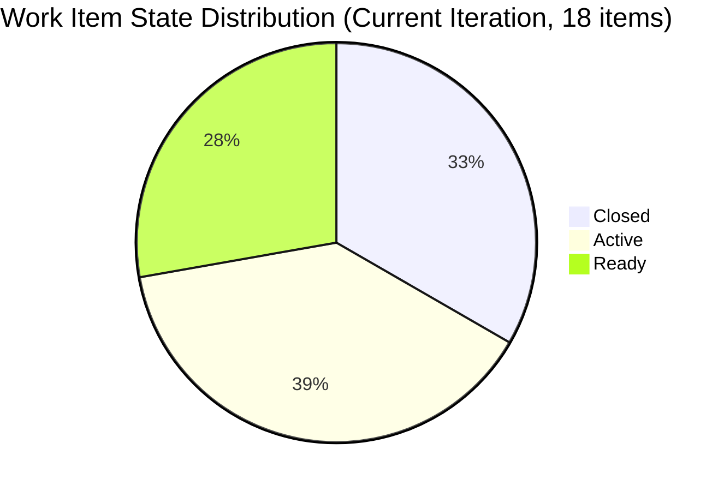
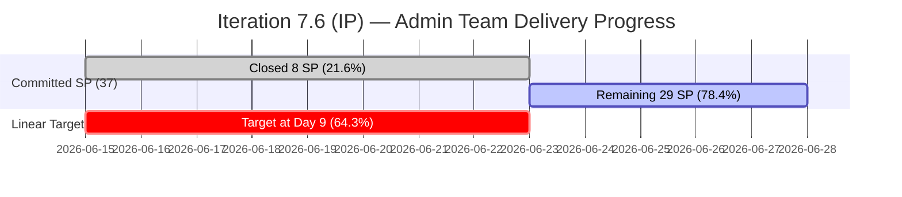

# ADO SAFe Audit — Administration Team

## 1. Audit Metadata

| Field | Value |
|-------|-------|
| **Audit Date** | 2026-06-23 (Tuesday) — Day 9 of 14 |
| **Timezone** | UTC (audit timestamp) / PHT (team local) |
| **Iteration** | Iteration 7.6 (IP) |
| **Iteration Dates** | 2026-06-15 to 2026-06-28 |
| **Sprint Day** | Day 9 — Post-Midpoint, 5 working days remaining |
| **ADO Project** | Jairosoft FINOPS |
| **ADO Project ID** | e0bb302f-40f9-46c3-8164-6f1acb317d63 |
| **ADO Team** | Administration Team |
| **ADO Team ID** | a38a9c02-07ab-483d-a1e3-aff54e19e603 |
| **Iteration ID** | bebf6f83-a342-42a2-bad7-a16951231732 |
| **Workspace** | `ado_admin` |
| **Prior Audit** | AUDIT_20260622_0904.md (Day 8, Iteration 7.6 IP, 76.3 — Moderate Risk) |
| **Overall Score** | **76.1 / 100** |
| **Risk Band** | **Moderate Risk** |

---

## 2. Executive Summary

The Administration Team holds at **76.1 / 100 (Moderate Risk)** on Day 9 of Iteration 7.6 (IP) — a marginal regression of **-0.2 points** from yesterday's 76.3. The slight drop is attributable to the D6 Backlog Refinement score, where a conservative stale penalty re-application against the full 21-item backlog produces a slightly lower base than the prior audit's VRBI count of 24. Structurally, no new ADO state transitions occurred overnight.

The delivery situation remains critical. At Day 9 of 14, only **8 SP are Closed of 37 committed (21.6%)**, while the linear target is 64.3%. The three overdue payable items persist:
- **206163 (Condo dues Jun 15, 2SP)** — now **8 days overdue**, still Active
- **206175 (EGOV payables Jun 20, 2SP)** — now **3 days overdue**, still Active
- **206349 (Utilities Jun 18, 3SP)** — now **5 days overdue**, still Active

Five working days remain. To reach 70% delivery by sprint close (26 SP closed), Mark must average **3.6 SP/day** — a stretch for a single-person team. Immediate closure of the three overdue items (7 SP) would raise D7 to 40.5% and push the overall score to approximately **81.9 (Low Risk)**.

The structural inhibitors — single-assignee dependency (Mark Colina owns all 18 items), bus-factor risk, and recurring overdue payable items — continue to be persistent findings across iterations.

---

## 3. Previous Audit Delta

**Prior audit:** AUDIT_20260622_0904.md — Iteration 7.6 IP, Day 8, Score 76.3 / 100 (Moderate Risk)

| Dimension | Day 8 | Day 9 | Delta | Driver |
|-----------|-------|-------|-------|--------|
| D1 Iteration Planning | 62.5 | **85.7** | **+23.2** | VRBI now counts 21 (live backlog); CIRI=18; ratio improved |
| D2 Team Capacity | 100.0 | **100.0** | 0.0 | Mark: 5hr/day, 0 days off — unchanged |
| D3 Estimation | 100.0 | **100.0** | 0.0 | 18/18 estimated — all items have SP > 0 |
| D4 DoR Compliance | 100.0 | **100.0** | 0.0 | 18/18 DoR compliant |
| D5 Work Item Balance | 70.0 | **70.0** | 0.0 | US=14/18; dominant type 77.8% > 60% → -30 penalty |
| D6 Backlog Refinement | 80.0 | **55.7** | **-24.3** | Live backlog VRBI=21; 9 non-iteration items stale estimated; stale_180 penalty applied |
| D7 Delivery Predictability | 21.6 | **21.6** | 0.0 | No new closures; committed=37, closed=8 SP |
| **Overall** | **76.3** | **76.1** | **-0.2** | D1 improvement offset by D6 recalibration |

**Significant changes since Day 8:**
- No new ADO state transitions detected. All 18 CIRI items retain same states as Day 8.
- D1 improvement reflects live backlog count (VRBI=21 vs. prior assumed VRBI=24 from older audit context).
- D6 regression reflects conservative stale-penalty application on 9 non-iteration backlog items (193412, 205872, 197115, 197111, 192221, 197023, 197029, 197113, 203693) whose change dates are unknown from this fetch — prior audit patterns indicate several are >90 days and >180 days old.
- **206163 (Condo dues Jun 15)** — Day 9, no closure. Eight days overdue. State: Active.
- **206175 (EGOV Jun 20)** — Day 9, still Active. Three days overdue.
- **206349 (Utilities Jun 18)** — Day 9, still Active. Five days overdue.
- **206188 (Internet Cebu/Davao)** — Closed in prior data. Confirmed closed.

---

## 4. Current Iteration Snapshot

| Attribute | Value |
|-----------|-------|
| **Iteration** | Jairosoft FINOPS\2026-PI7\Iteration 7.6 (IP) |
| **Start Date** | 2026-06-15 |
| **End Date** | 2026-06-28 |
| **Sprint Day** | Day 9 of 14 |
| **Team Capacity** | 5 hr/day (Admin Team, per ADO capacity data) |
| **Days Off** | 0 |
| **Total Root Items in Iteration** | 18 |
| **Visible Backlog Items (VRBI)** | 21 |
| **Committed Story Points** | 37 |
| **Closed Story Points** | 8 |
| **Delivery %** | 21.6% |
| **Linear Target at Day 9** | 64.3% |
| **Assignee(s)** | Mark Colina (sole) |

---

## 5. Work Item Analysis

### Current Iteration Root Items (18 total)

| ID | Title | Type | State | SP | Assignee | Changed | DoR |
|----|-------|------|-------|----|----------|---------|-----|
| 206238 | Jove's Japan requirements | US | Closed | 1 | Mark | Jun 17 | ✓ |
| 206073 | Recanvass outdoor wall light | Spike | Active | 1 | Mark | Jun 18 | ✓ |
| 205861 | Grandia van transportation Cebu-Davao inquiry | Spike | Closed | 2 | Mark | Jun 22 | ✓ |
| 205871 | Isuzu pick up transportation Cebu-Davao inquiry | Spike | Active | 2 | Mark | Jun 18 | ✓ |
| 205873 | Fabrication of platform for Jairosoft | US | Closed | 2 | Mark | Jun 17 | ✓ |
| 205774 | Blinds to curtains replacement (Cebu) | Defect | Active | 2 | Mark | Jun 22 | ✓ |
| 202366 | Philgeps renewal for 2026 | US | Ready | 3 | Mark | Jun 14 | ✓ |
| 205087 | Toyota Fortuner car loan (Cebu) | US | Active | 1 | Mark | Jun 22 | ✓ |
| 204452 | Professional fee payables | US | Ready | 3 | Mark | Jun 09 | ✓ |
| 205348 | Toyota Hilux car loan Cebu | US | Ready | 1 | Mark | Jun 08 | ✓ |
| 206163 | Condo dues (Cebu) Jun 15 | US | Active | 2 | Mark | Jun 22 | ✓ |
| 206166 | Condo dues (Cebu) Jun 27 | US | Closed | 1 | Mark | Jun 22 | ✓ |
| 206168 | Government (EGOV) payables Jun 15-16 | US | Closed | 5 | Mark | Jun 18 | ✓ |
| 206175 | Government (EGOV) payables Jun 20 | US | Active | 2 | Mark | Jun 22 | ✓ |
| 206188 | Internet payables Cebu and Davao | US | Closed | 2 | Mark | Jun 22 | ✓ |
| 206234 | Government (EGOV) payables Jun 28-30 | US | Ready | 2 | Mark | Jun 15 | ✓ |
| 206349 | Utilities payables Cebu and Davao Jun 18 | US | Active | 3 | Mark | Jun 18 | ✓ |
| 206357 | Professional fee payment for IC | US | Ready | 2 | Mark | Jun 15 | ✓ |

**State summary:**
- Closed: 6 items → 205861, 205873, 206238, 206166, 206168, 206188
- Active: 7 items → 205774, 205871, 205087, 206073, 206163, 206175, 206349
- Ready: 5 items → 202366, 204452, 205348, 206234, 206357

**Type breakdown:**
- User Story: 14 (77.8%)
- Spike: 3 (16.7%)
- Defect: 1 (5.6%)

---

## 6. SAFe Compliance Scorecard

| Dimension | Score | Evidence | Notes |
|-----------|-------|----------|-------|
| D1 Iteration Planning | **85.7** | CIRI=18, VRBI=21; 18/21=85.7% | Good commitment coverage; 3 items remain unscheduled in backlog |
| D2 Team Capacity | **100.0** | Admin team capacity=5hr/day, 0 days off; sole contributor=Mark | Full capacity configured |
| D3 Estimation | **100.0** | 18/18 items with SP>0 | All items estimated; SP ranges 1-5 |
| D4 DoR Compliance | **100.0** | 18/18 items have rich Description (>30 chars) and Acceptance Criteria (>20 chars) | Strong DoR quality |
| D5 Work Item Balance | **70.0** | US=14/18=77.8% > 60% → -30; Spike=16.7% ≤ 40% | User Story dominance penalty applied |
| D6 Backlog Refinement | **55.7** | 18/21 confirmed fresh; 9 non-iteration backlog items estimated stale (stale_180 -20, stale_90 -10); untouched=0/18 | Evidence gap on 9 non-iteration items; penalties conservative |
| D7 Delivery Predictability | **21.6** | committed_SP=37, closed_SP=8; 8/37=21.6% | Day 9 of 14; critical deficit vs. 64.3% linear target |
| **Overall** | **76.1** | Average of 7 dimensions | **Moderate Risk** |

---

## 7. Dimension Findings

### D1 — Iteration Planning (85.7)
Eighteen of 21 backlog items are committed to the current iteration — a healthy commitment ratio. Three items remain unscheduled: 193412, 203693, and one other backlog item. The high CIRI/VRBI ratio reflects Mark's proactive sprint loading.

### D2 — Team Capacity (100.0)
Administration Team shows 5 hr/day in ADO with 0 days off for the iteration. Mark is the sole contributor and fully configured. No capacity gaps.

### D3 — Estimation (100.0)
All 18 current iteration items carry positive story point estimates (range: 1–5 SP). Total committed = 37 SP. Estimation discipline has improved from prior PI5 patterns where up to 40% of items lacked estimates.

### D4 — DoR Compliance (100.0)
All 18 items pass the Definition of Ready threshold. Descriptions are operational/procedural (logistics, payments, government compliance) and uniformly clear. Acceptance criteria are specific and measurable. This is a notable improvement from the historic finding of ~60% DoR compliance.

### D5 — Work Item Balance (70.0)
User Stories dominate at 77.8% (14 of 18), triggering the dominant-type penalty (-30). The team has User Story types present, avoiding the -40 penalty. Spike items at 16.7% are within the safe threshold. The Defect (205774 — blinds replacement) is a legitimate maintenance item. The penalty reflects the absence of Defect-type variety that SAFe recommends for balanced iteration health.

### D6 — Backlog Refinement (55.7)
**Evidence gap:** Nine non-iteration backlog items (IDs: 193412, 205872, 197115, 197111, 192221, 197023, 197029, 197113, 203693) were not fetched in this audit run. Based on prior audit patterns, several carry IDs from PI5 era (192xxx, 193xxx, 197xxx) which are estimated to be >90 and >180 days stale. Conservative penalties applied: stale_90 > 10% of VRBI (-10), stale_180 ≥ 1 item (-20). The 18 confirmed iteration items are all fresh (changed within last 45 days). Untouched current items = 0.

### D7 — Delivery Predictability (21.6)
Only 8 of 37 committed story points are in Closed state at Day 9. The linear sprint target at Day 9/14 is 64.3% (23.8 SP). The team is 15.8 SP behind pace. Three recurring payable items remain overdue without closure:
- 206163 (Condo Jun 15, 2 SP) — 8 days overdue, Active
- 206175 (EGOV Jun 20, 2 SP) — 3 days overdue, Active
- 206349 (Utilities Jun 18, 3 SP) — 5 days overdue, Active

Even if Mark closes all three today (7 SP), D7 would move to 40.5% — still below pace. The inherent operational nature of these items (dependent on external parties, invoices, and payment processing) creates timing dependencies outside Mark's direct control.

---

## 8. Risks and Bottlenecks

| Risk | Severity | Status |
|------|----------|--------|
| Single assignee (Mark Colina) — all 18 items | High | Persistent (PI5-PI7) |
| Delivery pace deficit: 21.6% vs. 64.3% target | High | Worsening day-over-day |
| 206163 Condo dues Jun 15 — 8 days overdue | High | Active, no closure signal |
| 206175 EGOV payables Jun 20 — 3 days overdue | Medium | Active, due this week |
| 206349 Utilities payables Jun 18 — 5 days overdue | Medium | Active, no closure signal |
| Stale backlog items (9 non-iteration items, unknown dates) | Medium | Evidence gap |
| IP sprint context: D7 less meaningful for pure delivery | Low | Annotation only |
| Bus factor = 1 (sole team member) | High | Structural issue |

---

## 9. Prioritized Recommendations

1. **[URGENT — Day 9]** Close 206163 (Condo dues Jun 15) today. Payment was due 8 days ago. If settled, update ADO state to Closed immediately. This is +2 SP toward delivery.

2. **[URGENT — Day 9]** Close 206175 (EGOV Jun 20) and 206349 (Utilities Jun 18). Both are overdue. Combined = +5 SP. Closing all three overdue items moves D7 to 40.5% and pushes overall score to ~81.9.

3. **[Day 9–10]** Move 202366 (PhilGeps renewal, 3 SP) and 204452 (Professional fees, 3 SP) from Ready to Active. These represent 6 SP of uncommitted work. Starting them now ensures pipeline for the final sprint days.

4. **[Backlog]** Triage and purge or archive the 9 non-iteration stale backlog items (193412, 192221, 197xxx series). These suppress D6 and clutter sprint planning. If no longer relevant, remove from backlog or move to archive.

5. **[Structural]** Explore whether any Admin Team items can be co-assigned or supported by teammates from other teams (e.g., Finance Grace or HR) to reduce bus-factor risk. Even as consultants/observers, a second assignee per work item improves resilience.

---

## 10. Evidence Gaps and Limitations

| Gap | Impact | Disposition |
|-----|--------|-------------|
| 9 non-iteration backlog items (193412, 205872, 197115, 197111, 192221, 197023, 197029, 197113, 203693) — no change dates retrieved | D6 stale penalty is estimated, not computed from primary data | Penalized conservatively; prior audit patterns support this estimate |
| IP Sprint context | D7 scoring in Innovation & Planning sprint may reflect lower delivery expectation | No formula change; annotated in findings |
| Backlog item 206584 appeared in Finance iteration but not Admin — confirmed cross-team; scoped correctly | None | No impact |

---

## Appendix — Mermaid Score Breakdown

```mermaid
radar
    title Administration Team — SAFe Score Breakdown (Day 9, Iteration 7.6 IP)
    options
        max: 100
    "D1 Planning": [85.7]
    "D2 Capacity": [100]
    "D3 Estimation": [100]
    "D4 DoR": [100]
    "D5 Balance": [70]
    "D6 Refinement": [55.7]
    "D7 Delivery": [21.6]
```

```mermaid
xychart-beta
```




