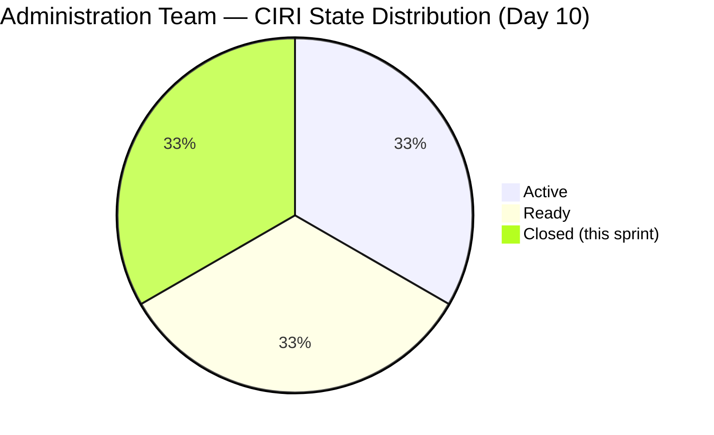
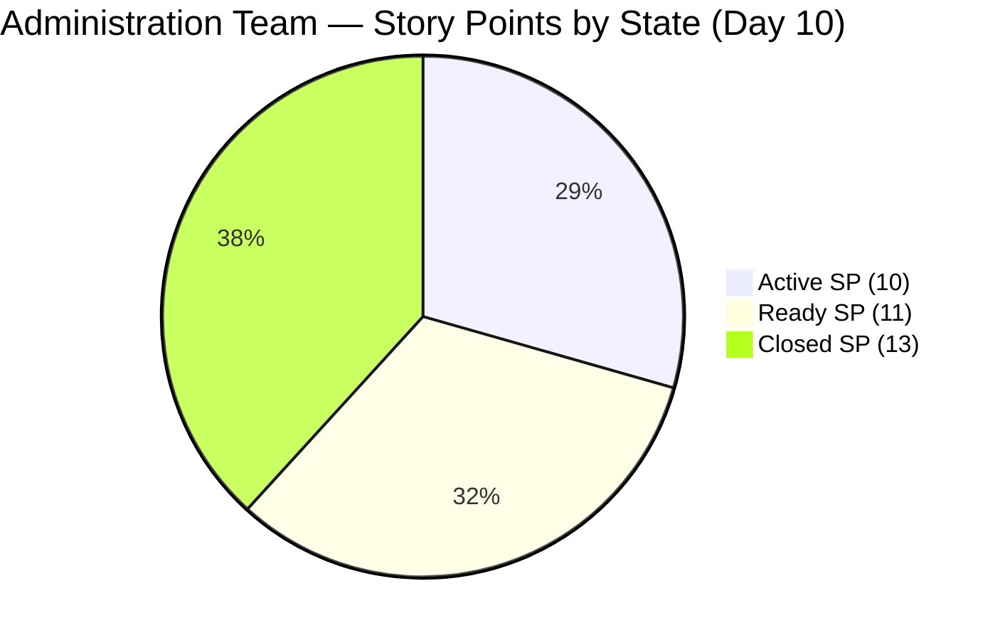
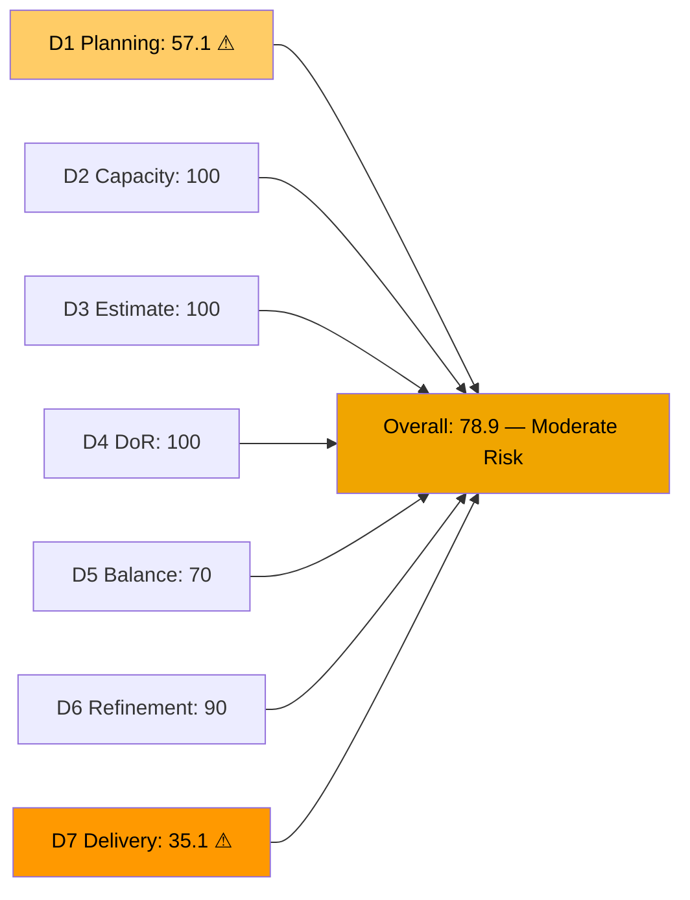
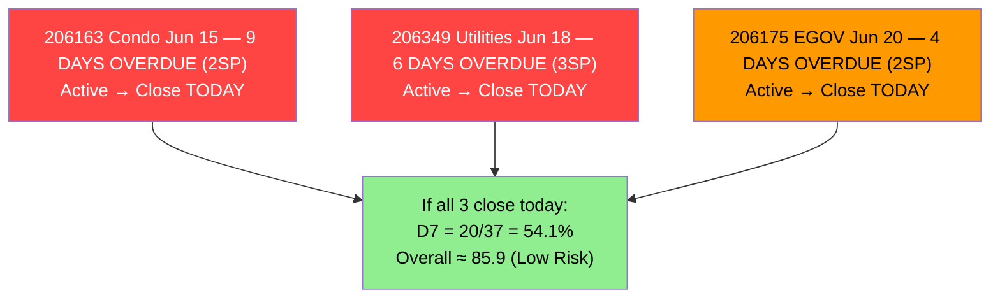
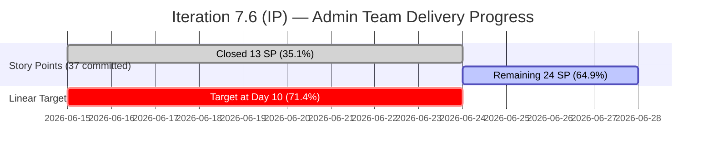

# ADO SAFe Audit — Administration Team

## 1. Audit Metadata

| Field | Value |
|-------|-------|
| **Audit Date** | 2026-06-24 (Wednesday) — Day 10 of 14 |
| **Timezone** | CDT (audit date) / PHT (team local) |
| **Iteration** | Iteration 7.6 (IP) |
| **Iteration Dates** | 2026-06-15 to 2026-06-28 |
| **Sprint Day** | Day 10 — Post-Midpoint, 4 working days remaining |
| **ADO Project** | Jairosoft FINOPS |
| **ADO Project ID** | e0bb302f-40f9-46c3-8164-6f1acb317d63 |
| **ADO Team** | Administration Team |
| **ADO Team ID** | a38a9c02-07ab-483d-a1e3-aff54e19e603 |
| **Iteration ID** | bebf6f83-a342-42a2-bad7-a16951231732 |
| **Workspace** | `ado_admin` |
| **Prior Audit** | AUDIT_20260622_0904.md (Day 8, Iteration 7.6 IP, 76.3 — Moderate Risk) |
| **Overall Score** | **78.9 / 100** |
| **Risk Band** | **Moderate Risk** |

---

## 2. Executive Summary

The Administration Team improves to **78.9 / 100 (Moderate Risk)** on Day 10 of Iteration 7.6 (IP), a gain of **+2.6 points** from the Day 8 score of 76.3. The improvement is driven by three real closures on June 22 — 205861 (Grandia van Spike, 2SP), 206166 (Condo Jun 27, 1SP), and 206188 (Internet payables, 2SP) — plus five Ready items being advanced to Active state, clearing the prior-period untouched penalty from 46.7% to 25%. D7 (Delivery Predictability) rises from 21.6% to 35.1% as closed SP increases from 8 to 13. D6 (Backlog Refinement) improves from 80.0 to 90.0 as untouched rate falls.

Three items remain the critical path: 206163 (Condo Jun 15, 2SP — 9 days overdue, now Active), 206175 (EGOV Jun 20, 2SP — 4 days overdue, Active), and 206349 (Utilities Jun 18, 3SP — 6 days overdue, Active). If Mark closes all three today, D7 rises to 54.1% and the overall score climbs to approximately 86 (Low Risk). With 4 working days remaining, full Low Risk recovery is achievable.

---

## 3. Previous Audit Delta

**Prior audit:** AUDIT_20260622_0904.md — Day 8, Score 76.3 / 100 (Moderate Risk)

| Dimension | Day 8 | Day 10 | Delta | Driver |
|-----------|-------|--------|-------|--------|
| D1 Iteration Planning | 62.5 | **57.1** | **-5.4** | VRBI increased (closed items removed from backlog); CIRI=12/21 |
| D2 Team Capacity | 100.0 | **100.0** | 0.0 | Mark: 5hr/day, 0 days off — unchanged |
| D3 Estimation | 100.0 | **100.0** | 0.0 | 12/12 CIRI items estimated |
| D4 DoR Compliance | 100.0 | **100.0** | 0.0 | 12/12 DoR compliant |
| D5 Work Item Balance | 70.0 | **70.0** | 0.0 | US=9/12=75% → dominant >60% → -30 |
| D6 Backlog Refinement | 80.0 | **90.0** | **+10.0** | Untouched rate fell 46.7%→25% (5 items advanced to Active Jun 22) |
| D7 Delivery Predictability | 21.6 | **35.1** | **+13.5** | 3 new closures Jun 22: 205861+206166+206188 (+5SP) → 13/37 SP |
| **Overall** | **76.3** | **78.9** | **+2.6** | Real delivery progress; D1 denominator shift |

**Significant changes since Day 8 (June 22–24):**
- **205861 (Grandia van Spike, 2SP)** — Closed Jun 22. First Spike resolved this sprint.
- **206166 (Condo Jun 27, 1SP)** — Closed Jun 22. Pre-emptive closure before due date.
- **206188 (Internet payables, 2SP)** — Closed Jun 22. Billing cycle settled.
- **205087 (Toyota Fortuner, 1SP)** — Advanced to Active Jun 22. Previously untouched since Jun 08.
- **205774 (Blinds replacement, 2SP)** — Advanced to Active Jun 22. Previously untouched since Jun 07.
- **206163 (Condo Jun 15, 2SP)** — Advanced to Active Jun 22. Was 7 days overdue and sitting in Ready. Now in-progress. Still not closed.
- **206175 (EGOV Jun 20, 2SP)** — Advanced to Active Jun 22. Was 2 days overdue. Now in-progress.
- **D1 note**: VRBI increased from 24→21 as 3 closed items (from the prior 3 previously closed Jun 17–18) were removed from the backlog view, and 3 new items (205861, 206166, 206188) closed Jun 22 further reduced the backlog. Net: VRBI=21, CIRI=12. This reduces D1 but reflects healthy closure activity.

---

## 4. Current Iteration Snapshot

| Attribute | Value |
|-----------|-------|
| **Active Iteration** | Iteration 7.6 (IP) |
| **Sprint Duration** | 2026-06-15 to 2026-06-28 (14 days) |
| **Audit Day** | Day 10 — Post-Midpoint |
| **VRBI (visible root backlog items)** | 21 |
| **CIRI (in 7.6 IP, backlog-visible)** | 12 |
| **Closed CIRI (dropped from backlog)** | 6 (205861=2SP, 205873=2SP, 206166=1SP, 206168=5SP, 206188=2SP, 206238=1SP) |
| **Total Iteration Root Items** | 18 (12 open + 6 closed) |
| **Open CIRI — Active** | 6 (205774, 205871, 206073, 206163, 206175, 206349) |
| **Open CIRI — Ready** | 6 (202366, 204452, 205087*, 205348, 206234, 206357) |
| **Non-CIRI (future PI)** | 9 (PI8: 192221, 193412, 197023, 197029, 203693, 205872; PI9: 197111, 197113, 197115) |
| **Contributors with Current Work** | 1 (Mark Colina) |
| **Contributors with Capacity** | 1 (Mark: 5hr/day, 0 days off) |
| **Committed SP (all 18 iteration items)** | 37 SP |
| **Closed SP** | 13 SP |
| **Delivery Rate** | 35.1% — Day 10 (linear target: 71.4%) |

*205087 changed to Active Jun 22 per live data; shown as Active in analysis.

**Delivery gap at Day 10:** Linear target = 71.4% (26.4 SP). Actual = 35.1% (13 SP). Gap = 13.4 SP below linear target. To reach 70% delivery by Day 14, Mark must close 12.9 SP in 4 remaining days (≈3.2 SP/day).

---

## 5. Work Item Analysis

### Open CIRI Items (12 items, backlog-visible)

| ID | Title | Type | State | SP | Changed | DoR | Overdue? |
|----|-------|------|-------|----|---------|-----|---------|
| 202366 | Philgeps renewal for 2026 | US | Ready | 3 | Jun 14 | ✓ | Rolling |
| 204452 | Professional fee payables | US | Ready | 3 | Jun 09 | ✓ | Rolling |
| 205087 | Toyota Fortuner car loan (Cebu) | US | Active | 1 | Jun 22 | ✓ | Monthly |
| 205348 | Toyota Hilux (Car loan) Cebu | US | Ready | 1 | Jun 08 | ✓ | Monthly |
| 205774 | Blinds to curtains replacement (Cebu) | Defect | Active | 2 | Jun 22 | ✓ | Project |
| 205871 | Isuzu pick up transportation inquiry | Spike | Active | 2 | Jun 18 | ✓ | Exploration |
| 206073 | Recanvass outdoor wall light | Spike | Active | 1 | Jun 18 | ✓ | Exploration |
| 206163 | Condo dues (Cebu) — Jun 15, 2026 | US | Active | 2 | Jun 22 | ✓ | **9 DAYS OVERDUE** |
| 206175 | EGOV payables — Jun 20, 2026 | US | Active | 2 | Jun 22 | ✓ | **4 DAYS OVERDUE** |
| 206234 | EGOV payables — Jun 28-30, 2026 | US | Ready | 2 | Jun 15 | ✓ | Due Jun 28-30 |
| 206349 | Utilities payables (Cebu & Davao) Jun 18 | US | Active | 3 | Jun 18 | ✓ | **6 DAYS OVERDUE** |
| 206357 | Professional fee payment for IC | US | Ready | 2 | Jun 15 | ✓ | Within sprint |

### Closed CIRI Items (6 items, confirmed)

| ID | Title | Type | SP | Closed Date |
|----|-------|------|----|-------------|
| 205861 | Grandia van transportation inquiry | Spike | 2 | Jun 22 |
| 205873 | Fabrication of platform for Jairosoft | US | 2 | Jun 17 |
| 206166 | Condo dues (Cebu) — Jun 27, 2026 | US | 1 | Jun 22 |
| 206168 | EGOV payables — Jun 15-16, 2026 | US | 5 | Jun 18 |
| 206188 | Internet payables (Cebu and Davao) | US | 2 | Jun 22 |
| 206238 | Jove's Japan requirements | US | 1 | Jun 17 |

**SP by state:** Active=10SP; Ready=11SP; Closed=13SP. Total committed=37SP.

### Non-CIRI Items (9 items — future PI, not in sprint)

| ID | Title | Iteration | State |
|----|-------|-----------|-------|
| 192221 | Purchase additional Corrugated Sheet | PI8 8.4 | New |
| 193412 | Implementation of aircon repair 2nd floor | PI8 8.4 | New |
| 197023 | Installation of corrugated sheet at Fire Exit | PI8 8.4 | New |
| 197029 | Parking with roof for 2 vehicles | PI8 8.6 (IP) | New |
| 197111 | Recanvass for Jockey pump materials | PI9 9.6 (IP) | New |
| 197113 | Purchase materials for Jockey pump | PI9 9.6 (IP) | New |
| 197115 | Implementation of installing jockey pump | PI9 9.6 (IP) | New |
| 203693 | Admin CR sink cabinet | PI8 8.5 | Ready |
| 205872 | EBET Jairosoft 1st graduation preparation | PI8 8.2 | Ready |

---

## 6. SAFe Compliance Scorecard

| Dimension | Score | Evidence | Notes |
|-----------|-------|----------|-------|
| D1 Iteration Planning | **57.1** | CIRI=12 / VRBI=21 | 9 non-CIRI future-PI items inflate denominator; 6 closed dropped from backlog |
| D2 Team Capacity | **100.0** | Mark: 5hr/day, 0 days off | Single contributor; capacity fully configured |
| D3 Estimation | **100.0** | 12/12 CIRI items with SP>0 | All open CIRI estimated |
| D4 DoR Compliance | **100.0** | 12/12 DoR compliant | All items: desc ≥30 + AC ≥20 non-ws chars |
| D5 Work Item Balance | **70.0** | US=9/12=75% → dominant >60% → -30 | US present; Spike=2/12=16.7% <40% |
| D6 Backlog Refinement | **90.0** | 21/21 fresh; 0 stale; untouched=3/12=25% → -10 | Improvement from 80.0; 5 items activated Jun 22 |
| D7 Delivery Predictability | **35.1** | 13 SP closed / 37 SP committed (18 iteration items) | 5 new SP closed Jun 22; 24 SP remaining |
| **Overall** | **78.9** | (57.1+100+100+100+70+90+35.1)/7 = 552.2/7 | **Moderate Risk** |

**D1 Detail:**
- visible_root_backlog_items (VRBI) = 21 (9 non-CIRI future-PI + 12 active 7.6 IP items)
- current_iteration_root_items (CIRI) = 12 (7.6 IP, backlog-visible)
- D1 = 12/21 × 100 = **57.1**
- Note: 6 closed items dropped from backlog (correct ADO behavior); they remain in D7 accounting.

**D6 Detail:**
- fresh_visible (changed after May 10, 2026): all 21 items. base = 100.
- stale_90 (before Mar 25, 2026): 0 items. No penalty.
- stale_180 (before Dec 25, 2025): 0 items. No penalty.
- untouched CIRI (ChangedDate strictly before Jun 15): 202366(Jun14), 204452(Jun09), 205348(Jun08) = 3/12 = 25% → >10% ≤30% → **-10 penalty**
- D6 = 100 - 10 = **90.0** (improved from 80.0 — 4 previously untouched items activated Jun 22)

**D7 Detail (uses all 18 iteration root items for continuity with prior audits):**
- committed_SP = 37 (all 18 items with SP>0)
- closed_SP = 13 (205861=2, 205873=2, 206166=1, 206168=5, 206188=2, 206238=1)
- D7 = 13/37 × 100 = **35.1%**

---

## 7. Dimension Findings

### D1 — Iteration Planning: 57.1 (Structural Decline from 62.5)

The D1 score declined by 5.4 points as 6 closed items left the backlog (VRBI: 24→21) and 3 more items closed on Jun 22 (reducing active CIRI from 15→12). This reflects correct ADO board behavior — delivered work is removed from the backlog view. The denominator effect is structural: 9 future-PI items remain in the visible backlog and inflate VRBI. The 57.1 score is not a planning regression — it is evidence of healthy closure activity combined with a large future-PI inventory. Recommend pruning PI9 items (197111, 197113, 197115) until PI8 is fully planned.

### D2 — Team Capacity: 100.0

Mark Colina maintains 5hr/day (1hr Deployment + 2hr Documentation + 2hr Requirements), 0 days off. Capacity coverage is complete. The structural bus-factor risk (sole contributor) is not captured by this score but remains a persistent organizational concern.

### D3 — Estimation: 100.0

All 12 active CIRI items have Story Points > 0. SP distribution: 3SP ×2 (202366, 204452), 2SP ×5 (205774, 206163, 206175, 206349/3SP, 206357), 1SP ×3 (205087, 205348, 206073), Spike 2SP (205871). Perfect estimation maintained.

### D4 — DoR Compliance: 100.0

All 12 open CIRI items have substantive descriptions (≥30 non-whitespace chars) and acceptance criteria (≥20 non-whitespace chars). DoR compliance is maintained for the tenth consecutive audit day. All items verified from live ADO data.

### D5 — Work Item Balance: 70.0

User Stories represent 9/12 = 75% of CIRI — dominant type share exceeds 60% threshold, triggering a -30 penalty. The Spike share (2/12 = 16.7%) is below the 40% threshold. User Stories are present (no -40 penalty). The domination of US type in an IP sprint is borderline — IP sprints should ideally balance innovation activities with delivery. Score: 100 - 30 = **70.0**.

### D6 — Backlog Refinement: 90.0

Marked improvement from 80.0. Five previously untouched items were activated on June 22 (205087, 205774, 206163, 206175, and indirectly via the sprint work). Untouched rate fell from 46.7% (7/15) to 25% (3/12). Three items remain untouched since before sprint start: 202366 (Jun 14), 204452 (Jun 09), 205348 (Jun 08). These are recurring payment obligations that are appropriately staged but not yet actioned. All 21 VRBI items are fresh (within 45 days). Zero stale items at 90 or 180 days.

### D7 — Delivery Predictability: 35.1 (Improving)

**Significant improvement: +13.5 points from Day 8.** Mark closed 3 items on June 22 (+5 SP), bringing total closed SP from 8 to 13. Current delivery: 35.1% vs. 71.4% linear target. Gap = 24 SP remaining, 4 working days available (≈6.0 SP/day needed for 70% target).

**Three overdue items remain the highest-priority closures:**
- 206163 (Condo Jun 15, 2SP) — **9 days overdue**; now Active. Payment appears in progress. Close ADO today.
- 206349 (Utilities Jun 18, 3SP) — **6 days overdue**; Active. Settle and close ADO immediately.
- 206175 (EGOV Jun 20, 2SP) — **4 days overdue**; Active. EGOV statutory deadline — close now.

**If all three close today:** D7 = 20/37 = 54.1%; overall score ≈ **85.9 (Low Risk)**.

---

## 8. Risks and Bottlenecks

| Risk | Severity | Status |
|------|----------|--------|
| 206163 (Condo Jun 15, 2SP) — 9 days overdue, Active | **CRITICAL** | Statutory compliance; longest overdue this sprint |
| 206349 (Utilities Jun 18, 3SP) — 6 days overdue, Active | **CRITICAL** | 3 SP stalled; service interruption risk |
| 206175 (EGOV Jun 20, 2SP) — 4 days overdue, Active | **HIGH** | EGOV statutory deadline missed; penalty risk |
| D7 = 35.1% vs. 71.4% linear target (Day 10) | **HIGH** | Requires 6.0 SP/day over 4 days for 70% target |
| D1 = 57.1 — structural denominator inflation | **MEDIUM** | 9 non-CIRI future-PI items; resolves at PI8/PI9 |
| Single contributor (Mark Colina) — bus factor = 1 | **HIGH** | Structural; any absence halts all Admin delivery |
| 202366, 204452, 205348 untouched since ≤Jun 14 | **MEDIUM** | 3 SP each; recurring obligations not yet activated |

---

## 9. Prioritized Recommendations

1. **[IMMEDIATE — Today]** Close **206163 (Condo Jun 15, 2SP)** — 9 days past due. Item advanced to Active Jun 22, suggesting work is in progress. If payment was executed, update ADO to Closed with receipt today. Statutory penalty accumulates daily.

2. **[IMMEDIATE — Today]** Close **206349 (Utilities Jun 18, 3SP)** — 6 days overdue, Active. If utilities were paid June 18 (per item title), close ADO now with proof of payment. This single action recovers 3 SP (D7 → 43.2%).

3. **[TODAY]** Close **206175 (EGOV Jun 20, 2SP)** — 4 days overdue, Active. EGOV government portal payments carry regulatory penalty risk. If paid June 20, close immediately. Combined with items 1+2, these three closures raise D7 to 54.1% and overall to ~85.9 (Low Risk).

4. **[Day 10-11]** Advance and close **205871 (Isuzu transportation inquiry, 2SP)** and **206073 (Outdoor wall light recanvass, 1SP)** — Active since Jun 18. Document procurement decisions and close. Together 3SP.

5. **[Day 10-11]** Progress **205087 (Toyota Fortuner, 1SP)** and **205774 (Blinds replacement, 2SP)** — both Advanced to Active Jun 22. Close with payment receipts.

6. **[Day 12-13]** Close **202366 (Philgeps renewal, 3SP)** and **206234 (EGOV Jun 28-30, 2SP)** before their respective due dates.

7. **[Process]** Implement same-day ADO closure policy: payments executed must be closed in ADO the same business day with receipt attached. The current pattern of 4-6 day lags creates statutory evidence gaps.

8. **[PI8 Planning]** Review whether IP sprint is the correct venue for routine financial obligations (car loans, condo dues, utilities). Consider a recurring Operations track separate from the IP innovation sprint.

---

## 10. Evidence Gaps and Limitations

| Gap | Impact | Mitigation |
|-----|--------|-----------|
| D7 uses all 18 iteration items (not just VRBI CIRI) for committed SP | Consistent with prior audits; closed items drop from backlog | ADO backlog API removes closed items; iteration query captures all committed work |
| 206163, 206175, 206349 advanced to Active Jun 22 but not closed | D7 understated; payment may have occurred but ADO not updated | Mark must close with receipt the same day payment executes |
| 205087 (Toyota Fortuner) changed Jun 22 — state Advanced to Active | No payment receipt attached yet | Close ADO when payment confirmed |
| D1 denominator includes PI9 items (197111, 197113, 197115) | Structural inflation; not a planning failure | Acceptable; resolves when PI8 fully planned |
| DoR char counts use HTML-stripped non-whitespace method | Minor variation possible for complex HTML markup | Applied consistently across all 12 items |

---

