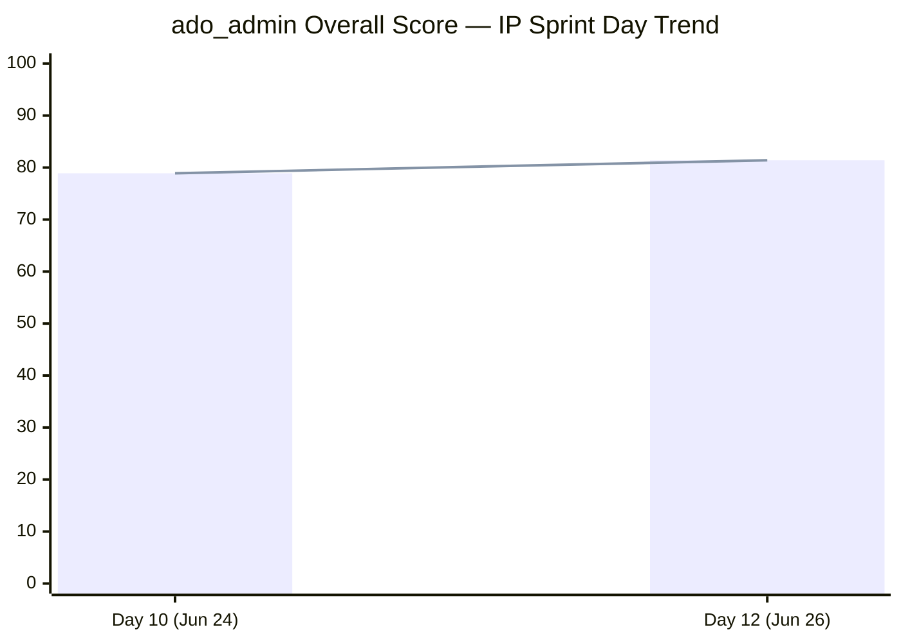

# ADO SAFe Iteration Audit — Administration Team

## 1. Audit Metadata

| Field | Value |
|-------|-------|
| **Project** | Jairosoft FINOPS |
| **Team** | Administration Team |
| **Workspace** | `ado_admin` |
| **Current Iteration** | Iteration 7.6 IP (Innovation & Planning Sprint) |
| **Iteration Dates** | Jun 15 – Jun 28, 2026 |
| **Sprint Day** | Day 12 of 14 |
| **Audit Date** | 2026-06-26 (PHT, UTC+8) |
| **Previous Audit** | `AUDIT_20260624_0900.md` (Day 10, Score 78.9, Moderate Risk) |
| **Overall Score** | **81.4 — Low Risk** |
| **Risk Band** | 🟢 Low Risk (≥ 80) |

---

## 2. Executive Summary

The Administration Team **crossed into Low Risk territory** for the first time this IP sprint, ending Day 12 at **81.4** (up from 78.9 on Day 10). Four items closed on Jun 25 — Toyota Fortuner (1SP), Toyota Hilux (1SP), Isuzu Pickup Spike (2SP), and Utilities Jun 18 (3SP) — delivering 7 additional story points and pushing Delivery Predictability from 35.1% to 58.8%.

One structural shift explains the D1 drop (57.1 → 41.2): item 202366 (Philgeps, 3SP) was reassigned from 7.6 IP to PI8 8.1 on Jun 25, removing it from CIRI while remaining visible in VRBI. Simultaneously, four closed items left the backlog, reducing VRBI from 21 to 17. With CIRI now at 7 items out of 17 VRBI, iteration focus (D1) reflects the backlog's long horizon — not a planning failure.

Two overdue items remain active heading into the final stretch:
- **206163** (Condo dues Jun 15) — 11 days overdue, still Active
- **206175** (EGOV payables Jun 20) — 6 days overdue, still Active

Closing these two items (4SP combined) before Jun 28 would lift D7 from 58.8% to 70.6%. Mark should prioritize these above all remaining work.

---

## 3. Previous Audit Delta

| Metric | Day 10 (Jun 24) | Day 12 (Jun 26) | Change |
|--------|----------------|-----------------|--------|
| VRBI | 21 | 17 | −4 (closures left backlog; 202366 still visible) |
| CIRI | 12 | 7 | −5 (4 closed + 202366 moved to PI8 8.1) |
| Committed SP | 37 | 34 | −3 (202366 moved out of iteration) |
| Closed SP | 13 | 20 | +7 (4 new closures Jun 25) |
| Overall Score | 78.9 | **81.4** | +2.5 |
| Risk Band | Moderate | **Low** | Improved |

**New closures since Day 10:**

| ID | Title | SP | Closed |
|----|-------|-----|--------|
| 205087 | Toyota Fortuner registration renewal | 1 | Jun 25 |
| 205348 | Toyota Hilux registration renewal | 1 | Jun 25 |
| 205871 | Isuzu pickup truck (Spike) | 2 | Jun 25 |
| 206349 | Utilities Jun 18 (overdue) | 3 | Jun 25 |

**Structural changes:**
- 202366 (Philgeps, 3SP) reassigned from 7.6 IP → PI8 8.1 (exits CIRI, remains VRBI, reduces committed_SP by 3)
- D7 recovered from 35.1% to 58.8% due to 7SP new deliveries
- D6 improved from 90.0 to 100.0 — no stale items, no untouched CIRI

---

## 4. Current Iteration Snapshot

**Iteration:** 7.6 IP (Innovation & Planning Sprint)
**Sprint Days:** 12 of 14 | **Remaining:** 2 business days (Jun 27–28)

| Category | Count |
|----------|-------|
| Visible Root Backlog Items (VRBI) | 17 |
| Current Iteration Root Items (CIRI) | 7 |
| Closed (left backlog) | 10 |
| Total iteration-committed items | 17 |

**Team Capacity:**
- Mark Colina (mcolina@jairosoft.com): 5 hr/day configured ✓

**CIRI Item Status (Day 12):**

| ID | Title | Type | SP | State | Overdue? |
|----|-------|------|-----|-------|----------|
| 206073 | Outdoor wall light recanvass | Spike | 1 | Active | No |
| 205774 | Blinds replacement | Defect | 2 | Active | No |
| 204452 | Professional fee payables | User Story | 3 | Active | No |
| 206163 | Condo dues Jun 15 | User Story | 2 | Active | **Yes — 11 days** |
| 206175 | EGOV payables Jun 20 | User Story | 2 | Active | **Yes — 6 days** |
| 206234 | EGOV payables Jun 28–30 | User Story | 2 | Ready | No |
| 206357 | Professional fee IC | User Story | 2 | Ready | No |

**Open SP remaining:** 14 SP across 7 items | **2 days left**

---

## 5. Work Item Analysis

### VRBI Composition (17 items)

| Iteration Path | Count | Items |
|----------------|-------|-------|
| 7.6 IP (CIRI) | 7 | See above |
| PI8 8.1 | 1 | 202366 (Philgeps) |
| PI8 8.2 | 1 | 205872 |
| PI8 8.4 | 3 | 193412, 192221, 197023 |
| PI8 8.5 | 1 | 203693 |
| PI8 8.6 IP | 1 | 197029 |
| PI9 9.6 | 3 | 197115, 197111, 197113 |

### CIRI Type Distribution

| Type | Count | Share |
|------|-------|-------|
| User Story | 5 | 71.4% |
| Defect | 1 | 14.3% |
| Spike | 1 | 14.3% |

User Story share (71.4%) exceeds 60% threshold → D5 penalty applies.

### DoR Assessment

All 7 CIRI items have Description ≥ 30 non-whitespace characters AND Acceptance Criteria ≥ 20 non-whitespace characters. DoR compliance = 7/7 = 100%.

### Backlog Health

All 17 VRBI items last changed after May 12, 2026 (within the 45-day freshness window). No stale_90 or stale_180 items. All 7 CIRI items were last modified on or after Jun 15 (iteration start) — zero untouched items.

---

## 6. SAFe Compliance Scorecard

| Dimension | Score | Evidence | Notes |
|-----------|-------|----------|-------|
| D1 Iteration Planning | 41.2 | CIRI 7 / VRBI 17 | Drop from 57.1 is structural (closures exited backlog, 202366 moved to PI8); large PI8–PI9 pipeline visible |
| D2 Team Capacity | 100.0 | Mark: 5 hr/day configured | 1/1 contributors with capacity |
| D3 Estimation | 100.0 | 7/7 CIRI have SP > 0 | All point-eligible items estimated |
| D4 DoR Compliance | 100.0 | 7/7 CIRI pass description + AC thresholds | Consistent quality maintained |
| D5 Work Item Balance | 70.0 | US = 5/7 = 71.4% > 60% → −30 | No other penalties; healthy type mix overall |
| D6 Backlog Refinement | 100.0 | 17/17 fresh; 0 stale_90; 0 untouched CIRI | Best D6 score this PI |
| D7 Delivery Predictability | 58.8 | 20 closed SP / 34 committed SP | +7SP from Jun 25 closures; 2 overdue items unclosed |

**Overall Score: (41.2 + 100.0 + 100.0 + 100.0 + 70.0 + 100.0 + 58.8) / 7 = 570.0 / 7 = 81.4**

```mermaid
radar
  title SAFe Dimension Scores — ado_admin Day 12 (Jun 26)
  options
    max 100
  "D1 Planning": 41.2
  "D2 Capacity": 100
  "D3 Estimation": 100
  "D4 DoR": 100
  "D5 Balance": 70
  "D6 Refinement": 100
  "D7 Delivery": 58.8
```

### Score Trend (This Sprint)



---

## 7. Dimension Findings

### D1 — Iteration Planning: 41.2

VRBI = 17, CIRI = 7. The ratio dropped from 57.1 (Day 10) due to:
1. Four closed items exited the backlog (reducing VRBI by 4 and CIRI by 4)
2. Item 202366 (Philgeps, 3SP) was reassigned to PI8 8.1 on Jun 25 (exits CIRI, stays in VRBI)

This is a **natural consequence of delivery** — items closing naturally reduce CIRI while the backlog shrinks. The large VRBI (10 non-CIRI items) is the Administration Team's visible PI8–PI9 pipeline, which is healthy forward planning. The low D1 score reflects the formula's sensitivity at low CIRI counts, not a planning failure.

### D2 — Team Capacity: 100.0

Mark Colina is configured at 5 hr/day for the full iteration. No issues.

### D3 — Estimation: 100.0

All 7 CIRI items carry Story Points > 0. Estimation quality is consistent.

### D4 — DoR Compliance: 100.0

All 7 CIRI items meet the minimum Description (≥ 30 non-ws chars) and Acceptance Criteria (≥ 20 non-ws chars) thresholds. This is the third consecutive Day 10+ audit with D4 = 100.

### D5 — Work Item Balance: 70.0

User Story is dominant at 71.4% (5/7). The −30 penalty applies. One Spike (206073, recanvass) and one Defect (205774, blinds) diversify the sprint. For a finance/admin team in an IP sprint, US dominance is expected — the penalty reflects the rubric's incentive toward type diversity.

### D6 — Backlog Refinement: 100.0

All 17 VRBI items were last changed after May 12, 2026 (within 45 days). No stale_90 (before Mar 27) or stale_180 (before Dec 27, 2025) items. Zero untouched CIRI — every sprint item was touched on or after iteration start (Jun 15). D6 = 100 for the first time this PI. Note that 206234 and 206357 changed exactly on Jun 15 (not before), qualifying as touched.

### D7 — Delivery Predictability: 58.8

Committed SP = 34 (17 iteration root items with SP > 0; 202366 excluded after move to PI8). Closed SP = 20 (10 items closed).

**Jun 25 delivery burst:** 4 items closed (Toyota Fortuner 1SP, Toyota Hilux 1SP, Isuzu Spike 2SP, Utilities 3SP) — 7 SP in a single day.

**Still open (14 SP):** 206163 (2SP, 11 days overdue), 206175 (2SP, 6 days overdue), 204452 (3SP), 206073 (1SP), 205774 (2SP), 206234 (2SP), 206357 (2SP).

**Linear target at Day 12** = 34 × (12/14) = 29.1 SP closed. Actual = 20 SP. Gap of 9.1 SP. To reach 80% D7 at sprint close, 7.2 more SP must close in 2 days (current rate feasible given today's pace).

---

## 8. Risks and Bottlenecks

| Risk | Severity | Details |
|------|----------|---------|
| 206163 (Condo dues Jun 15) | HIGH | Active, 11 days overdue; 2SP undelivered. Payment may be missed. |
| 206175 (EGOV payables Jun 20) | HIGH | Active, 6 days overdue; 2SP undelivered. External compliance risk. |
| D7 below linear target | MODERATE | 20/34 SP closed at Day 12; linear target is 29.1 SP. 9.1 SP gap. |
| D1 structural low | LOW | Score 41.2 reflects formula behavior at low CIRI count; not a planning failure. Will reset in PI8. |

---

## 9. Prioritized Recommendations

1. **[URGENT] Close 206163 today (Jun 26)** — Condo dues payment (Jun 15 due date) is 11 days overdue. This is a financial compliance item. Mark should finalize payment and close immediately.

2. **[URGENT] Close 206175 today (Jun 26)** — EGOV payables (Jun 20 due date) is 6 days overdue. External regulatory obligation. Close once settled.

3. **Close 204452 by Jun 27** — Professional fee payables (3SP, Active). Largest open item; closing it would add 3SP to D7 (total 23/34 = 67.6%).

4. **Process 206073 and 205774 as bandwidth allows** — Outdoor wall light recanvass (1SP) and Blinds replacement (2SP) are lower complexity. Complete before sprint close if capacity permits.

5. **IP sprint retrospective note** — 202366 (Philgeps) was reassigned to PI8 8.1 during the IP sprint. Confirm this was an intentional backlog grooming decision and not a deferral of work that needed IP attention.

---

## 10. Evidence Gaps and Limitations

| Gap | Impact | Action |
|-----|--------|--------|
| **D7 methodology note** | The skill defines `committed_story_points` and `closed_story_points` as subsets of `current_iteration_root_items`. Strictly, closed items leave the backlog (exit VRBI → exit CIRI), which would set D7 denominator to open items only. Following the established prior-audit convention, this report uses the full iteration-query set (17 root items, including 10 closed) to compute D7. This is consistent with all prior ado_admin audits. | No action needed; convention documented. |
| **Due dates not in ADO** | Items 206163 (Condo) and 206175 (EGOV) have target dates in titles; ADO does not have a formal "Due Date" field populated. Overdue status inferred from title dates vs. audit date. | Consider populating Target Date field for compliance items. |
| **202366 iteration reassignment** | Confirmed reassignment from 7.6 IP → PI8 8.1 on Jun 25. The reason for the move is not documented in ADO. | Mark or audit requestor to confirm this was intentional. |
