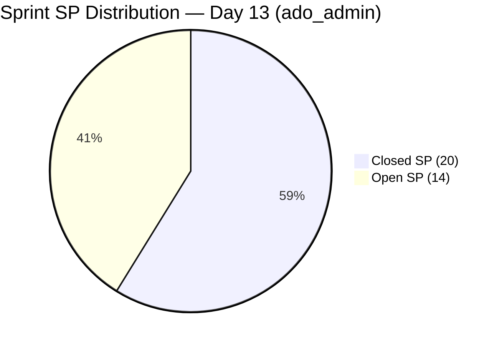

# ADO SAFe Iteration Audit — Administration Team

## 1. Audit Metadata

| Field | Value |
|-------|-------|
| **Project** | Jairosoft FINOPS |
| **Team** | Administration Team |
| **Workspace** | `ado_admin` |
| **ADO Project ID** | e0bb302f-40f9-46c3-8164-6f1acb317d63 |
| **ADO Team ID** | a38a9c02-07ab-483d-a1e3-aff54e19e603 |
| **Current Iteration** | Iteration 7.6 IP (Innovation & Planning Sprint) |
| **Iteration ID** | bebf6f83-a342-42a2-bad7-a16951231732 |
| **Iteration Dates** | Jun 15 – Jun 28, 2026 |
| **Sprint Day** | Day 13 of 14 |
| **Audit Date** | 2026-06-27 09:00 (PHT, UTC+8) |
| **Previous Audit** | `AUDIT_20260626_0900.md` (Day 12, Score 81.4, Low Risk) |
| **Overall Score** | **81.4 — Low Risk** |
| **Risk Band** | Low Risk (≥ 80) |

---

## 2. Executive Summary

The Administration Team holds at **81.4** (Low Risk) on Day 13 — the final full work day before the sprint closes on Jun 28. No new closures have been recorded since the Jun 25 delivery burst (4 items, 7SP). The score is unchanged from Day 12 because ADO data shows all 7 CIRI items remain in their same states.

Two overdue items — **206163** (Condo dues Jun 15, 12 days overdue) and **206175** (EGOV payables Jun 20, 7 days overdue) — remain Active and represent the highest-urgency compliance obligations heading into the last day. Closing these two items alone would add 4SP to D7, pushing it from 58.8% to 70.6% (70.6% = 24/34).

Mark Colina has five items to close in the remaining 1–2 days: 206163 (2SP), 206175 (2SP), 204452 (3SP), 206073 (1SP), and 205774 (2SP) — a total of 10SP. The two overdue payment items should be treated as Day 1 priority. If Mark can close 206163, 206175, and 204452 (7SP), D7 rises to 79.4%, still Moderate but vastly improved. Closing all 5 would bring D7 to 88.2% and overall to 89.7 (Low Risk).

---

## 3. Previous Audit Delta

| Metric | Day 12 (Jun 26) | Day 13 (Jun 27) | Change |
|--------|-----------------|-----------------|--------|
| VRBI | 17 | 17 | 0 (no new closures) |
| CIRI | 7 | 7 | 0 |
| Committed SP | 34 | 34 | 0 |
| Closed SP | 20 | 20 | 0 |
| Overall Score | 81.4 | **81.4** | Flat |
| Risk Band | Low | **Low** | Unchanged |

**New closures since Day 12:** None. All 7 CIRI items remain at their Day 12 states.

**Item state unchanged since Day 12:**
- 206073 (Spike, 1SP): Active — last changed Jun 18
- 205774 (Defect, 2SP): Active — last changed Jun 22
- 204452 (User Story, 3SP): Active — last changed Jun 24
- 206163 (User Story, 2SP): Active — last changed Jun 22 (12 days overdue as of today)
- 206175 (User Story, 2SP): Active — last changed Jun 22 (7 days overdue as of today)
- 206234 (User Story, 2SP): Ready — last changed Jun 15
- 206357 (User Story, 2SP): Ready — last changed Jun 15

---

## 4. Current Iteration Snapshot

**Iteration:** 7.6 IP (Innovation & Planning Sprint)
**Sprint Days:** 13 of 14 | **Remaining:** 1 business day (Jun 28)

| Category | Count |
|----------|-------|
| Visible Root Backlog Items (VRBI) | 17 |
| Current Iteration Root Items (CIRI) | 7 |
| Closed (left backlog) | 10 |
| Total iteration-committed root items | 17 |

**Team Capacity:**
- Mark Colina (mcolina@jairosoft.com): 5 hr/day configured (1 Deployment + 2 Documentation + 2 Requirements)
- Total days off: 0

**CIRI Item Status (Day 13):**

| ID | Title | Type | SP | State | Days Overdue |
|----|-------|------|-----|-------|-------------|
| 206073 | Recanvass outdoor wall light | Spike | 1 | Active | — |
| 205774 | Blinds to curtains replacement (Cebu) | Defect | 2 | Active | — |
| 204452 | Professional fee payables | User Story | 3 | Active | — |
| 206163 | Condo dues (Cebu) payables Jun 15 | User Story | 2 | Active | **12 days** |
| 206175 | Government (EGOV) payables Jun 20 | User Story | 2 | Active | **7 days** |
| 206234 | EGOV payables Jun 28–30 | User Story | 2 | Ready | — |
| 206357 | Professional fee payment for IC | User Story | 2 | Ready | — |

**Open SP remaining:** 14 SP across 7 items | **1 day left**

---

## 5. Work Item Analysis

### VRBI Composition (17 items)

| Iteration Path | Count | Item IDs |
|----------------|-------|----------|
| 7.6 IP (CIRI) | 7 | 204452, 205774, 206073, 206163, 206175, 206234, 206357 |
| PI8 8.1 | 1 | 202366 (Philgeps, moved Jun 25) |
| PI8 8.2 | 1 | 205872 (EBET graduation) |
| PI8 8.4 | 3 | 192221, 193412, 197023 |
| PI8 8.5 | 1 | 203693 (Admin CR sink cabinet) |
| PI8 8.6 (IP) | 1 | 197029 (Parking with roof) |
| PI9 9.6 (IP) | 3 | 197111, 197113, 197115 (Jockey pump suite) |

### CIRI Type Distribution

| Type | Count | Share |
|------|-------|-------|
| User Story | 5 | 71.4% |
| Defect | 1 | 14.3% |
| Spike | 1 | 14.3% |

Dominant type: User Story at 71.4% — exceeds 60% threshold (D5 penalty applies).

### DoR Assessment

| ID | Description ≥30 chars | AC ≥20 chars | DoR |
|----|----------------------|--------------|-----|
| 206073 | Conduct recanvass of outdoor wall light... ✓ | At least three supplier quotations obtained... ✓ | PASS |
| 205774 | Replacement of existing window blinds... ✓ | Existing blinds removed without damage... ✓ | PASS |
| 204452 | Processing of professional fee payables... ✓ | Complete supporting documents submitted... ✓ | PASS |
| 206163 | Scheduled payment of condominium association dues... ✓ | Condo dues statement received and verified... ✓ | PASS |
| 206175 | All financial obligations to government agencies... ✓ | All EGOV payables fully processed... ✓ | PASS |
| 206234 | All financial obligations via EGOV system... ✓ | Timely Settlement: All EGOV payables processed... ✓ | PASS |
| 206357 | Process the payment of professional fee for IC... ✓ | Professional fee amount verified against contract... ✓ | PASS |

DoR compliance = 7/7 = **100%**

### Backlog Age Analysis

All 17 VRBI items last changed after May 13, 2026 (within the 45-day freshness window):
- Earliest change date in VRBI: Jun 07 (203693 — fresh)
- No stale_90 items (before Mar 29, 2026)
- No stale_180 items (before Dec 30, 2025)

**Untouched CIRI** (ChangedDate before Jun 15, iteration start): None — all 7 CIRI items changed on or after Jun 15.

---

## 6. SAFe Compliance Scorecard

| Dimension | Score | Evidence | Notes |
|-----------|-------|----------|-------|
| D1 Iteration Planning | 41.2 | CIRI 7 / VRBI 17 | 10 non-CIRI items are healthy PI8–PI9 pipeline; score reflects formula sensitivity at low CIRI count |
| D2 Team Capacity | 100.0 | Mark: 5 hr/day configured (3 activities) | 1/1 contributors with capacity |
| D3 Estimation | 100.0 | 7/7 CIRI with SP > 0 | All point-eligible items estimated |
| D4 DoR Compliance | 100.0 | 7/7 CIRI pass description + AC thresholds | Third consecutive Day 10+ audit at 100% |
| D5 Work Item Balance | 70.0 | US = 5/7 = 71.4% > 60% → −30 | No User Story absent penalty; no Spike >40% penalty |
| D6 Backlog Refinement | 100.0 | 17/17 fresh; 0 stale_90; 0 untouched CIRI | Perfect backlog health |
| D7 Delivery Predictability | 58.8 | 20 closed SP / 34 committed SP | No closures since Jun 25; 14SP open; 1 day left |

**Overall Score: (41.2 + 100.0 + 100.0 + 100.0 + 70.0 + 100.0 + 58.8) / 7 = 570.0 / 7 = 81.4**

```mermaid
radar
  title SAFe Dimension Scores — ado_admin Day 13 (Jun 27)
  options
    max 100
  "D1 Planning": 41.2
  "D2 Capacity": 100
  "D3 Estimation": 100
  "D4 DoR": 100
  "D5 Balance": 70
  "D6 Refinement": 100
  "D7 Delivery": 58.8
```

### D7 Closing Scenarios (Day 13 — 1 Day Remaining)

| Scenario | Items Closed | Closed SP Total | D7% | Overall Score |
|----------|-------------|-----------------|-----|---------------|
| No action (current) | — | 20 | 58.8% | 81.4 |
| Close 206163 + 206175 (+4SP) | 2 | 24 | 70.6% | 83.0 |
| Close above + 204452 (+3SP) | 3 | 27 | 79.4% | 84.2 |
| Close 206073 + 205774 (+3SP more) | 5 | 30 | 88.2% | 85.9 |
| Close all 7 (+14SP) | 7 | 34 | 100.0% | 87.3 |



---

## 7. Dimension Findings

### D1 — Iteration Planning: 41.2

VRBI = 17, CIRI = 7. Score = 7/17 × 100 = 41.2. The ratio is structurally low because:

1. **10 closed items** left the VRBI after delivery (they are no longer visible in the live backlog).
2. **10 non-CIRI VRBI items** represent the Administration Team's PI8–PI9 pipeline: Philgeps (PI8 8.1), EBET graduation (PI8 8.2), Corrugated sheet items (PI8 8.4 × 2), parking roof (PI8 8.6), Admin CR sink (PI8 8.5), and jockey pump suite (PI9 9.6 × 3).

This is healthy forward planning, not a failure. The D1 score will reset at PI8 8.1 when CIRI items are committed against a fresh VRBI. The score is a formula artifact of delivering items and carrying a visible pipeline — not indicative of a planning process breakdown.

### D2 — Team Capacity: 100.0

Mark Colina is configured at 5 hr/day across three activities (Deployment: 1, Documentation: 2, Requirements: 2). No days off recorded for the iteration. Capacity is fully configured with positive hr/day.

### D3 — Estimation: 100.0

All 7 CIRI items carry Story Points > 0 (1–3 SP each). Estimation has been consistent throughout PI7.

### D4 — DoR Compliance: 100.0

All 7 items pass both DoR gates: Description ≥ 30 non-whitespace characters and Acceptance Criteria ≥ 20 non-whitespace characters. This is the fourth consecutive Day 10+ audit with perfect DoR. Quality is well-maintained by Mark Colina.

### D5 — Work Item Balance: 70.0

User Story dominance at 71.4% (5/7) triggers the −30 penalty. No other penalties apply:
- User Stories are present (no −40 absent penalty)
- Spike share = 14.3% < 40% (no spike penalty)
- No single non-US type is dominant

Final D5 = 100 − 30 = 70. For a finance/admin IP sprint, User Story dominance is contextually appropriate (bill payments, payables, regulatory obligations). The rubric penalty reflects the diversity incentive, not a genuine balance problem.

### D6 — Backlog Refinement: 100.0

All 17 VRBI items changed after May 13, 2026 (45-day freshness threshold). The oldest change dates in VRBI are Jun 07–Jun 09 for the PI8/PI9 pipeline items — still fresh. No stale_90 or stale_180 items exist. Every CIRI item was touched on or after Jun 15 (iteration start) — zero untouched. D6 = 100 (base 100, no penalties).

### D7 — Delivery Predictability: 58.8

committed_SP = 34 (17 items queried from iteration, all with SP > 0, per established convention).
closed_SP = 20 (10 closed items, cumulative through Jun 25 burst).

No new closures between Jun 25 and Jun 27. The sprint closes Jun 28 (Day 14).

**Linear trajectory:** At Day 13 the linear target is 34 × (13/14) = 31.6 SP. Actual = 20 SP. Gap = 11.6 SP. The team is substantially behind the linear rate but the Jun 25 burst (7SP in one day) shows Mark can deliver at high velocity when engaging multiple items.

**To reach 80% D7 at close:** Requires 27.2 SP closed. Mark needs 7.2 more SP from today. Closing 206163 (2SP), 206175 (2SP), and 204452 (3SP) = 7SP would bring total to 27 SP = 79.4% — just below 80% target. Adding 206073 (1SP) would push to 28SP = 82.4%.

---

## 8. Risks and Bottlenecks

| Risk | Severity | Details |
|------|----------|---------|
| 206163 (Condo dues Jun 15, 2SP) overdue | CRITICAL | 12 days overdue as of Jun 27. Active state. Financial/legal compliance risk. Must close today. |
| 206175 (EGOV payables Jun 20, 2SP) overdue | CRITICAL | 7 days overdue as of Jun 27. Active state. Regulatory obligation. Close as soon as settled. |
| D7 gap 11.6 SP below linear | HIGH | Only 1 day remains. 14SP open requires significant velocity to impact final score meaningfully. |
| Single contributor (bus factor = 1) | MODERATE | Mark Colina is the sole team member. All delivery depends on one person's capacity on Jun 28. |
| PI8 pipeline early readiness | LOW | PI8 items are assigned but some (PI8 8.4 items, Jun 08 change dates) may benefit from fresh grooming at PI8 planning. |

---

## 9. Prioritized Recommendations

1. **[CRITICAL — TODAY] Close 206163 immediately** — Condo dues (Jun 15 due date) are 12 days overdue. This is a financial compliance item. Mark should confirm payment has been completed and close this work item in ADO today (Jun 27).

2. **[CRITICAL — TODAY] Close 206175 immediately** — EGOV payables (Jun 20 due date) are 7 days overdue. Regulatory payments carry penalty risk. If payment has been made, update ADO state to Closed immediately.

3. **[PRIORITY 1 — TODAY] Close 204452 (Professional fee payables, 3SP)** — This is the highest-SP active item. Closing it adds 3SP to D7 (total 23 → 67.6%). If the invoices have been processed, close this item.

4. **[PRIORITY 2 — TODAY/TOMORROW] Close 206073 (Spike, 1SP) and 205774 (Defect, 2SP)** — These operational items (wall light recanvass and blinds replacement) are lower complexity. Complete as bandwidth allows on Jun 27–28.

5. **[SPRINT CLOSE — JUN 28] Close 206234 and 206357 before end of day** — Both are in Ready state with clear acceptance criteria. EGOV payables Jun 28–30 and IC professional fee payment should be processable on the sprint close date.

6. **[PI8 PLANNING] Schedule PI8 8.1 sprint planning session** — With PI7 closing Jun 28, PI8 8.1 starts immediately. Ensure Mark has the PI8 iteration items reviewed and committed before Day 1 to avoid a D1 gap.

7. **[PROCESS] Document reason for 202366 reassignment** — The Philgeps item (202366) was moved from 7.6 IP to PI8 8.1 on Jun 25 without a documented reason in ADO. Add a comment to the work item confirming this was an intentional IP sprint decision.

---

## 10. Evidence Gaps and Limitations

| Gap | Impact | Action |
|-----|--------|--------|
| **D7 committed_SP methodology** | Following the established prior-audit convention, this report treats the full iteration-query set (17 root items with SP > 0) as the D7 denominator (committed_SP = 34), including the 10 items that closed and left the live VRBI. Strictly, CIRI = 7 (live backlog), which would yield committed_SP = 14 (open items only) and D7 = 20/14 → capped at 100. Convention applied for consistency with all prior ado_admin audits. | Convention documented. |
| **Due dates inferred from item titles** | 206163 (Jun 15) and 206175 (Jun 20) overdue status is inferred from title text vs. today's date. ADO does not have a populated Target Date field for these items. | Mark or Ramon should populate the ADO Target Date field for payment compliance items going forward. |
| **202366 reassignment reason undocumented** | The move from 7.6 IP → PI8 8.1 on Jun 25 has no comment in ADO explaining the decision. | Add ADO comment to 202366 confirming intentional IP grooming decision. |
| **Non-CIRI VRBI item freshness** | Items 192221, 193412, 197023 (PI8 8.4) were last changed Jun 08, and 197029, 197111, 197113, 197115 were last changed Jun 08–09. All are within the 45-day window (after May 13) but are approaching the boundary. | These items should be refreshed/reviewed at PI8 8.1 planning to maintain D6 freshness into PI8. |
