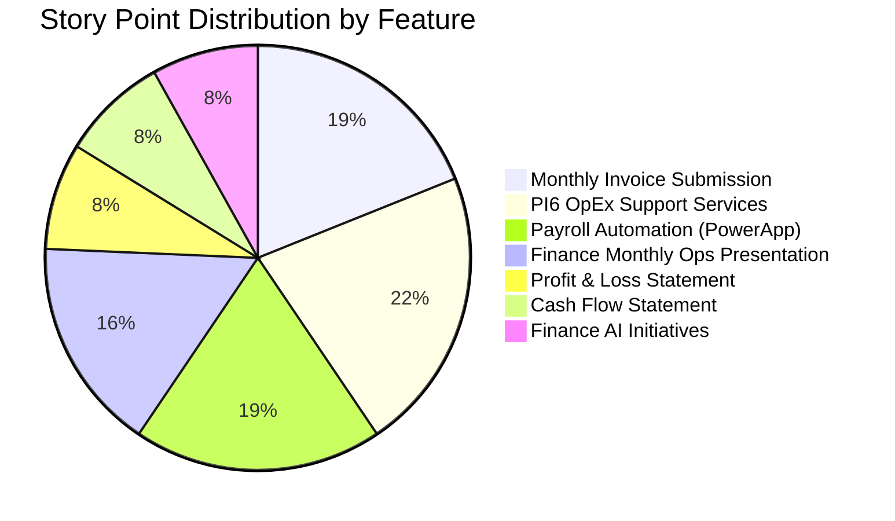
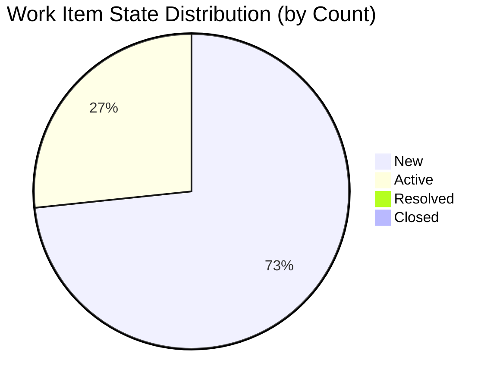
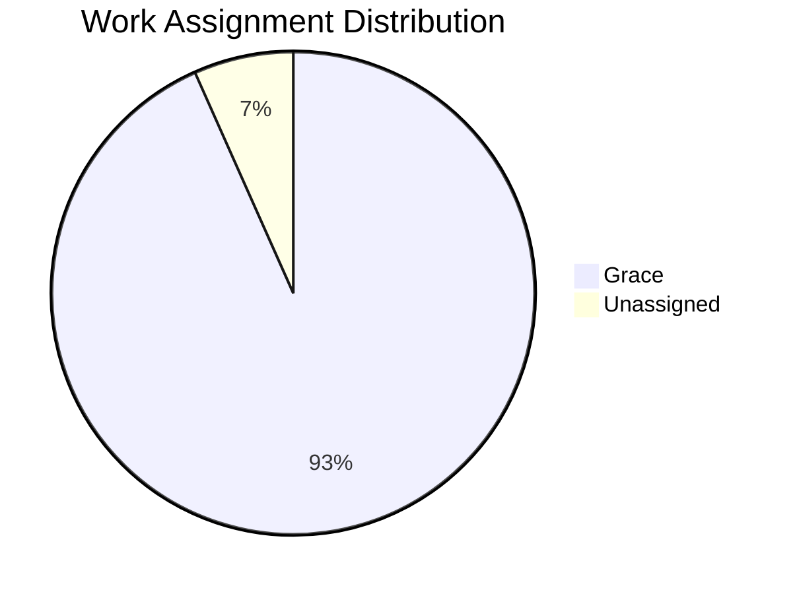
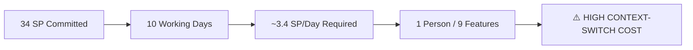
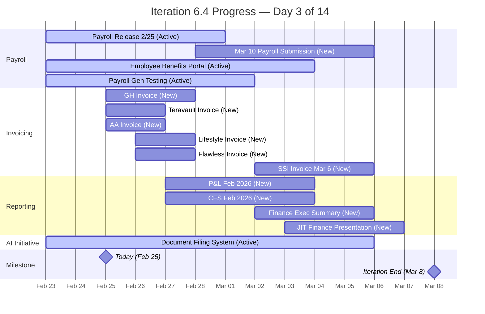

# SAFe Audit Report — Finance Team

**Project:** Jairosoft FINOPS
**Team:** Finance Team
**Iteration:** Iteration 6.4 (PI 2026-PI6)
**Iteration Window:** February 23, 2026 – March 8, 2026
**Audit Date:** February 25, 2026 (Day 3 of 14)
**Auditor:** AI Agile Project Management Consultant
**Framework:** SAFe 6.0 (Scaled Agile Framework)

---

## 1. Executive Summary

This audit evaluates the Finance Team's current iteration (Iteration 6.4) within the Jairosoft FINOPS Azure DevOps project against SAFe framework standards and best practices. The audit identifies **3 critical**, **4 major**, and **3 minor** findings that require attention to improve team agility, predictability, and delivery confidence.

**Overall Health Score: 35 / 100 (Needs Significant Improvement)**

| Category | Score | Rating |
|---|---|---|
| Capacity Planning | 5/20 | 🔴 Critical |
| Iteration Planning | 10/20 | 🔴 Critical |
| Story Quality | 8/20 | 🟡 Needs Improvement |
| Work-in-Progress Management | 7/20 | 🟡 Needs Improvement |
| Backlog Hygiene | 5/20 | 🔴 Critical |

---

## 2. Iteration Overview

### 2.1 Iteration Scope

Iteration 6.4 contains **15 User Stories** spanning **9 parent Features** with a combined commitment of **34 Story Points**.

### 2.2 Work Item State Distribution

| State | Count | Story Points | % of Total SP |
|---|---|---|---|
| New | 11 | 22 | 64.7% |
| Active | 4 | 12 | 35.3% |
| Resolved | 0 | 0 | 0.0% |
| Closed | 0 | 0 | 0.0% |
| **Total** | **15** | **34** | **100%** |

### 2.3 Detailed Work Item Inventory

| ID | Title | State | SP | Priority | Parent Feature |
|---|---|---|---|---|---|
| 199222 | Payroll Release - 2/25 | Active | 2 | P2 | PI6 OpEx Support Services |
| 199351 | Input Employee Benefits in the portal | Active | 4 | P2 | Payroll Automation (PowerApp) |
| 199354 | Payroll Generation Testing | Active | 3 | P2 | Payroll Automation (PowerApp) |
| 197845 | Document Filing System | Active | 3 | P2 | Finance AI Initiatives |
| 197079 | GH Invoice | New | 2 | P1 | Monthly Invoice Submission |
| 197080 | Teravault Invoice | New | 1 | P1 | Monthly Invoice Submission |
| 197081 | AA Invoice | New | 1 | P1 | Monthly Invoice Submission |
| 197082 | Lifestyle Invoice | New | 1 | P1 | Monthly Invoice Submission |
| 197083 | Flawless Invoice | New | 1 | P2 | Monthly Invoice Submission |
| 197078 | SSI Invoice - March 6 | New | 1 | P2 | Monthly Invoice Submission |
| 199349 | March 10th payroll submission | New | 3 | P2 | PI6 OpEx Support Services |
| 199471 | Create Finance Executive Summary | New | 3 | P2 | Finance Ops Presentation |
| 199348 | JIT Finance Presentation | New | 3 | P2 | Finance Ops Presentation |
| 198634 | P&L February 2026 | New | 3 | P2 | Profit & Loss Statement |
| 198644 | CFS February 2026 | New | 3 | P2 | Cash Flow Statement |

---

## 3. Feature Hierarchy

```mermaid
graph TD
    subgraph "Active Features in Iteration 6.4"
        F1["🟣 Monthly Invoice Submission<br/>March 2026<br/>Feature #197084 — Approved"]
        F2["🟣 PI6 OpEx Support Services<br/>Feature #199060 — Active"]
        F3["🟣 Payroll Automation (PowerApp)<br/>Feature #194905 — Active"]
        F4["🟣 Finance Monthly Ops Presentation<br/>Feature #197047 — Active"]
        F5["🟣 Profit & Loss Statement<br/>Feature #198617 — Active"]
        F6["🟣 Cash Flow Statement<br/>Feature #198616 — Active"]
        F7["🟣 Finance AI Initiatives<br/>Feature #197389 — Active"]
    end

    F1 --> S1["SSI Invoice - Mar 6 (1 SP)"]
    F1 --> S2["GH Invoice (2 SP)"]
    F1 --> S3["Teravault Invoice (1 SP)"]
    F1 --> S4["AA Invoice (1 SP)"]
    F1 --> S5["Lifestyle Invoice (1 SP)"]
    F1 --> S6["Flawless Invoice (1 SP)"]

    F2 --> S7["Payroll Release 2/25 (2 SP)"]
    F2 --> S8["Mar 10 Payroll Submission (3 SP)"]

    F3 --> S9["Employee Benefits Portal (4 SP)"]
    F3 --> S10["Payroll Generation Testing (3 SP)"]

    F4 --> S11["Finance Exec Summary (3 SP)"]
    F4 --> S12["JIT Finance Presentation (3 SP)"]

    F5 --> S13["P&L February 2026 (3 SP)"]
    F6 --> S14["CFS February 2026 (3 SP)"]
    F7 --> S15["Document Filing System (3 SP)"]

    style S7 fill:#4CAF50,color:#fff
    style S9 fill:#4CAF50,color:#fff
    style S10 fill:#4CAF50,color:#fff
    style S15 fill:#4CAF50,color:#fff
```

> Green = Active | Default = New

---

## 4. Audit Findings

### 🔴 FINDING 1 — CRITICAL: Team Capacity Not Configured

**SAFe Principle Violated:** *Iteration Planning — Capacity-Based Planning*

The Finance Team's capacity for Iteration 6.4 is configured as **0 hours/day**. The only team member (Grace) has an activity type of "Documentation" with **0 capacity per day**.

| Metric | Value |
|---|---|
| Team Members | 1 (Grace) |
| Configured Activity | Documentation |
| Capacity Per Day | 0 hours |
| Total Iteration Capacity | 0 hours |
| Committed Story Points | 34 SP |

**Impact:** Without configured capacity, the team cannot calculate a load factor, measure velocity accuracy, or determine if the iteration commitment is realistic. SAFe requires teams to perform capacity-based planning during Iteration Planning events.

**Recommendation:**
1. Set Grace's daily capacity to her actual available hours (e.g., 6 hrs/day accounting for meetings and overhead).
2. Add activity types beyond "Documentation" to reflect the full scope of work (e.g., "Finance Operations," "Reporting," "Payroll Processing").
3. Record any planned days off for the iteration window.

---

### 🔴 FINDING 2 — CRITICAL: Single Point of Failure — Solo Team Member

**SAFe Principle Violated:** *Agile Team — Cross-Functional, Self-Managing Teams*

All 15 work items in Iteration 6.4 are assigned to a single team member (Grace). Additionally, one backlog item (#198647 — AFS Submission 2025-2026) has **no assignee at all**.

**Impact:** A single person carrying 34 story points across 9 features creates a bottleneck with no redundancy. Any absence, impediment, or context-switch cost directly threatens all iteration commitments. SAFe recommends teams of 5–11 members to enable sustainable pace and knowledge sharing.

**Recommendation:**
1. Evaluate whether the Finance Team should be expanded or merged with another team for shared capacity.
2. If the team must remain single-person, significantly reduce WIP and iteration commitments.
3. Assign an owner to the unassigned work item #198647 (AFS Submission 2025-2026).

---

### 🔴 FINDING 3 — CRITICAL: Backlog Items Missing Iteration Assignment

**SAFe Principle Violated:** *Iteration Planning — Commitment and Planning*

Eight (8) User Stories appear in the team's backlog but are assigned to the **root iteration path** ("Jairosoft FINOPS") rather than a specific iteration. These items are floating without a planned delivery target.

| ID | Title | SP | Priority | Parent Feature |
|---|---|---|---|---|
| 198639 | Balance Sheet March 2026 | 3 | P2 | Balance Sheet |
| 199347 | March 10 Jairosoft Finance Presentation | 5 | P2 | Finance Ops Presentation |
| 199350 | March 10th Payroll release | 2 | P2 | PI6 OpEx Support Services |
| 199469 | Back Lot Payables | 3 | P2 | PI6 OpEx Support Services |
| 198611 | SSI Invoice - March 20 | 1 | P2 | Monthly Invoice Submission |
| 198635 | P&L March 2026 | 4 | P2 | Profit & Loss Statement |
| 198645 | CFS March 2026 | 3 | P2 | Cash Flow Statement |
| 198647 | AFS Submission 2025-2026 | 3 | P2 | Annual Financial Statement |

**Total unplanned backlog: 24 Story Points**

**Impact:** Unplanned work creates ambiguity about when these deliverables will be completed. Several items (e.g., "March 10 Jairosoft Finance Presentation" at 5 SP) have hard date dependencies that may be missed without explicit iteration assignment.

**Recommendation:**
1. Assign all backlog items to their target iterations during the next backlog refinement.
2. Items with date-specific deadlines (March 10 presentation, March 20 invoice) must be placed in the correct iteration immediately.
3. Use the iteration planning event to formally commit to these items.

---

### 🟡 FINDING 4 — MAJOR: User Stories Lack Proper SAFe Format

**SAFe Principle Violated:** *Story — User Story Format and INVEST Criteria*

None of the 15 User Stories follow the SAFe-recommended format: **"As a [role], I want [activity], so that [business value]."** Stories are written as simple task titles rather than value-driven narratives.

**Examples of Current Format vs. SAFe Recommended:**

| Current | Recommended SAFe Format |
|---|---|
| "GH Invoice" | "As a Finance Manager, I want to create and submit the GH invoice for February 2026, so that we maintain on-time billing and healthy cash flow." |
| "Document Filing System" | "As a Finance Analyst, I want to scan and file receipts in ZipBook, so that our documentation is organized and audit-ready." |
| "Payroll Release - 2/25" | "As a Payroll Administrator, I want to release payroll for February 25, so that employees are paid on schedule." |

**Impact:** Without the "so that" clause, stories lack clear business value articulation, making prioritization, stakeholder communication, and value stream mapping difficult.

**Recommendation:** Rewrite all stories using the standard SAFe format. At minimum, ensure each story includes a clear business value statement.

---

### 🟡 FINDING 5 — MAJOR: Minimal Acceptance Criteria

**SAFe Principle Violated:** *Story — Acceptance Criteria and Definition of Done*

All 15 stories have single-line acceptance criteria that restate the title rather than defining testable conditions for completion.

**Examples:**

| Story | Current Acceptance Criteria |
|---|---|
| GH Invoice (2 SP) | "Submitted Invoice to GH" |
| CFS February 2026 (3 SP) | "Presented CFS" |
| Payroll Generation Testing (3 SP) | "Generated payroll from the portal" |

**Impact:** Vague acceptance criteria lead to ambiguous definitions of "done," making it difficult to verify completion, perform demonstrations, and maintain quality standards.

**Recommendation:** Each acceptance criterion should include:
1. Specific conditions that must be met (Given/When/Then format preferred)
2. Measurable outcomes
3. Edge cases and error scenarios where relevant
4. Reference to any compliance or regulatory requirements

---

### 🟡 FINDING 6 — MAJOR: No Task Decomposition

**SAFe Principle Violated:** *Iteration Execution — Task Breakdown*

None of the 15 User Stories in Iteration 6.4 have been decomposed into child Tasks. SAFe recommends breaking stories into tasks of 1–8 hours during Iteration Planning to improve daily tracking, identify impediments early, and update burndown charts accurately.

**Impact:** Without task decomposition, daily stand-ups cannot track granular progress. The team cannot produce an accurate iteration burndown or identify blockers at the task level.

**Recommendation:**
1. Decompose each User Story into concrete tasks during the next team sync.
2. Estimate each task in hours (1–8 hour range).
3. Update task status daily to enable burndown tracking.

---

### 🟡 FINDING 7 — MAJOR: Iteration Overcommitment Risk

**SAFe Principle Violated:** *Iteration Planning — Sustainable Pace*

With 34 Story Points committed and 0 capacity configured, there is no way to validate whether the iteration commitment is achievable. Assuming a solo team member working ~6 productive hours/day over 10 working days (60 hours), each story point would equate to ~1.76 hours. This is plausible for low-complexity invoice-type work but risky given the breadth across 9 features.

**Recommendation:**
1. Establish a historical velocity baseline (review prior 3 iterations).
2. Limit WIP to 2–3 active stories at any time.
3. Prioritize by business value and date-driven deadlines.

---

### 🟢 FINDING 8 — MINOR: Inconsistent Story Point Estimation

Story point estimates range from 1 to 4, with invoice stories uniformly at 1 SP and presentation/financial statement stories at 3 SP. While this shows some relative sizing, there is no evidence of Planning Poker or team-based estimation (team of 1 limitation).

**Recommendation:** If the team expands, adopt Planning Poker for story estimation. Document estimation rationale to build a reference catalog.

---

### 🟢 FINDING 9 — MINOR: No Tags or Labels for Categorization

None of the work items use ADO tags for categorization (e.g., "invoicing," "payroll," "reporting," "compliance"). Tags improve filtering, reporting, and cross-team visibility.

**Recommendation:** Establish a tagging taxonomy and apply consistently.

---

### 🟢 FINDING 10 — MINOR: Feature State Inconsistency

The parent Feature #197084 (Monthly Invoice Submission — March 2026) is in "Approved" state while its child stories are in the iteration. Other parent features are "Active." This inconsistency suggests the feature lifecycle is not being actively managed.

**Recommendation:** Transition Feature #197084 to "Active" to reflect that work has begun on its child stories.

---

## 5. Iteration Progress Assessment (Day 3 of 14)

**Burndown Projection:** With 0 SP completed by Day 3, the team must average **3.1 SP/day** over the remaining 11 days to meet the iteration commitment. This is an **amber/at-risk** trajectory.

---

## 6. Recommendations Summary

| # | Severity | Finding | Recommendation | Owner |
|---|---|---|---|---|
| 1 | 🔴 Critical | Zero capacity configured | Configure daily capacity hours for Grace | Scrum Master / Grace |
| 2 | 🔴 Critical | Single team member | Evaluate team expansion or reduce commitment | Management |
| 3 | 🔴 Critical | 8 items missing iteration | Assign backlog items to target iterations | Product Owner |
| 4 | 🟡 Major | Stories lack SAFe format | Rewrite stories with "As a… I want… so that…" | Product Owner |
| 5 | 🟡 Major | Minimal acceptance criteria | Expand AC with testable conditions (Given/When/Then) | Product Owner |
| 6 | 🟡 Major | No task decomposition | Break stories into 1–8 hour tasks | Grace |
| 7 | 🟡 Major | Overcommitment risk | Establish velocity baseline, limit WIP | Scrum Master |
| 8 | 🟢 Minor | No team estimation process | Adopt Planning Poker when team grows | Scrum Master |
| 9 | 🟢 Minor | No tags/labels used | Create and apply tagging taxonomy | Team |
| 10 | 🟢 Minor | Feature state inconsistency | Update Feature #197084 to Active | Product Owner |

---

## 7. SAFe Compliance Scorecard

| SAFe Practice | Status | Notes |
|---|---|---|
| Iteration Planning Event | ⚠️ Partial | Items are assigned but capacity/commitment not formalized |
| Capacity-Based Planning | ❌ Missing | 0 capacity configured |
| Story Format (INVEST) | ❌ Non-Compliant | No "As a/I want/So that" format |
| Acceptance Criteria | ⚠️ Minimal | Single-line, non-testable |
| Task Decomposition | ❌ Missing | No child tasks on any story |
| Daily Stand-Up Readiness | ⚠️ Partial | Cannot track task-level progress |
| Iteration Burndown | ❌ Not Possible | No remaining work tracked at task level |
| WIP Limits | ❌ Not Set | No explicit WIP limits configured |
| Definition of Done | ⚠️ Unknown | Not documented at team or iteration level |
| Iteration Review/Demo | ⚠️ Unknown | No evidence of planned review |
| Iteration Retrospective | ⚠️ Unknown | No evidence of planned retro |
| Backlog Refinement | ⚠️ Partial | Items exist but 8 lack iteration assignment |
| PI Objectives Alignment | ⚠️ Partial | Features span PI6 but no explicit PI objectives visible |

---

## 8. Conclusion

The Finance Team's Iteration 6.4 board reveals significant gaps against SAFe standards. The most urgent issues are the **zero capacity configuration**, **single-person bottleneck**, and **unplanned backlog items with hard deadlines**. Addressing these three critical findings will have the highest immediate impact on the team's ability to deliver predictably.

The team demonstrates good practices in some areas — all iteration items have story point estimates, descriptions, and acceptance criteria (even if minimal), and the feature hierarchy is well-structured. These are solid foundations to build upon.

**Immediate Actions (This Week):**
1. Configure Grace's capacity in ADO for this iteration.
2. Move date-sensitive backlog items (March 10 presentation, March 20 invoice) into their correct iterations.
3. Assign an owner to work item #198647.

**Short-Term Actions (This PI):**
4. Rewrite stories in SAFe format and expand acceptance criteria.
5. Establish task decomposition practice for future iterations.
6. Begin tracking team velocity across iterations to enable data-driven planning.

---

*Report generated on February 25, 2026 at 07:00 UTC.*
*Data source: Azure DevOps — Jairosoft FINOPS / Finance Team / Iteration 6.4*
*Framework: SAFe 6.0 (Scaled Agile Framework)*
