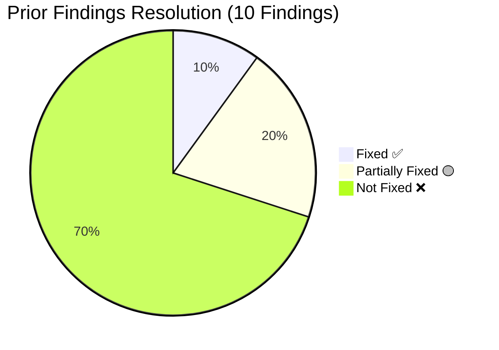
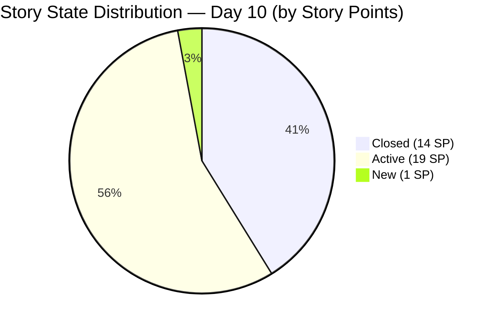
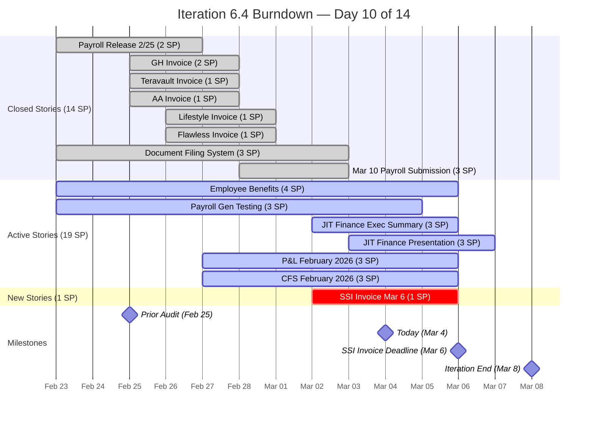
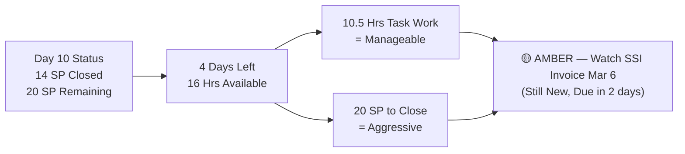
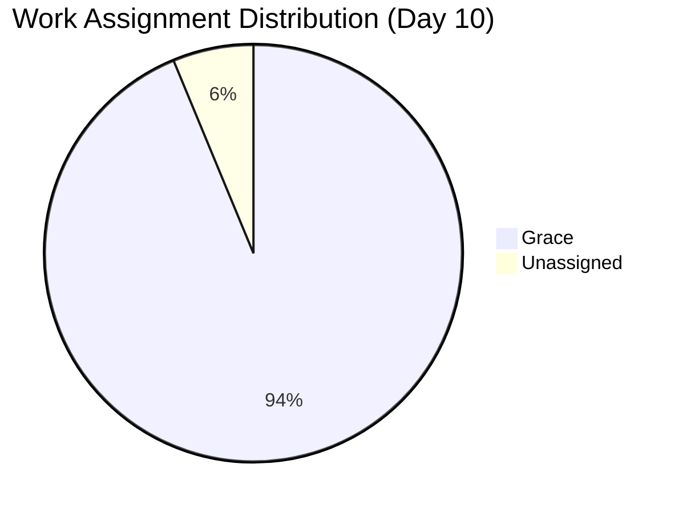
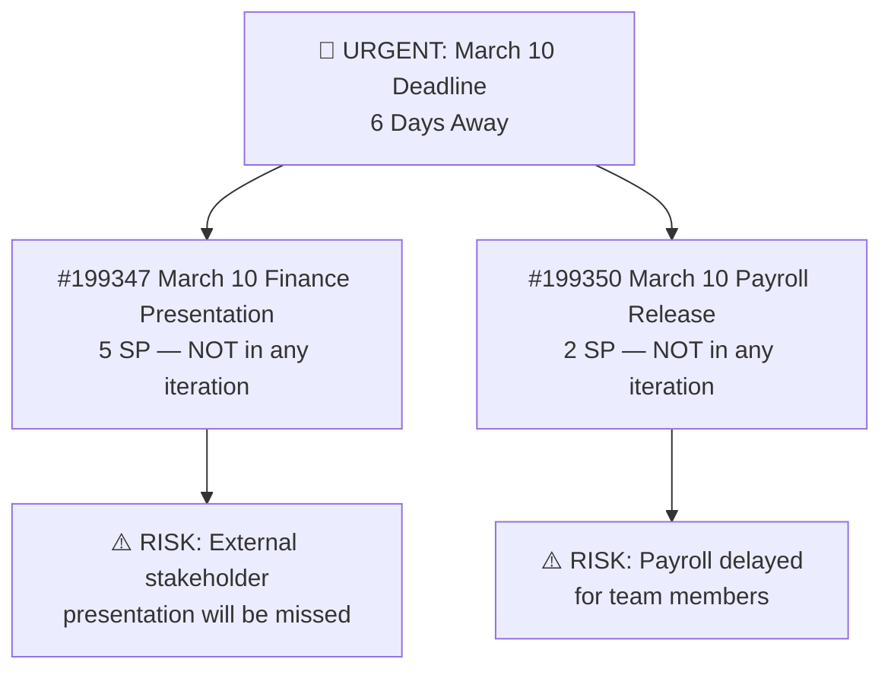
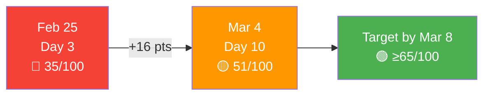

# SAFe Audit Report — Finance Team

**Project:** Jairosoft FINOPS
**Team:** Finance Team
**Iteration:** Iteration 6.4 (PI 2026-PI6)
**Iteration Window:** February 23, 2026 – March 8, 2026
**Audit Date:** March 4, 2026 (Day 10 of 14)
**Previous Audit:** February 25, 2026 (AUDIT_2026-02-25_0700.md)
**Auditor:** AI Agile Project Management Consultant
**Framework:** SAFe 6.0 (Scaled Agile Framework)

---

## 1. Executive Summary

This is the **second audit** of the Finance Team's Iteration 6.4 within the Jairosoft FINOPS Azure DevOps project. Conducted on Day 10 of 14, this report evaluates progress made since the February 25 audit, assesses whether prior findings have been addressed, and identifies new risks with only **4 working days remaining**.

**Overall Health Score: 51 / 100 (+16 pts vs. Prior Audit)**

| Category | Prior Score | Current Score | Trend |
|---|---|---|---|
| Capacity Planning | 5/20 | 12/20 | 🟢 +7 Improved |
| Iteration Planning | 10/20 | 12/20 | 🟡 +2 Slight Improvement |
| Story Quality | 8/20 | 8/20 | ⚪ No Change |
| Work-in-Progress Management | 7/20 | 14/20 | 🟢 +7 Improved |
| Backlog Hygiene | 5/20 | 5/20 | ⚪ No Change |

The team demonstrated meaningful progress by **implementing task decomposition across all stories** (resolving Finding #6) and **configuring capacity** (partially resolving Finding #1). Eight stories totaling **14 Story Points have been Closed**. However, critical structural issues persist, and an **urgent deadline risk** has emerged: the March 10 Finance Presentation (5 SP) remains stranded in the unplanned backlog with only 6 days until the deadline.

---

## 2. Previous Findings Resolution Status

### 2.1 Resolution Scorecard

| # | Severity | Finding | Status | Notes |
|---|---|---|---|---|
| 1 | 🔴 Critical | Zero capacity configured | 🟡 Partially Fixed | Now 4h/day, but only "Documentation" activity type |
| 2 | 🔴 Critical | Single point of failure | ❌ Not Fixed | Still solo team; #198647 still unassigned |
| 3 | 🔴 Critical | 8 items missing iteration | ❌ Not Fixed | All 8 items still at root path — URGENT |
| 4 | 🟡 Major | Stories lack SAFe format | ❌ Not Fixed | Still simple task titles |
| 5 | 🟡 Major | Minimal acceptance criteria | ❌ Not Fixed | Still single-line, non-testable |
| 6 | 🟡 Major | No task decomposition | ✅ Fixed | All 15 stories now have child tasks |
| 7 | 🟡 Major | Overcommitment risk | 🟡 Improving | 14 SP closed; 20 SP remain in 4 days |
| 8 | 🟢 Minor | No team estimation process | ❌ Not Fixed | Team expansion not yet pursued |
| 9 | 🟢 Minor | No tags/labels used | ❌ Not Fixed | No tags applied |
| 10 | 🟢 Minor | Feature #197084 state inconsistency | ❌ Not Verified | Still appears unresolved |

---

## 3. Iteration Overview — Day 10 of 14

### 3.1 Story State Distribution

| State | Count | Story Points | % of Total SP |
|---|---|---|---|
| Closed | 8 | 14 | 41.2% |
| Active | 6 | 19 | 55.9% |
| New | 1 | 1 | 2.9% |
| Resolved | 0 | 0 | 0% |
| **Total** | **15** | **34** | **100%** |

### 3.2 Detailed Work Item Status

| ID | Title | State | SP | Change Since 2/25 |
|---|---|---|---|---|
| 199222 | Payroll Release - 2/25 | ✅ Closed | 2 | Was Active → Closed |
| 199349 | March 10th initial payroll submission | ✅ Closed | 3 | Was New → Closed |
| 197079 | GH Invoice | ✅ Closed | 2 | Was New → Closed |
| 197080 | Teravault Invoice | ✅ Closed | 1 | Was New → Closed |
| 197081 | AA Invoice | ✅ Closed | 1 | Was New → Closed |
| 197082 | Lifestyle Invoice | ✅ Closed | 1 | Was New → Closed |
| 197083 | Flawless Invoice | ✅ Closed | 1 | Was New → Closed |
| 197845 | Document Filing System | ✅ Closed | 3 | Was Active → Closed |
| 199351 | Input Employee Benefits in the portal | 🔵 Active | 4 | Still Active |
| 199354 | Payroll Generation Testing | 🔵 Active | 3 | Still Active |
| 199471 | JIT Finance Executive Summary | 🔵 Active | 3 | Was New → Active |
| 199348 | JIT Finance Presentation | 🔵 Active | 3 | Was New → Active |
| 198634 | P&L February 2026 | 🔵 Active | 3 | Was New → Active |
| 198644 | CFS February 2026 | 🔵 Active | 3 | Was New → Active |
| 197078 | SSI Invoice - March 6 | 🟡 New | 1 | Was New → Still New ⚠️ |

### 3.3 Task Decomposition Status (NEW vs. Prior Audit)

All 15 User Stories now have at least one child Task — a significant improvement from zero in the prior audit.

| Parent Story | Task | Task State | Remaining (hrs) |
|---|---|---|---|
| 199222 – Payroll Release 2/25 | Prepare Cashnet for Payroll | ✅ Closed | — |
| 199222 – Payroll Release 2/25 | Prepare IC Pay | ✅ Closed | — |
| 199351 – Employee Benefits | Input Employee Benefits | ✅ Closed | — |
| 199351 – Employee Benefits | Input Salary | 🔵 Active | 2h |
| 199351 – Employee Benefits | Input deduction | 🔵 Active | 3h |
| 199354 – Payroll Gen Testing | Collaboration with HR | ✅ Closed | — |
| 199354 – Payroll Gen Testing | Generate payroll Test | 🟡 New | 1h |
| 197845 – Document Filing | Filing of receipts | ✅ Closed | — |
| 197845 – Document Filing | Attach scanned receipts to ZipBook | ✅ Closed | — |
| 197079 – GH Invoice | GH Submission of Invoice | ✅ Closed | — |
| 197080 – Teravault Invoice | Terravault Invoice Submission | ✅ Closed | — |
| 197081 – AA Invoice | AA Invoice Submission | ✅ Closed | — |
| 197082 – Lifestyle Invoice | Lifestyle Invoice Submission | ✅ Closed | — |
| 197083 – Flawless Invoice | Flawless Invoice Submission | ✅ Closed | — |
| 199349 – Mar 10 Payroll Submission | March 10th Payroll Computation | ✅ Closed | — |
| 199471 – JIT Finance Exec Summary | Create Executive summary | 🟡 New | 1h |
| 197078 – SSI Invoice Mar 6 | Submission of SSI Invoice for March 6 | 🟡 New | 0.5h |
| 199348 – JIT Finance Presentation | Prepare Feb JIT Finance Report | 🔵 Active | 1h |
| 198634 – P&L February 2026 | Prepare P&L Report | 🟡 New | 1h |
| 198644 – CFS February 2026 | Prepare CFS February | 🟡 New | 1h |

**Total Remaining Work (task hours): 10.5 hours**

---

## 4. Burndown & Velocity Analysis

### 4.1 Iteration Burndown (Actual vs. Ideal)

### 4.2 Burndown Projection

| Metric | Value |
|---|---|
| Total Committed SP | 34 |
| Closed SP (Day 10) | 14 (41.2%) |
| Remaining SP | 20 (58.8%) |
| Days Remaining | 4 |
| Required Burn Rate | 5.0 SP/day |
| Available Capacity | 4 hrs/day × 4 days = 16 hrs |
| Remaining Task Hours | ~10.5 hrs |
| Capacity Utilization | 10.5h / 16h = 65.6% (achievable) |

**Task-Hour Analysis suggests the active stories are near completion** — the 10.5 remaining task hours across 6 active stories and 1 new story can be completed within 16 remaining capacity hours. However, the **story-point based burndown remains at risk** because closing all 6 active stories (19 SP) in 4 days requires velocity of ~4.75 SP/day.

---

## 5. Audit Findings

### ✅ FINDING 6 — RESOLVED: Task Decomposition Implemented

**Prior Status:** No child tasks on any story (Critical Finding)
**Current Status:** ✅ All 15 User Stories now have child Tasks assigned to Grace.

This is the most significant improvement since the last audit. Task decomposition now enables daily stand-up tracking, granular burndown, and better impediment detection. Grace created 20 tasks across 15 stories.

---

### 🟡 FINDING 1 — PARTIALLY RESOLVED: Capacity Partially Configured

**Prior Status:** 0 hours/day capacity (Critical)
**Current Status:** 🟡 4 hours/day configured — improvement, but incomplete.

| Metric | Feb 25 | Mar 4 | Status |
|---|---|---|---|
| Capacity Per Day | 0 hours | **4 hours** | ✅ Improved |
| Activity Types | Documentation only | Documentation only | ❌ No change |
| Days Off Recorded | None | None | ⚪ No Change |

**Remaining Gap:** Grace's role spans multiple domains (payroll, invoicing, reporting, AI initiatives) but the only activity type is "Documentation." This creates a mismatch between planned activity and actual work performed.

**Recommendation:** Add activity types: "Finance Operations," "Payroll Processing," "Reporting," and "Invoice Management."

---

### 🔴 FINDING 2 — CRITICAL (PERSISTS): Single Point of Failure

**Prior Status:** Critical — Solo team, one item unassigned
**Current Status:** ❌ Unchanged — Grace remains the sole team member.

Work item **#198647 (AFS Submission 2025-2026)** continues to have no assignee and remains in the root backlog without a target iteration.

**Recommendation:** Assign #198647 immediately. Evaluate whether the team can be supported with additional resources before PI end.

---

### 🔴 FINDING 3 — CRITICAL (PERSISTS + ESCALATED): Backlog Items Missing Iteration — URGENT

**Prior Status:** Critical — 8 items at root path (24 SP)
**Current Status:** ❌ Not Fixed — All 8 items remain at root "Jairosoft FINOPS" iteration path.

| ID | Title | SP | Due | Urgency |
|---|---|---|---|---|
| 199347 | March 10 Jairosoft Finance Presentation | 5 | Mar 10 | 🚨 6 days — HIGH RISK |
| 199350 | March 10th Payroll release | 2 | Mar 10 | 🚨 6 days — HIGH RISK |
| 198639 | Balance Sheet March 2026 | 3 | Mar 31 | ⚠️ Next iteration |
| 199469 | Back Lot Payables | 3 | TBD | ⚠️ Unplanned |
| 198611 | SSI Invoice - March 20 | 1 | Mar 20 | ⚠️ Next iteration |
| 198635 | P&L March 2026 | 4 | Mar 31 | ⚠️ Next iteration |
| 198645 | CFS March 2026 | 3 | Mar 31 | ⚠️ Next iteration |
| 198647 | AFS Submission 2025-2026 | 3 | TBD | ❌ Unassigned + Unplanned |

**ESCALATION:** The **March 10 Finance Presentation (5 SP)** and **March 10 Payroll release (2 SP)** are now only 6 days away. With Iteration 6.4 ending March 8, these items must either be pulled into Iteration 6.4 immediately or placed into an emergency sprint/iteration. Failure to act will result in a **missed deadline visible to external stakeholders**.

**Immediate Action Required:**

1. Move #199347 and #199350 into Iteration 6.4 or an emergency iteration NOW.
2. Assign remaining backlog items to appropriate future iterations during the next refinement.

---

### 🚨 NEW FINDING A — URGENT: SSI Invoice March 6 Still in New State (Deadline in 2 Days)

**SAFe Principle:** *Iteration Execution — On-Time Delivery of Committed Work*

Work item **#197078 (SSI Invoice - March 6)** has a hard date deadline of March 6, 2026 — only **2 days away**. As of this audit, the story is still in **New** state with its task (#199731) also in **New** state but showing only 0.5 hours of remaining work.

| Item | State | Remaining Work | Deadline | Risk |
|---|---|---|---|---|
| #197078 SSI Invoice Mar 6 (Story) | 🟡 New | — | March 6 | 🚨 HIGH |
| #199731 Submission of SSI Invoice | 🟡 New | 0.5 hrs | March 6 | 🚨 HIGH |

The task appears not yet started (New state) despite having only 0.5 hours estimated. This story must be activated and completed by end of day March 5 to meet the client deadline.

**Recommendation:** Prioritize and start #199731 immediately. Move story #197078 to Active, complete by March 5, 2026.

---

### 🟡 FINDING 4 — MAJOR (PERSISTS): User Stories Lack SAFe Format

**Prior Status:** Major — No "As a/I want/So that" format
**Current Status:** ❌ Not Fixed. All 15 stories continue to use simple task titles.

**Recommendation:** While this iteration may not allow time for a full rewrite, the team should commit to adopting this format for all stories in the next iteration (6.5).

---

### 🟡 FINDING 5 — MAJOR (PERSISTS): Minimal Acceptance Criteria

**Prior Status:** Major — Single-line, non-testable AC
**Current Status:** ❌ Not Fixed. One typo noted: #199351 has "Inputted benefit detials" (misspelled).

**Recommendation:** Adopt Given/When/Then format in Iteration 6.5 planning.

---

### 🟢 FINDING 9 — MINOR (PERSISTS): No Tags or Labels

**Prior Status:** Minor — No tagging taxonomy
**Current Status:** ❌ Not Fixed. No tags applied to any work items.

**Recommendation:** Establish a tag taxonomy: "invoicing," "payroll," "reporting," "compliance," "AI-initiative."

---

## 6. SAFe Compliance Scorecard — Updated

| SAFe Practice | Feb 25 Status | Mar 4 Status | Change |
|---|---|---|---|
| Iteration Planning Event | ⚠️ Partial | ⚠️ Partial | ⚪ No change |
| Capacity-Based Planning | ❌ Missing | 🟡 Partial | 🟢 Improved |
| Story Format (INVEST) | ❌ Non-Compliant | ❌ Non-Compliant | ⚪ No change |
| Acceptance Criteria | ⚠️ Minimal | ⚠️ Minimal | ⚪ No change |
| Task Decomposition | ❌ Missing | ✅ Implemented | 🟢 Major Improvement |
| Daily Stand-Up Readiness | ⚠️ Partial | ✅ Enabled | 🟢 Improved |
| Iteration Burndown | ❌ Not Possible | 🟡 Partial | 🟢 Improved |
| WIP Limits | ❌ Not Set | ❌ Not Set | ⚪ No change |
| Definition of Done | ⚠️ Unknown | ⚠️ Unknown | ⚪ No change |
| Iteration Review/Demo | ⚠️ Unknown | ⚠️ Unknown | ⚪ No change |
| Iteration Retrospective | ⚠️ Unknown | ⚠️ Unknown | ⚪ No change |
| Backlog Refinement | ⚠️ Partial | ⚠️ Partial | ⚪ No change |
| PI Objectives Alignment | ⚠️ Partial | ⚠️ Partial | ⚪ No change |

---

## 7. Feature Hierarchy — Current State

```mermaid
graph TD
    subgraph "Iteration 6.4 — Day 10 Snapshot"
        F1["🟣 Monthly Invoice Submission<br/>Feature #197084"]
        F2["🟣 PI6 OpEx Support Services<br/>Feature #199060"]
        F3["🟣 Payroll Automation (PowerApp)<br/>Feature #194905"]
        F4["🟣 Finance Monthly Ops Presentation<br/>Feature #197047"]
        F5["🟣 Profit & Loss Statement<br/>Feature #198617"]
        F6["🟣 Cash Flow Statement<br/>Feature #198616"]
        F7["🟣 Finance AI Initiatives<br/>Feature #197389"]
    end

    F1 --> S1["✅ SSI Invoice Mar 6 (1 SP) — New ⚠️"]
    F1 --> S2["✅ GH Invoice (2 SP) — Closed"]
    F1 --> S3["✅ Teravault Invoice (1 SP) — Closed"]
    F1 --> S4["✅ AA Invoice (1 SP) — Closed"]
    F1 --> S5["✅ Lifestyle Invoice (1 SP) — Closed"]
    F1 --> S6["✅ Flawless Invoice (1 SP) — Closed"]

    F2 --> S7["✅ Payroll Release 2/25 (2 SP) — Closed"]
    F2 --> S8["✅ Mar 10 Payroll Submission (3 SP) — Closed"]

    F3 --> S9["🔵 Employee Benefits Portal (4 SP) — Active"]
    F3 --> S10["🔵 Payroll Generation Testing (3 SP) — Active"]

    F4 --> S11["🔵 Finance Exec Summary (3 SP) — Active"]
    F4 --> S12["🔵 JIT Finance Presentation (3 SP) — Active"]

    F5 --> S13["🔵 P&L February 2026 (3 SP) — Active"]
    F6 --> S14["🔵 CFS February 2026 (3 SP) — Active"]
    F7 --> S15["✅ Document Filing System (3 SP) — Closed"]

    style S2 fill:#4CAF50,color:#fff
    style S3 fill:#4CAF50,color:#fff
    style S4 fill:#4CAF50,color:#fff
    style S5 fill:#4CAF50,color:#fff
    style S6 fill:#4CAF50,color:#fff
    style S7 fill:#4CAF50,color:#fff
    style S8 fill:#4CAF50,color:#fff
    style S15 fill:#4CAF50,color:#fff
    style S1 fill:#FF9800,color:#fff
```

---

## 8. Health Score Trend

| Category | Feb 25 | Mar 4 | Change |
|---|---|---|---|
| Capacity Planning | 5/20 | 12/20 | +7 |
| Iteration Planning | 10/20 | 12/20 | +2 |
| Story Quality | 8/20 | 8/20 | 0 |
| WIP Management | 7/20 | 14/20 | +7 |
| Backlog Hygiene | 5/20 | 5/20 | 0 |
| **Total** | **35/100** | **51/100** | **+16** |

---

## 9. Recommendations Summary

### 🚨 Immediate — Within 24 Hours

| # | Action | Owner | Item |
|---|---|---|---|
| A | Activate and complete SSI Invoice Mar 6 — 2-day deadline | Grace | #197078 / #199731 |
| B | Pull March 10 Finance Presentation into Iteration 6.4 or emergency sprint | Product Owner | #199347 |
| C | Pull March 10 Payroll Release into Iteration 6.4 or emergency sprint | Product Owner | #199350 |

### 🔴 Critical — This Iteration (Before March 8)

| # | Action | Owner | Item |
|---|---|---|---|
| D | Assign owner to unassigned AFS Submission | Product Owner | #198647 |
| E | Complete all 6 active stories before iteration end | Grace | Various |
| F | Add additional activity types to Grace's capacity (Finance Ops, Payroll, etc.) | Grace/Scrum Master | ADO Settings |

### 🟡 Next Iteration (6.5 Planning)

| # | Action | Owner |
|---|---|---|
| G | Assign all remaining backlog items to target iterations | Product Owner |
| H | Rewrite all new stories using SAFe format: "As a… I want… So that…" | Product Owner |
| I | Expand AC to Given/When/Then testable conditions | Product Owner |
| J | Create tagging taxonomy and apply to all work items | Team |
| K | Establish iteration velocity tracking across PI6 | Scrum Master |

---

## 10. Conclusion

The Finance Team has made **meaningful progress** since the February 25 audit — most notably in implementing task decomposition (Finding #6 resolved) and completing 8 of 15 stories. The team's health score improved from **35 to 51 out of 100**, moving from "Needs Significant Improvement" to "Needs Improvement."

However, **6 of 10 prior findings remain unaddressed**, and a new urgent risk has emerged: the March 10 deadline items are still stranded in the unplanned backlog. With only 4 working days remaining in the iteration, the team faces pressure on two fronts — completing the current iteration's 20 remaining story points and rescuing externally visible March 10 deliverables.

**The most critical immediate action is to pull the March 10 Finance Presentation (#199347) and March 10 Payroll Release (#199350) into a formal iteration plan by end of day today, March 4.**

The foundation is improving: task decomposition is in place, capacity is configured, and the team has demonstrated a consistent delivery cadence. Addressing the backlog hygiene and story quality issues in the next iteration planning session will be key to achieving sustainable SAFe compliance.

---

*Report generated on March 4, 2026 at 02:22 UTC.*
*Data source: Azure DevOps — Jairosoft FINOPS / Finance Team / Iteration 6.4*
*Framework: SAFe 6.0 (Scaled Agile Framework)*
*Previous Audit: AUDIT_2026-02-25_0700.md*
