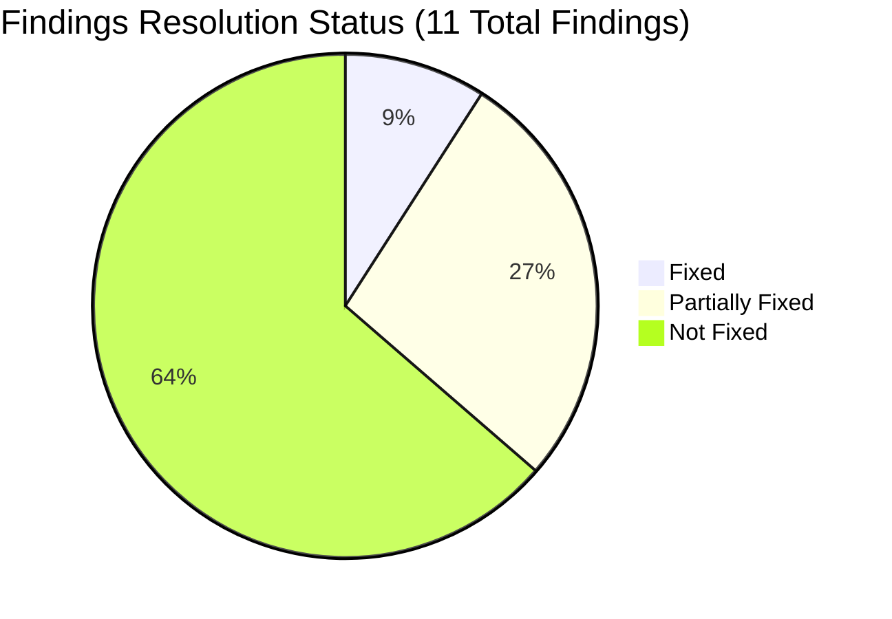
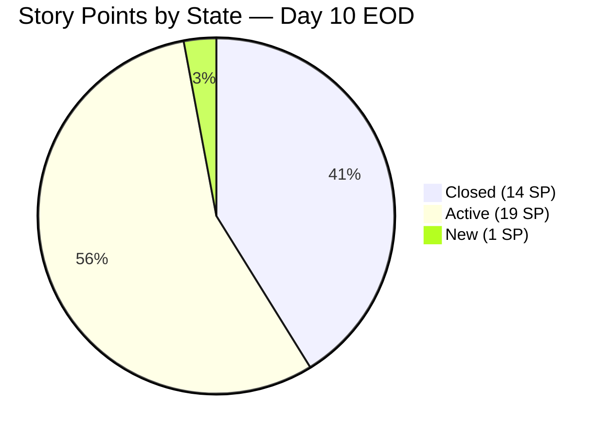
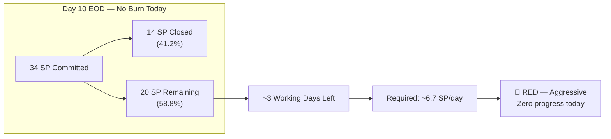
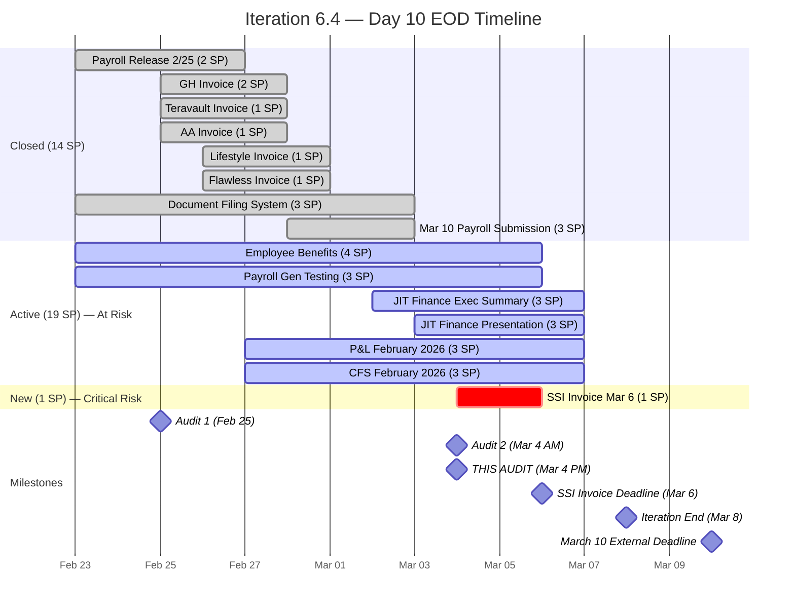
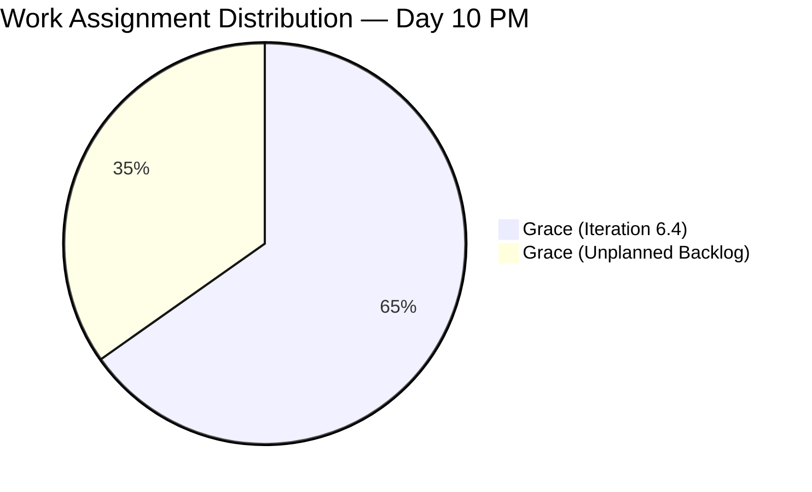
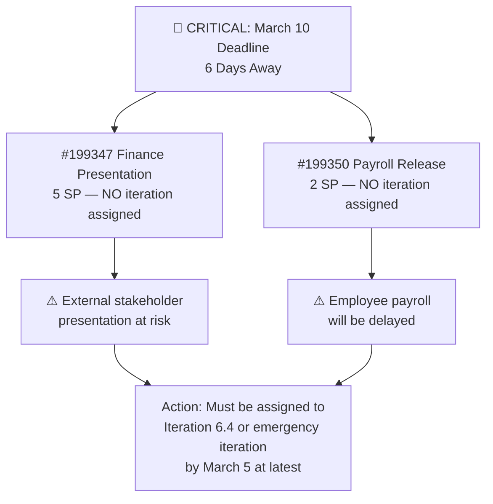
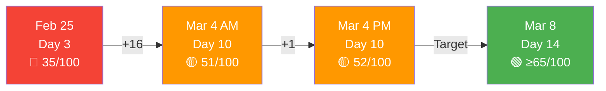

# SAFe Audit Report — Finance Team

**Project:** Jairosoft FINOPS
**Team:** Finance Team
**Iteration:** Iteration 6.4 (PI 2026-PI6)
**Iteration Window:** February 23, 2026 – March 8, 2026
**Audit Date:** March 4, 2026 — 22:09 UTC (Day 10 of 14)
**Previous Audits:** Feb 25, 2026 (AUDIT_2026-02-25_0700) · Mar 4, 2026 (AUDIT_2026-03-04_0222)
**Auditor:** AI Agile Project Management Consultant
**Framework:** SAFe 6.0 (Scaled Agile Framework)

---

## 1. Executive Summary

This is the **third audit** of the Finance Team's Iteration 6.4 and the **second audit today** (following the 02:22 UTC report). Conducted at end-of-day on Day 10 of 14, this report evaluates whether any progress occurred during the working day and assesses the escalating risk profile with only **4 calendar days** (approximately **2–3 working days**) remaining before the March 8 iteration close.

**Overall Health Score: 52 / 100 (+1 pt vs. Prior Audit)**

| Category | Feb 25 Score | Mar 4 AM Score | Mar 4 PM Score | Trend |
|---|---|---|---|---|
| Capacity Planning | 5/20 | 12/20 | 12/20 | ⚪ No Change |
| Iteration Planning | 10/20 | 12/20 | 12/20 | ⚪ No Change |
| Story Quality | 8/20 | 8/20 | 8/20 | ⚪ No Change |
| Work-in-Progress Management | 7/20 | 14/20 | 14/20 | ⚪ No Change |
| Backlog Hygiene | 5/20 | 5/20 | 6/20 | 🟢 +1 (AFS assigned) |

**Key change since 02:22 audit:** Work item **#198647 (AFS Submission 2025-2026)** has been assigned to Grace, partially addressing Finding #2 (Single Point of Failure — unassigned item). All other states remain unchanged. No stories or tasks transitioned during the day.

**Critical Alert:** The **SSI Invoice – March 6** deadline is now **under 48 hours away** and the story (#197078) and its task (#199731) remain in **New** state — untouched.

---

## 2. Previous Findings Resolution Status — Updated

### 2.1 Resolution Scorecard (Cumulative Across All 3 Audits)

| # | Severity | Finding (from Feb 25) | Feb 25 | Mar 4 AM | Mar 4 PM | Notes |
|---|---|---|---|---|---|---|
| 1 | 🔴 Critical | Zero capacity configured | ❌ | 🟡 Partial | 🟡 Partial | 4h/day, "Documentation" only |
| 2 | 🔴 Critical | Single point of failure | ❌ | ❌ | 🟡 Partial | #198647 now assigned to Grace ✅ |
| 3 | 🔴 Critical | 8 items missing iteration | ❌ | ❌ | ❌ | All 8 still at root path |
| 4 | 🟡 Major | Stories lack SAFe format | ❌ | ❌ | ❌ | Still simple task titles |
| 5 | 🟡 Major | Minimal acceptance criteria | ❌ | ❌ | ❌ | Still single-line |
| 6 | 🟡 Major | No task decomposition | ❌ | ✅ Fixed | ✅ Fixed | Resolved by Mar 4 AM |
| 7 | 🟡 Major | Overcommitment risk | ❌ | 🟡 | 🟡 | 20 SP remain in ~3 working days |
| 8 | 🟢 Minor | No team estimation process | ❌ | ❌ | ❌ | Solo team limitation |
| 9 | 🟢 Minor | No tags/labels used | ❌ | ❌ | ❌ | No tags applied |
| 10 | 🟢 Minor | Feature #197084 state inconsistency | ❌ | ❌ | ❌ | Still unverified |
| A | 🚨 Urgent | SSI Invoice Mar 6 still New | — | 🚨 New | 🚨 Persists | Now <48 hrs to deadline |

---

## 3. Iteration Status — Day 10 End-of-Day Snapshot

### 3.1 Story State Distribution (Unchanged Since AM Audit)

| State | Count | Story Points | % of Total SP |
|---|---|---|---|
| Closed | 8 | 14 | 41.2% |
| Active | 6 | 19 | 55.9% |
| New | 1 | 1 | 2.9% |
| **Total** | **15** | **34** | **100%** |

### 3.2 Work Item Status — Detailed

| ID | Title | State | SP | Change Since AM Audit |
|---|---|---|---|---|
| 199222 | Payroll Release - 2/25 | ✅ Closed | 2 | ⚪ No Change |
| 199349 | March 10th initial payroll submission | ✅ Closed | 3 | ⚪ No Change |
| 197079 | GH Invoice | ✅ Closed | 2 | ⚪ No Change |
| 197080 | Teravault Invoice | ✅ Closed | 1 | ⚪ No Change |
| 197081 | AA Invoice | ✅ Closed | 1 | ⚪ No Change |
| 197082 | Lifestyle Invoice | ✅ Closed | 1 | ⚪ No Change |
| 197083 | Flawless Invoice | ✅ Closed | 1 | ⚪ No Change |
| 197845 | Document Filing System | ✅ Closed | 3 | ⚪ No Change |
| 199351 | Input Employee Benefits in the portal | 🔵 Active | 4 | ⚪ No Change |
| 199354 | Payroll Generation Testing | 🔵 Active | 3 | ⚪ No Change |
| 199471 | JIT Finance Executive Summary | 🔵 Active | 3 | ⚪ No Change |
| 199348 | JIT Finance Presentation | 🔵 Active | 3 | ⚪ No Change |
| 198634 | P&L February 2026 | 🔵 Active | 3 | ⚪ No Change |
| 198644 | CFS February 2026 | 🔵 Active | 3 | ⚪ No Change |
| 197078 | SSI Invoice - March 6 | 🟡 New | 1 | ⚪ No Change ⚠️ |

### 3.3 Task Status Summary

| Task State | Count | Change Since AM |
|---|---|---|
| Closed | 12 | ⚪ No Change |
| Active | 3 | ⚪ No Change |
| New | 5 | ⚪ No Change |
| **Total** | **20** | — |

**Active tasks (in-progress work):**

| Task ID | Title | Parent Story | State |
|---|---|---|---|
| 199711 | Input Salary | #199351 Employee Benefits | 🔵 Active |
| 199712 | Input Deduction | #199351 Employee Benefits | 🔵 Active |
| 199733 | Prepare Feb JIT Finance Report | #199348 JIT Finance Presentation | 🔵 Active |

**New tasks (not yet started):**

| Task ID | Title | Parent Story | State | Risk |
|---|---|---|---|---|
| 199731 | Submission of SSI Invoice for March 6 | #197078 SSI Invoice | 🟡 New | 🚨 <48 hrs deadline |
| 199714 | Generate Payroll Test | #199354 Payroll Gen Testing | 🟡 New | ⚠️ Iteration end |
| 199729 | Create Executive Summary | #199471 JIT Finance Exec Summary | 🟡 New | ⚠️ Iteration end |
| 199753 | Prepare P&L Report | #198634 P&L February 2026 | 🟡 New | ⚠️ Iteration end |
| 199757 | Prepare CFS February | #198644 CFS February 2026 | 🟡 New | ⚠️ Iteration end |

---

## 4. Burndown & Risk Analysis

### 4.1 Burndown Trajectory

### 4.2 Burndown Projection Table

| Metric | AM Audit Value | PM Audit Value | Delta |
|---|---|---|---|
| Total Committed SP | 34 | 34 | — |
| Closed SP | 14 (41.2%) | 14 (41.2%) | 0 |
| Remaining SP | 20 (58.8%) | 20 (58.8%) | 0 |
| Days Remaining (calendar) | 4 | 4 | — |
| Working Days Remaining | ~3 | ~2.5 | -0.5 |
| Required SP/Working Day | ~5.0 | ~6.7 | +1.7 ⬆️ |
| Remaining Task Hours | ~10.5h | ~10.5h | 0 |

**Observation:** No story points were burned during the working day of March 4. The required daily burn rate has increased from 5.0 SP/day to approximately 6.7 SP/working day. While task hours (10.5h) are technically achievable within available capacity, **the absence of any state transitions today is a concern** — it suggests either the board is not being updated in real time, or work was blocked.

### 4.3 Iteration Timeline

---

## 5. Audit Findings — Updates

### 🚨 FINDING A — ESCALATED: SSI Invoice March 6 — Under 48 Hours, Still Untouched

**Prior Status (AM Audit):** Urgent — 2 days to deadline, New state
**Current Status:** 🚨 CRITICAL — Now **less than 48 hours** to deadline, still in **New** state.

| Item | State | AM Audit | PM Audit | Change |
|---|---|---|---|---|
| #197078 SSI Invoice Mar 6 (Story) | 🟡 New | New | New | ⚪ None |
| #199731 SSI Invoice Task | 🟡 New | New | New | ⚪ None |

**This is now the highest-risk item in the iteration.** If this invoice is not submitted by March 6, it represents a **missed client/vendor commitment**. The estimated work is only 0.5 hours — this is not a capacity issue, it is a prioritization or awareness gap.

**Immediate Action:** This task must be the first item Grace works on tomorrow morning (March 5). Move to Active → Complete → Close by end of March 5.

---

### 🟡 FINDING 2 — PARTIALLY IMPROVED: AFS Submission Now Assigned

**Prior Status (AM Audit):** Critical — #198647 unassigned
**Current Status:** 🟡 Partially Resolved — #198647 now assigned to Grace.

This is the **only change detected since the AM audit**. While the item is still at the root iteration path (not assigned to any iteration), having an owner is a step forward.

**Remaining gap:** All work is assigned to Grace alone. The single-point-of-failure risk persists — Grace carries 15 iteration items (34 SP) plus 8 unplanned backlog items (24 SP) = **58 SP total on one person**.

---

### 🔴 FINDING 3 — CRITICAL (PERSISTS): March 10 Deadline Items Still Stranded

**Status:** ❌ No change. All 8 unplanned items remain at root "Jairosoft FINOPS" iteration path.

| ID | Title | SP | Deadline | Risk Level |
|---|---|---|---|---|
| 199347 | March 10 Jairosoft Finance Presentation | 5 | Mar 10 | 🚨 6 days — CRITICAL |
| 199350 | March 10th Payroll Release | 2 | Mar 10 | 🚨 6 days — CRITICAL |
| 198639 | Balance Sheet March 2026 | 3 | Mar 31 | ⚠️ Future iteration |
| 199469 | Back Lot Payables | 3 | TBD | ⚠️ Unplanned |
| 198611 | SSI Invoice - March 20 | 1 | Mar 20 | ⚠️ Next iteration |
| 198635 | P&L March 2026 | 4 | Mar 31 | ⚠️ Future iteration |
| 198645 | CFS March 2026 | 3 | Mar 31 | ⚠️ Future iteration |
| 198647 | AFS Submission 2025-2026 | 3 | TBD | 🟡 Now assigned to Grace |

**This finding has been flagged in 3 consecutive audits without resolution.** The Product Owner must take immediate action to formalize these items in an iteration plan.

---

### Unchanged Findings (No Progress)

| Finding | Severity | Status | Notes |
|---|---|---|---|
| #1 — Capacity incomplete | 🔴 Critical | 🟡 Partial | Still 4h/day "Documentation" only |
| #4 — Stories lack SAFe format | 🟡 Major | ❌ Not Fixed | Defer to Iteration 6.5 |
| #5 — Minimal acceptance criteria | 🟡 Major | ❌ Not Fixed | Defer to Iteration 6.5 |
| #9 — No tags/labels | 🟢 Minor | ❌ Not Fixed | Defer to Iteration 6.5 |
| #10 — Feature #197084 state | 🟢 Minor | ❌ Not Fixed | Low priority |

---

## 6. SAFe Compliance Scorecard

| SAFe Practice | Feb 25 | Mar 4 AM | Mar 4 PM | Trend |
|---|---|---|---|---|
| Iteration Planning Event | ⚠️ Partial | ⚠️ Partial | ⚠️ Partial | ⚪ |
| Capacity-Based Planning | ❌ Missing | 🟡 Partial | 🟡 Partial | ⚪ |
| Story Format (INVEST) | ❌ Non-Compliant | ❌ Non-Compliant | ❌ Non-Compliant | ⚪ |
| Acceptance Criteria | ⚠️ Minimal | ⚠️ Minimal | ⚠️ Minimal | ⚪ |
| Task Decomposition | ❌ Missing | ✅ Implemented | ✅ Implemented | ⚪ |
| Daily Stand-Up Readiness | ⚠️ Partial | ✅ Enabled | ✅ Enabled | ⚪ |
| Iteration Burndown | ❌ Not Possible | 🟡 Partial | 🟡 Partial | ⚪ |
| Board Updates (Real-Time) | ⚠️ Unknown | ⚠️ Unknown | ⚠️ Concern | 🔴 |
| WIP Limits | ❌ Not Set | ❌ Not Set | ❌ Not Set | ⚪ |
| Definition of Done | ⚠️ Unknown | ⚠️ Unknown | ⚠️ Unknown | ⚪ |
| Backlog Refinement | ⚠️ Partial | ⚠️ Partial | ⚠️ Partial | ⚪ |

**New Observation — Board Updates:** Zero state transitions were recorded during the full working day of March 4. This raises a concern about whether the ADO board is being updated in real-time as SAFe recommends, or whether updates are batched. If work was completed but not reflected, the burndown data is unreliable.

---

## 7. Health Score Trend

| Category | Feb 25 | Mar 4 AM | Mar 4 PM | Target |
|---|---|---|---|---|
| Capacity Planning | 5/20 | 12/20 | 12/20 | 16/20 |
| Iteration Planning | 10/20 | 12/20 | 12/20 | 16/20 |
| Story Quality | 8/20 | 8/20 | 8/20 | 12/20 |
| WIP Management | 7/20 | 14/20 | 14/20 | 16/20 |
| Backlog Hygiene | 5/20 | 5/20 | 6/20 | 10/20 |
| **Total** | **35** | **51** | **52** | **70** |

---

## 8. Recommendations — Prioritized Action Plan

### 🚨 Tomorrow Morning (March 5) — Non-Negotiable

| # | Action | Owner | Work Item |
|---|---|---|---|
| 1 | **START AND COMPLETE SSI Invoice March 6** — Activate #197078, complete task #199731 (0.5h est.) | Grace | #197078 |
| 2 | **Assign March 10 items to an iteration** — Move #199347 and #199350 into Iteration 6.4 or create emergency sprint | Product Owner | #199347, #199350 |

### 🔴 Before Iteration End (March 8)

| # | Action | Owner | Items |
|---|---|---|---|
| 3 | Close 6 remaining active stories (19 SP) | Grace | #199351, #199354, #199471, #199348, #198634, #198644 |
| 4 | Update board states in real-time (not batch updates) | Grace | All active items |
| 5 | Add activity types to capacity config (Finance Ops, Payroll, Reporting) | Grace/SM | ADO Settings |

### 🟡 Iteration 6.5 Planning

| # | Action | Owner |
|---|---|---|
| 6 | Assign all 8 unplanned backlog items to target iterations | Product Owner |
| 7 | Rewrite stories in SAFe "As a / I want / So that" format | Product Owner |
| 8 | Expand acceptance criteria to Given/When/Then | Product Owner |
| 9 | Create tag taxonomy and apply to all items | Team |
| 10 | Establish velocity tracking across PI6 iterations | Scrum Master |

---

## 9. Conclusion

The end-of-day audit on March 4 reveals **minimal progress** during the working day — the only observable change is the assignment of #198647 to Grace. No stories or tasks transitioned states, which raises concerns about either board update discipline or work blockage.

With the iteration closing in approximately 2–3 working days, the Finance Team faces a **convergent deadline crisis:** the SSI Invoice deadline in under 48 hours, 20 remaining story points to burn, and the March 10 external deliverables still stranded outside any iteration plan. The team's health score has plateaued at 52/100.

**The single most important action is to start the SSI Invoice task (#199731) first thing tomorrow morning.** The second priority is for the Product Owner to formalize the March 10 deadline items into an iteration plan before end of business March 5.

The foundation built during this iteration — task decomposition, capacity configuration, and a steady delivery cadence through Day 7 — is solid. The final push requires focused prioritization and real-time board updates to close the remaining work.

---

*Report generated on March 4, 2026 at 22:09 UTC.*
*Data source: Azure DevOps — Jairosoft FINOPS / Finance Team / Iteration 6.4*
*Framework: SAFe 6.0 (Scaled Agile Framework)*
*Previous Audits: AUDIT_2026-02-25_0700.md, AUDIT_2026-03-04_0222.md*
