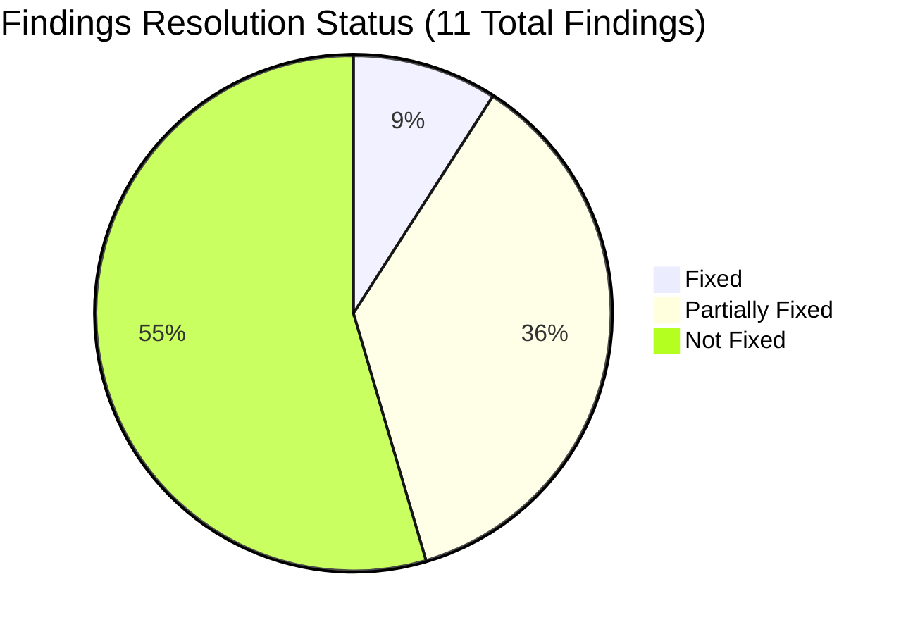
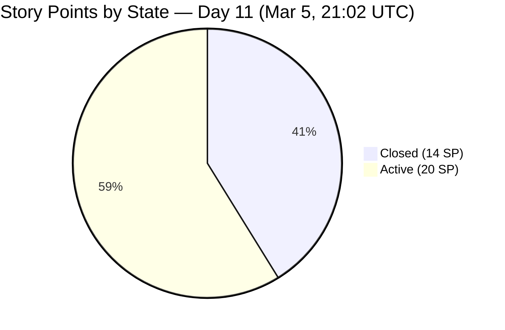
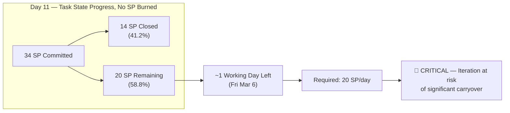
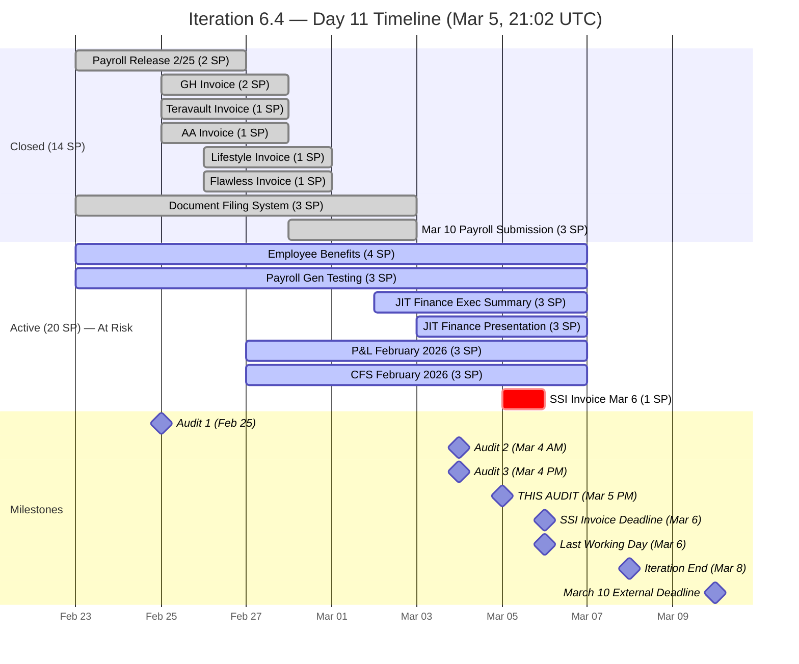
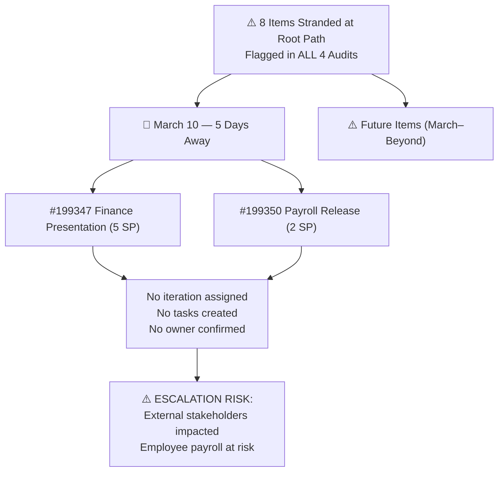
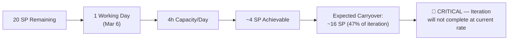
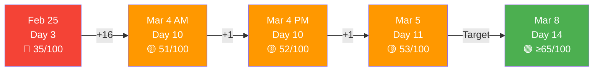

# SAFe Audit Report — Finance Team

**Project:** Jairosoft FINOPS
**Team:** Finance Team
**Iteration:** Iteration 6.4 (PI 2026-PI6)
**Iteration Window:** February 23, 2026 – March 8, 2026
**Audit Date:** March 5, 2026 — 21:02 UTC (Day 11 of 14)
**Previous Audits:** Feb 25, 2026 (AUDIT_2026-02-25_0700) · Mar 4, 2026 AM (AUDIT_2026-03-04_0222) · Mar 4, 2026 PM (AUDIT_2026-03-04_2209)
**Auditor:** AI Agile Project Management Consultant
**Framework:** SAFe 6.0 (Scaled Agile Framework)

---

## 1. Executive Summary

This is the **fourth audit** of the Finance Team's Iteration 6.4, conducted on Day 11 of 14. The iteration closes in **3 calendar days** (approximately **1 working day** — Friday March 6), with March 8 falling on a Sunday.

**Overall Health Score: 53 / 100 (+1 pt vs. Prior Audit)**

| Category | Feb 25 | Mar 4 AM | Mar 4 PM | Mar 5 (This Audit) | Trend |
|---|---|---|---|---|---|
| Capacity Planning | 5/20 | 12/20 | 12/20 | 12/20 | ⚪ No Change |
| Iteration Planning | 10/20 | 12/20 | 12/20 | 12/20 | ⚪ No Change |
| Story Quality | 8/20 | 8/20 | 8/20 | 8/20 | ⚪ No Change |
| Work-in-Progress Management | 7/20 | 14/20 | 14/20 | 15/20 | 🟢 +1 |
| Backlog Hygiene | 5/20 | 5/20 | 6/20 | 6/20 | ⚪ No Change |

**Key changes since Mar 4 PM audit:**
- ✅ Story **#197078 (SSI Invoice - March 6)** transitioned from **New → Active** — addressing the highest-priority urgent finding
- ✅ Three tasks moved from **New → Active**: #199729 (Executive Summary), #199753 (P&L Report), #199757 (CFS February)
- ⚠️ Task **#199731** (SSI Invoice submission) remains **New** — deadline is **tomorrow March 6**
- ❌ No stories transitioned to Closed; 20 SP still remaining

**Critical Alert:** Only **1 full working day** (Friday March 6) remains before the practical end of the iteration. The SSI Invoice task (#199731) must be completed **today or first thing tomorrow**.

---

## 2. Previous Findings Resolution Status

### 2.1 Cumulative Resolution Scorecard (All 4 Audits)

| # | Severity | Finding | Feb 25 | Mar 4 AM | Mar 4 PM | Mar 5 (Now) | Status |
|---|---|---|---|---|---|---|---|
| A | 🚨 Urgent | SSI Invoice Mar 6 still not started | — | 🚨 New | 🚨 Persists | 🟡 Partial | Story Active, task still New |
| 1 | 🔴 Critical | Zero capacity configured | ❌ | 🟡 Partial | 🟡 Partial | 🟡 Partial | 4h/day "Documentation" only |
| 2 | 🔴 Critical | Single point of failure | ❌ | ❌ | 🟡 Partial | 🟡 Partial | All work assigned to Grace |
| 3 | 🔴 Critical | 8 items missing iteration | ❌ | ❌ | ❌ | ❌ | All 8 still at root path |
| 4 | 🟡 Major | Stories lack SAFe format | ❌ | ❌ | ❌ | ❌ | Still simple task titles |
| 5 | 🟡 Major | Minimal acceptance criteria | ❌ | ❌ | ❌ | ❌ | Still single-line |
| 6 | 🟡 Major | No task decomposition | ❌ | ✅ Fixed | ✅ Fixed | ✅ Fixed | Resolved, maintained |
| 7 | 🟡 Major | Overcommitment risk | ❌ | 🟡 | 🟡 | 🟡 | 20 SP remain in ~1 working day |
| 8 | 🟢 Minor | No team estimation process | ❌ | ❌ | ❌ | ❌ | Solo team limitation |
| 9 | 🟢 Minor | No tags/labels used | ❌ | ❌ | ❌ | ❌ | No tags applied |
| 10 | 🟢 Minor | Feature #197084 state inconsistency | ❌ | ❌ | ❌ | ❌ | Still unverified |

**Notable improvement:** Finding A (SSI Invoice) improved from 🚨 Critical to 🟡 Partial — Grace moved the story to Active. The remaining gap is completing the associated task (#199731).

---

## 3. Iteration Status — Day 11 Snapshot

### 3.1 Story State Distribution

| State | Count | Story Points | % of Total SP | Δ vs Mar 4 PM |
|---|---|---|---|---|
| Closed | 8 | 14 | 41.2% | ⚪ No Change |
| Active | 7 | 20 | 58.8% | 🟢 +1 Story (SSI Invoice) |
| New | 0 | 0 | 0% | 🟢 -1 (SSI moved to Active) |
| **Total** | **15** | **34** | **100%** | — |

### 3.2 Work Item Status — Stories

| ID | Title | State | SP | Change Since Mar 4 PM |
|---|---|---|---|---|
| 199222 | Payroll Release - 2/25 | ✅ Closed | 2 | ⚪ No Change |
| 199349 | March 10th initial payroll submission | ✅ Closed | 3 | ⚪ No Change |
| 197079 | GH Invoice | ✅ Closed | 2 | ⚪ No Change |
| 197080 | Teravault Invoice | ✅ Closed | 1 | ⚪ No Change |
| 197081 | AA Invoice | ✅ Closed | 1 | ⚪ No Change |
| 197082 | Lifestyle Invoice | ✅ Closed | 1 | ⚪ No Change |
| 197083 | Flawless Invoice | ✅ Closed | 1 | ⚪ No Change |
| 197845 | Document Filing System | ✅ Closed | 3 | ⚪ No Change |
| 199351 | Input Employee Benefits in the portal | 🔵 Active | 4 | ⚪ No Change |
| 199354 | Payroll Generation Testing | 🔵 Active | 3 | ⚪ No Change |
| 199471 | JIT Finance Executive Summary | 🔵 Active | 3 | ⚪ No Change |
| 199348 | JIT Finance Presentation | 🔵 Active | 3 | ⚪ No Change |
| 198634 | P&L February 2026 | 🔵 Active | 3 | ⚪ No Change |
| 198644 | CFS February 2026 | 🔵 Active | 3 | ⚪ No Change |
| **197078** | **SSI Invoice - March 6** | 🔵 **Active** | 1 | 🟢 **New → Active** ⚠️ |

### 3.3 Task Status Summary

| Task State | Mar 4 PM Count | Mar 5 Count | Δ |
|---|---|---|---|
| Closed | 12 | 12 | ⚪ No Change |
| Active | 3 | 6 | 🟢 +3 |
| New | 5 | 2 | 🟢 -3 |
| **Total** | **20** | **20** | — |

**Active tasks (in-progress):**

| Task ID | Title | Parent Story | Remaining Hours | Δ |
|---|---|---|---|---|
| 199711 | Input Salary | #199351 Employee Benefits | 2h | ⚪ |
| 199712 | Input Deduction | #199351 Employee Benefits | 3h | ⚪ |
| 199729 | Create Executive Summary | #199471 JIT Finance Exec Summary | 1h | 🟢 New→Active |
| 199733 | Prepare Feb JIT Finance Report | #199348 JIT Finance Presentation | 1h | ⚪ |
| 199753 | Prepare P&L Report | #198634 P&L February 2026 | 1h | 🟢 New→Active |
| 199757 | Prepare CFS February | #198644 CFS February 2026 | 1h | 🟢 New→Active |

**New tasks (not yet started):**

| Task ID | Title | Parent Story | Remaining Hours | Risk |
|---|---|---|---|---|
| 199731 | Submission of SSI Invoice for March 6 | #197078 SSI Invoice | 0.5h | 🚨 Deadline TOMORROW Mar 6 |
| 199714 | Generate Payroll Test | #199354 Payroll Gen Testing | 1h | ⚠️ Last working day |

**Total Remaining Task Hours: 10.5h** (unchanged from Mar 4 PM — no work burned since last audit, only status labels updated)

---

## 4. Burndown & Risk Analysis

### 4.1 Burndown Trajectory

### 4.2 Burndown Projection Table

| Metric | Mar 4 PM | Mar 5 (Now) | Delta |
|---|---|---|---|
| Total Committed SP | 34 | 34 | — |
| Closed SP | 14 (41.2%) | 14 (41.2%) | 0 |
| Remaining SP | 20 (58.8%) | 20 (58.8%) | 0 |
| Calendar Days Remaining | 4 | 3 | -1 |
| Working Days Remaining | ~2.5 | ~1 | -1.5 ⬇️ |
| Required SP/Working Day | ~6.7 | ~20 | +13.3 ⬆️ |
| Remaining Task Hours | 10.5h | 10.5h | 0 |

**Observation:** Despite 3 tasks transitioning to Active and the SSI Invoice story moving to Active, **no story points were actually burned** and no task hours were consumed. The gap between task state labels and actual work completion is widening. With only Friday March 6 remaining as a practical working day, the iteration faces near-certain carryover of 13–20 SP.

### 4.3 Iteration Timeline

---

## 5. Audit Findings

### 🟡 FINDING A — IMPROVED: SSI Invoice March 6 — Story Active, Task Still New

**Prior Status (Mar 4 PM):** 🚨 Critical — Story and task both in New state, <48 hrs to deadline
**Current Status:** 🟡 Partially Resolved — Story **#197078 moved to Active**, but task **#199731 still New**

| Item | Mar 4 AM | Mar 4 PM | Mar 5 (Now) | Change |
|---|---|---|---|---|
| #197078 SSI Invoice Mar 6 (Story) | New | New | 🔵 **Active** | 🟢 Improved |
| #199731 SSI Invoice Task | New | New | 🟡 **New** | ⚪ No Change |

**Assessment:** Grace has acknowledged this work by setting the story Active. However, the task (#199731) remains New with 0.5 hours of remaining work. The SSI Invoice **must be submitted by tomorrow (March 6)**. This is the single most time-critical item in the iteration.

**Immediate Action Required (Tonight / First Thing March 6):**
- Activate task #199731 and complete the submission. Estimated 0.5h effort.
- Move #199731 → Active → Closed
- Move #197078 → Closed upon completion

---

### 🔴 FINDING 3 — CRITICAL (PERSISTS 4 AUDITS): March 10 Items Still Stranded

**Status:** ❌ No change. All 8 unplanned items remain at the root "Jairosoft FINOPS" iteration path.

| ID | Title | SP | Deadline | Risk Level |
|---|---|---|---|---|
| 199347 | March 10 Jairosoft Finance Presentation | 5 | Mar 10 | 🚨 5 days — CRITICAL |
| 199350 | March 10th Payroll Release | 2 | Mar 10 | 🚨 5 days — CRITICAL |
| 198639 | Balance Sheet March 2026 | 3 | Mar 31 | ⚠️ Future iteration |
| 199469 | Back Lot Payables | 3 | TBD | ⚠️ Unplanned |
| 198611 | SSI Invoice - March 20 | 1 | Mar 20 | ⚠️ Next iteration |
| 198635 | P&L March 2026 | 4 | Mar 31 | ⚠️ Future iteration |
| 198645 | CFS March 2026 | 3 | Mar 31 | ⚠️ Future iteration |
| 198647 | AFS Submission 2025-2026 | 3 | TBD | ⚠️ Assigned to Grace |

**This finding has been flagged across all 4 consecutive audits without resolution.** Given that March 10 is now only 5 days away and with the current iteration closing March 8, the Product Owner has at most **tomorrow (March 6)** to formalize these into an iteration plan.

---

### 🟡 FINDING 7 — ESCALATED: Overcommitment Now Extreme

**Prior Status (Mar 4 PM):** 🟡 Major — 20 SP remain, ~3 working days
**Current Status:** 🔴 Escalated to Critical — 20 SP remain, ~1 working day

The burndown gap has widened dramatically. With capacity of 4 hours/day and Grace as the sole team member, the maximum throughput for Friday March 6 is approximately **4 story points** — far below the 20 SP remaining.

**Recommended triage for March 6:**
1. SSI Invoice (#197078 / #199731) — must complete, external commitment
2. JIT Finance Presentation (#199348) — highest SP value at risk
3. JIT Finance Executive Summary (#199471) — companion deliverable
4. P&L February 2026 (#198634) — financial reporting obligation
5. CFS February 2026 (#198644) — financial reporting obligation

---

### Unchanged Findings (No Progress)

| Finding | Severity | Status | Notes |
|---|---|---|---|
| #1 — Capacity incomplete | 🔴 Critical | 🟡 Partial | Still 4h/day "Documentation" only |
| #4 — Stories lack SAFe format | 🟡 Major | ❌ Not Fixed | Defer to Iteration 6.5 |
| #5 — Minimal acceptance criteria | 🟡 Major | ❌ Not Fixed | Defer to Iteration 6.5 |
| #9 — No tags/labels | 🟢 Minor | ❌ Not Fixed | Defer to Iteration 6.5 |
| #10 — Feature #197084 state | 🟢 Minor | ❌ Not Fixed | Low priority |

---

## 6. SAFe Compliance Scorecard

| SAFe Practice | Feb 25 | Mar 4 AM | Mar 4 PM | Mar 5 | Trend |
|---|---|---|---|---|---|
| Iteration Planning Event | ⚠️ Partial | ⚠️ Partial | ⚠️ Partial | ⚠️ Partial | ⚪ |
| Capacity-Based Planning | ❌ Missing | 🟡 Partial | 🟡 Partial | 🟡 Partial | ⚪ |
| Story Format (INVEST) | ❌ Non-Compliant | ❌ Non-Compliant | ❌ Non-Compliant | ❌ Non-Compliant | ⚪ |
| Acceptance Criteria | ⚠️ Minimal | ⚠️ Minimal | ⚠️ Minimal | ⚠️ Minimal | ⚪ |
| Task Decomposition | ❌ Missing | ✅ Implemented | ✅ Implemented | ✅ Maintained | ⚪ |
| Daily Stand-Up Readiness | ⚠️ Partial | ✅ Enabled | ✅ Enabled | ✅ Enabled | ⚪ |
| Iteration Burndown | ❌ Not Possible | 🟡 Partial | 🟡 Partial | 🟡 Partial | ⚪ |
| Board Updates (Real-Time) | ⚠️ Unknown | ⚠️ Unknown | ⚠️ Concern | ⚠️ Concern | ⚪ |
| WIP Limits | ❌ Not Set | ❌ Not Set | ❌ Not Set | ❌ Not Set | ⚪ |
| Definition of Done | ⚠️ Unknown | ⚠️ Unknown | ⚠️ Unknown | ⚠️ Unknown | ⚪ |
| Backlog Refinement | ⚠️ Partial | ⚠️ Partial | ⚠️ Partial | ⚠️ Partial | ⚪ |

**Observation:** Task state transitions (New→Active) occurred since the last audit, indicating the board is being maintained. However, remaining work hours have not decreased, suggesting **states are being updated in advance of actual work completion** rather than in real-time with hour-logging. This is a minor board discipline concern but does not negate the progress.

---

## 7. Health Score Trend

| Category | Feb 25 | Mar 4 AM | Mar 4 PM | Mar 5 | Target |
|---|---|---|---|---|---|
| Capacity Planning | 5/20 | 12/20 | 12/20 | 12/20 | 16/20 |
| Iteration Planning | 10/20 | 12/20 | 12/20 | 12/20 | 16/20 |
| Story Quality | 8/20 | 8/20 | 8/20 | 8/20 | 12/20 |
| WIP Management | 7/20 | 14/20 | 14/20 | 15/20 | 16/20 |
| Backlog Hygiene | 5/20 | 5/20 | 6/20 | 6/20 | 10/20 |
| **Total** | **35** | **51** | **52** | **53** | **70** |

The health score is improving at a rate of ~1 point per audit cycle, driven by incremental task state improvements. To reach the 65/100 target by iteration end, the team needs to close multiple stories on March 6.

---

## 8. Recommendations — Final Day Action Plan

### 🚨 Tonight / First Thing March 6 — Non-Negotiable

| # | Action | Owner | Work Item | Effort |
|---|---|---|---|---|
| 1 | **COMPLETE SSI Invoice March 6** — Activate task #199731, submit invoice, close task and story | Grace | #197078 / #199731 | 0.5h |
| 2 | **Formalize March 10 items into Iteration 6.4 or emergency sprint** — #199347 and #199350 must have an iteration assignment by EOB March 6 | Product Owner | #199347, #199350 | 0.5h PM |

### 🔴 Friday March 6 — Last Working Day (Prioritized Order)

| # | Action | Owner | Work Items | SP | Effort |
|---|---|---|---|---|---|
| 3 | Close JIT Finance Presentation & Exec Summary | Grace | #199348, #199471 | 6 SP | ~2h |
| 4 | Close P&L February & CFS February | Grace | #198634, #198644 | 6 SP | ~2h |
| 5 | Close Employee Benefits | Grace | #199351 | 4 SP | ~2h |
| 6 | Close Payroll Generation Testing | Grace | #199354 | 3 SP | ~1h |

### 🟡 Iteration 6.5 Planning (Start March 9)

| # | Action | Owner |
|---|---|---|
| 7 | Assign all 8 unplanned backlog items to target iterations | Product Owner |
| 8 | Rewrite stories in SAFe "As a / I want / So that" format | Product Owner |
| 9 | Expand acceptance criteria to Given/When/Then format | Product Owner |
| 10 | Expand capacity configuration beyond "Documentation" (add Finance Ops, Payroll, Reporting) | Scrum Master |
| 11 | Create tag taxonomy and apply to all items | Team |
| 12 | Establish velocity tracking across PI6 iterations | Scrum Master |

---

## 9. Conclusion

The March 5 audit reveals **meaningful process progress** — Grace has activated the SSI Invoice story and three additional tasks, demonstrating awareness of the deadline pressure. However, **no story points have actually been burned** since the March 4 PM audit, and with only one practical working day remaining (March 6), the iteration is heading toward significant carryover.

The **single most critical item is completing the SSI Invoice submission** (task #199731, 0.5h) tonight or first thing tomorrow morning. This represents an active external commitment due March 6 and was flagged as urgent in all prior audits.

The secondary priority is the **March 10 Finance Presentation and Payroll Release** items, which remain stranded without an iteration assignment despite being flagged across all four audits. With March 10 now 5 days away, these items are at risk of missing their external deadline as well.

The Finance Team has demonstrated a solid foundation with strong early delivery (14 SP closed by Day 7), task decomposition, and responsive board maintenance. The challenge is the asymmetric back-loading of complex deliverables (financial reports, summaries) into the final days. This is a pattern to address in Iteration 6.5 planning.

---

*Report generated on March 5, 2026 at 21:02 UTC.*
*Data source: Azure DevOps — Jairosoft FINOPS / Finance Team / Iteration 6.4*
*Framework: SAFe 6.0 (Scaled Agile Framework)*
*Previous Audits: AUDIT_2026-02-25_0700.md · AUDIT_2026-03-04_0222.md · AUDIT_2026-03-04_2209.md*
