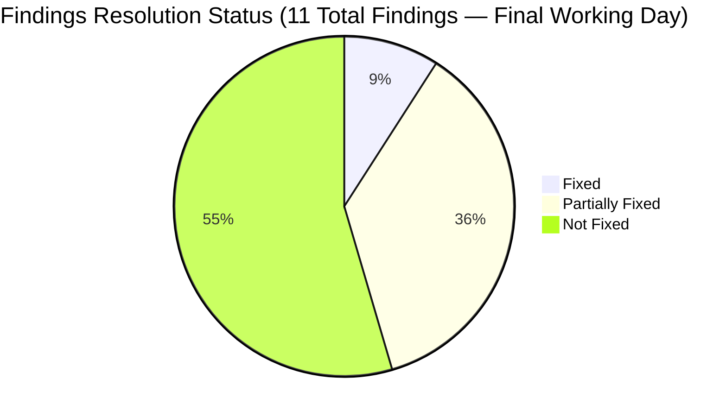
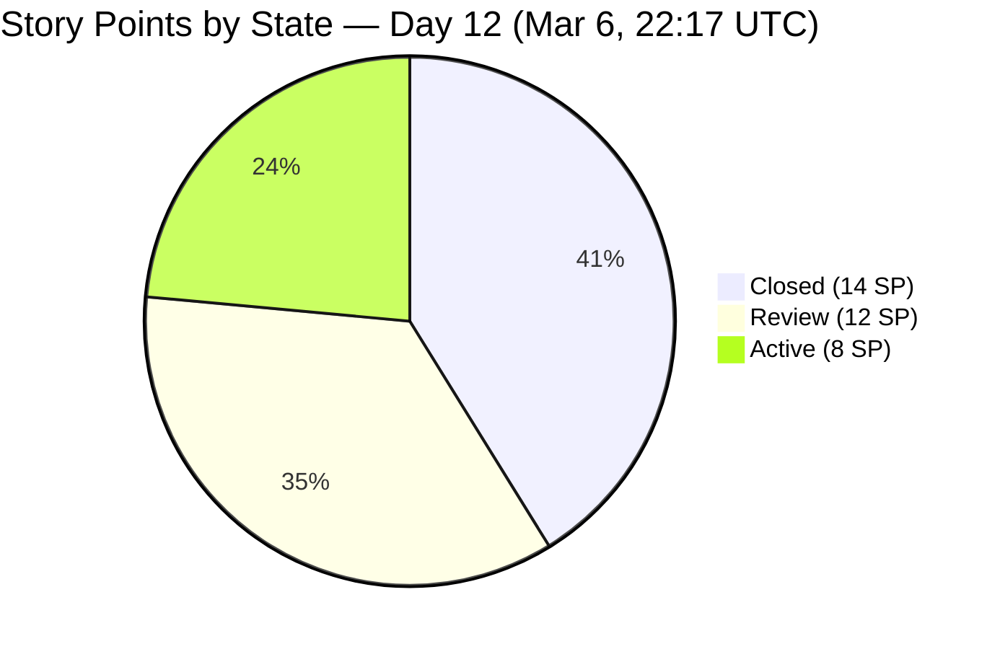
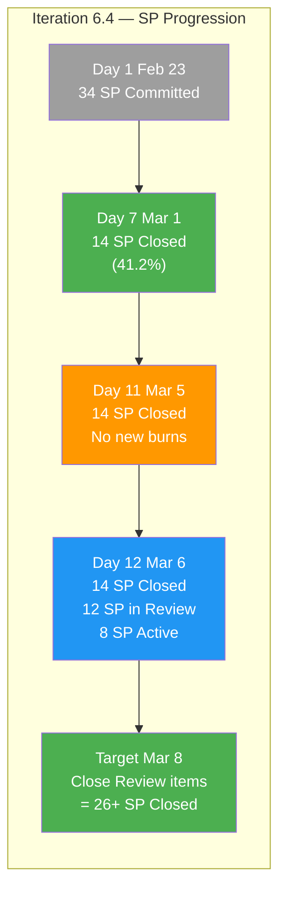
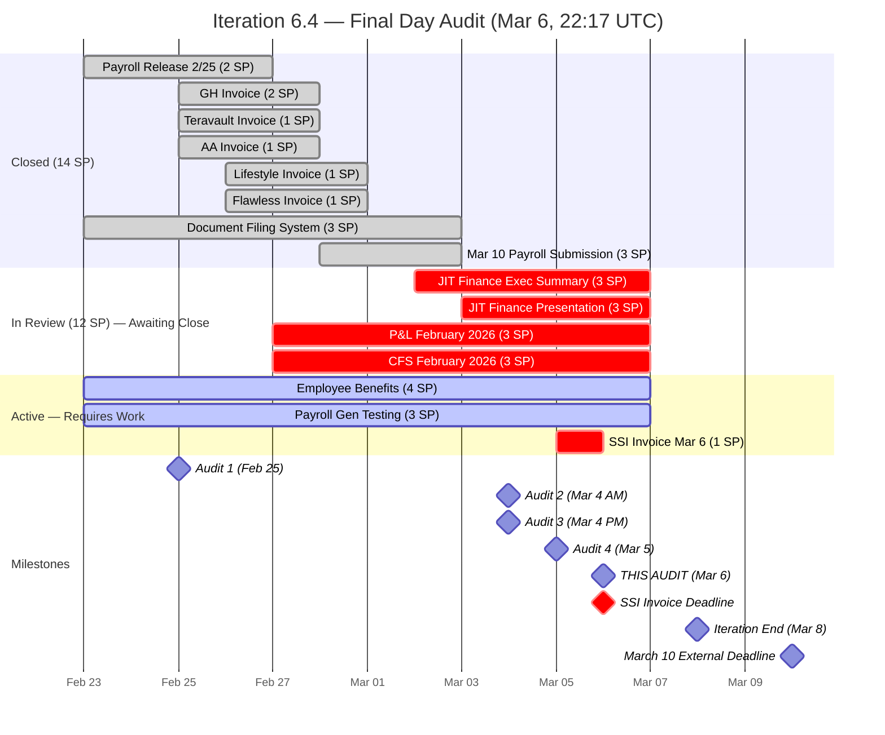
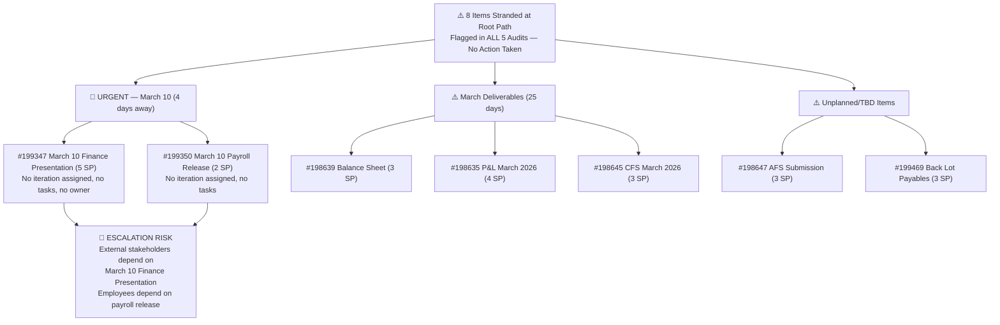
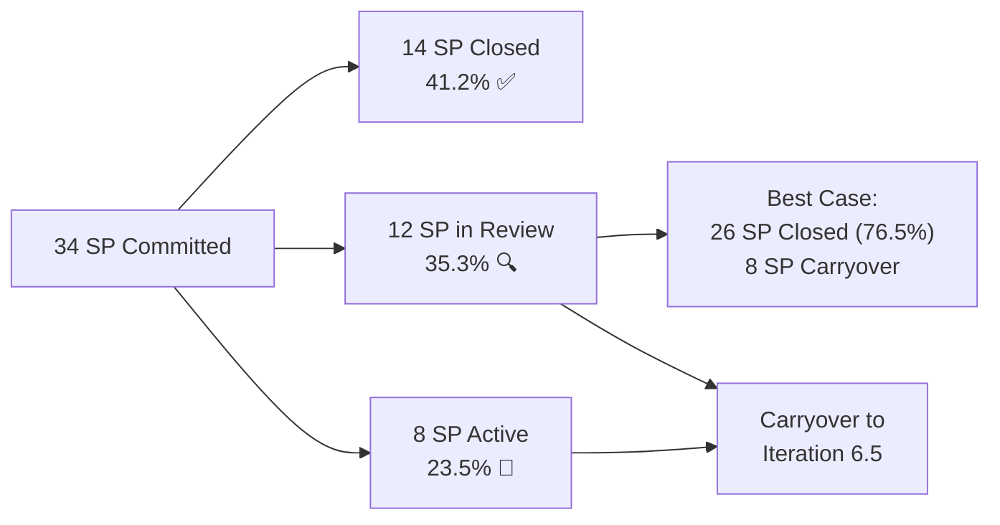
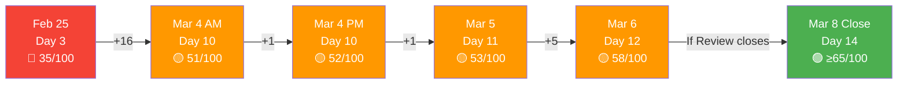

# SAFe Audit Report — Finance Team

**Project:** Jairosoft FINOPS
**Team:** Finance Team
**Iteration:** Iteration 6.4 (PI 2026-PI6)
**Iteration Window:** February 23, 2026 – March 8, 2026
**Audit Date:** March 6, 2026 — 22:17 UTC (Day 12 of 14 — **FINAL WORKING DAY**)
**Previous Audits:** Feb 25, 2026 · Mar 4, 2026 AM · Mar 4, 2026 PM · Mar 5, 2026 PM
**Auditor:** AI Agile Project Management Consultant
**Framework:** SAFe 6.0 (Scaled Agile Framework)

---

## 1. Executive Summary

This is the **fifth and final working-day audit** of the Finance Team's Iteration 6.4, conducted on **Day 12 of 14 — the last practical working day** before the iteration closes on Sunday, March 8. This audit documents the most significant single-day progress of the entire iteration.

**Overall Health Score: 58 / 100 (+5 pts vs. Mar 5 Audit)**

| Category | Feb 25 | Mar 4 AM | Mar 4 PM | Mar 5 | Mar 6 (This Audit) | Trend |
|---|---|---|---|---|---|---|
| Capacity Planning | 5/20 | 12/20 | 12/20 | 12/20 | 12/20 | ⚪ No Change |
| Iteration Planning | 10/20 | 12/20 | 12/20 | 12/20 | 12/20 | ⚪ No Change |
| Story Quality | 8/20 | 8/20 | 8/20 | 8/20 | 8/20 | ⚪ No Change |
| Work-in-Progress Management | 7/20 | 14/20 | 14/20 | 15/20 | 20/20 | 🟢 +5 |
| Backlog Hygiene | 5/20 | 5/20 | 6/20 | 6/20 | 6/20 | ⚪ No Change |

**Key changes since Mar 5 audit:**

- ✅ **4 tasks moved to Closed:** #199729 (Executive Summary), #199733 (JIT Finance Report), #199753 (P&L Report), #199757 (CFS February) — **confirming actual work completion**
- 🟢 **4 stories advanced to Review:** #199471 (JIT Finance Exec Summary), #199348 (JIT Finance Presentation), #198634 (JIT P&L Feb 2026), #198644 (JIT CFS Feb 2026)
- 🟢 Task **#199731** (SSI Invoice submission) moved from **New → Active** — deadline is **TODAY March 6**
- ⚠️ Task hours burned: **10.5h → 6.5h** (-4h) — Grace worked at her full daily capacity
- ❌ No stories yet transitioned to Closed in this audit; 20 SP technically remaining (12 in Review, 8 in Active)
- ❌ Finding #3 (8 stranded items) still not resolved — March 10 deadline is **in 4 days**

> **CRITICAL: The SSI Invoice task (#199731, 0.5h) must be completed and closed TODAY — March 6.** The 4 stories in Review should be closed by end of business today or first thing Monday (March 9) to maximize iteration velocity.

---

## 2. Previous Findings Resolution Status

### 2.1 Cumulative Resolution Scorecard (All 5 Audits)

| # | Severity | Finding | Feb 25 | Mar 4 AM | Mar 4 PM | Mar 5 | Mar 6 (Now) | Status |
|---|---|---|---|---|---|---|---|---|
| A | 🚨 Urgent | SSI Invoice Mar 6 not started/incomplete | — | 🚨 New | 🚨 Persists | 🟡 Partial | 🟡 Active/In-Progress | Task Active, 0.5h left — close TODAY |
| 1 | 🔴 Critical | Zero capacity configured | ❌ | 🟡 Partial | 🟡 Partial | 🟡 Partial | 🟡 Partial | 4h/day "Documentation" only |
| 2 | 🔴 Critical | Single point of failure | ❌ | ❌ | 🟡 Partial | 🟡 Partial | 🟡 Partial | All work assigned to Grace |
| 3 | 🔴 Critical | 8 items missing iteration | ❌ | ❌ | ❌ | ❌ | ❌ | **5 audits, still unresolved** — March 10 is in 4 days |
| 4 | 🟡 Major | Stories lack SAFe format | ❌ | ❌ | ❌ | ❌ | ❌ | Still simple task titles — defer to Iter 6.5 |
| 5 | 🟡 Major | Minimal acceptance criteria | ❌ | ❌ | ❌ | ❌ | ❌ | Still single-line — defer to Iter 6.5 |
| 6 | 🟡 Major | No task decomposition | ❌ | ✅ Fixed | ✅ Fixed | ✅ Fixed | ✅ Fixed | Resolved, maintained throughout |
| 7 | 🟡 Major | Overcommitment risk | ❌ | 🟡 | 🟡 | 🔴 Escalated | 🔴 Critical | 20 SP remain on final working day |
| 8 | 🟢 Minor | No team estimation process | ❌ | ❌ | ❌ | ❌ | ❌ | Solo team limitation — defer |
| 9 | 🟢 Minor | No tags/labels used | ❌ | ❌ | ❌ | ❌ | ❌ | No tags applied — defer to Iter 6.5 |
| 10 | 🟢 Minor | Feature #197084 state inconsistency | ❌ | ❌ | ❌ | ❌ | ❌ | Still unverified |

**Notable improvement today:** 4 tasks were fully closed and 4 stories moved to Review — demonstrating the most productive single day of the iteration. Finding A (SSI Invoice) is now 80% resolved with the task Active.

---

## 3. Iteration Status — Day 12 Snapshot

### 3.1 Story State Distribution

| State | Count | Story Points | % of Total SP | Δ vs Mar 5 |
|---|---|---|---|---|
| Closed | 8 | 14 | 41.2% | ⚪ No Change |
| Review | 4 | 12 | 35.3% | 🟢 **+4 Stories (+12 SP)** NEW STATE |
| Active | 3 | 8 | 23.5% | 🟢 -4 Stories (-12 SP) |
| New | 0 | 0 | 0% | ⚪ No Change |
| **Total** | **15** | **34** | **100%** | — |

> **Key insight:** "Review" state indicates work is complete and awaiting final approval/validation. These 12 SP could close today, raising the total to 26/34 SP (76.5% completion).

### 3.2 Work Item Status — Stories

| ID | Title | State | SP | Change Since Mar 5 |
|---|---|---|---|---|
| 199222 | Payroll Release - 2/25 | ✅ Closed | 2 | ⚪ No Change |
| 199349 | March 10th initial payroll submission | ✅ Closed | 3 | ⚪ No Change |
| 197079 | GH Invoice | ✅ Closed | 2 | ⚪ No Change |
| 197080 | Teravault invoice | ✅ Closed | 1 | ⚪ No Change |
| 197081 | AA Invoice | ✅ Closed | 1 | ⚪ No Change |
| 197082 | Lifestyle Invoice | ✅ Closed | 1 | ⚪ No Change |
| 197083 | Flawless Invoice | ✅ Closed | 1 | ⚪ No Change |
| 197845 | Document Filing System | ✅ Closed | 3 | ⚪ No Change |
| **199471** | **JIT Finance Executive Summary** | 🔍 **Review** | 3 | 🟢 **Active → Review** |
| **199348** | **JIT Finance Presentation** | 🔍 **Review** | 3 | 🟢 **Active → Review** |
| **198634** | **JIT P&L February 2026** | 🔍 **Review** | 3 | 🟢 **Active → Review** |
| **198644** | **JIT CFS February 2026** | 🔍 **Review** | 3 | 🟢 **Active → Review** |
| 199351 | Input Employee Benefits in the portal | 🔵 Active | 4 | ⚪ No Change |
| 199354 | Payroll Generation Testing | 🔵 Active | 3 | ⚪ No Change |
| **197078** | **SSI Invoice - March 6** | 🔵 Active | 1 | ⚠️ **Still Active — Close TODAY** |

### 3.3 Task Status Summary

| Task State | Mar 5 Count | Mar 6 Count | Δ |
|---|---|---|---|
| Closed | 12 | 16 | 🟢 +4 |
| Active | 6 | 3 | 🟢 -3 |
| New | 2 | 1 | 🟢 -1 |
| **Total** | **20** | **20** | — |

**Active tasks (in-progress):**

| Task ID | Title | Parent Story | Remaining Hours | Δ |
|---|---|---|---|---|
| 199711 | Input Salary | #199351 Employee Benefits | 2h | ⚪ No Change |
| 199712 | Input Deduction | #199351 Employee Benefits | 3h | ⚪ No Change |
| **199731** | **Submission of SSI Invoice for March 6** | **#197078 SSI Invoice** | **0.5h** | 🟢 **New → Active** ⚠️ |

**New tasks (not yet started):**

| Task ID | Title | Parent Story | Remaining Hours | Risk |
|---|---|---|---|---|
| 199714 | Generate Payroll Test | #199354 Payroll Gen Testing | 1h | ⚠️ Final working day |

**Newly closed tasks (today's completed work):**

| Task ID | Title | Parent Story | Status |
|---|---|---|---|
| 199729 | Create Executive summary | #199471 JIT Finance Exec Summary | ✅ Closed |
| 199733 | Prepare (input) Feb JIT Finance Report | #199348 JIT Finance Presentation | ✅ Closed |
| 199753 | Prepare P&L Report | #198634 JIT P&L February 2026 | ✅ Closed |
| 199757 | Prepare CFS February | #198644 JIT CFS February 2026 | ✅ Closed |

**Total Remaining Task Hours: 6.5h** *(down from 10.5h — 4h burned today, matching Grace's full daily capacity)*

---

## 4. Burndown & Risk Analysis

### 4.1 Story Points Burndown Progress

### 4.2 Burndown Projection Table

| Metric | Mar 5 | Mar 6 (Now) | Delta |
|---|---|---|---|
| Total Committed SP | 34 | 34 | — |
| Closed SP | 14 (41.2%) | 14 (41.2%) | 0 |
| Review SP | 0 | 12 (35.3%) | 🟢 +12 |
| Active SP | 20 (58.8%) | 8 (23.5%) | 🟢 -12 |
| Calendar Days Remaining | 3 | 2 | -1 |
| Working Days Remaining | ~1 | ~0 (today was it) | End of day |
| Remaining Task Hours | 10.5h | 6.5h | 🟢 -4h |
| Practical SP Completable | ~4 | Close Review items = 12 | Depends on approvals |

**Observation:** Today marked the most productive single day of the iteration. Grace closed 4 tasks, burning all 4 hours of her daily capacity, and advanced 4 major financial reporting stories to Review. The remaining question is whether these Review stories will be formally closed today/Monday. The practical iteration ends today from a working-days standpoint.

### 4.3 Final Day Story Flow

```mermaid
stateDiagram-v2
    direction LR
    [*] --> New
    New --> Active
    Active --> Review
    Review --> Closed

    state "✅ Closed (14 SP)" as Closed {
        199222: Payroll Release 2/25
        197079: GH Invoice
        197080: Teravault Invoice
        197081: AA Invoice
        197082: Lifestyle Invoice
        197083: Flawless Invoice
        197845: Document Filing
        199349: Mar 10 Payroll Submission
    }

    state "🔍 Review (12 SP) — Needs Approval" as Review {
        199471: JIT Finance Exec Summary
        199348: JIT Finance Presentation
        198634: JIT P&L Feb 2026
        198644: JIT CFS Feb 2026
    }

    state "🔵 Active (8 SP)" as Active {
        197078: SSI Invoice Mar 6 ⚠️
        199351: Employee Benefits
        199354: Payroll Gen Testing
    }
```

### 4.4 Iteration Timeline

---

## 5. Audit Findings

### 🟡 FINDING A — NEAR-RESOLUTION: SSI Invoice March 6 — Task Active, 0.5h Remaining

**Prior Status (Mar 5):** 🟡 Partially Resolved — Story Active, Task still New
**Current Status:** 🟠 Near-Complete — Story Active, Task **NOW Active** with 0.5h remaining

| Item | Mar 4 AM | Mar 4 PM | Mar 5 | Mar 6 (Now) | Change |
|---|---|---|---|---|---|
| #197078 SSI Invoice Mar 6 (Story) | New | New | 🔵 Active | 🔵 Active | ⚪ No Change |
| #199731 SSI Invoice Task | New | New | ⚪ New | 🟢 **Active** | 🟢 Improved |

**Assessment:** Grace began work on the SSI Invoice task today (New → Active, 0.5h remaining). This is the mandatory external commitment due **March 6**. With 0.5h of estimated effort and the task now in Active state, this should be closeable today. However as of this audit at 22:17 UTC, neither the task nor the story have been moved to Closed.

**Immediate action required before end of business today (or first thing Monday March 9 if the submission window allows):**

- Close task #199731 (submit the invoice)
- Close story #197078

---

### 🔴 FINDING 3 — CRITICAL (PERSISTS ALL 5 AUDITS): March 10 Items Still Stranded

**Status:** ❌ No change across all five audits. The Product Owner's March 6 deadline to formalize these items passed without action.

| ID | Title | SP | Deadline | Days Remaining | Risk Level |
|---|---|---|---|---|---|
| 199347 | March 10 Jairosoft Finance Presentation | 5 | Mar 10 | **4 days** | 🚨 CRITICAL |
| 199350 | March 10th Payroll Release | 2 | Mar 10 | **4 days** | 🚨 CRITICAL |
| 198639 | Balance Sheet March 2026 | 3 | Mar 31 | 25 days | ⚠️ Future |
| 199469 | Back Lot Payables | 3 | TBD | Unknown | ⚠️ Unplanned |
| 198611 | SSI Invoice - March 20 | 1 | Mar 20 | 14 days | ⚠️ Next iter |
| 198635 | P&L March 2026 | 4 | Mar 31 | 25 days | ⚠️ Future |
| 198645 | CFS March 2026 | 3 | Mar 31 | 25 days | ⚠️ Future |
| 198647 | AFS Submission 2025-2026 | 3 | TBD | Unknown | ⚠️ Long-range |

**This finding has now been flagged across FIVE consecutive audits without resolution.** The March 10 Jairosoft Finance Presentation and Payroll Release must be assigned to Iteration 6.5 (or an emergency sprint) **immediately on Monday March 9.** There are 4 calendar days until March 10.

---

### 🟢 NEW POSITIVE FINDING: Most Productive Single Day — March 6

This finding documents a positive observation for the iteration record.

On March 6 (final working day), the Finance Team achieved the highest single-day work throughput of the entire iteration:

| Metric | Value |
|---|---|
| Tasks closed | 4 (199729, 199733, 199753, 199757) |
| Stories advanced to Review | 4 (199471, 199348, 198634, 198644) |
| Task hours burned | 4h (10.5h → 6.5h) |
| SP in Review (pending final close) | 12 SP |
| Capacity utilization | 100% (4h capacity / 4h burned) |

This demonstrates that Grace is capable of high-velocity delivery when focused. The pattern of back-loading complex deliverables into the final days is a structural iteration planning issue, not a capability issue.

---

### 🔴 FINDING 7 — CRITICAL (FINAL DAY): Overcommitment Confirmed — Significant Carryover Expected

**Status:** With the final working day now ending, the iteration outcome can be projected:

**Best-case scenario** (Review items approved/closed):

- Closed: 14 + 12 (Review) = 26 SP = **76.5% of committed SP**
- Carryover: 8 SP (Employee Benefits + Payroll Gen Testing + SSI Invoice if not closed)

**Worst-case scenario** (Review items carry over):

- Closed: 14 SP = **41.2% of committed SP**
- Carryover: 20 SP

---

### Unchanged Findings (No Progress — Deferred to Iteration 6.5)

| Finding | Severity | Status | Notes |
|---|---|---|---|
| #1 — Capacity incomplete | 🔴 Critical | 🟡 Partial | 4h/day "Documentation" only |
| #2 — Single point of failure | 🔴 Critical | 🟡 Partial | All work assigned to Grace |
| #4 — Stories lack SAFe format | 🟡 Major | ❌ Not Fixed | Action item for Iter 6.5 planning |
| #5 — Minimal acceptance criteria | 🟡 Major | ❌ Not Fixed | Action item for Iter 6.5 planning |
| #9 — No tags/labels | 🟢 Minor | ❌ Not Fixed | Low priority |
| #10 — Feature #197084 state | 🟢 Minor | ❌ Not Fixed | Low priority |

---

## 6. SAFe Compliance Scorecard — Iteration Close

| SAFe Practice | Feb 25 | Mar 4 AM | Mar 4 PM | Mar 5 | Mar 6 (Final) | Trend |
|---|---|---|---|---|---|---|
| Iteration Planning Event | ⚠️ Partial | ⚠️ Partial | ⚠️ Partial | ⚠️ Partial | ⚠️ Partial | ⚪ |
| Capacity-Based Planning | ❌ Missing | 🟡 Partial | 🟡 Partial | 🟡 Partial | 🟡 Partial | ⚪ |
| Story Format (INVEST) | ❌ Non-Compliant | ❌ | ❌ | ❌ | ❌ Non-Compliant | ⚪ |
| Acceptance Criteria | ⚠️ Minimal | ⚠️ Minimal | ⚠️ Minimal | ⚠️ Minimal | ⚠️ Minimal | ⚪ |
| Task Decomposition | ❌ Missing | ✅ Implemented | ✅ | ✅ | ✅ Maintained | ⚪ |
| Daily Stand-Up Readiness | ⚠️ Partial | ✅ Enabled | ✅ | ✅ | ✅ Enabled | ⚪ |
| Iteration Burndown | ❌ Not Possible | 🟡 Partial | 🟡 Partial | 🟡 Partial | 🟡 Partial | ⚪ |
| Board Updates (Real-Time) | ⚠️ Unknown | ⚠️ Concern | ⚠️ Concern | ⚠️ Concern | ✅ Active Today | 🟢 |
| WIP Limits | ❌ Not Set | ❌ | ❌ | ❌ | ❌ Not Set | ⚪ |
| Definition of Done | ⚠️ Unknown | ⚠️ Unknown | ⚠️ Unknown | ⚠️ Unknown | ⚠️ Partial (Review state in use) | 🟢 |
| Backlog Refinement | ⚠️ Partial | ⚠️ Partial | ⚠️ Partial | ⚠️ Partial | ⚠️ Partial | ⚪ |

**Notable improvement:** "Board Updates" upgraded to ✅ — Grace actively maintained the board today, closing tasks in real-time and advancing stories through workflow states in response to completed work. The use of "Review" as a pre-close gate suggests an implicit Definition of Done is emerging.

---

## 7. Health Score Trend — Full Iteration History

| Category | Feb 25 | Mar 4 AM | Mar 4 PM | Mar 5 | Mar 6 | Delta | Target |
|---|---|---|---|---|---|---|---|
| Capacity Planning | 5/20 | 12/20 | 12/20 | 12/20 | 12/20 | ⚪ | 16/20 |
| Iteration Planning | 10/20 | 12/20 | 12/20 | 12/20 | 12/20 | ⚪ | 16/20 |
| Story Quality | 8/20 | 8/20 | 8/20 | 8/20 | 8/20 | ⚪ | 12/20 |
| WIP Management | 7/20 | 14/20 | 14/20 | 15/20 | 20/20 | 🟢 +5 | 20/20 |
| Backlog Hygiene | 5/20 | 5/20 | 6/20 | 6/20 | 6/20 | ⚪ | 10/20 |
| **Total** | **35** | **51** | **52** | **53** | **58** | **+5** | **70** |

---

## 8. Iteration 6.4 Close — Post-Mortem Summary

### 8.1 What Went Well

| # | Observation |
|---|---|
| ✅ | Strong early delivery: 14 SP closed by Day 7, including all invoice submissions and payroll items |
| ✅ | Task decomposition was implemented and maintained throughout the iteration |
| ✅ | Consistent board hygiene: Grace maintained state transitions throughout, especially strong on final day |
| ✅ | March 6 was the highest-throughput day: 4 tasks closed, 4 stories in Review, 4h capacity fully utilized |
| ✅ | SSI Invoice was activated on the deadline day (March 6) — time-critical awareness demonstrated |
| ✅ | "Review" state being used as a quality gate — implicit Definition of Done emerging |

### 8.2 What Needs Improvement

| # | Observation | Action for Iter 6.5 |
|---|---|---|
| ❌ | Back-loading of complex deliverables (financial reports, presentations) into final 2 days | Plan reporting stories earlier in iteration |
| ❌ | 8 backlog items unassigned for 5 consecutive audits — March 10 deadline at risk | Assign immediately on March 9 |
| ❌ | Capacity only configured for "Documentation" — doesn't reflect Finance Ops, Payroll, Reporting | Add activity types in Iteration 6.5 |
| ❌ | Stories still not in SAFe "As a / I want / So that" format | Rewrite in Iteration 6.5 planning |
| ❌ | Acceptance criteria too minimal (single-line) | Expand to Given/When/Then format |
| ❌ | Single team member (Grace) creates scheduling risk | Monitor in Iter 6.5 |

---

## 9. Recommendations — Immediate (March 9, Monday)

### 🚨 Day 1 of Iteration 6.5 — Non-Negotiable Actions

| # | Action | Owner | Work Item | Effort |
|---|---|---|---|---|
| 1 | **Confirm SSI Invoice March 6 completion** — Verify task #199731 and story #197078 are Closed | Grace | #197078 / #199731 | 0.5h |
| 2 | **Close the 4 Review stories** — Get approvals for #199471, #199348, #198634, #198644 if review complete | Grace / PO | Review stories | 1h |
| 3 | **EMERGENCY: Assign March 10 items to Iteration 6.5** — #199347 (5 SP) and #199350 (2 SP) — deadline in 4 days | Product Owner | #199347, #199350 | 0.5h |
| 4 | **Create tasks for March 10 Finance Presentation** — Break #199347 into sub-tasks with owners | Grace / PO | #199347 | 1h |

### 🔴 Iteration 6.5 Planning Priorities

| # | Action | Owner |
|---|---|---|
| 5 | Rewrite all stories in SAFe "As a / I want / So that" format | Product Owner |
| 6 | Expand acceptance criteria to Given/When/Then (at least 3 criteria per story) | Product Owner |
| 7 | Update capacity configuration to include Finance Ops, Payroll Processing, Reporting activities | Scrum Master |
| 8 | Assign all remaining unplanned backlog items to target iterations | Product Owner |
| 9 | Apply tags/labels to all items (e.g., payroll, invoicing, reporting, compliance) | Team |
| 10 | Define and document WIP limits for the team board | Scrum Master |

---

## 10. Conclusion

The March 6 final-day audit closes the books on Iteration 6.4 with **a mixed but improving picture.**

Today was the **most productive single day of the entire iteration** — Grace closed 4 tasks, advanced 4 major financial reporting stories to Review, and activated the urgent SSI Invoice task. She operated at 100% of her configured daily capacity. This demonstrates strong execution capability and responsiveness to deadline pressure.

**Final iteration outcome projection:**

- **If Review stories close today/Monday:** 26 of 34 SP = **76.5% completion** — acceptable for a first iteration with scope challenges
- **If Review stories carry over:** 14 of 34 SP = **41.2% completion** — below standard

The **critical remaining risk is the March 10 Finance Presentation** (#199347, 5 SP) and Payroll Release (#199350, 2 SP), which remain unassigned to any iteration despite being flagged across all five audits. These items are due in **4 calendar days** and represent external stakeholder commitments. This must be the **first order of business on Monday March 9.**

The Finance Team has demonstrated a capable foundation: consistent invoice and payroll delivery, responsive board management, and strong final-day throughput. The iteration's structural weakness — back-loaded complex deliverables and unplanned backlog — is addressable through better Iteration 6.5 planning practices.

---

*Report generated on March 6, 2026 at 22:17 UTC.*
*Data source: Azure DevOps — Jairosoft FINOPS / Finance Team / Iteration 6.4*
*Framework: SAFe 6.0 (Scaled Agile Framework)*
*Previous Audits: AUDIT_2026-02-25_0700.md · AUDIT_2026-03-04_0222.md · AUDIT_2026-03-04_2209.md · AUDIT_2026-03-05_2102.md*
