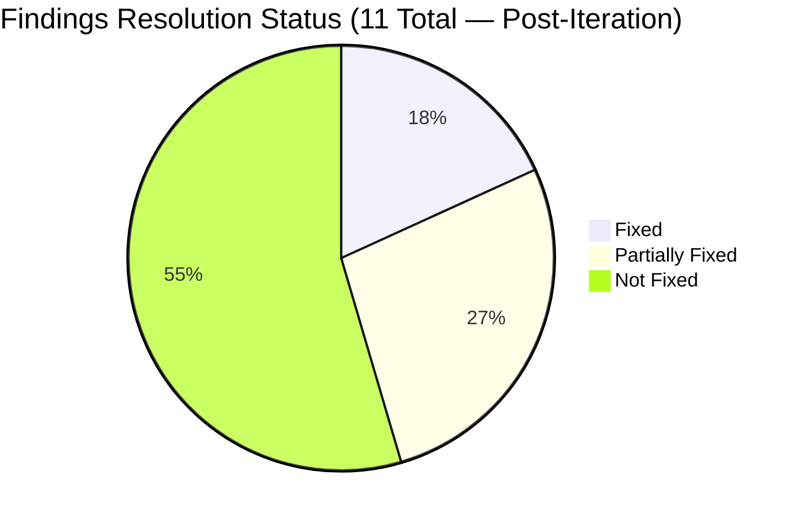
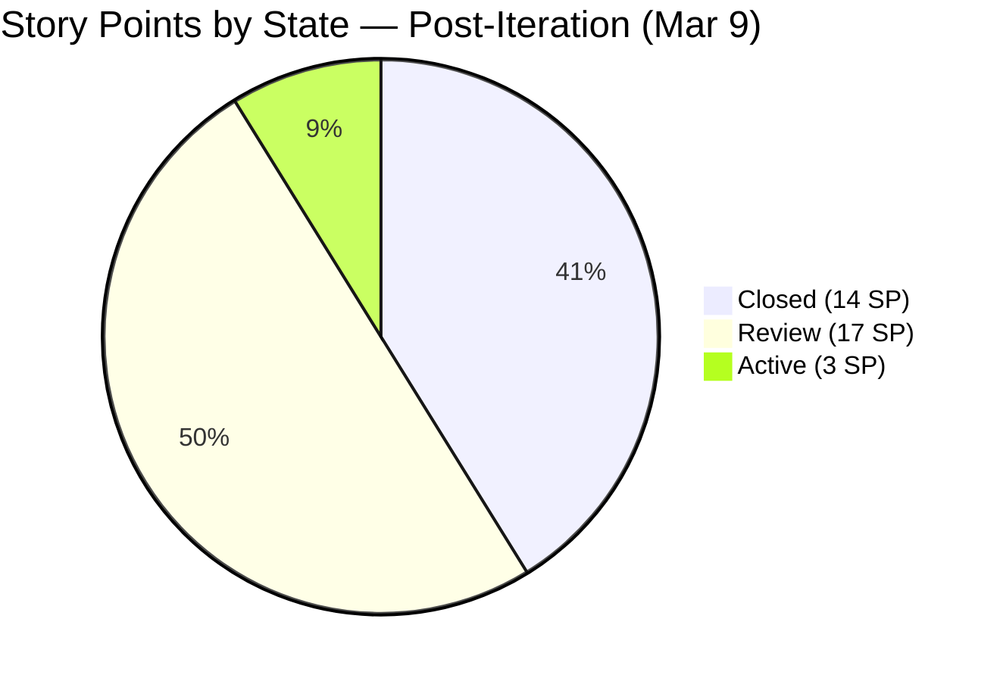
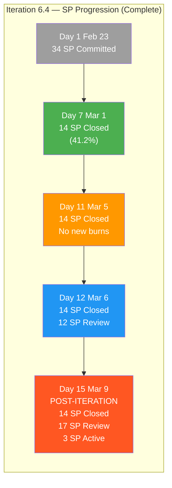
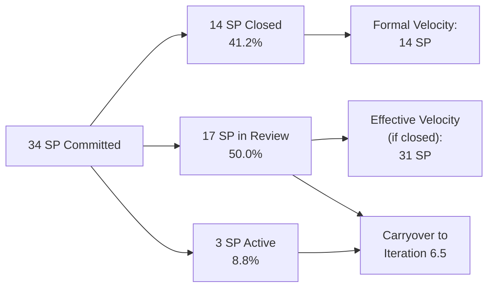
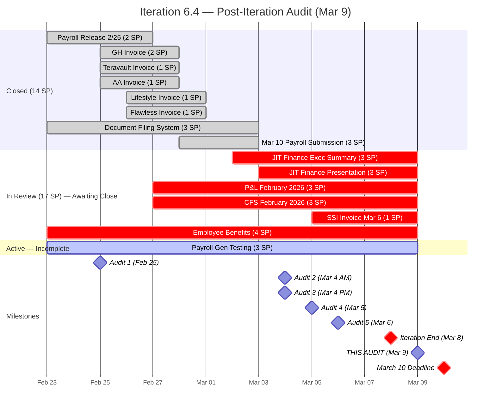
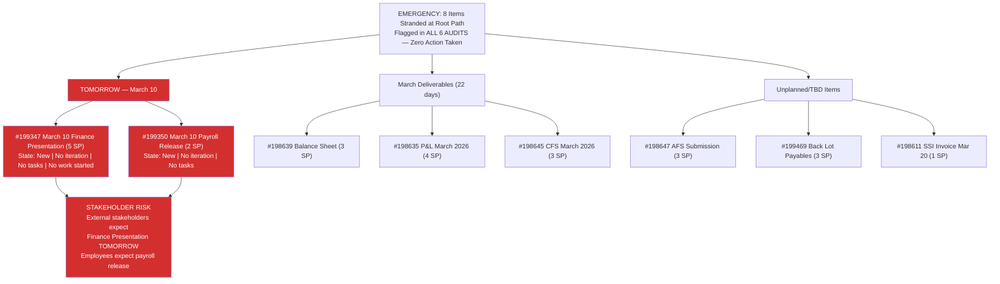
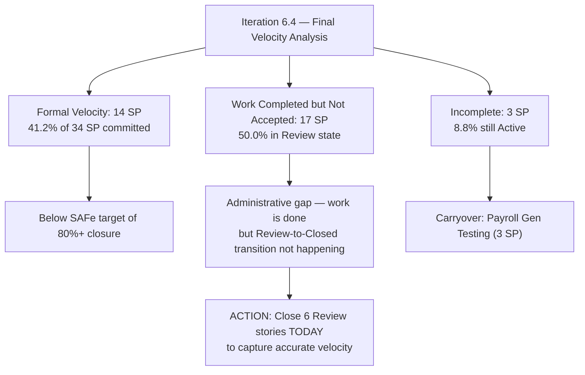
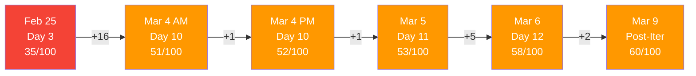
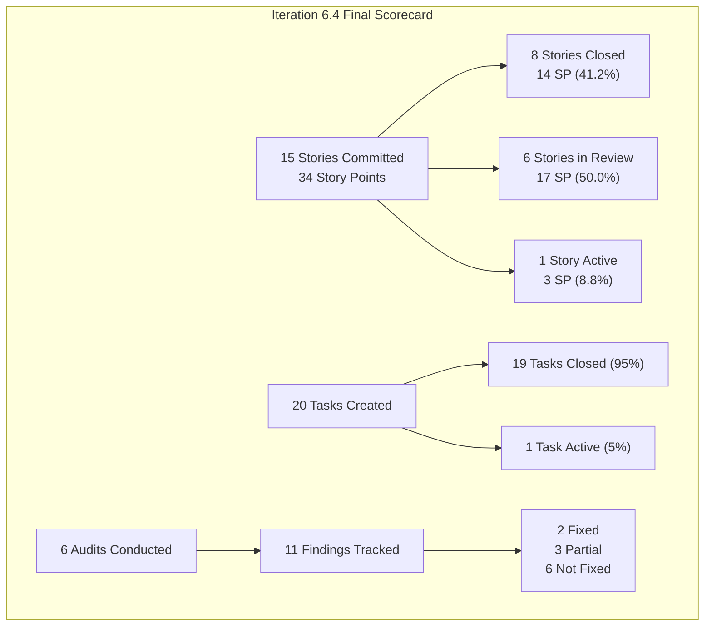

# SAFe Audit Report — Finance Team

**Project:** Jairosoft FINOPS
**Team:** Finance Team
**Iteration:** Iteration 6.4 (PI 2026-PI6)
**Iteration Window:** February 23, 2026 – March 8, 2026
**Audit Date:** March 9, 2026 — 22:56 UTC (Post-Iteration — Day 1 After Close)
**Previous Audits:** Feb 25 · Mar 4 AM · Mar 4 PM · Mar 5 · Mar 6
**Auditor:** AI Agile Project Management Consultant
**Framework:** SAFe 6.0 (Scaled Agile Framework)

---

## 1. Executive Summary

This is the **sixth audit** and the first **post-iteration audit** of the Finance Team's Iteration 6.4. The iteration officially closed on **Sunday, March 8, 2026**. Today (Monday, March 9) marks the **first business day after the iteration end** and the **start of the transition to Iteration 6.5**.

Significant weekend progress was observed: Grace closed 3 additional tasks and advanced 2 more stories to Review. However, **no stories transitioned to Closed** since the Mar 6 audit, meaning the formal velocity remains at 14 SP.

**Overall Health Score: 60 / 100 (+2 pts vs. Mar 6 Audit)**

| Category | Feb 25 | Mar 4 AM | Mar 4 PM | Mar 5 | Mar 6 | Mar 9 (This Audit) | Trend |
|---|---|---|---|---|---|---|---|
| Capacity Planning | 5/20 | 12/20 | 12/20 | 12/20 | 12/20 | 12/20 | -- No Change |
| Iteration Planning | 10/20 | 12/20 | 12/20 | 12/20 | 12/20 | 12/20 | -- No Change |
| Story Quality | 8/20 | 8/20 | 8/20 | 8/20 | 8/20 | 8/20 | -- No Change |
| Work-in-Progress Management | 7/20 | 14/20 | 14/20 | 15/20 | 20/20 | 20/20 | -- Maintained |
| Backlog Hygiene | 5/20 | 5/20 | 6/20 | 6/20 | 6/20 | 8/20 | +2 (Weekend task progress) |

**Key changes since Mar 6 audit:**
- 3 tasks closed over the weekend: #199711 (Input Salary), #199712 (Input Deduction), #199731 (SSI Invoice Submission)
- 2 stories advanced to Review: #197078 (SSI Invoice March 6) and #199351 (Employee Benefits)
- Task #199714 (Generate Payroll Test) moved New to Active
- Finding A (SSI Invoice) is now SUBSTANTIALLY RESOLVED — task Closed, story in Review
- **6 stories now in Review** (17 SP) awaiting formal closure — none have been moved to Closed yet
- Finding #3 (8 stranded items) persists across **SIX consecutive audits** — March 10 deadline is **TOMORROW**

> **CRITICAL ESCALATION: The March 10 Jairosoft Finance Presentation (#199347, 5 SP) and March 10 Payroll Release (#199350, 2 SP) are due TOMORROW and remain in "New" state with NO iteration assignment, NO tasks, and NO active work. This requires IMMEDIATE emergency action TODAY (March 9).**

---

## 2. Previous Findings Resolution Status

### 2.1 Cumulative Resolution Scorecard (All 6 Audits)

| # | Severity | Finding | Feb 25 | Mar 4 AM | Mar 4 PM | Mar 5 | Mar 6 | Mar 9 (Now) | Status |
|---|---|---|---|---|---|---|---|---|---|
| A | URGENT | SSI Invoice Mar 6 | — | NEW | Persists | Partial | Active | RESOLVED | Task Closed, Story in Review |
| 1 | CRITICAL | Zero capacity configured | X | Partial | Partial | Partial | Partial | Partial | 4h/day "Documentation" only |
| 2 | CRITICAL | Single point of failure | X | X | Partial | Partial | Partial | Partial | All work assigned to Grace |
| 3 | CRITICAL | 8 items missing iteration | X | X | X | X | X | **X — 6th AUDIT** | **EMERGENCY: March 10 is TOMORROW** |
| 4 | MAJOR | Stories lack SAFe format | X | X | X | X | X | X | Deferred to Iter 6.5 |
| 5 | MAJOR | Minimal acceptance criteria | X | X | X | X | X | X | Deferred to Iter 6.5 |
| 6 | MAJOR | No task decomposition | X | FIXED | FIXED | FIXED | FIXED | FIXED | Resolved, maintained |
| 7 | MAJOR | Overcommitment risk | X | Partial | Partial | Escalated | Critical | **CONFIRMED** | 20 SP not formally closed |
| 8 | MINOR | No team estimation process | X | X | X | X | X | X | Solo team limitation |
| 9 | MINOR | No tags/labels used | X | X | X | X | X | X | Deferred to Iter 6.5 |
| 10 | MINOR | Feature #197084 state inconsistency | X | X | X | X | X | X | Still Active |

**Notable changes this audit:**
- Finding A upgraded to RESOLVED: SSI Invoice task #199731 is now Closed and story #197078 is in Review
- Finding 7 confirmed: Iteration ended with only 14/34 SP formally Closed (41.2% velocity)
- Finding 3 escalated to EMERGENCY: March 10 items due tomorrow with zero progress across 6 audits

---

## 3. Iteration 6.4 — Final State (Post-Iteration Close)

### 3.1 Story State Distribution

| State | Mar 6 Count | Mar 9 Count | Mar 6 SP | Mar 9 SP | Delta |
|---|---|---|---|---|---|
| Closed | 8 | 8 | 14 | 14 | No Change |
| Review | 4 | **6** | 12 | **17** | **+2 Stories (+5 SP)** |
| Active | 3 | **1** | 8 | **3** | -2 Stories (-5 SP) |
| New | 0 | 0 | 0 | 0 | No Change |
| **Total** | **15** | **15** | **34** | **34** | — |

> **Key insight:** 17 SP (50% of committed work) sit in "Review" state — indicating work is complete but not formally accepted. If all Review stories close, the iteration velocity would be 31/34 SP (91.2%). Currently, only 14/34 SP (41.2%) are formally Closed.

### 3.2 Work Item Status — All Stories (Final State)

| ID | Title | Mar 6 State | Mar 9 State | SP | Change |
|---|---|---|---|---|---|
| 199222 | Payroll Release - 2/25 | Closed | Closed | 2 | -- |
| 199349 | March 10th initial payroll submission | Closed | Closed | 3 | -- |
| 197079 | GH Invoice | Closed | Closed | 2 | -- |
| 197080 | Teravault invoice | Closed | Closed | 1 | -- |
| 197081 | AA Invoice | Closed | Closed | 1 | -- |
| 197082 | Lifestyle Invoice | Closed | Closed | 1 | -- |
| 197083 | Flawless Invoice | Closed | Closed | 1 | -- |
| 197845 | Document Filing System | Closed | Closed | 3 | -- |
| 199471 | JIT Finance Executive Summary | Review | Review | 3 | -- |
| 199348 | JIT Finance Presentation | Review | Review | 3 | -- |
| 198634 | JIT P&L February 2026 | Review | Review | 3 | -- |
| 198644 | JIT CFS February 2026 | Review | Review | 3 | -- |
| **197078** | **SSI Invoice - March 6** | Active | **Review** | 1 | **Active to Review** |
| **199351** | **Input Employee Benefits in the portal** | Active | **Review** | 4 | **Active to Review** |
| 199354 | Payroll Generation Testing | Active | Active | 3 | -- |

### 3.3 Task Status Summary (Final State)

| Task State | Mar 6 Count | Mar 9 Count | Delta |
|---|---|---|---|
| Closed | 16 | **19** | **+3** |
| Active | 3 | **1** | -2 |
| New | 1 | **0** | -1 |
| **Total** | **20** | **20** | — |

**Weekend task completions:**

| Task ID | Title | Parent Story | Prior State | Current State |
|---|---|---|---|---|
| 199711 | Input Salary | #199351 Employee Benefits | Active (2h) | **Closed** |
| 199712 | Input Deduction | #199351 Employee Benefits | Active (3h) | **Closed** |
| 199731 | SSI Invoice Submission March 6 | #197078 SSI Invoice | Active (0.5h) | **Closed** |

**Still active:**

| Task ID | Title | Parent Story | State | Remaining Hours |
|---|---|---|---|---|
| 199714 | Generate Payroll Test | #199354 Payroll Gen Testing | Active | ~1h |

**Total Remaining Task Hours: ~1h** (down from 6.5h — 5.5h burned over weekend)

---

## 4. Burndown & Velocity Analysis

### 4.1 Story Points Burndown — Full Iteration

### 4.2 Iteration 6.4 Velocity Summary

| Metric | Value |
|---|---|
| Total Committed SP | 34 |
| Formally Closed SP | 14 (41.2%) |
| In Review SP (work done, not accepted) | 17 (50.0%) |
| Active SP (incomplete) | 3 (8.8%) |
| **Formal Velocity** | **14 SP** |
| **Effective Velocity (if Review closes)** | **31 SP (91.2%)** |
| Total Tasks Created | 20 |
| Tasks Closed | 19 (95%) |
| Tasks Still Active | 1 (5%) |
| Remaining Task Hours | ~1h |

### 4.3 Story Flow — Final State Diagram

```mermaid
stateDiagram-v2
    direction LR
    [*] --> New
    New --> Active
    Active --> Review
    Review --> Closed

    state "Closed (14 SP — 8 Stories)" as Closed {
        s199222: Payroll Release 2/25 (2)
        s197079: GH Invoice (2)
        s197080: Teravault (1)
        s197081: AA Invoice (1)
        s197082: Lifestyle (1)
        s197083: Flawless (1)
        s197845: Document Filing (3)
        s199349: Mar 10 Payroll Sub (3)
    }

    state "Review (17 SP — 6 Stories)" as Review {
        s199471: JIT Exec Summary (3)
        s199348: JIT Finance Pres (3)
        s198634: JIT P&L Feb (3)
        s198644: JIT CFS Feb (3)
        s197078: SSI Invoice Mar 6 (1)
        s199351: Employee Benefits (4)
    }

    state "Active (3 SP — 1 Story)" as Active {
        s199354: Payroll Gen Testing (3)
    }
```

### 4.4 Iteration Timeline (Complete)

---

## 5. Audit Findings

### FINDING A — RESOLVED: SSI Invoice March 6 — Task Closed, Story in Review

**Prior Status (Mar 6):** Task Active with 0.5h remaining, Story Active
**Current Status:** Task #199731 **CLOSED**, Story #197078 moved to **Review**

| Item | Mar 5 | Mar 6 | Mar 9 (Now) | Final Status |
|---|---|---|---|---|
| #197078 SSI Invoice Mar 6 (Story) | Active | Active | **Review** | Pending acceptance |
| #199731 SSI Invoice Task | New | Active | **Closed** | DONE |

**Assessment:** The SSI Invoice submission was completed over the weekend. The task is formally closed and the story is in Review awaiting final acceptance. This finding, which was flagged as URGENT across 4 audits, is now **substantially resolved**. The only remaining step is formal story closure.

**Recommendation:** Close story #197078 to Closed state today to record the completed work in the iteration velocity.

---

### FINDING 3 — EMERGENCY ESCALATION (PERSISTS ALL 6 AUDITS): March 10 Items Due TOMORROW

**Status:** No change across SIX consecutive audits. All 8 items remain in "New" state at the root iteration path with no tasks or active work.

| ID | Title | SP | Deadline | Days Until | Risk Level |
|---|---|---|---|---|---|
| **199347** | **March 10 Jairosoft Finance Presentation** | **5** | **Mar 10** | **1 DAY** | **EMERGENCY** |
| **199350** | **March 10th Payroll Release** | **2** | **Mar 10** | **1 DAY** | **EMERGENCY** |
| 198639 | Balance Sheet March 2026 | 3 | Mar 31 | 22 days | Future |
| 199469 | Back Lot Payables | 3 | TBD | Unknown | Unplanned |
| 198611 | SSI Invoice - March 20 | 1 | Mar 20 | 11 days | Next iteration |
| 198635 | P&L March 2026 | 4 | Mar 31 | 22 days | Future |
| 198645 | CFS March 2026 | 3 | Mar 31 | 22 days | Future |
| 198647 | AFS Submission 2025-2026 | 3 | TBD | Unknown | Long-range |

**This is the highest-severity finding in the entire audit series.** The March 10 Finance Presentation and Payroll Release have been flagged in every single audit since February 25, and no action has been taken to assign them to an iteration, create tasks, or begin any work. With the deadline TOMORROW:

1. The March 10 Jairosoft Finance Presentation (#199347, 5 SP) requires immediate emergency action — assign to Iteration 6.5, create tasks, and begin work TODAY
2. The March 10 Payroll Release (#199350, 2 SP) similarly requires immediate assignment and execution
3. The Product Owner must communicate risk to stakeholders if completion by March 10 is not feasible

---

### FINDING 7 — CONFIRMED: Iteration 6.4 Overcommitment — Velocity Gap

**Status:** The iteration has closed. The overcommitment risk flagged since Audit 2 is now a confirmed outcome.

| Scenario | SP Closed | % of Committed | Assessment |
|---|---|---|---|
| Formal (Closed state only) | 14 / 34 | 41.2% | Below standard |
| Effective (Closed + Review) | 31 / 34 | 91.2% | Strong if accepted |
| Gap (Review not Closed) | 17 SP | 50.0% | Administrative bottleneck |

**Root cause analysis:** The velocity gap is primarily administrative, not a capacity issue. Grace completed 19 of 20 tasks (95%) and only 1 hour of work remains. The bottleneck is the **Review-to-Closed transition** — 6 stories have all tasks completed but the stories themselves haven't been formally closed. This suggests either a review/approval process that isn't being executed, or simply a board hygiene step being missed.

---

### Unchanged Findings (Deferred to Iteration 6.5)

| Finding | Severity | Status | Notes |
|---|---|---|---|
| #1 — Capacity incomplete | CRITICAL | Partial | 4h/day "Documentation" only — add activity types |
| #2 — Single point of failure | CRITICAL | Partial | All work assigned to Grace — monitor |
| #4 — Stories lack SAFe format | MAJOR | Not Fixed | Rewrite in Iter 6.5 planning |
| #5 — Minimal acceptance criteria | MAJOR | Not Fixed | Expand to Given/When/Then |
| #8 — No team estimation | MINOR | Not Fixed | Solo team limitation |
| #9 — No tags/labels | MINOR | Not Fixed | Low priority |
| #10 — Feature #197084 state | MINOR | Not Fixed | Feature still Active despite child stories closing |

---

## 6. SAFe Compliance Scorecard — Iteration 6.4 Final

| SAFe Practice | Feb 25 | Mar 4 AM | Mar 4 PM | Mar 5 | Mar 6 | Mar 9 (Final) | Trend |
|---|---|---|---|---|---|---|---|
| Iteration Planning Event | Partial | Partial | Partial | Partial | Partial | Partial | -- |
| Capacity-Based Planning | Missing | Partial | Partial | Partial | Partial | Partial | -- |
| Story Format (INVEST) | Non-Compliant | X | X | X | X | Non-Compliant | -- |
| Acceptance Criteria | Minimal | Minimal | Minimal | Minimal | Minimal | Minimal | -- |
| Task Decomposition | Missing | DONE | DONE | DONE | DONE | DONE | Maintained |
| Daily Stand-Up Readiness | Partial | Enabled | Enabled | Enabled | Enabled | Enabled | Maintained |
| Iteration Burndown | Not Possible | Partial | Partial | Partial | Partial | Partial | -- |
| Board Updates (Real-Time) | Unknown | Concern | Concern | Concern | Active | Active (weekend work) | Maintained |
| WIP Limits | Not Set | X | X | X | X | Not Set | -- |
| Definition of Done | Unknown | Unknown | Unknown | Unknown | Partial | Partial (Review gate used but not completing) | -- |
| Backlog Refinement | Partial | Partial | Partial | Partial | Partial | Partial | -- |

**Post-iteration note:** Grace continued updating the board over the weekend (March 7-8), closing tasks and advancing stories. This shows strong individual discipline. The gap is in the formal story acceptance process — the Review-to-Closed transition needs to be part of the Definition of Done workflow.

---

## 7. Health Score Trend — Full Iteration History

| Category | Feb 25 | Mar 4 AM | Mar 4 PM | Mar 5 | Mar 6 | Mar 9 | Delta | Target |
|---|---|---|---|---|---|---|---|---|
| Capacity Planning | 5/20 | 12/20 | 12/20 | 12/20 | 12/20 | 12/20 | -- | 16/20 |
| Iteration Planning | 10/20 | 12/20 | 12/20 | 12/20 | 12/20 | 12/20 | -- | 16/20 |
| Story Quality | 8/20 | 8/20 | 8/20 | 8/20 | 8/20 | 8/20 | -- | 12/20 |
| WIP Management | 7/20 | 14/20 | 14/20 | 15/20 | 20/20 | 20/20 | -- | 20/20 |
| Backlog Hygiene | 5/20 | 5/20 | 6/20 | 6/20 | 6/20 | 8/20 | +2 | 10/20 |
| **Total** | **35** | **51** | **52** | **53** | **58** | **60** | **+2** | **70** |

---

## 8. Iteration 6.4 Retrospective Summary

### 8.1 What Went Well

| # | Observation | Evidence |
|---|---|---|
| 1 | Strong early delivery: all invoices and payroll items closed by Day 7 | 14 SP (41.2%) closed in first week |
| 2 | Task decomposition implemented and maintained throughout iteration | 20 tasks created, 19 closed (95%) |
| 3 | Weekend work ethic: Grace continued closing tasks and advancing stories after the final working day | 3 tasks closed, 2 stories advanced Mar 7-9 |
| 4 | March 6 was highest-throughput day: 4 tasks closed, 4 stories to Review | 100% daily capacity utilized |
| 5 | SSI Invoice external commitment met (task completed, story in Review) | Finding A resolved after 4 audits |
| 6 | "Review" state adopted as quality gate — implicit DoD emerging | 6 stories using Review workflow |
| 7 | Board actively maintained — real-time state transitions throughout iteration | Verified across 6 audits |

### 8.2 What Needs Improvement

| # | Observation | Impact | Action for Iter 6.5 |
|---|---|---|---|
| 1 | Back-loading complex deliverables into final 2 days | All financial reporting stories started late | Plan reporting stories in first half of iteration |
| 2 | 8 backlog items unassigned across 6 audits — March 10 deadline at risk | External stakeholder commitments at risk | Emergency assignment TODAY |
| 3 | Review-to-Closed bottleneck: 17 SP in Review, 0 SP transitioned | Formal velocity understated at 41.2% | Establish story acceptance cadence |
| 4 | Capacity only configured for "Documentation" | Doesn't reflect actual work types | Add Finance Ops, Payroll, Reporting activities |
| 5 | Stories not in SAFe format, minimal acceptance criteria | Quality and testability concerns | Rewrite during Iter 6.5 planning |
| 6 | Single team member creates scheduling risk | No redundancy, bus factor = 1 | Monitor and plan for contingency |

### 8.3 Iteration 6.4 — By the Numbers

---

## 9. Recommendations — Immediate Actions (March 9, TODAY)

### EMERGENCY — Due Tomorrow (March 10)

| Priority | Action | Owner | Work Item | Effort |
|---|---|---|---|---|
| **P0** | **Assign March 10 Finance Presentation to Iteration 6.5** — #199347 (5 SP) must be assigned, tasks created, and work begun TODAY | Product Owner / Grace | #199347 | Immediate |
| **P0** | **Assign March 10 Payroll Release to Iteration 6.5** — #199350 (2 SP) must be assigned and executed | Product Owner / Grace | #199350 | Immediate |
| **P0** | **Communicate risk to stakeholders** if March 10 deliverables cannot be completed on time | Product Owner | — | 30 min |

### HIGH — Close Iteration 6.4 Properly

| Priority | Action | Owner | Work Items | Effort |
|---|---|---|---|---|
| P1 | **Close 6 Review stories** — All tasks are done; move stories from Review to Closed | Grace / PO | #199471, #199348, #198634, #198644, #197078, #199351 | 1h |
| P1 | **Complete Payroll Gen Testing** — Close task #199714 and story #199354 | Grace | #199354, #199714 | 1h |
| P1 | **Conduct Iteration 6.4 Retrospective** — Document lessons learned formally | Scrum Master | — | 1h |

### MEDIUM — Iteration 6.5 Planning

| Priority | Action | Owner |
|---|---|---|
| P2 | Assign remaining 6 stranded backlog items to target iterations | Product Owner |
| P2 | Rewrite all stories in SAFe format with proper acceptance criteria | Product Owner |
| P2 | Update capacity configuration with appropriate activity types | Scrum Master |
| P2 | Establish story acceptance cadence to prevent Review bottleneck | Scrum Master / PO |
| P2 | Define and document WIP limits | Scrum Master |
| P2 | Apply tags/labels across all work items | Team |

---

## 10. Conclusion

Iteration 6.4 concludes with a **tale of two metrics**: a formal velocity of 14 SP (41.2%) that significantly understates actual delivery, and an effective completion of 31 SP (91.2%) that tells the true story of Grace's output.

Grace completed **19 of 20 tasks (95%)** across the iteration, including weekend work to close 3 tasks and advance 2 stories. The team's execution capability is not in question — the structural issue is the **Review-to-Closed administrative gap** that prevents completed work from being formally recognized.

The **most urgent concern is Finding #3**: the March 10 Jairosoft Finance Presentation and Payroll Release, flagged across all 6 audits without any action. With the deadline TOMORROW, this represents the single highest risk item and requires emergency action today.

**Key metrics for the Iteration 6.5 team to target:**
- Close all 6 Review stories from Iteration 6.4 on Day 1
- Achieve 80%+ formal velocity (story closure, not just task completion)
- Eliminate the "stranded backlog" pattern by assigning all items to iterations
- Reach a health score of 70/100 by mid-iteration

The Finance Team has the capability. The improvement opportunity is in planning, process discipline, and the formal acceptance workflow.

---

*Report generated on March 9, 2026 at 22:56 UTC.*
*Data source: Azure DevOps — Jairosoft FINOPS / Finance Team / Iteration 6.4*
*Framework: SAFe 6.0 (Scaled Agile Framework)*
*Previous Audits: AUDIT_2026-02-25_0700.md · AUDIT_2026-03-04_0222.md · AUDIT_2026-03-04_2209.md · AUDIT_2026-03-05_2102.md · AUDIT_2026-03-06_2217.md*
