# SAFe Audit Report — Finance Team

**Project:** Jairosoft FINOPS
**Team:** Finance Team
**Iteration:** Iteration 6.5 (PI 2026-PI6) — Day 1 Audit
**Iteration Window:** March 10, 2026 – March 22, 2026
**Audit Date:** March 10, 2026 — 13:24 UTC (Iteration 6.5 Day 1 · Iteration 6.4 Post-Close)
**Previous Audits:** Feb 25 · Mar 4 AM · Mar 4 PM · Mar 5 · Mar 6 · Mar 9
**Auditor:** AI Agile Project Management Consultant
**Framework:** SAFe 6.0 (Scaled Agile Framework)

---

## 1. Executive Summary

This is the **seventh audit** and the **first audit of Iteration 6.5**, which officially began today, March 10, 2026. Today is simultaneously a landmark day for three reasons:

1. **Iteration 6.4 achieved 100% formal velocity** — all 7 remaining stories (6 Review + 1 Active) were closed since the Mar 9 audit, completing the iteration at 34/34 SP (100%).
2. **Iteration 6.5 has launched with a strategic pivot** — the Finance Team has shifted from operational finance tasks to **Payroll Automation system development**, representing a significant new strategic initiative.
3. **Two emergency items have now missed their deadline** — the March 10 Finance Presentation (#199347, 5 SP) and March 10 Payroll Release (#199350, 2 SP) remain in "New" state with no iteration assignment as of audit time today.

**Overall Health Score: 70 / 100 (+10 pts vs. Mar 9 Audit)**

| Category | Feb 25 | Mar 4 AM | Mar 5 | Mar 6 | Mar 9 | Mar 10 (This Audit) | Trend |
|---|---|---|---|---|---|---|---|
| Capacity Planning | 5/20 | 12/20 | 12/20 | 12/20 | 12/20 | **14/20** | +2 (3 activities vs. 1) |
| Iteration Planning | 10/20 | 12/20 | 12/20 | 12/20 | 12/20 | **16/20** | +4 (Iter 6.5 well-planned) |
| Story Quality | 8/20 | 8/20 | 8/20 | 8/20 | 8/20 | **16/20** | +8 (SAFe format breakthrough) |
| WIP Management | 7/20 | 14/20 | 15/20 | 20/20 | 20/20 | **18/20** | -2 (Day 1 transition, acceptable) |
| Backlog Hygiene | 5/20 | 5/20 | 6/20 | 6/20 | 8/20 | **6/20** | -2 (2 items now overdue) |
| **Total** | **35** | **51** | **53** | **58** | **60** | **70** | **+10** |

> **The target of 70/100 set in the March 9 audit has been achieved.** Story quality improvements and structured iteration planning drove the score to this milestone.

---

## 2. Iteration 6.4 — Final Closure (Post-Mortem)

### 2.1 Iteration 6.4 Ultimate Velocity — 100% Achievement

Between the March 9 audit and today, **all remaining open work items were closed**. This is a complete turnaround from the 41.2% formal velocity recorded at iteration end.

| Story ID | Title | Mar 9 State | Mar 10 State | SP | Resolution |
|---|---|---|---|---|---|
| #199471 | JIT Finance Executive Summary | Review | **Closed** ✅ | 3 | Accepted & Closed |
| #199348 | JIT Finance Presentation | Review | **Closed** ✅ | 3 | Accepted & Closed |
| #198634 | JIT P&L February 2026 | Review | **Closed** ✅ | 3 | Accepted & Closed |
| #198644 | JIT CFS February 2026 | Review | **Closed** ✅ | 3 | Accepted & Closed |
| #197078 | SSI Invoice — March 6 | Review | **Closed** ✅ | 1 | Accepted & Closed |
| #199351 | Input Employee Benefits in Portal | Review | **Closed** ✅ | 4 | Accepted & Closed |
| #199354 | Payroll Generation Testing | Active | **Closed** ✅ | 3 | Completed & Closed |

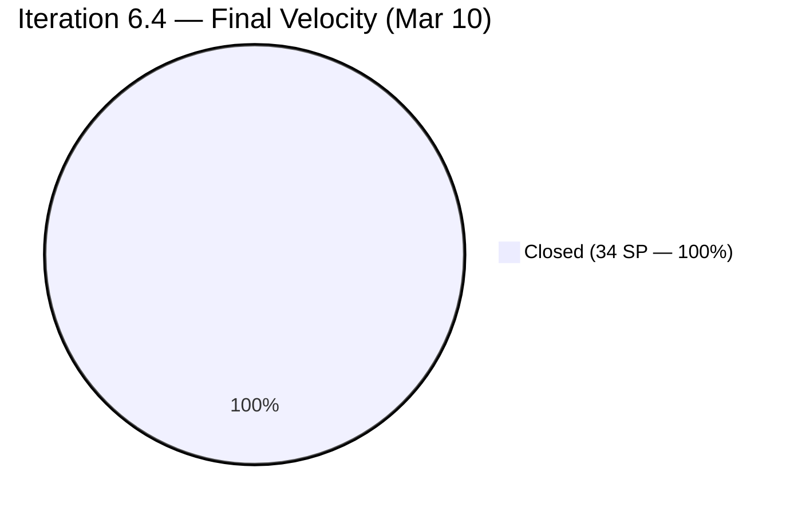

**Final Iteration 6.4 Velocity: 34/34 SP = 100%**

This resolves the most persistent structural finding from the entire audit series: the **Review-to-Closed administrative bottleneck** that had held the formal velocity at 41.2% since the iteration close on March 8.

### 2.2 Iteration 6.4 Complete Story Arc

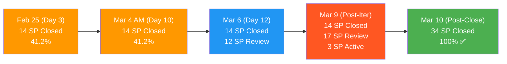

### 2.3 Cumulative Findings Resolution — Iteration 6.4 Final Scorecard

| # | Severity | Finding | Final Status |
|---|---|---|---|
| A | URGENT | SSI Invoice Mar 6 | **RESOLVED** — Task Closed, Story Closed |
| 1 | CRITICAL | Zero capacity configured | **IMPROVED** — 5h/day, 3 activities in 6.5 (was 4h/1 activity) |
| 2 | CRITICAL | Single point of failure | **PARTIAL** — Joseph referenced in 2 tasks (not formally in team) |
| 3 | CRITICAL | 8 items missing iteration | **ESCALATED — 2 OVERDUE** — March 10 deadline missed |
| 4 | MAJOR | Stories lack SAFe format | **RESOLVED in 6.5** — All new stories in proper format |
| 5 | MAJOR | Minimal acceptance criteria | **RESOLVED in 6.5** — All new stories have 4 ACs each |
| 6 | MAJOR | No task decomposition | **FIXED** — Maintained throughout and in 6.5 |
| 7 | MAJOR | Overcommitment risk | **RESOLVED** — Final 34/34 SP (100%) |
| 8 | MINOR | No team estimation process | **PARTIAL** — Hour-based estimates exist; SP estimation still solo |
| 9 | MINOR | No tags/labels used | **RESOLVED in 6.5** — "Payroll Automation" tags on all stories |
| 10 | MINOR | Feature #197084 state inconsistency | **MONITORING** — Still Active |

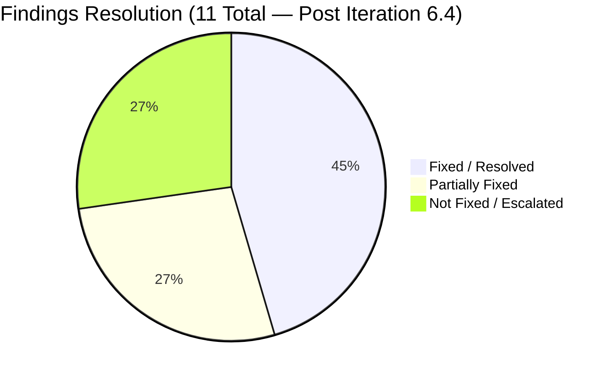

---

## 3. Iteration 6.5 — Day 1 State

### 3.1 Iteration Overview

| Attribute | Value |
|---|---|
| Iteration | 6.5 |
| PI | 2026-PI6 |
| Start Date | March 10, 2026 |
| End Date | March 22, 2026 |
| Working Days | 8 (Mon-Fri, minus March 16 day off) |
| Total Stories | 4 |
| Total Committed SP | 26 |
| Total Tasks | 11 |
| Total Estimated Hours | 40h |
| Available Capacity | 40h (5h/day × 8 days) |
| Strategic Theme | **Payroll Automation System Development** |

### 3.2 Strategic Shift Analysis

Iteration 6.5 represents a **fundamental shift in the Finance Team's work type**:

| Dimension | Iteration 6.4 | Iteration 6.5 |
|---|---|---|
| Work Type | Operational (invoices, payroll runs, reports) | Strategic (system development, automation) |
| Story Pattern | Recurring periodic tasks | New capability build |
| Complexity | Known, repeatable | Novel, requires architecture |
| Risk Profile | Execution risk | Design + execution risk |
| Value Type | Run-the-Business | Build-the-Business |
| Dependencies | Low | Medium-High (HRIS, portal, Joseph) |

> **This is the most significant strategic change observed across all 7 audits.** The Finance Team is transitioning from manual operational work to building an automated payroll engine. This is high-value work but carries higher execution complexity.

### 3.3 Iteration 6.5 — Stories & Tasks

#### Story 1: Salary & Earnings Automation (#200432)
**State:** Active | **SP:** 8 | **Priority:** 2 | **Tag:** Payroll Automation

| Task | State | Remaining Hours |
|---|---|---|
| #200438 Input HRIS salary fields (Annual, Hourly, Monthly) to Engine | **Active** | 6h |
| #200442 Create "Earnings Codes" for overtime, bonuses, commissions | New | 3h |
| **Story Total** | | **9h** |

#### Story 2: Standardized Benefits & Deductions (#200446)
**State:** New | **SP:** 5 | **Priority:** 2 | **Tag:** Payroll Automation

| Task | State | Remaining Hours |
|---|---|---|
| #200450 Configure deduction "stacks" | New | 6h |
| #200452 Implement logic for Employer Match vs. Employee Contribution (Part 1) | New | 5h |
| **Story Total** | | **11h** |

#### Story 3: Digital Pay Stub Generation & Release (#200464)
**State:** New | **SP:** 8 | **Priority:** 2 | **Tag:** Payroll Automation

| Task | State | Remaining Hours |
|---|---|---|
| #200477 Review PDF Pay Stub template | New | 1h |
| #200478 Joseph to Build "Release Trigger" (portal publishing) | New | 1h |
| #200479 Setup automated email notifications for Pay Day | New | 2h |
| #200480 Security/Access Control: employees see only their stub | New | 4h |
| **Story Total** | | **8h** |

#### Story 4: Payroll Variance & Audit Report (#200465)
**State:** New | **SP:** 5 | **Priority:** 2 | **Tag:** Payroll Automation

| Task | State | Remaining Hours |
|---|---|---|
| #200472 Build "Delta Report" comparing Current vs. Previous pay period | New | 4h |
| #200473 Joseph to create "Master Payroll Register" export | New | 2h |
| #200475 Build "Flagging System" for Net Pay variance | New | 6h |
| **Story Total** | | **12h** |

### 3.4 Story State Distribution — Day 1

| State | Stories | SP | % |
|---|---|---|---|
| Active | 1 | 8 | 30.8% |
| New | 3 | 18 | 69.2% |
| **Total** | **4** | **26** | **100%** |

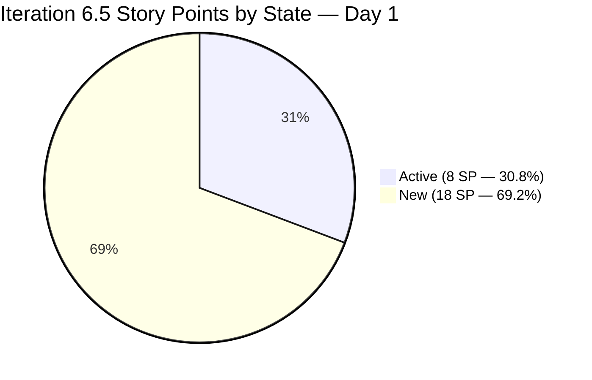

### 3.5 Capacity vs. Commitment Analysis

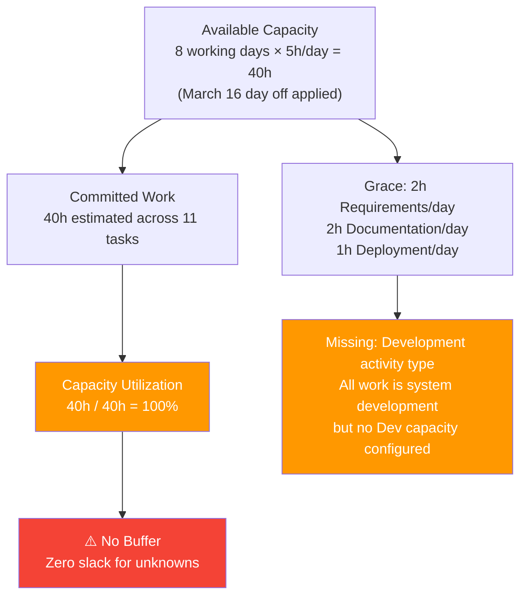

> **Key insight:** The iteration is 100% loaded with zero buffer. For a novel system development initiative, a 15-20% buffer reserve is recommended to account for learning curves, integration challenges, and architecture decisions.

### 3.6 Iteration 6.5 — Work Item Flow Diagram

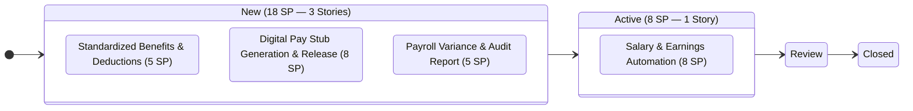

---

## 4. Story Quality Assessment — Major Improvement

### 4.1 SAFe Story Format Compliance

A **breakthrough in story quality** is observed in Iteration 6.5. All four stories now meet SAFe formatting standards that were absent across all of Iteration 6.4.

| Quality Dimension | Iteration 6.4 Stories | Iteration 6.5 Stories | Change |
|---|---|---|---|
| "As a [role], I want [X], so that [Y]" format | ❌ None | ✅ All 4 stories | +4 |
| Numbered Acceptance Criteria | ❌ None or 1-liner | ✅ 4 ACs per story | +16 ACs |
| Tags / Labels | ❌ None | ✅ "Payroll Automation" on all | +4 |
| Story Point estimates | ✅ Present | ✅ Present | Maintained |
| Task decomposition with hours | ✅ Present | ✅ Present (11 tasks, 40h) | Maintained |
| Priority field | ✅ Set | ✅ Set (P2 all) | Maintained |

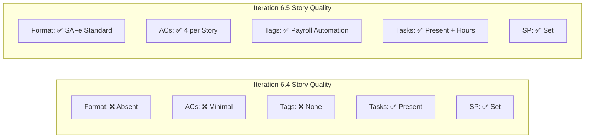

### 4.2 Sample Story Quality — #200432 (Salary & Earnings Automation)

This story exemplifies the quality improvement:

- **User Story:** "As a Payroll Administrator, I want the system to automatically pull employee compensation data from the HRIS and calculate gross earnings based on the current pay period dates..."
- **AC 1:** System correctly identifies "Active" vs. "Terminated" status from HRIS
- **AC 2:** Proration logic handles mid-cycle hires (260-day or 365-day configurable)
- **AC 3:** Overtime calculated at 1.5x for hours over 40 (per local labor laws)
- **AC 4:** System supports "One-Time Earnings" separate from base salary

This level of specificity in acceptance criteria directly addresses **Findings #4 and #5** from previous audits.

---

## 5. Audit Findings

### FINDING 3 — CRITICAL ESCALATION: Two Items NOW OVERDUE (Day 7+ Missed Deadline)

**Status:** DEADLINE MISSED. Both March 10 items remain in "New" state as of this audit at 13:24 UTC on March 10, 2026.

| ID | Title | SP | Deadline | Status | Rev # | Days Overdue |
|---|---|---|---|---|---|---|
| **#199347** | **March 10 Jairosoft Finance Presentation** | **5** | **Mar 10** | **New — Root Path** | 8 | **0 (TODAY)** |
| **#199350** | **March 10th Payroll Release** | **2** | **Mar 10** | **New — Root Path** | 5 | **0 (TODAY)** |

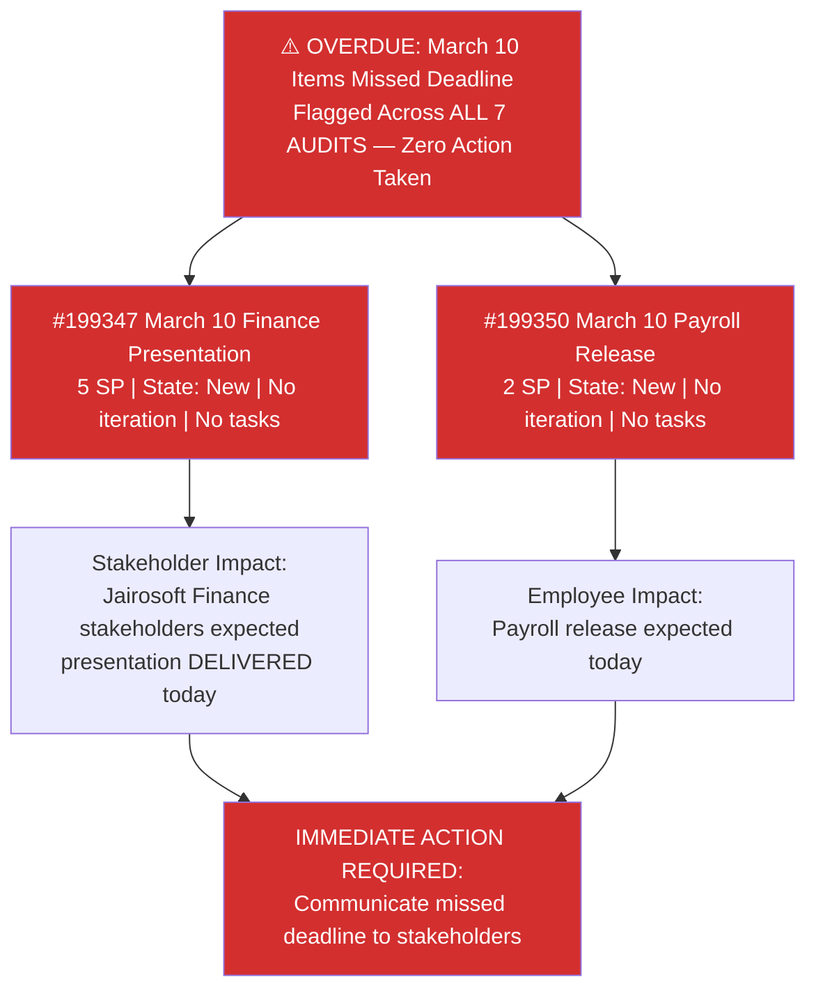

The remaining 6 stranded items continue to sit at the root `Jairosoft FINOPS` path with no iteration assignment:

| ID | Title | SP | Target Date | Status |
|---|---|---|---|---|
| 198611 | SSI Invoice — March 20 | 1 | Mar 20 | ⚠️ 10 days |
| 198635 | P&L March 2026 | 4 | Mar 31 | 21 days |
| 198639 | Balance Sheet March 2026 | 3 | Mar 31 | 21 days |
| 198645 | CFS March 2026 | 3 | Mar 31 | 21 days |
| 198647 | AFS Submission 2025-2026 | 3 | TBD | Unknown |
| 199469 | Back Lot Payables | 3 | TBD | Unknown |

---

### FINDING 11 — NEW: Joseph Cross-Team Dependency Not Formally Tracked

Two tasks in Iteration 6.5 name "Joseph" as the executor in their title, but are formally assigned to Grace's ADO profile:

| Task ID | Title | Formal Assignee | Actual Executor (per title) |
|---|---|---|---|
| #200473 | Joseph to create the "Master Payroll Register" export | grace@jairosoft.com | Joseph |
| #200478 | Joseph to Build the "Release Trigger" | grace@jairosoft.com | Joseph |

This creates an **accountability gap**: ADO shows Grace is responsible, but the work is expected from Joseph. If Joseph's work is blocked or delayed, there is no formal tracking mechanism.

**Total hours at risk:** 3h (2h + 1h)

---

### FINDING 12 — NEW: Zero Capacity Buffer for System Development Iteration

| Metric | Value | SAFe Guidance |
|---|---|---|
| Available Capacity | 40h | — |
| Committed Work (estimated) | 40h | — |
| Buffer | **0h (0%)** | **15-20% recommended** |
| Missing Activity Type | Development | Critical for payroll automation work |
| Capacity per Day | 5h | Activities: Deployment (1h) + Documentation (2h) + Requirements (2h) |

For a system development iteration building new payroll automation capabilities, the absence of a **Development** activity type understates the true work profile. The activities configured (Documentation, Requirements, Deployment) do not reflect the engineering work required.

---

### FINDING 1 — IMPROVED: Capacity Planning Now 3 Activities (Persistent Gap)

**Prior Status (all previous audits):** 4h/day, Documentation only
**Current Status (Iter 6.5):** 5h/day across 3 activities (Deployment 1h + Documentation 2h + Requirements 2h)

This is a meaningful improvement, but the activity mix does not reflect the system development nature of Iteration 6.5 work. The "Development" or "Engineering" activity type is needed.

---

### FINDING 2 — PARTIAL: Joseph as Informal Collaborator (Persistent SPOF)

Grace remains the only formally registered team member. However, two tasks explicitly mention Joseph as the executor (#200473, #200478). This suggests a team expansion is underway informally but hasn't been formalized in ADO.

**Positive signal:** The presence of Joseph in task titles indicates the team may be growing, which would address the single-point-of-failure risk identified since the first audit.

**Action needed:** Add Joseph as a formal ADO team member with capacity configured.

---

## 6. Health Score Trend — Full Audit History

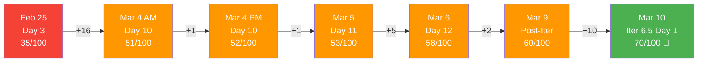

| Category | Feb 25 | Mar 4 AM | Mar 5 | Mar 6 | Mar 9 | Mar 10 | Delta | Target |
|---|---|---|---|---|---|---|---|---|
| Capacity Planning | 5/20 | 12/20 | 12/20 | 12/20 | 12/20 | **14/20** | **+2** | 16/20 |
| Iteration Planning | 10/20 | 12/20 | 12/20 | 12/20 | 12/20 | **16/20** | **+4** | 16/20 |
| Story Quality | 8/20 | 8/20 | 8/20 | 8/20 | 8/20 | **16/20** | **+8** | 16/20 |
| WIP Management | 7/20 | 14/20 | 15/20 | 20/20 | 20/20 | **18/20** | **-2** | 20/20 |
| Backlog Hygiene | 5/20 | 5/20 | 6/20 | 6/20 | 8/20 | **6/20** | **-2** | 16/20 |
| **Total** | **35** | **51** | **53** | **58** | **60** | **70** | **+10** | **80** |

> The 70/100 target set in the March 9 audit has been achieved. The next target for mid-Iteration 6.5 is **80/100**, with Backlog Hygiene as the primary lever (+10 points available through resolving the stranded items).

---

## 7. SAFe Compliance Scorecard — Iteration 6.5 Day 1

| SAFe Practice | Mar 9 | Mar 10 | Trend | Notes |
|---|---|---|---|---|
| Iteration Planning Event | Partial | **Compliant** | ✅ | All 4 stories planned with tasks and hours |
| Capacity-Based Planning | Partial | **Partial** | → | 5h/day, 3 activities — missing Development |
| Story Format (INVEST) | Non-Compliant | **Compliant** | ✅ | All 4 stories in proper SAFe format |
| Acceptance Criteria | Minimal | **Compliant** | ✅ | 4 numbered ACs per story |
| Task Decomposition | DONE | **DONE** | ✅ | 11 tasks, all with hour estimates |
| Tags / Labels | None | **Applied** | ✅ | "Payroll Automation" on all stories |
| Daily Stand-Up Readiness | Enabled | **Enabled** | → | Board current, Grace active |
| Iteration Burndown | Partial | **Enabled** | ✅ | Hour estimates enable proper burndown |
| WIP Limits | Not Set | **Not Set** | → | Still not formally configured |
| Definition of Done | Partial | **Partial** | → | Review gate used; needs formalization |
| Backlog Refinement | Partial | **Partial** | → | Stranded items remain unresolved |

---

## 8. Burndown Projection — Iteration 6.5

### 8.1 Ideal vs. Projected Burndown

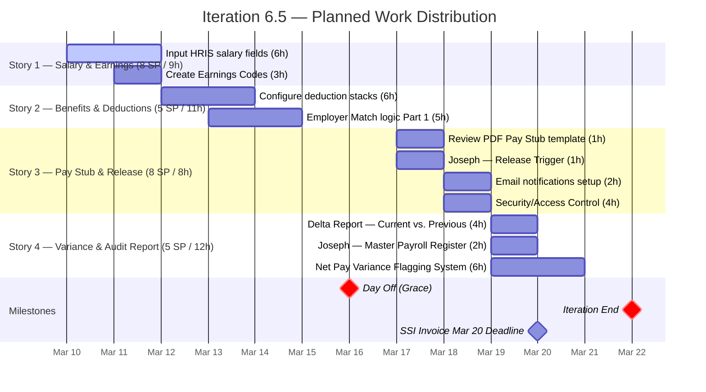

### 8.2 Capacity Risk Assessment

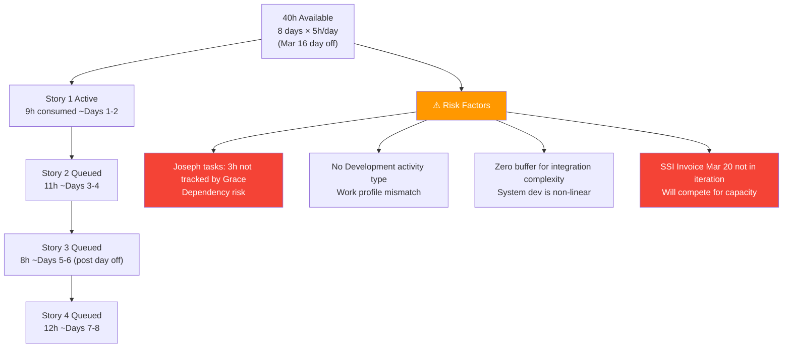

---

## 9. Comparative Analysis — Iteration 6.4 vs. 6.5

```mermaid
graph TB
    subgraph "Iteration 6.4 (Closed)"
        A1["15 Stories | 34 SP"]
        A2["20 Tasks | 95% Closed"]
        A3["6 Audits"]
        A4["Final Velocity: 100%"]
        A5["Work Type: Operational Finance"]
        A6["Story Quality: Non-Compliant"]
    end

    subgraph "Iteration 6.5 (Day 1)"]
        B1["4 Stories | 26 SP"]
        B2["11 Tasks | 40h Estimated"]
        B3["1 Audit (This)"]
        B4["Velocity: TBD"]
        B5["Work Type: Payroll Automation Eng."]
        B6["Story Quality: SAFe Compliant ✅"]
    end
```

| Dimension | Iteration 6.4 | Iteration 6.5 | Delta |
|---|---|---|---|
| Stories | 15 | 4 | -11 (focused scope) |
| Story Points | 34 | 26 | -8 |
| Tasks | 20 | 11 | -9 |
| Story Quality Score | 8/20 | 16/20 | **+8** |
| Capacity per Day | 4h (1 activity) | 5h (3 activities) | **+1h, +2 activities** |
| Team Members in ADO | 1 (Grace) | 1 (Grace) + 1 informal (Joseph) | Emerging |
| Work Type | Operational | Strategic/Engineering | **Strategic shift** |
| Tags Applied | None | All stories tagged | **+4** |
| Buffer | N/A | 0% | ⚠️ Risk |

---

## 10. Recommendations

### CRITICAL — Overdue Items (Act Today)

| Priority | Action | Owner | Work Item |
|---|---|---|---|
| **P0** | **Communicate the March 10 deadline miss** for #199347 (Finance Presentation) and #199350 (Payroll Release) to stakeholders TODAY — do not leave this unacknowledged | Product Owner | #199347, #199350 |
| **P0** | **Reassess and reschedule** both overdue items — assign to Iteration 6.5 if feasible, or create a formal carryover plan | Product Owner / Grace | #199347, #199350 |

### HIGH — Iteration 6.5 Execution

| Priority | Action | Owner |
|---|---|---|
| P1 | **Formalize Joseph in ADO** — add as team member with capacity configured, transfer tasks #200473 and #200478 to Joseph's name | Scrum Master / PO |
| P1 | **Add Development/Engineering activity type** to Grace's Iter 6.5 capacity — the current activities (Documentation, Requirements, Deployment) don't reflect system development work | Scrum Master |
| P1 | **Build in a 15-20% buffer** — reduce commitment or extend estimates to create slack for integration unknowns in a system dev sprint | Scrum Master / Grace |
| P1 | **Assign SSI Invoice Mar 20 (#198611, 1 SP) to Iteration 6.5** — its Mar 20 deadline falls within this iteration window | Product Owner |

### MEDIUM — Backlog & Hygiene

| Priority | Action | Owner |
|---|---|---|
| P2 | **Assign all 6 remaining stranded items** to target iterations (P&L, Balance Sheet, CFS to Iter 6.6; Back Lot Payables and AFS to TBD) | Product Owner |
| P2 | **Define WIP limits** on the Kanban board to prevent overloading | Scrum Master |
| P2 | **Formalize the Definition of Done** — include explicit "Review → Closed requires PO sign-off within 24h" rule to prevent Review bottleneck recurrence | Scrum Master / PO |
| P2 | **Close Feature #197084** or advance its state to reflect child story completions | Product Owner |

### TARGET: 80/100 Health Score by Mid-Iteration (March 17)

| Category | Current | Target | Action Needed |
|---|---|---|---|
| Capacity Planning | 14/20 | 16/20 | Add Development activity type, add Joseph |
| Iteration Planning | 16/20 | 16/20 | Maintained ✅ |
| Story Quality | 16/20 | 16/20 | Maintained ✅ |
| WIP Management | 18/20 | 20/20 | Active stories progressing, board updated |
| Backlog Hygiene | 6/20 | 12/20 | Assign stranded items to iterations |
| **Total** | **70** | **80** | **+10 needed** |

---

## 11. Conclusion

Iteration 6.5 launches on a foundation of **significant achievement and strategic ambition**. The Finance Team delivered a 100% velocity closure of Iteration 6.4 — a 58.8-point improvement from the formal velocity recorded at iteration end — and has entered the new iteration with dramatically improved story quality, proper SAFe formatting, and a clear technical direction in Payroll Automation.

The **health score of 70/100 has been achieved**, hitting the target set in the March 9 audit, driven primarily by the breakthrough in story quality (+8 points) and structured iteration planning (+4 points).

Three areas require focused attention to reach 80/100 by mid-iteration:

1. **The overdue March 10 items** (#199347, #199350) require stakeholder communication and rescheduling — this is the highest-urgency action today.
2. **The stranded backlog** (6 remaining items) must be assigned to iterations to improve hygiene and enable proper capacity planning.
3. **The Joseph dependency** must be formalized in ADO to ensure accountability and realistic capacity tracking.

The strategic shift to Payroll Automation represents the highest-value work the Finance Team has undertaken in the PI6 period. With proper execution, Iteration 6.5 has the potential to be the strongest iteration yet — both in delivery quality and long-term organizational impact.

---

*Report generated on March 10, 2026 at 13:24 UTC.*
*Data source: Azure DevOps — Jairosoft FINOPS / Finance Team / Iteration 6.5*
*Framework: SAFe 6.0 (Scaled Agile Framework)*
*Previous Audits: AUDIT_2026-02-25_0700.md · AUDIT_2026-03-04_0222.md · AUDIT_2026-03-04_2209.md · AUDIT_2026-03-05_2102.md · AUDIT_2026-03-06_2217.md · AUDIT_2026-03-09_2256.md*
