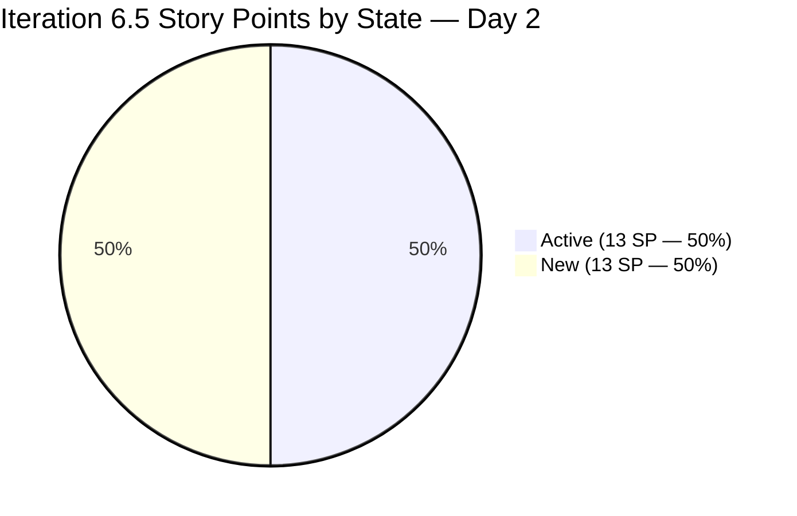
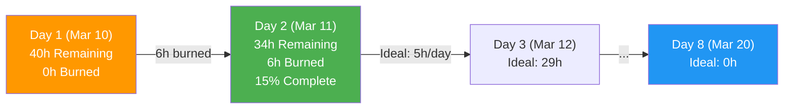
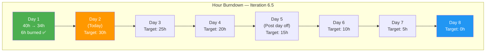
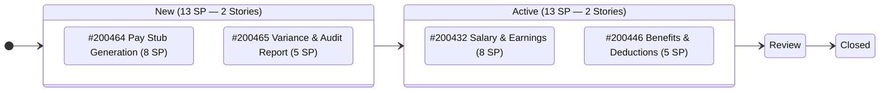
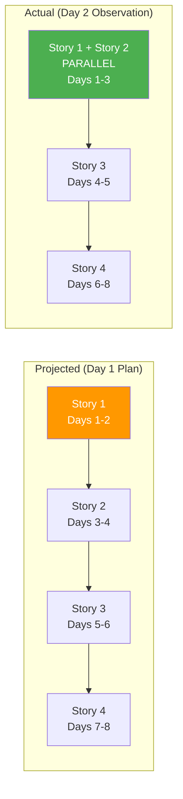
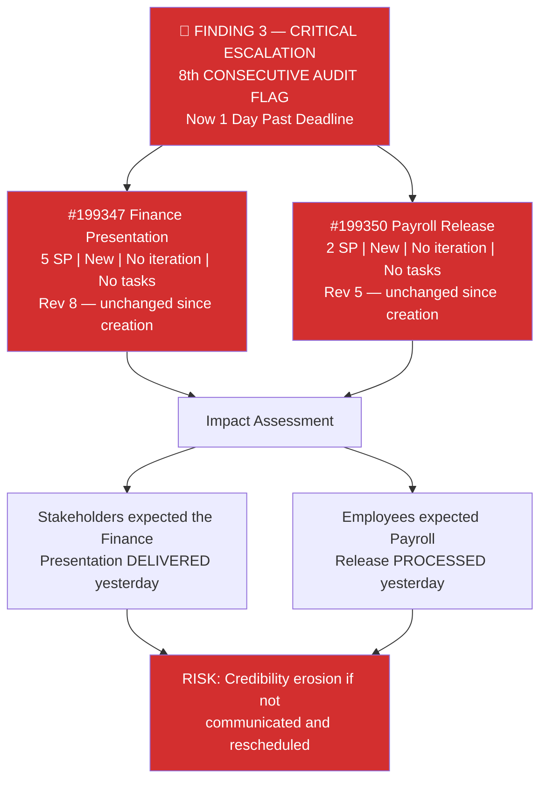
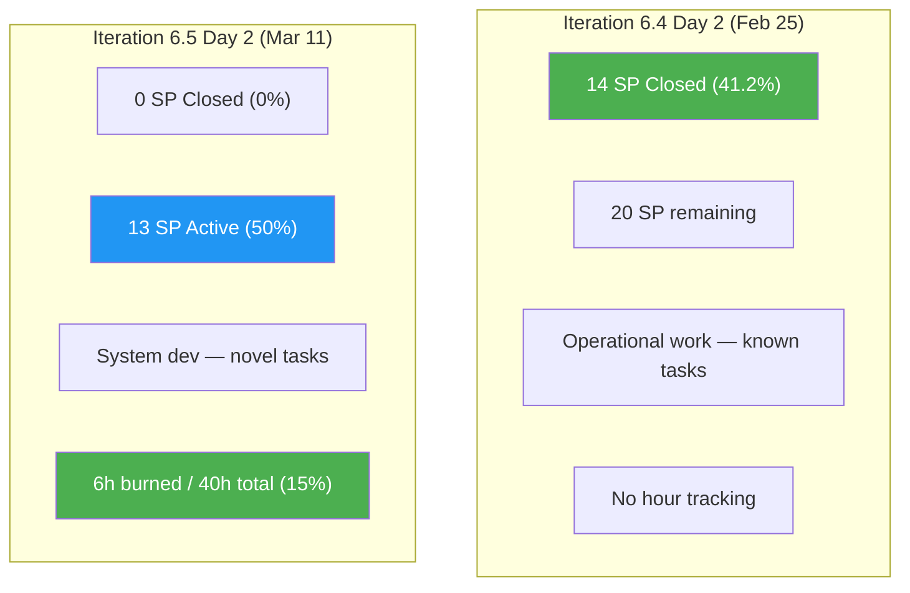
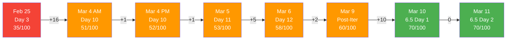
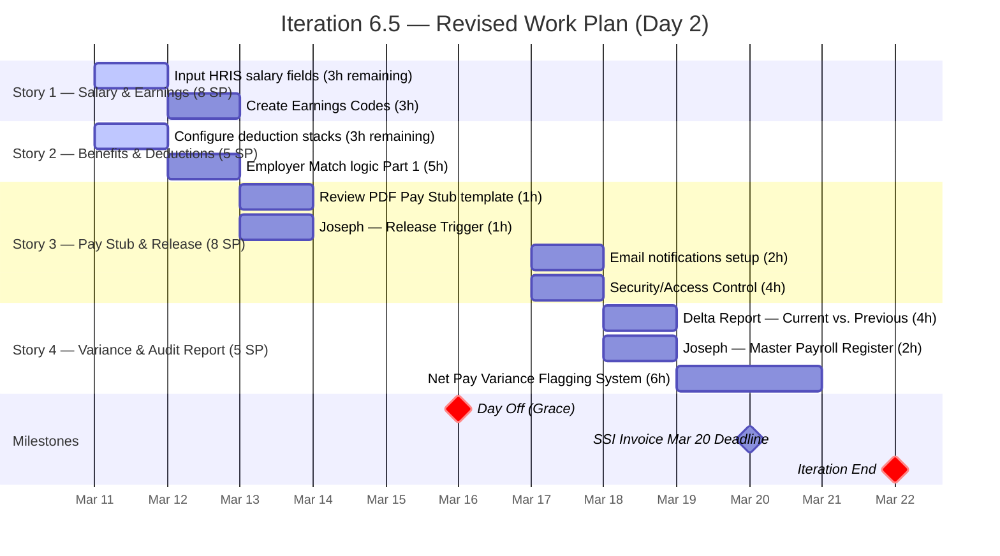
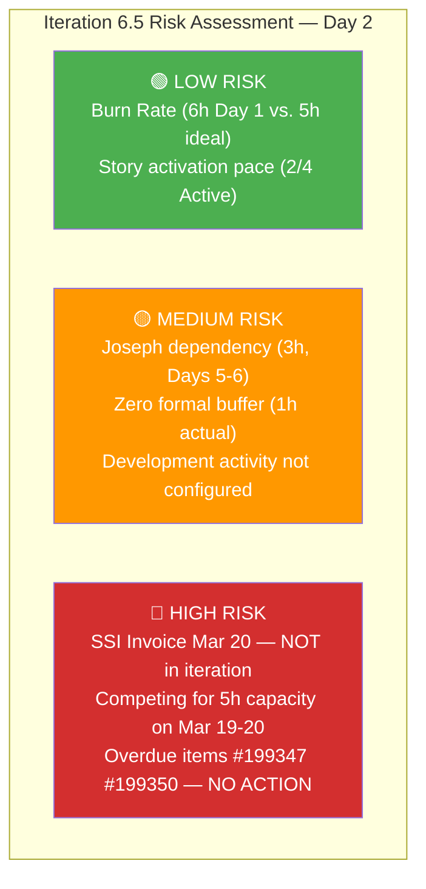

# SAFe Audit Report — Finance Team

**Project:** Jairosoft FINOPS
**Team:** Finance Team
**Iteration:** Iteration 6.5 (PI 2026-PI6) — Day 2 Audit
**Iteration Window:** March 10, 2026 – March 22, 2026
**Audit Date:** March 11, 2026 — 20:07 UTC (Iteration 6.5 Day 2)
**Previous Audits:** Feb 25 · Mar 4 AM · Mar 4 PM · Mar 5 · Mar 6 · Mar 9 · Mar 10
**Auditor:** AI Agile Project Management Consultant
**Framework:** SAFe 6.0 (Scaled Agile Framework)

---

## 1. Executive Summary

This is the **eighth audit** and the **second audit of Iteration 6.5**. Today marks Day 2 of the Payroll Automation sprint, and the team is demonstrating **strong early momentum** with measurable progress across two stories simultaneously.

**Key developments since the March 10 (Day 1) audit:**

1. **Story #200446 (Standardized Benefits & Deductions) has moved from New to Active** — the team is now executing on two stories in parallel, ahead of the projected sequential schedule.
2. **6 hours of work burned in Day 1** — Task #200438 (HRIS salary fields) reduced from 6h to 3h remaining, and Task #200450 (Configure deduction stacks) activated and reduced from 6h to 3h remaining. This represents a 15% iteration burndown on the first working day.
3. **The overdue March 10 items (#199347, #199350) are now 1 full day past deadline** — still in "New" state with no iteration assignment, no tasks, and no communication trail visible in ADO.

**Overall Health Score: 70 / 100 (Unchanged vs. Mar 10 Audit)**

| Category | Mar 9 | Mar 10 | Mar 11 (This Audit) | Trend |
|---|---|---|---|---|
| Capacity Planning | 12/20 | 14/20 | **14/20** | → (No change — still missing Development activity) |
| Iteration Planning | 12/20 | 16/20 | **16/20** | → (Maintained) |
| Story Quality | 8/20 | 16/20 | **16/20** | → (Maintained) |
| WIP Management | 20/20 | 18/20 | **19/20** | +1 (2 stories now Active, parallel execution) |
| Backlog Hygiene | 8/20 | 6/20 | **5/20** | -1 (Overdue items now Day 1 past deadline) |
| **Total** | **60** | **70** | **70** | **0** |

> **The score holds at 70/100.** The WIP improvement (+1) from parallel story execution is offset by the further degradation in backlog hygiene (-1) as the overdue items accumulate another day without action. Reaching the 80/100 target by March 17 depends entirely on resolving the stranded backlog items.

---

## 2. Iteration 6.5 — Day 2 Progress Report

### 2.1 Story State Changes (Day 1 → Day 2)

| Story ID | Title | SP | Day 1 State | Day 2 State | Change |
|---|---|---|---|---|---|
| #200432 | Salary & Earnings Automation | 8 | Active | **Active** | → In progress |
| #200446 | Standardized Benefits & Deductions | 5 | New | **Active** ✅ | ⬆ Activated |
| #200464 | Digital Pay Stub Generation & Release | 8 | New | **New** | → Queued |
| #200465 | Payroll Variance & Audit Report | 5 | New | **New** | → Queued |

> **Positive signal:** 50% of committed story points are now in Active state, up from 30.8% on Day 1. This indicates Grace is pursuing a parallel execution strategy rather than sequential, which is efficient for the 40h/40h capacity profile.

### 2.2 Task-Level Progress

| Task ID | Parent Story | Title | Day 1 State | Day 2 State | Original Est. | Remaining | Burned |
|---|---|---|---|---|---|---|---|
| #200438 | #200432 | Input HRIS salary fields | Active | **Active** | 6h | **3h** | **3h** ✅ |
| #200442 | #200432 | Create Earnings Codes | New | **New** | 3h | 3h | 0h |
| #200450 | #200446 | Configure deduction stacks | New | **Active** ✅ | 6h | **3h** | **3h** ✅ |
| #200452 | #200446 | Employer Match logic (Part 1) | New | **New** | 5h | 5h | 0h |
| #200477 | #200464 | Review PDF Pay Stub template | New | **New** | 1h | 1h | 0h |
| #200478 | #200464 | Joseph — Release Trigger | New | **New** | 1h | 1h | 0h |
| #200479 | #200464 | Email notifications setup | New | **New** | 2h | 2h | 0h |
| #200480 | #200464 | Security/Access Control | New | **New** | 4h | 4h | 0h |
| #200472 | #200465 | Delta Report — Curr vs. Prev | New | **New** | 4h | 4h | 0h |
| #200473 | #200465 | Joseph — Master Payroll Register | New | **New** | 2h | 2h | 0h |
| #200475 | #200465 | Net Pay Variance Flagging System | New | **New** | 6h | 6h | 0h |
| | | **TOTALS** | | | **40h** | **34h** | **6h** |

### 2.3 Burndown Analysis — Day 2

| Metric | Value | Assessment |
|---|---|---|
| Original Estimate | 40h | — |
| Hours Burned (Day 1) | 6h | ✅ Above ideal pace (5h/day) |
| Remaining Work | 34h | — |
| Working Days Remaining | 7 (Mar 12-20, excl. Mar 16 day off) | — |
| Required Pace | 34h / 7 days = **4.86h/day** | ✅ Below capacity (5h/day) |
| Buffer Created | 0.14h/day × 7 days = **~1h** | Minimal but positive |

> **The team burned 6h on Day 1 against an ideal pace of 5h/day**, creating a small but meaningful buffer of approximately 1 hour. If this pace continues, the iteration is on track for on-time completion. This is the first time in the audit series that daily burn rate has exceeded the ideal pace.

### 2.4 Iteration Burndown Chart

---

## 3. Work-in-Progress Flow Analysis

### 3.1 WIP State Diagram — Day 2

### 3.2 Parallel Execution Pattern

The team has adopted a **parallel execution pattern** on Stories 1 and 2, which represents a more mature agile practice than the sequential approach projected in the Day 1 burndown:

> **This parallel approach** is evidence of the team's confidence in the work and reduces overall iteration risk by front-loading effort across multiple stories. It also means the "zero buffer" concern from the Day 1 audit is partially mitigated by the above-ideal burn rate.

---

## 4. Audit Findings

### FINDING 3 — CRITICAL ESCALATION: Overdue Items Now Day 1 Past Deadline (8th Consecutive Audit Flag)

**Status: DEADLINE MISSED — DAY 1 OVERDUE.** Both March 10 items remain in "New" state at the root path with zero progress across all 8 audits.

| ID | Title | SP | Deadline | Status | Rev # | Days Overdue |
|---|---|---|---|---|---|---|
| **#199347** | **March 10 Jairosoft Finance Presentation** | **5** | **Mar 10** | **New — Root Path** | 8 | **1 day** |
| **#199350** | **March 10th Payroll Release** | **2** | **Mar 10** | **New — Root Path** | 5 | **1 day** |

**Audit Trail Summary for Finding 3:**

| Audit # | Date | Status Reported | Action Taken |
|---|---|---|---|
| 1 | Feb 25 | Flagged as unassigned | None |
| 2 | Mar 4 AM | Flagged as unassigned | None |
| 3 | Mar 4 PM | Flagged as unassigned | None |
| 4 | Mar 5 | Flagged as unassigned | None |
| 5 | Mar 6 | Flagged as unassigned | None |
| 6 | Mar 9 | Flagged as at-risk (1 day to deadline) | None |
| 7 | Mar 10 | Flagged as DEADLINE DAY | None |
| **8** | **Mar 11** | **1 Day OVERDUE** | **None** |

The remaining 6 stranded items at the root `Jairosoft FINOPS` path:

| ID | Title | SP | Target Date | Days Until Due | Status vs. Mar 10 |
|---|---|---|---|---|---|
| 198611 | SSI Invoice — March 20 | 1 | Mar 20 | **9 days** | ⚠️ Approaching — within Iter 6.5 window |
| 198635 | P&L March 2026 | 4 | Mar 31 | 20 days | Unchanged |
| 198639 | Balance Sheet March 2026 | 3 | Mar 31 | 20 days | Unchanged |
| 198645 | CFS March 2026 | 3 | Mar 31 | 20 days | Unchanged |
| 198647 | AFS Submission 2025-2026 | 3 | TBD | Unknown | Unchanged |
| 199469 | Back Lot Payables | 3 | TBD | Unknown | Unchanged |

> **SSI Invoice March 20 (#198611)** is now 9 days from its deadline and still unassigned. This item's deadline falls within the current iteration window and will require capacity from Grace — competing directly with the 40h Payroll Automation commitment.

---

### FINDING 11 — PERSISTENT: Joseph Cross-Team Dependency (No Change)

Two tasks remain formally assigned to Grace but name Joseph as the executor:

| Task ID | Title | State | Formal Assignee | Actual Executor | Est. Hours |
|---|---|---|---|---|---|
| #200473 | Joseph to create "Master Payroll Register" export | New | <grace@jairosoft.com> | Joseph | 2h |
| #200478 | Joseph to Build "Release Trigger" | New | <grace@jairosoft.com> | Joseph | 1h |

**Total hours at risk:** 3h (7.5% of remaining capacity)

Neither task has been activated yet, and Joseph remains an informal contributor without ADO capacity configured.

---

### FINDING 12 — PERSISTENT: Zero Formal Capacity Buffer (Partially Mitigated by Pace)

| Metric | Day 1 Value | Day 2 Value | Change |
|---|---|---|---|
| Available Capacity | 40h | 35h (7 days × 5h/day) | -5h (1 day consumed) |
| Remaining Work | 40h | 34h | -6h burned |
| Effective Buffer | 0h (0%) | **+1h (~3%)** | ✅ Buffer emerging |
| Required Pace | 5.0h/day | 4.86h/day | ✅ Below capacity |
| Missing Activity Type | Development | Development | → Still not configured |

> **Partial mitigation:** The above-ideal burn rate on Day 1 has created a small buffer of approximately 1 hour. However, this is far below the SAFe-recommended 15-20% reserve (6-8h) for a system development iteration. The buffer remains structurally insufficient for managing integration risks or unplanned work (e.g., SSI Invoice Mar 20).

---

### FINDING 1 — PERSISTENT: Capacity Planning Gap (No Change)

Grace's capacity remains configured as:

| Activity | Hours/Day |
|---|---|
| Deployment | 1h |
| Documentation | 2h |
| Requirements | 2h |
| **Development** | **Not configured** |
| **Total** | **5h/day** |

**Observation:** Task #200479 (Email notifications setup) is tagged with Activity = "Development", confirming that development work is being performed. However, no Development capacity is formally configured, meaning the capacity vs. commitment tracking in ADO is misaligned with actual work types.

---

### FINDING 2 — PERSISTENT: Single Point of Failure (Grace)

Grace remains the sole formally registered team member. Joseph continues to appear only in task titles. No change from Day 1.

---

### FINDING 10 — MONITORING: Feature #197084 State Inconsistency

Feature #197084 (Monthly Invoice Submission — March 2026) remains in "Active" state (Rev 11). No change.

---

## 5. Comparative Velocity — Cross-Iteration Trends

### 5.1 Iteration 6.5 Day 2 vs. Iteration 6.4 at Equivalent Point

At Day 2 of Iteration 6.4, the team had 14 SP closed (41.2%) but this was largely carryover from prior iterations. In contrast, Iteration 6.5 Day 2 shows 0 SP closed but **13 SP actively in progress (50%)** with measurable hour burndown. The work profiles are fundamentally different:

> **Key insight:** Iteration 6.5's work type (system development) naturally produces a "back-loaded" velocity curve where story points close later in the iteration as integrated features reach completion. The leading indicator is hour burndown, which is healthy at 15% after Day 1.

### 5.2 Full Health Score Trend — All 8 Audits

| Category | Feb 25 | Mar 4 AM | Mar 5 | Mar 6 | Mar 9 | Mar 10 | Mar 11 | Target (Mar 17) |
|---|---|---|---|---|---|---|---|---|
| Capacity Planning | 5/20 | 12/20 | 12/20 | 12/20 | 12/20 | 14/20 | **14/20** | 16/20 |
| Iteration Planning | 10/20 | 12/20 | 12/20 | 12/20 | 12/20 | 16/20 | **16/20** | 16/20 |
| Story Quality | 8/20 | 8/20 | 8/20 | 8/20 | 8/20 | 16/20 | **16/20** | 16/20 |
| WIP Management | 7/20 | 14/20 | 15/20 | 20/20 | 20/20 | 18/20 | **19/20** | 20/20 |
| Backlog Hygiene | 5/20 | 5/20 | 6/20 | 6/20 | 8/20 | 6/20 | **5/20** | 12/20 |
| **Total** | **35** | **51** | **53** | **58** | **60** | **70** | **70** | **80** |

---

## 6. SAFe Compliance Scorecard — Iteration 6.5 Day 2

| SAFe Practice | Mar 10 | Mar 11 | Trend | Notes |
|---|---|---|---|---|
| Iteration Planning Event | Compliant | **Compliant** | ✅ | All 4 stories planned with tasks and hours |
| Capacity-Based Planning | Partial | **Partial** | → | 5h/day, 3 activities — Development still missing |
| Story Format (INVEST) | Compliant | **Compliant** | ✅ | All 4 stories in proper SAFe format |
| Acceptance Criteria | Compliant | **Compliant** | ✅ | 3-4 numbered ACs per story |
| Task Decomposition | Done | **Done** | ✅ | 11 tasks, all with hour estimates and remaining work tracking |
| Tags / Labels | Applied | **Applied** | ✅ | "Payroll Automation" on all stories |
| Daily Stand-Up Readiness | Enabled | **Enabled** | ✅ | Board actively updated, burn visible |
| Iteration Burndown | Enabled | **Active** | ✅ | 6h burned, remaining work updated — burndown chart functional |
| WIP Limits | Not Set | **Not Set** | → | Still not formally configured |
| Definition of Done | Partial | **Partial** | → | Review gate used; needs formalization |
| Backlog Refinement | Partial | **Degraded** | ⬇ | Overdue items now past deadline with zero action |

---

## 7. Updated Burndown Projection

### 7.1 Gantt — Revised Based on Actual Progress

### 7.2 Risk Heat Map

---

## 8. Recommendations

### CRITICAL — Overdue Items (Immediate Action Required)

| Priority | Action | Owner | Work Item |
|---|---|---|---|
| **P0** | **Communicate the March 10 deadline miss** — This is now 1 day overdue. Stakeholders and employees must be notified. Every additional day of silence increases credibility damage. | Product Owner | #199347, #199350 |
| **P0** | **Decide on disposition** — Either: (a) assign to Iteration 6.5 and accept capacity overload, (b) reschedule to Iteration 6.6, or (c) formally cancel with documented rationale. | Product Owner / Grace | #199347, #199350 |

### HIGH — Iteration 6.5 Execution

| Priority | Action | Owner |
|---|---|---|
| P1 | **Assign SSI Invoice Mar 20 (#198611) to Iteration 6.5** — its deadline is 9 days away and falls within this iteration. Unassigned = unplanned = disruptive. | Product Owner |
| P1 | **Formalize Joseph in ADO** — add as team member with capacity. Tasks #200473 and #200478 are 6-7 days out and need a real owner. | Scrum Master / PO |
| P1 | **Add Development activity type** to Grace's capacity — Task #200479 already uses this activity type. The capacity profile should reflect the reality of the work being done. | Scrum Master |

### MEDIUM — Backlog & Process

| Priority | Action | Owner |
|---|---|---|
| P2 | **Assign remaining stranded items** to target iterations (P&L, Balance Sheet, CFS → Iter 6.6; AFS, Back Lot → TBD) | Product Owner |
| P2 | **Define WIP limits** on the board (recommended: 2 Active stories max, which matches current parallel execution pattern) | Scrum Master |
| P2 | **Close or advance Feature #197084** to match child story completions | Product Owner |

### TARGET: 80/100 Health Score by March 17

| Category | Current | Target | Gap | Action to Close |
|---|---|---|---|---|
| Capacity Planning | 14/20 | 16/20 | +2 | Add Development activity, add Joseph |
| Iteration Planning | 16/20 | 16/20 | 0 | Maintained ✅ |
| Story Quality | 16/20 | 16/20 | 0 | Maintained ✅ |
| WIP Management | 19/20 | 20/20 | +1 | Continue active progression, board updates |
| Backlog Hygiene | 5/20 | 12/20 | **+7** | Assign stranded items, resolve overdue items |
| **Total** | **70** | **80** | **+10** | **Backlog hygiene is the critical lever** |

> **Path to 80/100:** The score is entirely gated by backlog hygiene. If the overdue items (#199347, #199350) are resolved and the stranded items assigned to iterations, the score jumps to 78-82 immediately. No other category improvements are needed to hit the target.

---

## 9. Positive Observations — Day 2

This section highlights what is working well, consistent with SAFe's emphasis on continuous improvement through recognition of good practices:

1. **Above-ideal burn rate (6h vs. 5h target)** — The team delivered 20% more work than the daily target on Day 1. This is the strongest daily performance observed in the entire audit series.

2. **Parallel story execution** — Moving Story #200446 to Active alongside Story #200432 demonstrates confidence and maturity. This was not the planned sequence but represents a more efficient approach.

3. **Remaining work actively tracked** — Both active tasks show updated remaining hours, enabling accurate burndown tracking. This is a SAFe best practice that was absent in Iteration 6.4.

4. **SAFe story quality maintained** — All stories continue to demonstrate proper user story format, 3-4 acceptance criteria, and consistent tagging. The quality improvements from the Day 1 audit are sustained.

5. **Board actively maintained** — The fact that task states and remaining hours are being updated daily indicates the team is using ADO as a real-time work management tool, not just a reporting tool.

---

## 10. Conclusion

Iteration 6.5 Day 2 shows **strong execution momentum** with 6 hours burned against a 5-hour daily target, and two stories now in parallel execution. The Payroll Automation work is progressing at a healthy pace, and if the current trajectory holds, the iteration is on track for full delivery by March 22.

The **health score holds at 70/100** — the execution improvements are offset by the continued deterioration of backlog hygiene as the March 10 overdue items enter their second day without action. This is now the most persistent finding in the entire audit series, flagged across all 8 audits with zero resolution.

The **path to 80/100 by March 17 is entirely within the Product Owner's control**: resolving the 2 overdue items and assigning the 6 stranded items to iterations would close the gap immediately. No technical or execution changes are required — only backlog management decisions.

**Next audit:** March 12, 2026 (Iteration 6.5 Day 3)

---

*Report generated on March 11, 2026 at 20:07 UTC.*
*Data source: Azure DevOps — Jairosoft FINOPS / Finance Team / Iteration 6.5*
*Framework: SAFe 6.0 (Scaled Agile Framework)*
*Previous Audits: AUDIT_2026-02-25_0700.md · AUDIT_2026-03-04_0222.md · AUDIT_2026-03-04_2209.md · AUDIT_2026-03-05_2102.md · AUDIT_2026-03-06_2217.md · AUDIT_2026-03-09_2256.md · AUDIT_2026-03-10_1324.md*
