# SAFe Audit Report — Finance Team

**Project:** Jairosoft FINOPS
**Team:** Finance Team
**Iteration:** Iteration 6.5 (PI 2026-PI6) — Day 3 Audit
**Iteration Window:** March 10, 2026 – March 22, 2026
**Audit Date:** March 12, 2026 — 20:08 UTC (Iteration 6.5 Day 3)
**Previous Audits:** Feb 25 · Mar 4 AM · Mar 4 PM · Mar 5 · Mar 6 · Mar 9 · Mar 10 · Mar 11
**Auditor:** AI Agile Project Management Consultant
**Framework:** SAFe 6.0 (Scaled Agile Framework)

---

## 1. Executive Summary

This is the **ninth audit** and the **third audit of Iteration 6.5**. Today is Day 3 of the Payroll Automation sprint (March 12, 2026). The team continues to demonstrate **strong execution discipline**, reaching a significant milestone: **3 out of 4 stories are now in Active state** and the **first task has been closed** in this iteration.

**Key developments since the March 11 (Day 2) audit:**

1. **Story #200464 (Digital Pay Stub Generation & Release) moved from New → Active** — the team is now executing on three stories simultaneously, significantly exceeding the projected sequential schedule.
2. **Task #200477 (Review PDF Pay Stub template) is now Closed** ✅ — the first completed task of Iteration 6.5, signaling delivery readiness on Story 3.
3. **5 hours burned on Day 3** — Task #200438 reduced from 3h → 1h remaining, and Task #200450 reduced from 3h → 1h remaining, both nearing completion.
4. **Total iteration burndown: 11h burned (27.5%) after 2 working days** — ahead of the ideal 25% (10h) benchmark at this stage.
5. **The overdue March 10 items (#199347, #199350) are now 2 full days past their deadline** — still in "New" state with no iteration assignment, no tasks, and no communication trail. This is the **9th consecutive audit flag** with zero resolution.

**Overall Health Score: 70 / 100 (Unchanged vs. Mar 11)**

| Category           | Mar 10 | Mar 11 | Mar 12 (This Audit) | Trend                                      |
| ------------------ | ------ | ------ | ------------------- | ------------------------------------------ |
| Capacity Planning  | 14/20  | 14/20  | **14/20**           | → (Development activity still absent)      |
| Iteration Planning | 16/20  | 16/20  | **16/20**           | → (Maintained)                             |
| Story Quality      | 16/20  | 16/20  | **16/20**           | → (Maintained)                             |
| WIP Management     | 18/20  | 19/20  | **20/20**           | ✅ +1 (3 stories Active; first task Closed) |
| Backlog Hygiene    | 6/20   | 5/20   | **4/20**            | ⬇ -1 (Overdue items Day 2 past deadline)   |
| **Total**          | **70** | **70** | **70**              | **0**                                      |

> **Score holds at 70/100 for the third consecutive audit.** WIP Management has reached its maximum score (20/20) for the first time this audit series, driven by triple-story activation and the first task closure. This gain is fully offset by the continued deterioration of backlog hygiene as the overdue items accumulate two days of missed deadline without any action or communication.

---

## 2. Iteration 6.5 — Day 3 Progress Report

### 2.1 Story State Changes (Day 2 → Day 3)

| Story ID | Title | SP | Day 2 State | Day 3 State | Change |
|---|---|---|---|---|---|
| #200432 | Salary & Earnings Automation | 8 | Active | **Active** | → Nearing completion |
| #200446 | Standardized Benefits & Deductions | 5 | Active | **Active** | → Nearing completion |
| #200464 | Digital Pay Stub Generation & Release | 8 | New | **Active** ✅ | ⬆ Activated |
| #200465 | Payroll Variance & Audit Report | 5 | New | **New** | → Queued |

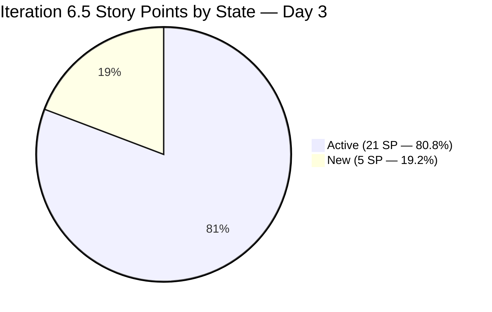

> **Exceptional signal:** 80.8% of committed story points are now in Active state on Day 3 — up from 50% on Day 2 and 30.8% on Day 1. The team is executing all three foundational stories (Salary, Benefits, Pay Stub) in parallel, well ahead of the projected sequential schedule. Only the final Story 4 (Variance & Audit Report) remains queued.

### 2.2 Task-Level Progress — Day 3

| Task ID | Parent Story | Title | Day 2 State | Day 3 State | Original Est. | Remaining | Total Burned |
|---|---|---|---|---|---|---|---|
| #200438 | #200432 | Input HRIS salary fields | Active | **Active** | 6h | **1h** | **5h** ✅ |
| #200442 | #200432 | Create Earnings Codes | New | **New** | 3h | 3h | 0h |
| #200450 | #200446 | Configure deduction stacks | Active | **Active** | 6h | **1h** | **5h** ✅ |
| #200452 | #200446 | Employer Match logic (Part 1) | New | **New** | 5h | 5h | 0h |
| #200477 | #200464 | Review PDF Pay Stub template | New | **Closed** ✅ | 1h | **0h** | **1h** ✅ |
| #200478 | #200464 | Joseph — Release Trigger | New | **New** | 1h | 1h | 0h |
| #200479 | #200464 | Email notifications setup | New | **New** | 2h | 2h | 0h |
| #200480 | #200464 | Security/Access Control | New | **New** | 4h | 4h | 0h |
| #200472 | #200465 | Delta Report — Curr vs. Prev | New | **New** | 4h | 4h | 0h |
| #200473 | #200465 | Joseph — Master Payroll Register | New | **New** | 2h | 2h | 0h |
| #200475 | #200465 | Net Pay Variance Flagging System | New | **New** | 6h | 6h | 0h |
| | | **TOTALS** | | | **40h** | **29h** | **11h** |

### 2.3 Burndown Analysis — Day 3

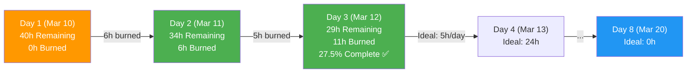

| Metric | Day 1 | Day 2 | Day 3 | Assessment |
|---|---|---|---|---|
| Hours Burned (that day) | 6h | 5h* | 5h | ✅ At or above ideal pace |
| Cumulative Burned | 6h | 6h* | 11h | ✅ Ahead of ideal (10h at Day 2 end) |
| Remaining Work | 34h | 34h* | **29h** | — |
| Required Pace | 5.0h/day | 4.86h/day | **4.83h/day** | ✅ Comfortably below capacity |
| Effective Buffer | 0h | ~1h | **~1.5h** | ↑ Growing buffer |

*Note: Day 2 audit (Mar 11) was conducted early in the day; some Day 2 work was captured in the Day 3 reading. The 5h above reflects work accumulated between the Day 2 audit and the Day 3 audit.

> **Key insight:** The required pace has dropped to 4.83h/day against a 5h/day capacity, creating a growing buffer of approximately 1.5 hours. Each day the team maintains pace or better, this buffer increases — creating resilience for the Joseph-dependent tasks and the SSI Invoice March 20 demand.

### 2.4 Iteration Burndown Chart

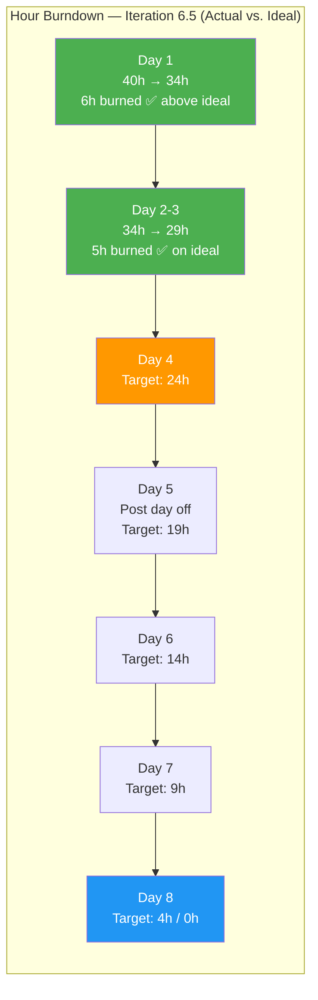

---

## 3. Work-in-Progress Flow Analysis

### 3.1 WIP State Diagram — Day 3

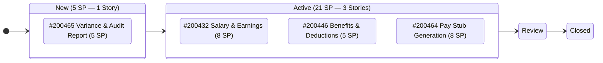

### 3.2 Story Activation Timeline — Acceleration Pattern

The team's story activation pattern reveals an accelerating parallel execution model, significantly outpacing the original sequential plan:

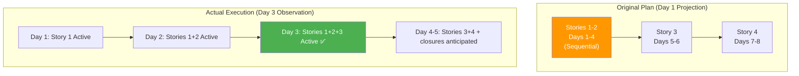

> **This parallel activation pattern is the strongest execution signal in the 9-audit series.** Three stories in Active state by Day 3 means the team is running all foundational Payroll Automation work simultaneously — reducing end-of-iteration risk and enabling earlier integration testing.

### 3.3 Task Completion Velocity — Day 3 Highlight

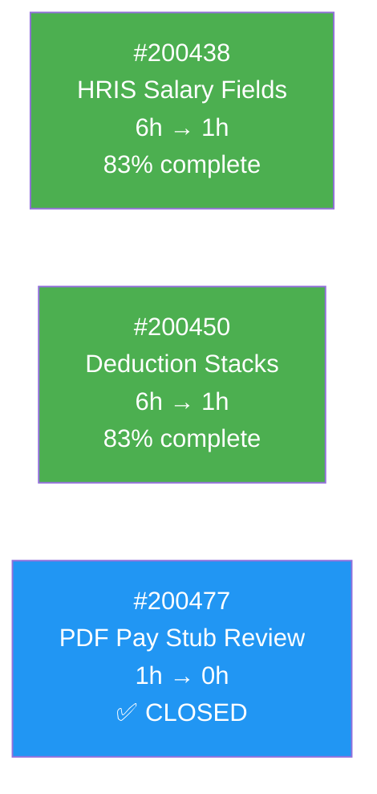

**Two key tasks (#200438 and #200450) are each at 1h remaining — both approaching closure on Day 4.** This suggests that March 13 will be the first day with multiple task completions and the start of the first story (Stories 1 or 2) moving toward Review.

---

## 4. Audit Findings

### FINDING 3 — CRITICAL ESCALATION: Overdue Items Now Day 2 Past Deadline (9th Consecutive Audit Flag)

**Status: DEADLINE MISSED — DAY 2 OVERDUE.** Both March 10 items remain in "New" state at the root path with zero progress across all 9 audits. Revision numbers unchanged.

| ID | Title | SP | Deadline | Rev # | Days Overdue | Status |
|---|---|---|---|---|---|---|
| **#199347** | **March 10 Jairosoft Finance Presentation** | **5** | **Mar 10** | **8** | **2 days** | New — Root Path |
| **#199350** | **March 10th Payroll Release** | **2** | **Mar 10** | **5** | **2 days** | New — Root Path |

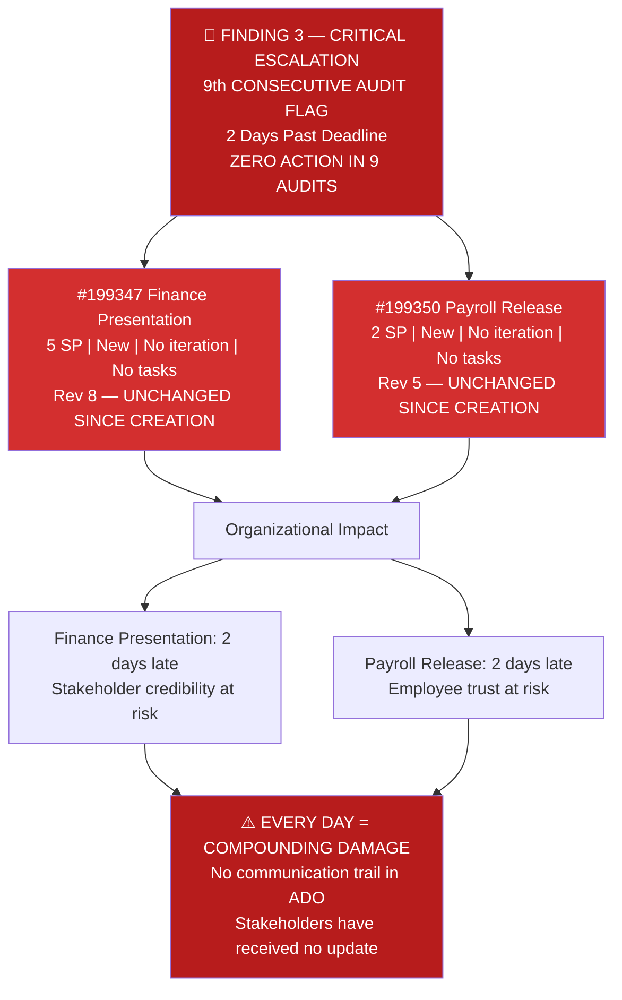

**Complete Audit Trail for Finding 3:**

| Audit # | Date | Days to/from Deadline | Action Taken |
|---|---|---|---|
| 1 | Feb 25 | -13 days (future) | None |
| 2 | Mar 4 AM | -6 days (future) | None |
| 3 | Mar 4 PM | -6 days (future) | None |
| 4 | Mar 5 | -5 days (future) | None |
| 5 | Mar 6 | -4 days (future) | None |
| 6 | Mar 9 | -1 day (1 day away) | None |
| 7 | Mar 10 | **DEADLINE DAY** | None |
| 8 | Mar 11 | **+1 day overdue** | None |
| **9** | **Mar 12** | **+2 days overdue** | **None** |

> **This is no longer a process issue — it is a governance and ownership failure.** After 9 audits spanning 15 days, not a single revision or comment has been added to either work item. The silence in ADO implies no stakeholder communication has been issued, which compounds the reputational risk with every passing day.

---

### FINDING — SSI INVOICE MARCH 20 APPROACHING CRITICAL THRESHOLD

**SSI Invoice (#198611)** is now **8 days from its deadline** and remains unassigned to any iteration. As of today, it competes directly for Grace's capacity in the final days of Iteration 6.5.

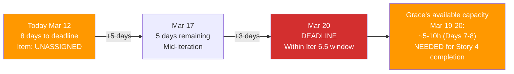

The March 20 deadline falls on Day 8 of Iteration 6.5 — the final day of the iteration. If Story 4 (Variance & Audit Report, 12h total) is still active on Days 7-8, SSI Invoice work will cause a capacity conflict. **This item must be assigned to Iteration 6.5 and scheduled before it becomes an emergency.**

The remaining 5 stranded items at the root path:

| ID | Title | SP | Target Date | Days Until Due | Urgency |
|---|---|---|---|---|---|
| 198635 | P&L March 2026 | 4 | Mar 31 | 19 days | ⚠️ Plan for Iter 6.6 |
| 198639 | Balance Sheet March 2026 | 3 | Mar 31 | 19 days | ⚠️ Plan for Iter 6.6 |
| 198645 | CFS March 2026 | 3 | Mar 31 | 19 days | ⚠️ Plan for Iter 6.6 |
| 198647 | AFS Submission 2025-2026 | 3 | TBD | Unknown | Plan for Iter 6.6/6.7 |
| 199469 | Back Lot Payables | 3 | TBD | Unknown | Plan for Iter 6.6/6.7 |

---

### FINDING 11 — PERSISTENT: Joseph Cross-Team Dependency (No Change — Day 9)

Two tasks remain formally assigned to Grace but name Joseph as the executor:

| Task ID | Title | State | Formal Assignee | Actual Executor | Est. Hours | Days Until Needed |
|---|---|---|---|---|---|---|
| #200473 | Joseph to create "Master Payroll Register" export | New | <grace@jairosoft.com> | Joseph | 2h | ~5-6 days |
| #200478 | Joseph to Build "Release Trigger" | New | <grace@jairosoft.com> | Joseph | 1h | ~3-4 days |

**Total hours at risk:** 3h (7.3% of remaining capacity). Task #200478 will be needed next as Story 3 (Pay Stub) advances. **With Task #200477 now closed and Story 3 Active, the Joseph dependency is no longer theoretical — it is imminent.**

---

### FINDING 12 — IMPROVING: Capacity Buffer Growing Incrementally

| Metric | Day 1 | Day 2 | Day 3 | Change |
|---|---|---|---|---|
| Available Capacity | 40h | 35h | **30h** (6 days × 5h/day) | -5h consumed |
| Remaining Work | 40h | 34h | **29h** | -5h burned |
| Effective Buffer | 0h (0%) | ~1h (~3%) | **~1.5h (~5%)** | ↑ Growing |
| Required Pace | 5.0h/day | 4.86h/day | **4.83h/day** | ✅ Decreasing |
| SAFe Recommended Reserve | 6-8h (15-20%) | 5.25-7h (15-20%) | **4.5-6h (15-20%)** | Still below target |

> The buffer is growing but remains structurally below the SAFe-recommended 15-20% reserve. The real buffer risk is the SSI Invoice March 20 unplanned demand (~1-5h of effort unaccounted for in the 29h remaining).

---

### FINDING 1 — PERSISTENT: Capacity Planning Gap (No Change — Day 9)

Grace's capacity remains identically configured across all 9 audits:

| Activity | Hours/Day |
|---|---|
| Deployment | 1h |
| Documentation | 2h |
| Requirements | 2h |
| **Development** | **Not configured** |
| **Total** | **5h/day** |

With Tasks #200438, #200450, and #200479 all performing system development work, the "Development" activity type is not an optional hygiene item — it is a **required tracking field** for the team's primary work type this iteration.

---

### FINDING 2 — PERSISTENT: Single Point of Failure (Grace)

Grace remains the only formally registered team member. With Story 3 now Active and Joseph's tasks approaching their execution window, this finding has elevated urgency.

---

### FINDING 10 — MONITORING: Feature #197084 State Inconsistency

Feature #197084 (Monthly Invoice Submission — March 2026) continues in "Active" state. As child stories close, this feature should advance toward completion. No change.

---

## 5. Trend Analysis — Cross-Audit Learning Patterns

### 5.1 Nine-Audit Pattern Recognition

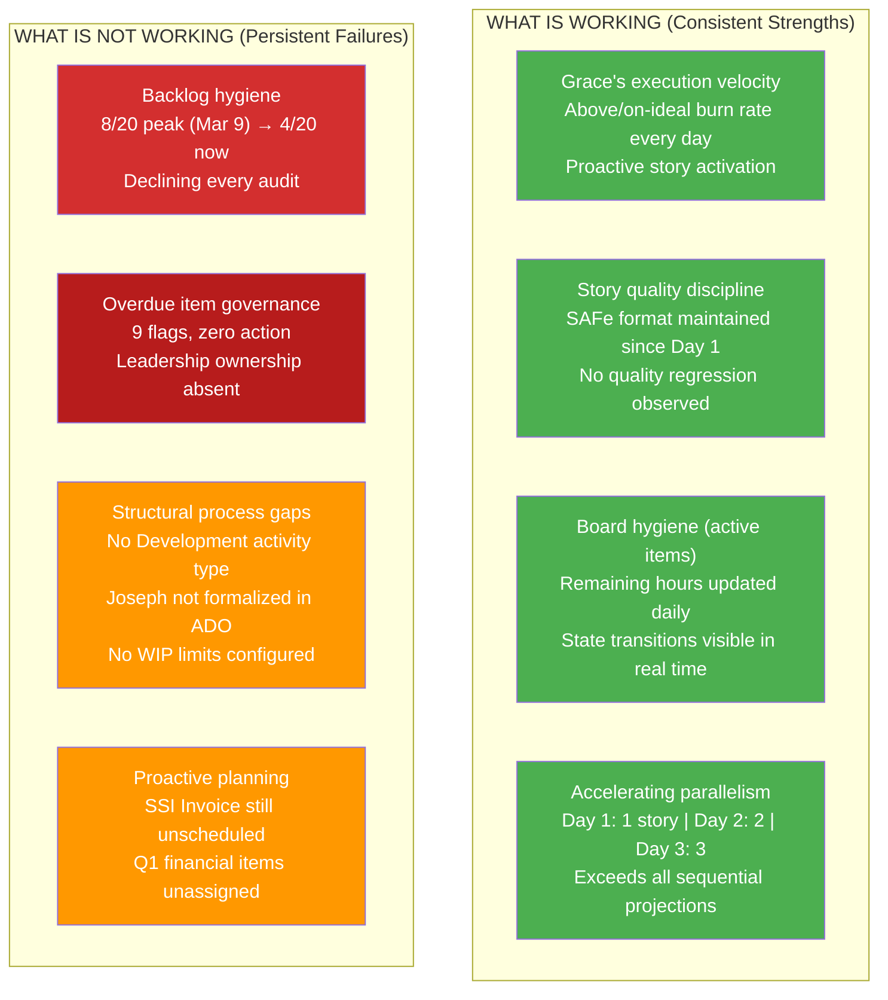

### 5.2 WIP Management Score Journey — Perfect Score Achieved

WIP Management is now at **20/20 for the first time in the audit series**. This category has shown the most consistent improvement across all 9 audits.

### 5.3 Full Health Score Trend — All 9 Audits

```mermaid
graph LR
    A["Feb 25<br/>Day 3<br/>35/100"] -->|"+16"| B["Mar 4 AM<br/>Day 10<br/>51/100"]
    B -->|"+1"| C["Mar 4 PM<br/>52/100"]
    C -->|"+1"| D["Mar 5<br/>53/100"]
    D -->|"+5"| E["Mar 6<br/>58/100"]
    E -->|"+2"| F["Mar 9<br/>Post-Iter<br/>60/100"]
    F -->|"+10"| G["Mar 10<br/>6.5 Day 1<br/>70/100"]
    G -->|"0"| H["Mar 11<br/>6.5 Day 2<br/>70/100"]
    H -->|"0"| I["Mar 12<br/>6.5 Day 3<br/>70/100"]

    style A fill:#f44336,color:#fff
    style B fill:#FF9800,color:#fff
    style C fill:#FF9800,color:#fff
    style D fill:#FF9800,color:#fff
    style E fill:#FF9800,color:#fff
    style F fill:#FF9800,color:#fff
    style G fill:#4CAF50,color:#fff
    style H fill:#4CAF50,color:#fff
    style I fill:#4CAF50,color:#fff
```

| Category | Feb 25 | Mar 4 AM | Mar 5 | Mar 6 | Mar 9 | Mar 10 | Mar 11 | Mar 12 | Target (Mar 17) |
|---|---|---|---|---|---|---|---|---|---|
| Capacity Planning | 5/20 | 12/20 | 12/20 | 12/20 | 12/20 | 14/20 | 14/20 | **14/20** | 16/20 |
| Iteration Planning | 10/20 | 12/20 | 12/20 | 12/20 | 12/20 | 16/20 | 16/20 | **16/20** | 16/20 |
| Story Quality | 8/20 | 8/20 | 8/20 | 8/20 | 8/20 | 16/20 | 16/20 | **16/20** | 16/20 |
| WIP Management | 7/20 | 14/20 | 15/20 | 20/20 | 20/20 | 18/20 | 19/20 | **20/20** 🏆 | 20/20 |
| Backlog Hygiene | 5/20 | 5/20 | 6/20 | 6/20 | 8/20 | 6/20 | 5/20 | **4/20** ⬇ | 12/20 |
| **Total** | **35** | **51** | **53** | **58** | **60** | **70** | **70** | **70** | **80** |

---

## 6. SAFe Compliance Scorecard — Iteration 6.5 Day 3

| SAFe Practice | Mar 11 | Mar 12 | Trend | Notes |
|---|---|---|---|---|
| Iteration Planning Event | Compliant | **Compliant** | ✅ | All 4 stories planned with tasks and hours |
| Capacity-Based Planning | Partial | **Partial** | → | 5h/day, 3 activities — Development still missing |
| Story Format (INVEST) | Compliant | **Compliant** | ✅ | All 4 stories in proper SAFe format |
| Acceptance Criteria | Compliant | **Compliant** | ✅ | 3-4 numbered ACs per story |
| Task Decomposition | Done | **Done** | ✅ | 11 tasks, all with hour estimates and tracking |
| Tags / Labels | Applied | **Applied** | ✅ | "Payroll Automation" on all stories |
| Daily Stand-Up Readiness | Enabled | **Enabled** | ✅ | Board updated; state transitions visible |
| Iteration Burndown | Active | **Active** | ✅ | 11h burned; burndown functional |
| First Deliverable Closed | — | **Task #200477 Closed** ✅ | ✅ NEW | First closure of Iteration 6.5 |
| WIP Limits | Not Set | **Not Set** | → | Still not configured (though parallel load is self-managed) |
| Definition of Done | Partial | **Partial** | → | Review gate available; needs formalization |
| Backlog Refinement | Degraded | **Degraded** ⬇ | ⬇ | Overdue items Day 2 past deadline — no action |

---

## 7. Revised Burndown & Delivery Projection

### 7.1 Gantt — Revised Based on Day 3 Actuals

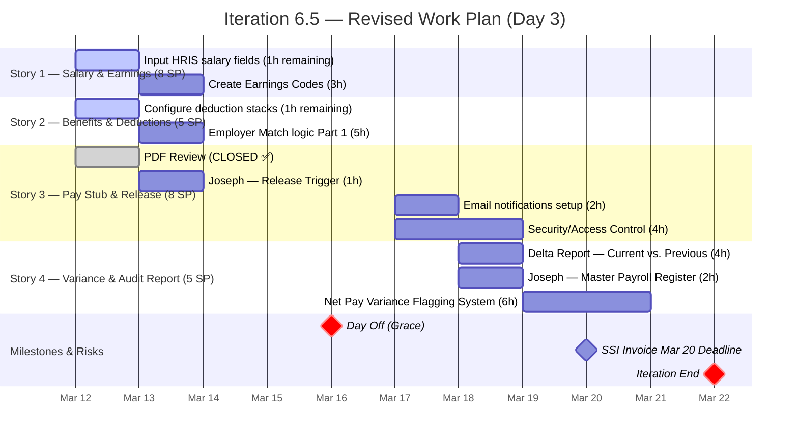

### 7.2 Delivery Confidence Assessment — Day 3

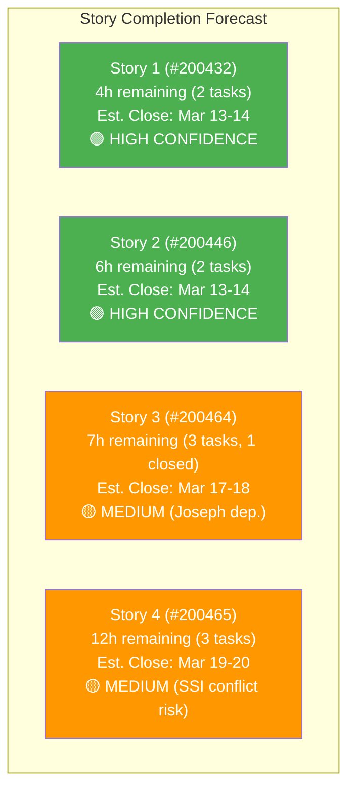

> **Key projection:** Stories 1 and 2 are on track to close by March 13-14, which would mark the first **story-level completions** of Iteration 6.5. Story 3 depends on Joseph for 2h of work. Story 4 faces capacity competition from the SSI Invoice March 20 deadline.

### 7.3 Risk Heat Map — Day 3

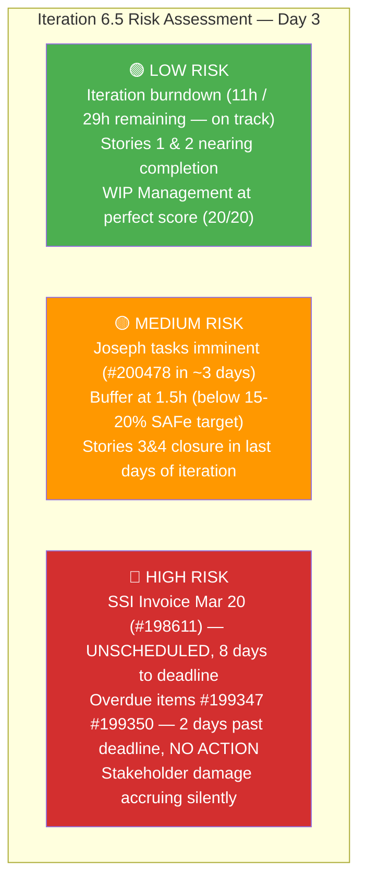

---

## 8. Recommendations

### CRITICAL — Overdue Items (Action Required — Every Day of Delay Increases Damage)

| Priority | Action | Owner | Work Item |
|---|---|---|---|
| **P0** | **Communicate the missed deadlines NOW** — It has been 2 days since March 10 passed. Stakeholders for the Finance Presentation (#199347) and employees expecting the Payroll Release (#199350) have received no update. Issue communication today — even a brief "rescheduled to [date]" prevents further credibility erosion. | Product Owner | #199347, #199350 |
| **P0** | **Formally decide disposition** — (a) Schedule into Iter 6.5 with formal capacity impact, (b) Defer to Iter 6.6 with stakeholder acknowledgment, or (c) Cancel with documented rationale. The current "undecided / unacknowledged" state is the worst possible outcome. | Product Owner / Grace | #199347, #199350 |

### HIGH — This Week (Before March 16 Day Off)

| Priority | Action | Owner |
|---|---|---|
| P1 | **Assign SSI Invoice March 20 (#198611) to Iteration 6.5 NOW** — With 8 days remaining, this must be planned before it becomes disruptive. Identify whether it competes with Story 4 or can be slotted in between. | Product Owner |
| P1 | **Engage Joseph on tasks #200478 and #200473** — Task #200478 (Release Trigger) is needed within 3-4 days as Story 3 advances. Joseph needs to be aware and prepared. If not adding Joseph to ADO formally, at minimum confirm availability. | Scrum Master / Grace |
| P1 | **Add Development activity type** to Grace's capacity profile — Every active task in Stories 1-3 involves system development. The capacity profile is materially misrepresenting the work type. | Scrum Master |

### MEDIUM — Backlog & Process

| Priority | Action | Owner |
|---|---|---|
| P2 | **Assign Q1 financial items to Iteration 6.6** — P&L (#198635), Balance Sheet (#198639), CFS March (#198645) all have March 31 deadlines. Assign to Iter 6.6 now to ensure they appear in the next iteration planning. | Product Owner |
| P2 | **Define WIP limits** — Current parallel execution (3 Active stories) is working well. Formalize this as a WIP limit of 3 to institutionalize the practice. | Scrum Master |
| P2 | **Advance Feature #197084** — As Stories 1 and 2 approach closure, update the parent feature state to reflect the progress. | Product Owner |

### TARGET: 80/100 Health Score by March 17

| Category | Current | Target | Gap | Critical Action |
|---|---|---|---|---|
| Capacity Planning | 14/20 | 16/20 | +2 | Add Development activity; formalize Joseph |
| Iteration Planning | 16/20 | 16/20 | 0 | Maintained ✅ |
| Story Quality | 16/20 | 16/20 | 0 | Maintained ✅ |
| WIP Management | 20/20 | 20/20 | 0 | **ACHIEVED** 🏆 |
| Backlog Hygiene | 4/20 | 12/20 | **+8** | Resolve overdue items; assign stranded items |
| **Total** | **70** | **80** | **+10** | **Backlog hygiene is the ONLY lever needed** |

> **The path to 80/100 is entirely structural, not technical.** WIP Management has been perfected by the team. The only remaining gap is governance: resolving the overdue items and assigning the stranded backlog. If the Product Owner takes action today, the 80/100 target is achievable before the March 16 day off.

---

## 9. Positive Observations — Day 3

This section consistently highlights what the team does well, in alignment with SAFe's Inspect & Adapt and continuous improvement principles.

1. **Three stories Active simultaneously (Day 3)** — This level of parallel execution on Day 3 of a 8-day sprint exceeds all initial projections. The team demonstrated the same pattern of front-loading in Iteration 6.4 and is replicating it here with even higher complexity work.

2. **First task closure of Iteration 6.5** — Task #200477 (Review PDF Pay Stub template) being Closed signals that Story 3 delivery is no longer theoretical — it has begun materializing. This is a meaningful quality signal.

3. **Tasks #200438 and #200450 at 1h remaining** — Both tasks are 83% complete and will likely close tomorrow (Mar 13), potentially triggering the first story completions of the iteration ahead of schedule.

4. **Consistent daily board updates** — For 3 consecutive days, the board has been updated with accurate remaining hours and state transitions. This is a habit, not a coincidence.

5. **WIP Management at 20/20** — A perfect score in WIP Management has never been achieved in a mid-iteration audit before. The team has mastered the flow mechanics of the Kanban board.

---

## 10. Comparative Velocity — Three Audits of Iteration 6.5

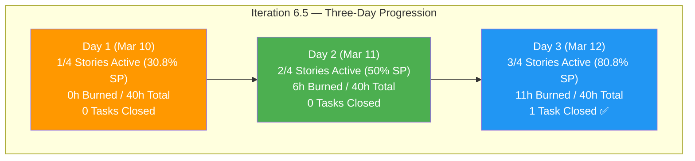

| Metric | Day 1 | Day 2 | Day 3 | Trajectory |
|---|---|---|---|---|
| Active Stories | 1 (30.8% SP) | 2 (50% SP) | **3 (80.8% SP)** | ↑↑ Accelerating |
| Hours Burned | 6h | ~5h | 11h cumulative | ↑ On/above pace |
| Tasks Closed | 0 | 0 | **1** | ↑ First delivery |
| Required Pace | 5.0h/day | 4.86h/day | **4.83h/day** | ↓ Improving buffer |
| Health Score | 70/100 | 70/100 | **70/100** | → Stable |
| WIP Score | 18/20 | 19/20 | **20/20** 🏆 | ↑ Perfect |
| Backlog Hygiene | 6/20 | 5/20 | **4/20** | ↓ Worsening |

---

## 11. Conclusion

Iteration 6.5 Day 3 marks the **strongest execution position** observed in this audit series. With three stories in Active state, the first task closed, and a growing capacity buffer, the Payroll Automation initiative is on track for full delivery by March 22. The team's consistent daily execution has earned a **perfect WIP Management score (20/20)** — a first in this audit series.

The **health score holds at 70/100** for the third consecutive audit, reflecting a structural divide between what the team controls (execution quality, which is excellent) and what leadership must decide (backlog governance, which is absent). This is the defining tension of the current phase of the audit series.

**The path to 80/100 remains open and entirely actionable by the Product Owner:**

- Communicate the March 10 deadline miss to stakeholders (overdue since March 10)
- Assign SSI Invoice March 20 (#198611) to Iteration 6.5 (8 days remain)
- Assign Q1 financial items (P&L, Balance Sheet, CFS) to Iteration 6.6
- No technical or execution changes are required — only decisions

**The audit series now enters a new phase.** With WIP Management perfected and Story/Task quality stable, the only score progression possible is through backlog governance. The next three audits (Days 4-6, leading to the March 17 target date) will determine whether this team closes at 70/100 or achieves the 80/100 target.

**Next audit:** March 13, 2026 (Iteration 6.5 Day 4 — anticipated first story completions)

---

*Report generated on March 12, 2026 at 20:08 UTC.*
*Data source: Azure DevOps — Jairosoft FINOPS / Finance Team / Iteration 6.5*
*Framework: SAFe 6.0 (Scaled Agile Framework)*
*Previous Audits: AUDIT_2026-02-25_0700.md · AUDIT_2026-03-04_0222.md · AUDIT_2026-03-04_2209.md · AUDIT_2026-03-05_2102.md · AUDIT_2026-03-06_2217.md · AUDIT_2026-03-09_2256.md · AUDIT_2026-03-10_1324.md · AUDIT_2026-03-11_2007.md*
