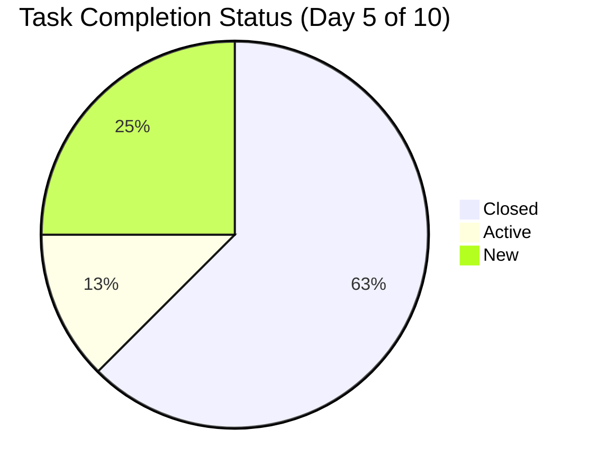
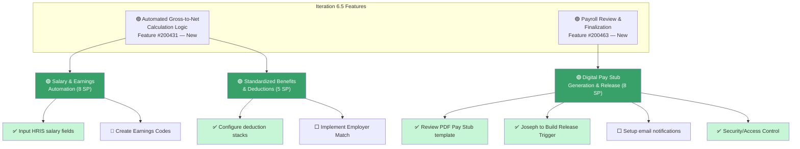
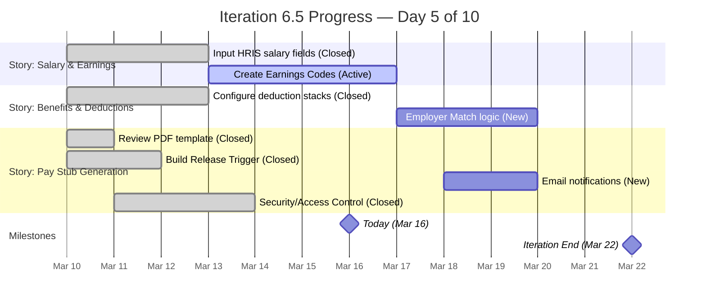
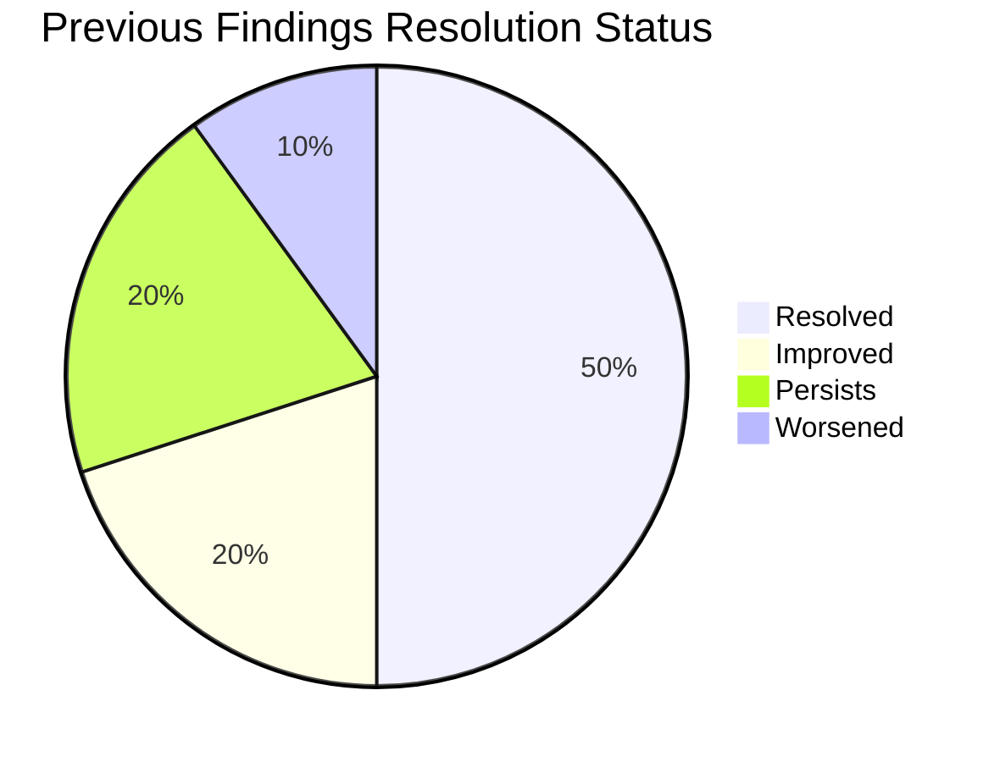
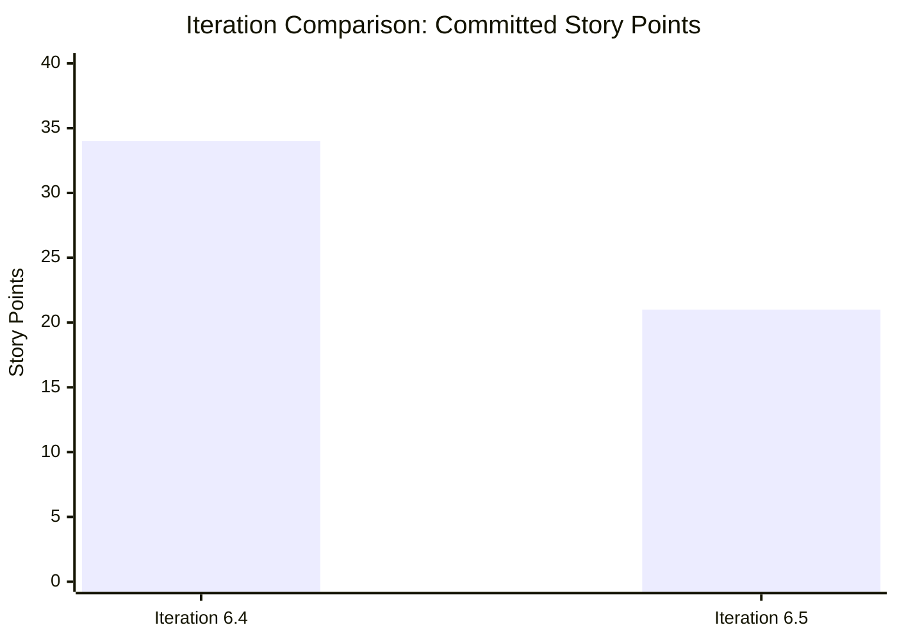

# SAFe Audit Report — Finance Team

**Project:** Jairosoft FINOPS
**Team:** Finance Team
**Iteration:** Iteration 6.5 (PI 2026-PI6)
**Iteration Window:** March 10, 2026 – March 22, 2026
**Audit Date:** March 16, 2026 (Day 5 of 10)
**Auditor:** AI Agile Project Management Consultant
**Framework:** SAFe 6.0 (Scaled Agile Framework)
**Previous Audit:** AUDIT_2026-02-25_0700 (Iteration 6.4)

---

## 1. Executive Summary

This audit evaluates the Finance Team's Iteration 6.5 board against SAFe framework standards and compares progress to the findings from the previous audit (Iteration 6.4, February 25, 2026).

The team has made **remarkable progress**, resolving 5 of 10 findings from the previous audit and improving 2 others. The overall health score has nearly doubled from **35/100 to 68/100**. However, **2 critical issues persist** — the single-person bottleneck and overdue backlog items — and 3 new findings have been identified.

**Overall Health Score: 68 / 100 (Progressing — On Track for Maturity)**

| Category | Previous (6.4) | Current (6.5) | Change |
|---|---|---|---|
| Capacity Planning | 5/20 🔴 | 16/20 🟢 | +11 |
| Iteration Planning | 10/20 🔴 | 16/20 🟢 | +6 |
| Story Quality | 8/20 🟡 | 16/20 🟢 | +8 |
| Work-in-Progress Management | 7/20 🟡 | 14/20 🟢 | +7 |
| Backlog Hygiene | 5/20 🔴 | 6/20 🔴 | +1 |

```mermaid
xychart-beta
    title "Health Score Comparison: Iteration 6.4 vs 6.5"
    x-axis ["Capacity", "Iteration Planning", "Story Quality", "WIP Mgmt", "Backlog Hygiene"]
    y-axis "Score (out of 20)" 0 --> 20
    bar [5, 10, 8, 7, 5]
    bar [16, 16, 16, 14, 6]
```

---

## 2. Iteration Overview

### 2.1 Iteration Scope

Iteration 6.5 contains **3 User Stories** with **8 child Tasks** across **2 parent Features**, totaling **21 Story Points**. This is a significant reduction from the 15 stories / 34 SP in Iteration 6.4, reflecting better capacity-based planning.

| Metric | Iteration 6.4 | Iteration 6.5 | Assessment |
|---|---|---|---|
| User Stories | 15 | 3 | ✅ Right-sized |
| Story Points | 34 | 21 | ✅ Capacity-aligned |
| Child Tasks | 0 | 8 | ✅ Decomposed |
| Parent Features | 9 | 2 | ✅ Focused |
| Estimated Hours | N/A | 28 hrs | ✅ Tracked |
| Capacity (hrs) | 0 | 45 hrs | ✅ Configured |
| Load Factor | Unknown | 62% | ✅ Sustainable |

### 2.2 Team Capacity

| Member | Activity | Capacity/Day | Days Off |
|---|---|---|---|
| Grace | Deployment | 1 hr | March 16 |
| Grace | Documentation | 2 hrs | — |
| Grace | Requirements | 2 hrs | — |
| **Total** | — | **5 hrs/day** | **1 day** |

**Total Iteration Capacity:** 9 working days × 5 hrs/day = **45 hours**
**Total Estimated Work:** 28 hours
**Load Factor:** 62% (within SAFe-recommended 80% threshold)

### 2.3 Work Item State Distribution

| State | Stories | Tasks | Total | Story Points |
|---|---|---|---|---|
| Active | 3 | 1 | 4 | 21 |
| New | 0 | 2 | 2 | 0 |
| Closed | 0 | 5 | 5 | 0 |
| **Total** | **3** | **8** | **11** | **21** |

### 2.4 Detailed Work Item Inventory

#### User Story #200432 — Salary & Earnings Automation (8 SP)
**Parent Feature:** Automated Gross-to-Net Calculation Logic (#200431)
**State:** Active | **Tags:** Payroll Automation

| Task ID | Title | State | Est. | Completed | Remaining |
|---|---|---|---|---|---|
| 200438 | Input HRIS salary fields | Closed | 6 hrs | 4 hrs | — |
| 200442 | Create "Earnings Codes" | Active | 3 hrs | — | 3 hrs |

#### User Story #200446 — Standardized Benefits & Deductions (5 SP)
**Parent Feature:** Automated Gross-to-Net Calculation Logic (#200431)
**State:** Active | **Tags:** Payroll Automation

| Task ID | Title | State | Est. | Completed | Remaining |
|---|---|---|---|---|---|
| 200450 | Configure deduction "stacks" | Closed | 6 hrs | 4 hrs | — |
| 200452 | Implement Employer Match vs. Employee Contribution | New | 5 hrs | — | 5 hrs |

#### User Story #200464 — Digital Pay Stub Generation & Release (8 SP)
**Parent Feature:** Payroll Review & Finalization (#200463)
**State:** Active | **Tags:** Payroll Automation

| Task ID | Title | State | Est. | Completed | Remaining |
|---|---|---|---|---|---|
| 200477 | Review PDF Pay Stub template | Closed | 1 hr | — | — |
| 200478 | Joseph to Build the "Release Trigger" | Closed | 1 hr | 0.25 hrs | — |
| 200479 | Setup automated email notifications for "Pay Day" | New | 2 hrs | — | 2 hrs |
| 200480 | Security/Access Control | Closed | 4 hrs | 1 hr | — |

---

## 3. Feature Hierarchy

> ✅ = Closed | 🔵 = Active | ⬜ = New | 🟢 = Active Story

---

## 4. Burndown Analysis (Day 5 of 10)

**Task-level progress:**
- **5 of 8 tasks closed** (62.5% task completion)
- **9.25 hours completed** of 28 estimated (33% by hours)
- **10 hours remaining** across 3 open tasks

**Projection:** With 10 hours remaining and ~5 working days left (25 hours capacity), the iteration is **on track to complete all committed work**. This is a **green/healthy** trajectory.

---

## 5. Previous Audit Remediation Tracker

| # | Previous Finding | Severity | Status | Evidence |
|---|---|---|---|---|
| 1 | Zero capacity configured | 🔴 Critical | ✅ **RESOLVED** | Grace has 5 hrs/day across 3 activities with 1 day off recorded |
| 2 | Single team member | 🔴 Critical | ⚠️ **PERSISTS** | All items still assigned to Grace only |
| 3 | 8 items missing iteration | 🔴 Critical | 🔴 **WORSENED** | Same 8 items still unplanned; 4 are now past target date |
| 4 | Stories lack SAFe format | 🟡 Major | ✅ **RESOLVED** | Stories now have persona-driven descriptions with clear actions |
| 5 | Minimal acceptance criteria | 🟡 Major | ✅ **RESOLVED** | Multi-condition AC with specific thresholds (e.g., ">10% variance," "50% gross cap") |
| 6 | No task decomposition | 🟡 Major | ✅ **RESOLVED** | All 3 stories decomposed into tasks with hour estimates |
| 7 | Overcommitment risk | 🟡 Major | ✅ **RESOLVED** | 21 SP / 28 hrs estimated against 45 hrs capacity (62% load) |
| 8 | No estimation process | 🟢 Minor | ✅ **IMPROVED** | Tasks have original estimates; some completed work tracking |
| 9 | No tags/labels | 🟢 Minor | ✅ **IMPROVED** | "Payroll Automation" tag applied to iteration stories |
| 10 | Feature state inconsistency | 🟢 Minor | ⚠️ **PERSISTS** | Features #200431 and #200463 are "New" while child stories are "Active" |

---

## 6. Current Audit Findings

### 🔴 FINDING 1 — CRITICAL: Overdue Backlog Items with Passed Target Dates

**SAFe Principle Violated:** *Iteration Planning — Commitment and Accountability*

Four backlog items have **target dates that have already passed** and remain in "New" state with no iteration assignment. These represent missed deliverables or unacknowledged scope changes.

| ID | Title | Target Date | Days Overdue | SP |
|---|---|---|---|---|
| 198639 | Balance Sheet March 2026 | Mar 10 | **6 days** | 3 |
| 199347 | March 10 Jairosoft Finance Presentation | Mar 10 | **6 days** | 5 |
| 199350 | March 10th Payroll release | Mar 10 | **6 days** | 2 |
| 199469 | Back Lot Payables | Mar 13 | **3 days** | 3 |

**Additional at-risk items:**

| ID | Title | Target Date | SP |
|---|---|---|---|
| 198611 | SSI Invoice - March 20 | Mar 20 (4 days away) | 1 |

**Impact:** Overdue items signal either incomplete work that was not tracked, scope that was deferred without formal acknowledgment, or items that were completed but never updated in ADO. Any of these scenarios undermines team predictability and stakeholder trust.

**Recommendation:**
1. Immediately triage all 4 overdue items: completed (close them), deferred (update target date and document reason), or cancelled (remove from backlog).
2. Move "SSI Invoice - March 20" (#198611) into Iteration 6.5 or the next available iteration before its target date passes.
3. Establish a backlog grooming cadence to review target dates every iteration.

---

### 🔴 FINDING 2 — CRITICAL: Single Team Member Bottleneck (Persistent)

**SAFe Principle Violated:** *Agile Team — Cross-Functional, Self-Managing Teams*

This finding persists from the previous audit. All 11 work items (3 stories + 8 tasks) remain assigned to Grace alone. SAFe recommends team sizes of 5–11 members.

**Notable:** Task #200478 ("Joseph to Build the 'Release Trigger'") is named for Joseph but assigned to Grace, suggesting cross-team collaboration that is not reflected in assignments.

**Impact:** Bus factor of 1. Grace's single day off today (March 16) means zero team throughput. No knowledge sharing, no peer review, no resilience.

**Recommendation:**
1. If Joseph is contributing work, add him to the team or reflect his capacity as a shared resource.
2. Evaluate whether the Finance Team can absorb a second member from another team during PI6.
3. At minimum, document Grace's processes for continuity planning.

---

### 🟡 FINDING 3 — MAJOR: Feature States Not Updated

**SAFe Principle Violated:** *Feature — Lifecycle State Management*

Both parent Features (#200431 "Automated Gross-to-Net Calculation Logic" and #200463 "Payroll Review & Finalization") remain in **"New"** state while their child stories are **"Active"** with tasks being completed.

**Impact:** Feature-level reporting and PI tracking dashboards will show these features as not started, misrepresenting actual progress to program-level stakeholders.

**Recommendation:** Transition both Features to "Active" immediately.

---

### 🟡 FINDING 4 — MAJOR: Incomplete Work Tracking on Closed Tasks

**SAFe Principle Violated:** *Iteration Execution — Accurate Metrics*

Several closed tasks show discrepancies in work tracking:

| Task | Original Est. | Completed Work | Gap |
|---|---|---|---|
| 200477 - Review PDF Pay Stub template | 1 hr | Not recorded | Missing |
| 200478 - Build Release Trigger | 1 hr | 0.25 hrs | 75% variance |
| 200480 - Security/Access Control | 4 hrs | 1 hr | 75% variance |
| 200438 - Input HRIS salary fields | 6 hrs | 4 hrs | 33% variance |
| 200450 - Configure deduction stacks | 6 hrs | 4 hrs | 33% variance |

**Impact:** Without accurate completed-work tracking, the team cannot calibrate future estimates, calculate actual velocity, or generate meaningful burndown charts.

**Recommendation:**
1. Update completed work on all closed tasks before iteration review.
2. Establish a practice of logging actual hours when closing tasks.
3. Use the variance data to improve estimation accuracy in future iterations.

---

### 🟡 FINDING 5 — MAJOR: Backlog Items at PI Level Without Iteration Assignment

**SAFe Principle Violated:** *Backlog Refinement — Iteration-Level Planning*

Two additional User Stories (#200422 "Work Item Categorization" and #200423 "Automated Quarterly Export") are assigned to the PI6 root path rather than a specific iteration. Combined with the 8 items from the previous audit (3 remaining items with future target dates), there are **5 unplanned stories totaling ~19+ SP** that need iteration homes.

| ID | Title | Iteration Path | Target Date |
|---|---|---|---|
| 200422 | Work Item Categorization | 2026-PI6 (root) | — |
| 200423 | Automated Quarterly Export | 2026-PI6 (root) | — |
| 198635 | P&L March 2026 | Jairosoft FINOPS (root) | Apr 6 |
| 198645 | CFS March 2026 | Jairosoft FINOPS (root) | Apr 10 |
| 198647 | AFS Submission 2025-2026 | Jairosoft FINOPS (root) | Apr 10 |

**Recommendation:** Assign all items to target iterations during next backlog refinement. Items with April target dates should be placed in Iteration 6.6 (IP) at latest.

---

### 🟢 FINDING 6 — MINOR: Task Assignment Does Not Reflect Actual Contributor

Task #200478 ("Joseph to Build the 'Release Trigger'") names Joseph in the title but is assigned to Grace. If Joseph performed the work, the assignment should reflect that for accurate workload and capacity tracking.

**Recommendation:** If Joseph contributed, update the assignment or add a comment noting the actual contributor.

---

## 7. SAFe Compliance Scorecard

| SAFe Practice | Prev. Status | Current Status | Notes |
|---|---|---|---|
| Iteration Planning Event | ⚠️ Partial | ✅ Healthy | Capacity-based planning with 62% load |
| Capacity-Based Planning | ❌ Missing | ✅ Configured | 5 hrs/day, 3 activities, day off tracked |
| Story Format (INVEST) | ❌ Non-Compliant | ✅ Compliant | Persona-driven with clear business value |
| Acceptance Criteria | ⚠️ Minimal | ✅ Strong | Multi-condition, specific thresholds |
| Task Decomposition | ❌ Missing | ✅ Present | All stories have tasks with hour estimates |
| Daily Stand-Up Readiness | ⚠️ Partial | ✅ Ready | Task-level state tracking enables daily sync |
| Iteration Burndown | ❌ Not Possible | ⚠️ Partial | Hours tracked but some gaps in completed work |
| WIP Limits | ❌ Not Set | ⚠️ Implicit | 3 stories active is reasonable; not formally configured |
| Definition of Done | ⚠️ Unknown | ⚠️ Unknown | Still not documented at team level |
| Iteration Review/Demo | ⚠️ Unknown | ⚠️ Unknown | No evidence of planned review |
| Iteration Retrospective | ⚠️ Unknown | ⚠️ Unknown | No evidence of planned retro |
| Backlog Refinement | ⚠️ Partial | ⚠️ Partial | Iteration items refined; backlog items stale |
| PI Objectives Alignment | ⚠️ Partial | ✅ Improved | Features have WSJF scores and business value |
| Tags / Categorization | ❌ None | ✅ Used | "Payroll Automation" tag on iteration items |

**Compliance Trend:**
- Previous: 1 ✅ / 3 ⚠️ / 5 ❌ / 5 Unknown
- Current: 7 ✅ / 5 ⚠️ / 0 ❌ / 2 Unknown

---

## 8. Velocity & Trend Analysis

| Metric | Iteration 6.4 | Iteration 6.5 (projected) | Trend |
|---|---|---|---|
| Stories Committed | 15 | 3 | ⬇️ Right-sized |
| Story Points Committed | 34 | 21 | ⬇️ Realistic |
| Features in Scope | 9 | 2 | ⬇️ Focused |
| Capacity Configured | 0 hrs | 45 hrs | ⬆️ Resolved |
| Load Factor | Unknown | 62% | ✅ Sustainable |
| Task Decomposition | 0 tasks | 8 tasks | ⬆️ Mature |
| Tags Used | 0 | 3 stories tagged | ⬆️ Improving |
| AC Quality | Single-line | Multi-condition | ⬆️ Compliant |

---

## 9. Recommendations Summary

| # | Severity | Finding | Recommendation | Owner |
|---|---|---|---|---|
| 1 | 🔴 Critical | 4 overdue backlog items | Triage immediately: close, defer, or cancel | Product Owner |
| 2 | 🔴 Critical | Single team member (persistent) | Evaluate adding Joseph or shared capacity | Management |
| 3 | 🟡 Major | Feature states not updated | Transition Features #200431, #200463 to Active | Product Owner |
| 4 | 🟡 Major | Incomplete work tracking | Log actual hours on all closed tasks | Grace |
| 5 | 🟡 Major | 5 items without iteration | Assign to target iterations in next refinement | Product Owner |
| 6 | 🟢 Minor | Task assignment mismatch | Update #200478 assignment if Joseph contributed | Grace |

---

## 10. Conclusion

The Finance Team has demonstrated **exceptional improvement** between Iteration 6.4 and 6.5. Five of ten previous findings have been fully resolved, and the team's SAFe compliance has jumped from 1 to 7 passing practices. The iteration is well-planned, properly decomposed, and on track for completion.

The remaining concern is the **overdue backlog**. Four items with March 10–13 target dates have passed without resolution, and the single-person bottleneck continues to limit the team's throughput and resilience. Addressing these two persistent issues will move the team from "progressing" to "high-performing" territory.

**What Went Well (Celebrate These Wins):**
- Capacity planning is now fully configured with 3 activity types and PTO tracking
- Stories follow SAFe format with detailed, multi-condition acceptance criteria
- Task decomposition with hour estimates enables proper burndown tracking
- WSJF scoring on features demonstrates program-level alignment
- Iteration load factor of 62% shows disciplined, sustainable planning
- Tagging taxonomy has been initiated with "Payroll Automation"

**Immediate Actions:**
1. Triage the 4 overdue backlog items today.
2. Update Feature states to "Active."
3. Log completed hours on all closed tasks before iteration review.
4. Plan the March 20 SSI Invoice (#198611) into an iteration.

---

*Report generated on March 16, 2026 at 02:25 UTC.*
*Data source: Azure DevOps — Jairosoft FINOPS / Finance Team / Iteration 6.5*
*Framework: SAFe 6.0 (Scaled Agile Framework)*
*Previous audit: AUDIT_2026-02-25_0700 (Iteration 6.4)*
