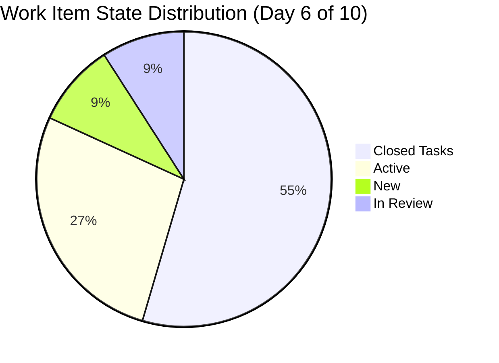
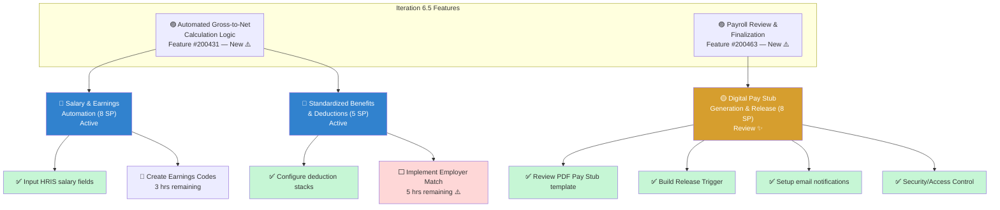
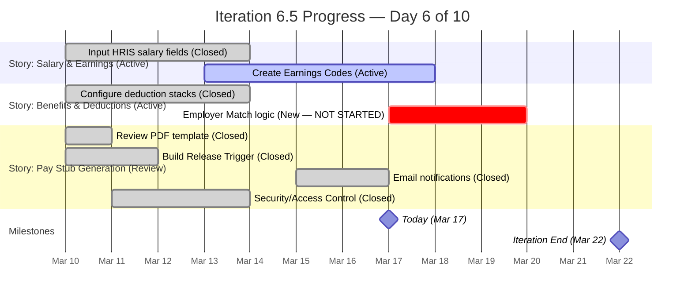
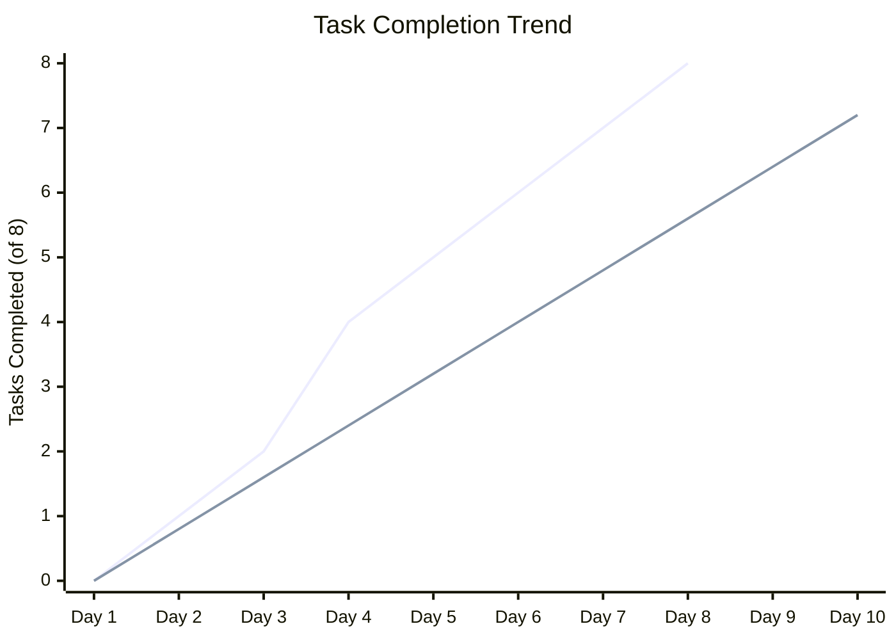
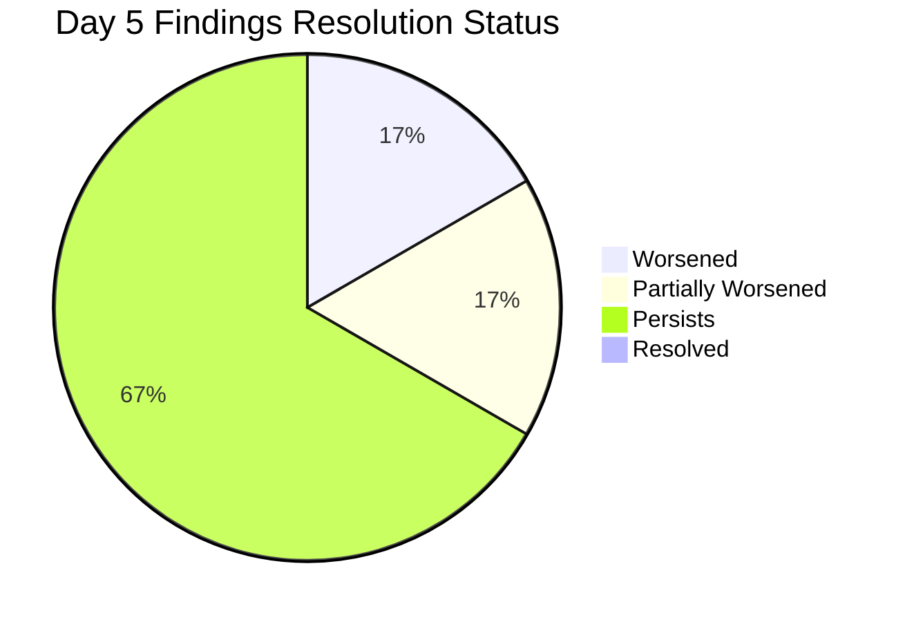
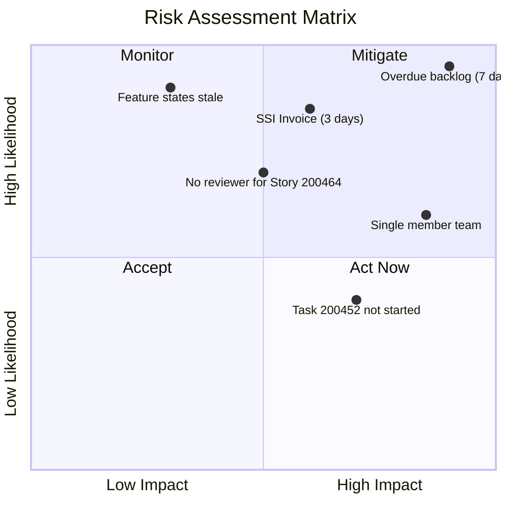

# SAFe Audit Report — Finance Team

**Project:** Jairosoft FINOPS
**Team:** Finance Team
**Iteration:** Iteration 6.5 (PI 2026-PI6)
**Iteration Window:** March 10, 2026 – March 22, 2026
**Audit Date:** March 17, 2026 (Day 6 of 10)
**Auditor:** AI Agile Project Management Consultant
**Framework:** SAFe 6.0 (Scaled Agile Framework)
**Previous Audit:** AUDIT_2026-03-16_0225 (Iteration 6.5, Day 5)

---

## 1. Executive Summary

This audit evaluates the Finance Team's Iteration 6.5 board on Day 6 of 10 and compares progress against the previous audit conducted on Day 5 (March 16, 2026).

The team continues to make **steady forward progress**. Since the last audit, one additional task has been closed and User Story #200464 (Digital Pay Stub Generation & Release) has advanced to **Review** state — the first story in this iteration to reach that stage. Task completion has risen from 62.5% to **75%**, and remaining work has decreased from 10 hours to **8 hours**.

However, the **overdue backlog crisis has worsened**. Four items are now **7 days past their target dates** with no triage action taken, and the SSI Invoice (#198611) is now only **3 days from its target date** with no iteration assignment. Feature states remain un-updated despite being flagged in three consecutive audits.

**Overall Health Score: 69 / 100 (Progressing — On Track)**

| Category                    | Day 5 Score | Day 6 Score | Change |
| --------------------------- | ----------- | ----------- | ------ |
| Capacity Planning           | 16/20       | 16/20       | —      |
| Iteration Planning          | 16/20       | 17/20       | +1     |
| Story Quality               | 16/20       | 16/20       | —      |
| Work-in-Progress Management | 14/20       | 15/20       | +1     |
| Backlog Hygiene             | 6/20        | 5/20        | -1     |
|                             |             |             |        |

```mermaid
xychart-beta
    title "Health Score Trend: Day 5 vs Day 6"
    x-axis ["Capacity", "Iteration Planning", "Story Quality", "WIP Mgmt", "Backlog Hygiene"]
    y-axis "Score (out of 20)" 0 --> 20
    bar [16, 16, 16, 14, 6]
    bar [16, 17, 16, 15, 5]
```

---

## 2. Iteration Overview

### 2.1 Iteration Scope

The iteration scope remains unchanged at **3 User Stories** with **8 child Tasks** across **2 parent Features**, totaling **21 Story Points**.

| Metric | Day 5 | Day 6 | Delta |
|---|---|---|---|
| User Stories | 3 | 3 | — |
| Story Points | 21 | 21 | — |
| Child Tasks | 8 | 8 | — |
| Tasks Closed | 5 | **6** | **+1** |
| Task Completion % | 62.5% | **75%** | **+12.5%** |
| Remaining Work (hrs) | 10 | **8** | **-2 hrs** |
| Completed Work (hrs) | 9.25 | **9.5** | **+0.25 hrs** |

### 2.2 Team Capacity

| Member | Activity | Capacity/Day | Days Off |
|---|---|---|---|
| Grace | Deployment | 1 hr | March 16 (past) |
| Grace | Documentation | 2 hrs | — |
| Grace | Requirements | 2 hrs | — |
| **Total** | — | **5 hrs/day** | **0 remaining** |

**Remaining Iteration Capacity:** 4 working days × 5 hrs/day = **20 hours**
**Remaining Estimated Work:** 8 hours
**Remaining Load Factor:** 40% (healthy margin)

### 2.3 Work Item State Distribution (Day 6)

| State | Stories | Tasks | Total | Story Points |
|---|---|---|---|---|
| Review | **1** | 0 | **1** | **8** |
| Active | 2 | 1 | 3 | 13 |
| New | 0 | 1 | 1 | 0 |
| Closed | 0 | **6** | **6** | 0 |
| **Total** | **3** | **8** | **11** | **21** |

### 2.4 Day-over-Day Delta

| Change | Item | Detail |
|---|---|---|
| **Task Closed** | #200479 — Setup automated notifications for "Pay Day" | New → Closed (Completed: 0.25 hrs of 2 hrs estimated) |
| **Story Advanced** | #200464 — Digital Pay Stub Generation & Release | Active → **Review** (3 of 4 tasks closed) |

### 2.5 Detailed Work Item Inventory

#### User Story #200432 — Salary & Earnings Automation (8 SP)
**Parent Feature:** Automated Gross-to-Net Calculation Logic (#200431)
**State:** Active | **Tags:** Payroll Automation

| Task ID | Title | State | Est. | Completed | Remaining | Change |
|---|---|---|---|---|---|---|
| 200438 | Input HRIS salary fields | Closed | 6 hrs | 4 hrs | — | — |
| 200442 | Create "Earnings Codes" | **Active** | 3 hrs | — | 3 hrs | — |

> **Assessment:** 1 of 2 tasks closed. Blocked on #200442 (3 hrs remaining). This story cannot advance to Review until Earnings Codes task completes.

#### User Story #200446 — Standardized Benefits & Deductions (5 SP)
**Parent Feature:** Automated Gross-to-Net Calculation Logic (#200431)
**State:** Active | **Tags:** Payroll Automation

| Task ID | Title | State | Est. | Completed | Remaining | Change |
|---|---|---|---|---|---|---|
| 200450 | Configure deduction "stacks" | Closed | 6 hrs | 4 hrs | — | — |
| 200452 | Implement Employer Match vs. Employee Contribution | **New** | 5 hrs | — | 5 hrs | — |

> **Assessment:** 1 of 2 tasks closed. Task #200452 has **not started** (still "New"). With 5 hours of work remaining, this is the highest-risk story. If not started by Day 7, it will consume 100% of a working day.

#### User Story #200464 — Digital Pay Stub Generation & Release (8 SP)
**Parent Feature:** Payroll Review & Finalization (#200463)
**State:** Review | **Tags:** Payroll Automation

| Task ID | Title | State | Est. | Completed | Remaining | Change |
|---|---|---|---|---|---|---|
| 200477 | Review PDF Pay Stub template | Closed | 1 hr | — | — | — |
| 200478 | Joseph to Build Release Trigger | Closed | 1 hr | 0.25 hrs | — | — |
| 200479 | Setup automated notifications for "Pay Day" | **Closed** | 2 hrs | 0.25 hrs | — | **NEW: Closed** |
| 200480 | Security/Access Control | Closed | 4 hrs | 1 hr | — | — |

> **Assessment:** 4 of 4 tasks closed. Story has advanced to **Review** state. This is the first story in the iteration nearing completion. Pending final review and acceptance.

---

## 3. Feature Hierarchy

> ✅ = Closed | 🔵 = Active | ⬜ = New | 🟡 = In Review | ⚠️ = Needs Attention

---

## 4. Burndown Analysis (Day 6 of 10)

**Task-level progress:**
- **6 of 8 tasks closed** (75% task completion)
- **9.5 hours of completed work logged** out of 28 estimated (34% by hours)
- **8 hours remaining** across 2 open tasks
- **1 story in Review** (first to near completion)

**Projection:** With 8 hours remaining and 20 hours of capacity over 4 working days, the iteration is **on track** to complete all committed work. However, Task #200452 (Employer Match, 5 hrs) has not started and is now on the **critical path**. If Grace starts this task by Day 7, there is sufficient runway.

> **Solid line:** Actual completion | **Dashed line:** Ideal burndown. Team is **tracking ahead** of the ideal line.

---

## 5. Previous Audit Remediation Tracker

This section tracks findings from the **Day 5 audit** (AUDIT_2026-03-16_0225).

| # | Day 5 Finding | Severity | Day 6 Status | Evidence |
|---|---|---|---|---|
| 1 | 4 overdue backlog items (6 days) | 🔴 Critical | 🔴 **WORSENED** | Now **7 days overdue**. No triage action taken. Items unchanged since Feb 23 |
| 2 | Single team member bottleneck | 🔴 Critical | ⚠️ **PERSISTS** | All items still assigned to Grace only |
| 3 | Feature states not updated | 🟡 Major | ⚠️ **PERSISTS** | Features #200431, #200463 still "New" despite child stories Active/Review |
| 4 | Incomplete work tracking on closed tasks | 🟡 Major | 🟡 **PARTIALLY WORSENED** | New closure (#200479) logged only 0.25 hrs against 2 hr estimate |
| 5 | 5 items without iteration assignment | 🟡 Major | ⚠️ **PERSISTS** | All 5 items still at PI or root level |
| 6 | Task assignment mismatch (#200478) | 🟢 Minor | ⚠️ **PERSISTS** | Still assigned to Grace despite "Joseph" in title |

> **Concern:** Zero findings from the Day 5 audit have been resolved. This is expected given only 1 day has elapsed, but the overdue backlog items (Finding 1) are now **critical** — they have been stale since February 23 and have passed their target dates by a full week.

---

## 6. Current Audit Findings

### 🔴 FINDING 1 — CRITICAL: Overdue Backlog Items Now 7 Days Past Due (Escalated)

**SAFe Principle Violated:** *Iteration Planning — Commitment and Accountability*

This finding has **escalated** from the previous audit. Four items remain in "New" state with target dates that have now passed by 4–7 days. None have been triaged, updated, or commented on since February 23 — nearly **3 weeks of inaction**.

| ID | Title | Target Date | Days Overdue | SP | Last Changed |
|---|---|---|---|---|---|
| 198639 | Balance Sheet March 2026 | Mar 10 | **7 days** | 3 | Feb 23 |
| 199347 | March 10 Jairosoft Finance Presentation | Mar 10 | **7 days** | 5 | Feb 23 |
| 199350 | March 10th Payroll release | Mar 10 | **7 days** | 2 | Feb 23 |
| 199469 | Back Lot Payables | Mar 13 | **4 days** | 3 | Feb 23 |

**Imminent risk:**

| ID | Title | Target Date | Days Until Due | SP |
|---|---|---|---|---|
| 198611 | SSI Invoice - March 20 | Mar 20 | **3 days** | 1 |

**Impact:** These items represent **14 story points** of untracked work. Whether they were completed off-board, deferred, or forgotten, the lack of any board update since February 23 creates a **phantom backlog** that undermines all capacity planning and velocity calculations. The SSI Invoice is now 3 days away from becoming the 5th overdue item.

**Recommendation:**
1. **TODAY:** Triage all 4 overdue items. For each: close if done, update target date if deferred, or cancel if no longer needed.
2. **TODAY:** Assign SSI Invoice (#198611) to Iteration 6.5 or explicitly defer to Iteration 6.6 before March 20.
3. Set a calendar reminder for backlog grooming at the start of each iteration.

---

### 🔴 FINDING 2 — CRITICAL: Single Team Member Bottleneck (Persistent — 4th Consecutive Audit)

**SAFe Principle Violated:** *Agile Team — Cross-Functional, Self-Managing Teams*

All 11 work items continue to be assigned to Grace as the sole team member. This finding has persisted through the last **4 consecutive audits** (Iteration 6.4 and three Iteration 6.5 audits).

**Impact:**
- **Bus factor of 1.** Any absence halts all progress (demonstrated on March 16 day off).
- **No peer review.** Story #200464 is now in "Review" state but there is no second team member to perform the review.
- **Unsustainable.** Grace is managing Deployment, Documentation, and Requirements activities simultaneously.

**Recommendation:**
1. The Review state on Story #200464 requires a reviewer — identify who will perform this review.
2. If Joseph (named in Task #200478) is contributing, formalize his role.
3. Escalate team sizing to management for PI7 planning.

---

### 🟡 FINDING 3 — MAJOR: Feature States Still Not Updated (Persistent — 3 Consecutive Audits)

**SAFe Principle Violated:** *Feature — Lifecycle State Management*

| Feature ID | Title | Current State | Expected State | Child Story States |
|---|---|---|---|---|
| 200431 | Automated Gross-to-Net Calculation Logic | **New** | Active | 2 Active |
| 200463 | Payroll Review & Finalization | **New** | Active | **1 in Review** |

Feature #200463 is particularly misrepresented — its sole child story is already in **Review**, yet the feature shows "New." This means program-level dashboards show zero progress on a feature that is nearly complete.

**Recommendation:** Update both Features to "Active" immediately. Consider updating #200463 to match its child story's Review state.

---

### 🟡 FINDING 4 — MAJOR: Systematic Under-Reporting of Completed Work

**SAFe Principle Violated:** *Iteration Execution — Accurate Metrics*

The completed work tracking problem has **worsened** with the latest task closure. Task #200479 was estimated at 2 hours but logged only 0.25 hours of completed work — an **87.5% variance**.

| Task | Est. (hrs) | Completed (hrs) | Variance | Status |
|---|---|---|---|---|
| 200479 - Setup email notifications | 2 | 0.25 | **87.5%** | **NEW closure** |
| 200477 - Review PDF Pay Stub template | 1 | Not recorded | **100%** | Prior |
| 200478 - Build Release Trigger | 1 | 0.25 | **75%** | Prior |
| 200480 - Security/Access Control | 4 | 1 | **75%** | Prior |
| 200438 - Input HRIS salary fields | 6 | 4 | **33%** | Prior |
| 200450 - Configure deduction stacks | 6 | 4 | **33%** | Prior |
| **Totals** | **20** | **9.5** | **52.5% avg** | |

**Two possible interpretations:**
1. **Over-estimation:** Work is being completed much faster than estimated, suggesting estimation accuracy needs improvement.
2. **Under-logging:** Actual hours are not being recorded, making burndown and velocity data unreliable.

**Impact:** Without trustworthy actuals, the team cannot improve estimation accuracy or calculate true velocity for future capacity planning.

**Recommendation:**
1. Determine which interpretation is correct — is the work genuinely taking less time, or is logging being skipped?
2. Log actual hours on the 2 remaining tasks (#200442, #200452) when they close.
3. Review and update completed hours on all closed tasks before the iteration review.

---

### 🟡 FINDING 5 — MAJOR: Unplanned Backlog Items Without Iteration Assignment

**SAFe Principle Violated:** *Backlog Refinement — Iteration-Level Planning*

Five User Stories remain at the PI or root level without iteration assignment, unchanged from the previous audit.

| ID | Title | Iteration Path | Target Date | SP |
|---|---|---|---|---|
| 200422 | Work Item Categorization | 2026-PI6 (root) | — | — |
| 200423 | Automated Quarterly Export | 2026-PI6 (root) | — | — |
| 198635 | P&L March 2026 | Jairosoft FINOPS (root) | Apr 6 | 4 |
| 198645 | CFS March 2026 | Jairosoft FINOPS (root) | Apr 10 | 3 |
| 198647 | AFS Submission 2025-2026 | Jairosoft FINOPS (root) | Apr 10 | 3 |

**Impact:** Items with April target dates have only **2–3 iterations** remaining in PI6 to be scheduled. Without assignment, they risk becoming the next wave of overdue items.

**Recommendation:** Assign all items to specific iterations during next backlog refinement. Items #198635, #198645, and #198647 should be placed in Iteration 6.6 (IP) at latest.

---

### 🟡 FINDING 6 — MAJOR (NEW): Story in Review with No Reviewer Available

**SAFe Principle Violated:** *Iteration Execution — Definition of Done*

Story #200464 (Digital Pay Stub Generation & Release, 8 SP) has moved to **Review** state, but the Finance Team has no second member to perform the review. Grace — the sole team member — is both the author and the only possible reviewer.

**Impact:** The Review state loses its quality-gate purpose when the same person who did the work reviews it. This risks:
- Acceptance criteria not being independently verified
- Defects passing through to production
- The story sitting in Review indefinitely without a clear path to Closed

**Recommendation:**
1. Identify a cross-team reviewer (e.g., Joseph or a stakeholder) to verify the acceptance criteria.
2. If no reviewer is available, have the Product Owner perform the acceptance review.
3. Document who reviewed the story when closing it.

---

### 🟢 FINDING 7 — MINOR: Task #200452 Not Started at 60% Through Iteration

Task #200452 ("Implement Employer Match vs. Employee Contribution") remains in "New" state with 5 hours of estimated work on Day 6 of a 10-day iteration. While there is sufficient capacity remaining (20 hours), this is the **largest remaining task** and represents the critical path for Story #200446.

**Recommendation:** Start Task #200452 no later than Day 7 (March 18) to maintain buffer for unexpected complexity.

---

## 7. SAFe Compliance Scorecard

| SAFe Practice | Day 5 Status | Day 6 Status | Notes |
|---|---|---|---|
| Iteration Planning Event | ✅ Healthy | ✅ Healthy | Capacity-based planning with sustainable load |
| Capacity-Based Planning | ✅ Configured | ✅ Configured | 5 hrs/day, 3 activities, PTO tracked |
| Story Format (INVEST) | ✅ Compliant | ✅ Compliant | Persona-driven with clear business value |
| Acceptance Criteria | ✅ Strong | ✅ Strong | Multi-condition, specific thresholds |
| Task Decomposition | ✅ Present | ✅ Present | All stories have tasks with hour estimates |
| Daily Stand-Up Readiness | ✅ Ready | ✅ Ready | Task-level state tracking enables daily sync |
| Iteration Burndown | ⚠️ Partial | ⚠️ Partial | Hours tracked but significant completed-work gaps |
| WIP Limits | ⚠️ Implicit | ⚠️ Implicit | 2 active + 1 review is reasonable; not formally configured |
| Definition of Done | ⚠️ Unknown | ⚠️ Concern | Review state reached but no reviewer identified |
| Iteration Review/Demo | ⚠️ Unknown | ⚠️ Unknown | No evidence of planned review |
| Iteration Retrospective | ⚠️ Unknown | ⚠️ Unknown | No evidence of planned retro |
| Backlog Refinement | ⚠️ Partial | 🔴 Failing | Overdue items not triaged for 3 weeks |
| PI Objectives Alignment | ✅ Improved | ✅ Improved | Features have business value scores |
| Tags / Categorization | ✅ Used | ✅ Used | "Payroll Automation" tag on iteration items |

**Compliance Summary:**
- Day 5: 7 ✅ / 5 ⚠️ / 0 ❌ / 2 Unknown
- Day 6: 7 ✅ / 4 ⚠️ / 1 🔴 / 2 Unknown

> Backlog Refinement has been **downgraded to failing** due to 3 weeks of inaction on overdue items.

---

## 8. Risk Register

| Risk | Likelihood | Impact | Mitigation |
|---|---|---|---|
| Overdue backlog items never triaged | Very High | High | Triage today |
| SSI Invoice becomes 5th overdue item | High | Medium | Assign to iteration or defer |
| Story #200464 stuck in Review | Medium | High | Identify cross-team reviewer |
| Task #200452 doesn't complete in time | Low | High | Start by Day 7 |
| Feature states mislead stakeholders | Very High | Low | Update to Active |
| Grace's absence blocks all work | Medium | Very High | Formalize Joseph's role |

---

## 9. Recommendations Summary

| # | Severity | Finding | Recommendation | Owner | Urgency |
|---|---|---|---|---|---|
| 1 | 🔴 Critical | 4 items now 7 days overdue | Triage immediately — close, defer, or cancel | Product Owner | **TODAY** |
| 2 | 🔴 Critical | Single team member (4th consecutive audit) | Formalize Joseph's role; escalate for PI7 | Management | This PI |
| 3 | 🟡 Major | Feature states not updated (3rd consecutive) | Update #200431, #200463 to Active | Product Owner | **TODAY** |
| 4 | 🟡 Major | Completed work under-reported (52.5% avg variance) | Determine root cause; log actuals on remaining tasks | Grace | Before iteration end |
| 5 | 🟡 Major | 5 items without iteration assignment | Assign to iterations in next refinement | Product Owner | Before iteration end |
| 6 | 🟡 Major | Story #200464 in Review with no reviewer | Identify cross-team reviewer or PO acceptance | Product Owner | **This week** |
| 7 | 🟢 Minor | Task #200452 not started (Day 6) | Begin work no later than March 18 | Grace | **Tomorrow** |

---

## 10. Conclusion

The Finance Team's iteration execution continues to improve. **75% of tasks are closed** and the first story (#200464) has reached **Review** status — a milestone that demonstrates real throughput. With only 8 hours of work remaining against 20 hours of capacity, the **committed iteration work is on track to complete**.

However, the **backlog management gap is becoming critical**. Four items are now a full week past their target dates with no action since February 23. The SSI Invoice will become the 5th overdue item in 3 days if not addressed. This pattern of "plan the iteration well but ignore the backlog" creates a growing liability that will eventually catch up with the team.

**New this audit:** Story #200464 reaching Review state exposes a structural gap — there is no second team member to perform the review, making the Review stage a bottleneck rather than a quality gate.

**Positive Trends:**
- Task completion rate ahead of ideal burndown (75% at 60% through iteration)
- First story advancing to Review demonstrates end-to-end flow
- Load factor remains sustainable at 40% remaining capacity
- Story quality and acceptance criteria remain strong

**Immediate Actions (Priority Order):**
1. **Triage the 4 overdue backlog items today** — this has been recommended for 3 audits
2. **Assign or defer SSI Invoice (#198611)** before March 20
3. **Identify a reviewer** for Story #200464
4. **Update Feature states** (#200431, #200463) to Active
5. **Start Task #200452** (Employer Match) no later than March 18

---

*Report generated on March 17, 2026 at 23:03 UTC.*
*Data source: Azure DevOps — Jairosoft FINOPS / Finance Team / Iteration 6.5*
*Framework: SAFe 6.0 (Scaled Agile Framework)*
*Previous audit: AUDIT_2026-03-16_0225 (Iteration 6.5, Day 5)*
