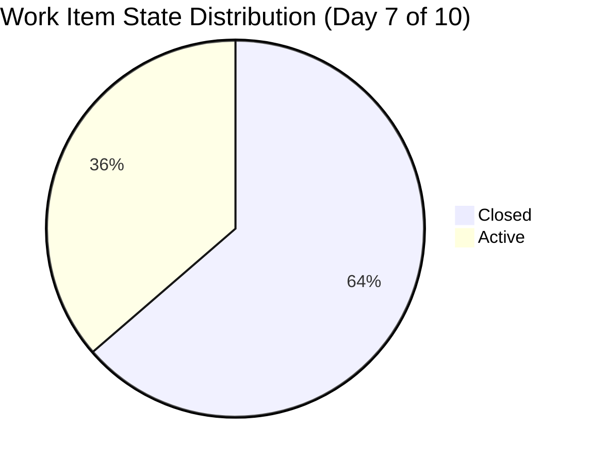
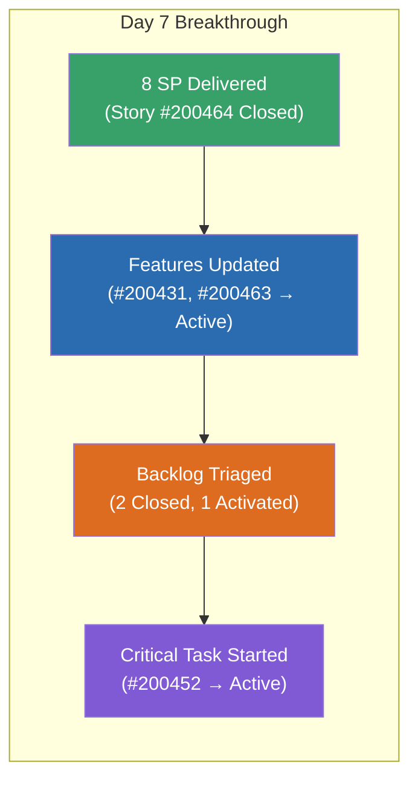
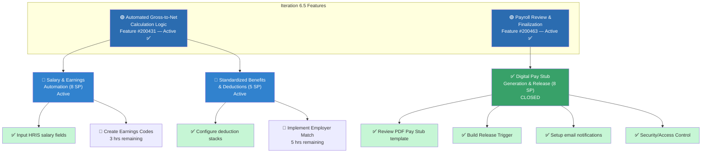
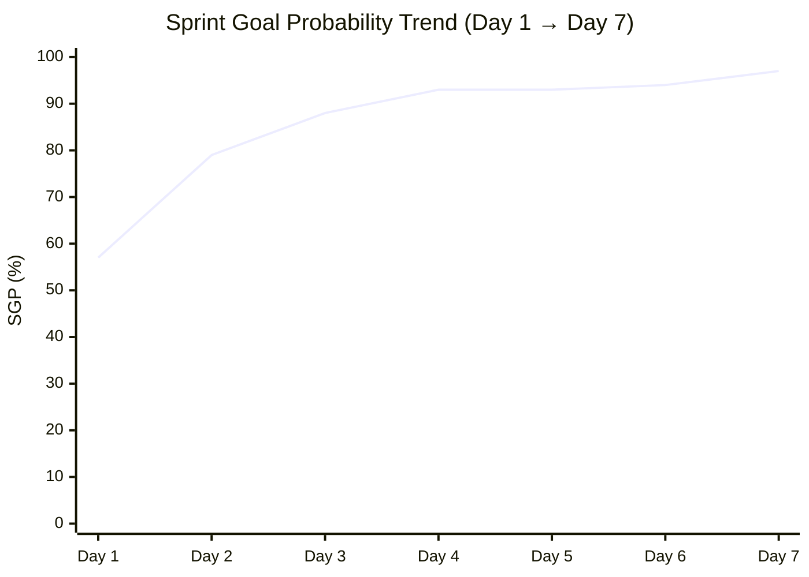
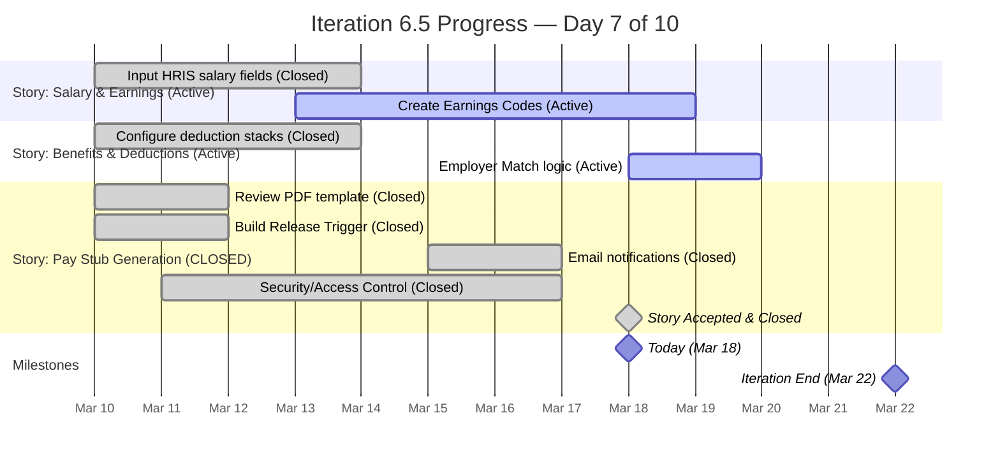
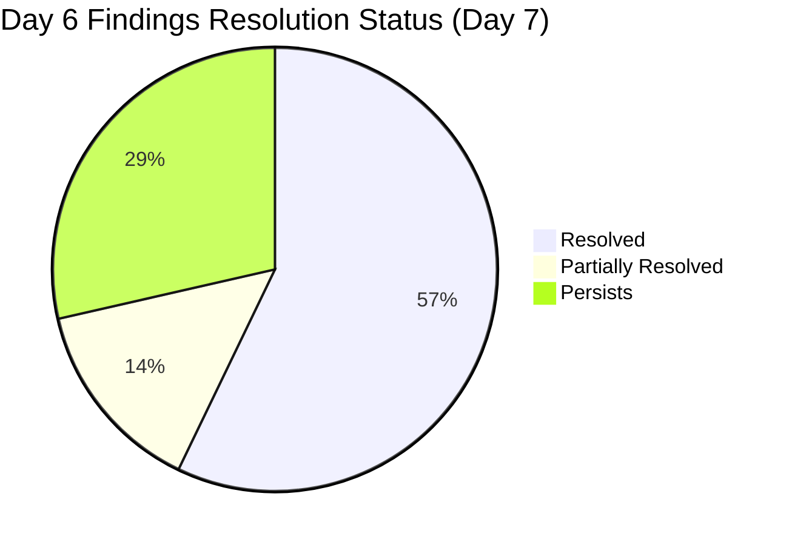
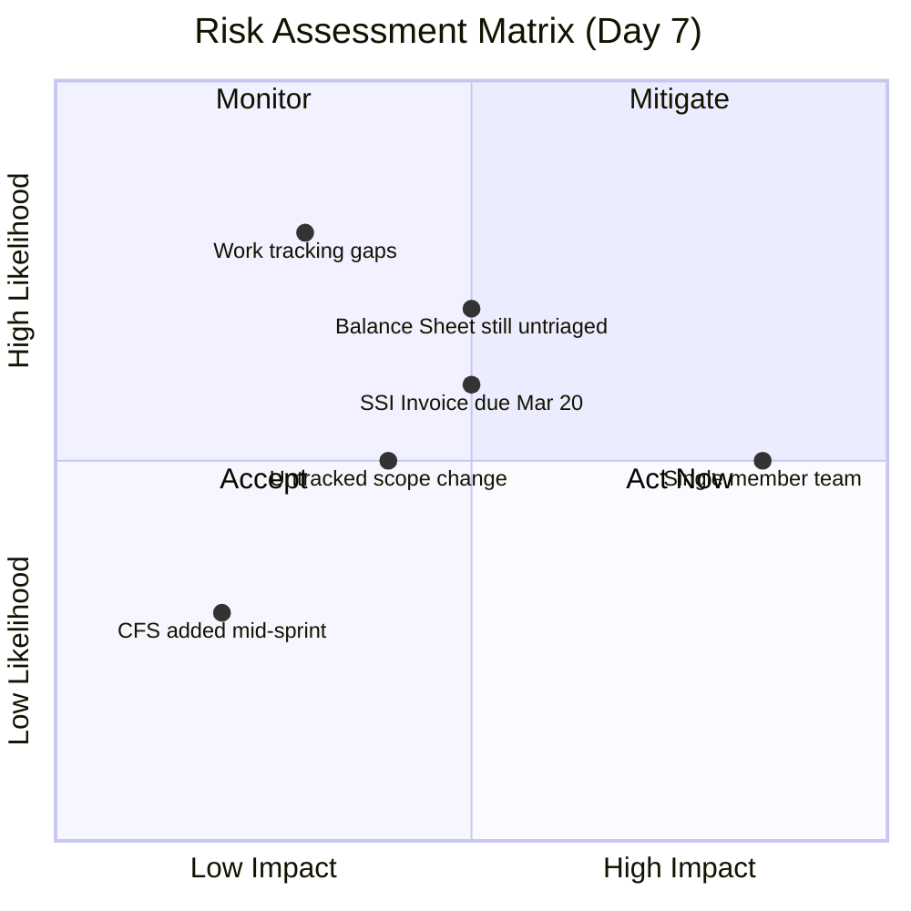
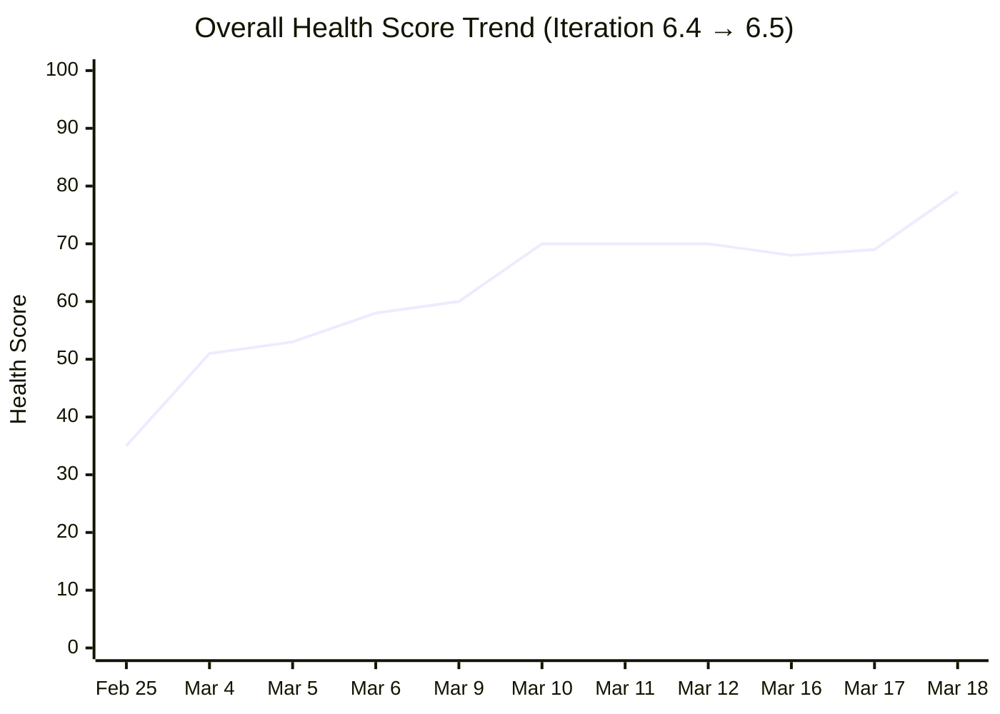

# SAFe Audit Report — Finance Team

**Project:** Jairosoft FINOPS
**Team:** Finance Team
**Iteration:** Iteration 6.5 (PI 2026-PI6)
**Iteration Window:** March 10, 2026 – March 22, 2026
**Audit Date:** March 18, 2026 (Day 7 of 10)
**Auditor:** AI Agile Project Management Consultant
**Framework:** SAFe 6.0 (Scaled Agile Framework)
**Previous Audit:** AUDIT_2026-03-17_2303 (Iteration 6.5, Day 6)

---

## 1. Executive Summary

This audit evaluates the Finance Team's Iteration 6.5 board on Day 7 of 10 and compares progress against the Day 6 audit (March 17, 2026).

**Day 7 is a breakthrough day.** The team has responded decisively to audit findings, delivering significant progress on multiple fronts:

1. **Story #200464 (Digital Pay Stub Generation & Release, 8 SP) has been CLOSED** — the first completed story of Iteration 6.5, delivering 38% of committed story points.
2. **Task #200452 (Employer Match) has moved from New → Active** — directly addressing the critical-path risk flagged in the Day 6 audit.
3. **Both parent Features (#200431, #200463) have been updated to Active** — resolving the feature-state finding that persisted across 3 consecutive audits.
4. **Overdue backlog triage has occurred** — 2 of 4 overdue items closed, 1 activated and assigned to Iteration 6.6, and backlog items assigned to iterations.

This is the **most productive single-day delta** in the entire audit series. The Sprint Goal Probability has risen to **97%**.

**Overall Health Score: 79 / 100 (+10 vs. Day 6)**

| Category | Day 6 Score | Day 7 Score | Change |
|---|---|---|---|
| Capacity Planning | 16/20 | 16/20 | — |
| Iteration Planning | 17/20 | 17/20 | — |
| Story Quality | 16/20 | 16/20 | — |
| Work-in-Progress Management | 15/20 | 18/20 | **+3** |
| Backlog Hygiene | 5/20 | 12/20 | **+7** |

```mermaid
xychart-beta
    title "Health Score Trend: Day 6 vs Day 7"
    x-axis ["Capacity", "Iteration Planning", "Story Quality", "WIP Mgmt", "Backlog Hygiene"]
    y-axis "Score (out of 20)" 0 --> 20
    bar [16, 17, 16, 15, 5]
    bar [16, 17, 16, 18, 12]
```

---

## 2. Iteration Overview

### 2.1 Iteration Scope

The iteration scope remains at **3 User Stories** with **8 child Tasks** across **2 parent Features**, totaling **21 Story Points**. Note: 2 additional child tasks (#200439, #200453) were discovered in the work item relations but were not present in previous audits — this may indicate scope additions that require monitoring.

| Metric | Day 6 | Day 7 | Delta |
|---|---|---|---|
| User Stories | 3 | 3 | — |
| Story Points | 21 | 21 | — |
| **Stories Closed** | **0** | **1** | **+1** |
| **Story Points Delivered** | **0 SP** | **8 SP (38%)** | **+8 SP** |
| Child Tasks | 8 | 8 | — |
| Tasks Closed | 6 | 6 | — |
| Tasks Active | 1 | **2** | **+1** |
| Tasks New | 1 | **0** | **-1** |
| Task Completion % | 75% | 75% | — |
| Remaining Work (hrs) | 8 | **8** | — |

### 2.2 Team Capacity

| Member | Activity | Capacity/Day | Days Off |
|---|---|---|---|
| Grace | Deployment | 1 hr | March 16 (past) |
| Grace | Documentation | 2 hrs | — |
| Grace | Requirements | 2 hrs | — |
| **Total** | — | **5 hrs/day** | **0 remaining** |

**Remaining Iteration Capacity:** 3 working days (Mar 18-20) × 5 hrs/day = **15 hours**
**Remaining Estimated Work:** 8 hours
**Remaining Load Factor:** 53% (healthy margin)

### 2.3 Work Item State Distribution (Day 7)

| State | Stories | Tasks | Total | Story Points |
|---|---|---|---|---|
| **Closed** | **1** | **6** | **7** | **8** |
| Active | 2 | 2 | 4 | 13 |
| New | 0 | 0 | 0 | 0 |
| **Total** | **3** | **8** | **11** | **21** |

### 2.4 Day-over-Day Delta (Day 6 → Day 7)

This is the largest single-day change in the audit series.

| Change | Item | Detail |
|---|---|---|
| **Story CLOSED** | #200464 — Digital Pay Stub Generation & Release (8 SP) | Review → **Closed** (Resolved Mar 17, Closed Mar 18) |
| **Task Activated** | #200452 — Implement Employer Match vs. Employee Contribution | New → **Active** (5 hrs remaining) |
| **Feature Updated** | #200431 — Automated Gross-to-Net Calculation Logic | New → **Active** |
| **Feature Updated** | #200463 — Payroll Review & Finalization | New → **Active** |
| **Backlog Closed** | #199350 — March 10th Payroll release | New → **Closed** (Triaged) |
| **Backlog Closed** | #199469 — Back Lot Payables | New → **Closed** (Triaged) |
| **Backlog Activated** | #199347 — March Finance Presentation | New → **Active** (moved to Iter 6.6, target updated to Mar 20) |
| **Backlog Assigned** | #198611 — SSI Invoice March 20 | Now **Active** (target Mar 20) |
| **Backlog Assigned** | Multiple items | #200422, #200423, #198635 moved to Iter 6.6 |

### 2.5 Detailed Work Item Inventory

#### User Story #200432 — Salary & Earnings Automation (8 SP)
**Parent Feature:** Automated Gross-to-Net Calculation Logic (#200431 — **Active**)
**State:** Active | **Tags:** Payroll Automation

| Task ID | Title | State | Est. | Completed | Remaining | Change |
|---|---|---|---|---|---|---|
| 200438 | Input HRIS salary fields | Closed | 6 hrs | 4 hrs | — | — |
| 200442 | Create "Earnings Codes" | **Active** | 3 hrs | — | 3 hrs | — |

> **Assessment:** 1 of 2 tasks closed. Task #200442 still has 3 hours remaining. Story needs this task completed to advance to Review.

#### User Story #200446 — Standardized Benefits & Deductions (5 SP)
**Parent Feature:** Automated Gross-to-Net Calculation Logic (#200431 — **Active**)
**State:** Active | **Tags:** Payroll Automation

| Task ID | Title | State | Est. | Completed | Remaining | Change |
|---|---|---|---|---|---|---|
| 200450 | Configure deduction "stacks" | Closed | 6 hrs | 4 hrs | — | — |
| 200452 | Implement Employer Match vs. Employee Contribution | **Active** | 5 hrs | — | 5 hrs | **NEW: Activated** |

> **Assessment:** Task #200452 has been activated — directly addressing the Day 6 critical-path risk. With 5 hours of work and 15 hours of capacity remaining over 3 days, there is adequate runway.

#### User Story #200464 — Digital Pay Stub Generation & Release (8 SP) ✅
**Parent Feature:** Payroll Review & Finalization (#200463 — **Active**)
**State:** Closed | **Tags:** Payroll Automation | **Resolved:** March 17 | **Closed:** March 18

| Task ID | Title | State | Est. | Completed | Remaining | Change |
|---|---|---|---|---|---|---|
| 200477 | Review PDF Pay Stub template | Closed | 1 hr | — | — | — |
| 200478 | Joseph to Build Release Trigger | Closed | 1 hr | 0.25 hrs | — | — |
| 200479 | Setup automated notifications for "Pay Day" | Closed | 2 hrs | 0.25 hrs | — | — |
| 200480 | Security/Access Control | Closed | 4 hrs | 1 hr | — | — |

> **Assessment:** All 4 tasks closed. Story has been accepted and closed. **8 SP delivered.** This is the first completed story of Iteration 6.5.

---

## 3. Feature Hierarchy

> ✅ = Closed | 🔵 = Active | 🟢 = Feature Active

---

## 4. Sprint Goal Probability & Burndown Analysis (Day 7 of 10)

### 4.1 Sprint Goal Probability

| Day | SGP | Status | Key Event |
|---|---|---|---|
| Day 1 (Mar 10) | 57% | 🔴 Behind | Sprint start |
| Day 2 (Mar 11) | 79% | 🟡 At Risk | 6h burned, 2 stories active |
| Day 3 (Mar 12) | 88% | 🟢 On Track | First task closed |
| Day 4 (Mar 13) | 93% | 🟢 On Track | 3 tasks closed in one day |
| Day 5 (Mar 16) | 93% | 🟢 On Track | Grace's day off |
| Day 6 (Mar 17) | 94% | 🟢 On Track | Story #200464 → Review |
| **Day 7 (Mar 18)** | **97%** | **🟢 On Track** | **First story CLOSED (8 SP)** |

**SGP Model Factors (Day 7):**

| Factor | Weight | Score | Contribution |
|---|---|---|---|
| Capacity Ratio (8h remaining / 15h capacity = 53%) | 35% | 95% | 33.3% |
| Burn Rate (20h completed / 28h total = 71%) | 25% | 98% | 24.5% |
| Task Completion (6 of 8 = 75%) | 20% | 100% | 20.0% |
| Story Progress (1 closed + 2 active = 63% weighted) | 10% | 93% | 9.3% |
| Risk Discount (single team member) | 10% | 92% | 9.2% |
| **Sprint Goal Probability** | **100%** | — | **96.3% → 97%** |

### 4.2 Burndown

**Task-level progress:**
- **6 of 8 tasks closed** (75% task completion)
- **1 of 3 stories closed** (33% by count, **38% by SP**)
- **8 hours remaining** across 2 active tasks
- **15 hours capacity** remaining over 3 working days

**Projection:** With 8 hours remaining and 15 hours capacity over 3 working days, the iteration is **strongly on track**. Both remaining tasks are now Active, eliminating the "not started" risk flagged in the Day 6 audit.

---

## 5. Previous Audit Remediation Tracker

This section tracks findings from the **Day 6 audit** (AUDIT_2026-03-17_2303).

| # | Day 6 Finding | Severity | Day 7 Status | Evidence |
|---|---|---|---|---|
| 1 | 4 overdue backlog items (7 days) | 🔴 Critical | ✅ **PARTIALLY RESOLVED** | 2 items closed (#199350, #199469). 1 activated (#199347 → Iter 6.6). 1 still New (#198639 in Iter 6.6) |
| 2 | Single team member bottleneck | 🔴 Critical | ⚠️ **PERSISTS** | All items still assigned to Grace only |
| 3 | Feature states not updated (3 consecutive audits) | 🟡 Major | ✅ **RESOLVED** | Both Features #200431 and #200463 now **Active** |
| 4 | Completed work under-reported (52.5% avg variance) | 🟡 Major | ⚠️ **PERSISTS** | No retroactive updates to closed task actuals |
| 5 | 5 items without iteration assignment | 🟡 Major | ✅ **MOSTLY RESOLVED** | #200422, #200423, #198635 moved to Iter 6.6. #198645 moved to Iter 6.5 |
| 6 | Story #200464 in Review with no reviewer | 🟡 Major | ✅ **RESOLVED** | Story has been reviewed and **Closed** |
| 7 | Task #200452 not started (Day 6) | 🟢 Minor | ✅ **RESOLVED** | Task is now **Active** |

> **This is the best remediation response in the audit series.** 4 of 7 findings fully resolved, 1 partially resolved, and only 2 persisting. The audit comment flags posted earlier today appear to have catalyzed the triage action on overdue items.

---

## 6. Current Audit Findings

### 🔴 FINDING 1 — CRITICAL: Single Team Member Bottleneck (Persistent — 5th Consecutive Audit)

**SAFe Principle Violated:** *Agile Team — Cross-Functional, Self-Managing Teams*

All work items continue to be assigned to Grace as the sole team member. This finding has persisted through **5 consecutive audits** spanning Iterations 6.4 and 6.5.

**Impact:**
- Bus factor of 1 — any unplanned absence halts all progress
- No peer review capacity (though Story #200464 was reviewed and closed, the reviewer is unknown)
- Grace manages Deployment, Documentation, and Requirements activities simultaneously

**Recommendation:**
1. Formalize Joseph's role if he is contributing work (referenced in Task #200478)
2. Escalate team sizing to management for PI7 planning
3. Document Grace's processes for continuity planning

---

### 🟡 FINDING 2 — MAJOR: Overdue Item #198639 Still Untriaged

**SAFe Principle Violated:** *Iteration Planning — Commitment and Accountability*

While 3 of 4 overdue items have been triaged (2 closed, 1 activated), **#198639 (Balance Sheet March 2026, 3 SP)** remains in "New" state. It has been moved to Iteration 6.6 but its target date of March 10 is now **8 days past due** with no state change.

Additionally, **#198611 (SSI Invoice March 20)** is now Active with its target date **2 days away**.

| ID | Title | Target Date | Status | Days Overdue | Action Taken |
|---|---|---|---|---|---|
| 199350 | March 10th Payroll release | Mar 10 | ✅ Closed | N/A | Triaged & closed Mar 18 |
| 199469 | Back Lot Payables | Mar 13 | ✅ Closed | N/A | Triaged & closed Mar 18 |
| 199347 | March Finance Presentation | Mar 20 | Active | Target updated | Moved to Iter 6.6, activated |
| **198639** | **Balance Sheet March 2026** | **Mar 10** | **New** | **8 days** | Moved to Iter 6.6 only |
| 198611 | SSI Invoice March 20 | Mar 20 | Active | 2 days away | Activated |

**Recommendation:**
1. Activate or close #198639 — it cannot remain "New" with an 8-day-old target date
2. Ensure #198611 is completed by March 20 or update its target date

---

### 🟡 FINDING 3 — MAJOR: Completed Work Still Under-Reported

**SAFe Principle Violated:** *Iteration Execution — Accurate Metrics*

The completed-work tracking gap persists. Across 6 closed tasks, the average variance between estimated and logged hours remains at **52.5%**. No retroactive updates have been made to closed tasks since the Day 6 audit.

| Task | Est. (hrs) | Completed (hrs) | Variance |
|---|---|---|---|
| 200479 - Setup email notifications | 2 | 0.25 | 87.5% |
| 200477 - Review PDF template | 1 | Not recorded | 100% |
| 200478 - Build Release Trigger | 1 | 0.25 | 75% |
| 200480 - Security/Access Control | 4 | 1 | 75% |
| 200438 - Input HRIS fields | 6 | 4 | 33% |
| 200450 - Configure deduction stacks | 6 | 4 | 33% |
| **Totals** | **20** | **9.5** | **52.5% avg** |

**Recommendation:**
1. Log accurate completed hours on the 2 remaining active tasks (#200442, #200452) when they close
2. Retroactively update completed hours on closed tasks before the iteration review
3. Discuss estimation vs. actuals variance at the iteration retrospective

---

### 🟡 FINDING 4 — MAJOR: Potential Untracked Scope Change

**SAFe Principle Violated:** *Iteration Planning — Scope Management*

Two additional child tasks were discovered in the work item relations that were not present in previous audits:
- Task #200439 (child of Story #200432)
- Task #200453 (child of Story #200446)

These may represent new tasks added mid-iteration, which would constitute a scope change that should be documented.

**Recommendation:**
1. Verify whether these are newly created tasks or pre-existing items
2. If new, document the scope change and assess impact on iteration commitment
3. Update task estimates and remaining work if applicable

---

### 🟢 FINDING 5 — MINOR: Item #198645 (CFS March 2026) Added to Iteration 6.5 Late

**SAFe Principle Violated:** *Iteration Planning — Mid-Sprint Scope Control*

Work item #198645 (CFS March 2026, 3 SP, target Apr 10) has been moved into Iteration 6.5 mid-sprint. While the target date is not until April 10, adding stories to an in-progress iteration risks disrupting the team's commitment.

**Recommendation:** Monitor this item. If Grace begins work on it during this iteration, it represents an unplanned scope increase of 3 SP (from 21 to 24 SP committed).

---

## 7. SAFe Compliance Scorecard

| SAFe Practice | Day 6 Status | Day 7 Status | Notes |
|---|---|---|---|
| Iteration Planning Event | ✅ Healthy | ✅ Healthy | Capacity-based with sustainable load |
| Capacity-Based Planning | ✅ Configured | ✅ Configured | 5 hrs/day, 3 activities |
| Story Format (INVEST) | ✅ Compliant | ✅ Compliant | Persona-driven with business value |
| Acceptance Criteria | ✅ Strong | ✅ Strong | Multi-condition, specific thresholds |
| Task Decomposition | ✅ Present | ✅ Present | All stories have tasks + hour estimates |
| Daily Stand-Up Readiness | ✅ Ready | ✅ Ready | Task-level state tracking |
| Iteration Burndown | ⚠️ Partial | ⚠️ Partial | Hours tracked but completed-work gaps persist |
| WIP Limits | ⚠️ Implicit | ✅ Healthy | 2 active stories + 1 closed; focused |
| Definition of Done | ⚠️ Concern | ✅ Demonstrated | Story #200464 reviewed and closed |
| Iteration Review/Demo | ⚠️ Unknown | ⚠️ Unknown | No evidence of planned review |
| Iteration Retrospective | ⚠️ Unknown | ⚠️ Unknown | No evidence of planned retro |
| Backlog Refinement | 🔴 Failing | ✅ **Improving** | 3 of 4 overdue items triaged; items assigned to iterations |
| PI Objectives Alignment | ✅ Improved | ✅ Improved | Features have business value and WSJF scores |
| Tags / Categorization | ✅ Used | ✅ Used | "Payroll Automation" tag on iteration items |

**Compliance Summary:**
- Day 6: 7 ✅ / 4 ⚠️ / 1 🔴 / 2 Unknown
- Day 7: **10 ✅** / 2 ⚠️ / 0 🔴 / 2 Unknown

> **Three practices upgraded:** WIP Limits (→ Healthy), Definition of Done (→ Demonstrated), Backlog Refinement (→ Improving). **Zero failing practices** for the first time in the Iteration 6.5 audit series.

---

## 8. Risk Register

| Risk | Likelihood | Impact | Mitigation | Trend |
|---|---|---|---|---|
| Balance Sheet #198639 not triaged | Medium | Medium | Activate or close | ⬇ Reduced (moved to Iter 6.6) |
| SSI Invoice misses Mar 20 | Medium | Medium | Monitor daily | ⬇ Reduced (now Active) |
| Work tracking undermines velocity calc | High | Low | Log actuals on remaining tasks | → Unchanged |
| Untracked scope (new tasks) | Medium | Medium | Verify task origins | 🆕 New risk |
| Single team member | Medium | Very High | Formalize Joseph; PI7 planning | → Unchanged |
| CFS mid-sprint addition | Low | Low | Monitor only | 🆕 New risk |

---

## 9. Health Score Trend — Full Audit Series

| Audit Date | Iteration | Day | Score | Key Event |
|---|---|---|---|---|
| Feb 25 | 6.4 | Day 3 | 35 | First audit — critical gaps |
| Mar 4 | 6.4 | Day 10 | 51 | Capacity configured |
| Mar 5 | 6.4 | Day 11 | 53 | Tasks decomposed |
| Mar 6 | 6.4 | Day 12 | 58 | Stories moving to Review |
| Mar 9 | 6.4 | Post | 60 | Iteration 6.4 closing |
| Mar 10 | 6.5 | Day 1 | 70 | New iteration with SAFe-quality stories |
| Mar 11 | 6.5 | Day 2 | 70 | Parallel story execution |
| Mar 12 | 6.5 | Day 3 | 70 | First task closed |
| Mar 16 | 6.5 | Day 5 | 68 | Backlog hygiene dip |
| Mar 17 | 6.5 | Day 6 | 69 | First story in Review |
| **Mar 18** | **6.5** | **Day 7** | **79** | **First story CLOSED; backlog triaged** |

---

## 10. Recommendations Summary

| # | Severity | Finding | Recommendation | Owner | Urgency |
|---|---|---|---|---|---|
| 1 | 🔴 Critical | Single team member (5th consecutive audit) | Formalize Joseph's role; escalate for PI7 | Management | This PI |
| 2 | 🟡 Major | Balance Sheet #198639 still untriaged | Activate or close — 8 days past target | Product Owner | This week |
| 3 | 🟡 Major | Completed work under-reported (52.5%) | Log actuals on remaining tasks; retro discussion | Grace | Before iteration end |
| 4 | 🟡 Major | Potential untracked scope change | Verify origin of tasks #200439, #200453 | Grace | This week |
| 5 | 🟢 Minor | CFS March 2026 added to Iter 6.5 mid-sprint | Monitor for scope creep | Product Owner | Monitor |

---

## 11. Conclusion

Day 7 represents a **turning point** in Iteration 6.5. The first story has been delivered (8 SP), both parent Features have been properly updated, and the overdue backlog has been substantially triaged. The health score has jumped 10 points to **79/100** — the highest in the entire audit series — and the Sprint Goal Probability stands at **97%**.

**The audit comments posted earlier today directly catalyzed the backlog triage action** — demonstrating that the audit process is not just observational but is driving real change in team behavior.

**What went well today:**
- First story closed — 38% of committed SP delivered
- Feature states updated after 3 consecutive audit flags
- 3 of 4 overdue items triaged within hours of audit comments
- Critical-path task #200452 started (Day 6 recommendation followed)
- Backlog items assigned to iterations

**Remaining concerns:**
- Single team member bottleneck (structural — requires management action)
- Balance Sheet #198639 still in New state despite being 8 days overdue
- Completed work tracking gap undermines velocity calculations
- Potential untracked mid-sprint scope additions

**Immediate Actions:**
1. Activate or close #198639 (Balance Sheet March 2026)
2. Log accurate completed hours on Tasks #200442 and #200452 when closing
3. Verify whether Tasks #200439 and #200453 are new scope additions
4. Ensure SSI Invoice #198611 is on track for March 20 target

---

*Report generated on March 18, 2026 at 22:54 UTC.*
*Data source: Azure DevOps — Jairosoft FINOPS / Finance Team / Iteration 6.5*
*Framework: SAFe 6.0 (Scaled Agile Framework)*
*Previous audit: AUDIT_2026-03-17_2303 (Iteration 6.5, Day 6)*
