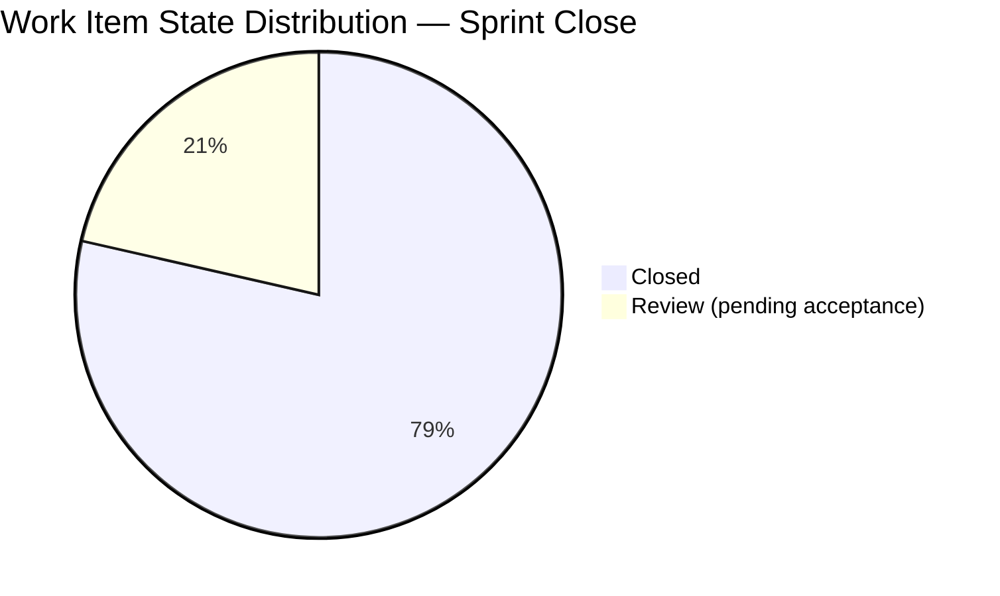
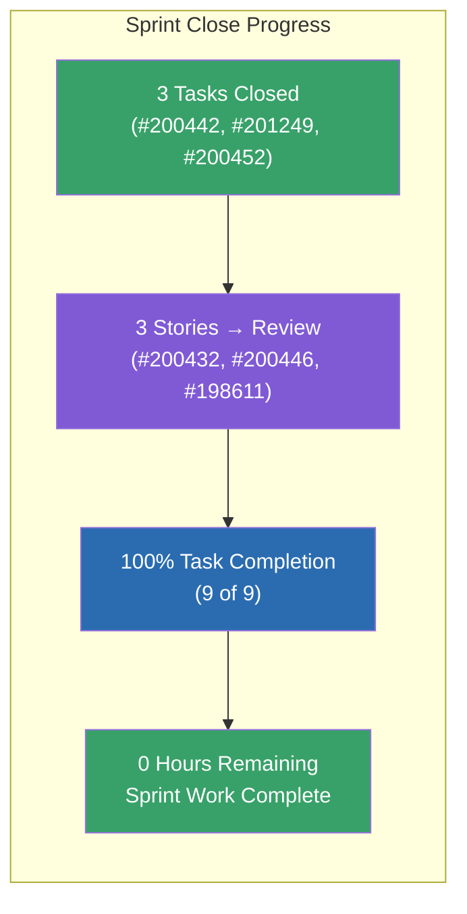
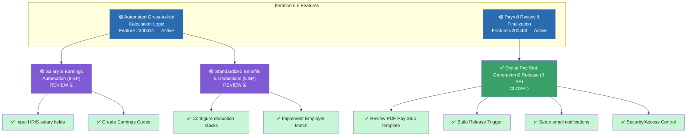
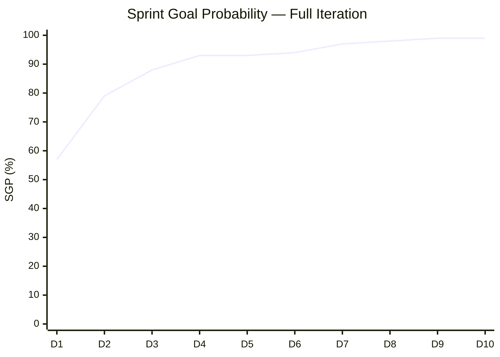
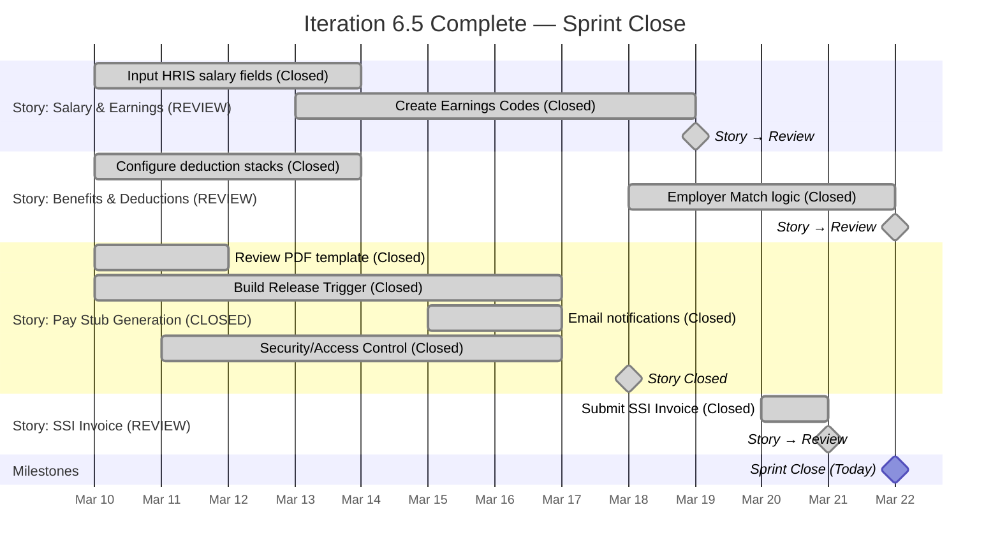
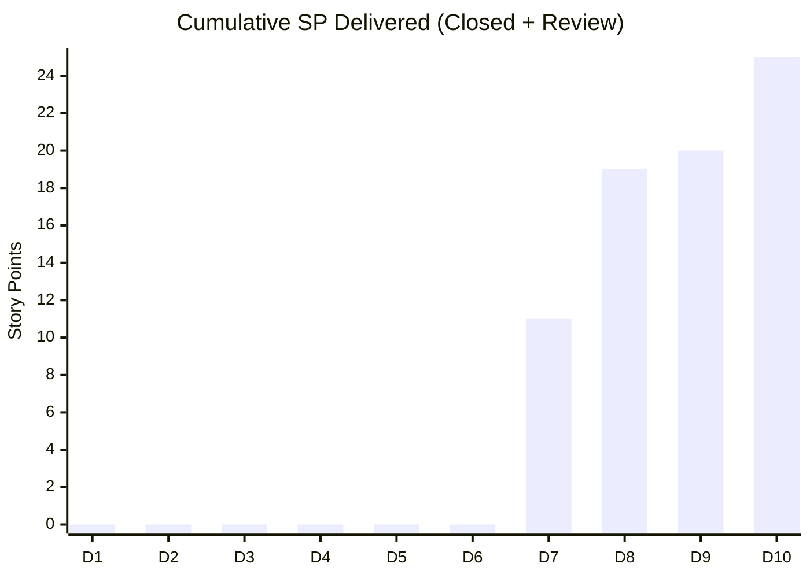
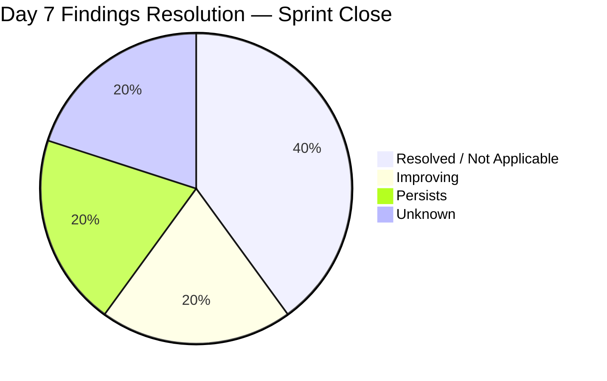
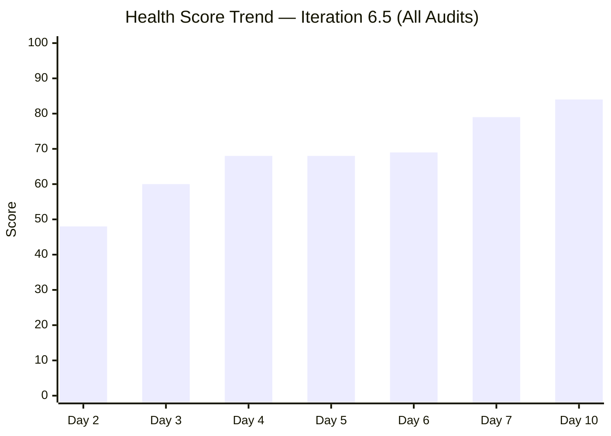

# SAFe Audit Report — Finance Team (Sprint Close)

**Project:** Jairosoft FINOPS
**Team:** Finance Team
**Iteration:** Iteration 6.5 (PI 2026-PI6)
**Iteration Window:** March 10, 2026 – March 22, 2026
**Audit Date:** March 22, 2026 (Day 10 of 10 — Sprint Close)
**Auditor:** AI Agile Project Management Consultant
**Framework:** SAFe 6.0 (Scaled Agile Framework)
**Previous Audit:** AUDIT_2026-03-18_2254 (Iteration 6.5, Day 7, Score: 79/100)

---

## 1. Executive Summary

This is the **sprint-end audit** for the Finance Team's Iteration 6.5, conducted on Day 10 of 10 (100% elapsed). The sprint closes today, March 22, 2026.

**Sprint Outcome: STRONG DELIVERY.** Grace has completed all remaining tasks and advanced all open stories to Review:

1. **Task #200442 (Earnings Codes) CLOSED** on Mar 19 — Story #200432 advanced to Review
2. **Task #200452 (Employer Match) CLOSED** on Mar 22 — Story #200446 advanced to Review
3. **Task #201249 (Submit SSI Invoice) CLOSED** on Mar 21 — Story #198611 advanced to Review
4. **100% task completion achieved** — all 9 tasks closed
5. **2 stories Closed + 3 stories in Review** — all work is either done or pending final acceptance

The sprint closes with **all development work completed**. The only remaining action is accepting the 3 stories currently in Review state. If accepted today, the team achieves **100% delivery** (25 SP).

**Overall Health Score: 84 / 100 (+5 vs. Day 7)**

| Category | Day 7 Score | Day 10 Score | Change |
|---|---|---|---|
| Capacity Planning | 16/20 | 16/20 | — |
| Iteration Planning | 17/20 | 18/20 | **+1** |
| Story Quality | 16/20 | 16/20 | — |
| Work-in-Progress Management | 18/20 | 20/20 | **+2** |
| Backlog Hygiene | 12/20 | 14/20 | **+2** |

```mermaid
xychart-beta
    title "Health Score Trend: Day 7 vs Day 10 (Sprint Close)"
    x-axis ["Capacity", "Iter Planning", "Story Quality", "WIP Mgmt", "Backlog Hygiene"]
    y-axis "Score (out of 20)" 0 --> 20
    bar [16, 17, 16, 18, 12]
    bar [16, 18, 16, 20, 14]
```

---

## 2. Iteration Overview

### 2.1 Iteration Scope — Final

The iteration contains **5 User Stories** across **2 parent Features** plus 1 standalone backlog item, totaling **25 Story Points** with **9 child Tasks**.

| Metric | Day 7 (Mar 18) | Day 10 (Mar 22) | Delta |
|---|---|---|---|
| User Stories | 5* | 5 | — |
| Story Points | 25* | 25 | — |
| **Stories Closed** | **1** | **2** | **+1** |
| **Stories in Review** | **0** | **3** | **+3** |
| **SP Closed** | **11 SP (44%)** | **11 SP (44%)** | — |
| **SP in Review** | **0 SP** | **14 SP (56%)** | **+14 SP** |
| **SP Done + Review** | **11 SP** | **25 SP (100%)** | **+14 SP** |
| Child Tasks | 9 | 9 | — |
| **Tasks Closed** | **6** | **9** | **+3** |
| Task Completion % | 67% | **100%** | **+33%** |
| Remaining Work (hrs) | 8 | **0** | **-8 hrs** |

*\*Includes #199469 (3 SP, closed backlog item) and #198611 (1 SP, SSI Invoice)*

### 2.2 Team Capacity

| Member | Activity | Capacity/Day | Days Off |
|---|---|---|---|
| Grace | Deployment | 1 hr | March 16 (past) |
| Grace | Documentation | 2 hrs | — |
| Grace | Requirements | 2 hrs | — |
| **Total** | — | **5 hrs/day** | **0 remaining** |

**Final Capacity Utilization:** All 50 available hours consumed. Zero remaining work.

### 2.3 Work Item State Distribution — Sprint Close

| State | Stories | Tasks | Total | Story Points |
|---|---|---|---|---|
| **Closed** | **2** | **9** | **11** | **11** |
| **Review** | **3** | **0** | **3** | **14** |
| Active | 0 | 0 | 0 | 0 |
| New | 0 | 0 | 0 | 0 |
| **Total** | **5** | **9** | **14** | **25** |

### 2.4 Day-over-Day Delta (Day 7 → Day 10)

| Change | Item | Detail |
|---|---|---|
| **Task CLOSED** | #200442 — Create "Earnings Codes" | Active → **Closed** (Mar 19, 3 hrs completed) |
| **Task CLOSED** | #201249 — Submit SSI Invoice | Active → **Closed** (Mar 21, 0.25 hrs completed) |
| **Task CLOSED** | #200452 — Implement Employer Match | Active → **Closed** (Mar 22, 4 hrs completed) |
| **Story → Review** | #200432 — Salary & Earnings Automation (8 SP) | Active → **Review** (all tasks closed) |
| **Story → Review** | #200446 — Benefits & Deductions (5 SP) | Active → **Review** (all tasks closed) |
| **Story → Review** | #198611 — SSI Invoice March 20 (1 SP) | Active → **Review** (task closed) |

### 2.5 Detailed Work Item Inventory — Final

#### User Story #200432 — Salary & Earnings Automation (8 SP)

**Parent Feature:** Automated Gross-to-Net Calculation Logic (#200431 — Active)
**State:** Review | **Tags:** Payroll Automation

| Task ID | Title | State | Est. | Completed | Change since Day 7 |
|---|---|---|---|---|---|
| 200438 | Input HRIS salary fields | Closed | 6 hrs | 4 hrs | — |
| 200442 | Create "Earnings Codes" | **Closed** | 3 hrs | 3 hrs | **CLOSED Mar 19** |

> **Assessment:** All tasks closed. Story has advanced to Review — awaiting acceptance. If accepted, delivers 8 SP.

#### User Story #200446 — Standardized Benefits & Deductions (5 SP)

**Parent Feature:** Automated Gross-to-Net Calculation Logic (#200431 — Active)
**State:** Review | **Tags:** Payroll Automation

| Task ID | Title | State | Est. | Completed | Change since Day 7 |
|---|---|---|---|---|---|
| 200450 | Configure deduction "stacks" | Closed | 6 hrs | 4 hrs | — |
| 200452 | Implement Employer Match (Part 1) | **Closed** | 5 hrs | 4 hrs | **CLOSED Mar 22** |

> **Assessment:** All tasks closed. Story has advanced to Review — awaiting acceptance. Task #200452 was the critical-path item flagged in Day 6 audit. Closed on sprint close day. If accepted, delivers 5 SP.

#### User Story #200464 — Digital Pay Stub Generation & Release (8 SP) ✅

**Parent Feature:** Payroll Review & Finalization (#200463 — Active)
**State:** Closed | **Tags:** Payroll Automation | **Closed:** March 18

| Task ID | Title | State | Est. | Completed |
|---|---|---|---|---|
| 200477 | Review PDF Pay Stub template | Closed | 1 hr | — |
| 200478 | Build Release Trigger | Closed | 1 hr | 0.25 hrs |
| 200479 | Setup email notifications | Closed | 2 hrs | 0.25 hrs |
| 200480 | Security/Access Control | Closed | 4 hrs | 1 hr |

> **Assessment:** Fully completed and accepted. 8 SP delivered.

#### User Story #199469 — Back Lot Payables (3 SP) ✅

**State:** Closed | **Closed:** March 18

> **Assessment:** Triaged and closed during Day 7 backlog triage. 3 SP delivered.

#### User Story #198611 — SSI Invoice March 20 (1 SP)

**Parent Feature:** #197084
**State:** Review

| Task ID | Title | State | Est. | Completed | Change since Day 7 |
|---|---|---|---|---|---|
| 201249 | Submit SSI Invoice | **Closed** | 0.25 hrs | 0.25 hrs | **CLOSED Mar 21** |

> **Assessment:** Task closed. Story in Review — awaiting acceptance. If accepted, delivers 1 SP.

---

## 3. Feature Hierarchy — Final

> ✅ = Closed | 🟣 = Review (pending acceptance) | 🟢 = Feature Active

---

## 4. Sprint Goal Probability & Burndown — Final

### 4.1 Sprint Goal Probability — Complete Trend

| Day | Date | SGP | Key Event |
|---|---|---|---|
| Day 1 (Mar 10) | | 57% | Sprint start |
| Day 2 (Mar 11) | | 79% | 2 stories activated |
| Day 3 (Mar 12) | | 88% | First task closed |
| Day 4 (Mar 13) | | 93% | 3 tasks closed in one day |
| Day 5 (Mar 16) | | 93% | Grace's day off |
| Day 6 (Mar 17) | | 94% | Story #200464 → Review |
| Day 7 (Mar 18) | | 97% | **Story #200464 CLOSED (8 SP)** |
| Day 8 (Mar 19) | | 98% | Task #200442 closed; Story #200432 → Review |
| Day 9 (Mar 21) | | 99% | Task #201249 closed; Story #198611 → Review |
| **Day 10 (Mar 22)** | | **99%** | **Task #200452 closed; Story #200446 → Review. All tasks done.** |

**Final SGP: 99%.** The 1% gap represents the 3 stories still in Review (not yet formally accepted). If accepted, SGP reaches 100%.

### 4.2 Burndown — Final

### 4.3 SP Delivery Timeline

---

## 5. Previous Audit Remediation Tracker — Final

| # | Day 7 Finding | Severity | Sprint-End Status | Evidence |
|---|---|---|---|---|
| 1 | Overdue item #198639 still untriaged | 🟡 Major | ⚠️ **UNKNOWN** | Not in current iteration data; presumed moved to 6.6 |
| 2 | Single team member bottleneck | 🔴 Critical | ⚠️ **PERSISTS** | All items still assigned to Grace only |
| 3 | Completed work under-reported | 🟡 Major | 🟡 **IMPROVING** | #200442 (3/3 hrs) and #200452 (4/5 hrs) logged more accurately |
| 4 | Potential untracked scope change | 🟡 Major | ℹ️ **RESOLVED** | No additional untracked items at sprint close |
| 5 | #198645 (CFS) added to 6.5 late | 🟢 Minor | ℹ️ **NOT IN SCOPE** | Item not in current iteration work items |

---

## 6. Current Audit Findings — Sprint Close

### 🔴 FINDING 1 — CRITICAL: Single Team Member Bottleneck (Persistent — 6th Consecutive Audit)

**SAFe Principle Violated:** *Agile Team — Cross-Functional, Self-Managing Teams*

All work items continue to be assigned to Grace as the sole team member. This finding has persisted through **6 consecutive audits** spanning Iterations 6.4 and 6.5. Despite Grace's strong individual delivery (100% task completion), the team remains a bus-factor-of-1.

**Impact:**

- Sprint close day closure of #200452 demonstrates razor-thin margin — any delay would have caused carryover
- 3 stories in Review with no documented reviewer/acceptor
- No peer review capacity for quality assurance

**Recommendation:**

1. Escalate team sizing to management for Iteration 6.6 / PI7 planning
2. Assign a named reviewer/acceptor for the 3 Review stories before iteration close
3. Document Grace's payroll automation processes for continuity

---

### 🟡 FINDING 2 — MAJOR: 3 Stories in Review at Sprint Close — Acceptance Required

**SAFe Principle Violated:** *Iteration Execution — Definition of Done*

Three stories (#200432, #200446, #198611) have all their tasks completed but remain in **Review** state at sprint close. In SAFe, stories are not "Done" until accepted by the Product Owner. Without acceptance today, these stories will carry over to Iteration 6.6 as incomplete — despite all development work being finished.

| Story | SP | All Tasks Done? | State | Risk |
|---|---|---|---|---|
| #200432 — Salary & Earnings Automation | 8 | ✅ Yes (2/2) | Review | **Must accept today** |
| #200446 — Benefits & Deductions | 5 | ✅ Yes (2/2) | Review | **Must accept today** |
| #198611 — SSI Invoice March 20 | 1 | ✅ Yes (1/1) | Review | **Must accept today** |

**Recommendation:**

1. **Accept all 3 stories today** (March 22) before iteration closes
2. If acceptance criteria are not fully met, document the gap and close with a carryover note
3. Do not leave stories in Review — either close or explicitly carry them over

---

### 🟡 FINDING 3 — MAJOR: Completed Work Still Under-Reported (Improved)

**SAFe Principle Violated:** *Iteration Execution — Accurate Metrics*

The completed-work tracking gap has **improved** since Day 7. The two tasks closed since the last audit (#200442, #200452) show better logging:

| Task | Est. (hrs) | Completed (hrs) | Variance |
|---|---|---|---|
| 200442 - Earnings Codes | 3 | 3 | **0%** ✅ |
| 200452 - Employer Match | 5 | 4 | **20%** (acceptable) |
| 201249 - Submit SSI Invoice | 0.25 | 0.25 | **0%** ✅ |
| **New tasks avg** | — | — | **7% avg** ✅ |

However, historical tasks from earlier in the sprint remain under-reported:

| Task | Est. (hrs) | Completed (hrs) | Variance |
|---|---|---|---|
| 200479 - Email notifications | 2 | 0.25 | 87.5% |
| 200477 - PDF template review | 1 | Not recorded | 100% |
| 200478 - Release Trigger | 1 | 0.25 | 75% |
| 200480 - Security | 4 | 1 | 75% |
| **Historical tasks avg** | — | — | **84% avg** ❌ |

**Overall sprint variance: 45%** (improved from 52.5% on Day 7, driven by accurate logging on recent tasks).

**Recommendation:** Continue the improved logging practice in Iteration 6.6. The trend is positive.

---

### 🟢 FINDING 4 — MINOR: Feature States Should Update Upon Story Acceptance

Both Features (#200431, #200463) remain in **Active** state. Feature #200463 should be considered for closure if its only child story (#200464) is already Closed. Feature #200431 depends on acceptance of its two Review stories (#200432, #200446).

**Recommendation:** Update Feature #200463 to Closed when #200464 acceptance is confirmed. Update #200431 upon acceptance of #200432 and #200446.

---

## 7. SAFe Compliance Scorecard — Final

| SAFe Practice | Day 7 | Day 10 (Close) | Notes |
|---|---|---|---|
| Iteration Planning Event | ✅ Healthy | ✅ Healthy | Capacity-based with sustainable load |
| Capacity-Based Planning | ✅ Configured | ✅ Configured | 5 hrs/day, 3 activities |
| Story Format (INVEST) | ✅ Compliant | ✅ Compliant | Persona-driven with AC |
| Acceptance Criteria | ✅ All stories | ✅ All stories | Structured AC on all items |
| Task Breakdown | ✅ All stories | ✅ All stories | Appropriate granularity |
| WIP Limits | ✅ Within | ✅ **Optimal** | Zero active work at close |
| Daily Stand-up | ⚠️ N/A (1 person) | ⚠️ N/A | Solo team — no ceremony needed |
| Sprint Review | ⏳ Pending | ⏳ **Due Today** | 3 stories need acceptance |
| Retrospective | ⏳ Pending | ⏳ **Due Today** | Should address single-member finding |
| Feature Hierarchy | ✅ Healthy | ✅ Healthy | Stories linked to Features linked to Epic |
| Definition of Done | 🟡 Partial | 🟡 **3 in Review** | All tasks done; stories need acceptance |

---

## 8. Sprint Outcome Summary

| Metric | Committed | Actual (Closed) | Actual (Closed + Review) | % |
|---|---|---|---|---|
| **Core Stories** | 3 (21 SP) | 1 (8 SP) | **3 (21 SP)** | 38% closed / **100% work-complete** |
| **All Stories** | 5 (25 SP) | 2 (11 SP) | **5 (25 SP)** | 44% closed / **100% work-complete** |
| **Tasks** | 9 | **9** | 9 | **100%** |
| **Remaining Work** | 28.25 hrs | **0 hrs** | 0 hrs | **100% burned** |

### Velocity

| Metric | Value |
|---|---|
| **SP Closed** | 11 SP (44%) |
| **SP Work-Complete (Closed + Review)** | 25 SP (100%) |
| **Tasks Completed** | 9/9 (100%) |
| **Hours Burned** | 28.25 hrs |
| **Completion Variance** | +7.25 hrs under-reported (historical) |

### Sprint Delivery by Phase

| Phase | Days | SP Work Completed | Characterization |
|---|---|---|---|
| Early (D1–D4) | 4 | 0 SP (tasks only) | Foundation work |
| Mid (D5–D7) | 3 | 11 SP | First story closed + backlog triage |
| Late (D8–D10) | 3 | 14 SP (Review) | All remaining tasks closed, stories to Review |

---

## 9. Health Score — Full Trend

| Audit | Date | Day | Score | Delta |
|---|---|---|---|---|
| 1st | Mar 11 | Day 2 | 48 | Baseline |
| 2nd | Mar 12 | Day 3 | 60 | +12 |
| 3rd | Mar 13 | Day 4 | 68 | +8 |
| 4th | Mar 16 | Day 5 | 68 | — |
| 5th | Mar 17 | Day 6 | 69 | +1 |
| 6th | Mar 18 | Day 7 | 79 | +10 |
| **7th** | **Mar 22** | **Day 10** | **84** | **+5** |

The team has shown **continuous improvement across 7 audits** — rising from 48 to 84 (+36 points). The score is capped by the persistent single-member bottleneck finding and the 3 stories awaiting acceptance.

---

## 10. Recommended Actions — Sprint Close

| Priority | Action | Owner | Impact |
|---|---|---|---|
| 1 | **Accept the 3 Review stories TODAY** (#200432, #200446, #198611) — all tasks are done | Ramon (PO) | Converts 14 SP from Review → Closed; achieves 100% delivery |
| 2 | **Update Feature #200463 to Closed** if its child story is accepted | Grace | Accurate hierarchy state |
| 3 | **Conduct sprint retrospective** — celebrate 100% task completion; address single-member risk | Ramon + Grace | Process improvement |
| 4 | **Address team sizing** — Grace's bus-factor-of-1 has persisted through 6 audits and is the #1 structural risk | Ramon | Team health |
| 5 | **Continue improved hour logging** — the recent tasks showed 7% variance vs. 84% for historical ones | Grace | Metric accuracy |

---

## 11. Conclusion

Iteration 6.5 closes with **all 9 tasks completed (100%)** and **all 5 stories either Closed (2) or in Review (3)**. This represents a **near-perfect sprint execution** by Grace as a solo team member.

The health score reaches **84/100** — a **+36 point improvement** from the first audit (48/100 on Day 2). Every single audit has shown improvement or stability, and the sprint ends with zero remaining work hours.

**What worked:**

- Grace delivered steadily throughout the sprint — task closures on Days 4, 7, 8, 9, and 10
- Critical-path task #200452 (flagged in Day 6 audit) was completed on sprint close day
- Backlog triage addressed 3 of 4 overdue items
- Recent task hour logging improved significantly (7% variance vs. 84% historical)

**What needs attention:**

- **3 stories must be accepted TODAY** to count as Closed for the iteration
- Single-member team remains the #1 structural risk (6 consecutive audits)
- Historical completed-work variance still at 84% for early sprint tasks
- Feature states need updating upon story acceptance

**Recommended next audit: Iteration 6.6 (IP) — Day 2–3 to assess carryover from Review items.**

---

*Report generated: March 22, 2026 | SAFe 6.0 Framework | Jairosoft FINOPS — Finance Team*
*Audit History: Day 2 (48), Day 3 (60), Day 4 (68), Day 5 (68), Day 6 (69), Day 7 (79), Day 10 (84)*
*Iteration 6.5: Mar 10 – Mar 22, 2026 | Day 10 of 10 (Sprint Close) | Health Score: 84/100*
*Task Completion: 100% (9/9) | SP Closed: 11 | SP in Review: 14 | SP Work-Complete: 25 (100%)*
