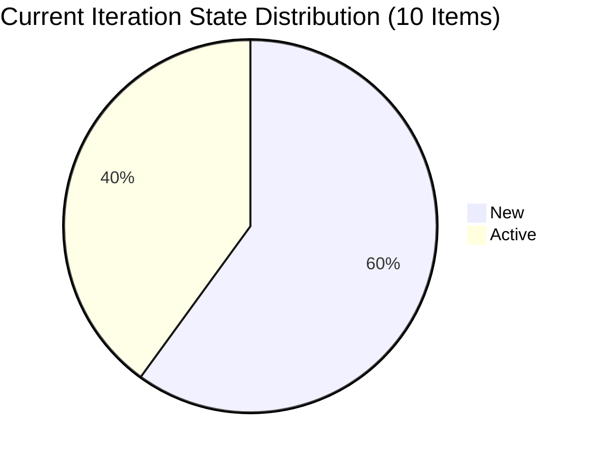
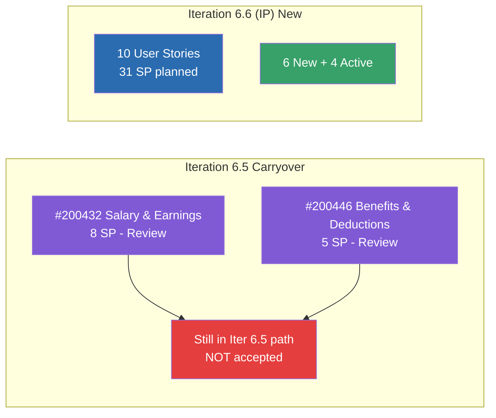
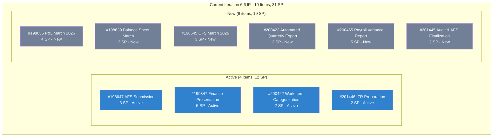
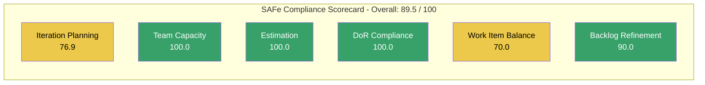

# SAFe Audit Report -- Finance Team

**Project:** Jairosoft FINOPS
**Team:** Finance Team
**Iteration:** Iteration 6.6 (IP) (PI 2026-PI6)
**Iteration Window:** March 23, 2026 -- April 5, 2026
**Audit Date:** March 25, 2026 (Day 3 of 14 -- Early Sprint)
**Auditor:** AI EngProd Consultant
**Framework:** SAFe 6.0 (Scaled Agile Framework)
**Previous Audit:** AUDIT_2026-03-22_2329 (Iteration 6.5, Sprint Close, Score: 84/100)

---

## 1. Audit Metadata

| Field | Value |
|---|---|
| **ADO Org** | `jairo` (`dev.azure.com/jairo`) |
| **ADO Project** | Jairosoft FINOPS |
| **ADO Project ID** | `e0bb302f-40f9-46c3-8164-6f1acb317d63` |
| **ADO Team** | Finance Team |
| **ADO Team ID** | `1f4b45fa-82e8-4a36-aedc-6c1bc8f51070` |
| **ADO Board URL** | [Stories and Deliverables](https://dev.azure.com/jairo/Jairosoft%20FINOPS/_boards/board/t/Finance%20Team/Stories%20and%20Deliverables) |
| **Backlog ID** | `Microsoft.RequirementCategory` |
| **Backlog Focus** | Stories and Deliverables |
| **Current Iteration** | Iteration 6.6 (IP) |
| **Iteration Path** | `Jairosoft FINOPS\2026-PI6\Iteration 6.6 (IP)` |
| **Iteration Start** | March 23, 2026 |
| **Iteration Finish** | April 5, 2026 |
| **Scoring Rubric** | Six-Dimension SAFe Compliance Scorecard |
| **No other boards, teams, projects, or repositories were analyzed.** | |

---

## 2. Executive Summary

This is the **first audit of Iteration 6.6 (IP)**, conducted on Day 3 of the 14-day Innovation and Planning sprint. This IP sprint follows Iteration 6.5, which closed with an 84/100 health score and 100% task completion.

**Overall SAFe Compliance Score: 89.5 / 100 -- Low Risk**

The Finance Team enters the IP sprint in a strong position:

- **10 of 13 backlog items** are assigned to the current iteration (76.9% planning coverage)
- **All 10 items are estimated** with a total of **31 Story Points**
- **All 10 items pass DoR compliance** with well-structured descriptions and acceptance criteria
- **Grace remains the sole contributor**, now with all capacity activities set to 0 hours/day
- **3 items from Iteration 6.5 remain in Review state** -- carryover from the previous sprint

Key concern: **Team capacity is configured at 0 hours/day** across all three activity categories (Deployment, Documentation, Requirements). While Grace has activities defined, the zero-capacity configuration means no formal work commitment exists for this iteration.

---

## 3. Previous Audit Delta

The prior audit (AUDIT_2026-03-22_2329) covered Iteration 6.5 sprint close. Key findings and their current status:

| # | Iteration 6.5 Finding | Severity | Current Status | Evidence |
|---|---|---|---|---|
| 1 | Single team member bottleneck (6 consecutive audits) | Critical | **PERSISTS** | Grace remains sole assignee on all 10 current iteration items |
| 2 | 3 stories in Review at sprint close (#200432, #200446, #198611) | Major | **PARTIALLY RESOLVED** | #200432 and #200446 remain in Review in Iteration 6.5 path; #198611 no longer on backlog (likely closed or removed) |
| 3 | Completed work under-reported (historical tasks) | Major | **CARRIED FORWARD** | New iteration -- no task data yet to evaluate |
| 4 | Feature states should update upon story acceptance | Minor | **UNKNOWN** | No visibility into feature-level state changes |

**Delta Summary:**
- Iteration 6.5 achieved 100% task completion but 3 stories remained in Review
- 2 of those 3 stories (#200432, #200446) are still in Review state under Iteration 6.5 path -- they have **not been accepted**
- The IP sprint has 10 items planned with 31 SP -- a **24% increase** over Iteration 6.5's 25 SP commitment
- 3 new items were created on March 23 (#201445, #201446, and #201448) as part of PI planning

---

## 4. Current Iteration Snapshot

### 4.1 Iteration Scope

| Metric | Value |
|---|---|
| **Iteration** | 6.6 (IP) -- Innovation and Planning |
| **Duration** | 14 days (March 23 -- April 5, 2026) |
| **Day of Sprint** | Day 3 (21% elapsed) |
| **User Stories** | 10 |
| **Total Story Points** | 31 |
| **Stories in New** | 6 (19 SP) |
| **Stories in Active** | 4 (12 SP) |
| **Stories Closed** | 0 |

### 4.2 Team Capacity

| Member | Activity | Capacity/Day | Days Off |
|---|---|---|---|
| Grace | Deployment | **0 hrs** | None |
| Grace | Documentation | **0 hrs** | None |
| Grace | Requirements | **0 hrs** | None |
| **Total** | -- | **0 hrs/day** | **0** |

**Capacity Assessment:** Grace has three activities configured but all are set to **0 hours/day**. This means the team has no formal capacity commitment for Iteration 6.6 (IP). This is consistent with IP sprint behavior in SAFe -- IP sprints are typically unscored and used for innovation, planning, and technical debt reduction. However, with 31 SP of planned work, some capacity allocation would be expected.

### 4.3 Work Item State Distribution

| State | Count | Story Points | % of Items |
|---|---|---|---|
| New | 6 | 19 | 60% |
| Active | 4 | 12 | 40% |
| Review | 0 | 0 | 0% |
| Closed | 0 | 0 | 0% |
| **Total** | **10** | **31** | **100%** |

---

## 5. Work Item Analysis

### 5.1 Current Iteration Items (10 items, 31 SP)

| ID | Title | Type | State | SP | Assigned | Changed Date | DoR |
|---|---|---|---|---|---|---|---|
| 198635 | P&L March 2026 | User Story | New | 4 | Grace | Mar 18 | Pass |
| 198639 | Jairosoft Balance Sheet March 2026 | User Story | New | 3 | Grace | Mar 23 | Pass |
| 198645 | CFS March 2026 | User Story | New | 3 | Grace | Mar 19 | Pass |
| 198647 | AFS Submission 2025-2026 | User Story | Active | 3 | Grace | Mar 24 | Pass |
| 199347 | March Jairosoft Finance Presentation | User Story | Active | 5 | Grace | Mar 18 | Pass |
| 200422 | Work Item Categorization | User Story | Active | 2 | Grace | Mar 24 | Pass |
| 200423 | Automated Quarterly Export | User Story | New | 2 | Grace | Mar 23 | Pass |
| 200465 | Payroll Variance & Audit Report | User Story | New | 5 | Grace | Mar 23 | Pass |
| 201445 | Audit & Financial Statement Finalization | User Story | New | 2 | Grace | Mar 23 | Pass |
| 201446 | Income Tax Return (ITR) Preparation | User Story | Active | 2 | Grace | Mar 24 | Pass |

### 5.2 Non-Current-Iteration Items on Backlog (3 items)

| ID | Title | Iteration Path | State | SP | Notes |
|---|---|---|---|---|---|
| 200432 | Salary & Earnings Automation | Iteration 6.5 | Review | 8 | **Carryover -- not accepted from 6.5** |
| 200446 | Standardized Benefits & Deductions | Iteration 6.5 | Review | 5 | **Carryover -- not accepted from 6.5** |
| 201448 | eAFS Portal Submission | Jairosoft FINOPS (root) | New | -- | **Unestimated, unassigned to iteration** |

### 5.3 Work Item Categories

| Category | Items | SP |
|---|---|---|
| **Financial Reporting** (P&L, Balance Sheet, CFS, Presentation) | 4 | 15 |
| **Tax Compliance** (AFS, ITR, Audit Finalization) | 3 | 7 |
| **Payroll** (Variance Report) | 1 | 5 |
| **Process Improvement** (Categorization, Quarterly Export) | 2 | 4 |
| **Total** | **10** | **31** |

### 5.4 Untouched Items Analysis

Three current iteration items have a ChangedDate before the iteration start (March 23):

| ID | Title | Last Changed | Days Since Change |
|---|---|---|---|
| 198635 | P&L March 2026 | Mar 18 | 7 days |
| 198645 | CFS March 2026 | Mar 19 | 6 days |
| 199347 | March Jairosoft Finance Presentation | Mar 18 | 7 days |

These items were moved into the iteration during planning but have not been touched since. At 30% of current items, this is within the acceptable threshold but warrants monitoring.

---

## 6. SAFe Compliance Scorecard

| # | Dimension | Score | Formula | Evidence | Notes |
|---|---|---|---|---|---|
| 1 | **Iteration Planning** | **76.9** | 10 / 13 * 100 | 10 current iteration items out of 13 visible backlog items | 3 items remain outside iteration (2 carryover in Review, 1 unassigned) |
| 2 | **Team Capacity** | **100.0** | 1 / 1 * 100 | Grace has 3 configured activities | Activities defined (Deployment, Documentation, Requirements) but all at 0 hrs/day |
| 3 | **Estimation** | **100.0** | 10 / 10 * 100 | All 10 User Stories have Story Points | Range: 2-5 SP per story, 31 SP total |
| 4 | **DoR Compliance** | **100.0** | 10 / 10 * 100 | All 10 items have Description >= 30 non-ws chars and AC >= 20 non-ws chars | Strong user story format across all items |
| 5 | **Work Item Balance** | **70.0** | 100 - 30 (dominant type > 60%) | All 10 items are User Stories (100% share) | No Spikes, Bugs, or other types. Penalty for mono-type backlog. |
| 6 | **Backlog Refinement** | **90.0** | base 100.0 - 10 (untouched > 10%) | 13/13 fresh (within 45 days), 0 stale-90, 0 stale-180 | 3/10 untouched current items (30%) triggers -10 penalty |
| | **Overall Score** | **89.5** | Average of 6 dimensions | | **Low Risk** (>= 80) |

### Score Summary

**Risk Band: Low Risk (89.5 >= 80)**

---

## 7. Dimension Findings

### 7.1 Iteration Planning (76.9/100)

**Source:** ADO backlog and iteration assignment

The team has assigned 10 of 13 visible backlog items to the current iteration. The 3 unassigned items are:
- **#200432** and **#200446**: Carried over from Iteration 6.5 in Review state. These should either be accepted (closed) or explicitly moved to the current iteration.
- **#201448** (eAFS Portal Submission): Created March 23 but left at the project root iteration path with no Story Points. This appears to be an incomplete planning artifact.

The 76.9% score reflects solid planning but is pulled down by unresolved carryover.

### 7.2 Team Capacity (100.0/100)

**Source:** ADO team capacity settings

Grace is the sole contributor and has three activity categories configured (Deployment, Documentation, Requirements). Per the scoring formula, having at least one configured activity satisfies the capacity requirement.

**Important caveat:** All three activities are set to 0 hours/day. While this scores 100.0 by formula, it represents a **functional gap** -- no capacity is committed for this IP sprint. This may be intentional for an Innovation and Planning sprint, but it means there is no burn-down baseline.

### 7.3 Estimation (100.0/100)

**Source:** ADO work item Story Points

All 10 current iteration items have Story Points assigned. Distribution:

| SP Value | Count | % |
|---|---|---|
| 2 | 4 | 40% |
| 3 | 3 | 30% |
| 4 | 1 | 10% |
| 5 | 2 | 20% |

Total: 31 SP. The estimation range (2-5 SP) is tight and suggests consistent sizing. No outlier estimates.

### 7.4 DoR Compliance (100.0/100)

**Source:** ADO work item Description and Acceptance Criteria fields

All 10 items pass the Definition of Ready threshold:
- All descriptions use a structured user story format ("As a... I want... So that...")
- All acceptance criteria contain specific, testable conditions
- Smallest description: 112 non-whitespace characters (#201446)
- Smallest acceptance criteria: 235 non-whitespace characters (#200422)

This is a strong result and reflects good refinement discipline.

### 7.5 Work Item Balance (70.0/100)

**Source:** ADO work item types

All 10 current iteration items are User Stories, giving a 100% dominant type share. This triggers the -30 penalty for exceeding the 60% threshold. No Spikes are present (0% spike share).

While a mono-type backlog is common in smaller teams focused on delivery, SAFe encourages a healthy mix of work types (including Enablers, Spikes, and technical debt items) especially in IP sprints. The IP sprint would be an ideal opportunity to introduce Spike or Enabler items for innovation.

### 7.6 Backlog Refinement (90.0/100)

**Source:** ADO work item ChangedDate timestamps

- **13 of 13** visible backlog items have been changed within the last 45 days (100% freshness)
- **0** items are stale beyond 90 days
- **0** items are stale beyond 180 days
- **3 of 10** current iteration items (30%) are untouched since before iteration start, triggering a -10 penalty

Base score of 100.0 minus 10 penalty = 90.0. The backlog is well-maintained with no stale items. The untouched ratio is at the border of the moderate penalty threshold.

---

## 8. Risks and Bottlenecks

### RISK 1 -- CRITICAL: Single Team Member Bottleneck (7th+ Consecutive Audit)

**Source:** ADO assignee data

Grace continues as the sole team member. All 10 items in Iteration 6.6 (IP) are assigned to her. This finding has persisted through **every audit of PI 2026-PI6**. The IP sprint is the natural window for addressing team structure.

**Impact:**
- Bus factor of 1 -- any absence stalls all work
- No peer review capacity
- 31 SP committed to a single contributor with 0 configured capacity hours

### RISK 2 -- MAJOR: Iteration 6.5 Carryover Not Resolved

**Source:** ADO work item state and iteration path

Two stories from Iteration 6.5 (#200432 - 8 SP, #200446 - 5 SP) remain in **Review** state under the Iteration 6.5 path. The previous audit flagged these for same-day acceptance on March 22. Three days later, they are still not accepted.

**Impact:**
- 13 SP of completed work remains unaccepted
- Iteration 6.5 velocity is formally understated (11 SP closed vs. 25 SP work-complete)
- Stale Review items create ambiguity in backlog priority

### RISK 3 -- MODERATE: Zero Capacity Configuration for IP Sprint

**Source:** ADO capacity settings

All three of Grace's activity categories are set to 0 hours/day. While IP sprints often have relaxed capacity tracking, the team has 31 SP of planned work. Without capacity data, there is no burndown baseline and no way to assess overcommitment.

### RISK 4 -- MODERATE: Orphaned Backlog Item #201448

**Source:** ADO iteration path

Work item #201448 (eAFS Portal Submission) was created on March 23 but sits at the project root iteration path (`Jairosoft FINOPS`) rather than being assigned to an iteration. It has no Story Points. Given its thematic relationship to #198647 (AFS Submission) and #201445 (Audit & AFS Finalization), it appears to be an incomplete planning artifact.

### RISK 5 -- LOW: 60% of Items Still in New State

**Source:** ADO work item state

6 of 10 items (60%) are still in New state on Day 3. This is typical for early-sprint conditions but should improve by mid-sprint. If more than 50% remain in New by Day 7, this becomes a delivery risk.

---

## 9. Prioritized Recommendations

| Priority | Action | Owner | Impact | Effort |
|---|---|---|---|---|
| 1 | **Accept or close #200432 and #200446 immediately** -- all tasks were completed in Iteration 6.5 | Ramon (PO) | Resolves 13 SP of carryover; improves Iteration Planning score | Low |
| 2 | **Set capacity for Grace in Iteration 6.6** -- even IP sprints benefit from capacity baselines when work is planned | Grace / Ramon | Enables burndown tracking for 31 SP commitment | Low |
| 3 | **Triage #201448** -- either assign to Iteration 6.6 with Story Points or explicitly defer to a future iteration | Grace | Reduces orphaned backlog items; improves Iteration Planning score | Low |
| 4 | **Activate New items** -- move the 6 New items to Active as work begins to maintain accurate state tracking | Grace | Accurate WIP visibility | Low |
| 5 | **Introduce at least one Enabler or Spike** -- the IP sprint is ideal for innovation, technical debt, or exploration work items | Grace / Ramon | Improves Work Item Balance score from 70 toward 100 | Medium |
| 6 | **Address team sizing** -- the IP sprint is the planning window for PI7; advocate for a second team member | Ramon | Resolves the persistent bus-factor-of-1 risk | High |
| 7 | **Conduct retrospective for Iteration 6.5** -- document lessons learned from the 100% task completion sprint | Ramon + Grace | Process improvement; addresses carryover pattern | Low |

---

## 10. Evidence Gaps and Limitations

| Gap | Impact | Mitigation |
|---|---|---|
| **No GitHub repositories scoped** for Jairosoft FINOPS | Cannot assess delivery evidence, PR throughput, or code-level traceability | Finance Team work appears to be non-code (financial reporting, tax compliance); GitHub correlation is not applicable |
| **Capacity set to 0 hrs/day** | Cannot compute capacity utilization or burndown rate | Scored as 100.0 per formula (activities configured) but noted as functional gap |
| **No task-level breakdown** for Iteration 6.6 items | Cannot assess task decomposition quality or remaining work hours | Early sprint -- tasks may not yet be created |
| **Iteration 6.5 carryover items** not formally moved | Carryover SP (13) not reflected in current iteration metrics | Reported under Risks |
| **Azure DevOps experienced transient unavailability** during the audit (initial iteration list call failed) | Retried successfully; no data loss | Noted for audit trail completeness |

---

## Score Comparison: Iteration 6.5 Close vs. Iteration 6.6 (IP) Day 3

Note: The previous audit used a different 5-dimension / 100-point rubric. The comparison below maps conceptually, not numerically.

| Area | Iter 6.5 Close (84/100) | Iter 6.6 Day 3 (89.5/100) | Observation |
|---|---|---|---|
| Planning | 18/20 | 76.9/100 | Strong iteration assignment in both |
| Capacity | 16/20 | 100.0/100 | Activities configured; IP sprint at 0 hrs |
| Estimation | -- | 100.0/100 | All items estimated (new dimension) |
| Story Quality / DoR | 16/20 | 100.0/100 | All items pass DoR |
| Work Item Balance | -- | 70.0/100 | Mono-type penalty (new dimension) |
| Backlog Hygiene / Refinement | 14/20 | 90.0/100 | No stale items; minor untouched penalty |

---

*Report generated: March 25, 2026 02:47 UTC | SAFe 6.0 Framework | Jairosoft FINOPS -- Finance Team*
*Iteration 6.6 (IP): Mar 23 -- Apr 5, 2026 | Day 3 of 14 | SAFe Compliance Score: 89.5/100 (Low Risk)*
*Items: 10 User Stories | 31 SP | 6 New + 4 Active | 0 Closed*
*Previous Audit: AUDIT_2026-03-22_2329 (Iteration 6.5 Close, 84/100)*
