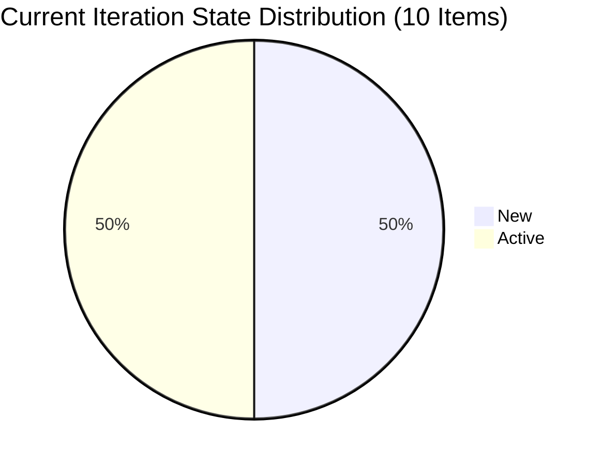
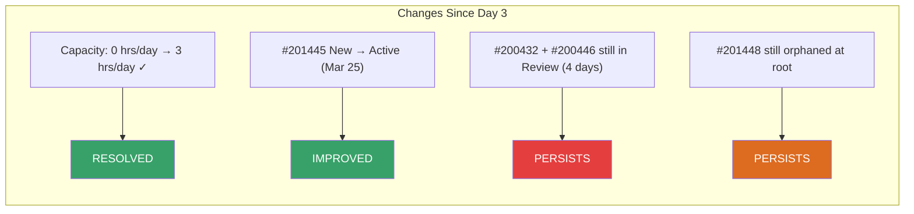
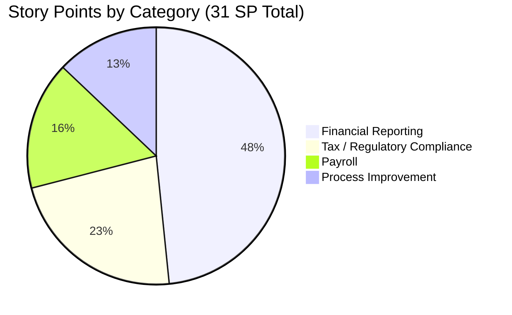
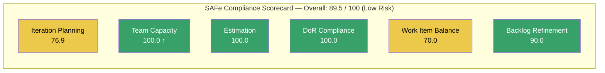
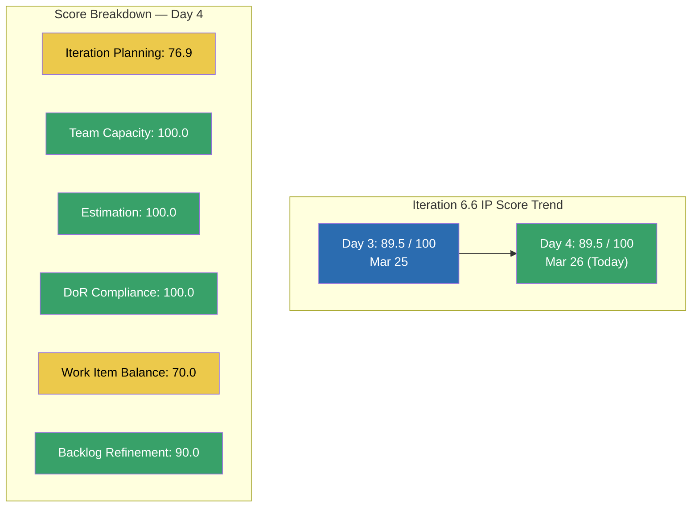

# SAFe Audit Report — Finance Team

**Project:** Jairosoft FINOPS
**Team:** Finance Team
**Iteration:** Iteration 6.6 (IP) (PI 2026-PI6)
**Iteration Window:** March 23, 2026 – April 5, 2026
**Audit Date:** March 26, 2026 (Day 4 of 14 — Early Sprint)
**Auditor:** AI EngProd Consultant
**Framework:** SAFe 6.0 (Scaled Agile Framework)
**Previous Audit:** AUDIT_2026-03-25_024753 (Iteration 6.6 IP, Day 3, Score: 89.5/100)

---

## 1. Audit Metadata

| Field | Value |
|---|---|
| **ADO Org** | `jairo` (`dev.azure.com/jairo`) |
| **ADO Project** | Jairosoft FINOPS |
| **ADO Project ID** | `e0bb302f-40f9-46c3-8164-6f1acb317d63` |
| **ADO Team** | Finance Team |
| **ADO Team ID** | `1f4b45fa-82e8-4a36-aedc-6c1bc8f51070` |
| **ADO Board URL** | [Stories and Deliverables](https://dev.azure.com/jairo/Jairosoft%20FINOPS/_boards/board/t/Finance%20Team/Stories%20and%20Deliverables) |
| **Backlog ID** | `Microsoft.RequirementCategory` |
| **Backlog Focus** | Stories and Deliverables |
| **Current Iteration** | Iteration 6.6 (IP) |
| **Iteration Path** | `Jairosoft FINOPS\2026-PI6\Iteration 6.6 (IP)` |
| **Iteration Start** | March 23, 2026 |
| **Iteration Finish** | April 5, 2026 |
| **Audit Day** | Day 4 of 14 (29% elapsed) |
| **Overall Score** | **89.5 / 100 — Low Risk** |
| **Previous Audit** | AUDIT_2026-03-25_024753 (Day 3, 89.5/100, Low Risk) |
| **Scoring Rubric** | Six-Dimension SAFe Compliance Scorecard |
| **No other boards, teams, projects, or repositories were analyzed.** | |

---

## 2. Executive Summary

This is the **second audit of Iteration 6.6 (IP)**, conducted on Day 4 of the 14-day Innovation and Planning sprint. The team maintains its **89.5/100 Low Risk** score from yesterday's Day 3 audit.

**The most significant change since the last audit is a positive capacity improvement:** Grace now has active capacity configured at **2 hrs/day for Documentation** and **1 hr/day for Requirements** (previously all three activities were at 0 hrs/day). This resolves the zero-capacity concern raised in the Day 3 audit and reflects an active IP sprint commitment of **3 total hours/day**.

**Overall SAFe Compliance Score: 89.5 / 100 — Low Risk**

Key facts as of Day 4:

- **10 of 13 backlog items** assigned to the current iteration (76.9% planning coverage — unchanged)
- **All 10 items are estimated** with 31 total Story Points — unchanged
- **All 10 items pass DoR compliance** — unchanged
- **Grace is now actively capacity-configured** at 3 hrs/day across Documentation and Requirements
- **Item #201445 (Audit & Financial Statement Finalization)** moved to Active state on March 25, bringing Active items to 5
- **2 Iteration 6.5 carryover items** (#200432, #200446) remain in Review — still unresolved after 4 days

---

## 3. Previous Audit Delta

The prior audit (AUDIT_2026-03-25_024753) covered Iteration 6.6 (IP) Day 3. Key findings and their current status:

| # | Day 3 Finding | Severity | Current Status | Evidence |
|---|---|---|---|---|
| 1 | All capacity activities set to 0 hrs/day | Major | **RESOLVED** | Grace now has Documentation=2 hrs/day, Requirements=1 hrs/day, Deployment=0 hrs/day. Total: 3 hrs/day |
| 2 | 3 items untouched (changed before iteration start) | Moderate | **PARTIALLY RESOLVED** | #198635 (P&L) and #198645 (CFS) still unchanged since Mar 18/19. #199347 (Finance Presentation) still unchanged since Mar 18. Item #201445 moved to Active Mar 25. |
| 3 | #200432 and #200446 in Review from Iteration 6.5 | Major | **PERSISTS** | Both still in Review state under Iteration 6.5 path (4 days since flag) |
| 4 | #201448 (eAFS Portal) orphaned at project root | Moderate | **PERSISTS** | Still at `Jairosoft FINOPS` root path, no Story Points assigned |
| 5 | Work Item Balance penalized for mono-type backlog | Low | **PERSISTS** | All 10 items remain User Stories; no Enablers or Spikes introduced |
| 6 | Single team member bottleneck | Critical | **PERSISTS** | Grace remains sole assignee (8th+ consecutive audit) |

**Delta Summary:**
- Capacity configuration significantly improved (0 → 3 hrs/day) — the Day 3 top concern is now resolved
- Net state change: 1 item moved from New to Active (#201445 on March 25)
- Score remains 89.5 — capacity improvement does not change the formula score but improves operational health
- 5 items now Active (up from 4), 5 items still New (down from 6)

---

## 4. Current Iteration Snapshot

### 4.1 Iteration Scope

| Metric | Value |
|---|---|
| **Iteration** | 6.6 (IP) — Innovation and Planning |
| **Duration** | 14 days (March 23 – April 5, 2026) |
| **Day of Sprint** | Day 4 (29% elapsed) |
| **User Stories** | 10 |
| **Total Story Points** | 31 |
| **Stories in New** | 5 (14 SP) |
| **Stories in Active** | 5 (17 SP) |
| **Stories in Review** | 0 |
| **Stories Closed** | 0 |

### 4.2 Team Capacity

| Member | Activity | Capacity/Day | Days Off |
|---|---|---|---|
| Grace | Deployment | 0 hrs | None |
| Grace | Documentation | **2 hrs** | None |
| Grace | Requirements | **1 hr** | None |
| **Total** | — | **3 hrs/day** | **0** |

**Capacity Assessment:** Grace now has 3 hours/day configured across Documentation and Requirements. With a 14-day sprint and 0 days off, the configured capacity is **42 hours total** for this IP sprint. Given 31 SP of planned work, this is a reasonable capacity-to-commitment ratio for an IP sprint. Deployment remains at 0, which is appropriate given the finance-domain nature of the work.

### 4.3 Work Item State Distribution

| State | Count | Story Points | % of Items |
|---|---|---|---|
| New | 5 | 14 | 50% |
| Active | 5 | 17 | 50% |
| Review | 0 | 0 | 0% |
| Closed | 0 | 0 | 0% |
| **Total** | **10** | **31** | **100%** |

---

## 5. Work Item Analysis

### 5.1 Current Iteration Items (10 items, 31 SP)

| ID | Title | Type | State | SP | Assigned | Changed Date | DoR | Untouched? |
|---|---|---|---|---|---|---|---|---|
| 198635 | P&L March 2026 | User Story | New | 4 | Grace | Mar 18 | Pass | **Yes** |
| 198639 | Jairosoft Balance Sheet March 2026 | User Story | New | 3 | Grace | Mar 23 | Pass | No |
| 198645 | CFS March 2026 | User Story | New | 3 | Grace | Mar 19 | Pass | **Yes** |
| 198647 | AFS Submission 2025-2026 | User Story | Active | 3 | Grace | Mar 24 | Pass | No |
| 199347 | March Jairosoft Finance Presentation | User Story | Active | 5 | Grace | Mar 18 | Pass | **Yes** |
| 200422 | Work Item Categorization | User Story | Active | 2 | Grace | Mar 24 | Pass | No |
| 200423 | Automated Quarterly Export | User Story | New | 2 | Grace | Mar 23 | Pass | No |
| 200465 | Payroll Variance & Audit Report | User Story | New | 5 | Grace | Mar 23 | Pass | No |
| 201445 | Audit & Financial Statement Finalization | User Story | Active | 2 | Grace | Mar 25 | Pass | No |
| 201446 | Income Tax Return (ITR) Preparation | User Story | Active | 2 | Grace | Mar 24 | Pass | No |

**Untouched items** (3): #198635, #198645, #199347 — all have ChangedDate before iteration start (Mar 23). 30% untouched ratio is at the -10 threshold boundary.

### 5.2 Non-Current-Iteration Items on Backlog (3 items)

| ID | Title | Iteration Path | State | SP | Days Since Change | Notes |
|---|---|---|---|---|---|---|
| 200432 | Salary & Earnings Automation | Iteration 6.5 | Review | 8 | 7 days | **Carryover — not accepted from 6.5** |
| 200446 | Standardized Benefits & Deductions | Iteration 6.5 | Review | 5 | 4 days | **Carryover — not accepted from 6.5** |
| 201448 | eAFS Portal Submission | Jairosoft FINOPS (root) | New | — | 3 days | **Orphaned — no iteration, no SP** |

### 5.3 Work Item Categories

| Category | Items | SP | Notes |
|---|---|---|---|
| **Financial Reporting** (P&L, Balance Sheet, CFS, Presentation) | 4 | 15 | Core Q1 close deliverables |
| **Tax / Regulatory Compliance** (AFS, ITR, Audit Finalization) | 3 | 7 | Time-sensitive: April 15 ITR deadline |
| **Payroll** (Variance & Audit Report) | 1 | 5 | Audit readiness |
| **Process Improvement** (Work Item Categorization, Quarterly Export) | 2 | 4 | IP sprint innovation items |
| **Total** | **10** | **31** | |

### 5.4 Story Points Distribution

| SP Value | Count | Items |
|---|---|---|
| 2 | 4 | #200422, #200423, #201445, #201446 |
| 3 | 3 | #198639, #198645, #198647 |
| 4 | 1 | #198635 |
| 5 | 2 | #199347, #200465 |

---

## 6. SAFe Compliance Scorecard

| # | Dimension | Score | Formula | Evidence | Notes |
|---|---|---|---|---|---|
| 1 | **Iteration Planning** | **76.9** | 10 / 13 × 100 | 10 current iteration items out of 13 visible backlog items | 2 carryover items in Iter 6.5 Review; 1 orphaned at root |
| 2 | **Team Capacity** | **100.0** | 1 / 1 × 100 | Grace has Documentation (2 hrs/day) and Requirements (1 hr/day) > 0 | Capacity updated since Day 3 audit; total 3 hrs/day, 42 hrs/sprint |
| 3 | **Estimation** | **100.0** | 10 / 10 × 100 | All 10 User Stories have Story Points > 0 | Range: 2–5 SP; total 31 SP |
| 4 | **DoR Compliance** | **100.0** | 10 / 10 × 100 | All 10 items have Description ≥ 30 non-ws chars AND AC ≥ 20 non-ws chars | Consistent user story format; detailed acceptance criteria |
| 5 | **Work Item Balance** | **70.0** | 100 − 30 (dominant type > 60%) | All 10 items are User Stories (100% share) | -30 for mono-type backlog; no Spikes, Enablers, or Bugs present |
| 6 | **Backlog Refinement** | **90.0** | base 100.0 − 10 (untouched > 10%) | 13/13 fresh (< 45 days); 0 stale-90; 0 stale-180; 3/10 untouched (30%) | 30% untouched triggers −10 penalty only; base remains solid |
| | **Overall Score** | **89.5** | (76.9 + 100.0 + 100.0 + 100.0 + 70.0 + 90.0) / 6 | | **Low Risk (≥ 80)** |

### Score Visualization

**Risk Band: Low Risk (89.5 ≥ 80)**

---

## 7. Dimension Findings

### 7.1 Iteration Planning (76.9/100)

**Source:** ADO backlog and iteration assignment

10 of 13 visible backlog items are assigned to the current iteration. The 3 outstanding items:

- **#200432** (Salary & Earnings Automation, 8 SP): In Review under Iteration 6.5 for 7+ days post-sprint-close. All tasks were completed in Iteration 6.5; this needs PO acceptance to close.
- **#200446** (Standardized Benefits & Deductions, 5 SP): In Review under Iteration 6.5 for 4+ days. Same resolution path as #200432.
- **#201448** (eAFS Portal Submission): Created March 23 at the project root with no Story Points and no iteration assignment. Closely related to #198647 (AFS Submission) and #201445 (Audit & AFS Finalization) — likely an incomplete planning artifact from Day 1 of the IP sprint.

Bringing #201448 into the iteration with Story Points and accepting #200432/#200446 would bring this dimension to 100.0.

### 7.2 Team Capacity (100.0/100)

**Source:** ADO capacity settings

**Positive change since Day 3:** Grace's capacity is now actively configured:
- Documentation: **2 hrs/day** (was 0)
- Requirements: **1 hr/day** (was 0)
- Deployment: 0 hrs/day (unchanged — appropriate for finance domain work)

Total configured capacity: **3 hrs/day × 14 days = 42 hours** for the IP sprint. This resolves the key concern from the Day 3 audit and provides a meaningful burndown baseline for 31 SP of planned work.

### 7.3 Estimation (100.0/100)

**Source:** ADO work item Story Points

All 10 current iteration items have Story Points. Estimation has been 100% in every audit of this iteration. Story point distribution is tight (2–5 SP), suggesting consistent sizing discipline.

| SP Range | Count | Share |
|---|---|---|
| Small (2 SP) | 4 | 40% |
| Medium (3–4 SP) | 4 | 40% |
| Large (5 SP) | 2 | 20% |

### 7.4 DoR Compliance (100.0/100)

**Source:** ADO work item Description and Acceptance Criteria fields

All 10 items pass:
- Descriptions use structured "As a... I want... So that..." format
- Acceptance criteria are specific and testable across all items
- Regulatory items (#198647, #201446, #201445) include detailed technical threshold checklists aligned with BIR/SEC requirements

### 7.5 Work Item Balance (70.0/100)

**Source:** ADO work item types in current iteration

All 10 items are User Stories (100% dominant type share, exceeding the 60% threshold → −30 penalty). No Spikes, Enablers, Bugs, or other types are present.

For an IP sprint, this is a missed opportunity. SAFe IP sprints are designed to support innovation, technical exploration (Spikes), and process improvements (Enablers). The two "Process Improvement" category items (#200422 Work Item Categorization and #200423 Automated Quarterly Export) could have been typed as Enablers, which would reduce the mono-type penalty.

### 7.6 Backlog Refinement (90.0/100)

**Source:** ADO ChangedDate timestamps

| Metric | Value | Threshold | Penalty |
|---|---|---|---|
| Fresh items (< 45 days) | 13/13 = 100% | N/A (base) | Base = 100.0 |
| Stale-90 items | 0/13 = 0% | > 25% → −20, > 10% → −10 | None |
| Stale-180 items | 0 | ≥ 1 → −20 | None |
| Untouched current items | 3/10 = 30% | > 30% → −20, > 10% → −10 | **−10** |
| **Net Score** | **90.0** | | |

The untouched items (#198635, #198645, #199347) have been unchanged for 7–8 days. If they remain untouched by Day 7 (March 29), the ratio could trigger the higher −20 penalty if any additional items become untouched.

---

## 8. Risks and Bottlenecks

### RISK 1 — CRITICAL: Single Team Member Bottleneck (8th+ Consecutive Audit)

**Source:** ADO assignee data | **Trend:** Persistent — no change

Grace is the sole Finance Team member. All 10 current iteration items and 3 backlog items are assigned exclusively to her. This has been flagged in every audit of PI 2026-PI6.

**IP Sprint Window Impact:** The IP sprint is the designated time in SAFe to conduct PI planning for the next PI. If the team size remains 1, PI planning discussions cannot occur with a second team member, and the structural risk carries into PI7.

**Impact:**
- Bus factor: 1
- No capacity for parallel delivery or peer review
- 31 SP committed with 42 hours of configured capacity (≈ 0.74 SP/hour — tight)

### RISK 2 — MAJOR: Iteration 6.5 Carryover Items Not Accepted (Day 4)

**Source:** ADO work item state | **Trend:** Persists — now 4+ days post-sprint-close

Items #200432 (8 SP) and #200446 (5 SP) remain in Review state under the Iteration 6.5 path. All associated tasks were completed before sprint close. These require Product Owner acceptance to move to Closed.

**Escalation:** This is the 2nd consecutive audit flagging these items. Each additional day they remain in Review:
- Understates Iteration 6.5 official velocity (11 SP closed vs. ~25 SP work-complete)
- Keeps 13 SP of completed work in an ambiguous state
- Risks the items becoming stale-90 if unaddressed for another 85+ days

**Action required:** Ramon (PO) to review and accept #200432 and #200446 immediately.

### RISK 3 — MODERATE: Orphaned Item #201448 (eAFS Portal Submission)

**Source:** ADO iteration path | **Trend:** Persists

Created on March 23 but left at the project root (`Jairosoft FINOPS`) with no Story Points and no iteration assignment. Thematically linked to active AFS-related items in Iteration 6.6 (IP). Three days have passed without assignment.

### RISK 4 — MODERATE: Untouched Items Approaching Escalation Threshold

**Source:** ADO ChangedDate | **Trend:** New escalation path

Three current iteration items (#198635, #198645, #199347) have had no activity since March 18–19, now **7–8 days without change**. The rubric applies a −10 penalty when untouched > 10% and a −20 penalty when untouched > 30%. Currently at 30%, one more untouched item would tip the penalty to −20, reducing Backlog Refinement from 90.0 to 80.0.

**Watchlist:** If #198635 (P&L March 2026) and #198645 (CFS March 2026) remain in New state with no field updates by Day 7 (March 29), the team should force a touch (even a comment or minor description update) to reset the ChangedDate.

### RISK 5 — LOW: Zero SP Committed to Closure as of Day 4

**Source:** ADO work item state | **Trend:** Expected at this point

0 of 10 items are Closed and 0 are in Review as of Day 4 (29% elapsed). While not unusual for early-sprint, with a 14-day IP sprint and 31 SP, the team needs to begin closing items by Day 7–8 to avoid end-of-sprint compression. Tax compliance items (#198647 AFS, #201446 ITR) have hard external deadlines (April 15, 2026) that pre-date the sprint close.

---

## 9. Prioritized Recommendations

| Priority | Action | Owner | Target | Impact | Effort |
|---|---|---|---|---|---|
| 1 | **Accept #200432 and #200446** — review tasks are complete; PO sign-off needed to close | Ramon (PO) | Immediately | Resolves 13 SP carryover; improves Iteration 6.5 velocity record and raises Iteration Planning from 76.9 toward 100 | Low |
| 2 | **Assign and estimate #201448 (eAFS Portal)** — triage into Iteration 6.6 (IP) or defer explicitly to a future iteration | Grace / Ramon | This week | Eliminates orphaned backlog item; improves Iteration Planning | Low |
| 3 | **Activate #198635 (P&L) and #198645 (CFS)** — move from New to Active as work progresses to prevent untouched escalation | Grace | By Day 7 (Mar 29) | Prevents Backlog Refinement score from dropping from 90.0 to 80.0 | Low |
| 4 | **Prioritize tax compliance items (#198647, #201446, #201445)** — April 15 BIR ITR deadline is within sprint window | Grace | By Apr 10 | Ensures regulatory compliance; prevents external deadline breach | Medium |
| 5 | **Convert process improvement items to Enabler type** — retype #200422 and #200423 as Enablers to reduce mono-type penalty | Grace / Ramon | Next refinement | Reduces Work Item Balance penalty; may improve score by up to 10 points | Low |
| 6 | **Add at least one Spike for PI7 planning** — use the IP sprint to investigate tooling, integrations, or process improvements for the next PI | Grace / Ramon | Before Day 10 (Apr 1) | Demonstrates IP sprint intent; reduces Work Item Balance mono-type penalty | Medium |
| 7 | **Document PI7 team capacity plans** — IP sprint is the planning window for the next Program Increment; document capacity requests and staffing needs | Ramon | Before sprint close (Apr 5) | Addresses persistent bus-factor-of-1 risk; enables PI7 capacity forecasting | Medium |
| 8 | **Conduct Iteration 6.5 retrospective** — 25 SP committed, ~11 SP officially closed; document the velocity gap and process improvement actions | Ramon + Grace | This week | Improves process learning; documents carryover root cause | Low |

---

## 10. Evidence Gaps and Limitations

| Gap | Impact | Mitigation |
|---|---|---|
| **No task-level breakdown** for Iteration 6.6 (IP) items | Cannot assess task decomposition quality or track remaining work hours at sub-story level | IP sprint Day 4 — tasks may still be in creation; will reassess in next audit |
| **No GitHub repositories scoped** for Jairosoft FINOPS | Cannot assess delivery evidence, PR throughput, or automation implementation evidence | Finance Team work is non-code (financial reporting, regulatory compliance); GitHub not applicable |
| **Iteration 6.5 carryover items** (#200432, #200446) not formally closed | 13 SP of work-complete stories remain in ambiguous Review state; Iteration 6.5 velocity underreported | Flagged as Risk 2; PO action required |
| **Orphaned item #201448** has no Story Points or iteration assignment | Cannot include in Iteration Planning or Estimation scoring | Flagged as Risk 3; triage required |
| **No Feature-level visibility** | Cannot assess whether Feature states are updated as child stories complete | Feature tracking not available in Finance Team backlog scope |
| **Capacity in hours vs. story points** | Cannot precisely map 42 configured hours to 31 SP commitment without velocity baseline | IP sprint velocity data will inform PI7 capacity planning |

---

## Appendix: Score History — Iteration 6.6 (IP)

| Audit | Date | Day | Score | Risk Band | Notable Change |
|---|---|---|---|---|---|
| AUDIT_2026-03-25_024753 | Mar 25, 2026 | Day 3 | 89.5 | Low Risk | First audit of Iteration 6.6 (IP); capacity = 0 hrs/day |
| **AUDIT_20260326_1542** | **Mar 26, 2026** | **Day 4** | **89.5** | **Low Risk** | **Capacity updated to 3 hrs/day; #201445 moved to Active** |

---

*Report generated: March 26, 2026 15:42 UTC | SAFe 6.0 Framework | Jairosoft FINOPS — Finance Team*
*Iteration 6.6 (IP): Mar 23 – Apr 5, 2026 | Day 4 of 14 | SAFe Compliance Score: 89.5/100 (Low Risk)*
*Items: 10 User Stories | 31 SP | 5 New + 5 Active | 0 Closed*
*Previous Audit: AUDIT_2026-03-25_024753 (Day 3, 89.5/100, Low Risk)*
