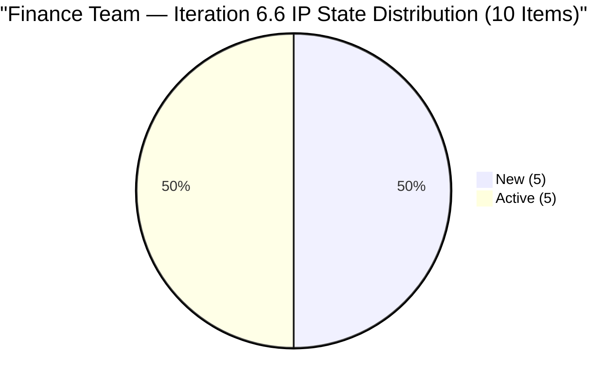
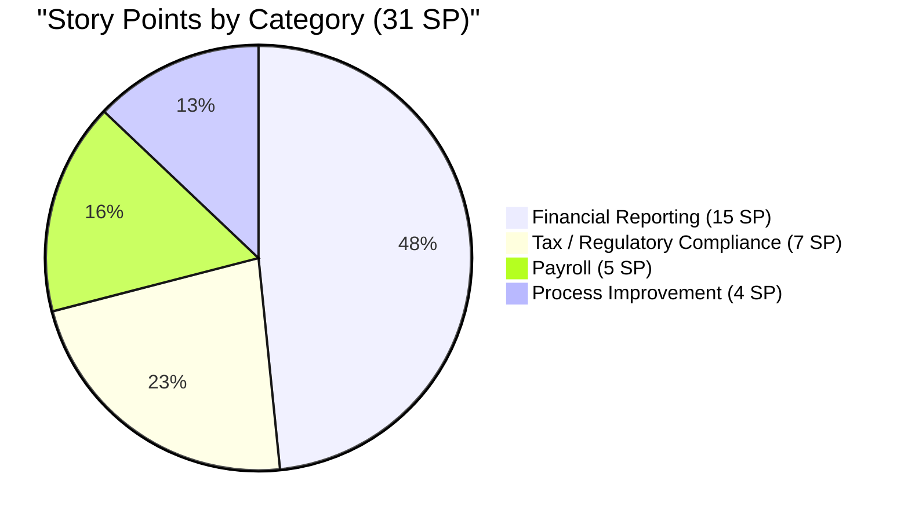

# SAFe Audit Report — Finance Team

**Project:** Jairosoft FINOPS
**Team:** Finance Team
**Iteration:** Iteration 6.6 (IP)
**Iteration Window:** March 23, 2026 – April 5, 2026
**Audit Date:** March 26, 2026 — 16:14 UTC (Day 4 of 14)
**Auditor:** AI EngProd Consultant
**Framework:** SAFe 6.0
**Previous Audit:** AUDIT_20260326_1542.md (Day 4, 15:42 UTC — Score: 89.5/100, Low Risk)

---

## 1. Audit Metadata

| Field | Value |
|---|---|
| **ADO Project** | Jairosoft FINOPS |
| **ADO Project ID** | `e0bb302f-40f9-46c3-8164-6f1acb317d63` |
| **ADO Team** | Finance Team |
| **ADO Team ID** | `1f4b45fa-82e8-4a36-aedc-6c1bc8f51070` |
| **Board URL** | [Finance Team Board](https://dev.azure.com/jairo/Jairosoft%20FINOPS/_boards/board/t/Finance%20Team/Stories%20and%20Deliverables) |
| **Current Iteration** | Iteration 6.6 (IP) |
| **Iteration Path** | `Jairosoft FINOPS\2026-PI6\Iteration 6.6 (IP)` |
| **Iteration Start** | March 23, 2026 |
| **Iteration Finish** | April 5, 2026 |
| **Audit Day** | Day 4 of 14 (29% elapsed) |
| **Overall Score** | **89.5 / 100 — Low Risk** |
| **Previous Audit** | AUDIT_20260326_1542 (Day 4, 89.5/100, Low Risk) |
| **Audit Series** | #16 |
| **Scoring Rubric** | ADO SAFe v1 (six-dimension deterministic scoring) |

**Scope:** Finance Team board only. No other teams, boards, projects, or repositories analyzed.

---

## 2. Executive Summary

This is the **third audit of Iteration 6.6 (IP)** and the **second same-day audit** (following AUDIT_20260326_1542 at 15:42 UTC, approximately 32 minutes prior). The score holds at **89.5/100 (Low Risk)** — unchanged across all three 6.6 audits (Day 3 and Day 4 twice).

**Live data confirms — no changes in the 32-minute gap:**

- Capacity: Grace at 3 h/day (Documentation 2h, Requirements 1h) — confirmed unchanged
- 10 items in Iteration 6.6 (IP), 31 total SP — unchanged
- 5 Active, 5 New, 0 Closed — unchanged
- 3 untouched items (#198635, #198645, #199347) — unchanged, −10 Backlog Refinement penalty sustained
- #200432 and #200446 still in Review under Iteration 6.5 — PO acceptance still pending
- #201448 still orphaned at project root — no iteration, no SP

**Score improvement is available:** Accepting #200432 and #200446 plus assigning #201448 would move Iteration Planning from 76.9 to 100.0, pushing Overall to ~94.1/100.



---

## 3. Previous Audit Delta

**Previous:** AUDIT_20260326_1542 — Day 4, 15:42 UTC

| Metric | Audit #15 (15:42) | **Audit #16 (16:14)** | Delta |
|--------|-------------------|------------------------|-------|
| Overall Score | 89.5/100 | **89.5/100** | 0 |
| Risk Band | Low Risk | **Low Risk** | No change |
| Items Current | 10 | **10** | 0 |
| SP Committed | 31 | **31** | 0 |
| Capacity | 3 h/day | **3 h/day** | No change |
| Untouched | 3 (30%) | **3 (30%)** | No change |
| Items Closed | 0 | **0** | No change |
| Carryover Accepted | 0/2 | **0/2** | No change |

**Delta:** No changes in 32 minutes. This batch audit confirms board state stability.

---

## 4. Current Iteration Snapshot

### 4.1 Iteration Overview

| Metric | Value |
|---|---|
| Sprint Day | Day 4 of 14 (29% elapsed) |
| Items in Iteration | 10 |
| Total SP | 31 |
| Closed | 0 (0%) |
| Active | 5 (50%) |
| New | 5 (50%) |

### 4.2 Team Capacity

| Member | Documentation | Requirements | Deployment | Total/Day |
|---|---|---|---|---|
| Grace | 2h | 1h | 0h | **3 h/day** |

Total sprint capacity: 3 h/day × 14 days = **42 hours** (appropriate for 31 SP).

### 4.3 Current Iteration Work Items (10 Items)

| ID | Title | State | SP | Changed | Untouched? | DoR |
|---|---|---|---|---|---|---|
| 198635 | P&L March 2026 | New | 4 | Mar 18 | **Yes** | Pass |
| 198639 | Balance Sheet March 2026 | New | 3 | Mar 23 | No | Pass |
| 198645 | CFS March 2026 | New | 3 | Mar 19 | **Yes** | Pass |
| 198647 | AFS Submission 2025-2026 | Active | 3 | Mar 24 | No | Pass |
| 199347 | March Finance Presentation | Active | 5 | Mar 18 | **Yes** | Pass |
| 200422 | Work Item Categorization | Active | 2 | Mar 24 | No | Pass |
| 200423 | Automated Quarterly Export | New | 2 | Mar 23 | No | Pass |
| 200465 | Payroll Variance & Audit Report | New | 5 | Mar 23 | No | Pass |
| 201445 | Audit & AFS Finalization | Active | 2 | Mar 25 | No | Pass |
| 201446 | Income Tax Return (ITR) Prep | Active | 2 | Mar 24 | No | Pass |

**Untouched:** 3 items (#198635, #198645, #199347) — exactly 30%, at the penalty boundary.

### 4.4 Non-Current Items on Backlog

| ID | Title | Iter Path | State | SP | Issue |
|---|---|---|---|---|---|
| 200432 | Salary & Earnings Automation | Iter 6.5 | Review | 8 | Carryover — PO acceptance pending |
| 200446 | Standardized Benefits & Deductions | Iter 6.5 | Review | 5 | Carryover — PO acceptance pending |
| 201448 | eAFS Portal Submission | Root | New | — | Orphaned — no iteration, no SP |

---

## 5. Work Item Analysis



### 5.1 Work Categories

| Category | Items | SP | Notes |
|---|---|---|---|
| Financial Reporting | 4 | 15 | P&L, Balance Sheet, CFS, Presentation — Q1 close |
| Tax / Regulatory Compliance | 3 | 7 | AFS, ITR, Audit Finalization — April 15 deadline |
| Payroll | 1 | 5 | Variance & Audit Report |
| Process Improvement | 2 | 4 | Work Item Categorization, Quarterly Export |

### 5.2 Freshness

| Metric | Value | Penalty |
|---|---|---|
| Fresh (< 45 days) | 13/13 (100%) | Base = 100.0 |
| Stale-90 | 0 | None |
| Stale-180 | 0 | None |
| Untouched current | 3/10 (30%) | −10 (> 10%, ≤ 30%) |

---

## 6. SAFe Compliance Scorecard

| # | Dimension | Score | Formula | Evidence | Notes |
|---|---|---|---|---|---|
| 1 | **Iteration Planning** | **76.9** | 10/13 × 100 | 10 of 13 in current iter | 2 in 6.5 Review; 1 orphaned |
| 2 | **Team Capacity** | **100.0** | 1/1 × 100 | Grace: 3 h/day active | Deployment = 0 (appropriate) |
| 3 | **Estimation** | **100.0** | 10/10 × 100 | All 10 items have SP > 0 | Range 2–5 SP; total 31 SP |
| 4 | **DoR Compliance** | **100.0** | 10/10 × 100 | All 10 pass Desc ≥ 30 AND AC ≥ 20 | Structured format, testable AC |
| 5 | **Work Item Balance** | **70.0** | 100 − 30 | 100% User Stories (dominant > 60%) | No Spikes or Enablers |
| 6 | **Backlog Refinement** | **90.0** | 100 − 10 | 13/13 fresh; 3/10 untouched (30%) | −10 for untouched > 10% |
| | **Overall** | **89.5** | avg(6 dims) | | **Low Risk (≥ 80)** |

### Score Computation

```
Iteration Planning:  round(10/13 × 100, 1) = 76.9
Team Capacity:       round(1/1 × 100, 1)   = 100.0
Estimation:          round(10/10 × 100, 1)  = 100.0
DoR Compliance:      round(10/10 × 100, 1)  = 100.0
Work Item Balance:   100 − 30               = 70.0
Backlog Refinement:  100.0 − 10             = 90.0
  (stale90=0%; stale180=0; untouched=30% → −10 only)

Overall: (76.9 + 100.0 + 100.0 + 100.0 + 70.0 + 90.0) / 6 = 89.5
Risk Band: Low Risk (≥ 80)
```

### Score History — Iteration 6.6 (IP)

| Audit | Date | Day | Score | Key Change |
|---|---|---|---|---|
| AUDIT_2026-03-25_024753 | Mar 25 | Day 3 | 89.5 | First 6.6 audit; capacity = 0 |
| AUDIT_20260326_1542 | Mar 26 | Day 4 | 89.5 | Capacity 0→3h; #201445 Active |
| **AUDIT_20260326_1614** | **Mar 26** | **Day 4** | **89.5** | **Batch audit; no board changes** |

---

## 7. Dimension Findings

### 7.1 Iteration Planning (76.9/100)

10 of 13 items assigned to current iteration. Remaining 3:

- **#200432** (8 SP, Review, 6.5): All tasks complete; awaiting PO acceptance. Now 4+ days post-sprint-close.
- **#200446** (5 SP, Review, 6.5): Same situation. 4+ days post-sprint-close.
- **#201448** (New, root): Created March 23 with no SP and no iteration. Thematically linked to active AFS cluster.

Resolving all three would bring this dimension to 100.0 and push Overall to ~94.1.

### 7.2 Team Capacity (100.0/100)

Grace at 3 h/day (Doc 2h + Req 1h). 42 hours total capacity for 31 SP. Deployment = 0 is appropriate for finance-domain work.

### 7.3 Estimation (100.0/100)

All 10 items estimated. Size distribution: 40% small (2 SP), 40% medium (3–4 SP), 20% large (5 SP).

### 7.4 DoR Compliance (100.0/100)

All 10 pass. Structured user story format, testable AC on every item. Regulatory items (#198647, #201446, #201445) include BIR/SEC-specific compliance checklists.

### 7.5 Work Item Balance (70.0/100)

100% User Stories triggers −30 penalty. Process improvement items (#200422, #200423) could be retyped as Enablers in a future iteration to reduce this penalty.

### 7.6 Backlog Refinement (90.0/100)

Base 100.0. Penalty: −10 for untouched ratio at 30%. Items #198635 (P&L, Mar 18) and #198645 (CFS, Mar 19) have been unchanged for 7–8 days. If either is touched or moved to Active, the untouched count drops to 2 (20%), maintaining the −10 penalty. If all 3 are touched, the penalty drops to 0 and Backlog Refinement reaches 100.0.

---

## 8. Risks and Bottlenecks

### RISK 1 — CRITICAL: Single Team Member (Bus Factor = 1, Persistent)

Grace is the sole Finance Team member. All 10 items assigned to her. 31 SP at 42 hours capacity (≈0.74 SP/hour). No backup capacity exists.

### RISK 2 — MAJOR: Iteration 6.5 Carryover Not Accepted (4+ Days)

# 200432 (8 SP) and #200446 (5 SP) remain in Review. 3rd consecutive audit flagging this. Official 6.5 velocity is understated. **Action: Ramon (PO) to accept immediately.**

### RISK 3 — MODERATE: #201448 Orphaned (Day 4, 3 Days)

eAFS Portal Submission item has no story points and no iteration. Thematically critical to the AFS/BIR compliance cluster.

### RISK 4 — MODERATE: Untouched Items at 30% Boundary

Exactly at the −10 threshold. One more untouched item would not worsen the penalty. Touching all 3 would eliminate it.

### RISK 5 — MODERATE: Tax Compliance Deadline (April 15)

ITR (#201446) has an external deadline 10 days after sprint end. Must be prioritized within the sprint.

### RISK 6 — LOW: Zero Closures Day 4

With 31 SP over 10 remaining days: ~3.1 SP/day required. Achievable with current capacity.

---

## 9. Prioritized Recommendations

| Priority | Action | Owner | Target | Impact |
|---|---|---|---|---|
| 1 | **Accept #200432 and #200446** — PO review and close 6.5 carryover | Ramon (PO) | Today | Iter Planning 76.9→92.3 (or 100 with #201448) |
| 2 | **Assign and estimate #201448** — triage into 6.6 or defer | Grace / Ramon | Today | Eliminates orphaned item |
| 3 | **Begin closing Active items** — start with #198647, #200422, #201446 | Grace | By Day 6 | Establishes burndown momentum |
| 4 | **Touch #198635 and #198645** — move to Active to reset ChangedDate | Grace | By Day 7 (Mar 29) | Prevents Backlog Refinement from dropping |
| 5 | **Prioritize ITR (#201446)** — April 15 external deadline | Grace | By Apr 10 | Regulatory compliance |
| 6 | **Retype #200422, #200423 as Enablers** | Grace / Ramon | Next iter | Reduces Work Item Balance penalty |

---

## 10. Evidence Gaps and Limitations

| Gap | Impact | Notes |
|---|---|---|
| 32-minute gap between Audit #15 and #16 | Minimal delta; confirmed no changes | Batch audit run |
| #200432 and #200446 in ambiguous Review state | 13 SP of completed work unclosed | PO action required |
| #201448 no SP or iteration | Cannot include in scoring | Triage required |
| No task-level breakdown | Cannot assess sub-story work | Day 4; tasks may be in creation |
| No GitHub repos scoped | No code delivery evidence | Finance work is non-code |

---

*Report generated: March 26, 2026 16:14 UTC | SAFe 6.0 | Jairosoft FINOPS — Finance Team*
*Iteration 6.6 (IP): Mar 23 – Apr 5, 2026 | Day 4 of 14 | Audit #16 in series*
*Score: 89.5/100 (Low Risk) | Previous: AUDIT_20260326_1542 (89.5/100)*
