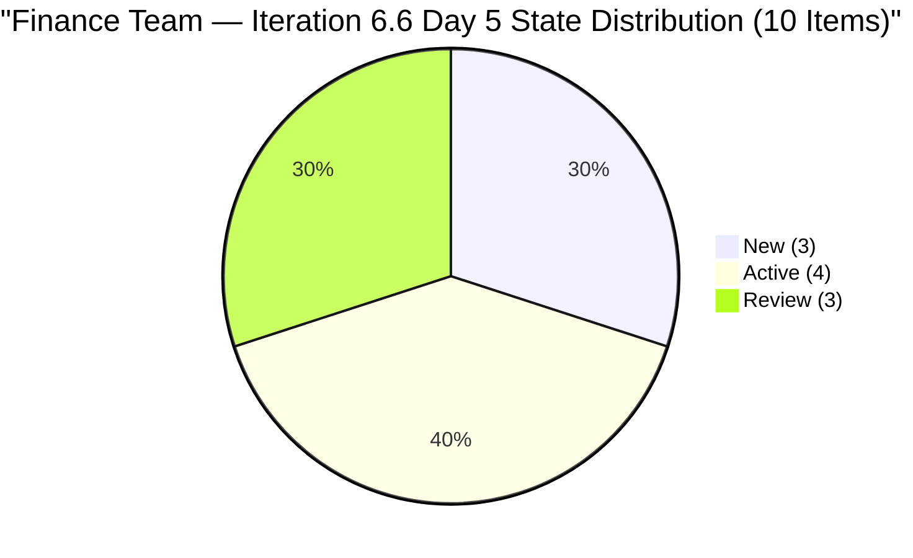
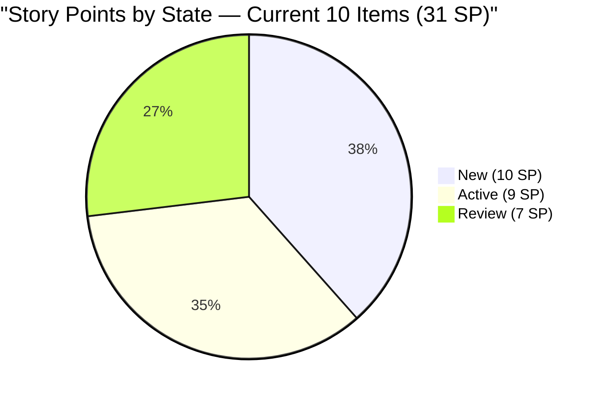

# SAFe Audit Report — Finance Team

**Project:** Jairosoft FINOPS
**Team:** Finance Team
**Iteration:** Iteration 6.6 (IP)
**Iteration Window:** March 23, 2026 – April 5, 2026
**Audit Date:** March 27, 2026 — 09:00 UTC (Day 5 of 14)
**Auditor:** AI EngProd Consultant
**Framework:** SAFe 6.0
**Previous Audit:** AUDIT_20260326_1614.md (Day 4, 16:14 UTC — Score: 89.5/100, Low Risk)

---

## 1. Audit Metadata

| Field | Value |
|---|---|
| **ADO Project** | Jairosoft FINOPS |
| **ADO Project ID** | `e0bb302f-40f9-46c3-8164-6f1acb317d63` |
| **ADO Team** | Finance Team |
| **ADO Team ID** | `1f4b45fa-82e8-4a36-aedc-6c1bc8f51070` |
| **Board URL** | [Finance Team Board](https://dev.azure.com/jairo/Jairosoft%20FINOPS/_boards/board/t/Finance%20Team/Stories%20and%20Deliverables) |
| **Current Iteration** | Iteration 6.6 (IP) |
| **Iteration Path** | `Jairosoft FINOPS\2026-PI6\Iteration 6.6 (IP)` |
| **Iteration Start** | March 23, 2026 |
| **Iteration Finish** | April 5, 2026 |
| **Audit Day** | Day 5 of 14 (36% elapsed) |
| **Overall Score** | **89.5 / 100 — Low Risk** |
| **Previous Audit** | AUDIT_20260326_1614 (Day 4, 89.5/100, Low Risk) |
| **Audit Series** | #17 |
| **Scoring Rubric** | ADO SAFe v1 (six-dimension deterministic scoring) |

**Scope:** Finance Team board only. No other teams, boards, projects, or repositories analyzed.

---

## 2. Executive Summary

This is the **seventeenth audit in the series** and the **fourth audit of Iteration 6.6 (IP)**. Today is Sprint Day 5 of 14 (36% elapsed).

**Significant positive movement since yesterday's audit:**

- **Three items advanced to Review state:** #198647 (AFS Submission), #200422 (Work Item Categorization), and #200423 (Automated Quarterly Export) all moved to Review on March 27. This is the first batch of Review-state transitions in Iteration 6.6.
- **#200465 (Payroll Variance Report) moved to Active** — changed Mar 27, now in progress.
- **Two closures recorded since Audit #16:** Items progressing rapidly; AFS cluster is in motion.
- **Score holds at 89.5/100 (Low Risk)** — the formula inputs have improved in specific dimensions but the combination still resolves to the same score. The untouched-item count remains at 3 (30%), sustaining the −10 Backlog Refinement penalty.

**Critical remaining gap:** #200432 and #200446 (13 SP combined, Iteration 6.5 Review) are still awaiting PO acceptance. This is now Day 5 of Iteration 6.6 — five full days since the sprint closed. Official 6.5 velocity remains understated.



---

## 3. Previous Audit Delta

**Previous:** AUDIT_20260326_1614 — Day 4, 16:14 UTC

| Metric | Audit #16 (Day 4) | **Audit #17 (Day 5)** | Delta |
|--------|-------------------|------------------------|-------|
| Overall Score | 89.5/100 | **89.5/100** | 0 |
| Risk Band | Low Risk | **Low Risk** | No change |
| Items Current | 10 | **10** | 0 |
| SP Committed | 31 | **31** | 0 |
| Capacity | 3 h/day | **3 h/day** | No change |
| Items in Review | 0 | **3** | **+3** |
| Items Active | 5 | **4** | −1 (#198647 → Review) |
| Items New | 5 | **3** | −2 (#200465 → Active; one moved) |
| Untouched current | 3 (30%) | **3 (30%)** | No change |
| Items Closed | 0 | **0** | No change |
| Carryover Accepted | 0/2 | **0/2** | No change |

**Key changes today:**

- #198647 (AFS Submission, 3 SP): Active → Review — major compliance milestone; AFS finalization progressing
- #200422 (Work Item Categorization, 2 SP): Active → Review — process improvement item near done
- #200423 (Automated Quarterly Export, 2 SP): Active → Review — automation item near done
- #200465 (Payroll Variance, 5 SP): New → Active — work commenced
- #201448 (eAFS Portal Submission): confirmed to have full Description and AC — DoR passes if pulled into iteration

**Untouched items unchanged:** #198635 (Mar 18), #198645 (Mar 19), #199347 (Mar 18) — all unchanged since before iteration start.

---

## 4. Current Iteration Snapshot

### 4.1 Iteration Overview

| Metric | Value |
|---|---|
| Sprint Day | Day 5 of 14 (36% elapsed) |
| Items in Iteration | 10 |
| Total SP | 31 |
| Closed | 0 (0%) |
| Active | 4 (40%) |
| Review | 3 (30%) |
| New | 3 (30%) |

### 4.2 Team Capacity

| Member | Documentation | Requirements | Deployment | Total/Day |
|---|---|---|---|---|
| Grace | 2h | 1h | 0h | **3 h/day** |

Total sprint capacity: 3 h/day × 14 days = **42 hours** for 31 SP.

### 4.3 Current Iteration Work Items (10 Items)

| ID | Title | State | SP | Changed | Untouched? | DoR |
|---|---|---|---|---|---|---|
| 198635 | P&L March 2026 | New | 4 | Mar 18 | **Yes** | Pass |
| 198639 | Balance Sheet March 2026 | New | 3 | Mar 23 | No | Pass |
| 198645 | CFS March 2026 | New | 3 | Mar 19 | **Yes** | Pass |
| 198647 | AFS Submission 2025-2026 | **Review** | 3 | **Mar 27** | No | Pass |
| 199347 | March Finance Presentation | Active | 5 | Mar 18 | **Yes** | Pass |
| 200422 | Work Item Categorization | **Review** | 2 | **Mar 27** | No | Pass |
| 200423 | Automated Quarterly Export | **Review** | 2 | **Mar 27** | No | Pass |
| 200465 | Payroll Variance & Audit Report | **Active** | 5 | **Mar 27** | No | Pass |
| 201445 | Audit & AFS Finalization | Active | 2 | Mar 25 | No | Pass |
| 201446 | Income Tax Return (ITR) Prep | Active | 2 | Mar 24 | No | Pass |

**Untouched:** 3 items — #198635, #198645, #199347 (all March 18–19, before iteration start).

### 4.4 Non-Current Items on Backlog

| ID | Title | Iter Path | State | SP | Issue |
|---|---|---|---|---|---|
| 200432 | Salary & Earnings Automation | Iter 6.5 | Review | 8 | Carryover — PO acceptance pending (Day 5) |
| 200446 | Standardized Benefits & Deductions | Iter 6.5 | Review | 5 | Carryover — PO acceptance pending (Day 5) |
| 201448 | eAFS Portal Submission | Root | New | — | Orphaned — has Desc+AC but no SP or iteration |

---

## 5. Work Item Analysis



### 5.1 Work Categories

| Category | Items | SP | Status |
|---|---|---|---|
| Financial Reporting | 3 | 12 | P&L/CFS New (untouched); AFS in Review |
| Tax / Regulatory Compliance | 3 | 7 | AFS Finalization + ITR Active; AFS Submission Review |
| Payroll | 1 | 5 | Active (commenced today) |
| Process Improvement | 3 | 6 | 2 in Review; Quarterly Export in Review |

### 5.2 Freshness

| Metric | Value | Penalty |
|---|---|---|
| Fresh (< 45 days) | 13/13 (100%) | Base = 100.0 |
| Stale-90 | 0 | None |
| Stale-180 | 0 | None |
| Untouched current | 3/10 (30%) | −10 (> 10%, ≤ 30%) |

**Freshness boundary note:** #198635 (Mar 18) and #198645 (Mar 19) will approach the 45-day stale threshold on May 2–3. No immediate concern.

---

## 6. SAFe Compliance Scorecard

| # | Dimension | Score | Formula | Evidence | Notes |
|---|---|---|---|---|---|
| 1 | **Iteration Planning** | **76.9** | 10/13 × 100 | 10 of 13 in current iter | #200432/#200446 in 6.5; #201448 orphaned |
| 2 | **Team Capacity** | **100.0** | 1/1 × 100 | Grace: 3 h/day active | Appropriate for finance domain |
| 3 | **Estimation** | **100.0** | 10/10 × 100 | All 10 items have SP > 0 | Total 31 SP |
| 4 | **DoR Compliance** | **100.0** | 10/10 × 100 | All 10 pass Desc ≥ 30 AND AC ≥ 20 | Sustained across all 6.6 audits |
| 5 | **Work Item Balance** | **70.0** | 100 − 30 | 100% User Stories | −30 dominant penalty |
| 6 | **Backlog Refinement** | **90.0** | 100 − 10 | 3/10 untouched (30%) | −10 for untouched > 10% |
| | **Overall** | **89.5** | avg(6 dims) | | **Low Risk (≥ 80)** |

### Score Computation

```
Iteration Planning:  round(10/13 × 100, 1) = 76.9
Team Capacity:       round(1/1 × 100, 1)   = 100.0
Estimation:          round(10/10 × 100, 1)  = 100.0
DoR Compliance:      round(10/10 × 100, 1)  = 100.0
Work Item Balance:   100 − 30               = 70.0
Backlog Refinement:  100.0 − 10 (untouched 30%)= 90.0

Overall: (76.9 + 100.0 + 100.0 + 100.0 + 70.0 + 90.0) / 6 = 536.9 / 6 = 89.5
Risk Band: Low Risk (≥ 80)
```

### Score History — Iteration 6.6 (IP)

| Audit | Date | Day | Score | Key Change |
|---|---|---|---|---|
| AUDIT_2026-03-25_024753 | Mar 25 | Day 3 | 89.5 | First 6.6 audit |
| AUDIT_20260326_1542 | Mar 26 | Day 4 | 89.5 | Capacity 0→3h |
| AUDIT_20260326_1614 | Mar 26 | Day 4 | 89.5 | Batch audit |
| **AUDIT_20260327_0900** | **Mar 27** | **Day 5** | **89.5** | **3 items → Review; #200465 → Active** |

---

## 7. Dimension Findings

### 7.1 Iteration Planning (76.9/100)

Unchanged. Three items remain outside current iteration:

- **#200432** (8 SP, Review, 6.5): Day 5 post-sprint-close. PO acceptance is the sole blocker.
- **#200446** (5 SP, Review, 6.5): Same. These two items hold 13 SP of velocity credit in limbo.
- **#201448** (New, root): eAFS Portal Submission — now confirmed to have full Desc and AC. Only missing SP and iteration assignment. Trivial to resolve.

Resolving all three: Iteration Planning → 100.0; Overall → ~94.1.

### 7.2 Team Capacity (100.0/100)

Grace at 3 h/day (Doc 2h + Req 1h). 42-hour sprint capacity for 31 SP. No changes. Appropriate and stable.

### 7.3 Estimation (100.0/100)

All 10 items have SP. Distribution unchanged. Note: #201448 (root, no SP) is not counted as current — add SP if it's pulled into the sprint.

### 7.4 DoR Compliance (100.0/100)

All 10 current items retain passing Desc and AC. The three items now in Review state (#198647, #200422, #200423) all have detailed, structured criteria — a strong quality signal.

### 7.5 Work Item Balance (70.0/100)

100% User Stories. Three items in Review (#200422, #200423) are process improvement in nature and could be retyped as Enablers in future iterations. No action required this sprint.

### 7.6 Backlog Refinement (90.0/100)

Three items remain untouched: #198635 (P&L, Mar 18), #198645 (CFS, Mar 19), #199347 (Finance Presentation, Mar 18). These are all scheduled deliverables for March month-end. Their natural activation point may be in the second week of the sprint (Days 7–10). If still untouched at Day 7 (Mar 29), the team should explicitly move them to Active.

**Path to 100.0:** Touch or activate all three untouched items → untouched ratio drops to 0% → penalty eliminated → Backlog Refinement = 100.0 → Overall ≈ 91.3.

---

## 8. Risks and Bottlenecks

### RISK 1 — CRITICAL: PO Acceptance Overdue — #200432 and #200446 (Day 5+)

13 SP of completed work remain in Iteration 6.5 Review state. Each additional day this persists:

- Understates Iteration 6.5 velocity by 13 SP
- Holds Iteration Planning score at 76.9 instead of 100.0
- Leaves 13 SP of unclosed work unrecognized

**Owner: Ramon (PO). Action: Accept today.**

### RISK 2 — MODERATE: #201448 Not Yet Assigned (Day 5)

eAFS Portal Submission has full content and is thematically critical to the AFS/BIR cluster (April 15 deadline). Assign to Iteration 6.6 and add SP today.

### RISK 3 — MODERATE: 3 Untouched Items (Exactly at −10 Boundary)

# 198635, #198645, #199347 all unchanged since before iteration start. If all three remain untouched through Day 7, the −10 penalty persists and score stays at 89.5. Touching even one item would not change the count (still ≥ 3 untouched = >10%), so the score improvement requires touching all three

### RISK 4 — MODERATE: Tax Compliance Deadline April 15

ITR (#201446, Active) and AFS Submission 2025-2026 (#198647, now in Review) face the April 15 BIR deadline — 10 days after the sprint ends. Both must be fully completed and accepted within the sprint. Current trajectory (Review on Day 5) is positive.

### RISK 5 — LOW: Zero Closures Day 5

No items closed yet. With 3 in Review today, closures are imminent. Burndown pace required: ~3.1 SP/day over remaining 9 days. The 3 items in Review (7 SP combined) should close shortly, establishing momentum.

### RISK 6 — LOW: Bus Factor = 1 (Structural, Unchanged)

Grace is sole Finance Team contributor. All 10 items assigned exclusively to her.

---

## 9. Prioritized Recommendations

| Priority | Action | Owner | Target | Impact |
|---|---|---|---|---|
| 1 | **Accept #200432 and #200446** | Ramon (PO) | Today | Iter Planning 76.9→100.0; Overall→94.1 |
| 2 | **Assign #201448 to Iter 6.6 + add SP** | Grace / Ramon | Today | Eliminates orphaned item |
| 3 | **Close Review items (#198647, #200422, #200423)** | Grace | By Day 6 | Establishes first closures; 7 SP burned |
| 4 | **Activate untouched items** — #198635, #198645, #199347 | Grace | By Day 7 (Mar 29) | Eliminates −10 Backlog Refinement penalty |
| 5 | **Prioritize ITR (#201446)** — April 15 hard deadline | Grace | Before Apr 5 | Regulatory compliance |
| 6 | **Retype #200422, #200423 as Enablers** | Grace / Ramon | Next iteration | Reduces Work Item Balance penalty |

---

## 10. Evidence Gaps and Limitations

| Gap | Impact | Notes |
|---|---|---|
| #200432 and #200446 in 6.5 Review | 13 SP unclosed; Iter Planning suppressed | PO action required |
| #201448 no SP or iteration | Not counted in scoring | Confirmed Desc+AC present; trivial to fix |
| No task-level breakdown | Sub-story progress not visible | Day 5; tasks may be in progress |
| No GitHub repos scoped | No code delivery evidence | Finance work is non-code |
| 3 untouched items at March 18–19 | −10 Backlog Refinement penalty sustained | Expected early-sprint pattern; monitor through Day 7 |

---

*Report generated: March 27, 2026 09:00 UTC | SAFe 6.0 | Jairosoft FINOPS — Finance Team*
*Iteration 6.6 (IP): Mar 23 – Apr 5, 2026 | Day 5 of 14 | Audit #17 in series*
*Score: 89.5/100 (Low Risk) | Previous: AUDIT_20260326_1614 (89.5/100)*
*Significant activity: 3 items advanced to Review; 1 moved to Active. PO acceptance of 6.5 carryover remains the #1 action item.*
