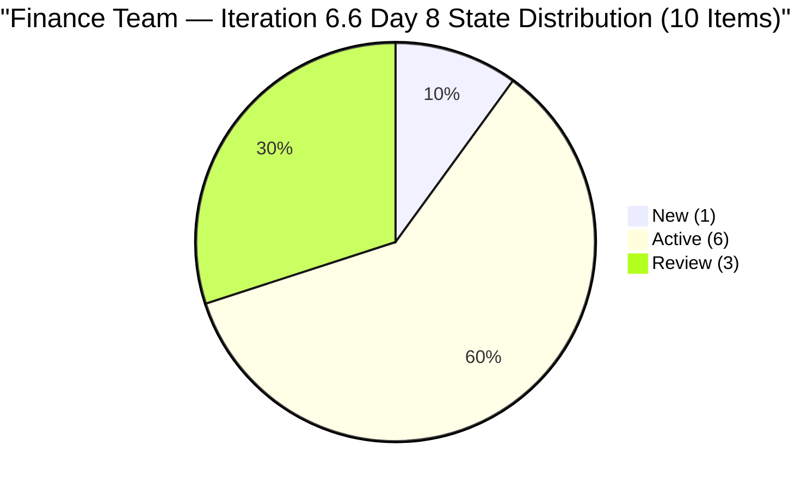
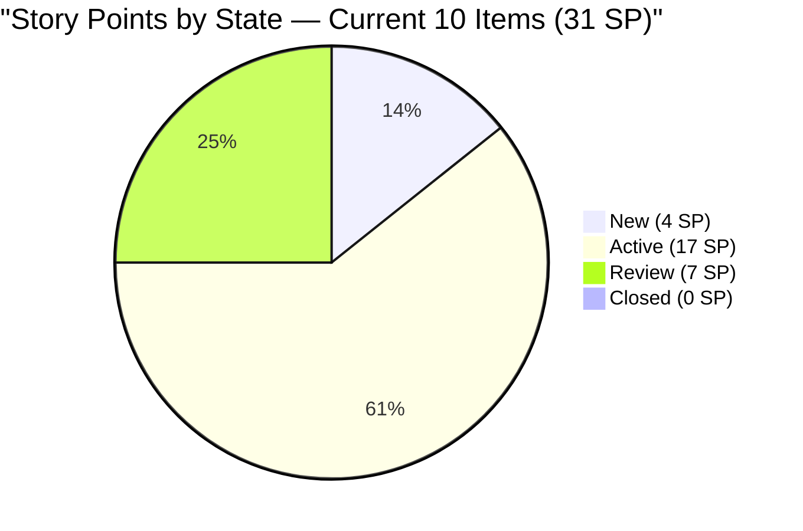

# SAFe Audit Report — Finance Team

**Project:** Jairosoft FINOPS
**Team:** Finance Team
**Iteration:** Iteration 6.6 (IP)
**Iteration Window:** March 23, 2026 – April 5, 2026
**Audit Date:** March 30, 2026 — 09:00 UTC (Day 8 of 14)
**Auditor:** AI EngProd Consultant
**Framework:** SAFe 6.0
**Previous Audit:** AUDIT_20260327_0900.md (Day 5, 09:00 UTC — Score: 89.5/100, Low Risk)

---

## 1. Audit Metadata

| Field | Value |
|---|---|
| **ADO Project** | Jairosoft FINOPS |
| **ADO Project ID** | `e0bb302f-40f9-46c3-8164-6f1acb317d63` |
| **ADO Team** | Finance Team |
| **ADO Team ID** | `1f4b45fa-82e8-4a36-aedc-6c1bc8f51070` |
| **Board URL** | [Finance Team Board](https://dev.azure.com/jairo/Jairosoft%20FINOPS/_boards/board/t/Finance%20Team/Stories%20and%20Deliverables) |
| **Current Iteration** | Iteration 6.6 (IP) |
| **Iteration Path** | `Jairosoft FINOPS\2026-PI6\Iteration 6.6 (IP)` |
| **Iteration Start** | March 23, 2026 |
| **Iteration Finish** | April 5, 2026 |
| **Audit Day** | Day 8 of 14 (57% elapsed) |
| **Overall Score** | **89.5 / 100 — Low Risk** |
| **Previous Audit** | AUDIT_20260327_0900 (Day 5, 89.5/100, Low Risk) |
| **Audit Series** | #18 |
| **Scoring Rubric** | ADO SAFe v1 (six-dimension deterministic scoring) |

**Scope:** Finance Team board only. No other teams, boards, projects, or repositories analyzed.

---

## 2. Executive Summary

This is the **eighteenth audit in the series** and the **fifth audit of Iteration 6.6 (IP)**. Today is Sprint Day 8 of 14 (57% elapsed).

**Positive board movement since Audit #17:**

- **Two previously untouched items activated:** #198639 (Balance Sheet March 2026) and #198645 (CFS March 2026) both moved from New to Active on March 29. This reduces the untouched count from 3 to 2 — a direct response to the Day 7 activation recommendation from the previous audit.
- **Three items remain in Review** (#198647, #200422, #200423) — unchanged since March 27. These should be approaching closure.
- **Score holds at 89.5/100 (Low Risk)** — the untouched ratio dropped from 30% to 20%, but both values trigger the same -10 penalty (> 10% threshold). The score will improve only when all untouched items are touched.

**Persistent gaps:**
- #200432 and #200446 (13 SP combined, Iteration 6.5 Review) still awaiting PO acceptance — now **Day 8 post-sprint-close**
- #201448 (eAFS Portal Submission) remains orphaned at root with no SP or iteration assignment
- #198635 (P&L March 2026) and #199347 (March Finance Presentation) remain untouched since March 18



---

## 3. Previous Audit Delta

**Previous:** AUDIT_20260327_0900 — Day 5, 09:00 UTC

| Metric | Audit #17 (Day 5) | **Audit #18 (Day 8)** | Delta |
|--------|-------------------|------------------------|-------|
| Overall Score | 89.5/100 | **89.5/100** | 0 |
| Risk Band | Low Risk | **Low Risk** | No change |
| Items Current | 10 | **10** | 0 |
| SP Committed | 31 | **31** | 0 |
| Capacity | 3 h/day | **3 h/day** | No change |
| Items in Review | 3 | **3** | 0 |
| Items Active | 4 | **6** | **+2** |
| Items New | 3 | **1** | **-2** |
| Untouched current | 3 (30%) | **2 (20%)** | **-1** |
| Items Closed | 0 | **0** | No change |
| Carryover Accepted | 0/2 | **0/2** | No change |

**Key changes since Audit #17:**
- **#198639 (Balance Sheet March 2026, 3 SP):** New -> Active, changed Mar 29 — month-end reporting commenced
- **#198645 (CFS March 2026, 3 SP):** New -> Active, changed Mar 29 — cash flow statement work commenced
- **#198635 (P&L March 2026, 4 SP):** Remains New, unchanged since Mar 18 — now the sole untouched New item
- **#199347 (March Finance Presentation, 5 SP):** Remains Active but untouched since Mar 18

**Resolved from prior recommendations:**
- Recommendation #4 from Audit #17 ("Activate untouched items by Day 7") was partially addressed: 2 of 3 items activated on Mar 29

---

## 4. Current Iteration Snapshot

### 4.1 Iteration Overview

| Metric | Value |
|---|---|
| Sprint Day | Day 8 of 14 (57% elapsed) |
| Items in Iteration | 10 |
| Total SP | 31 |
| Closed | 0 (0%) |
| Active | 6 (60%) |
| Review | 3 (30%) |
| New | 1 (10%) |

### 4.2 Team Capacity

| Member | Documentation | Requirements | Deployment | Total/Day |
|---|---|---|---|---|
| Grace | 2h | 1h | 0h | **3 h/day** |

Total sprint capacity: 3 h/day x 14 days = **42 hours** for 31 SP.

### 4.3 Current Iteration Work Items (10 Items)

| ID | Title | State | SP | Changed | Untouched? | DoR |
|---|---|---|---|---|---|---|
| 198635 | P&L March 2026 | New | 4 | Mar 18 | **Yes** | Pass |
| 198639 | Jairosoft Balance Sheet March 2026 | **Active** | 3 | **Mar 29** | No | Pass |
| 198645 | CFS March 2026 | **Active** | 3 | **Mar 29** | No | Pass |
| 198647 | AFS Submission 2025-2026 | Review | 3 | Mar 27 | No | Pass |
| 199347 | March Jairosoft Finance Presentation | Active | 5 | Mar 18 | **Yes** | Pass |
| 200422 | Work Item Categorization | Review | 2 | Mar 27 | No | Pass |
| 200423 | Automated Quarterly Export | Review | 2 | Mar 27 | No | Pass |
| 200465 | Payroll Variance & Audit Report | Active | 5 | Mar 27 | No | Pass |
| 201445 | Audit & AFS Finalization | Active | 2 | Mar 25 | No | Pass |
| 201446 | Income Tax Return (ITR) Preparation | Active | 2 | Mar 24 | No | Pass |

**Untouched:** 2 items — #198635 (Mar 18), #199347 (Mar 18). Down from 3 in prior audit.

### 4.4 Non-Current Items on Backlog

| ID | Title | Iter Path | State | SP | Issue |
|---|---|---|---|---|---|
| 200432 | Salary & Earnings Automation | Iter 6.5 | Review | 8 | Carryover — PO acceptance pending (Day 8) |
| 200446 | Standardized Benefits & Deductions | Iter 6.5 | Review | 5 | Carryover — PO acceptance pending (Day 8) |
| 201448 | eAFS Portal Submission | Root | New | — | Orphaned — has Desc+AC but no SP or iteration |

---

## 5. Work Item Analysis



### 5.1 Work Categories

| Category | Items | SP | Status |
|---|---|---|---|
| Financial Reporting | 3 | 12 | P&L still New; Balance Sheet + CFS now Active |
| Tax / Regulatory Compliance | 3 | 7 | AFS Submission in Review; AFS Finalization + ITR Active |
| Payroll | 1 | 5 | Active (since Mar 27) |
| Process Improvement | 3 | 7 | 2 in Review (Mar 27); Presentation Active (untouched) |

### 5.2 Freshness

| Metric | Value | Penalty |
|---|---|---|
| Fresh (< 45 days) | 13/13 (100%) | Base = 100.0 |
| Stale-90 | 0 | None |
| Stale-180 | 0 | None |
| Untouched current | 2/10 (20%) | -10 (> 10%) |

### 5.3 Sprint Progress — Day 8 Burn Assessment

| Metric | Value |
|---|---|
| SP Closed | 0 of 31 (0%) |
| SP in Review | 7 of 31 (22.6%) |
| SP Active | 17 of 31 (54.8%) |
| SP New | 4 of 31 (12.9%) |
| Sprint Elapsed | 57% |
| Remaining Days | 6 |
| Required Burn Rate | 5.2 SP/day to close all |

---

## 6. SAFe Compliance Scorecard

| # | Dimension | Score | Formula | Evidence | Notes |
|---|---|---|---|---|---|
| 1 | **Iteration Planning** | **76.9** | 10/13 x 100 | 10 of 13 in current iter | #200432/#200446 in 6.5; #201448 orphaned |
| 2 | **Team Capacity** | **100.0** | 1/1 x 100 | Grace: 3 h/day active | Stable and appropriate |
| 3 | **Estimation** | **100.0** | 10/10 x 100 | All 10 items have SP > 0 | Total 31 SP |
| 4 | **DoR Compliance** | **100.0** | 10/10 x 100 | All 10 pass Desc >= 30 AND AC >= 20 | Sustained across all 6.6 audits |
| 5 | **Work Item Balance** | **70.0** | 100 - 30 | 100% User Stories | -30 dominant penalty |
| 6 | **Backlog Refinement** | **90.0** | 100 - 10 | 2/10 untouched (20%) | -10 for untouched > 10% |
| | **Overall** | **89.5** | avg(6 dims) | | **Low Risk (>= 80)** |

### Score Computation

```
Iteration Planning:  round(10/13 x 100, 1) = 76.9
Team Capacity:       round(1/1 x 100, 1)   = 100.0
Estimation:          round(10/10 x 100, 1)  = 100.0
DoR Compliance:      round(10/10 x 100, 1)  = 100.0
Work Item Balance:   100 - 30               = 70.0
Backlog Refinement:  100.0 - 10 (untouched 20%) = 90.0

Overall: (76.9 + 100.0 + 100.0 + 100.0 + 70.0 + 90.0) / 6 = 536.9 / 6 = 89.5
Risk Band: Low Risk (>= 80)
```

### Score History — Iteration 6.6 (IP)

| Audit | Date | Day | Score | Key Change |
|---|---|---|---|---|
| AUDIT_2026-03-25_024753 | Mar 25 | Day 3 | 89.5 | First 6.6 audit |
| AUDIT_20260326_1542 | Mar 26 | Day 4 | 89.5 | Capacity 0->3h |
| AUDIT_20260326_1614 | Mar 26 | Day 4 | 89.5 | Batch audit |
| AUDIT_20260327_0900 | Mar 27 | Day 5 | 89.5 | 3 items -> Review; #200465 -> Active |
| **AUDIT_20260330_0900** | **Mar 30** | **Day 8** | **89.5** | **#198639 + #198645 -> Active; untouched 3->2** |

---

## 7. Dimension Findings

### 7.1 Iteration Planning (76.9/100)

Unchanged structurally. Three items remain outside current iteration:
- **#200432** (8 SP, Review, 6.5): Day 8 post-sprint-close. PO acceptance is now critically overdue.
- **#200446** (5 SP, Review, 6.5): Same situation. Combined 13 SP of velocity credit in limbo.
- **#201448** (New, root): eAFS Portal Submission — has full Desc and AC but no SP or iteration assignment. Thematically critical to the AFS/BIR cluster with the April 15 deadline approaching.

Resolving all three: Iteration Planning -> 100.0; Overall -> ~91.2.

### 7.2 Team Capacity (100.0/100)

Grace at 3 h/day (Doc 2h + Req 1h). Stable across all Iteration 6.6 audits. No issues.

### 7.3 Estimation (100.0/100)

All 10 current items have SP. Perfect. Note: #201448 (root) still has no SP — add if pulled in.

### 7.4 DoR Compliance (100.0/100)

All 10 current items pass DoR with detailed, structured descriptions and acceptance criteria. The Finance Team maintains the highest DoR quality across all audited teams.

### 7.5 Work Item Balance (70.0/100)

100% User Stories. The process improvement items (#200422, #200423) could be retyped as Enablers. No action required this sprint — this is a structural limitation that would require work item type diversity.

### 7.6 Backlog Refinement (90.0/100)

Improvement: untouched count dropped from 3 to 2 after #198639 and #198645 were activated on Mar 29. However, the -10 penalty persists because 20% > 10%.

**Path to 100.0:** Touch both remaining untouched items (#198635 and #199347) -> untouched ratio = 0% -> penalty eliminated -> Backlog Refinement = 100.0 -> Overall = 91.2.

---

## 8. Risks and Bottlenecks

### RISK 1 — CRITICAL: PO Acceptance 8 Days Overdue — #200432 and #200446

13 SP of completed work remain in Iteration 6.5 Review state. This is now 8 days past sprint close — the longest this carryover has persisted. Each day:
- Understates Iteration 6.5 velocity by 13 SP
- Holds Iteration Planning at 76.9 instead of 100.0
- Blocks formal closure of completed work

**Owner: Ramon (PO). Action: Accept immediately.**

### RISK 2 — HIGH: Zero Closures at Sprint Midpoint (Day 8)

No items have been closed in 8 days. Three items have been in Review since March 27 (3 days). At 57% elapsed with 0% burned, the sprint is at risk of compressed end-of-sprint closure. Required burn rate: 5.2 SP/day over 6 remaining days.

**Action: Close the 3 Review items (#198647, #200422, #200423 = 7 SP) this week.**

### RISK 3 — HIGH: #198635 (P&L March 2026) Still in New — Day 8

The P&L report (4 SP) has been in New state since March 18 — untouched for 12 days. As a month-end deliverable for March, this item is time-sensitive. With 6 days remaining and Holy Week (April 2-5), the window for completion is narrowing.

**Action: Activate today.**

### RISK 4 — MODERATE: #199347 (Finance Presentation) Untouched Since Mar 18

5 SP item in Active state but not touched since March 18. The "March Finance Presentation" may already be overdue if the presentation target was mid-March.

**Action: Update status or close if delivered.**

### RISK 5 — MODERATE: #201448 Not Yet Assigned (Day 8)

eAFS Portal Submission has full content and is thematically critical to the AFS/BIR cluster (April 15 deadline). Still at root with no SP or iteration assignment.

**Action: Assign to Iteration 6.6 and add SP today.**

### RISK 6 — MODERATE: Tax Compliance Deadline April 15

ITR (#201446, Active) and AFS Submission (#198647, Review) face the April 15 BIR deadline — 16 days away, 10 days after sprint ends. Both must be fully completed within the sprint. Current trajectory is positive but zero closures is a concern.

### RISK 7 — LOW: Bus Factor = 1 (Structural, Unchanged)

Grace is sole Finance Team contributor. All 10 items assigned exclusively to her.

---

## 9. Prioritized Recommendations

| Priority | Action | Owner | Target | Impact |
|---|---|---|---|---|
| 1 | **Accept #200432 and #200446** — 8 days overdue | Ramon (PO) | **Immediately** | Iter Planning 76.9->100.0; Overall->91.2 |
| 2 | **Close 3 Review items** (#198647, #200422, #200423) | Grace | By Day 9 (Mar 31) | First closures; 7 SP burned; establishes delivery momentum |
| 3 | **Activate #198635 (P&L March 2026)** | Grace | Today | Eliminates last untouched New item; month-end deliverable |
| 4 | **Update #199347 (Finance Presentation)** | Grace | Today | Touch eliminates untouched penalty; Refinement->100.0 |
| 5 | **Assign #201448 to Iter 6.6 + add SP** | Grace / Ramon | Today | Eliminates orphaned item; supports April 15 BIR deadline |
| 6 | **Prioritize ITR (#201446)** — April 15 hard deadline | Grace | Before Apr 5 | Regulatory compliance; no room for delay |

---

## 10. Evidence Gaps and Limitations

| Gap | Impact | Notes |
|---|---|---|
| #200432 and #200446 in 6.5 Review | 13 SP unclosed; Iter Planning suppressed | PO acceptance 8 days overdue — escalation warranted |
| #201448 no SP or iteration | Not counted in scoring | Has full Desc+AC; trivial to fix |
| No task-level breakdown | Sub-story progress not visible | 6 items Active but no granular progress data |
| No GitHub repos scoped | No code delivery evidence | Finance work is non-code |
| 2 untouched items (Mar 18) | -10 Backlog Refinement penalty | Down from 3; partial improvement |
| Zero closures at midpoint | Sprint delivery risk unclear | 3 items in Review since Day 5 should close soon |

---

*Report generated: March 30, 2026 09:00 UTC | SAFe 6.0 | Jairosoft FINOPS — Finance Team*
*Iteration 6.6 (IP): Mar 23 – Apr 5, 2026 | Day 8 of 14 | Audit #18 in series*
*Score: 89.5/100 (Low Risk) | Previous: AUDIT_20260327_0900 (89.5/100)*
*Board activity: #198639 and #198645 activated Mar 29; untouched count 3->2. PO acceptance of 6.5 carryover now 8 days overdue — top priority.*
