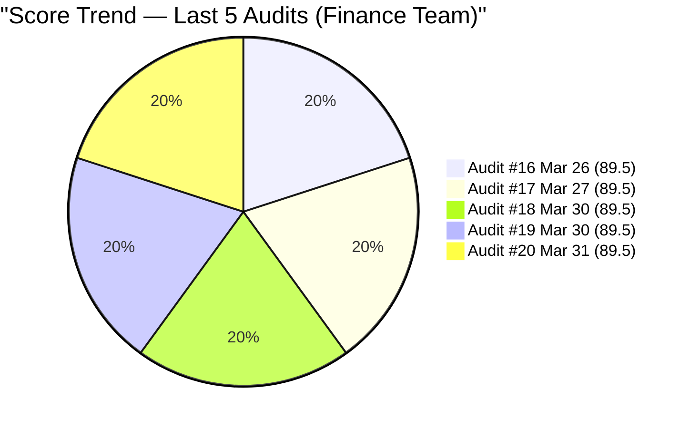
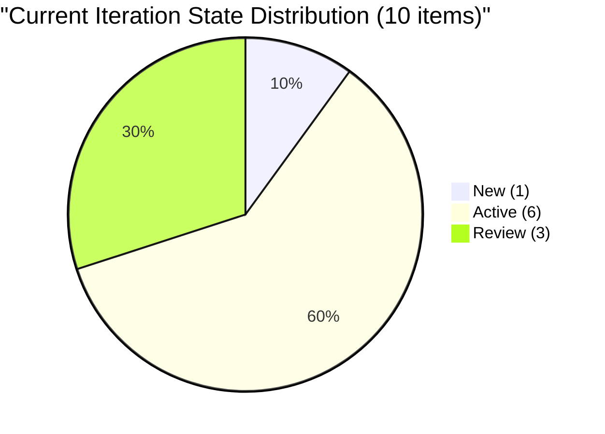
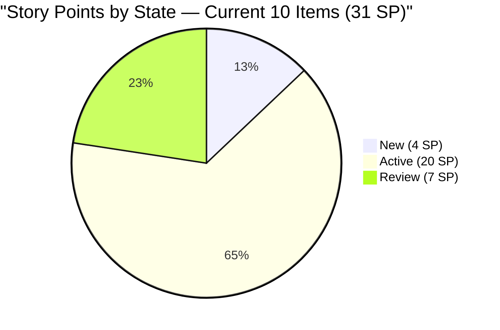
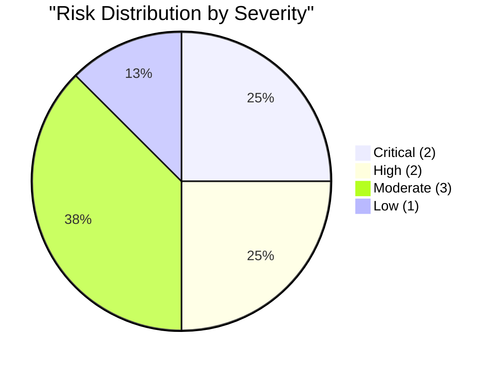

# SAFe Audit Report — Finance Team

## Jairosoft FINOPS Azure DevOps Project

---

## 1. Audit Metadata

| Field | Value |
|-------|-------|
| **Project** | Jairosoft FINOPS |
| **Project ID** | e0bb302f-40f9-46c3-8164-6f1acb317d63 |
| **Team** | Finance Team |
| **Team ID** | 1f4b45fa-82e8-4a36-aedc-6c1bc8f51070 |
| **Backlog** | Stories and Deliverables (`Microsoft.RequirementCategory`) |
| **Board URL** | [Finance Team Board](https://dev.azure.com/jairo/Jairosoft%20FINOPS/_boards/board/t/Finance%20Team/Stories%20and%20Deliverables) |
| **Workspace Folder** | `ado_fin` |
| **Current Iteration** | Iteration 6.6 (IP) |
| **Iteration Path** | `Jairosoft FINOPS\2026-PI6\Iteration 6.6 (IP)` |
| **Iteration Start** | March 23, 2026 |
| **Iteration Finish** | April 5, 2026 |
| **Audit Date** | March 31, 2026 — 09:00 PHT |
| **Audit Day** | Day 9 of 14 (64% elapsed) |
| **Previous Audit** | AUDIT_20260330_1015.md (Mar 30, 2026 10:15 PHT — Audit #19) |
| **Overall Score** | **89.5 / 100** |
| **Risk Band** | **Low Risk** |
| **Audit Series** | #20 |
| **Framework** | SAFe 6.0 |
| **Rubric** | ADO SAFe v1 (six-dimension deterministic scoring) |

**Scope:** Finance Team board only. No other teams, boards, projects, or repositories analyzed.

---

## 2. Executive Summary

This is the **twentieth audit in the series** and the **seventh audit of Iteration 6.6 (IP)**. Since Audit #19 (Mar 30 at 10:15 PHT), **no changes whatsoever** have occurred on the Finance Team board.

All 13 backlog items retain identical states, iteration paths, Story Points, descriptions, and acceptance criteria. No new items created. No state transitions. No content updates. The board is completely static between audits.

**Score holds at 89.5/100 — Low Risk.** The Finance Team continues to be the highest-performing team in the audit portfolio. The score has been stable at 89.5 across all seven Iteration 6.6 audits.

**Persistent gaps (unchanged):**
- #200432 and #200446 (13 SP combined, Iteration 6.5 Review) — PO acceptance now **Day 9 post-sprint-close**
- #201448 (eAFS Portal Submission) — orphaned at root with no SP or iteration
- #198635 (P&L March 2026) — untouched since Mar 18 (13 days), still in New
- #199347 (March Finance Presentation) — untouched since Mar 18 (13 days), Active but stalled
- Zero closures at Day 9

---

## 3. Previous Audit Delta

**Previous:** AUDIT_20260330_1015 — Iteration 6.6 (IP) Day 8, Audit #19

| Metric | Audit #19 | **Audit #20** | Delta |
|--------|-----------|---------------|-------|
| Overall Score | 89.5/100 | **89.5/100** | **0.0** |
| Risk Band | Low Risk | **Low Risk** | No change |
| Visible Backlog | 13 | **13** | No change |
| Items in Iteration 6.6 | 10 | **10** | No change |
| SP Committed | 31 | **31** | No change |
| Capacity | 3 h/day | **3 h/day** | No change |
| Items Active | 6 | **6** | No change |
| Items Review | 3 | **3** | No change |
| Items New | 1 | **1** | No change |
| Items Closed | 0 | **0** | No change |
| Untouched Current | 2 (20%) | **2 (20%)** | No change |
| Carryover Accepted | 0/2 | **0/2** | No change |

**Key changes since Audit #19:** None. All work items, states, assignments, descriptions, and acceptance criteria are identical.

### Score Trend (Audits #16 -- #20)



---

## 4. Current Iteration Snapshot

### 4.1 Iteration Overview

| Metric | Value |
|--------|-------|
| Sprint Day | Day 9 of 14 (64% elapsed) |
| Items in Iteration | 10 |
| Total SP | 31 |
| Closed | 0 (0%) |
| Active | 6 (60%) |
| Review | 3 (30%) |
| New | 1 (10%) |

### 4.2 Team Capacity

| Member | Deployment | Documentation | Requirements | Total/Day |
|--------|-----------|---------------|-------------|-----------|
| Grace | 0 h | 2 h | 1 h | **3 h/day** |

Total sprint capacity: 3 h/day x 14 days = **42 hours** for 31 SP.

### 4.3 Current Iteration Work Items (10 Items)

| ID | Title | State | SP | Changed | Untouched? | DoR |
|----|-------|-------|-----|---------|-----------|-----|
| 198635 | P&L March 2026 | New | 4 | Mar 18 | **Yes** | Pass |
| 198639 | Jairosoft Balance Sheet March 2026 | Active | 3 | Mar 29 | No | Pass |
| 198645 | CFS March 2026 | Active | 3 | Mar 29 | No | Pass |
| 198647 | AFS Submission 2025-2026 | Review | 3 | Mar 27 | No | Pass |
| 199347 | March Jairosoft Finance Presentation | Active | 5 | Mar 18 | **Yes** | Pass |
| 200422 | Work Item Categorization | Review | 2 | Mar 27 | No | Pass |
| 200423 | Automated Quarterly Export | Review | 2 | Mar 27 | No | Pass |
| 200465 | Payroll Variance & Audit Report | Active | 5 | Mar 27 | No | Pass |
| 201445 | Audit & AFS Finalization | Active | 2 | Mar 25 | No | Pass |
| 201446 | Income Tax Return (ITR) Preparation | Active | 2 | Mar 24 | No | Pass |

**Untouched:** 2 items — #198635 (Mar 18, 13 days), #199347 (Mar 18, 13 days).

### 4.4 Non-Current Items on Backlog

| ID | Title | Iter Path | State | SP | Issue |
|----|-------|-----------|-------|-----|-------|
| 200432 | Salary & Earnings Automation | Iter 6.5 | Review | 8 | Carryover — PO acceptance pending (Day 9) |
| 200446 | Standardized Benefits & Deductions | Iter 6.5 | Review | 5 | Carryover — PO acceptance pending (Day 9) |
| 201448 | eAFS Portal Submission | Root | New | -- | Orphaned — has Desc+AC but no SP or iteration |

---

## 5. Work Item Analysis

### 5.1 State Distribution (Current Iteration — 10 Items)



### 5.2 Story Points by State



### 5.3 Sprint Progress — Day 9 Burn Assessment

| Metric | Value |
|--------|-------|
| SP Closed | 0 of 31 (0%) |
| SP in Review | 7 of 31 (22.6%) |
| SP Active | 20 of 31 (64.5%) |
| SP New | 4 of 31 (12.9%) |
| Sprint Elapsed | 64% |
| Remaining Days | 5 |
| Required Burn Rate | 6.2 SP/day to close all |

### 5.4 Work Categories

| Category | Items | SP | Status |
|----------|-------|----|--------|
| Financial Reporting | 3 | 12 | P&L still New; Balance Sheet + CFS Active |
| Tax / Regulatory Compliance | 3 | 7 | AFS Submission in Review; AFS Finalization + ITR Active |
| Payroll | 1 | 5 | Active (since Mar 27) |
| Process Improvement | 3 | 7 | 2 in Review (Mar 27); Presentation Active (untouched) |

---

## 6. SAFe Compliance Scorecard

| # | Dimension | Score | Formula | Evidence | Notes |
|---|-----------|-------|---------|----------|-------|
| 1 | Iteration Planning | **76.9** | 10/13 x 100 | 10 of 13 in Iter 6.6 | #200432/#200446 in 6.5; #201448 orphaned |
| 2 | Team Capacity | **100.0** | 1/1 x 100 | Grace: 3 h/day active | Stable |
| 3 | Estimation | **100.0** | 10/10 x 100 | All 10 items have SP > 0 | Total 31 SP |
| 4 | DoR Compliance | **100.0** | 10/10 x 100 | All 10 pass Desc >= 30 AND AC >= 20 | Sustained across all 6.6 audits |
| 5 | Work Item Balance | **70.0** | 100 - 30 | 100% User Stories | -30 dominant penalty |
| 6 | Backlog Refinement | **90.0** | 100 - 10 | 2/10 untouched (20% > 10%) | -10 penalty; all items fresh |
| | **Overall** | **89.5** | avg(6 dims) | | **Low Risk (>= 80)** |

### Score Computation

```
Iteration Planning:  round(10/13 x 100, 1) = 76.9
Team Capacity:       round(1/1 x 100, 1)   = 100.0
Estimation:          round(10/10 x 100, 1)  = 100.0
DoR Compliance:      round(10/10 x 100, 1)  = 100.0
Work Item Balance:   100 - 30               = 70.0
Backlog Refinement:  base=100; stale90=0; stale180=0;
                     untouched=2/10=20% (>10%) => -10
                     Score = 100 - 10 = 90.0

Overall: (76.9 + 100.0 + 100.0 + 100.0 + 70.0 + 90.0) / 6 = 536.9 / 6 = 89.5
Risk Band: Low Risk (>= 80)
```

---

## 7. Dimension Findings

### 7.1 Iteration Planning (76.9/100) — MODERATE

Three items remain outside the current iteration — unchanged from the last 7 audits:
- **#200432** (8 SP, Review, Iter 6.5): PO acceptance now **9 days post-sprint-close**. Critically overdue.
- **#200446** (5 SP, Review, Iter 6.5): Same situation. Combined 13 SP of velocity credit in limbo.
- **#201448** (New, root): eAFS Portal Submission — has full Desc and AC but no SP or iteration. Thematically critical to the AFS/BIR cluster with the April 15 deadline.

**Path to 100.0:** Resolve all three items (accept carryover + assign #201448).

### 7.2 Team Capacity (100.0/100) — EXCELLENT

Grace at 3 h/day (Documentation 2h + Requirements 1h). Stable and consistent.

### 7.3 Estimation (100.0/100) — EXCELLENT

All 10 current items have Story Points. Perfect coverage. Note: #201448 (root) still has no SP.

### 7.4 DoR Compliance (100.0/100) — EXCELLENT

All 10 current items pass DoR with detailed, structured descriptions and multi-point acceptance criteria. The Finance Team maintains the highest DoR quality across all audited teams.

### 7.5 Work Item Balance (70.0/100) — MODERATE

100% User Stories. Structural limitation. No action warranted this sprint.

### 7.6 Backlog Refinement (90.0/100) — GOOD

All 13 items are fresh (within 45 days). No stale items. However, 2 of 10 current items remain untouched since before iteration start:
- **#198635** (P&L March 2026, 4 SP): Changed Mar 18 — **13 days untouched**, a month-end deliverable still in New
- **#199347** (March Finance Presentation, 5 SP): Changed Mar 18 — **13 days untouched**, Active but stalled

**Path to 100.0:** Touch both items (any state change or content update).

---

## 8. Risks and Bottlenecks



### CRITICAL: PO Acceptance 9 Days Overdue — #200432 and #200446

13 SP of completed work remain in Iteration 6.5 Review state. This is the longest this carryover has persisted. Each day:
- Understates Iteration 6.5 velocity by 13 SP
- Holds Iteration Planning at 76.9 instead of 100.0
- Blocks formal closure of completed work

**Owner: Ramon (PO). Action: Accept immediately.**

### CRITICAL: Zero Closures at Day 9 — Sprint Delivery at Risk

No items have been closed in 9 days. Three items have been in Review since March 27 (4 days). At 64% elapsed with 0% burned, the sprint is at serious risk. Required burn rate: 6.2 SP/day over 5 remaining days. Holy Week (April 2-5) reduces effective work days further.

**Action: Close the 3 Review items (#198647, #200422, #200423 = 7 SP) today.**

### HIGH: #198635 (P&L March 2026) Still in New — Day 9

The P&L report (4 SP) has been in New state since March 18 — untouched for 13 days. As a month-end deliverable for March, this item is now **past due** (March 31 is today). With Holy Week starting April 2, the window is effectively closed.

**Action: Activate today or descope.**

### HIGH: #199347 (Finance Presentation) Untouched 13 Days

5 SP item in Active state but not touched for 13 days. If the March Finance Presentation has been delivered, it should be closed. If not, it needs immediate attention.

### MODERATE: #201448 Not Yet Assigned — April 15 BIR Deadline

eAFS Portal Submission has full content and is thematically critical to the AFS/BIR cluster. Still at root with no SP or iteration. 15 days until the April 15 deadline.

**Action: Assign to Iteration 6.6 with SP today.**

### MODERATE: Tax Compliance Deadline April 15

ITR (#201446, Active) and AFS Submission (#198647, Review) face the April 15 BIR deadline — 15 days away. Both must be fully completed within the sprint or carried to PI7.

### MODERATE: Holy Week Impact — April 2-5

No days-off configured. Effective remaining work days may be as few as 2 (Mar 31-Apr 1).

### LOW: Bus Factor = 1 (Structural, Unchanged)

Grace is the sole Finance Team contributor.

---

## 9. Prioritized Recommendations

| Priority | Action | Owner | Target | Impact |
|----------|--------|-------|--------|--------|
| 1 | **Accept #200432 and #200446** — 9 days overdue | Ramon (PO) | **Immediately** | Iter Planning 76.9->100.0; Overall->93.4 |
| 2 | **Close 3 Review items** (#198647, #200422, #200423) | Grace | Today (Mar 31) | First closures; 7 SP burned |
| 3 | **Activate #198635 (P&L March 2026)** | Grace | Today | Month-end deliverable past due |
| 4 | **Update #199347 (Finance Presentation)** | Grace | Today | Eliminates untouched penalty; Refinement->100.0 |
| 5 | **Assign #201448 to Iter 6.6 + add SP** | Grace / Ramon | Today | Supports April 15 BIR deadline |
| 6 | **Configure Holy Week days-off** | Grace / Admin | Today | Accurate burndown/capacity |

---

## 10. Evidence Gaps and Limitations

| Gap | Impact | Notes |
|-----|--------|-------|
| #200432 and #200446 in 6.5 Review | 13 SP unclosed; Iter Planning suppressed | PO acceptance 9 days overdue |
| #201448 no SP or iteration | Not counted in scoring | Has full Desc+AC; trivial to fix |
| No task-level breakdown | Sub-story progress not visible | 6 items Active but no granular data |
| No GitHub repos scoped | No code delivery evidence | Finance work is non-code |
| 2 untouched items (Mar 18) | -10 Backlog Refinement penalty | #198635 and #199347 stalled 13 days |
| Zero closures at Day 9 | Sprint delivery risk high | 3 items in Review since Day 5 |

---

### Full Score History (Audits #1-#20)

| # | Date | Iter | Day | Score | Band |
|---|------|------|-----|-------|------|
| 1 | Feb 25 | 6.3 | -- | 45.0 | High |
| 2 | Mar 4 | 6.4 | -- | 77.0 | Moderate |
| 3 | Mar 4 | 6.4 | -- | 77.0 | Moderate |
| 4 | Mar 5 | 6.4 | -- | 79.0 | Moderate |
| 5 | Mar 6 | 6.4 | -- | 79.0 | Moderate |
| 6 | Mar 9 | 6.5 | 1 | 71.0 | Moderate |
| 7 | Mar 10 | 6.5 | 2 | 81.0 | Low |
| 8 | Mar 11 | 6.5 | 3 | 81.0 | Low |
| 9 | Mar 12 | 6.5 | 4 | 81.0 | Low |
| 10 | Mar 16 | 6.5 | 8 | 86.0 | Low |
| 11 | Mar 17 | 6.5 | 9 | 86.0 | Low |
| 12 | Mar 18 | 6.5 | 10 | 86.0 | Low |
| 13 | Mar 22 | 6.5 | 14 | 86.0 | Low |
| 14 | Mar 25 | 6.6 | 3 | 89.5 | Low |
| 15 | Mar 26 | 6.6 | 4 | 89.5 | Low |
| 16 | Mar 26 | 6.6 | 4 | 89.5 | Low |
| 17 | Mar 27 | 6.6 | 5 | 89.5 | Low |
| 18 | Mar 30 | 6.6 | 8 | 89.5 | Low |
| 19 | Mar 30 | 6.6 | 8 | 89.5 | Low |
| **20** | **Mar 31** | **6.6** | **9** | **89.5** | **Low** |

---

*Report generated: March 31, 2026 09:00 PHT*
*Auditor: AI EngProd Consultant (SAFe 6.0)*
*Rubric: ADO SAFe v1 (six-dimension deterministic scoring)*
*Audit #20 | Iteration 6.6 (IP) Day 9 of 14 | Score: 89.5/100 (Low Risk)*
*Previous: AUDIT_20260330_1015 (89.5/100 — Low Risk)*
*Delta: 0.0 — No changes; urgency increasing as sprint enters final week*
