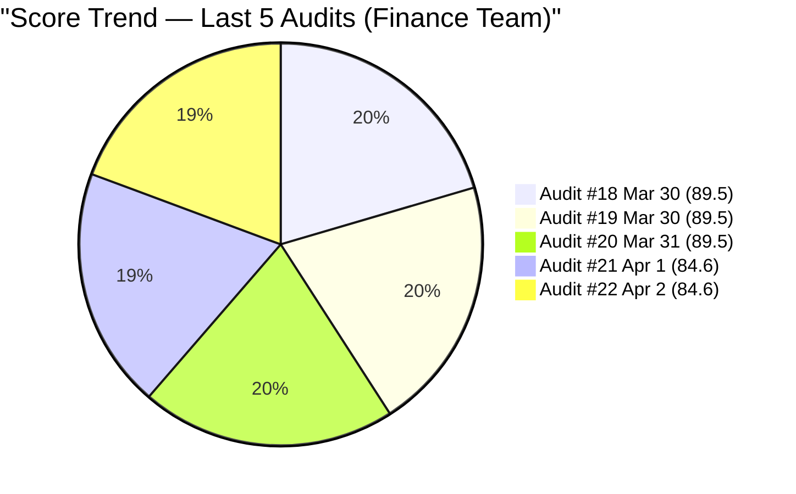
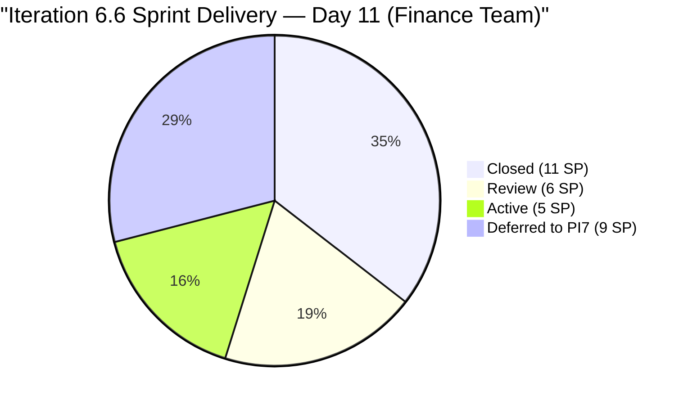
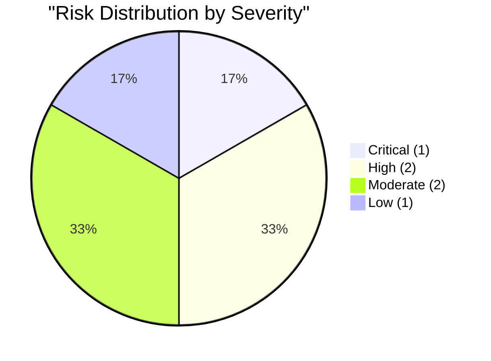

# SAFe Audit Report — Finance Team

## Jairosoft FINOPS Azure DevOps Project

---

## 1. Audit Metadata

| Field | Value |
|-------|-------|
| **Project** | Jairosoft FINOPS |
| **Project ID** | e0bb302f-40f9-46c3-8164-6f1acb317d63 |
| **Team** | Finance Team |
| **Team ID** | 1f4b45fa-82e8-4a36-aedc-6c1bc8f51070 |
| **Backlog** | Stories and Deliverables (`Microsoft.RequirementCategory`) |
| **Board URL** | [Finance Team Board](https://dev.azure.com/jairo/Jairosoft%20FINOPS/_boards/board/t/Finance%20Team/Stories%20and%20Deliverables) |
| **Workspace Folder** | `ado_fin` |
| **Current Iteration** | Iteration 6.6 (IP) |
| **Iteration Path** | `Jairosoft FINOPS\2026-PI6\Iteration 6.6 (IP)` |
| **Iteration Start** | March 23, 2026 |
| **Iteration Finish** | April 5, 2026 |
| **Audit Date** | April 2, 2026 — 09:00 PHT |
| **Audit Day** | Day 11 of 14 (79% elapsed) |
| **Previous Audit** | AUDIT_20260401_0900.md (Apr 1, 2026 09:00 PHT — Audit #21) |
| **Overall Score** | **84.6 / 100** |
| **Risk Band** | **Low Risk** |
| **Audit Series** | #22 |
| **Framework** | SAFe 6.0 |
| **Rubric** | ADO SAFe v1 (six-dimension deterministic scoring) |

**Scope:** Finance Team board only. No other teams, boards, projects, or repositories analyzed.

---

## 2. Executive Summary

This is the **twenty-second audit in the series** and the **ninth audit of Iteration 6.6 (IP)**. Since Audit #21 (Apr 1 at 09:00 PHT), **no board changes** have occurred:

- The same 3 items remain in Iteration 6.6 (IP): #198639 (Balance Sheet, Review), #198645 (CFS, Review), #200465 (Payroll Variance, Active)
- The same 2 carryover items remain in Iteration 6.5 Review: #200432 and #200446
- The same 3 items remain in Iteration 7.1: #198635, #199347, #201448
- No state transitions, no new items, no closures

**Score holds at 84.6 (unchanged) — Low Risk.** All six dimension scores are identical to Audit #21. Holy Week (April 2-5) has effectively frozen board activity.

---

## 3. Previous Audit Delta

**Previous:** AUDIT_20260401_0900 — Iteration 6.6 (IP) Day 10, Audit #21

| Metric | Audit #21 | **Audit #22** | Delta |
|--------|-----------|---------------|-------|
| Overall Score | 84.6/100 | **84.6/100** | **0.0** |
| Risk Band | Low Risk | **Low Risk** | No change |
| Visible Backlog | 8 | **8** | 0 |
| Items in Iteration 6.6 | 3 | **3** | 0 |
| SP in Current Iter | 11 | **11** | 0 |
| Items Closed (this sprint) | 5 | **5** | 0 |
| SP Closed (this sprint) | 11 | **11** | 0 |
| Capacity | 3 h/day | **3 h/day** | 0 |
| Carryover Accepted | 0/2 | **0/2** | 0 |
| Iteration Planning | 37.5 | **37.5** | 0.0 |
| Team Capacity | 100.0 | **100.0** | 0.0 |
| Estimation | 100.0 | **100.0** | 0.0 |
| DoR Compliance | 100.0 | **100.0** | 0.0 |
| Work Item Balance | 70.0 | **70.0** | 0.0 |
| Backlog Refinement | 100.0 | **100.0** | 0.0 |

### Score Trend (Audits #18 -- #22)



---

## 4. Current Iteration Snapshot

### 4.1 Iteration Overview

| Metric | Value |
|--------|-------|
| Sprint Day | Day 11 of 14 (79% elapsed) |
| Items in Iteration (visible backlog) | 3 |
| Total SP (current iter) | 11 |
| Closed (this sprint, off backlog) | 5 (11 SP) |
| Review | 2 (6 SP) |
| Active | 1 (5 SP) |

### 4.2 Team Capacity

| Member | Deployment | Documentation | Requirements | Total/Day |
|--------|-----------|---------------|-------------|-----------|
| Grace | 0 h | 2 h | 1 h | **3 h/day** |

Total sprint capacity: 3 h/day x 14 days = **42 hours**. No days-off configured.

### 4.3 Current Iteration Work Items (3 Remaining on Backlog)

| ID | Title | State | SP | Changed | DoR |
|----|-------|-------|-----|---------|-----|
| 198639 | Jairosoft Balance Sheet March 2026 | **Review** | 3 | Apr 1 | Pass |
| 198645 | CFS March 2026 | **Review** | 3 | Apr 1 | Pass |
| 200465 | Payroll Variance & Audit Report | Active | 5 | Mar 27 | Pass |

### 4.4 Items Closed This Sprint (5 Items, 11 SP)

| ID | Title | SP | Closed |
|----|-------|----|--------|
| 198647 | AFS Submission 2025-2026 | 3 | Apr 1 |
| 200422 | Work Item Categorization | 2 | Apr 1 |
| 200423 | Automated Quarterly Export | 2 | Apr 1 |
| 201445 | Audit & Financial Statement Finalization | 2 | Apr 1 |
| 201446 | Income Tax Return (ITR) Preparation | 2 | Apr 1 |

### 4.5 Non-Current Items on Backlog

| ID | Title | Iter Path | State | SP | Issue |
|----|-------|-----------|-------|-----|-------|
| 200432 | Salary & Earnings Automation | Iter 6.5 | Review | 8 | Carryover — PO acceptance Day 11 |
| 200446 | Standardized Benefits & Deductions | Iter 6.5 | Review | 5 | Carryover — PO acceptance Day 11 |
| 198635 | P&L March 2026 | Iter 7.1 | New | 4 | Deferred from 6.6 |
| 199347 | March Finance Presentation | Iter 7.1 | Active | 5 | Deferred from 6.6 |
| 201448 | eAFS Portal Submission | Iter 7.1 | New | -- | No SP; April 15 BIR deadline |

---

## 5. Work Item Analysis

### 5.1 Sprint Delivery Summary



### 5.2 Velocity Assessment

| Metric | Value |
|--------|-------|
| Original commitment (Audit #14) | 10 items, 31 SP |
| Items deferred to PI7 | 2 items, 9 SP |
| Adjusted commitment | 8 items, 22 SP |
| Closed | 5 items, 11 SP (50% of adjusted) |
| In Review | 2 items, 6 SP (27% of adjusted) |
| Active | 1 item, 5 SP (23% of adjusted) |
| Potential completion | 7 items, 17 SP (77% of adjusted) |

**Unchanged from Audit #21.** If the 2 Review items are accepted and #200465 completes, the sprint delivers 22 SP out of adjusted 22 SP (100%).

### 5.3 Tax Compliance Milestone — Update

| Item | Status | Days to April 15 BIR Deadline |
|------|--------|-------------------------------|
| #198647 AFS Submission | **Closed** | -- |
| #201445 Audit & AFS Finalization | **Closed** | -- |
| #201446 ITR Preparation | **Closed** | -- |
| #201448 eAFS Portal Submission | New (PI7) | **13 days** |

The eAFS portal submission is the last remaining compliance item. Now in PI7 Iteration 7.1 but still missing Story Points.

---

## 6. SAFe Compliance Scorecard

| # | Dimension | Score | Formula | Evidence | Notes |
|---|-----------|-------|---------|----------|-------|
| 1 | Iteration Planning | **37.5** | 3/8 x 100 | 3 of 8 in Iter 6.6 | Unchanged from #21 |
| 2 | Team Capacity | **100.0** | 1/1 x 100 | Grace: 3 h/day active | Stable |
| 3 | Estimation | **100.0** | 3/3 x 100 | All 3 current items have SP > 0 | Total 11 SP |
| 4 | DoR Compliance | **100.0** | 3/3 x 100 | All 3 pass Desc >= 30 AND AC >= 20 | Best-in-class documentation |
| 5 | Work Item Balance | **70.0** | 100 - 30 | 100% User Stories | -30 dominant penalty |
| 6 | Backlog Refinement | **100.0** | 100 - 0 | All 8 items fresh; 0 untouched | No penalties |
| | **Overall** | **84.6** | avg(6 dims) | | **Low Risk (>= 80)** |

### Score Computation

```
Iteration Planning:  round(3/8 x 100, 1) = 37.5
  visible_root_backlog_items = 8
  current_iteration_root_items = 3 (198639, 198645, 200465)

Team Capacity:       round(1/1 x 100, 1) = 100.0
  contributors_with_current_work = 1 (Grace)
  contributors_with_capacity = 1 (Grace: 3 h/day)

Estimation:          round(3/3 x 100, 1) = 100.0
  point_eligible = 3, estimated = 3

DoR Compliance:      round(3/3 x 100, 1) = 100.0
  All 3 items pass DoR

Work Item Balance:   100 - 30 = 70.0
  100% User Story => dominant > 60% => -30

Backlog Refinement:
  Reference date: 2026-04-02
  Iteration start: 2026-03-23
  45-day cutoff: 2026-02-16
  90-day cutoff: 2026-01-02
  180-day cutoff: 2025-10-05

  All 8 visible items changed within 45 days:
    198639: Apr 1, 198645: Apr 1, 200465: Mar 27
    200432: Mar 19, 200446: Mar 22
    198635: Apr 1, 199347: Apr 1, 201448: Apr 1
  fresh = 8/8 = 100.0% => base = 100.0
  stale_90 = 0 => no penalty
  stale_180 = 0 => no penalty
  untouched_current = 0/3 (all changed after Mar 23) => no penalty
  Score = 100.0

Overall: (37.5 + 100.0 + 100.0 + 100.0 + 70.0 + 100.0) / 6 = 507.5 / 6 = 84.6
Risk Band: Low Risk (>= 80)
```

---

## 7. Dimension Findings

### 7.1 Iteration Planning (37.5/100) — HIGH (Unchanged)

3 of 8 visible backlog items in the current iteration. This score remains structurally depressed because 5 items closed on April 1 dropped off the visible backlog, shrinking the denominator from 13 to 8 while only 3 items remain in the sprint. The score reflects excellent execution penalized by backlog composition.

**Path to improvement:** Accept #200432 and #200446 (moving them from 6.5 Review to closed) would reduce visible backlog to 6 with 3 current = 50.0.

### 7.2 Team Capacity (100.0/100) — EXCELLENT

Grace at 3 h/day (Documentation 2h + Requirements 1h). Stable and consistent.

### 7.3 Estimation (100.0/100) — EXCELLENT

All 3 current items have Story Points. #201448 (now in PI7) still has no SP.

### 7.4 DoR Compliance (100.0/100) — EXCELLENT

All 3 current items pass DoR. The Finance Team maintains the highest DoR quality across all audited teams.

### 7.5 Work Item Balance (70.0/100) — MODERATE

100% User Stories. Structural limitation. No action warranted.

### 7.6 Backlog Refinement (100.0/100) — EXCELLENT

All 8 visible items are fresh (changed within 45 days). No stale items.

---

## 8. Risks and Bottlenecks



### CRITICAL: PO Acceptance 11 Days Overdue — #200432 and #200446

13 SP of completed work remain in Iteration 6.5 Review state. This is now **11 days** post-sprint-close. Each day:

- Understates Iteration 6.5 velocity by 13 SP
- Holds Iteration Planning at 37.5 instead of 50.0+
- Blocks formal closure of completed work

**Owner: Ramon (PO). Action: Accept immediately.**

### HIGH: #201448 eAFS Portal Submission — 13 Days to April 15 BIR Deadline

In Iteration 7.1 with full Desc and AC but still no Story Points. The April 15 BIR deadline is 13 days away. The other tax items are closed, but eAFS submission is the final step.

**Action: Add SP and prioritize for early PI7.**

### HIGH: #200465 (Payroll Variance & Audit Report) Untouched 6 Days

The largest remaining item (5 SP) has not been touched since March 27 (6 days ago). With Holy Week reducing effective days, this item is at risk of not completing.

**Action: Update status or descope if blocked.**

### MODERATE: Holy Week — April 2-5

No days-off configured. Board is frozen since April 1 closures. Effective remaining work days may be 1-2.

### MODERATE: 9 SP Deferred to PI7

# 198635 (P&L March 2026, 4 SP) and #199347 (March Finance Presentation, 5 SP) were deferred. These are month-end deliverables for March — the P&L is now past due as a reporting artifact

### LOW: Bus Factor = 1 (Structural, Unchanged)

Grace is the sole Finance Team contributor.

---

## 9. Prioritized Recommendations

| Priority | Action | Owner | Target | Impact |
|----------|--------|-------|--------|--------|
| 1 | **Accept #200432 and #200446** — 11 days overdue | Ramon (PO) | **Immediately** | Iter Planning 37.5->50.0; reduces backlog clutter |
| 2 | **Add SP to #201448 (eAFS)** | Grace / Ramon | Before PI7 | April 15 deadline critical |
| 3 | **Update #200465 (Payroll Variance)** | Grace | When back | 5 SP item untouched 6 days |
| 4 | **Close #198639 and #198645 (Review)** | Ramon (PO) | When back | 6 SP delivery credit |
| 5 | **Configure Holy Week days-off** | Grace / Admin | For record | Accurate burndown/capacity |

---

## 10. Evidence Gaps and Limitations

| Gap | Impact | Notes |
|-----|--------|-------|
| #200432 and #200446 in 6.5 Review | 13 SP unclosed; Iter Planning suppressed | PO acceptance 11 days overdue |
| #201448 no SP | Not counted in estimation scoring | Has full Desc+AC; trivial to fix |
| Iteration Planning structural drop | Score 37.5 despite excellent execution | 5 closures shrink denominator |
| #200465 untouched 6 days | 5 SP at risk | No state change since Mar 27 |
| Board frozen during Holy Week | No activity expected Apr 2-5 | Next changes likely Apr 6+ |
| No GitHub repos scoped | No code delivery evidence | Finance work is non-code |

---

### Full Score History (Audits #1-#22)

| # | Date | Iter | Day | Score | Band |
|---|------|------|-----|-------|------|
| 1 | Feb 25 | 6.3 | -- | 45.0 | High |
| 2 | Mar 4 | 6.4 | -- | 77.0 | Moderate |
| 3 | Mar 4 | 6.4 | -- | 77.0 | Moderate |
| 4 | Mar 5 | 6.4 | -- | 79.0 | Moderate |
| 5 | Mar 6 | 6.4 | -- | 79.0 | Moderate |
| 6 | Mar 9 | 6.5 | 1 | 71.0 | Moderate |
| 7 | Mar 10 | 6.5 | 2 | 81.0 | Low |
| 8 | Mar 11 | 6.5 | 3 | 81.0 | Low |
| 9 | Mar 12 | 6.5 | 4 | 81.0 | Low |
| 10 | Mar 16 | 6.5 | 8 | 86.0 | Low |
| 11 | Mar 17 | 6.5 | 9 | 86.0 | Low |
| 12 | Mar 18 | 6.5 | 10 | 86.0 | Low |
| 13 | Mar 22 | 6.5 | 14 | 86.0 | Low |
| 14 | Mar 25 | 6.6 | 3 | 89.5 | Low |
| 15 | Mar 26 | 6.6 | 4 | 89.5 | Low |
| 16 | Mar 26 | 6.6 | 4 | 89.5 | Low |
| 17 | Mar 27 | 6.6 | 5 | 89.5 | Low |
| 18 | Mar 30 | 6.6 | 8 | 89.5 | Low |
| 19 | Mar 30 | 6.6 | 8 | 89.5 | Low |
| 20 | Mar 31 | 6.6 | 9 | 89.5 | Low |
| 21 | Apr 1 | 6.6 | 10 | 84.6 | Low |
| **22** | **Apr 2** | **6.6** | **11** | **84.6** | **Low** |

---

*Report generated: April 2, 2026 09:00 PHT*
*Auditor: AI EngProd Consultant (SAFe 6.0)*
*Rubric: ADO SAFe v1 (six-dimension deterministic scoring)*
*Audit #22 | Iteration 6.6 (IP) Day 11 of 14 | Score: 84.6/100 (Low Risk)*
*Previous: AUDIT_20260401_0900 (84.6/100 — Low Risk)*
*Delta: 0.0 — Board frozen during Holy Week; all dimensions unchanged*
