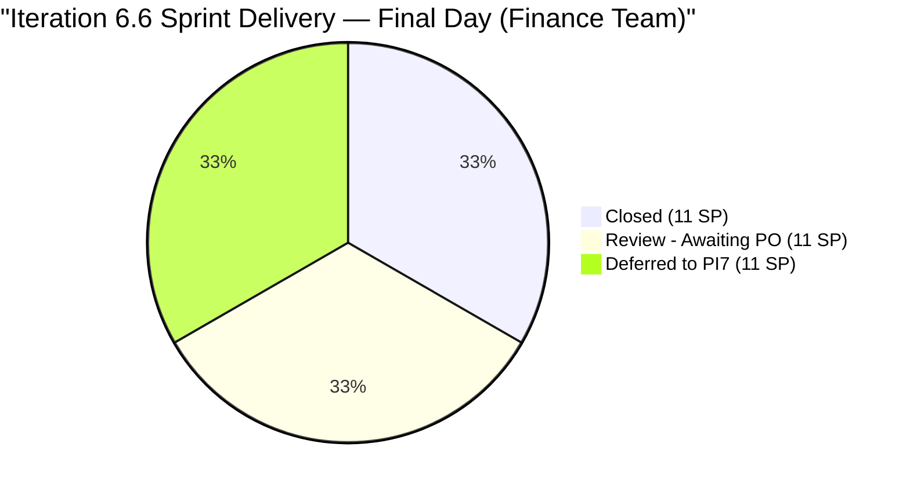
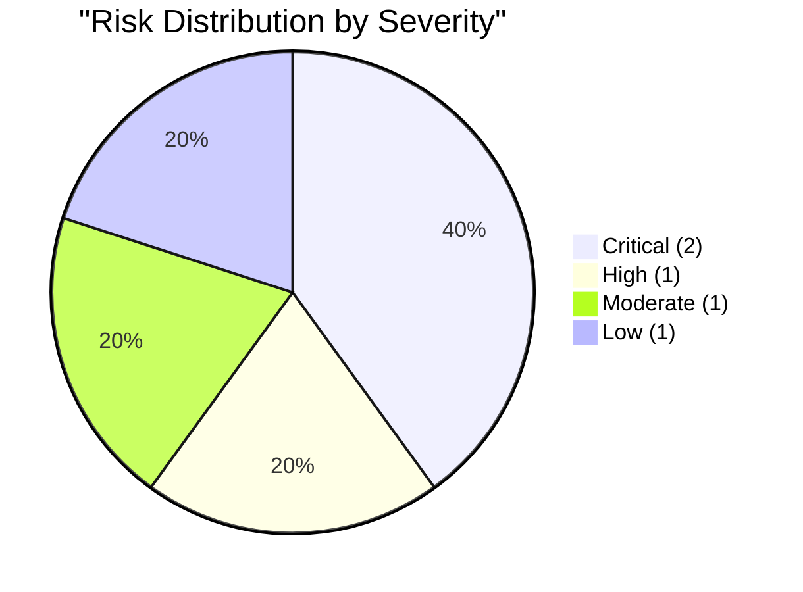

# SAFe Audit Report — Finance Team

## Jairosoft FINOPS Azure DevOps Project

---

## 1. Audit Metadata

| Field | Value |
|-------|-------|
| **Project** | Jairosoft FINOPS |
| **Project ID** | e0bb302f-40f9-46c3-8164-6f1acb317d63 |
| **Team** | Finance Team |
| **Team ID** | 1f4b45fa-82e8-4a36-aedc-6c1bc8f51070 |
| **Backlog** | Stories and Deliverables (`Microsoft.RequirementCategory`) |
| **Board URL** | [Finance Team Board](https://dev.azure.com/jairo/Jairosoft%20FINOPS/_boards/board/t/Finance%20Team/Stories%20and%20Deliverables) |
| **Workspace Folder** | `ado_fin` |
| **Current Iteration** | Iteration 6.6 (IP) |
| **Iteration Path** | `Jairosoft FINOPS\2026-PI6\Iteration 6.6 (IP)` |
| **Iteration Start** | March 23, 2026 |
| **Iteration Finish** | April 5, 2026 |
| **Audit Date** | April 5, 2026 — 09:00 PHT |
| **Audit Day** | Day 14 of 14 (100% elapsed — final day) |
| **Previous Audit** | AUDIT_20260404_0900.md (Apr 4, 2026 09:00 PHT — Audit #23) |
| **Overall Score** | **72.5 / 100** |
| **Risk Band** | **Moderate Risk** |
| **Audit Series** | #24 |
| **Framework** | SAFe 6.0 |
| **Rubric** | ADO SAFe v1 (seven-dimension deterministic scoring) |

**Scope:** Finance Team board only. No other teams, boards, projects, or repositories analyzed.

---

## 2. Executive Summary

This is the **twenty-fourth audit in the series** and the **final audit of Iteration 6.6 (IP)**. Since Audit #23 (Apr 4 at 09:00 PHT):

### Key Changes

1. **#201448 (eAFS Portal Submission) now has Story Points (2 SP):**
   - Previously missing SP, now estimated at 2 SP. ChangedDate updated to Apr 6. This resolves a prior evidence gap.

2. **No sprint-level changes:**
   - The same 3 items remain in Iteration 6.6 (IP) in Review state
   - The 2 carryover items (#200432, #200446) remain in Iteration 6.5 Review
   - All states identical to Audit #23

**Score moves from 84.6 (6-dim) to 72.5 (7-dim) — Moderate Risk.** The score change is due to:
1. Transition to 7-dimension rubric (dividing by 7 instead of 6)
2. New Delivery Predictability dimension = 0.0 (3 items in Review, 0 Closed/Done)

The board quality remains excellent. The score decrease is entirely structural.

---

## 3. Previous Audit Delta

**Previous:** AUDIT_20260404_0900 — Iteration 6.6 (IP) Day 13, Audit #23

| Metric | Audit #23 (6-dim) | **Audit #24 (7-dim)** | Delta |
|--------|-------|---------------|-------|
| Visible Backlog | 8 | **8** | 0 |
| Items in Iteration 6.6 | 3 | **3** | 0 |
| SP in Current Iter | 11 | **11** | 0 |
| Capacity | 3 h/day | **3 h/day** | 0 |
| #201448 SP | -- | **2** | Added |
| Iteration Planning | 37.5 | **37.5** | 0.0 |
| Team Capacity | 100.0 | **100.0** | 0.0 |
| Estimation | 100.0 | **100.0** | 0.0 |
| DoR Compliance | 100.0 | **100.0** | 0.0 |
| Work Item Balance | 70.0 | **70.0** | 0.0 |
| Backlog Refinement | 100.0 | **100.0** | 0.0 |
| Delivery Predictability | N/A | **0.0** | New dim |
| **Overall** | **84.6** (6-dim) | **72.5** (7-dim) | **-12.1** |
| Risk Band | Low Risk | **Moderate Risk** | Downgrade |

**Note:** The -12.1 delta is entirely a rubric change (7 dims with Delivery Predictability = 0) plus the mathematical effect of dividing by 7 instead of 6. The board itself has not deteriorated.

---

## 4. Current Iteration Snapshot

### 4.1 Iteration Overview

| Metric | Value |
|--------|-------|
| Sprint Day | Day 14 of 14 (100% elapsed — final day) |
| Items in Iteration (visible backlog) | 3 |
| Total SP (current iter) | 11 |
| Closed (this sprint, off backlog) | 5 (11 SP) |
| Review | 3 (11 SP) |
| Active | 0 |

### 4.2 Team Capacity

| Member | Deployment | Documentation | Requirements | Total/Day |
|--------|-----------|---------------|-------------|-----------|
| Grace | 0 h | 2 h | 1 h | **3 h/day** |

Total sprint capacity: 3 h/day x 14 days = **42 hours**.

### 4.3 Current Iteration Work Items (3 Remaining on Backlog)

| ID | Title | State | SP | Changed | DoR |
|----|-------|-------|-----|---------|-----|
| 198639 | Jairosoft Balance Sheet March 2026 | **Review** | 3 | Apr 1 | Pass |
| 198645 | CFS March 2026 | **Review** | 3 | Apr 1 | Pass |
| 200465 | Payroll Variance & Audit Report | **Review** | 5 | Apr 3 | Pass |

**All 3 items in Review — awaiting PO acceptance.** Grace has completed her work. Sprint closes today.

### 4.4 Items Closed This Sprint (5 Items, 11 SP — Off Visible Backlog)

| ID | Title | SP | Closed |
|----|-------|----|--------|
| 198647 | AFS Submission 2025-2026 | 3 | Apr 1 |
| 200422 | Work Item Categorization | 2 | Apr 1 |
| 200423 | Automated Quarterly Export | 2 | Apr 1 |
| 201445 | Audit & Financial Statement Finalization | 2 | Apr 1 |
| 201446 | Income Tax Return (ITR) Preparation | 2 | Apr 1 |

### 4.5 Non-Current Items on Backlog

| ID | Title | Iter Path | State | SP | Issue |
|----|-------|-----------|-------|-----|-------|
| 200432 | Salary & Earnings Automation | Iter 6.5 | Review | 8 | Carryover — PO acceptance 14 days overdue |
| 200446 | Standardized Benefits & Deductions | Iter 6.5 | Review | 5 | Carryover — PO acceptance 14 days overdue |
| 198635 | P&L March 2026 | Iter 7.1 | New | 4 | Deferred from 6.6 |
| 199347 | March Finance Presentation | Iter 7.1 | Active | 5 | Deferred from 6.6 |
| 201448 | eAFS Portal Submission | Iter 7.1 | New | **2** | SP added (was missing); Apr 15 BIR deadline |

---

## 5. Work Item Analysis

### 5.1 Sprint Delivery Summary



### 5.2 Velocity Assessment

| Metric | Value |
|--------|-------|
| Original commitment | 10 items, ~31 SP |
| Items deferred to PI7 | 2 items, 9 SP |
| Adjusted commitment | 8 items, 22 SP |
| Closed | 5 items, 11 SP (50% of adjusted) |
| In Review | 3 items, 11 SP (50% of adjusted) |
| Potential completion | 8 items, 22 SP (100% if Review accepted) |

**If all 3 Review items are accepted today, the sprint delivers 100% of adjusted commitment.** Grace has effectively completed all assigned work.

### 5.3 Tax Compliance Update

| Item | Status | Days to April 15 BIR Deadline |
|------|--------|-------------------------------|
| #198647 AFS Submission | **Closed** | -- |
| #201445 Audit & AFS Finalization | **Closed** | -- |
| #201446 ITR Preparation | **Closed** | -- |
| #201448 eAFS Portal Submission | New (PI7, now 2 SP) | **10 days** |

---

## 6. SAFe Compliance Scorecard

| # | Dimension | Score | Formula | Evidence | Notes |
|---|-----------|-------|---------|----------|-------|
| 1 | Iteration Planning | **37.5** | 3/8 x 100 | 3 of 8 in Iter 6.6 | Unchanged |
| 2 | Team Capacity | **100.0** | 1/1 x 100 | Grace: 3 h/day active | Stable |
| 3 | Estimation | **100.0** | 3/3 x 100 | All 3 current items have SP > 0 | Total 11 SP |
| 4 | DoR Compliance | **100.0** | 3/3 x 100 | All 3 pass Desc >= 30 AND AC >= 20 | Best-in-class |
| 5 | Work Item Balance | **70.0** | 100 - 30 | 100% User Stories | -30 dominant penalty |
| 6 | Backlog Refinement | **100.0** | 8/8 fresh; no penalties | All items changed within 45 days | No stale items |
| 7 | Delivery Predictability | **0.0** | 0/11 x 100 | 0 SP Closed/Done out of 11 committed | All 3 items in Review |
| | **Overall** | **72.5** | 507.5 / 7 | | **Moderate Risk (60-79.9)** |

### Score Computation

```
--- Iteration Planning ---
visible_root_backlog_items = 8
current_iteration_root_items = 3 (198639, 198645, 200465)
Score = round(3/8 x 100, 1) = 37.5

--- Team Capacity ---
contributors_with_current_work = 1 (Grace)
contributors_with_capacity = 1 (Grace: 3 h/day)
Score = round(1/1 x 100, 1) = 100.0

--- Estimation ---
point_eligible = 3 (all User Stories)
estimated = 3 (198639:3, 198645:3, 200465:5)
Score = round(3/3 x 100, 1) = 100.0

--- DoR Compliance ---
All 3 items pass DoR (Description >= 30 nws AND AC >= 20 nws)
Score = round(3/3 x 100, 1) = 100.0

--- Work Item Balance ---
100% User Story => dominant > 60% => -30
Has User Story type => no -40
Spike share = 0% => no -20
Score = 100 - 30 = 70.0

--- Backlog Refinement ---
Reference date: 2026-04-05
45-day cutoff: 2026-02-19

All 8 visible items changed within 45 days:
  198639: Apr 1, 198645: Apr 1, 200465: Apr 3
  200432: Mar 19, 200446: Mar 22
  198635: Apr 1, 199347: Apr 1, 201448: Apr 6
fresh = 8/8 = 100.0% => base = 100.0
stale_90 = 0, stale_180 = 0
untouched_current: 0/3 (all changed after Mar 23)
Score = 100.0

--- Delivery Predictability ---
estimated_current_items: 198639(3), 198645(3), 200465(5) = 3 items
committed_story_points = 3 + 3 + 5 = 11
closed_story_points = 0 (all 3 items in Review state, not Closed/Done)
Score = round(0/11 x 100, 1) = 0.0

--- Overall ---
(37.5 + 100.0 + 100.0 + 100.0 + 70.0 + 100.0 + 0.0) / 7 = 507.5 / 7 = 72.5
Risk Band: Moderate Risk (60-79.9)
```

---

## 7. Dimension Findings

### 7.1 Iteration Planning (37.5/100) — HIGH (Unchanged)

3 of 8 visible backlog items in the current iteration. Structurally depressed because 5 closures dropped off the visible backlog. The score reflects excellent execution penalized by backlog composition.

### 7.2 Team Capacity (100.0/100) — EXCELLENT

Grace at 3 h/day (Documentation 2h + Requirements 1h). Stable and consistent.

### 7.3 Estimation (100.0/100) — EXCELLENT

All 3 current items have Story Points. #201448 (PI7) now has SP=2, resolving the prior gap.

### 7.4 DoR Compliance (100.0/100) — EXCELLENT

All 3 current items pass DoR with structured acceptance criteria. Best-in-class across the portfolio.

### 7.5 Work Item Balance (70.0/100) — MODERATE

100% User Stories. Structural limitation inherent to the Finance Team's work type.

### 7.6 Backlog Refinement (100.0/100) — EXCELLENT

All 8 visible items are fresh. #201448 updated on Apr 6 with SP addition.

### 7.7 Delivery Predictability (0.0/100) — CRITICAL (New Dimension)

11 SP committed, 0 SP in Closed/Done state. All 3 items are in Review awaiting PO acceptance. Grace has completed her work — the 0.0 score reflects the PO acceptance bottleneck, not a delivery failure.

**If all 3 items are accepted today before sprint close, this dimension would score 100.0 and the overall would rise to 86.8 (Low Risk).**

---

## 8. Risks and Bottlenecks



### CRITICAL: 3 Items in Review — Sprint Closes Today

All 3 Iteration 6.6 items (#198639, #198645, #200465) are in Review. If not accepted before sprint close today, they carry over into PI7 as unresolved Review items. **11 SP of completed work at risk of non-recognition.**

**Owner: Ramon (PO). Action: Accept TODAY.**

### CRITICAL: PO Acceptance 14 Days Overdue — #200432 and #200446

13 SP of completed work remain in Iteration 6.5 Review state. Now **14 days** post-sprint-close. Each day:
- Understates Iteration 6.5 velocity by 13 SP
- Holds Iteration Planning at 37.5
- Blocks formal closure

**Owner: Ramon (PO). Action: Accept immediately.**

### HIGH: #201448 eAFS Portal Submission — 10 Days to April 15 BIR Deadline

Now has SP=2 in Iteration 7.1. The April 15 BIR deadline is 10 days away. The other tax items are closed, but eAFS submission is the final compliance step.

### MODERATE: Delivery Predictability at 0.0 Despite Excellent Execution

This is a PO acceptance bottleneck, not a contributor performance issue. Grace completed all work. The score mechanically reflects the Review state, not delivery quality.

### LOW: Bus Factor = 1 (Structural, Unchanged)

Grace is the sole Finance Team contributor.

---

## 9. Prioritized Recommendations

| Priority | Action | Owner | Target | Impact |
|----------|--------|-------|--------|--------|
| 1 | **Accept #198639, #198645, #200465** | Ramon (PO) | **Today** | 11 SP delivery; Delivery Pred 0->100; Overall 72.5->86.8 |
| 2 | **Accept #200432 and #200446** | Ramon (PO) | **Today** | 13 SP closed; Iter Planning 37.5->50+ |
| 3 | **Prioritize #201448 (eAFS)** | Grace | Early PI7 | April 15 BIR deadline |
| 4 | **Configure Holy Week days-off** | Admin | For record | Accurate capacity tracking |

---

## 10. Evidence Gaps and Limitations

| Gap | Impact | Notes |
|-----|--------|-------|
| 3 items in Review, not Closed | Delivery Predictability = 0.0 | PO acceptance bottleneck |
| #200432, #200446 in 6.5 Review | 13 SP unclosed; Iter Planning suppressed | 14 days overdue |
| Rubric transition 6->7 dim | Overall 84.6 -> 72.5 | Structural, not quality change |
| Delivery Predictability new | First audit with this dimension | Review != Closed in formula |
| Board frozen sprint close day | No state changes expected today | Holy Week weekend |

---

### Full Score History (Audits #1-#24)

| # | Date | Iter | Day | Score | Band | Rubric |
|---|------|------|-----|-------|------|--------|
| 1 | Feb 25 | 6.3 | -- | 45.0 | High | 6-dim |
| 2 | Mar 4 | 6.4 | -- | 77.0 | Moderate | 6-dim |
| 3 | Mar 4 | 6.4 | -- | 77.0 | Moderate | 6-dim |
| 4 | Mar 5 | 6.4 | -- | 79.0 | Moderate | 6-dim |
| 5 | Mar 6 | 6.4 | -- | 79.0 | Moderate | 6-dim |
| 6 | Mar 9 | 6.5 | 1 | 71.0 | Moderate | 6-dim |
| 7 | Mar 10 | 6.5 | 2 | 81.0 | Low | 6-dim |
| 8 | Mar 11 | 6.5 | 3 | 81.0 | Low | 6-dim |
| 9 | Mar 12 | 6.5 | 4 | 81.0 | Low | 6-dim |
| 10 | Mar 16 | 6.5 | 8 | 86.0 | Low | 6-dim |
| 11 | Mar 17 | 6.5 | 9 | 86.0 | Low | 6-dim |
| 12 | Mar 18 | 6.5 | 10 | 86.0 | Low | 6-dim |
| 13 | Mar 22 | 6.5 | 14 | 86.0 | Low | 6-dim |
| 14 | Mar 25 | 6.6 | 3 | 89.5 | Low | 6-dim |
| 15 | Mar 26 | 6.6 | 4 | 89.5 | Low | 6-dim |
| 16 | Mar 26 | 6.6 | 4 | 89.5 | Low | 6-dim |
| 17 | Mar 27 | 6.6 | 5 | 89.5 | Low | 6-dim |
| 18 | Mar 30 | 6.6 | 8 | 89.5 | Low | 6-dim |
| 19 | Mar 30 | 6.6 | 8 | 89.5 | Low | 6-dim |
| 20 | Mar 31 | 6.6 | 9 | 89.5 | Low | 6-dim |
| 21 | Apr 1 | 6.6 | 10 | 84.6 | Low | 6-dim |
| 22 | Apr 2 | 6.6 | 11 | 84.6 | Low | 6-dim |
| 23 | Apr 4 | 6.6 | 13 | 84.6 | Low | 6-dim |
| **24** | **Apr 5** | **6.6** | **14** | **72.5** | **Moderate** | **7-dim** |

---

*Report generated: April 5, 2026 09:00 PHT*
*Auditor: AI EngProd Consultant (SAFe 6.0)*
*Rubric: ADO SAFe v1 (seven-dimension deterministic scoring)*
*Audit #24 | Iteration 6.6 (IP) Day 14 of 14 (FINAL) | Score: 72.5/100 (Moderate Risk)*
*Previous: AUDIT_20260404_0900 (84.6/100 — Low Risk, 6-dim)*
*Delta: -12.1 (rubric transition 6->7 dim; Delivery Predictability=0 due to Review bottleneck; board unchanged)*
