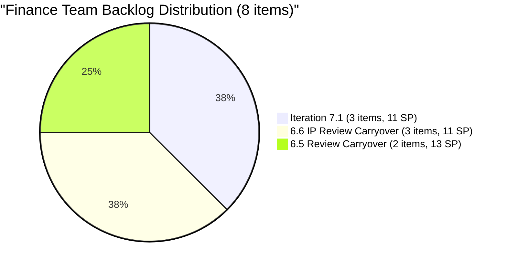
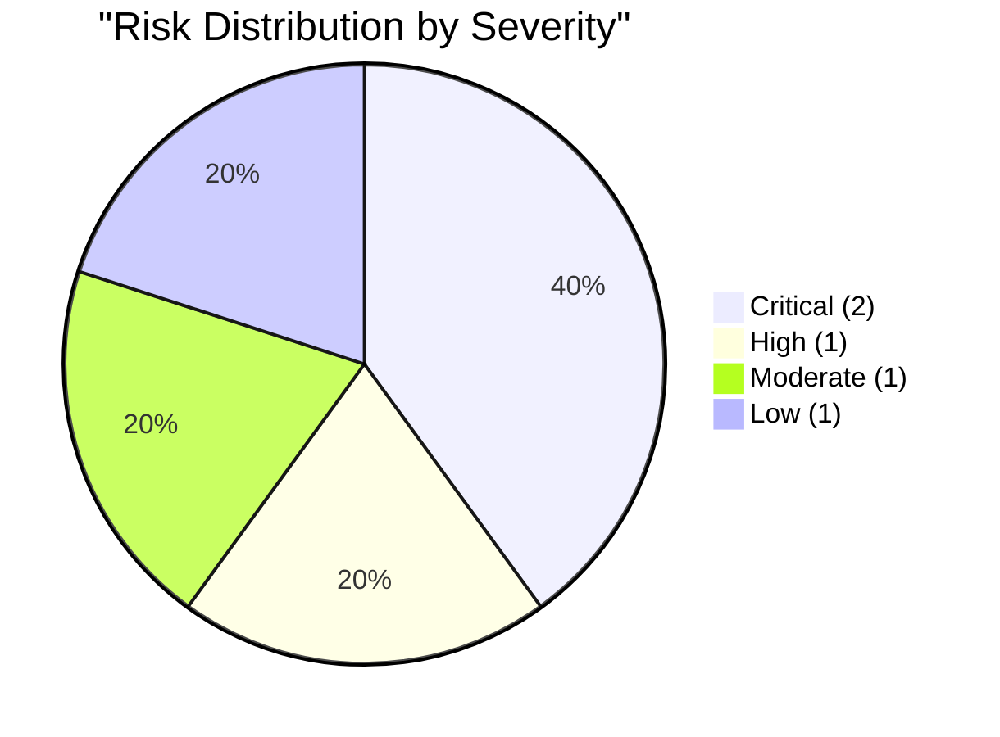

# SAFe Audit Report — Finance Team

## Jairosoft FINOPS Azure DevOps Project

---

## 1. Audit Metadata

| Field | Value |
|-------|-------|
| **Project** | Jairosoft FINOPS |
| **Project ID** | e0bb302f-40f9-46c3-8164-6f1acb317d63 |
| **Team** | Finance Team |
| **Team ID** | 1f4b45fa-82e8-4a36-aedc-6c1bc8f51070 |
| **Backlog** | Stories and Deliverables (`Microsoft.RequirementCategory`) |
| **Board URL** | [Finance Team Board](https://dev.azure.com/jairo/Jairosoft%20FINOPS/_boards/board/t/Finance%20Team/Stories%20and%20Deliverables) |
| **Workspace Folder** | `ado_fin` |
| **Current Iteration** | Iteration 7.1 |
| **Iteration Path** | `Jairosoft FINOPS\2026-PI7\Iteration 7.1` |
| **Iteration Start** | April 6, 2026 |
| **Iteration Finish** | April 19, 2026 |
| **Audit Date** | April 6, 2026 — 09:00 PHT |
| **Audit Day** | Day 1 of 14 (7% elapsed) |
| **Previous Audit** | AUDIT_20260405_0900.md (Apr 5, 2026 09:00 PHT — Audit #24) |
| **Overall Score** | **69.6 / 100** |
| **Risk Band** | **Moderate Risk** |
| **Audit Series** | #25 |
| **Framework** | SAFe 6.0 |
| **Rubric** | ADO SAFe v1 (seven-dimension deterministic scoring) |

**Scope:** Finance Team board only. No other teams, boards, projects, or repositories analyzed.

---

## 2. Executive Summary

This is the **twenty-fifth audit in the series** and the **first audit of PI 7 / Iteration 7.1**. Since Audit #24 (Apr 5, final day of Iteration 6.6 IP):

### Key Changes

1. **PI 7 begins today** — Iteration 7.1 (Apr 6 - Apr 19) is the new active iteration
2. **Backlog remains at 8 items** — no new items added, none closed
3. **3 items in Iteration 7.1:** #198635 (P&L March, 4 SP), #199347 (Finance Presentation, 5 SP), #201448 (eAFS Portal, 2 SP)
4. **3 items still in Iteration 6.6 IP Review:** #198639, #198645, #200465 — PO acceptance remains overdue
5. **2 items still in Iteration 6.5 Review:** #200432, #200446 — now 15+ days overdue
6. **Score moves from 72.5 to 69.6 (-2.9)** — slight decrease due to untouched item penalty in Backlog Refinement

**The Finance Team enters PI 7 with strong DoR compliance and estimation but carries 5 unresolved Review items from PI 6.**

---

## 3. Previous Audit Delta

**Previous:** AUDIT_20260405_0900 — Iteration 6.6 (IP) Day 14 (FINAL), Audit #24

| Metric | Audit #24 (6.6 IP) | **Audit #25 (7.1)** | Delta |
|--------|---------------------|---------------------|-------|
| Visible Backlog | 8 | **8** | 0 |
| Items in Current Iter | 3 (in 6.6) | **3** (in 7.1) | 0 |
| SP in Current Iter | 11 | **11** | 0 |
| Capacity (h/day) | 3 | **3** | 0 |
| Iteration Planning | 37.5 | **37.5** | 0.0 |
| Team Capacity | 100.0 | **100.0** | 0.0 |
| Estimation | 100.0 | **100.0** | 0.0 |
| DoR Compliance | 100.0 | **100.0** | 0.0 |
| Work Item Balance | 70.0 | **70.0** | 0.0 |
| Backlog Refinement | 100.0 | **80.0** | -20.0 |
| Delivery Predictability | 0.0 | **0.0** | 0.0 |
| **Overall** | **72.5** | **69.6** | **-2.9** |
| Risk Band | Moderate Risk | **Moderate Risk** | No change |

**Note:** The -2.9 drop comes from Backlog Refinement: #199347 (March Finance Presentation) has ChangedDate Apr 1, which is before the Iteration 7.1 start date (Apr 6), triggering the untouched-current-items penalty.

---

## 4. Current Iteration Snapshot

### 4.1 Iteration Overview

| Metric | Value |
|--------|-------|
| Sprint Day | Day 1 of 14 (7% elapsed) |
| Items in Iteration 7.1 | 3 |
| Total SP (current iter) | 11 |
| States | 1 Active, 2 Ready |

### 4.2 Team Capacity

| Member | Deployment | Documentation | Requirements | Total/Day |
|--------|-----------|---------------|-------------|-----------|
| Grace | 0 h | 2 h | 1 h | **3 h/day** |

Total sprint capacity: 3 h/day x 14 days = **42 hours**.

### 4.3 Current Iteration Work Items (3 Items, 11 SP)

| ID | Title | State | SP | Changed | DoR |
|----|-------|-------|-----|---------|-----|
| 198635 | P&L March 2026 | **Ready** | 4 | Apr 7 | Pass |
| 199347 | March Jairosoft Finance Presentation | **Active** | 5 | Apr 1 | Pass |
| 201448 | eAFS Portal Submission | **Ready** | 2 | Apr 7 | Pass |

### 4.4 Carryover Items — Iteration 6.6 IP (3 Items, 11 SP)

| ID | Title | State | SP | Changed | Days in Review |
|----|-------|-------|-----|---------|----------------|
| 198639 | Jairosoft Balance Sheet March 2026 | **Review** | 3 | Apr 1 | 5+ days |
| 198645 | CFS March 2026 | **Review** | 3 | Apr 1 | 5+ days |
| 200465 | Payroll Variance & Audit Report | **Review** | 5 | Apr 3 | 3+ days |

### 4.5 Carryover Items — Iteration 6.5 (2 Items, 13 SP)

| ID | Title | State | SP | Changed | Days in Review |
|----|-------|-------|-----|---------|----------------|
| 200432 | Salary & Earnings Automation | **Review** | 8 | Mar 19 | 18+ days |
| 200446 | Standardized Benefits & Deductions | **Review** | 5 | Mar 22 | 15+ days |

---

## 5. Work Item Analysis

### 5.1 Backlog Composition (8 Items)

| Location | Count | SP |
|----------|-------|-----|
| Iteration 7.1 | 3 | 11 |
| Iteration 6.6 IP (carryover) | 3 | 11 |
| Iteration 6.5 (carryover) | 2 | 13 |
| **Total** | **8** | **35** |

### 5.2 Tax Compliance Update

| Item | Status | Days to April 15 BIR Deadline |
|------|--------|-------------------------------|
| #201448 eAFS Portal Submission | Ready (PI7, 2 SP) | **9 days** |

### 5.3 PO Acceptance Bottleneck

5 items totaling 24 SP remain in Review across two prior iterations:
- 3 items from Iteration 6.6 IP (11 SP)
- 2 items from Iteration 6.5 (13 SP)



---

## 6. SAFe Compliance Scorecard

| # | Dimension | Score | Formula | Evidence | Notes |
|---|-----------|-------|---------|----------|-------|
| 1 | Iteration Planning | **37.5** | 3/8 x 100 | 3 of 8 in Iter 7.1 | 5 carryover items suppress ratio |
| 2 | Team Capacity | **100.0** | 1/1 x 100 | Grace: 3 h/day active | Stable |
| 3 | Estimation | **100.0** | 3/3 x 100 | All 3 current items have SP > 0 | Total 11 SP |
| 4 | DoR Compliance | **100.0** | 3/3 x 100 | All 3 pass Desc >= 30 AND AC >= 20 | Best-in-class |
| 5 | Work Item Balance | **70.0** | 100 - 30 | 100% User Stories; dominant > 60% | -30 penalty |
| 6 | Backlog Refinement | **80.0** | 100.0 - 20 | 1/3 untouched current items > 30% | #199347 untouched |
| 7 | Delivery Predictability | **0.0** | 0/11 x 100 | Day 1 — no closures yet | Early-sprint — low delivery expected |
| | **Overall** | **69.6** | 487.5 / 7 | | **Moderate Risk (60-79.9)** |

### Score Computation

```
--- Iteration Planning ---
visible_root_backlog_items = 8
current_iteration_root_items = 3 (198635, 199347, 201448)
Score = round(3/8 x 100, 1) = 37.5

--- Team Capacity ---
contributors_with_current_work = 1 (Grace — assigned to all 3)
contributors_with_capacity = 1 (Grace: 3 h/day)
Score = round(1/1 x 100, 1) = 100.0

--- Estimation ---
point_eligible_current_items = 3 (all User Stories)
estimated_current_items = 3 (198635:4, 199347:5, 201448:2)
Score = round(3/3 x 100, 1) = 100.0

--- DoR Compliance ---
All 3 items pass DoR:
  198635: P&L desc (detailed user story) + AC (accuracy, comparison, categorization) = PASS
  199347: Presentation desc (stakeholder alignment) + AC (deck review, delivery) = PASS
  201448: eAFS desc (portal upload) + AC (PDF format, naming, receipt) = PASS
Score = round(3/3 x 100, 1) = 100.0

--- Work Item Balance ---
100% User Story => has User Story => no -40
dominant_type_share = 100% > 60% => -30
spike_share = 0% => no -20
Score = 100 - 30 = 70.0

--- Backlog Refinement ---
Reference date: 2026-04-06
45-day cutoff: 2026-02-20
90-day cutoff: 2026-01-06
180-day cutoff: 2025-10-09

All 8 visible items:
  198635: Apr 7 = fresh
  198639: Apr 1 = fresh
  198645: Apr 1 = fresh
  199347: Apr 1 = fresh
  200432: Mar 19 = fresh
  200446: Mar 22 = fresh
  200465: Apr 3 = fresh
  201448: Apr 7 = fresh
fresh = 8/8 = 100% => base = 100.0
stale_90 = 0; stale_180 = 0 => no stale penalties

untouched_current: items in Iter 7.1 whose ChangedDate < Apr 6:
  198635: Apr 7 >= Apr 6 => touched
  199347: Apr 1 < Apr 6 => UNTOUCHED
  201448: Apr 7 >= Apr 6 => touched
untouched = 1/3 = 33.3% > 30% => -20
Score = max(100.0 - 20, 0) = 80.0

--- Delivery Predictability ---
committed_story_points = 4 + 5 + 2 = 11
closed_story_points = 0 (Day 1, no items Closed/Done)
Score = round(0/11 x 100, 1) = 0.0
Early-sprint: Day 1 of 14

--- Overall ---
(37.5 + 100.0 + 100.0 + 100.0 + 70.0 + 80.0 + 0.0) / 7 = 487.5 / 7 = 69.6
Risk Band: Moderate Risk (60-79.9)
```

---

## 7. Dimension Findings

### 7.1 Iteration Planning (37.5/100) — HIGH

3 of 8 visible backlog items in the current iteration. The ratio is structurally depressed by 5 carryover items in Review state across prior iterations. If the 3 Iteration 6.6 items were accepted, the backlog would shrink and this dimension would improve significantly.

### 7.2 Team Capacity (100.0/100) — EXCELLENT

Grace at 3 h/day (Documentation 2h + Requirements 1h). Stable and consistent configuration.

### 7.3 Estimation (100.0/100) — EXCELLENT

All 3 current iteration items have Story Points. Total committed: 11 SP.

### 7.4 DoR Compliance (100.0/100) — EXCELLENT

All 3 current items pass DoR with well-structured descriptions and acceptance criteria. Best-in-class across the portfolio.

### 7.5 Work Item Balance (70.0/100) — MODERATE

100% User Stories. Structural limitation inherent to the Finance Team's work type. The -30 penalty for dominant type > 60% is unavoidable given the team's scope.

### 7.6 Backlog Refinement (80.0/100) — LOW RISK

All 8 items are fresh (within 45 days). However, #199347 (March Finance Presentation) has ChangedDate Apr 1, predating the Iteration 7.1 start (Apr 6). This triggers the untouched-current-items penalty (-20) since 1/3 = 33.3% > 30%.

### 7.7 Delivery Predictability (0.0/100) — CRITICAL (Expected)

Day 1 of a 14-day sprint. Zero items closed. **Early-sprint — low delivery expected.** This dimension will improve as Grace progresses through the sprint.

---

## 8. Risks and Bottlenecks



### CRITICAL: 5 Items in Review — PO Acceptance Overdue

- 3 items from Iteration 6.6 IP (#198639, #198645, #200465) — 11 SP, 3-5 days overdue
- 2 items from Iteration 6.5 (#200432, #200446) — 13 SP, 15-18 days overdue

Total: 24 SP of completed work blocked by PO acceptance. This suppresses Iteration Planning and distorts velocity tracking.

**Owner: Ramon (PO). Action: Accept immediately.**

### CRITICAL: #201448 eAFS Portal Submission — 9 Days to BIR Deadline

The April 15 BIR deadline is 9 days away. The eAFS submission is the final tax compliance step. This item should be the top priority for the sprint.

### HIGH: Delivery Predictability Structurally at Risk

The PO acceptance bottleneck from PI 6 could recur. If Grace completes work but items sit in Review, Delivery Predictability will score 0 again at sprint close.

### MODERATE: #199347 Untouched Since Apr 1

The March Finance Presentation is in Active state but unchanged since Apr 1 (5 days). This triggers the Backlog Refinement penalty and may indicate a blocked item.

### LOW: Bus Factor = 1 (Structural, Unchanged)

Grace is the sole Finance Team contributor.

---

## 9. Prioritized Recommendations

| Priority | Action | Owner | Target | Impact |
|----------|--------|-------|--------|--------|
| 1 | **Accept 3 Iter 6.6 Review items** (#198639, #198645, #200465) | Ramon (PO) | **Today** | 11 SP closed; Iter Planning improves |
| 2 | **Accept 2 Iter 6.5 Review items** (#200432, #200446) | Ramon (PO) | **Today** | 13 SP closed; backlog cleaned |
| 3 | **Prioritize #201448 (eAFS)** | Grace | Week 1 | April 15 BIR deadline |
| 4 | **Update #199347** to refresh ChangedDate | Grace | Day 1-2 | Removes untouched penalty |

---

## 10. Evidence Gaps and Limitations

| Gap | Impact | Notes |
|-----|--------|-------|
| Day 1 of sprint | Delivery Predictability = 0.0 | Expected; will improve |
| 5 items in Review across prior iters | Iter Planning at 37.5 | PO acceptance bottleneck |
| #199347 untouched since Apr 1 | Backlog Refinement penalty -20 | May need update |
| Rubric stable at 7-dim | No rubric transition this audit | Consistent with #24 |
| PO acceptance pattern | Risk of recurrence in PI7 | Systemic process gap |

---

### Full Score History (Audits #1-#25)

| # | Date | Iter | Day | Score | Band | Rubric |
|---|------|------|-----|-------|------|--------|
| 1 | Feb 25 | 6.3 | -- | 45.0 | High | 6-dim |
| 14 | Mar 25 | 6.6 | 3 | 89.5 | Low | 6-dim |
| 21 | Apr 1 | 6.6 | 10 | 84.6 | Low | 6-dim |
| 24 | Apr 5 | 6.6 | 14 | 72.5 | Moderate | 7-dim |
| **25** | **Apr 6** | **7.1** | **1** | **69.6** | **Moderate** | **7-dim** |

---

*Report generated: April 6, 2026 09:00 PHT*
*Auditor: AI EngProd Consultant (SAFe 6.0)*
*Rubric: ADO SAFe v1 (seven-dimension deterministic scoring)*
*Audit #25 | Iteration 7.1 Day 1 of 14 | Score: 69.6/100 (Moderate Risk)*
*Previous: AUDIT_20260405_0900 (72.5/100 — Moderate Risk)*
*Delta: -2.9 — PI7 Day 1; 5 Review items still pending PO acceptance; eAFS deadline in 9 days*
