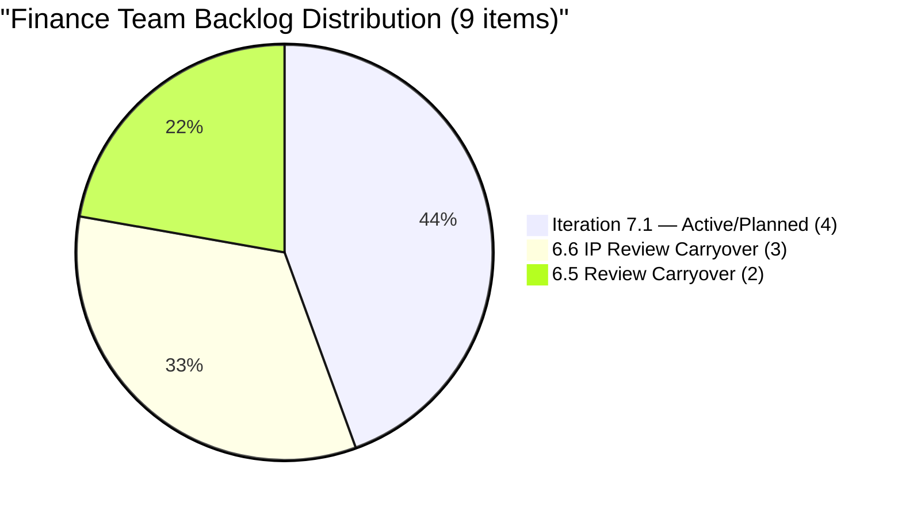
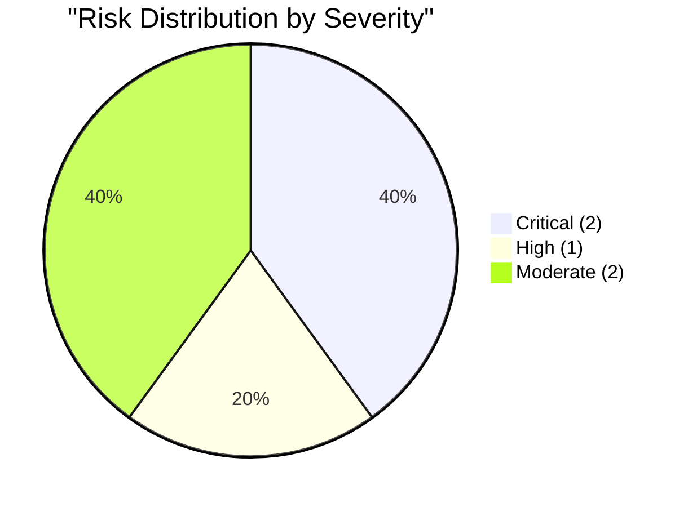

# SAFe Audit Report — Finance Team

## Jairosoft FINOPS Azure DevOps Project

---

## 1. Audit Metadata

| Field | Value |
|-------|-------|
| **Project** | Jairosoft FINOPS |
| **Project ID** | e0bb302f-40f9-46c3-8164-6f1acb317d63 |
| **Team** | Finance Team |
| **Team ID** | 1f4b45fa-82e8-4a36-aedc-6c1bc8f51070 |
| **Backlog** | Stories and Deliverables (`Microsoft.RequirementCategory`) |
| **Board URL** | [Finance Team Board](https://dev.azure.com/jairo/Jairosoft%20FINOPS/_boards/board/t/Finance%20Team/Stories%20and%20Deliverables) |
| **Workspace Folder** | `ado_fin` |
| **Current Iteration** | Iteration 7.1 |
| **Iteration Path** | `Jairosoft FINOPS\2026-PI7\Iteration 7.1` |
| **Iteration Start** | April 6, 2026 |
| **Iteration Finish** | April 19, 2026 |
| **Audit Date** | April 7, 2026 — 09:00 PHT |
| **Audit Day** | Day 2 of 14 (14% elapsed) |
| **Previous Audit** | AUDIT_20260406_0900.md (Apr 6, 2026 — Audit #25, Score: 69.6) |
| **Overall Score** | **66.3 / 100** |
| **Risk Band** | **Moderate Risk** |
| **Audit Series** | #26 |
| **Framework** | SAFe 6.0 |
| **Rubric** | ADO SAFe v1 (seven-dimension deterministic scoring) |

**Scope:** Finance Team board only. No other teams, boards, projects, or repositories analyzed.

---

## 2. Executive Summary

This is the **twenty-sixth audit in the series** and the **second audit of PI 7 / Iteration 7.1**. Since Audit #25 (Apr 6, Day 1):

### Key Changes Since Yesterday

1. **New item added:** #202416 "Escalation and Service Suspension Workflow" (Issue type, New state) — assigned to Iteration 7.1; backlog grows from 8 to **9 items**
2. **#201448 (eAFS Portal)** is now Active — Grace has started the priority BIR deadline item
3. **5 carryover Review items persist** — no PO acceptance completed overnight
4. **Score drops from 69.6 to 66.3 (−3.3):** Addition of #202416 (Issue type without AC, missing SP) introduces DoR and Estimation penalties that did not exist yesterday

**Key concern:** #202416 entered the sprint as an Issue with no Acceptance Criteria and no Story Points. The April 15 BIR eAFS deadline is now **8 days away** and must remain the team's top priority.

---

## 3. Previous Audit Delta

**Previous:** AUDIT_20260406_0900 — Iteration 7.1 Day 1, Audit #25

| Metric | Audit #25 (Day 1) | **Audit #26 (Day 2)** | Delta |
|--------|--------------------|-----------------------|-------|
| Visible Backlog | 8 | **9** | +1 |
| Items in Current Iter | 3 | **4** | +1 |
| SP in Current Iter | 11 | **11** | 0* |
| DoR Passing | 3/3 (100%) | **3/4 (75%)** | −25% |
| Iteration Planning | 37.5 | **44.4** | +6.9 |
| Team Capacity | 100.0 | **100.0** | 0.0 |
| Estimation | 100.0 | **75.0** | −25.0 |
| DoR Compliance | 100.0 | **75.0** | −25.0 |
| Work Item Balance | 70.0 | **70.0** | 0.0 |
| Backlog Refinement | 80.0 | **100.0** | +20.0 |
| Delivery Predictability | 0.0 | **0.0** | 0.0 |
| **Overall** | **69.6** | **66.3** | **−3.3** |
| Risk Band | Moderate Risk | **Moderate Risk** | No change |

*\*#202416 (Issue) has no Story Points — does not add to committed SP; committed SP remains 11.*

**Note on Backlog Refinement improvement:** Yesterday's -20 penalty was triggered by #199347 being untouched (ChangedDate Apr 1 < iter start Apr 6). Today #199347's ChangedDate is still Apr 1, but the untouched ratio is now 1/4 = 25% (not > 30%), so the -20 penalty no longer applies. Score moves from 80 to 100.

---

## 4. Current Iteration Snapshot

### 4.1 Iteration 7.1 — Work Items (4 Items)

| ID | Title | Type | SP | State | Changed | DoR |
|----|-------|------|----|-------|---------|-----|
| 198635 | P&L March 2026 | US | 4 | Ready | Apr 7 | PASS |
| 199347 | March Jairosoft Finance Presentation | US | 5 | Active | Apr 1 | PASS |
| 201448 | eAFS Portal Submission | US | 2 | Active | Apr 7 | PASS |
| 202416 | Escalation and Service Suspension Workflow | Issue | — | New | Apr 7 | **FAIL** (no AC) |

### 4.2 Team Capacity

| Member | Deployment | Documentation | Requirements | Total/Day |
|--------|-----------|---------------|-------------|-----------|
| Grace | 0 h | 2 h | 1 h | **3 h/day** |

Sprint capacity: 3 h/day × 14 days = **42 hours total**

### 4.3 Carryover Items (5 Items — NOT in Current Iteration)

| ID | Title | Iter | SP | State | Days in Review |
|----|-------|------|-----|-------|----------------|
| 198639 | Jairosoft Balance Sheet March 2026 | 6.6 IP | 3 | Review | 6+ days |
| 198645 | CFS March 2026 | 6.6 IP | 3 | Review | 6+ days |
| 200465 | Payroll Variance & Audit Report | 6.6 IP | 5 | Review | 4+ days |
| 200432 | Salary & Earnings Automation | 6.5 | 8 | Review | 19+ days |
| 200446 | Standardized Benefits & Deductions | 6.5 | 5 | Review | 16+ days |

**Total carryover SP in Review: 24 SP across 5 items — PO acceptance still outstanding.**

---

## 5. Work Item Analysis

### 5.1 Backlog Composition (9 Items)

| Location | Count | SP |
|----------|-------|-----|
| Iteration 7.1 | 4 | 11 (3 US) + 0 (Issue) |
| Iteration 6.6 IP (carryover) | 3 | 11 |
| Iteration 6.5 (carryover) | 2 | 13 |
| **Total** | **9** | **35** |

### 5.2 Sprint Type Distribution (4 Items)

| Type | Count | Share |
|------|-------|-------|
| User Story | 3 | 75% |
| Issue | 1 | 25% |
| **Total** | **4** | **100%** |

### 5.3 BIR Deadline Tracker

| Item | State | SP | Days to April 15 |
|------|-------|----|-----------------|
| #201448 eAFS Portal Submission | **Active** | 2 | **8 days** |

### 5.4 PO Acceptance Bottleneck



---

## 6. SAFe Compliance Scorecard

| # | Dimension | Score | Formula | Evidence | Notes |
|---|-----------|-------|---------|----------|-------|
| 1 | Iteration Planning | **44.4** | 4/9 × 100 | 4 of 9 in Iter 7.1 | Improved from 37.5; new item added |
| 2 | Team Capacity | **100.0** | 1/1 × 100 | Grace: 3 h/day active | Stable |
| 3 | Estimation | **75.0** | 3/4 × 100 | #202416 (Issue) has no SP | New item lacks estimate |
| 4 | DoR Compliance | **75.0** | 3/4 × 100 | #202416 lacks AC | Issue type — no AC populated |
| 5 | Work Item Balance | **70.0** | 100 − 30 | US 75% > 60%; dominant penalty | Has User Story ✓ |
| 6 | Backlog Refinement | **100.0** | base 100; untouched 1/4 = 25% ≤ 30% | No penalty triggered | Improved from 80.0 |
| 7 | Delivery Predictability | **0.0** | 0/11 × 100 | Day 2 — no closures | Early-sprint expected |
| | **Overall** | **66.3** | 464.4 / 7 | | **Moderate Risk (60–79.9)** |

### Score Computation

```
--- Iteration Planning ---
visible_root_backlog_items = 9
current_iteration_root_items = 4 (198635, 199347, 201448, 202416)
Score = round(4/9 × 100, 1) = 44.4

--- Team Capacity ---
contributors_with_current_work = 1 (Grace — assigned to all 4 items)
contributors_with_capacity = 1 (Grace: 3 h/day)
Score = round(1/1 × 100, 1) = 100.0

--- Estimation ---
point_eligible_current_items = 4 (all in RequirementCategory)
estimated_current_items = 3 (198635:4, 199347:5, 201448:2; 202416 has no SP)
committed_story_points = 4 + 5 + 2 = 11
Score = round(3/4 × 100, 1) = 75.0

--- DoR Compliance ---
current_iteration_root_items = 4
PASS (Desc >= 30 nws AND AC >= 20 nws):
  198635: Desc (As a Dept Manager..., ~50 nws) + AC (Accuracy, Comparison, etc.) = PASS
  199347: Desc (As a Finance Ops Stakeholder..., ~40 nws) + AC (deck review, delivery, etc.) = PASS
  201448: Desc (As a Finance Associate..., ~30 nws) + AC (AC1-AC4 detailed) = PASS
FAIL:
  202416: Desc ~50 nws (OK) BUT AcceptanceCriteria = null = FAIL
Score = round(3/4 × 100, 1) = 75.0

--- Work Item Balance ---
3 User Story + 1 Issue; has User Story => no -40
dominant_type = US at 75% > 60% => -30
spike_share = 0% => no -20
Score = 100 - 30 = 70.0

--- Backlog Refinement ---
Reference date: 2026-04-07
45-day cutoff: 2026-02-21
90-day cutoff: 2026-01-07
180-day cutoff: 2025-10-10

All 9 items:
  198635: Apr 7 = fresh
  198639: Apr 1 = fresh
  198645: Apr 1 = fresh
  199347: Apr 1 = fresh
  200432: Mar 19 = fresh
  200446: Mar 22 = fresh
  200465: Apr 3 = fresh
  201448: Apr 7 = fresh
  202416: Apr 7 = fresh
fresh = 9/9 = 100% => base = 100.0
stale_90 = 0; stale_180 = 0 => no stale penalties

untouched_current (ChangedDate < iter start Apr 6):
  198635: Apr 7 >= Apr 6 => touched
  199347: Apr 1 < Apr 6 => UNTOUCHED
  201448: Apr 7 >= Apr 6 => touched
  202416: Apr 7 >= Apr 6 => touched
untouched = 1/4 = 25.0% — NOT > 30% => no -20 penalty
Score = 100.0

--- Delivery Predictability ---
committed_story_points = 11 (3 estimated items with SP)
closed_story_points = 0 (Day 2, nothing Closed/Done)
Score = round(0/11 × 100, 1) = 0.0

--- Overall ---
(44.4 + 100.0 + 75.0 + 75.0 + 70.0 + 100.0 + 0.0) / 7 = 464.4 / 7 = 66.3
Risk Band: Moderate Risk (60–79.9)
```

---

## 7. Dimension Findings

### 7.1 Iteration Planning (44.4/100) — HIGH

4 of 9 visible backlog items are in the current iteration. Improved from 37.5% as the new item #202416 was added directly to Iter 7.1. The ratio remains structurally depressed by the 5 carryover items stuck in Review from PI 6. **If Ramon accepts the 5 carryover Review items today, the backlog drops to 4 items with 4 in-sprint = 100.0.**

### 7.2 Team Capacity (100.0/100) — EXCELLENT

Grace at 3 h/day (Documentation 2h + Requirements 1h). Stable and consistent. No days off configured.

### 7.3 Estimation (75.0/100) — MODERATE

#202416 (Issue type) has no Story Points. The Issue work item type in ADO typically does not enforce SP, but for SAFe scoring purposes it is point-eligible as a RequirementCategory item. Grace or Ramon should add an SP estimate to this item.

### 7.4 DoR Compliance (75.0/100) — MODERATE

#202416 entered the sprint without Acceptance Criteria. The Description is adequate (~50 nws: "As a Collections Specialist, I want a structured escalation path..."), but no AC has been added. This item should have AC defined before Grace begins work.

### 7.5 Work Item Balance (70.0/100) — MODERATE

3 User Stories + 1 Issue. User Story dominates at 75% > 60%, triggering the -30 penalty. The presence of an Issue type (escalation workflow) is unusual for the Finance Team and warrants validation of correct item type.

### 7.6 Backlog Refinement (100.0/100) — EXCELLENT

All 9 items are fresh. The untouched-current ratio of 1/4 = 25% does not exceed the 30% threshold, so no penalty applies. Score recovers to 100 from yesterday's 80. If #199347 is updated by Grace today, the untouched ratio drops to 0%.

### 7.7 Delivery Predictability (0.0/100) — CRITICAL (Expected)

Day 2 of 14. No items closed. **Early-sprint — expected.** The Finance Team has consistently delivered 100% once PO acceptance is cleared.

---

## 8. Risks and Bottlenecks



### CRITICAL: April 15 BIR eAFS Deadline — 8 Days Remaining

#201448 (eAFS Portal Submission, 2 SP) is now Active. Grace has started this item. The BIR deadline of April 15 is non-negotiable — missing it constitutes a regulatory compliance failure.

**Owner: Grace. Action: Complete by April 14 at the latest.**

### CRITICAL: 5 Items in Review — PO Acceptance Now 2+ Weeks Overdue

- 2 items from Iteration 6.5 (#200432, #200446) — 13 SP, 16–19 days overdue
- 3 items from Iteration 6.6 IP (#198639, #198645, #200465) — 11 SP, 4–6 days overdue

This is a systemic process failure. 24 SP of completed work is blocked from being counted in Delivery Predictability. Accepting these items would also immediately improve Iteration Planning from 44.4 to 100.0.

**Owner: Ramon (PO). Action: Accept all 5 today.**

### HIGH: #202416 Entered Sprint Without AC or SP

The new Issue item (#202416) lacks both Acceptance Criteria and Story Points. Items should meet DoR before entering a sprint. This is a pre-sprint gate failure.

### MODERATE: #199347 Unchanged Since Apr 1

The March Finance Presentation is in Active state but has not been updated since April 1 (6 days). While the 25% untouched ratio does not trigger a penalty today, if a Day 3+ item is also untouched, the ratio would exceed 30% and reinstate the -20 penalty.

### MODERATE: Issue Type Classification for #202416

The "Escalation and Service Suspension Workflow" was created as an Issue type rather than a User Story. In SAFe, work items at the team backlog level should typically be User Stories. Validate whether this item is correctly classified.

---

## 9. Prioritized Recommendations

| Priority | Action | Owner | Target | Impact |
|----------|--------|-------|--------|--------|
| 1 | **Accept 5 Review items** (#198639, #198645, #200465, #200432, #200446) | Ramon (PO) | **Today** | Backlog drops to 4; Iter Planning → 100.0 |
| 2 | **Prioritize #201448 (eAFS)** — must complete by Apr 14 | Grace | Apr 14 | BIR compliance |
| 3 | **Add AC to #202416** (Escalation Workflow) | Grace / Ramon | Day 2–3 | DoR → 100%; Score → 69.6 |
| 4 | **Add SP to #202416** | Grace / Ramon | Day 2–3 | Estimation → 100%; Score +1.8 |
| 5 | **Update #199347** (change state or add comment) | Grace | Day 2 | Prevents future untouched penalty |

---

## 10. Evidence Gaps and Limitations

| Gap | Impact | Notes |
|-----|--------|-------|
| Day 2 of sprint | Delivery Predictability = 0.0 | Expected |
| 5 items in Review across prior iters | Iter Planning at 44.4 | PO acceptance overdue |
| #202416 no AC | DoR at 75% | Needs AC before work begins |
| #202416 no SP | Estimation at 75% | Needs estimate |
| #199347 unchanged since Apr 1 | Untouched at 25% (below threshold) | Monitor; if any other item goes untouched, penalty applies |
| Issue type classification | Rubric impact via Work Item Balance | Validate correct WIT for #202416 |

---

### Score History (Audits #21–#26)

| # | Date | Iter | Day | Score | Band |
|---|------|------|-----|-------|------|
| 21 | Apr 1 | 6.6 | 10 | 84.6 | Low |
| 24 | Apr 5 | 6.6 | 14 | 72.5 | Moderate |
| 25 | Apr 6 | 7.1 | 1 | 69.6 | Moderate |
| **26** | **Apr 7** | **7.1** | **2** | **66.3** | **Moderate** |

---

*Report generated: April 7, 2026 09:00 PHT*
*Auditor: AI EngProd Consultant (SAFe 6.0)*
*Rubric: ADO SAFe v1 (seven-dimension deterministic scoring)*
*Audit #26 | Iteration 7.1 Day 2 of 14 | Score: 66.3/100 (Moderate Risk)*
*Previous: AUDIT_20260406_0900 (69.6/100 — Moderate Risk)*
*Delta: −3.3 — New item #202416 added without AC or SP; BIR deadline 8 days away; PO acceptance still pending for 5 items*
