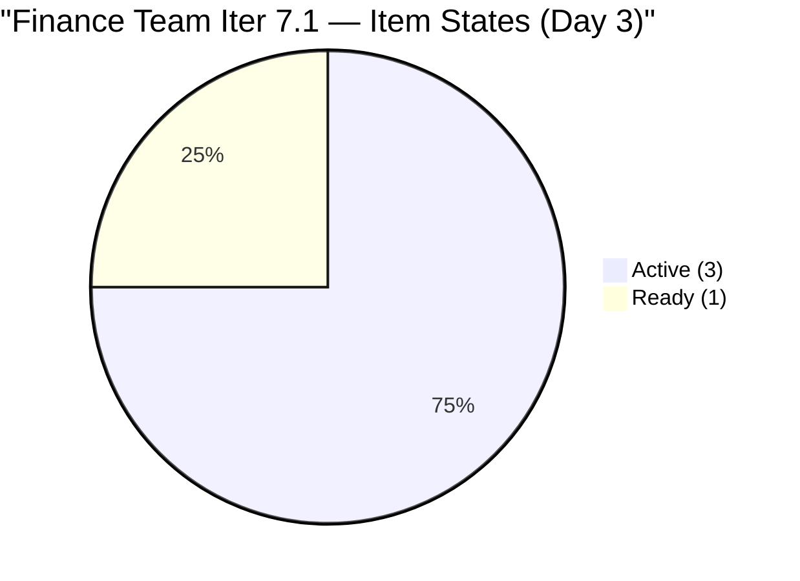
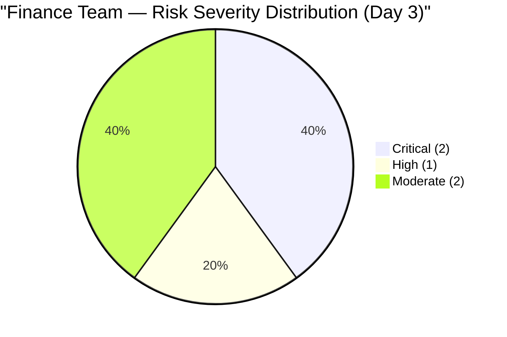

# SAFe Audit Report — Finance Team

## Jairosoft FINOPS Azure DevOps Project

---

## 1. Audit Metadata

| Field | Value |
|-------|-------|
| **Project** | Jairosoft FINOPS |
| **Project ID** | e0bb302f-40f9-46c3-8164-6f1acb317d63 |
| **Team** | Finance Team |
| **Team ID** | 1f4b45fa-82e8-4a36-aedc-6c1bc8f51070 |
| **Backlog** | Stories and Deliverables (`Microsoft.RequirementCategory`) |
| **Board URL** | [Finance Team Board](https://dev.azure.com/jairo/Jairosoft%20FINOPS/_boards/board/t/Finance%20Team/Stories%20and%20Deliverables) |
| **Workspace Folder** | `ado_fin` |
| **Current Iteration** | Iteration 7.1 |
| **Iteration Path** | `Jairosoft FINOPS\2026-PI7\Iteration 7.1` |
| **Iteration Start** | April 6, 2026 |
| **Iteration Finish** | April 19, 2026 |
| **Audit Date** | April 8, 2026 — 09:00 PHT |
| **Audit Day** | Day 3 of 14 (21% elapsed) |
| **Previous Audit** | AUDIT_20260407_0900.md (Apr 7, 2026 — Audit #26, Score: 66.3) |
| **Overall Score** | **66.3 / 100** |
| **Risk Band** | **Moderate Risk** |
| **Audit Series** | #27 |
| **Framework** | SAFe 6.0 |
| **Rubric** | ADO SAFe v1 (seven-dimension deterministic scoring) |

**Scope:** Finance Team board only. No other teams, boards, projects, or repositories analyzed.

---

## 2. Executive Summary

This is the **twenty-seventh audit in the series** and the **third audit of PI 7 / Iteration 7.1**. Since Audit #26 (Apr 7, Day 2):

### Key Changes Since Yesterday

1. **#199347 updated today (Apr 8):** "March Jairosoft Finance Presentation" — changed today, clearing its untouched status. The untouched ratio in the current iteration is now 0/4 = 0% (down from 25% yesterday).
2. **#198635 updated today (Apr 8):** P&L March 2026 — Grace is actively progressing this item.
3. **#202416 remains without AC and SP** — no remediation yet. This item entered the sprint 2 days ago without meeting DoR.
4. **5 carryover Review items persist** — PO acceptance still outstanding after 3 days of the new sprint.
5. **Score holds at 66.3** — no structural change; backlog refinement remains clean, DoR/Estimation still penalized by #202416.

**Key urgency:** The BIR eAFS deadline is now **7 days away (April 15)**. #201448 is Active. The 5 carryover Review items continue to inflate the backlog denominator and suppress Iteration Planning.

---

## 3. Previous Audit Delta

**Previous:** AUDIT_20260407_0900 — Iteration 7.1 Day 2, Audit #26

| Metric | Audit #26 (Day 2) | **Audit #27 (Day 3)** | Delta |
|--------|--------------------|-----------------------|-------|
| Visible Backlog | 9 | **9** | 0 |
| Items in Current Iter | 4 | **4** | 0 |
| SP Committed (US/Issues) | 11 | **11** | 0 |
| DoR Passing | 3/4 (75%) | **3/4 (75%)** | 0 |
| Iteration Planning | 44.4 | **44.4** | 0.0 |
| Team Capacity | 100.0 | **100.0** | 0.0 |
| Estimation | 75.0 | **75.0** | 0.0 |
| DoR Compliance | 75.0 | **75.0** | 0.0 |
| Work Item Balance | 70.0 | **70.0** | 0.0 |
| Backlog Refinement | 100.0 | **100.0** | 0.0 |
| Delivery Predictability | 0.0 | **0.0** | 0.0 |
| **Overall** | **66.3** | **66.3** | **0.0** |
| Risk Band | Moderate Risk | **Moderate Risk** | No change |

**Notable:** #199347 was updated Apr 8 (vs. Apr 1 yesterday). The untouched-current penalty threshold calculation: untouched_current = 0/4 = 0% — continues to be penalty-free. Score is stable at 100.0 for Backlog Refinement.

---

## 4. Current Iteration Snapshot

### 4.1 Iteration 7.1 — Work Items (4 Items)

| ID | Title | Type | SP | State | Changed | DoR |
|----|-------|------|----|-------|---------|-----|
| 198635 | P&L March 2026 | US | 4 | Ready | Apr 8 | PASS |
| 199347 | March Jairosoft Finance Presentation | US | 5 | Active | Apr 8 | PASS |
| 201448 | eAFS Portal Submission | US | 2 | Active | Apr 7 | PASS |
| 202416 | Escalation and Service Suspension Workflow | Issue | — | Active | Apr 8 | **FAIL** (no AC) |

### 4.2 BIR Deadline Countdown

| Item | State | SP | Days to April 15 |
|------|-------|----|-----------------|
| #201448 eAFS Portal Submission | **Active** | 2 | **7 days** |

**Grace must complete #201448 by April 14 to allow buffer before the April 15 BIR deadline.**

### 4.3 Team Capacity

| Member | Documentation | Requirements | Total/Day | Sprint Total |
|--------|---------------|-------------|-----------|-------------|
| Grace | 2 h/day | 1 h/day | **3 h/day** | 42 hours |

### 4.4 Carryover Items (5 Items — NOT in Current Iteration)

| ID | Title | Iter | SP | State | Days in Review |
|----|-------|------|-----|-------|----------------|
| 198639 | Jairosoft Balance Sheet March 2026 | 6.6 IP | 3 | Review | 7+ days |
| 198645 | CFS March 2026 | 6.6 IP | 3 | Review | 7+ days |
| 200465 | Payroll Variance & Audit Report | 6.6 IP | 5 | Review | 5+ days |
| 200432 | Salary & Earnings Automation | 6.5 | 8 | Review | 20+ days |
| 200446 | Standardized Benefits & Deductions | 6.5 | 5 | Review | 17+ days |

**Total carryover SP blocked in Review: 24 SP. PO acceptance is 3 sprints overdue for 2 items.**

---

## 5. Work Item Analysis

### 5.1 Backlog Composition (9 Items)

| Location | Count | SP |
|----------|-------|-----|
| Iteration 7.1 | 4 | 11 (US only) |
| Carryover — 6.6 IP Review | 3 | 11 |
| Carryover — 6.5 Review | 2 | 13 |
| **Total** | **9** | **35** |

### 5.2 Sprint State Distribution (4 Items)



### 5.3 Work Item Type Mix (4 Sprint Items)

| Type | Count | Share | SP |
|------|-------|-------|----|
| User Story | 3 | 75% | 11 |
| Issue | 1 | 25% | 0 |
| **Total** | **4** | **100%** | **11** |

### 5.4 #202416 DoR Gap Tracking

| Field | Status | Notes |
|-------|--------|-------|
| Description | PASS | ~50 nws — adequate |
| Acceptance Criteria | **FAIL** | null — missing entirely |
| Story Points | **FAIL** | null — no estimate |
| Days in sprint without AC | **3** | Entered Apr 6 |

---

## 6. SAFe Compliance Scorecard

| # | Dimension | Score | Formula | Evidence | Notes |
|---|-----------|-------|---------|----------|-------|
| 1 | Iteration Planning | **44.4** | 4/9 × 100 | 4 of 9 in Iter 7.1 | Unchanged — carryover items persist |
| 2 | Team Capacity | **100.0** | 1/1 × 100 | Grace: 3 h/day active | Stable |
| 3 | Estimation | **75.0** | 3/4 × 100 | #202416 (Issue) has no SP | Day 3 without SP — escalate |
| 4 | DoR Compliance | **75.0** | 3/4 × 100 | #202416 lacks AC | Day 3 without AC — escalate |
| 5 | Work Item Balance | **70.0** | 100 − 30 | US 75% > 60% — type dominance | Has User Story ✓ |
| 6 | Backlog Refinement | **100.0** | base 100; untouched 0/4 = 0% | All 9 fresh; no penalties | #199347 updated Apr 8 |
| 7 | Delivery Predictability | **0.0** | 0/11 × 100 | Day 3 — no closures | Early-sprint (expected) |
| | **Overall** | **66.3** | 464.4 / 7 | | **Moderate Risk (60–79.9)** |

### Score Computation

```
--- Iteration Planning ---
visible_root_backlog_items = 9
current_iteration_root_items = 4 (198635, 199347, 201448, 202416)
Score = round(4/9 × 100, 1) = 44.4

--- Team Capacity ---
contributors_with_current_work = 1 (Grace — assigned to all 4 items)
contributors_with_capacity = 1 (Grace: 3 h/day)
Score = round(1/1 × 100, 1) = 100.0

--- Estimation ---
point_eligible_current_items = 4
estimated_current_items = 3 (198635:4, 199347:5, 201448:2)
202416 has no SP => excluded from committed
committed_story_points = 4 + 5 + 2 = 11
Score = round(3/4 × 100, 1) = 75.0

--- DoR Compliance ---
current_iteration_root_items = 4
PASS:
  198635: Desc (As a Department Manager...) ~50 nws + AC (Accuracy, Comparison...) = PASS
  199347: Desc (As a Finance Ops Stakeholder...) ~40 nws + AC (deck review...) = PASS
  201448: Desc (As a Finance Associate...) ~30 nws + AC (AC1-AC4 detailed) = PASS
FAIL:
  202416: Desc ~50 nws (OK) BUT AcceptanceCriteria = null = FAIL
Score = round(3/4 × 100, 1) = 75.0

--- Work Item Balance ---
3 User Story + 1 Issue; has User Story => no -40
dominant_type = US at 75% > 60% => -30
spike_share = 0% => no -20
Score = 100 - 30 = 70.0

--- Backlog Refinement ---
Reference date: 2026-04-08
45-day cutoff: 2026-02-22
90-day cutoff: 2026-01-09
180-day cutoff: 2025-10-11

All 9 items:
  198635: Apr 8 = fresh
  199347: Apr 8 = fresh (updated today; was Apr 1 yesterday)
  201448: Apr 7 = fresh
  202416: Apr 8 = fresh
  198639, 198645, 200465: ~Apr 1 = fresh
  200432: ~Mar 19 = fresh
  200446: ~Mar 22 = fresh
fresh = 9/9 = 100% => base = 100.0
stale_90 = 0; stale_180 = 0 => no stale penalties
untouched_current (changed before Apr 6):
  198635: Apr 8 >= Apr 6 => touched
  199347: Apr 8 >= Apr 6 => touched (was Apr 1 yesterday — now remediated)
  201448: Apr 7 >= Apr 6 => touched
  202416: Apr 8 >= Apr 6 => touched
untouched = 0/4 = 0% => no penalty
Score = 100.0

--- Delivery Predictability ---
committed_story_points = 11
closed_story_points = 0 (Day 3, nothing Closed/Done)
Score = round(0/11 × 100, 1) = 0.0 [early-sprint]

--- Overall ---
(44.4 + 100.0 + 75.0 + 75.0 + 70.0 + 100.0 + 0.0) / 7 = 464.4 / 7 = 66.3
Risk Band: Moderate Risk (60–79.9)
```

---

## 7. Dimension Findings

### 7.1 Iteration Planning (44.4/100) — HIGH

4 of 9 visible backlog items are in the current iteration. Unchanged from Day 2. The 5 carryover items remain blocked in Review — acceptance would immediately collapse the backlog to 4 items with 4 in-sprint, yielding **Iteration Planning = 100.0**. This is the single highest-impact action available.

### 7.2 Team Capacity (100.0/100) — EXCELLENT

Grace at 3 h/day (Documentation 2h, Requirements 1h). 3 of 4 sprint items are now Active. Grace is demonstrating strong sprint-start engagement. No days off configured.

### 7.3 Estimation (75.0/100) — MODERATE

#202416 has been in the sprint for 3 days without a Story Point estimate. Grace or Ramon should add a SP estimate immediately. Adding SP to #202416 raises Estimation to 100% and the overall score by ~3.6 points.

### 7.4 DoR Compliance (75.0/100) — MODERATE

#202416 has been in the sprint for 3 days without Acceptance Criteria. Grace is Active on this item. Defining AC before proceeding further is critical to avoid rework. Adding AC raises DoR to 100% and the overall score by ~3.6 points.

### 7.5 Work Item Balance (70.0/100) — MODERATE

3 User Stories + 1 Issue. User Story dominates at 75% > 60%, structural penalty. The Issue type (#202416) remains questionable — escalation workflows should typically be User Stories in SAFe team backlogs. Validate the correct work item type.

### 7.6 Backlog Refinement (100.0/100) — EXCELLENT

All 9 items are fresh. #199347 was updated April 8 — the untouched-current ratio is now 0/4 = 0%, maintaining the penalty-free state. The Finance Team's backlog is lean and well-maintained.

### 7.7 Delivery Predictability (0.0/100) — CRITICAL (Expected)

Day 3 of 14. No items closed. Early-sprint. Grace has 3 items Active. The Finance Team historically delivers 100% once PO acceptance is completed. The carryover items continue to artificially suppress this dimension.

---

## 8. Risks and Bottlenecks



### CRITICAL: April 15 BIR eAFS Deadline — 7 Days Remaining

#201448 (eAFS Portal Submission, 2 SP) is Active. Grace is working on it. The BIR deadline is fixed and non-negotiable. Missing it is a regulatory compliance failure.

**Grace must complete #201448 by April 14 (1-day buffer before deadline).**

### CRITICAL: 5 Items in Review — PO Acceptance 3 Sprint Days Overdue

- 2 items from Iteration 6.5 (#200432: 20+ days, #200446: 17+ days)
- 3 items from Iteration 6.6 IP (#198639, #198645: 7+ days; #200465: 5+ days)

Total: 24 SP of completed work blocked from Delivery Predictability. Immediate PO acceptance would raise Iteration Planning from 44.4 to 100.0.

**Owner: Ramon (PO). Action: Accept all 5 today — no further delay acceptable.**

### HIGH: #202416 Entered Sprint 3 Days Ago Without AC or SP

The Escalation and Service Suspension Workflow entered the sprint on April 6 without Acceptance Criteria or Story Points. Grace has now set it to Active. Working against items without AC creates rework risk.

**Owner: Grace / Ramon. Action: Define AC and SP immediately.**

### MODERATE: Issue Type Classification for #202416

This item was created as an Issue rather than a User Story. SAFe team backlog items should typically be User Stories. Misclassification could affect future scoring and reporting.

### MODERATE: Single Contributor Risk

All 4 sprint items belong to Grace. No redundancy. Any health, leave, or external dependency event would halt sprint delivery entirely.

---

## 9. Prioritized Recommendations

| Priority | Action | Owner | Target | Impact |
|----------|--------|-------|--------|--------|
| 1 | **Accept 5 Review items** (#198639, #198645, #200465, #200432, #200446) — now 3 days overdue | Ramon (PO) | **Today** | Iter Planning: 44.4 → 100.0; Score: +7.9 |
| 2 | **Complete #201448 (eAFS)** — BIR deadline April 15 | Grace | **Apr 14** | Regulatory compliance |
| 3 | **Add AC to #202416** | Grace / Ramon | **Today** | DoR: 75% → 100%; Score: +3.6 |
| 4 | **Add SP to #202416** | Grace / Ramon | **Today** | Estimation: 75% → 100%; Score: +3.6 |
| 5 | **Reclassify #202416** from Issue to User Story if appropriate | Ramon | Day 3–4 | Process hygiene |

---

## 10. Evidence Gaps and Limitations

| Gap | Impact | Notes |
|-----|--------|-------|
| Day 3 of sprint | Delivery Predictability = 0.0 | Expected; monitor from Day 5 |
| 5 items in Review across prior iters | Iter Planning at 44.4 | PO acceptance critical |
| #202416 no AC | DoR at 75% | 3 days without AC — escalate |
| #202416 no SP | Estimation at 75% | 3 days without estimate — escalate |
| Issue type classification | Scoring + process integrity | Validate correct WIT |
| Single contributor | Bus factor = 1 | Structural risk |

---

### Score History (Finance Team — Iteration 7.1)

| # | Date | Iter | Day | Score | Key Event |
|---|------|------|-----|-------|-----------|
| 25 | Apr 6 | 7.1 | 1 | 69.6 | PI7 Day 1; 3 items in sprint |
| 26 | Apr 7 | 7.1 | 2 | 66.3 | #202416 added without AC/SP |
| **27** | **Apr 8** | **7.1** | **3** | **66.3** | **Score stable; #199347 updated; #202416 still unresolved** |

---

*Report generated: April 8, 2026 09:00 PHT*
*Auditor: AI EngProd Consultant (SAFe 6.0)*
*Rubric: ADO SAFe v1 (seven-dimension deterministic scoring)*
*Audit #27 | Iteration 7.1 Day 3 of 14 | Score: 66.3/100 (Moderate Risk)*
*Previous: AUDIT_20260407_0900 (66.3/100 — Moderate Risk)*
*Delta: 0.0 — Score stable; #199347 updated (untouched penalty cleared); #202416 still missing AC/SP; BIR deadline in 7 days; 5 Review items await PO acceptance*
