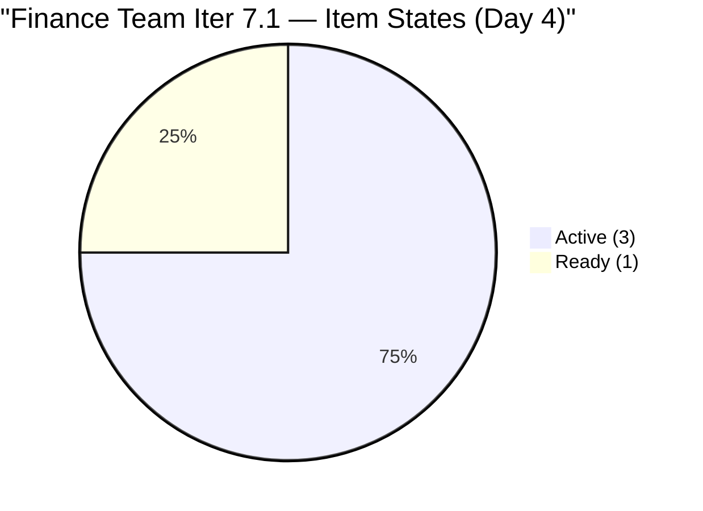
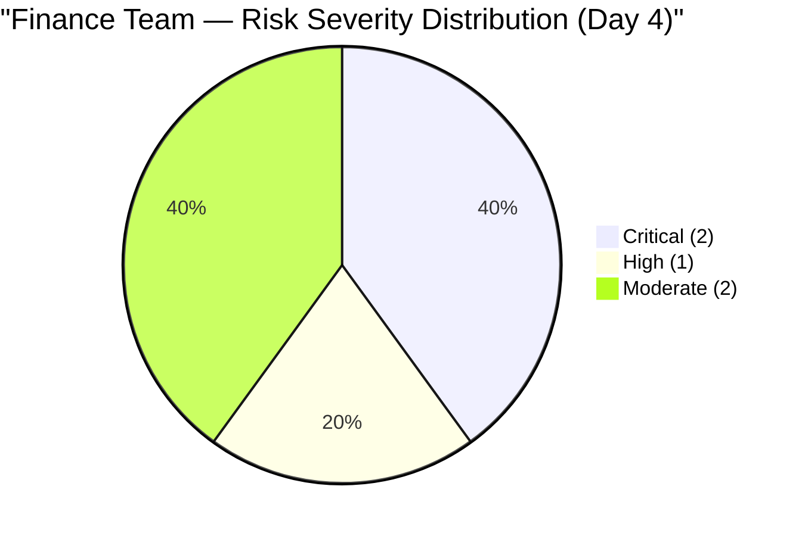
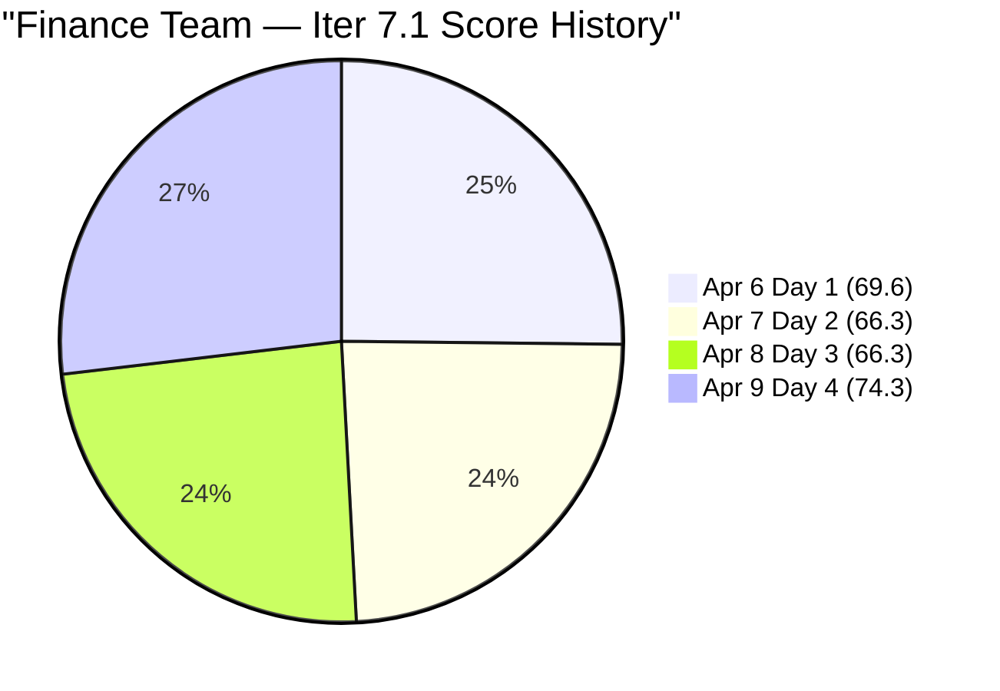

# SAFe Audit Report — Finance Team

## Jairosoft FINOPS Azure DevOps Project

---

## 1. Audit Metadata

| Field | Value |
|-------|-------|
| **Project** | Jairosoft FINOPS |
| **Project ID** | e0bb302f-40f9-46c3-8164-6f1acb317d63 |
| **Team** | Finance Team |
| **Team ID** | 1f4b45fa-82e8-4a36-aedc-6c1bc8f51070 |
| **Backlog** | Stories and Deliverables (`Microsoft.RequirementCategory`) |
| **Board URL** | [Finance Team Board](https://dev.azure.com/jairo/Jairosoft%20FINOPS/_boards/board/t/Finance%20Team/Stories%20and%20Deliverables) |
| **Workspace Folder** | `ado_fin` |
| **Current Iteration** | Iteration 7.1 |
| **Iteration Path** | `Jairosoft FINOPS\2026-PI7\Iteration 7.1` |
| **Iteration Start** | April 6, 2026 |
| **Iteration Finish** | April 19, 2026 |
| **Audit Date** | April 9, 2026 — 09:00 PHT |
| **Audit Day** | Day 4 of 14 (29% elapsed) |
| **Previous Audit** | AUDIT_20260408_0900.md (Apr 8, 2026 — Audit #27, Score: 66.3) |
| **Overall Score** | **74.3 / 100** |
| **Risk Band** | **Moderate Risk** |
| **Audit Series** | #28 |
| **Framework** | SAFe 6.0 |
| **Rubric** | ADO SAFe v1 (seven-dimension deterministic scoring) |

**Scope:** Finance Team board only. No other teams, boards, projects, or repositories analyzed.

---

## 2. Executive Summary

This is the **twenty-eighth audit in the series** and the **fourth audit of PI 7 / Iteration 7.1**. Since Audit #27 (Apr 8, Day 3):

### Key Changes Since Yesterday — MAJOR IMPROVEMENT

1. **5 carryover Review items accepted and closed.** The visible backlog dropped from 9 to **4 items**. Items #198639, #198645, #200465, #200432, and #200446 — which had been blocked in Review for 5–20+ days — no longer appear in the Finance Team backlog. Ramon completed PO acceptance.
2. **Iteration Planning jumps from 44.4 to 100.0 (+55.6).** With only 4 visible backlog items and all 4 in the current sprint, the Finance Team now has a perfect Iteration Planning score.
3. **#202416 still has no AC or SP.** Despite 4 days in the sprint, the Escalation and Service Suspension Workflow item remains without Acceptance Criteria and Story Points. DoR and Estimation remain at 75.0.
4. **BIR deadline: 6 days remaining.** #201448 (eAFS Portal Submission) is Active. Grace must complete by April 14.
5. **Score improves from 66.3 to 74.3 (+8.0).** The PO acceptance action by Ramon is the single largest score driver this sprint.

This is the most significant single-day improvement in the Finance Team's Iteration 7.1 audit series and demonstrates the direct impact of PO acceptance on portfolio metrics.

---

## 3. Previous Audit Delta

**Previous:** AUDIT_20260408_0900 — Iteration 7.1 Day 3, Audit #27

| Metric | Audit #27 (Day 3) | **Audit #28 (Day 4)** | Delta |
|--------|--------------------|-----------------------|-------|
| Visible Backlog | 9 | **4** | **-5** |
| Items in Current Iter | 4 | **4** | 0 |
| SP Committed (US/Issues) | 11 | **11** | 0 |
| Carryover Review Items | 5 | **0** | **-5 (ACCEPTED)** |
| DoR Passing | 3/4 (75%) | **3/4 (75%)** | 0 |
| Iteration Planning | 44.4 | **100.0** | **+55.6** |
| Team Capacity | 100.0 | **100.0** | 0.0 |
| Estimation | 75.0 | **75.0** | 0.0 |
| DoR Compliance | 75.0 | **75.0** | 0.0 |
| Work Item Balance | 70.0 | **70.0** | 0.0 |
| Backlog Refinement | 100.0 | **100.0** | 0.0 |
| Delivery Predictability | 0.0 | **0.0** | 0.0 |
| **Overall** | **66.3** | **74.3** | **+8.0** |
| Risk Band | Moderate Risk | **Moderate Risk** | Stable |

---

## 4. Current Iteration Snapshot

### 4.1 Iteration 7.1 — Work Items (4 Items, 11 SP)

| ID | Title | Type | SP | State | Changed | DoR |
|----|-------|------|----|-------|---------|-----|
| 198635 | P&L March 2026 | US | 4 | Ready | Apr 8 | PASS |
| 199347 | March Jairosoft Finance Presentation | US | 5 | Active | Apr 8 | PASS |
| 201448 | eAFS Portal Submission | US | 2 | Active | Apr 7 | PASS |
| 202416 | Escalation and Service Suspension Workflow | Issue | — | Active | Apr 8 | **FAIL** (no AC) |

### 4.2 Carryover Status — RESOLVED

All 5 prior-sprint carryover items have been accepted by Ramon (PO) and are no longer visible in the Finance Team backlog. This removes the 24 SP that was blocking in Review:

| ID | Title | Former Iter | SP | Former State | Status |
|----|-------|------------|-----|-------------|--------|
| 198639 | Jairosoft Balance Sheet March 2026 | 6.6 IP | 3 | Review | **Accepted/Closed** |
| 198645 | CFS March 2026 | 6.6 IP | 3 | Review | **Accepted/Closed** |
| 200465 | Payroll Variance & Audit Report | 6.6 IP | 5 | Review | **Accepted/Closed** |
| 200432 | Salary & Earnings Automation | 6.5 | 8 | Review | **Accepted/Closed** |
| 200446 | Standardized Benefits & Deductions | 6.5 | 5 | Review | **Accepted/Closed** |

### 4.3 BIR Deadline Countdown — 6 Days

| Item | State | SP | Days to April 15 |
|------|-------|----|-----------------|
| #201448 eAFS Portal Submission | **Active** | 2 | **6 days** |

### 4.4 Team Capacity

| Member | Documentation | Requirements | Total/Day | Sprint Total |
|--------|---------------|-------------|-----------|-------------|
| Grace | 2 h/day | 1 h/day | **3 h/day** | 42 hours |

---

## 5. Work Item Analysis

### 5.1 Backlog Composition (4 Items)

| Location | Count | SP |
|----------|-------|-----|
| Iteration 7.1 | 4 | 11 (3 US + 1 Issue) |
| Other locations | 0 | 0 |
| **Total** | **4** | **11** |

### 5.2 Sprint State Distribution (4 Items)



### 5.3 Sprint Type Distribution

| Type | Count | Share | SP |
|------|-------|-------|----|
| User Story | 3 | 75% | 11 |
| Issue | 1 | 25% | 0 |
| **Total** | **4** | **100%** | **11** |

### 5.4 #202416 DoR Gap (Day 4)

| Field | Status | Days Without | Notes |
|-------|--------|-------------|-------|
| Acceptance Criteria | **FAIL** | 4 days | null — missing entirely |
| Story Points | **FAIL** | 4 days | null — no estimate |
| Description | PASS | — | ~50 nws — adequate |
| State | Active | — | Grace is working this item |

---

## 6. SAFe Compliance Scorecard

| # | Dimension | Score | Formula | Evidence | Notes |
|---|-----------|-------|---------|----------|-------|
| 1 | Iteration Planning | **100.0** | 4/4 × 100 | 4 of 4 visible items in Iter 7.1 | **+55.6 vs yesterday — carryover accepted** |
| 2 | Team Capacity | **100.0** | 1/1 × 100 | Grace: 3 h/day active | Stable |
| 3 | Estimation | **75.0** | 3/4 × 100 | #202416 (Issue) no SP | Day 4 without estimate — critical |
| 4 | DoR Compliance | **75.0** | 3/4 × 100 | #202416 lacks AC | Day 4 without AC — critical |
| 5 | Work Item Balance | **70.0** | 100 − 30 | US 75% > 60% type dominance | Has User Story; structural penalty |
| 6 | Backlog Refinement | **100.0** | 4/4 fresh; 0 penalties | All 4 items changed Apr 7–8 | Lean, clean backlog |
| 7 | Delivery Predictability | **0.0** | 0/11 × 100 | Day 4 — no closures | Early-sprint; #201448 BIR deadline Apr 15 |
| | **Overall** | **74.3** | 520.0 / 7 | | **Moderate Risk (60–79.9)** |

### Score Computation

```
--- Iteration Planning ---
visible_root_backlog_items = 4 (backlog API confirmed: 202416, 199347, 198635, 201448)
  Note: 5 carryover items (#198639, #198645, #200465, #200432, #200446) no longer visible —
        accepted by PO and removed from Finance Team backlog
current_iteration_root_items = 4 (all 4 are in Iter 7.1)
Score = round(4/4 × 100, 1) = 100.0

--- Team Capacity ---
contributors_with_current_work = 1 (Grace — assigned to all 4 items)
contributors_with_capacity = 1 (Grace: Documentation 2h/day + Requirements 1h/day = 3 h/day)
Score = round(1/1 × 100, 1) = 100.0

--- Estimation ---
point_eligible_current_items = 4
estimated_current_items = 3 (198635:4, 199347:5, 201448:2)
202416 (Issue): no SP => not estimated
committed_story_points = 4 + 5 + 2 = 11 SP
Score = round(3/4 × 100, 1) = 75.0

--- DoR Compliance ---
current_iteration_root_items = 4
PASS:
  198635: Desc (As a Department Manager...) ~40 nws + AC (Accuracy, Comparison...) >= 20 nws = PASS
  199347: Desc (As a Finance Ops Stakeholder...) ~40 nws + AC (deck review...) = PASS
  201448: Desc (As a Finance Associate...) ~30 nws + AC (AC1-AC4 detailed) = PASS
FAIL:
  202416: Desc ~40 nws (OK) BUT AcceptanceCriteria = null = FAIL
Score = round(3/4 × 100, 1) = 75.0

--- Work Item Balance ---
3 User Story + 1 Issue = 4 items
has User Story => no -40
dominant_type = US at 75% > 60% => -30
spike_share = 0% => no -20
Score = 100 - 30 = 70.0

--- Backlog Refinement ---
Reference date: 2026-04-09
45-day cutoff: 2026-02-23
90-day cutoff: 2026-01-09
180-day cutoff: 2025-10-12

All 4 items:
  198635: Apr 8 = fresh
  199347: Apr 8 = fresh
  201448: Apr 7 = fresh
  202416: Apr 8 = fresh
fresh = 4/4 = 100% => base = 100.0
stale_90 = 0; stale_180 = 0 => no stale penalties
untouched_current (changed before Apr 6): 0/4
Score = 100.0

--- Delivery Predictability ---
committed_story_points = 11
closed_story_points = 0 (Day 4, nothing Closed/Done)
Score = round(0/11 × 100, 1) = 0.0 [early-sprint]

--- Overall ---
(100.0 + 100.0 + 75.0 + 75.0 + 70.0 + 100.0 + 0.0) / 7 = 520.0 / 7 = 74.3
Risk Band: Moderate Risk (60–79.9)
```

---

## 7. Dimension Findings

### 7.1 Iteration Planning (100.0/100) — EXCELLENT

With all 5 carryover items now accepted and cleared, the Finance Team backlog contains exactly 4 items — all in the current sprint. This is a perfect Iteration Planning score and the first time the Finance Team has achieved 100.0 in this dimension in the PI 7 series. This improvement was unlocked entirely by Ramon's PO acceptance action.

### 7.2 Team Capacity (100.0/100) — EXCELLENT

Grace: 3 h/day (Documentation 2h + Requirements 1h). All 3 active sprint items are assigned to Grace. Full capacity-to-work alignment confirmed.

### 7.3 Estimation (75.0/100) — MODERATE

# 202416 has been in the sprint for 4 days without a Story Point estimate. Grace is Active on this item. Adding a SP estimate would raise Estimation to 100% and the overall score by ~3.6 points (74.3 → 77.9)

### 7.4 DoR Compliance (75.0/100) — MODERATE

# 202416 has been Active for 4 days without Acceptance Criteria. This is the fourth consecutive day with this finding. Working against items without AC creates rework risk when Grace delivers and PO reviews. Adding AC immediately would raise DoR to 100% and the overall score by ~3.6 points

### 7.5 Work Item Balance (70.0/100) — MODERATE

3 User Stories + 1 Issue. User Story type dominates at 75% > 60%. The structural -30 penalty applies. #202416 as an Issue type may warrant reclassification to User Story — if changed, the Sprint would be 4 US (100%) — still subject to the type concentration penalty but correctly typed for SAFe team backlogs.

### 7.6 Backlog Refinement (100.0/100) — EXCELLENT

All 4 backlog items are fresh. The Finance Team's backlog is now lean and clean — 4 items, all active, all updated within the last 3 days. Perfect Backlog Refinement is sustained.

### 7.7 Delivery Predictability (0.0/100) — CRITICAL (Expected, Time-Sensitive)

Day 4 of 14. No items closed. Grace has 3 items Active. **Critical urgency: #201448 (eAFS Portal Submission) must close by April 14 for the BIR April 15 deadline.** Each day without closure increases regulatory compliance risk.

---

## 8. Risks and Bottlenecks



### CRITICAL: April 15 BIR eAFS Deadline — 6 Days Remaining

# 201448 (eAFS Portal Submission, 2 SP) is Active. Grace is working it. The BIR deadline is fixed. With 6 days remaining and the item in Active state, Grace must complete and close this item by April 14 at the latest

**Owner: Grace. Escalation: Ramon if any blockers emerge.**

### CRITICAL: #202416 — 4 Days Without AC or SP

"Escalation and Service Suspension Workflow" entered the sprint on April 6 without Acceptance Criteria or Story Points. Grace is now Active on this item for the second consecutive day without these fields being populated. This is a DoR violation that persists into Day 4.

**Action: Grace or Ramon to add AC and SP today.**

### HIGH: Score Ceiling at 74.3 Until #202416 is Resolved

The Finance Team is 8.6 points from Low Risk (80.0). The gap is entirely explained by:

- Estimation: +3.6 pts from adding SP to #202416
- DoR: +3.6 pts from adding AC to #202416
- Total: +7.2 pts → 74.3 + 7.2 = **81.5 (Low Risk)**

Both actions are within Grace's control today.

### MODERATE: Issue Type Classification — #202416

This item was created as an Issue rather than a User Story. SAFe team backlog items should be User Stories. Misclassification affects sprint hygiene and reporting.

### MODERATE: Single Contributor Risk

All 4 sprint items belong to Grace. No backup for any item. Any capacity disruption halts sprint delivery.

---

## 9. Prioritized Recommendations

| Priority | Action | Owner | Target | Impact |
|----------|--------|-------|--------|--------|
| 1 | **Add AC to #202416** immediately — 4 days overdue | Grace / Ramon | **Today** | DoR: 75% → 100%; Score: +3.6 → 77.9 |
| 2 | **Add SP to #202416** immediately — 4 days overdue | Grace / Ramon | **Today** | Estimation: 75% → 100%; Score: +3.6 → 81.5 (Low Risk) |
| 3 | **Prioritize #201448 (eAFS)** — BIR deadline April 15 | Grace | **Apr 14 latest** | Regulatory compliance |
| 4 | **Reclassify #202416** from Issue to User Story if appropriate | Ramon | Day 4–5 | Process hygiene |
| 5 | **Monitor Grace's progress** on all 3 Active items daily | Ramon | Daily | Delivery Predictability improvement |

---

## 10. Evidence Gaps and Limitations

| Gap | Impact | Notes |
|-----|--------|-------|
| Day 4 — no closures | Delivery Predictability = 0.0 | Expected; #201448 due Apr 14 |
| #202416 no AC | DoR at 75% | 4 days without AC — critical escalation |
| #202416 no SP | Estimation at 75% | 4 days without estimate |
| Issue type classification | Score hygiene | Validate correct WIT |
| Single contributor | Bus factor = 1 | Structural risk |
| PO acceptance confirmation indirect | 5 items disappeared from backlog | Assumed accepted; direct confirmation recommended |

---

## Score History (Finance Team — Iteration 7.1)



| # | Date | Iter | Day | Score | Key Event |
|---|------|------|-----|-------|-----------|
| 25 | Apr 6 | 7.1 | 1 | 69.6 | PI7 Day 1; 3 items in sprint |
| 26 | Apr 7 | 7.1 | 2 | 66.3 | #202416 added without AC/SP |
| 27 | Apr 8 | 7.1 | 3 | 66.3 | Score stable; all items active |
| **28** | **Apr 9** | **7.1** | **4** | **74.3** | **+8.0 — PO accepted 5 carryover items; Iter Planning: 44.4 → 100.0** |

---

*Report generated: April 9, 2026 09:00 PHT*
*Auditor: AI EngProd Consultant (SAFe 6.0)*
*Rubric: ADO SAFe v1 (seven-dimension deterministic scoring)*
*Audit #28 | Iteration 7.1 Day 4 of 14 | Score: 74.3/100 (Moderate Risk)*
*Previous: AUDIT_20260408_0900 (66.3/100 — Moderate Risk)*
*Delta: +8.0 — PO accepted 5 carryover Review items; Iteration Planning 44.4 → 100.0; #202416 still missing AC/SP (Day 4); BIR eAFS deadline in 6 days*
