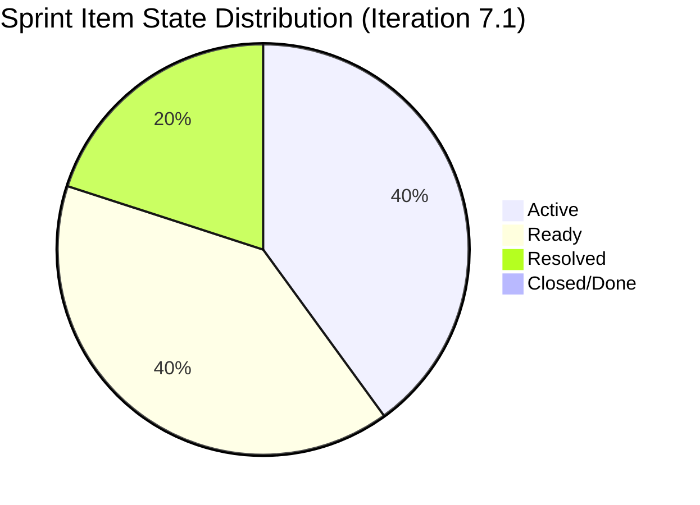
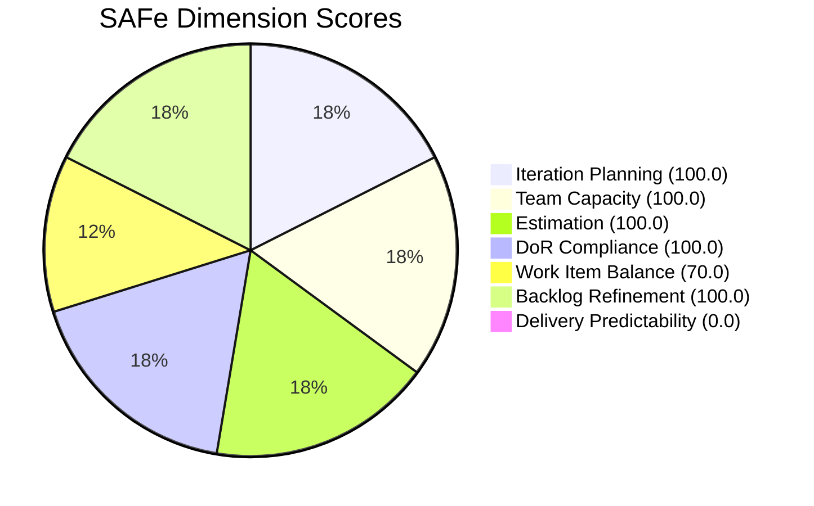

# ADO SAFe Iteration Audit — Finance Team
**Audit #29 | Iteration 7.1 (Apr 6–19, 2026) | Day 7 of 14 (50% elapsed)**

---

## 1. Audit Metadata

| Field | Value |
|---|---|
| **Audit Date** | April 12, 2026, 09:00 PHT |
| **Auditor** | Claude Code (ADO SAFe Audit Agent) |
| **Workspace** | `ado_fin` |
| **ADO Project** | Jairosoft FINOPS (`e0bb302f-40f9-46c3-8164-6f1acb317d63`) |
| **Team** | Finance Team (`1f4b45fa-82e8-4a36-aedc-6c1bc8f51070`) |
| **Iteration** | Iteration 7.1 — Apr 6 to Apr 19, 2026 |
| **Iteration ID** | `82cc2229-0211-4fe2-9ee6-cc8d843dfab0` |
| **Sprint Day** | Day 7 of 14 (midpoint) |
| **Prior Audit** | AUDIT_20260409_0900.md (Audit #28, Score 74.3 — Moderate Risk) |
| **Scoring Model** | ADO SAFe v1 (7-dimension rubric) |

---

## 2. Executive Summary

The Finance Team achieves a score of **81.4 (Low Risk)** — a significant improvement from the prior audit score of 74.3 (Moderate Risk) and the first time this team has crossed into the Low Risk band this PI. The primary drivers of improvement are: (1) the previously non-compliant item #202416 is now resolved to DoR compliance, and (2) a new well-formed item (#202533 — Annual Income Tax Return) was added to the sprint and passes all DoR checks. All 5 sprint items are now in scope with full capacity, estimation, and DoR compliance.

The critical remaining risk is **zero SP delivered at midpoint**, with 14 SP committed across 5 items and the eAFS submission deadline (#201448 — Apr 15) just 3 days away. Grace must close at least 2–3 items this week to avoid the delivery predictability dimension collapsing the score again at the next audit.

---

## 3. Previous Audit Delta

| Dimension | Day 4 (Apr 9) | Day 7 (Apr 12) | Delta |
|---|---|---|---|
| Iteration Planning | 100.0 | 100.0 | 0.0 |
| Team Capacity | 100.0 | 100.0 | 0.0 |
| Estimation | 75.0 | 100.0 | +25.0 |
| DoR Compliance | 75.0 | 100.0 | +25.0 |
| Work Item Balance | 70.0 | 70.0 | 0.0 |
| Backlog Refinement | 100.0 | 100.0 | 0.0 |
| Delivery Predictability | 0.0 | 0.0 | 0.0 |
| **Overall** | **74.3** | **81.4** | **+7.1** |

**Key changes since Day 4:**
- Item #202416 (Escalation and Service Suspension Workflow) previously lacked complete AC; now has detailed AC text → DoR now passes
- Item #202416 state moved to **Resolved** (previously Active) — closer to done, but not yet Closed
- New item #202533 (Process and Pay Annual Income Tax Return, 1 SP) added — fully DoR-compliant
- Backlog grew from 4 to 5 items; all in sprint → Iteration Planning remains 100.0
- Estimation improved: all 5 items now have SP (previously #202416 was 0 SP, now 2 SP)

---

## 4. Current Iteration Snapshot

| Metric | Value |
|---|---|
| **Visible root backlog items** | 5 |
| **Current sprint items (Iteration 7.1)** | 5 |
| **Items outside sprint** | 0 |
| **Committed story points** | 14 SP |
| **Closed story points** | 0 SP |
| **Delivery rate at midpoint** | 0.0% (0 of 14 SP) |
| **Active items** | 2 |
| **Ready items** | 2 |
| **Resolved items** | 1 |
| **Closed/Done items** | 0 |
| **Sole contributor** | Grace (grace@jairosoft.com) |
| **Team capacity** | 3h/day (Documentation 2h + Requirements 1h) |

### Sprint Item List (Iteration 7.1)

| ID | Title | Type | State | SP | DoR |
|---|---|---|---|---|---|
| 198635 | P&L March 2026 | User Story | Ready | 4 | PASS |
| 199347 | March Jairosoft Finance Presentation | User Story | Active | 5 | PASS |
| 201448 | eAFS Portal Submission | User Story | Active | 2 | PASS |
| 202416 | Escalation and Service Suspension Workflow | Issue | Resolved | 2 | PASS |
| 202533 | Process and Pay Annual Income Tax Return (Form 1702-RT/EX/MX) | User Story | Ready | 1 | PASS |

**Key deadline:** Item #201448 (eAFS Portal Submission) has a BIR filing deadline of **April 15, 2026** — 3 days from today. This is the sprint's highest-urgency item.

---

## 5. Work Item Analysis

### State Distribution



### Observations
- **#202416 moved to Resolved** — this is a positive signal. If the team workflow treats "Resolved" as a pre-Closed state requiring review, Grace should confirm and close this item promptly.
- **#201448 eAFS submission is Active with Apr 15 deadline** — must be completed and closed by end of day Tuesday, April 14 at the latest (to allow for BIR processing time).
- **#199347 March Finance Presentation** — marked Active (5 SP) though the presentation may have already been delivered. If content is done, close immediately.
- Two items (#202533 and #198635) are in Ready state — correctly queued after active items complete.
- Backlog is tight and well-formed: 5 items, all in sprint, all compliant.

---

## 6. SAFe Compliance Scorecard

| Dimension | Score | Evidence | Notes |
|---|---|---|---|
| Iteration Planning | 100.0 | 5 of 5 visible items in sprint | Perfect — no backlog spillover. |
| Team Capacity | 100.0 | Grace configured: 3h/day (Documentation 2 + Requirements 1) | Full capacity configured, no days off. |
| Estimation | 100.0 | 5/5 current items have SP > 0 | All items estimated (incl. #202416 at 2 SP). |
| DoR Compliance | 100.0 | 5/5 items pass Description (≥30 nws) + AC (≥20 nws) | #202416 now compliant. Improvement from Day 4. |
| Work Item Balance | 70.0 | 4 US + 1 Issue; User Story share = 80% > 60% → -30 | Structural penalty for dominant type. |
| Backlog Refinement | 100.0 | All 5 items changed Apr 8–10, 2026 (100% fresh); 0 stale items | Excellent freshness. |
| Delivery Predictability | 0.0 | 0 SP closed of 14 SP committed | No closures at midpoint. Urgent concern. |
| **Overall** | **81.4** | | **Low Risk** |

### Score Computation

```
Iteration Planning    = 5 / 5 × 100   = 100.0
Team Capacity         = 1 / 1 × 100   = 100.0
Estimation            = 5 / 5 × 100   = 100.0
DoR Compliance        = 5 / 5 × 100   = 100.0
Work Item Balance     = 100 - 30       = 70.0  (US share 80% > 60%)
Backlog Refinement    = 100.0 (base 5/5=100; 0 stale penalties; 0 untouched penalties)
Delivery Predictability = 0 / 14 × 100 = 0.0

Overall = (100.0 + 100.0 + 100.0 + 100.0 + 70.0 + 100.0 + 0.0) / 7
        = 570.0 / 7 = 81.4   → Low Risk
```



---

## 7. Dimension Findings

### 7.1 Iteration Planning — 100.0 (Low Risk)
All 5 visible backlog items are assigned to Iteration 7.1. The sprint is perfectly scoped — no items outside the iteration. This is a consistent strength for the Finance Team and represents ideal sprint boundary discipline.

### 7.2 Team Capacity — 100.0 (Low Risk)
Grace is configured with 3h/day capacity across Documentation (2h) and Requirements (1h). No days off recorded. Capacity settings are appropriate and complete. Note: 3h/day for a single contributor over 14 days = 42 available hours for a 14 SP sprint — this is a tight but reasonable load.

### 7.3 Estimation — 100.0 (Low Risk, Improved)
All 5 items now carry Story Points. Item #202416 (Issue type) previously had 0 SP — now shows 2 SP. New item #202533 is correctly estimated at 1 SP. Full estimation coverage achieved.

### 7.4 DoR Compliance — 100.0 (Low Risk, Improved)
All 5 items pass both checks:
- Description ≥ 30 non-whitespace chars: PASS for all (detailed As-a/I-want/So-that user story format)
- Acceptance Criteria ≥ 20 non-whitespace chars: PASS for all (all have structured AC lists)
This is a significant improvement from Day 4 where #202416 failed. The fix was implemented within 3 days of the prior audit finding.

### 7.5 Work Item Balance — 70.0 (Moderate)
4 User Stories + 1 Issue type. User Story share = 80% > 60% threshold → -30 penalty. No Spikes present. This is structurally expected for a Finance team (reports, submissions, and presentations are naturally User Story–type work). The Issue type (#202416) represents a legitimate escalation workflow item.

### 7.6 Backlog Refinement — 100.0 (Low Risk)
All 5 items changed April 8–10, 2026. Zero stale items of any category. Backlog is current, lean, and fully groomed. The Finance team's small backlog (5 items) makes this dimension straightforward to maintain.

### 7.7 Delivery Predictability — 0.0 (Critical)
Zero story points closed as of Day 7. With 14 SP committed and 7 days remaining, the required rate is 2 SP/day — achievable for a 3h/day contributor if items are truly ready to close. The resolved state of #202416 (2 SP) suggests near-completion; closing it would begin momentum. The April 15 eAFS deadline creates urgency around #201448.

---

## 8. Risks and Bottlenecks

| # | Risk | Severity | Impact |
|---|---|---|---|
| R1 | eAFS Portal Submission (#201448) deadline is April 15 — 3 days away | Critical | BIR regulatory non-compliance if missed; penalties and surcharges |
| R2 | Zero SP closed at midpoint | Critical | Delivery Predictability will dominate score downward if no closures by Day 10 |
| R3 | Single contributor (Grace) — no backup for regulatory submissions | High | Any illness or blocker could cause BIR filing miss |
| R4 | #202416 in Resolved state — not yet Closed | Moderate | 2 SP recognized as "done work" but not formally counted in delivery |
| R5 | #199347 March Finance Presentation may be date-stale | Moderate | If presentation was delivered in March, item should have been closed earlier |
| R6 | Annual ITR (#202533, 1 SP) carries compliance deadline not specified in ADO | Low | Ensure BIR eFPS/eBIRForms submission window is tracked separately |

---

## 9. Prioritized Recommendations

1. **Close #201448 (eAFS Portal Submission) by April 14 (P0 — Immediate):** The BIR eAFS deadline is April 15. Grace must complete the upload, obtain the Transaction Number (eAFS Submission Receipt), create the Compliance Folder, and close this item in ADO today or tomorrow. This is a regulatory compliance item — no deferral acceptable.

2. **Transition #202416 from Resolved to Closed (P1 — Today):** The Escalation and Service Suspension Workflow is Resolved — confirm that all AC are met (automated notifications, intent-to-suspend email configured) and close the item. This will add 2 SP to delivery.

3. **Confirm and close #199347 (March Finance Presentation, 5 SP) if delivered (P1 — This week):** If the presentation was delivered to leadership, close the item now. This would add 5 SP to delivery and significantly improve the Delivery Predictability score.

4. **Prioritize #202533 (Annual ITR, 1 SP) before sprint end (P2 — Sprint week 2):** Confirm BIR eFPS/eBIRForms filing date. If deadline is within this sprint, file before Apr 19 and close.

5. **Add BIR deadline dates to item descriptions (P3 — Process improvement):** Regulatory items should include explicit deadline dates in the Description or tags field to enable better sprint risk tracking at audit time.

6. **Introduce a second team member or cross-training for regulatory submissions (P3 — Next PI planning):** Single-contributor risk for BIR, eAFS, and compliance work represents organizational risk — not just a sprint risk.

---

## 10. Evidence Gaps and Limitations

| Gap | Description |
|---|---|
| "Resolved" state semantics | ADO "Resolved" for #202416 (Issue type) does not map to "Done" in the scoring model. Delivery Predictability counts only Closed/Done states. |
| External deadline tracking | BIR deadlines for #201448 (Apr 15) and #202533 are not surfaced in ADO fields — audit relies on prior audit context and item descriptions |
| No child tasks | No task-level breakdown; capacity burn against 3h/day cannot be tracked at granular level |
| March Presentation date | It is unclear from ADO whether #199347 was actually presented — the item remains Active with no completion evidence attached |

---

*Report generated by Claude Code ADO SAFe Audit Agent | April 12, 2026 09:00 PHT*
