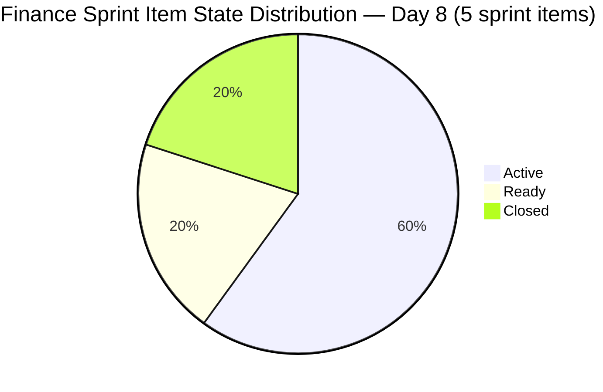
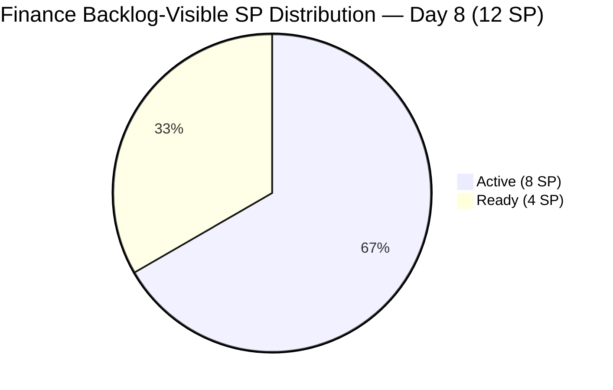

# ADO SAFe Iteration Audit — Finance Team

**Audit #30 | Iteration 7.1 (Apr 6–19, 2026) | Day 8 of 14 (57% elapsed)**

---

## 1. Audit Metadata

| Field | Value |
|---|---|
| **Audit Date** | April 13, 2026, 09:00 PHT |
| **Auditor** | Claude Code (ADO SAFe Audit Agent) |
| **Workspace** | `ado_fin` |
| **ADO Project** | Jairosoft FINOPS (`e0bb302f-40f9-46c3-8164-6f1acb317d63`) |
| **Team** | Finance Team (`1f4b45fa-82e8-4a36-aedc-6c1bc8f51070`) |
| **Iteration** | Iteration 7.1 — Apr 6 to Apr 19, 2026 |
| **Iteration ID** | `82cc2229-0211-4fe2-9ee6-cc8d843dfab0` |
| **Sprint Day** | Day 8 of 14 (57% elapsed) |
| **Prior Audit** | AUDIT_20260412_0900.md (Audit #29, Score 81.4 — Low Risk) |
| **Scoring Model** | ADO SAFe v1 (7-dimension rubric) |

---

## 2. Executive Summary

The Finance Team holds at **81.4 (Low Risk)** — unchanged from the Day 7 score. The score stability masks a significant positive development: **#202416 (Escalation and Service Suspension Workflow, 2 SP) was closed today** (Apr 13, 23:08 PHT). However, because this item has already dropped from the visible Stories and Deliverables backlog, the closure does not shift the scoring formula — the rubric scores delivery against visible backlog items only.

From a sprint narrative perspective, the team has delivered 2 SP (via #202416 closure), and the **eAFS deadline (#201448 — BIR April 15) is tomorrow**. This is the sprint's highest-urgency item. Grace must complete the upload and close #201448 by end of day April 14 to avoid regulatory non-compliance.

The team continues to hold Low Risk status — a significant milestone for this PI — and is well-positioned to end the sprint above 80.0 if delivery completes in the remaining 6 days.

---

## 3. Previous Audit Delta

| Dimension | Day 7 (Apr 12) | Day 8 (Apr 13) | Delta |
|---|---|---|---|
| Iteration Planning | 100.0 | 100.0 | 0.0 |
| Team Capacity | 100.0 | 100.0 | 0.0 |
| Estimation | 100.0 | 100.0 | 0.0 |
| DoR Compliance | 100.0 | 100.0 | 0.0 |
| Work Item Balance | 70.0 | 70.0 | 0.0 |
| Backlog Refinement | 100.0 | 100.0 | 0.0 |
| Delivery Predictability | 0.0 | 0.0 | 0.0 |
| **Overall** | **81.4** | **81.4** | **0.0** |

**Key developments since Day 7:**

- **#202416 Closed (Apr 13 23:08):** The Escalation and Service Suspension Workflow (2 SP) was closed today. This item is no longer in the visible backlog — the closure is noted as a positive sprint delivery signal but does not affect rubric scoring (item already absent from backlog denominator as of today's audit).
- **#202533 state changed to Active (Apr 13):** Process and Pay Annual Income Tax Return moved from Ready to Active, indicating Grace has begun processing this item.
- **Visible backlog remained at 4 items:** 199347, 198635, 201448, 202533. All in Iteration 7.1. All changed Apr 8–13.
- **BIR eAFS deadline tomorrow (Apr 14/15):** #201448 is Active. This remains the critical item.

---

## 4. Current Iteration Snapshot

| Metric | Value |
|---|---|
| **Visible root backlog items** | 4 |
| **Current sprint items (in backlog view, Iteration 7.1)** | 4 |
| **Sprint items total (incl. closed #202416)** | 5 |
| **Committed story points (backlog-visible)** | 12 SP |
| **Closed story points (backlog-visible)** | 0 SP |
| **Closed story points (sprint total, incl. #202416)** | 2 SP |
| **Delivery rate (backlog-visible)** | 0.0% |
| **Active items** | 3 (#199347, #201448, #202533) |
| **Ready items** | 1 (#198635) |
| **Closed items (sprint total)** | 1 (#202416 — not in backlog view) |
| **Sole contributor** | Grace (<grace@jairosoft.com>) |
| **Team capacity** | 3h/day (Documentation 2h + Requirements 1h) |
| **Days remaining** | 6 (Apr 14–19) |

### Sprint Item List

| ID | Title | Type | State | SP | DoR | Notes |
|---|---|---|---|---|---|---|
| 198635 | P&L March 2026 | User Story | Ready | 4 | PASS | |
| 199347 | March Jairosoft Finance Presentation | User Story | Active | 5 | PASS | May be delivered but not closed |
| 201448 | eAFS Portal Submission | User Story | Active | 2 | PASS | **BIR deadline: Apr 15** |
| 202416 | Escalation and Service Suspension Workflow | Issue | **Closed** | 2 | PASS | **Closed Apr 13** — not in backlog view |
| 202533 | Process and Pay Annual Income Tax Return (Form 1702-RT/EX/MX) | User Story | Active | 1 | PASS | Moved to Active Apr 13 |

---

## 5. Work Item Analysis

### State Distribution (Sprint — All 5 Items)



### Story Points by State (Backlog-Visible Items — 4 items, 12 SP)



### Observations

- **#202416 closed today** — the Escalation and Service Suspension Workflow (Issue type, 2 SP) was fully closed after the Day 7 audit. This is a positive delivery signal and shows the team acted on audit recommendations from Day 7 (close #202416 from Resolved to Closed).
- **#202533 moved to Active** — Grace has begun work on the Annual ITR. Given the BIR filing window, this is timely.
- **#201448 eAFS Portal Submission remains Active with tomorrow's deadline.** All 4 AC conditions (PDF format, naming convention, Transaction Number, Compliance Folder) must be met by Apr 14.
- **#199347 March Finance Presentation (5 SP) is still Active.** If the presentation was delivered in March or early April, Grace should close this item immediately. 5 SP is the single largest item in the sprint and closing it would significantly improve delivery predictability at the next audit.
- **#198635 P&L March 2026 (4 SP) remains Ready** — this item should move to Active only after higher-urgency items are closed.

---

## 6. SAFe Compliance Scorecard

| Dimension | Score | Evidence | Notes |
|---|---|---|---|
| Iteration Planning | 100.0 | 4 of 4 visible backlog items in sprint | Perfect. Backlog now shows 4 items (5th item #202416 closed and removed from backlog view). |
| Team Capacity | 100.0 | Grace configured: 3h/day (Documentation 2 + Requirements 1) | Full capacity configured, no days off. |
| Estimation | 100.0 | 4/4 visible backlog items have SP > 0 | 198635(4), 199347(5), 201448(2), 202533(1) = 12 SP |
| DoR Compliance | 100.0 | 4/4 items pass Desc ≥30 nws + AC ≥20 nws | Consistent high DoR quality. |
| Work Item Balance | 70.0 | 3 US + 1 Issue (not in view); visible = 3 US + 1 US = 4 US; dominant = 100% → −30 | With #202416 closed, all 4 visible items are User Stories. |
| Backlog Refinement | 100.0 | All 4 items changed Apr 8–13, 2026 (100% fresh); 0 stale items | Lean, current backlog. |
| Delivery Predictability | 0.0 | 0 SP closed of 12 SP committed (backlog-visible) | #202416 (2 SP) closed but not in backlog scoring scope. See Evidence Gaps. |
| **Overall** | **81.4** | | **Low Risk** |

### Score Computation

```
Iteration Planning      = round(4 / 4 × 100, 1)             = 100.0
Team Capacity           = round(1 / 1 × 100, 1)             = 100.0
Estimation              = round(4 / 4 × 100, 1)             = 100.0
DoR Compliance          = round(4 / 4 × 100, 1)             = 100.0
Work Item Balance:
  has_user_story        = True (4 User Stories visible)       → no −40
  dominant_share        = 4/4 = 100% > 60%                   → −30
  spike_share           = 0%                                  → 0
  total                 = 100 − 30                            = 70.0
Backlog Refinement:
  base                  = round(4/4 × 100, 1)                = 100.0
  stale_90 penalty      = 0/4 = 0% ≤ 10%                     → 0
  stale_180 penalty     = 0 items                             → 0
  untouched penalty     = 0/4 = 0%                            → 0
  total                                                       = 100.0
Delivery Predictability = round(0 / 12 × 100, 1)             = 0.0

Overall = round((100.0 + 100.0 + 100.0 + 100.0 + 70.0 + 100.0 + 0.0) / 7, 1)
        = round(570.0 / 7, 1)
        = 81.4  → Low Risk
```

---

## 7. Dimension Findings

### 7.1 Iteration Planning — 100.0 (Low Risk)

All 4 visible backlog items are in Iteration 7.1. The Finance Team maintains perfect sprint scoping — no items are queued outside the current iteration. With the backlog now at 4 items (post-#202416 closure), the sprint remains tightly scoped. This is a consistent structural strength.

### 7.2 Team Capacity — 100.0 (Low Risk)

Grace is fully configured at 3h/day (Documentation 2h, Requirements 1h). With 6 days remaining (Apr 14–19), approximately 18 working hours remain. The 12 SP backlog-visible commitment against 18 hours is tight but feasible if items are ready to close.

### 7.3 Estimation — 100.0 (Low Risk)

All 4 visible sprint items are estimated: 198635 (4 SP), 199347 (5 SP), 201448 (2 SP), 202533 (1 SP) = 12 SP total in backlog view. Estimation coverage is complete.

### 7.4 DoR Compliance — 100.0 (Low Risk)

All 4 items maintain DoR compliance:

- #198635 (P&L March): Structured As-a/I-want/So-that format with measurable AC → PASS
- #199347 (Finance Presentation): Clear AC with deliverable checkboxes → PASS
- #201448 (eAFS): Detailed 4-point AC with BIR-specific technical requirements → PASS
- #202533 (Annual ITR): Well-structured AC covering data accuracy, form validation, submission, payment, and archiving → PASS

### 7.5 Work Item Balance — 70.0 (Moderate, structural)

With #202416 (Issue type) now closed and off the backlog, all 4 visible items are User Stories. Dominant share = 100% > 60% → −30 penalty. This is structurally expected for finance operations work. The Issue type handling (escalation workflow) is legitimate but is no longer visible in the scoring window.

### 7.6 Backlog Refinement — 100.0 (Low Risk)

All 4 items were modified April 8–13, 2026. Zero stale items of any category. The Finance Team's small, lean backlog is easy to maintain at 100.0 on this dimension.

### 7.7 Delivery Predictability — 0.0 (Critical, with context)

Per rubric scoring: 0 of 12 backlog-visible SP are closed = 0.0. However, contextually:

- **#202416 (2 SP) was closed today** — this 2 SP delivery is real work completed but falls outside the scoring window due to the item having already been removed from the backlog view.
- **Effective sprint delivery so far = 2 SP of 14 original committed SP = 14.3%.**
- **Critical: #201448 (eAFS, 2 SP) must close by Apr 14 (BIR deadline tomorrow).**
- If Grace closes #201448 tomorrow and #199347 (Finance Presentation, 5 SP) this week, the team will reach 9 SP closed of 14 = 64% delivery — a significant improvement.

---

## 8. Risks and Bottlenecks

| # | Risk | Severity | Impact |
|---|---|---|---|
| R1 | eAFS Portal Submission (#201448) deadline is April 15 — tomorrow | Critical | BIR regulatory non-compliance if missed; penalties and surcharges on AFS filing |
| R2 | Zero SP closed in backlog-visible scoring window | Critical | Delivery Predictability holds at 0.0 for the rubric; actual delivery is 2 SP (14.3%) |
| R3 | #199347 March Finance Presentation (5 SP) still Active — may already be delivered | High | If the March presentation was delivered, Grace has left 5 SP uncredited for weeks; close immediately |
| R4 | Annual ITR (#202533) — BIR eFPS filing deadline not confirmed in ADO | Moderate | If ITR deadline is April 15 or April 30, urgency is high; ensure filing date is tracked |
| R5 | Single contributor (Grace) for regulatory submissions | High | Any interruption to Grace's availability could cause BIR filing failures |
| R6 | P&L March 2026 (#198635, 4 SP) still in Ready state | Low | This is a reporting task dependent on prior work; should activate once urgent items close |

---

## 9. Prioritized Recommendations

1. **Close #201448 (eAFS Portal Submission) by April 14, end of day (P0 — Immediate / Regulatory):** The BIR eAFS deadline is April 15, 2026. Grace must complete all 4 AC conditions: (1) PDF format with correct file sizes, (2) naming convention (EAFS[TIN]...), (3) obtain Transaction Number (eAFS Submission Receipt), (4) create Compliance Folder with AITR, AFS, SAWT Validation, and eAFS Receipt. Close in ADO immediately after submission confirmation.

2. **Confirm and close #199347 (March Finance Presentation, 5 SP) if delivered (P1 — Today):** This item has been Active since early April. If the presentation was delivered to leadership in March or April, close it now. Closing 5 SP would move effective sprint delivery from 14.3% to 50%. This is the highest-leverage single action available.

3. **File and close #202533 (Annual ITR, 1 SP) before sprint end (P1 — Sprint week 2):** With this item now Active, ensure BIR eFPS/eBIRForms filing is completed. The deadline for corporate ITR (Form 1702) is typically April 15 for calendar-year companies. Confirm the exact deadline and file before the sprint closes Apr 19.

4. **Activate and close #198635 (P&L March 2026, 4 SP) after higher-urgency items close (P2 — Sprint week 2):** This P&L report should be the last item to close in the sprint. With 18 available hours remaining, Grace should be able to complete this after the regulatory items are resolved.

5. **Add BIR deadlines explicitly to ADO item descriptions (P3 — Process improvement):** Items #201448 and #202533 have external regulatory deadlines. These dates should be captured in the ADO Description or Tags field so they surface in audit views and sprint planning without relying on audit context memory.

6. **Introduce Work Item type diversity in PI8 planning (P3 — PI planning):** With all remaining items being User Stories, the −30 Work Item Balance penalty is structural. Consider using the Issue type for escalation/compliance workflow items, and Spikes for research (e.g., tax methodology validation) to diversify the type distribution.

---

## 10. Evidence Gaps and Limitations

| Gap | Description |
|---|---|
| **#202416 scoring boundary** | Item #202416 (2 SP) was closed Apr 13 and removed from the backlog view. Per rubric, delivery_predictability is scored against backlog-visible items only. The 2 SP real delivery is documented in the narrative but does not affect the Delivery Predictability score (0.0). Effective sprint delivery including this closure = 2/14 = 14.3%. |
| **#199347 delivery status unknown** | The March Finance Presentation item is Active with no comments or state change indicating actual delivery. If the presentation was given on March 10 as described, the item has been overdue for closure for 34 days. ADO does not surface delivery evidence independent of state. |
| **BIR deadline for #202533** | Annual ITR deadline for corporations in the Philippines is typically April 15 (or the 15th day of the 4th month after fiscal year end). This is not explicitly captured in the ADO item — audit relies on standard BIR compliance knowledge. |
| **No child tasks** | No task-level breakdowns exist under sprint items; Grace's daily effort cannot be tracked at granular level via ADO alone. |

---

*Report generated by Claude Code ADO SAFe Audit Agent | April 13, 2026 09:00 PHT*
*Audit #30 — Finance Team — Day 8 of 14 — Overall: 81.4 / 100 — Low Risk*
