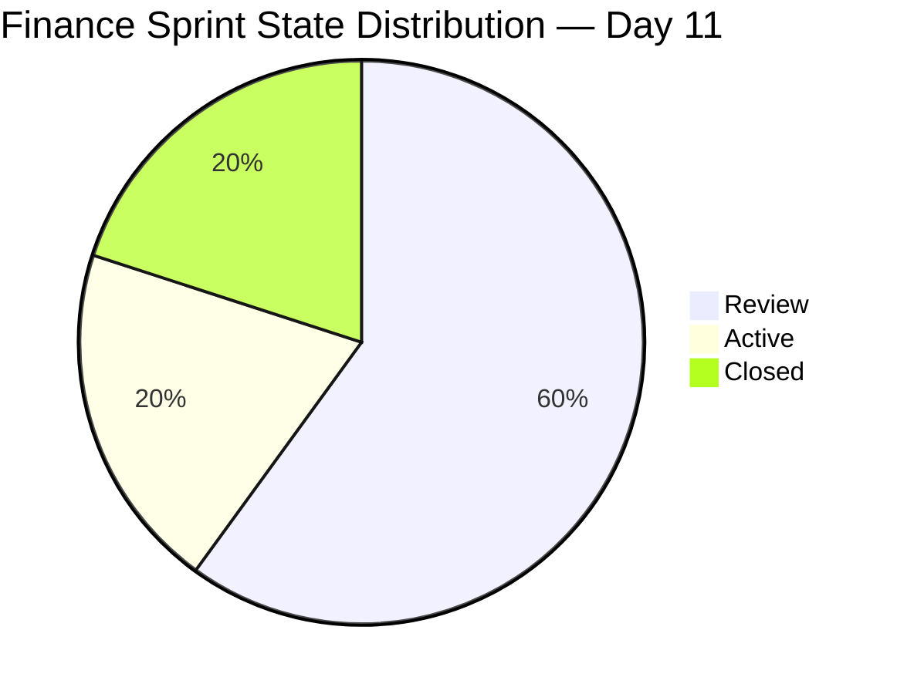
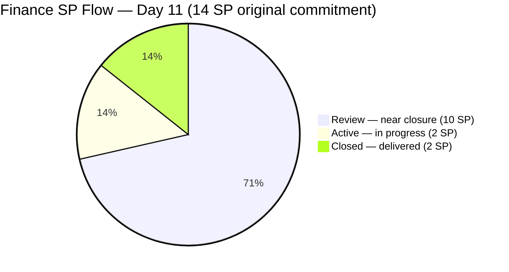

# ADO SAFe Iteration Audit — Finance Team
**Audit #31 | Iteration 7.1 (Apr 6–19, 2026) | Day 11 of 14 (79% elapsed)**

---

## 1. Audit Metadata

| Field | Value |
|---|---|
| **Audit Date** | April 16, 2026, 09:00 PHT |
| **Auditor** | Claude Code (ADO SAFe Audit Agent) |
| **Workspace** | `ado_fin` |
| **ADO Project** | Jairosoft FINOPS (`e0bb302f-40f9-46c3-8164-6f1acb317d63`) |
| **Team** | Finance Team (`1f4b45fa-82e8-4a36-aedc-6c1bc8f51070`) |
| **Iteration** | Iteration 7.1 — Apr 6 to Apr 19, 2026 |
| **Iteration ID** | `82cc2229-0211-4fe2-9ee6-cc8d843dfab0` |
| **Sprint Day** | Day 11 of 14 (79% elapsed) |
| **Prior Audit** | AUDIT_20260413_0900.md (Audit #30, Score 81.4 — Low Risk) |
| **Scoring Model** | ADO SAFe v1 (7-dimension rubric) |
| **Overall Score** | **81.4 / 100** |
| **Risk Band** | **Low Risk** (≥ 80) |

---

## 2. Executive Summary

The Finance Team holds at **81.4 (Low Risk)** for the second consecutive audit — consistent with the Day 8 score. Three of the four backlog-visible items transitioned to **Review** state on April 15: #198635 (P&L March 2026, 4 SP), #199347 (March Finance Presentation, 5 SP), and #202533 (Annual Income Tax Return, 1 SP). This is a strong sprint-week-2 delivery signal — Grace has advanced 10 SP worth of work to pre-closure review. Only #201448 (eAFS Portal Submission, 2 SP) remains Active, and its BIR deadline of April 15 has now passed.

**Critical alert:** None of the four visible items has yet transitioned to **Closed** state, which holds Delivery Predictability at 0.0 per the scoring rubric. With only 3 sprint days remaining (Apr 17–19), Grace must convert the three Review items to Closed to register any SP delivery in the scoring window. Closing all four visible items would bring Delivery Predictability to 100.0 and push the Overall score to **95.7**.

The sprint is on the brink of a high-performance outcome but requires final closure actions before April 19.

---

## 3. Previous Audit Delta

| Dimension | Day 8 (Apr 13) | Day 11 (Apr 16) | Delta |
|---|---|---|---|
| Iteration Planning | 100.0 | 100.0 | 0.0 |
| Team Capacity | 100.0 | 100.0 | 0.0 |
| Estimation | 100.0 | 100.0 | 0.0 |
| DoR Compliance | 100.0 | 100.0 | 0.0 |
| Work Item Balance | 70.0 | 70.0 | 0.0 |
| Backlog Refinement | 100.0 | 100.0 | 0.0 |
| Delivery Predictability | 0.0 | 0.0 | 0.0 |
| **Overall** | **81.4** | **81.4** | **0.0** |

**Key changes since Day 8 (Apr 13):**
- **#198635 (P&L March 2026, 4 SP) → Review on Apr 15:** Grace completed the March P&L report and advanced it to Review, indicating the deliverable is ready for stakeholder sign-off.
- **#199347 (March Finance Presentation, 5 SP) → Review on Apr 15:** The Finance Presentation advanced to Review. If delivered in March or early April, this 5 SP item should have been closed earlier — Review is the correct next step before closure.
- **#202533 (Annual ITR, 1 SP) → Review on Apr 15:** The Annual Income Tax Return (Form 1702-RT/EX/MX) has reached Review, suggesting filing has been initiated and is awaiting confirmation.
- **#201448 (eAFS Portal Submission, 2 SP) remains Active:** BIR eAFS deadline of April 15 has now passed. Filing status must be confirmed immediately and the item closed or escalated.
- **Scoring unchanged:** Review state is not Closed — Delivery Predictability remains 0.0 per the rubric until items formally close.

---

## 4. Current Iteration Snapshot

| Metric | Value |
|---|---|
| **Visible root backlog items** | 4 |
| **Current sprint items (Iteration 7.1)** | 4 |
| **Committed story points (backlog-visible)** | 12 SP |
| **Closed story points (backlog-visible)** | 0 SP |
| **Items in Review (near-closed)** | 3 (#198635, #199347, #202533 = 10 SP) |
| **Items Active** | 1 (#201448 = 2 SP) |
| **Effective delivery (incl. #202416 closed Apr 13)** | 2 of 14 original SP = 14.3% |
| **Sole contributor** | Grace (grace@jairosoft.com) |
| **Team capacity** | 3h/day (Documentation 2h + Requirements 1h) |
| **Days remaining** | 3 (Apr 17–19) |

### Sprint Item List (Iteration 7.1)

| ID | Title | Type | State | SP | DoR | Notes |
|---|---|---|---|---|---|---|
| 198635 | P&L March 2026 | User Story | **Review** | 4 | PASS | Advanced Apr 15 — ready for closure |
| 199347 | March Jairosoft Finance Presentation | User Story | **Review** | 5 | PASS | Advanced Apr 15 — closure pending |
| 201448 | eAFS Portal Submission | User Story | Active | 2 | PASS | BIR deadline Apr 15 passed — confirm filing status |
| 202533 | Process and Pay Annual ITR (Form 1702-RT/EX/MX) | User Story | **Review** | 1 | PASS | Advanced Apr 15 — ITR filing near complete |

*(#202416 Escalation and Service Suspension Workflow — Closed Apr 13 — no longer in backlog view)*

---

## 5. Work Item Analysis

### State Distribution (All 5 Sprint Items Including Closed)



### Story Point Flow



### Observations

- **Three items in Review (10 SP):** The bulk of sprint work is now in Review — an excellent position on Day 11. The only remaining action per item is stakeholder confirmation and ADO state transition to Closed before April 19.
- **#199347 (March Presentation, 5 SP):** This is the single largest sprint item. If the presentation was delivered to leadership in March or early April, this item has been functionally complete for weeks. Closing it is the highest-leverage single action available to Grace before sprint end — it alone moves Delivery Predictability from 0.0 to 41.7.
- **#202533 (Annual ITR, 1 SP):** Review state suggests BIR eFPS/eBIRForms filing has been submitted. Grace should confirm the Filing Reference Number (FRN) is received and close this item immediately.
- **#201448 (eAFS Portal Submission, 2 SP):** The BIR eAFS deadline of April 15 has passed. ADO state shows Active, which is ambiguous — the filing may have been completed without a state update. Grace must verify whether the eAFS Submission Receipt (Transaction Number) was obtained and either close the item or document the reason for non-completion.
- **No new items added:** The backlog remains at 4 items (plus 1 closed). Sprint focus is disciplined and consistent with the Finance Team's established execution pattern.

---

## 6. SAFe Compliance Scorecard

| Dimension | Score | Evidence | Notes |
|---|---|---|---|
| Iteration Planning | 100.0 | 4 of 4 visible backlog items in Iteration 7.1 | Perfect sprint scoping; no items outside current sprint. |
| Team Capacity | 100.0 | Grace: 3h/day (Documentation 2h + Requirements 1h), no days off | Full capacity configured throughout sprint. |
| Estimation | 100.0 | 4/4 items have SP > 0 (4+5+2+1 = 12 SP total) | Complete estimation coverage. |
| DoR Compliance | 100.0 | 4/4 items pass Desc ≥30 nws + AC ≥20 nws | Sustained DoR quality across all items. |
| Work Item Balance | 70.0 | 4 User Stories = 100% dominant type > 60% → −30 | Structural penalty; no spikes or issue types visible in backlog. |
| Backlog Refinement | 100.0 | All 4 items changed Apr 10–15 (within 45 days); stale_90=0; stale_180=0; untouched=0 | Lean, current backlog — exemplary hygiene. |
| Delivery Predictability | 0.0 | 0 closed SP / 12 committed SP (backlog-visible) | 10 SP in Review awaiting Closed transition; 3 sprint days remain. |
| **Overall** | **81.4** | Average of 7 dimensions | **Low Risk** — sustained from Day 8. |

### Score Computation

```
Iteration Planning      = round(4 / 4 × 100, 1)             = 100.0
Team Capacity           = round(1 / 1 × 100, 1)             = 100.0
Estimation              = round(4 / 4 × 100, 1)             = 100.0
DoR Compliance          = round(4 / 4 × 100, 1)             = 100.0
Work Item Balance:
  has_user_story        = True (4 User Stories)              → no −40
  dominant_share        = 4/4 = 100% > 60%                  → −30
  spike_share           = 0/4 = 0%                          → 0
  total                 = 100 − 30                           = 70.0
Backlog Refinement:
  base                  = round(4/4 × 100, 1)               = 100.0
  stale_90 penalty      = 0/4 = 0% ≤ 10%                    → 0
  stale_180 penalty     = 0 items                            → 0
  untouched_current     = 0/4 = 0% ≤ 10%                    → 0
  total                                                      = 100.0
Delivery Predictability = round(0 / 12 × 100, 1)             = 0.0

Overall = round((100.0 + 100.0 + 100.0 + 100.0 + 70.0 + 100.0 + 0.0) / 7, 1)
        = round(570.0 / 7, 1)
        = 81.4  → Low Risk

Projected end-of-sprint if all 4 items close before Apr 19:
  Delivery Predictability = round(12 / 12 × 100, 1)         = 100.0
  Overall = round((100+100+100+100+70+100+100) / 7, 1)
          = round(670 / 7, 1)                               = 95.7 → Low Risk
```

---

## 7. Dimension Findings

### 7.1 Iteration Planning — 100.0 (Low Risk)

All four visible backlog items are scoped to Iteration 7.1. The Finance Team continues to maintain perfect sprint scoping — no items are queued outside the current iteration, no scope creep has occurred, and the backlog is fully committed to the active sprint. This dimension has been at 100.0 throughout PI7 and reflects Grace's disciplined sprint commitment practice.

### 7.2 Team Capacity — 100.0 (Low Risk)

Grace is configured at 3h/day (Documentation 2h + Requirements 1h), no days off for the sprint. With 3 days remaining (Apr 17–19), approximately 9 working hours remain. The three Review items represent work that is functionally complete — remaining effort is closure administration (confirming receipt of deliverables, attaching filing confirmations, updating ADO state). Nine hours is more than sufficient to close all four items if Grace executes on April 17.

### 7.3 Estimation — 100.0 (Low Risk)

All four sprint items carry story point estimates: #198635 (4 SP), #199347 (5 SP), #201448 (2 SP), #202533 (1 SP) = 12 SP total. Estimation hygiene is complete and unchanged from Day 8. The 12 SP commitment is appropriately scaled for a single contributor at 3h/day over 14 days.

### 7.4 DoR Compliance — 100.0 (Low Risk)

All four items maintain full DoR compliance on both criteria:
- **#198635 (P&L March):** As-a / I-want / So-that format; AC covers accuracy, month-over-month comparison, categorization, and visual summary table → PASS
- **#199347 (Finance Presentation):** AC includes deck completion and review, delivery confirmation, follow-up documentation, and explicit closure trigger → PASS
- **#201448 (eAFS):** Four-condition AC with BIR-specific technical requirements (PDF format, naming convention, Transaction Number, Compliance Folder creation) → PASS
- **#202533 (Annual ITR):** Five-condition AC covering data accuracy, form validation, FRN receipt, payment gateway confirmation, and archiving → PASS

### 7.5 Work Item Balance — 70.0 (Moderate, structural)

All four visible items are User Stories. With #202416 (Issue type) closed and removed from the backlog view, the type distribution is 100% User Stories, triggering the −30 dominant type penalty. This is structurally expected for a finance operations team executing regulatory and reporting tasks. The penalty cannot be removed this sprint and will persist regardless of closures.

### 7.6 Backlog Refinement — 100.0 (Low Risk)

All four items were modified between April 10–15, well within the 45-day freshness window. Zero stale_90 items, zero stale_180 items, zero untouched sprint items (all changed after iteration start date of Apr 6). The Finance Team's lean four-item backlog is the easiest to maintain among all audited teams and has held 100.0 on this dimension throughout PI7.

### 7.7 Delivery Predictability — 0.0 (Critical per rubric; contextually near-complete)

Per rubric scoring: 0 of 12 backlog-visible SP are Closed = 0.0. Contextual delivery projection:

| Closure scenario | SP Closed | Delivery % | Projected Overall |
|---|---|---|---|
| Current (Day 11 — 0 backlog-visible closed) | 0 | 0.0% | 81.4 |
| Close #202533 only (1 SP) | 1 | 8.3% | 82.6 |
| Close #202533 + #201448 (3 SP) | 3 | 25.0% | 84.7 |
| Close #199347 + #202533 + #201448 (8 SP) | 8 | 66.7% | 90.5 |
| Close all 4 items (12 SP) | 12 | 100.0% | **95.7** |

- **Effective delivery (incl. #202416):** 2 SP closed + 10 SP in Review = 12 of 14 original SP = 85.7% effective completion rate.
- **Critical path:** #201448 (eAFS, 2 SP) status must be confirmed first. If BIR filing failed before the April 15 deadline, this represents a compliance gap requiring escalation regardless of sprint scoring.

---

## 8. Risks and Bottlenecks

| # | Risk | Severity | Trend |
|---|---|---|---|
| R1 | #201448 eAFS deadline passed Apr 15; item still Active — BIR filing status unconfirmed | High | New / Urgent |
| R2 | 10 SP in Review not yet Closed; only 3 sprint days remain to register delivery | High | Urgent |
| R3 | #202533 Annual ITR in Review — Filing Reference Number (FRN) not yet confirmed in ADO | Medium | Urgent |
| R4 | Single contributor (Grace) — any interruption halts all remaining sprint closure | Medium | Persistent |
| R5 | Delivery Predictability = 0.0 may misrepresent actual team performance in portfolio dashboards | Low | Ongoing |

---

## 9. Prioritized Recommendations

1. **Confirm and close #201448 (eAFS Portal Submission, 2 SP) today — P0 (Regulatory):** The BIR eAFS deadline was April 15. Grace must verify whether the eAFS Submission Receipt (Transaction Number) was obtained before the deadline. If filing is complete, close the ADO item today with the receipt details captured in the comment field. If filing was not completed on time, escalate to Ramon immediately and document the compliance gap.

2. **Close #202533 (Annual ITR, 1 SP) today — P0 (Regulatory):** Item is in Review. Confirm the eFPS/eBIRForms Filing Reference Number (FRN) and payment gateway confirmation are in hand. Attach archiving notes per the acceptance criteria and close the item in ADO. The corporate ITR deadline (April 15) has passed — confirm whether Jairosoft filed on time.

3. **Close #199347 (March Finance Presentation, 5 SP) today — P1 (Highest SP leverage):** This item is in Review and represents the single largest SP item in the sprint. If the March presentation was delivered to leadership, close it now. Closing this one item moves Delivery Predictability from 0.0 to 41.7 and is the highest-leverage single action available before sprint end.

4. **Close #198635 (P&L March 2026, 4 SP) by Apr 17 — P1 (High priority):** With the report in Review, obtain stakeholder sign-off and close by April 17. Closing all four items brings total backlog-visible delivery to 12/12 SP (100%) and Overall score to 95.7.

5. **Capture BIR filing deadlines explicitly in ADO items (P2 — Process improvement):** Items #201448 and #202533 have hard regulatory deadlines not surfaced in ADO fields. Adding deadline dates to the Description or Tags field would make urgency visible during sprint ceremonies and audit reviews, reducing reliance on external tracking.

6. **Diversify work item types in PI8 planning (P3 — Structural):** The persistent −30 Work Item Balance penalty is caused by 100% User Story dominance. Adding Issue types for escalation and collections workflows, and Spikes for tax methodology research, would diversify the type distribution and remove this structural penalty for PI8.

---

## 10. Evidence Gaps and Limitations

| Gap | Description |
|---|---|
| **eAFS filing confirmation (#201448)** | Item remains Active as of Apr 16. ADO state alone cannot confirm whether the BIR eAFS Submission Receipt (Transaction Number) was obtained before the April 15 deadline. Direct verification with Grace is required. |
| **#202416 scoring exclusion** | #202416 (2 SP, Closed Apr 13) is excluded from the backlog-visible scoring scope per rubric rules. Effective sprint delivery including this closure = 2/14 = 14.3%; documented in narrative but does not affect the Delivery Predictability score. |
| **Review state semantics** | ADO "Review" state indicates work is functionally complete but is not equivalent to Closed. The rubric requires Closed state for delivery credit. The three Review items (10 SP) represent complete work that is unscored until state transitions. |
| **#199347 actual delivery date** | The March Finance Presentation description references a March 10 delivery target. If presented in March, the item has been overdue for closure since mid-March. ADO does not independently capture the actual delivery date separate from state transitions. |
| **Annual ITR filing deadline** | BIR Annual ITR deadline for calendar-year corporations (April 15) is referenced from standard compliance knowledge. Jairosoft's exact fiscal year configuration and any BIR-granted extensions are not confirmed in ADO. |

---

*Report generated by Claude Code ADO SAFe Audit Agent | April 16, 2026 09:00 PHT*
*Audit #31 — Finance Team — Day 11 of 14 — Overall: 81.4 / 100 — Low Risk (sustained)*
