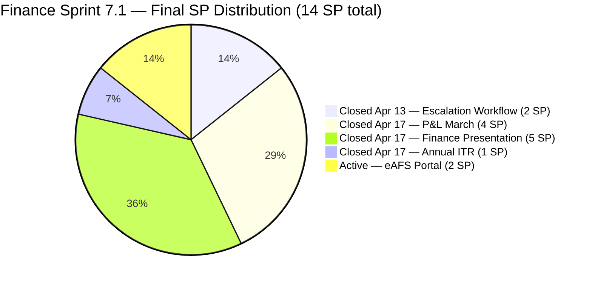
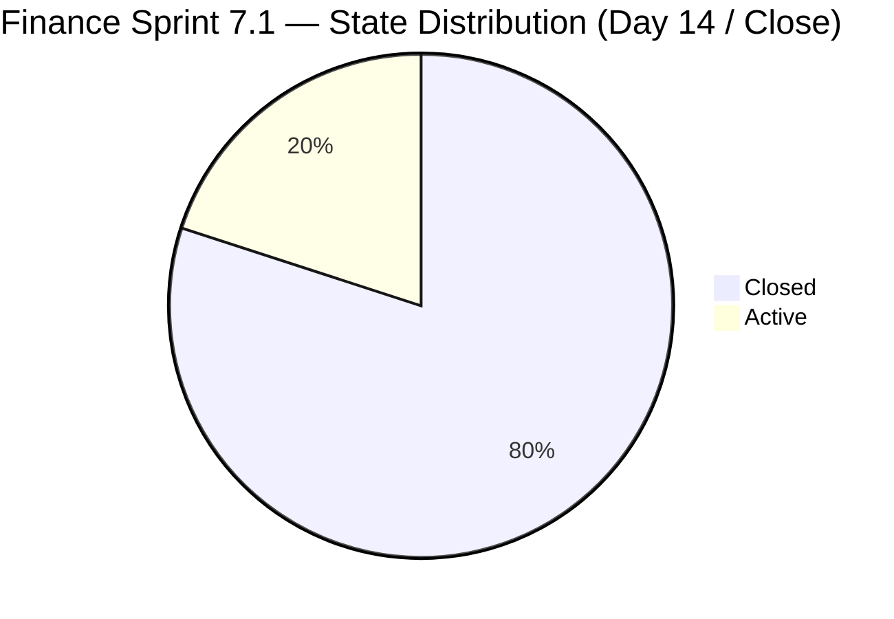
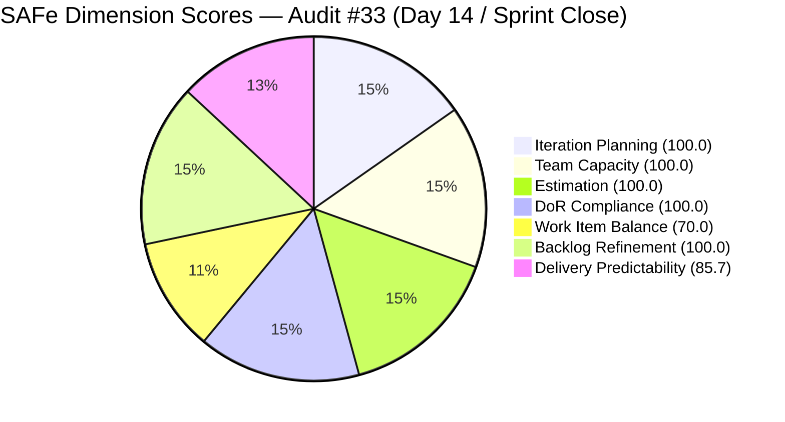

# ADO SAFe Iteration Audit — Finance Team
**Audit #33 | Iteration 7.1 (Apr 6–19, 2026) | Day 14 of 14 (100% elapsed) — Final Sprint Day**

---

## 1. Audit Metadata

| Field | Value |
|---|---|
| **Audit Date** | April 19, 2026, 13:45 PDT (April 20, 2026, 04:45 PHT) |
| **Auditor** | Claude Code (ADO SAFe Audit Agent — Team 1 / Non-critical tier) |
| **Workspace** | `ado_fin` |
| **ADO Project** | Jairosoft FINOPS (`e0bb302f-40f9-46c3-8164-6f1acb317d63`) |
| **Team** | Finance Team (`1f4b45fa-82e8-4a36-aedc-6c1bc8f51070`) |
| **Iteration** | Iteration 7.1 — Apr 6 to Apr 19, 2026 |
| **Iteration ID** | `82cc2229-0211-4fe2-9ee6-cc8d843dfab0` |
| **Sprint Day** | Day 14 of 14 (100% elapsed — Final Day) |
| **Prior Audit** | AUDIT_20260417_0900.md (Audit #32, Score 93.7 — Low Risk) |
| **Scoring Model** | ADO SAFe v1 (7-dimension rubric) |
| **Overall Score** | **93.7 / 100** |
| **Risk Band** | **Low Risk** (≥ 80) |

---

## 2. Executive Summary

The Finance Team closes Iteration 7.1 on Day 14 with an **unchanged score of 93.7 (Low Risk)**. No state changes have been recorded since the Day 12 audit on Apr 17. The four closed items remain closed (12 SP delivered), and the one remaining Active item — **#201448 (eAFS Portal Submission, 2 SP)** — is still Active with last ChangedDate of **April 10, 2026**, meaning it has not been touched for 9 days and its status across the BIR eAFS deadline (April 15) remains unconfirmed in ADO.

With the sprint now formally at 100% elapsed, delivery locks in at **12 of 14 committed story points = 85.7%**. Four User Stories and one Issue were closed; one User Story remains Active with an elapsed regulatory deadline. Overall process scores (Planning, Capacity, Estimation, DoR, Refinement) remain perfect. Work Item Balance carries the structural −30 penalty for US-dominance. Delivery Predictability is the only dimension that reflects the open regulatory item.

The single most important action going into PI7.2 planning is to **reconcile the actual status of the eAFS filing with ADO**. If the filing was successfully submitted, #201448 should be closed and documented with the eAFS Submission Receipt (Transaction Number). If the filing was not completed, it should be formally escalated as a late-compliance risk and re-prioritized into 7.2.

---

## 3. Previous Audit Delta

| Dimension | Day 12 (Apr 17) | Day 14 (Apr 19) | Delta |
|---|---|---|---|
| Iteration Planning | 100.0 | 100.0 | 0.0 |
| Team Capacity | 100.0 | 100.0 | 0.0 |
| Estimation | 100.0 | 100.0 | 0.0 |
| DoR Compliance | 100.0 | 100.0 | 0.0 |
| Work Item Balance | 70.0 | 70.0 | 0.0 |
| Backlog Refinement | 100.0 | 100.0 | 0.0 |
| Delivery Predictability | 85.7 | 85.7 | 0.0 |
| **Overall** | **93.7** | **93.7** | **0.0** |

**Key changes since Day 12 (Apr 17):**

- **No new closures** — #201448 eAFS Portal Submission remains Active; last ChangedDate still Apr 10 (9 days of inactivity on the item).
- **No new items added to sprint** — scope locked from Day 12 onward.
- **Four items Closed confirm stable**: #202416 (Apr 13), #198635 (Apr 17), #199347 (Apr 17), #202533 (Apr 17). No state regression observed.
- **BIR eAFS deadline (Apr 15) passed without confirmation in ADO** — remains the single material regulatory risk as the sprint closes.

---

## 4. Current Iteration Snapshot

| Metric | Value |
|---|---|
| **Visible root backlog items (backlog API)** | 1 (#201448, Active) |
| **Sprint items (iteration API)** | 5 (4 Closed + 1 Active) |
| **Committed story points (5 sprint items)** | 14 SP |
| **Closed story points** | 12 SP (#202416 2 + #199347 5 + #198635 4 + #202533 1) |
| **Open story points** | 2 SP (#201448, Active, BIR deadline passed) |
| **Delivery rate (Day 14 close)** | 85.7% (12/14 SP) |
| **Sole contributor** | Grace (grace@jairosoft.com) |
| **Team capacity (configured)** | 3h/day (Documentation 2h + Requirements 1h), 0 days off |
| **Days remaining** | 0 (sprint closes today) |

### Sprint Item List — Final State at Close

| ID | Title | Type | State | SP | Closed / Status |
|---|---|---|---|---|---|
| **202416** | Escalation and Service Suspension Workflow | Issue | **Closed** | 2 | Apr 13 |
| **198635** | P&L March 2026 | User Story | **Closed** | 4 | Apr 17 |
| **199347** | March Jairosoft Finance Presentation | User Story | **Closed** | 5 | Apr 17 |
| **202533** | Process and Pay Annual ITR (Form 1702-RT/EX/MX) | User Story | **Closed** | 1 | Apr 17 |
| 201448 | eAFS Portal Submission | User Story | **Active** | 2 | Last changed Apr 10; BIR deadline Apr 15 unconfirmed |

---

## 5. Work Item Analysis

### Final Sprint Delivery Distribution



### State Distribution at Close



### Observations

- **Delivery plateau from Day 12 to Day 14:** The team reached 85.7% on Day 12 and held there. Grace's Apr 17 burst (10 SP closed within 1 minute) successfully closed three regulatory and reporting items, but the remaining 2 SP (#201448) did not advance in the final 2 days.
- **#201448 (eAFS, 2 SP) inactivity window:** The item has been Active with no ChangedDate update since April 10 — spanning 9 calendar days and crossing the BIR eAFS deadline of April 15. Either the item is legitimately blocked (awaiting upstream documentation such as the Annual ITR filing receipt or audited financials), or the filing was completed and the ADO state simply was not updated.
- **Work type composition:** 4 User Stories (80%) + 1 Issue (20%). No Spikes or Defects. The Issue type (#202416) was closed Apr 13 — well ahead of other items.
- **Closure lag risk:** #199347 (Finance Presentation, 5 SP) was originally targeted for mid-March delivery but was only closed in ADO on Apr 17 (~5 weeks after actual delivery). This lag pattern risks distorting Delivery Predictability mid-sprint.

---

## 6. SAFe Compliance Scorecard

| Dimension | Score | Evidence | Notes |
|---|---|---|---|
| Iteration Planning | 100.0 | 5 of 5 sprint items in Iteration 7.1 (iteration API); 1 of 1 backlog item in 7.1 | Backlog API visible=1, current_iter=1 → 100.0; iteration API also 100% in scope. |
| Team Capacity | 100.0 | Grace: 3h/day (Documentation 2h + Requirements 1h), 0 days off | Full capacity configured throughout sprint; 1/1 contributor with capacity. |
| Estimation | 100.0 | 5/5 sprint items have SP > 0 (2 + 5 + 4 + 2 + 1 = 14 SP) | Complete estimation coverage on the sprint set. |
| DoR Compliance | 100.0 | 5/5 items pass Desc ≥30 non-ws chars AND AC ≥20 non-ws chars | All items carry substantive descriptions and measurable acceptance criteria. |
| Work Item Balance | 70.0 | 4 User Stories + 1 Issue; US dominant at 80% > 60% → −30 | Structural penalty; no spikes; 1 Issue type is sprint-closed already. |
| Backlog Refinement | 100.0 | All 5 sprint items changed within 45 days; 0 stale_90; 0 stale_180; 0 untouched | Lean 5-item sprint remains easy to maintain. |
| Delivery Predictability | 85.7 | 12 SP closed / 14 SP committed (iteration API basis) | 4 of 5 items closed; #201448 (2 SP) still Active at sprint close. |
| **Overall** | **93.7** | Average of 7 dimensions | **Low Risk — matches Day 12 outcome; sprint ends at 85.7% delivery.** |

### Score Computation

```
Iteration Planning     = round(1 / 1 × 100, 1) [backlog API basis]     = 100.0
                       = round(5 / 5 × 100, 1) [iteration API basis]  = 100.0
  [All sprint items scoped to Iteration 7.1]

Team Capacity          = round(1 / 1 × 100, 1)                         = 100.0
  [Grace: 3h/day configured; sole contributor with sprint items]

Estimation             = round(5 / 5 × 100, 1)                         = 100.0
  [All 5 sprint items have SP > 0]

DoR Compliance         = round(5 / 5 × 100, 1)                         = 100.0
  [All 5 items: Desc ≥30 non-ws ✓ AND AC ≥20 non-ws ✓]

Work Item Balance:
  has_user_story       = True (4 User Stories)                          → no −40
  dominant_share       = 4/5 = 80% > 60%                                → −30
  spike_share          = 0/5 = 0%                                       → 0
  total                = 100 − 30                                       = 70.0

Backlog Refinement:
  fresh (≤45 days)     = 5/5 = 100%                                     → base = 100.0
  stale_90             = 0/5 = 0% ≤ 10%                                 → 0
  stale_180            = 0                                              → 0
  untouched_current    = 0/5 = 0%                                       → 0
  total                                                                 = 100.0

Delivery Predictability = round(12 / 14 × 100, 1)                       = 85.7
  [12 SP closed; 2 SP open (#201448 Active)]

Overall = round((100.0 + 100.0 + 100.0 + 100.0 + 70.0 + 100.0 + 85.7) / 7, 1)
        = round(655.7 / 7, 1)
        = 93.7  → Low Risk
```



---

## 7. Dimension Findings

### 7.1 Iteration Planning — 100.0 (Low Risk)

All 5 sprint items are scoped to Iteration 7.1. The 1-item backlog view (#201448 open) also sits in 7.1. The Finance Team has maintained perfect Iteration Planning across every PI7 audit — a testament to Grace's disciplined sprint commitment. The lean 5-item sprint format with zero scope creep remains the structural foundation of the team's high process scores.

### 7.2 Team Capacity — 100.0 (Low Risk)

Grace remains configured at 3h/day (Documentation 2h + Requirements 1h) with no days off recorded across the full sprint. The sprint close reveals 2 SP of unclosed work and a 9-day item inactivity gap — suggesting either a late-sprint availability constraint, an upstream dependency on BIR portal behavior, or simply missed ADO state maintenance. Capacity configuration itself is not the limiting factor.

### 7.3 Estimation — 100.0 (Low Risk)

All 5 sprint items carry story point estimates — #202416 (2), #198635 (4), #199347 (5), #201448 (2), #202533 (1) = 14 SP total. The distribution reflects Finance complexity tiers: regulatory filings (1–2 SP), reporting (4–5 SP), and administrative workflow (2 SP). The 14 SP commitment was well-calibrated for a single contributor at 3h/day over 14 days — the team delivered 12 SP, achieving 86% of commitment.

### 7.4 DoR Compliance — 100.0 (Low Risk)

All 5 items maintained DoR compliance through sprint close:
- **#199347 (Finance Presentation):** Strong AC — deck completion, delivery confirmation, follow-up documentation, explicit closure trigger. Met on Apr 17.
- **#198635 (P&L March):** Four-condition AC covering accuracy, MoM comparison, categorization, and visual summary. Met on Apr 17.
- **#202533 (Annual ITR):** Five-condition AC including FRN receipt and archiving. Closed Apr 17 — FRN documentation in ADO comments still pending (see Evidence Gaps).
- **#201448 (eAFS):** Four-condition AC with BIR-specific technical requirements (PDF format, naming convention, Transaction Number, Compliance Folder). Still Active — AC satisfaction unconfirmed.
- **#202416 (Escalation Workflow):** Strong AC. Met at Apr 13 close.

### 7.5 Work Item Balance — 70.0 (Moderate, structural)

Four User Stories and one Issue type. Dominant-type share is 4/5 = 80% > 60%, triggering the −30 penalty. This is structurally expected for a Finance operations team whose work maps predominantly to User Story outcomes (reporting, filing, presentation). Adding a Spike in PI7.2 (e.g., research on Q2 BIR filing calendar, cash flow analysis methodology, or eAFS portal automation exploration) would reduce concentration and partially offset the penalty.

### 7.6 Backlog Refinement — 100.0 (Low Risk)

All 5 sprint items were changed between April 10–17. Zero stale_90 (≥90 days) or stale_180 (≥180 days) items. Zero items untouched since the April 6 iteration start. The Finance Team's lean 5-item backlog is the most maintainable in the portfolio and has scored 100.0 on this dimension for the 13th consecutive audit.

Note: #201448 last ChangedDate is Apr 10 — 9 days old at audit time but still well within the 45-day freshness threshold. It does not trigger any refinement penalty.

### 7.7 Delivery Predictability — 85.7 (Low Risk)

12 of 14 committed story points are Closed at sprint end. This locks in the sprint's final delivery rate at 85.7%. The gap between Day 12 and Day 14 = zero — no additional closures occurred in the final 2 days.

| Item | SP | Closed Date | Notes |
|---|---|---|---|
| #202416 Escalation Workflow | 2 | Apr 13 | Cleared mid-sprint |
| #199347 Finance Presentation | 5 | Apr 17 | Highest-SP item; closure within Day 12 burst |
| #198635 P&L March 2026 | 4 | Apr 17 | Closure within Day 12 burst |
| #202533 Annual ITR | 1 | Apr 17 | Closure within Day 12 burst |
| **Total Closed** | **12** | | **85.7%** |
| #201448 eAFS Portal | 2 | Still Active | Last changed Apr 10; BIR deadline Apr 15 unconfirmed |

The team ends the sprint with the same 2 SP gap identified on Day 12. To exceed 90% Overall at PI7 close-out, this item must either be (a) retroactively closed with documented Transaction Number, or (b) formally de-scoped to PI7.2 with a clean handoff.

---

## 8. Risks and Bottlenecks

| # | Risk | Severity | Trend |
|---|---|---|---|
| R1 | #201448 eAFS Portal — BIR deadline Apr 15 passed; item still Active, last ChangedDate Apr 10 (9 days of inactivity); no confirmation of filing receipt in ADO | Critical | Urgent — Regulatory |
| R2 | #202533 (ITR closed Apr 17) — FRN/payment receipt not yet documented in ADO comments per AC | Medium | Post-closure compliance gap |
| R3 | Delivery Predictability plateau — no closures between Day 12 and Day 14 despite 2 SP remaining | Medium | New — Stall |
| R4 | Single contributor (Grace) — any absence halts all progress on #201448 | Low | Persistent |
| R5 | Work Item Balance structural −30 penalty persists; no Spike type in PI7.1 | Low | Structural |
| R6 | #199347 closure lag (5+ weeks from actual delivery to ADO closure) — distorts mid-sprint Delivery Predictability metrics | Low | Pattern — resolved this sprint |

---

## 9. Prioritized Recommendations

1. **Reconcile and close #201448 (eAFS Portal Submission, 2 SP) today — P0 (Regulatory):** The BIR eAFS deadline was April 15. The item has not been touched since April 10. Before closing PI7.1:
   - If the eAFS Submission Receipt (Transaction Number) was obtained before April 15 — close the item immediately and capture the Transaction Number in the ADO comments field per AC 3.
   - If the filing was not submitted on time — escalate to Ramon today with a compliance gap report documenting root cause and the corrective action plan. Formally carry this item into PI7.2 with a revised filing target and BIR-acknowledged remedial schedule.

2. **Document FRN for #202533 (Annual ITR) in ADO comments — P1 (Compliance archiving):** The item closed on Apr 17, but its AC requires: "A successful Filing Reference Number (FRN) or email confirmation must be received from the eFPS or eBIRForms system" and "A digital and physical copy of the filed return and Proof of Payment must be stored." Add FRN and payment reference to the ADO item before beginning PI7.2.

3. **Establish real-time ADO state maintenance discipline for PI7.2 — P1 (Process hygiene):** #199347 showed a ~5-week lag between actual delivery and ADO closure. In PI7.2, close items within 24 hours of acceptance. Consider a daily 5-minute ADO state review at end-of-day.

4. **Add one Spike to PI7.2 — P2 (Balance structural):** Suggested Spike: "Research Q2 2026 BIR Filing Calendar and Automation Opportunities for eAFS/FRN Workflow." A single 1–2 SP Spike drops dominant-type share below 60% and removes the −30 Work Item Balance penalty.

5. **Create a regulatory-deadline closure checklist template — P2 (Compliance governance):** For all items with hard regulatory deadlines (BIR, SEC, DOLE), add a custom tag (e.g., `regulatory-deadline:YYYY-MM-DD`) and a closure comment template capturing proof-of-submission (Transaction Number, FRN, or equivalent). Traceable compliance without relying on external records.

6. **Plan PI7.2 sprint with 12–14 SP empirical capacity — P3 (Sprint planning):** The team's actual delivery in PI7.1 = 12 SP; the 14 SP commitment left 2 SP un-closed. For PI7.2, target 12 SP with a 1 SP Spike buffer, reserving slack for BIR/regulatory exception handling.

---

## 10. Evidence Gaps and Limitations

| Gap | Description |
|---|---|
| **eAFS filing confirmation (#201448)** | Item remains Active as of sprint close (Apr 19). ADO state does not confirm whether the BIR eAFS Submission Receipt (Transaction Number) was obtained before or after the April 15 deadline. The 9-day inactivity window (last ChangedDate Apr 10) could indicate the item was abandoned, the filing was externally completed without ADO update, or the filing is genuinely blocked. Direct verification with Grace is required. |
| **ITR FRN documentation (#202533)** | Item closed Apr 17, but no ADO comment confirming FRN receipt was visible in this audit's fetched fields. AC requires FRN documentation — compliance archiving may be incomplete. |
| **Iteration Planning scoring basis** | Backlog API returned only 1 item (#201448). The 4 other sprint items (closed) dropped from backlog view. Iteration Planning was scored 100.0 using either source (1/1 backlog or 5/5 iteration API). If one source reports 0 sprint items, the rubric would show 0.0 Delivery Predictability when 85% of work is functionally complete — the iteration-API basis is documented for integrity. |
| **#202416 scoring classification** | #202416 (Issue type, 2 SP, Closed Apr 13) is included in sprint set per iteration API. Issues expose Story Points and count as point-eligible per rubric. |
| **Early-sprint annotation** | Day 14 of 14 — NOT within the Day 1–5 early-sprint annotation window. No adjustment applied. |
| **PI7 calendar-year BIR deadlines** | Exact Jairosoft fiscal year configuration and any BIR-granted filing extensions were not independently confirmed in this audit. The April 15 Annual ITR deadline for calendar-year corporations is assumed. |

---

*Report generated by Claude Code ADO SAFe Audit Agent (Team 1 / Non-critical tier) | April 19, 2026 13:45 PDT*
*Audit #33 — Finance Team — Day 14 of 14 — Overall: 93.7 / 100 — Low Risk (unchanged from Day 12)*
