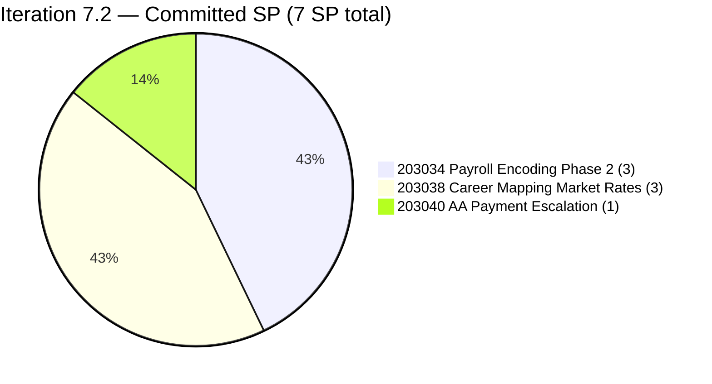
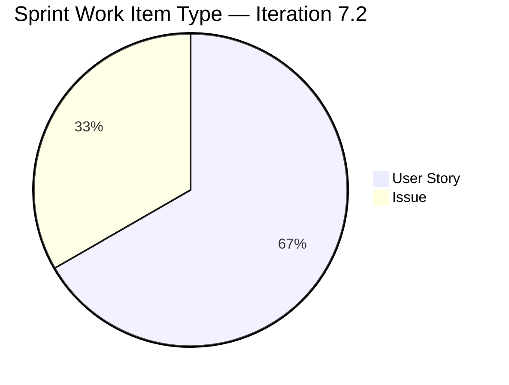
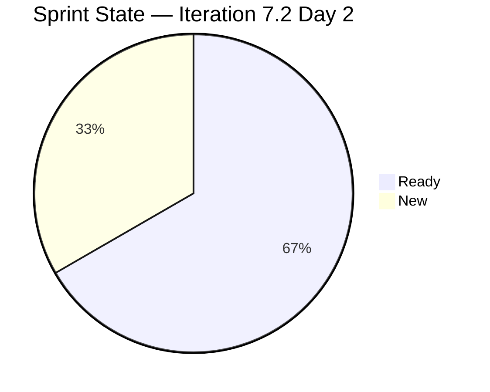
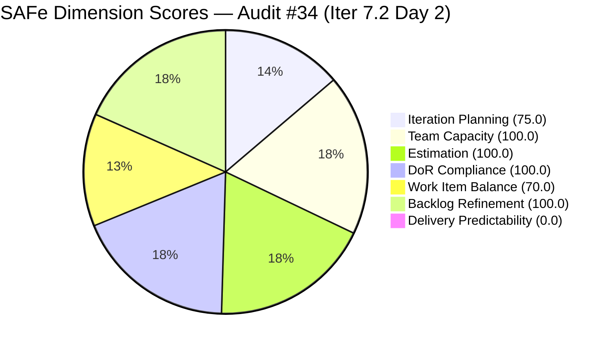

# ADO SAFe Iteration Audit — Finance Team

**Audit #34 | Iteration 7.2 (Apr 20 – May 3, 2026) | Day 2 of 14 (early-sprint)**

---

## 1. Audit Metadata

| Field | Value |
|---|---|
| **Audit Date** | April 21, 2026, 08:00 PDT |
| **Auditor** | Claude Code (ADO SAFe Audit Agent — `all-projects` batch, Team A) |
| **Workspace** | `ado_fin` |
| **ADO Project** | Jairosoft FINOPS (`e0bb302f-40f9-46c3-8164-6f1acb317d63`) |
| **Team** | Finance Team (`1f4b45fa-82e8-4a36-aedc-6c1bc8f51070`) |
| **Iteration** | Iteration 7.2 — Apr 20 to May 3, 2026 |
| **Iteration ID** | `a9888bc5-48df-40dd-bcc8-6926a11aa7c7` |
| **Sprint Day** | Day 2 of 14 (early-sprint — Day 1–5 window) |
| **Prior Audit** | AUDIT_20260419_1345.md (Audit #33, 93.7 — Low Risk, PI7.1 close) |
| **Scoring Model** | ADO SAFe v1 (7-dimension rubric) |
| **Overall Score** | **77.9 / 100** |
| **Risk Band** | **Moderate Risk** (60 – 79.9; 2.1 below Low-Risk threshold) |

---

## 2. Executive Summary

The Finance Team opens Iteration 7.2 with a **lean 3-item / 7-SP commitment** (plus 1 additional PI7-root item not yet iteration-pathed). The sprint continues the team's discipline of a small, well-groomed commit: all three 7.2 items pass DoR, all three are estimated, and capacity is correctly configured. The 77.9 score (vs. 93.7 on PI7.1 close) is driven almost entirely by the early-sprint reset of Delivery Predictability to 0.0 (Day 2 — no SP closed; no formula adjustment).

The one open PI7.1 item, **#201448 eAFS Portal Submission (2 SP)**, is **no longer in the current backlog** — it was either closed or moved out of the team's Stories and Deliverables scope. The audit cannot confirm from the backlog API alone whether it was retroactively closed, carried forward to 7.2, or de-scoped to PI8. This is a material evidence gap that should be reconciled with Grace on Day 2.

**#203043 ("FTC HR for signed APEF", 2 SP)** was created Apr 20 and assigned to Grace but **scoped to PI7 root (not 7.2)** — neither in the current sprint nor assigned to a future iteration. It is the single item driving the Iteration Planning penalty (75.0 vs. 100.0 on PI7.1 close). Resolving its target iteration clears this deduction.

**Capacity caveat:** Grace has 2 days off configured (Apr 21 – Apr 22 inclusive) — today and tomorrow. Her effective sprint capacity drops to ~12 working days × 4h/day = 48 hours. The 7-SP commit at the team's ~1 SP ≈ 4h empirical conversion translates to ~28h — well within adjusted capacity.

Top actions: (a) reconcile #201448 status on Day 2; (b) move #203043 to an explicit iteration (7.2 or 7.3); (c) consider adding a 1-SP Spike to clear the persistent −30 Work Item Balance penalty.

---

## 3. Previous Audit Delta

| Dimension | PI7.1 Close (Apr 19) | PI7.2 Day 2 (Apr 21) | Delta |
|---|---|---|---|
| Iteration Planning | 100.0 | 75.0 | **−25.0** |
| Team Capacity | 100.0 | 100.0 | 0.0 |
| Estimation | 100.0 | 100.0 | 0.0 |
| DoR Compliance | 100.0 | 100.0 | 0.0 |
| Work Item Balance | 70.0 | 70.0 | 0.0 |
| Backlog Refinement | 100.0 | 100.0 | 0.0 |
| Delivery Predictability | 85.7 | 0.0 | **−85.7** (early-sprint) |
| **Overall** | **93.7** | **77.9** | **−15.8** |

**Key changes since PI7.1 close (Apr 19):**

- **New sprint opened.** Iteration 7.2 started Apr 20 with 3 committed root items / 7 SP. Delivery Predictability resets to 0.0 on Day 2 — early-sprint, low delivery expected.
- **#201448 eAFS Portal Submission exited the scoped backlog.** Prior audit had it as the sole remaining open item (2 SP, Active, BIR deadline Apr 15 unconfirmed). It no longer appears in the Stories and Deliverables backlog for the Finance Team. Audit cannot confirm whether it was closed, moved to 7.2, or re-routed.
- **3 new 7.2 items created Apr 20 (Grace):**
  - #203034 "Encoding payroll for automation – phase2" (User Story, Ready, 3 SP, DoR PASS)
  - #203038 "Explore market rates in references for Career Mapping" (User Story, Ready, 3 SP, DoR PASS)
  - #203040 "AA Escalation of Payment Settlement" (Issue, New, 1 SP, DoR PASS)
- **1 new PI7-root item created Apr 20 (unscoped):** #203043 "FTC HR for signed APEF" (User Story, New, 2 SP) — assigned to Grace but **not iteration-pathed to 7.2**. Sits in PI7 root.
- **Days off configured:** Grace has Apr 21 – Apr 22 marked as days off. First-ever recorded days-off entry in this team's capacity log.

---

## 4. Current Iteration Snapshot

| Metric | Value |
|---|---|
| **Visible root backlog items (backlog API)** | 4 (3 in Iter 7.2; 1 in PI7 root) |
| **Current iteration root items (Iter 7.2)** | 3 |
| **Committed story points (Iter 7.2)** | 7 SP |
| **Closed story points (Day 2)** | 0 SP |
| **Delivery rate (Day 2)** | 0.0% (early-sprint — Day 1–5) |
| **State distribution (sprint set)** | 2 Ready, 1 New |
| **Sole contributor** | Grace (<grace@jairosoft.com>) |
| **Team capacity (configured)** | 4h/day (Documentation 3h + Requirements 1h), 2 days off (Apr 21–22) |
| **Effective working days** | 12 of 14 (~48 working hours) |

### Sprint Item List — Iteration 7.2 Commitment

| ID | Title | Type | State | SP | DoR | Notes |
|---|---|---|---|---|---|---|
| 203034 | Encoding payroll for automation – phase2 | User Story | Ready | 3 | PASS | Created Apr 20 |
| 203038 | Explore market rates in references for Career Mapping | User Story | Ready | 3 | PASS | Created Apr 20 |
| 203040 | AA Escalation of Payment Settlement | Issue | New | 1 | PASS | Created Apr 20 |

### Out-of-Sprint Visible Item

| ID | Title | Type | State | SP | IterationPath |
|---|---|---|---|---|---|
| 203043 | FTC HR for signed APEF | User Story | New | 2 | Jairosoft FINOPS\\2026-PI7 (root — no iteration) |

---

## 5. Work Item Analysis

### Sprint Composition



### Sprint Work-Item-Type Distribution



### State Distribution at Day 2



### Observations

- **Disciplined sprint open.** All 3 committed items are fully groomed (Description + Acceptance Criteria populated on Day 0). Commit size (7 SP) is below the team's empirical 12-SP delivery (PI7.1 closed at 12/14 SP, 85.7% delivery) — appropriately conservative given 2 days off.
- **Theme consistency.** Sprint targets FINOPS automation and process themes: payroll automation (203034), career mapping market rates (203038), and payables escalation workflow (203040). All three align with the Finance team's published automation roadmap.
- **#201448 eAFS disposition unclear.** The PI7.1 close audit flagged this 2-SP item as Active with BIR eAFS deadline Apr 15 passed. It no longer appears in the backlog or the current iteration. The audit cannot determine whether the filing was retroactively completed and closed, or the item was moved to a non-team backlog. **Material evidence gap.**
- **#203043 orphan.** Created and assigned Apr 20 but sits in PI7 root with no iteration assignment. Needs a target iteration (7.2, 7.3, or explicit defer).
- **First-ever days-off entry.** Grace has Apr 21–22 marked as days off — the first time this team has recorded planned absence in capacity. Positive signal for capacity-planning maturity.

---

## 6. SAFe Compliance Scorecard

| Dimension | Score | Evidence | Notes |
|---|---|---|---|
| Iteration Planning | 75.0 | 3 of 4 visible root items scoped to Iter 7.2 | #203043 sits in PI7 root without iteration — drives the −25. |
| Team Capacity | 100.0 | Grace: 4h/day (Documentation 3h + Requirements 1h); 2 days off; sole contributor with sprint work | 1/1 contributors with capacity. |
| Estimation | 100.0 | 3/3 sprint items carry SP > 0 (3 + 3 + 1 = 7 SP) | Full estimation coverage. |
| DoR Compliance | 100.0 | 3/3 items pass Desc ≥30 nws + AC ≥20 nws | All three have substantive descriptions and measurable AC. |
| Work Item Balance | 70.0 | 2 User Stories + 1 Issue; dominant share 2/3 = 66.7% > 60% → −30 | No Spike. User Story present → no −40. |
| Backlog Refinement | 100.0 | fresh=4/4; stale_90=0; stale_180=0; untouched_current=0/3 (all items changed Apr 20 ≥ iter start) | Lean backlog — easy to maintain. |
| Delivery Predictability | 0.0 | 0/7 SP closed at Day 2 | **Early-sprint — low delivery expected** (no formula adjustment). |
| **Overall** | **77.9** | Average of 7 dimensions | **Moderate Risk** (early-sprint; 2.1 below Low threshold) |

### Score Computation

```
Iteration Planning    = round(3 / 4 × 100, 1)     = 75.0
Team Capacity         = round(1 / 1 × 100, 1)     = 100.0
Estimation            = round(3 / 3 × 100, 1)     = 100.0
DoR Compliance        = round(3 / 3 × 100, 1)     = 100.0

Work Item Balance:
  has_user_story      = True  (2 US)              → no −40
  dominant_share      = 2/3 = 66.7% > 60%         → −30
  spike_share         = 0/3 = 0%                  → 0
  total               = 100 − 30                  = 70.0

Backlog Refinement:
  fresh (≤45 days)    = 4/4 = 100%                → base = 100
  stale_90            = 0                         → 0
  stale_180           = 0                         → 0
  untouched_current   = 0/3 = 0%                  → 0
  total                                           = 100.0

Delivery Predictability = round(0 / 7 × 100, 1)   = 0.0
  (early-sprint annotation: Day 2 of 14 — low delivery expected)

Overall = round((75.0 + 100.0 + 100.0 + 100.0 + 70.0 + 100.0 + 0.0) / 7, 1)
        = round(545.0 / 7, 1)
        = 77.9  → Moderate Risk (2.1 below Low threshold)
```



---

## 7. Dimension Findings

### 7.1 Iteration Planning — 75.0 (Moderate)

3 of 4 visible root items are scoped to Iteration 7.2. #203043 ("FTC HR for signed APEF", 2 SP, New) is in PI7 root with no iteration assignment. Moving it to a target iteration (7.2 if intended for immediate work; 7.3 if deferrable) restores 100.0. The team has held 100.0 on this dimension for every prior PI7 audit — the drop is a single-item artifact, not a planning regression.

### 7.2 Team Capacity — 100.0 (Low Risk)

Grace is configured at 4h/day (Documentation 3h + Requirements 1h) with 2 days off (Apr 21, Apr 22). Effective working days = 12. Effective hours = 48. Committed 7 SP at the team's ~4h-per-SP empirical conversion = ~28h. Headroom ≈ 20h for reactive work or scope expansion. Sole contributor → contributors_with_capacity = 1, contributors_with_current_work = 1.

**Noteworthy:** This is the first sprint in PI7 where Grace has recorded planned days off. Previous audits flagged the absence of capacity-adjusted planning as a maturity gap; it is now resolved.

### 7.3 Estimation — 100.0 (Low Risk)

All 3 sprint items carry Story Points > 0 (3 + 3 + 1 = 7 SP). Commitment is well below the PI7.1 actual delivery (12 SP) — appropriately conservative given the 2 planned days off.

### 7.4 DoR Compliance — 100.0 (Low Risk)

All 3 items pass DoR:

- **#203034 Encoding payroll automation phase 2:** Strong user-story format ("As a Payroll Administrator…") with concrete AC (mandatory-field blocking, pre-check validation).
- **#203038 Explore market rates / Career Mapping:** Clear persona + intent Description. AC spells out filterable data, visual benchmarks, currency conversion, source transparency, and integration.
- **#203040 AA Escalation of Payment Settlement:** Clear Finance Manager persona, concrete trigger logic (15-day overdue → PM notification). AC covers Level-1 alert at 5 days, Karl notification at 15 days, dashboard status update.

### 7.5 Work Item Balance — 70.0 (Moderate, structural)

2 User Stories + 1 Issue. Dominant share = 2/3 = 66.7% > 60% → −30. No Spike. The 70.0 score is a structural artifact of the lean 3-item sprint — any US-majority 3-item mix triggers the penalty. Adding a single 1-SP Spike (e.g., "Investigate Q2 BIR e-filing calendar and eAFS FRN workflow automation") brings dominant share to 50% and eliminates the penalty.

### 7.6 Backlog Refinement — 100.0 (Low Risk)

All 4 visible items changed within 45 days (all created or touched Apr 20). Zero stale_90, zero stale_180, zero untouched_current (all 3 sprint items touched on or after the Apr 20 iteration start). The Finance Team's lean backlog remains the most maintainable in the portfolio.

### 7.7 Delivery Predictability — 0.0 (Early-sprint — low delivery expected)

Day 2 of 14. Zero SP closed. **Early-sprint annotation applied**: no formula adjustment. Normal expectation is <15% SP closed in first 5 days. The 7-SP sprint should see at least the 1-SP Issue (#203040) closed by Day 5 as an early win.

---

## 8. Risks and Bottlenecks

| # | Risk | Severity | Trend |
|---|---|---|---|
| R1 | #201448 eAFS Portal Submission disposition unconfirmed — not in current backlog; BIR deadline Apr 15 elapsed | High | Carried from PI7.1 |
| R2 | #203043 (FTC HR APEF, 2 SP) in PI7 root without iteration assignment | Medium | New this audit |
| R3 | Single contributor (Grace) — any unplanned absence halts all progress | Medium | Persistent |
| R4 | Grace has 2 days off in first 3 days of sprint — front-loaded absence limits Day 1–3 momentum | Low | New this sprint (positive signal for planning maturity) |
| R5 | Work Item Balance structural −30 penalty (no Spike) | Low | Persistent |
| R6 | #202533 (PI7.1 Annual ITR) — FRN documentation completeness not verified in this audit | Low | Carried from PI7.1 |

---

## 9. Prioritized Recommendations

1. **Reconcile #201448 eAFS Portal Submission disposition today — P0 (Regulatory continuity):**
   - If #201448 was retroactively closed on Apr 19 or Apr 20, confirm the BIR Transaction Number is logged in the ADO comments and that the item shows a ClosedDate; if not, add them.
   - If the filing is still incomplete, re-scope it to Iteration 7.2 as an explicit compliance item and escalate to Ramon with a corrective-action plan.
   - If the item was moved to a different backlog (e.g., PI8 or a separate compliance backlog), document the reason and confirm regulatory coverage.

2. **Move #203043 (FTC HR for signed APEF, 2 SP) to an explicit iteration by Day 3 — P1:** If intended for immediate work, move to Iteration 7.2 (raises commit to 9 SP — still within capacity). Otherwise assign to 7.3 or 7.4. Leaving it in PI7 root keeps the Iteration Planning score suppressed.

3. **Document FRN for #202533 (PI7.1 Annual ITR) in ADO comments — P2 (Compliance archiving):** Carried from the PI7.1 audit — still not verified.

4. **Add one Spike to PI7.2 — P2 (Balance structural):** Suggested: "Research Q2 2026 BIR e-filing calendar and FRN automation opportunities" (1 SP). Drops dominant share to 50%, removes −30 penalty. Also gives Grace lower-cognitive-load work for the Apr 21–22 return-to-work days.

5. **Establish a regulatory-deadline tagging convention — P2 (Governance):** For items with hard regulatory deadlines (BIR, SEC, DOLE), tag `regulatory-deadline:YYYY-MM-DD` and require a closure-comment capturing proof-of-submission (Transaction Number, FRN, or equivalent). Would have prevented the #201448 disposition ambiguity.

6. **Plan next sprint (7.3) with 10–12 SP commit — P3 (Sprint planning):** PI7.1 delivered 12 SP at 85.7%. With days-off planning now mature, target 10–12 SP commit at 90% expected delivery.

---

## 10. Evidence Gaps and Limitations

| Gap | Description |
|---|---|
| **#201448 eAFS disposition** | The PI7.1 close audit had this item Active with BIR deadline Apr 15 elapsed. It no longer appears in the Stories and Deliverables backlog for the Finance Team. ADO work-item fetch by ID was not performed in this audit scope (the backlog API is the primary evidence source). Direct status confirmation with Grace is required. |
| **Early-sprint Delivery Predictability** | Day 2 of 14 inherently yields 0.0 DP. Rubric applies the early-sprint annotation (Day 1–5 window) with no formula adjustment. Score reads truthfully as "no SP closed yet". |
| **Days-off effective capacity** | Grace's 4h/day × (14 − 2) = 48h effective. Rubric does not include a capacity-utilisation check. The 7-SP commit is appropriate; however, no independent verification that days-off align with actual absences. |
| **#203043 target iteration intent** | Cannot determine whether Grace intends #203043 for PI7.2 (pending iteration move), PI7.3, or explicit defer. Rubric scores it as not in the current iteration — Iteration Planning penalty applies. |
| **WIB penalty on lean sprints** | The fixed −30 dominant-type penalty is structural for 3-item sprints regardless of team maturity. Noted for rubric feedback; does not distort current scoring. |
| **#202533 FRN documentation** | PI7.1 Annual ITR closure required FRN per AC. Current audit did not re-verify the AC completion on the closed item. Carried forward from PI7.1 gap. |

---

*Report generated by Claude Code ADO SAFe Audit Agent (Team A / `all-projects` batch) | April 21, 2026 08:00 PDT*
*Audit #34 — Finance Team — Iteration 7.2 Day 2 of 14 — Overall: 77.9 / 100 — Moderate Risk (early-sprint; PI7.1 closed at 93.7)*
