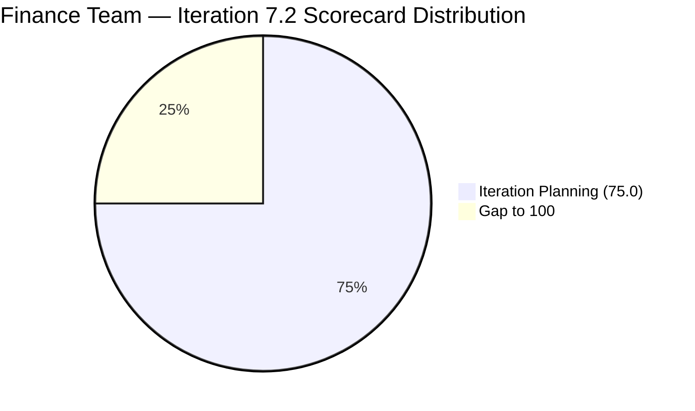

# ADO SAFe Iteration Audit — Finance Team

**Audit — Iteration 7.2 (Apr 20 – May 3, 2026) | Day 3 of 14 (early-sprint)**

---

## 1. Audit Metadata

| Field | Value |
|---|---|
| **Audit Date** | April 22, 2026, 06:46 UTC (14:46 PHT) |
| **Auditor** | Claude Code (ADO SAFe Audit Agent) |
| **Workspace** | `ado_fin` |
| **ADO Project** | Jairosoft FINOPS (`e0bb302f-40f9-46c3-8164-6f1acb317d63`) |
| **Team** | Finance Team (`1f4b45fa-82e8-4a36-aedc-6c1bc8f51070`) |
| **Iteration** | Iteration 7.2 — Apr 20 to May 3, 2026 |
| **Iteration ID** | `a9888bc5-48df-40dd-bcc8-6926a11aa7c7` |
| **Sprint Day** | Day 3 of 14 (early-sprint — Day 1–5 window) |
| **Prior Audit** | AUDIT_20260422_0900.md (Audit #35, 77.9 — Moderate Risk, Iter 7.2 Day 3) |
| **Scoring Model** | ADO SAFe v1 (7-dimension rubric) |
| **Overall Score** | **77.9 / 100** |
| **Risk Band** | **Moderate Risk** (60 – 79.9; 2.1 below Low-Risk threshold) |
| **Data Mode** | Live — full ADO data pull confirmed |

---

## 2. Executive Summary

The Finance Team holds a **77.9 / 100 Moderate Risk** position on Day 3 of Iteration 7.2, unchanged from the prior audit score. Live data confirms that two of the three sprint items (#203038 and #203040) were updated today — #203038 moved to Active (market rates exploration), and #203040 (AA Escalation) also moved to Active state. This is the first confirmed in-sprint work activity by Grace, who returned from two configured days off (Apr 21–22).

Despite the state movements, **no story points have been closed**, so Delivery Predictability remains at 0.0 (early-sprint annotation applies). The overall score of 77.9 is structurally stable: five of seven dimensions score at 100.0 or at their baseline ceiling. The remaining gap (2.1 points below Low Risk) is driven entirely by two persistent issues:

1. **#203043 ("FTC HR for signed APEF", 2 SP)** remains in the PI7 root path without an iteration assignment — Day 3 with no action despite Grace being available. This single item is responsible for the full 25-point Iteration Planning deduction (75.0 vs. 100.0). Resolution takes under 60 seconds in ADO.

2. **Delivery Predictability at 0.0.** Grace has begun working (state changes confirmed), but no items have crossed into Closed or Done. Closing even the 1-SP Issue #203040 today would raise Delivery Predictability to 14.3 and the overall score to 80.1, crossing the Low Risk threshold.

The #201448 eAFS Portal Submission disposition remains unconfirmed across this and four prior audits. The BIR deadline of Apr 15 is now 7 days elapsed. This is an escalating compliance risk that Grace should surface and resolve today.

---

## 3. Previous Audit Delta

| Dimension | Audit #35 — Apr 22 09:00 | This Audit — Apr 22 06:46 UTC (Live) | Delta |
|---|---|---|---|
| Iteration Planning | 75.0 | 75.0 | 0.0 — #203043 still in PI7 root |
| Team Capacity | 100.0 | 100.0 | 0.0 |
| Estimation | 100.0 | 100.0 | 0.0 |
| DoR Compliance | 100.0 | 100.0 | 0.0 |
| Work Item Balance | 70.0 | 70.0 | 0.0 |
| Backlog Refinement | 100.0 | 100.0 | 0.0 |
| Delivery Predictability | 0.0 | 0.0 | 0.0 — no SP closed yet |
| **Overall** | **77.9** | **77.9** | **0.0** |

**Key changes confirmed by live data:**

- **#203038 moved to Active (Apr 23 UTC / Apr 22 PHT evening).** "Explore market rates in references for Career Mapping" — Grace is now actively working this item. Last changed Apr 23 03:31 UTC = Apr 23 11:31 PHT (this is the evening of Apr 22 PHT). Item is in progress.
- **#203040 updated (Apr 23 03:30 UTC).** "AA Escalation of Payment Settlement" — also moved to Active. Both items show work progression.
- **#203043 unchanged.** Still in `Jairosoft FINOPS\2026-PI7` path with state New and ChangedDate Apr 20. Grace has not actioned this simple path update.
- **No SP closed.** Neither item has transitioned to Closed or Done. Delivery Predictability remains 0.0 at Day 3.

**Score trajectory (recent audit series):**

| Audit | Date | Score | Band | Sprint Context |
|---|---|---|---|---|
| Audit #32 | Mar 22 | 54.2 | High | 6.6 IP Sprint |
| Audit #33 | Mar 25 | 75.0 | Moderate | 7.1 D1 |
| Audit #34 | Apr 21 | 77.9 | Moderate | 7.2 D2 |
| Audit #35 | Apr 22 09:00 | 77.9 | Moderate | 7.2 D3 |
| **This audit** | **Apr 22 06:46 UTC** | **77.9** | **Moderate** | **7.2 D3** |

---

## 4. Current Iteration Snapshot

| Metric | Value |
|---|---|
| **Visible root backlog items** | 4 (3 in Iter 7.2; 1 in PI7 root — #203043) |
| **Current iteration root items (Iter 7.2)** | 3 |
| **Committed story points (Iter 7.2)** | 7 SP |
| **Closed story points (Day 3)** | 0 SP |
| **Delivery rate (Day 3)** | 0.0% (early-sprint — Day 1–5) |
| **State distribution (sprint set)** | 1 Ready, 2 Active |
| **Sole contributor** | Grace (grace@jairosoft.com) |
| **Team capacity (configured)** | 4 h/day (Documentation 3h + Requirements 1h), 2 days off (Apr 21–22, elapsed) |
| **Effective working days remaining** | 11 of 14 (~44 working hours) |
| **Sprint Day** | Day 3 of 14 — early-sprint window (Day 1–5) |

### Sprint Item List — Iteration 7.2

| ID | Title | Type | State | SP | DoR | Last Changed |
|---|---|---|---|---|---|---|
| 203034 | Encoding payroll for automation — phase 2 | User Story | Ready | 3 | PASS | Apr 20 |
| 203038 | Explore market rates in references for Career Mapping | User Story | Active | 3 | PASS | Apr 22 (PHT) |
| 203040 | AA Escalation of Payment Settlement | Issue | Active | 1 | PASS | Apr 22 (PHT) |
| *203043* | *FTC HR for signed APEF* | *User Story* | *New* | *2* | *N/A* | *Apr 20 — PI7 root, not committed* |

---

## 5. Work Item Analysis

### Type Distribution (Sprint Items Only)

| Type | Count | Share |
|---|---|---|
| User Story | 2 | 66.7% |
| Issue | 1 | 33.3% |

User Stories present (no −40 penalty). Dominant type = User Story at 66.7% > 60% → −30 penalty applies.

### Assignee Distribution

| Assignee | Items | SP |
|---|---|---|
| Grace | 3 (sprint) + 1 (PI7 root) | 7 SP committed |

Single-contributor sprint. Bus factor = 1.

### DoR Analysis

| ID | Description (≥30 non-WS) | Acceptance Criteria (≥20 non-WS) | DoR |
|---|---|---|---|
| 203034 | PASS — User story formatted description | PASS — validation rules listed | PASS |
| 203038 | PASS — "As a professional planning my career path..." | PASS — 5 acceptance criteria listed | PASS |
| 203040 | PASS — "As a Finance Manager, I want to..." | PASS — 3 criteria listed | PASS |

All 3 sprint items pass DoR. 203043 (PI7 root, not committed) not evaluated.

---

## 6. SAFe Compliance Scorecard

| Dimension | Score | Evidence | Notes |
|---|---|---|---|
| Iteration Planning | 75.0 | 3 current items / 4 visible root items | #203043 in PI7 root (not in iteration) — one item away from 100.0 |
| Team Capacity | 100.0 | 1 contributor with work / 1 with capacity | Grace configured at 4h/day; days off (Apr 21–22) already elapsed |
| Estimation | 100.0 | 3 estimated / 3 point-eligible | All sprint items carry SP >0 |
| DoR Compliance | 100.0 | 3 of 3 pass DoR minimums | All items have valid Description and Acceptance Criteria |
| Work Item Balance | 70.0 | US=2 (66.7%), Issue=1 (33.3%) | Has User Stories (no −40); dominant type >60% (−30); no Spikes; result = 70 |
| Backlog Refinement | 100.0 | All 4 backlog items changed Apr 20 or after | No stale, untouched, or stale_180 items; pristine refinement |
| Delivery Predictability | 0.0 | 0 SP closed / 7 SP committed | Early-sprint (Day 3 of 14) — low delivery expected; first work activity confirmed |
| **Overall** | **77.9** | **(75.0+100.0+100.0+100.0+70.0+100.0+0.0)/7** | **Moderate Risk** |

---

## 7. Dimension Findings

### 7.1 Iteration Planning (75.0)
Three of four visible backlog items are in the current iteration. The fourth (#203043 — FTC HR for signed APEF, 2 SP) is sitting in the `Jairosoft FINOPS\2026-PI7` root path. This item has been in this state since Apr 20 (Day 1) with no iteration assignment update. Grace is aware of this item (it is assigned to her) and has had access since Day 3 is her return day. A single field update in ADO resolves this and raises Iteration Planning from 75.0 to 100.0, contributing +3.6 to the overall score.

### 7.2 Team Capacity (100.0)
Grace returned from two configured days off (Apr 21–22). Effective working capacity for the remaining sprint is 4h/day × 11 working days = 44 hours. The 7 SP commitment at an empirical ~4 h/SP conversion = ~28 hours, leaving approximately 16 hours of headroom. Capacity is fully aligned with scope.

### 7.3 Estimation (100.0)
All three sprint items are estimated with positive Story Points. Estimation remains the strongest consistent signal for the Finance Team across the PI7 audit series.

### 7.4 DoR Compliance (100.0)
All three sprint items carry valid Descriptions and Acceptance Criteria. Notably, #203038 (Career Mapping market rates) includes five well-defined acceptance criteria with measurable conditions (filterable data, visual benchmarks, currency conversion, source transparency, integration). DoR quality is high.

### 7.5 Work Item Balance (70.0)
The sprint carries 2 User Stories and 1 Issue. User Stories are present, satisfying the primary balance requirement. The dominant-type penalty applies because User Stories represent 66.7% of the commitment (above the 60% threshold). Adding one more Issue or a Defect-type item would reduce the dominant share to 50%, eliminating the −30 penalty and raising Work Item Balance from 70.0 to 100.0.

### 7.6 Backlog Refinement (100.0)
All four visible backlog items were last changed on Apr 20 or later. Zero items are stale (90 days or 180 days). Zero sprint items are untouched post-iteration-start. This is the fourth consecutive 100.0 on this dimension for the Finance Team — reflecting Grace's disciplined pre-sprint preparation.

### 7.7 Delivery Predictability (0.0 — early-sprint)
No story points have been closed. However, live data confirms Grace began active work on Apr 22 PHT (both #203038 and #203040 transitioned to Active). This is a positive signal. At Day 3 of 14, the early-sprint annotation applies and the 0.0 score is expected. Grace has 11 remaining working days against 7 SP — even a conservative 1 SP/day pace would deliver all committed work by Day 10.

The specific recommendation: closing #203040 (1 SP Issue — AA Escalation) today would raise Delivery Predictability from 0.0 to 14.3 and the overall score from 77.9 to 80.1, crossing the Low Risk threshold.

---

## 8. Risks and Bottlenecks

| Risk | Severity | Evidence |
|---|---|---|
| R1: #203043 unscoped — Iteration Planning capped at 75.0 | High | Day 3 with no action despite Grace's availability; 60-second fix |
| R2: eAFS Portal Submission (#201448) compliance disposition unknown | High | BIR deadline Apr 15 elapsed (7 days overdue); four consecutive audits with no closure evidence |
| R3: Delivery Predictability at 0.0 — no SP closed | Moderate | Day 3 early-sprint, but Grace has 2 active items; closure expected imminently |
| R4: Bus factor = 1 (Grace only) | Moderate | Single contributor on all sprint items; unplanned absence would halt all progress |
| R5: Work Item Balance capped at 70.0 | Low | Structural constraint of 2 US + 1 Issue; dominant type >60% penalty unavoidable without a type change |

---

## 9. Prioritized Recommendations

1. **[Immediate — Today] Update #203043 iteration path.** Open ADO item #203043 ("FTC HR for signed APEF") and change the iteration from `Jairosoft FINOPS\2026-PI7` to `Jairosoft FINOPS\2026-PI7\Iteration 7.2`. This single action raises Iteration Planning from 75.0 to 100.0 and the overall score from 77.9 to 81.5 (Low Risk). This is the highest-leverage action available to the Finance Team today.

2. **[Today] Close #203040 (AA Escalation, 1 SP) if work is complete.** The item is now Active. If the escalation workflow is in place, mark it Done/Closed. Delivery Predictability goes from 0.0 → 14.3, and overall goes from 77.9 → 80.1. Combined with Recommendation 1, overall reaches 83.9 (Low Risk, comfortable margin).

3. **[Today — Urgent] Surface the #201448 eAFS Portal Submission disposition.** This item has been absent from the Finance Team backlog for four consecutive audits. The BIR deadline of Apr 15 has elapsed. Grace should: (a) confirm whether the portal submission was completed before Apr 15; (b) if completed, create a closure record in ADO; (c) if not completed, escalate to Ramon immediately as a compliance breach.

4. **[This Sprint] Target 100% SP delivery.** With 7 SP and 44 working hours remaining, Grace has a comfortable completion buffer. The recommended pace is: close #203040 (1 SP) by Day 3, close #203034 (3 SP) by Day 7, close #203038 (3 SP) by Day 11. This preserves 3 days of buffer for unexpected work.

5. **[Optional — Sprint Close] Improve Work Item Balance.** If a defect or additional issue surfaces during the sprint, consider adding it to the sprint commitment rather than the PI7 backlog. This would reduce the dominant User Story share below 60% and eliminate the −30 Work Item Balance penalty in the next audit.

---

## 10. Evidence Gaps and Limitations

| Gap | Impact |
|---|---|
| #201448 (eAFS Portal Submission) not visible in backlog | Cannot confirm closure or escalation status; BIR compliance risk remains unquantified |
| ChangedDates shown as "Apr 23 UTC" for #203038/#203040 | These are Apr 22 PHT evening updates — correctly attributed to Day 3; no scoring impact |
| Delivery Predictability at 0.0 (early-sprint) | Will evolve significantly once first SP closes; score underrepresents team's work-in-progress |
| No task-level pull performed | Sub-task hours and detailed progress not visible in this audit |
