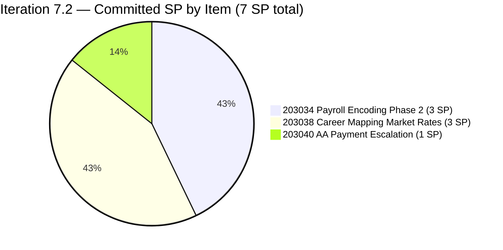
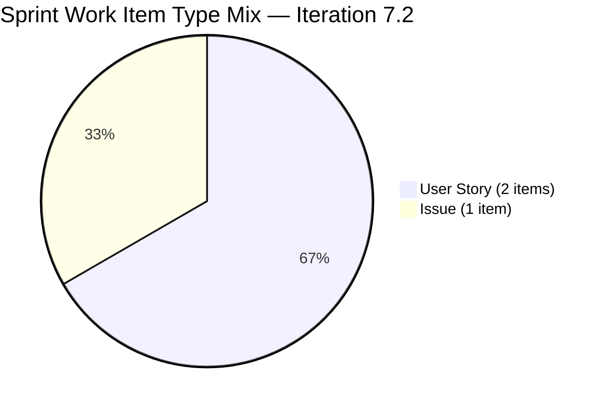
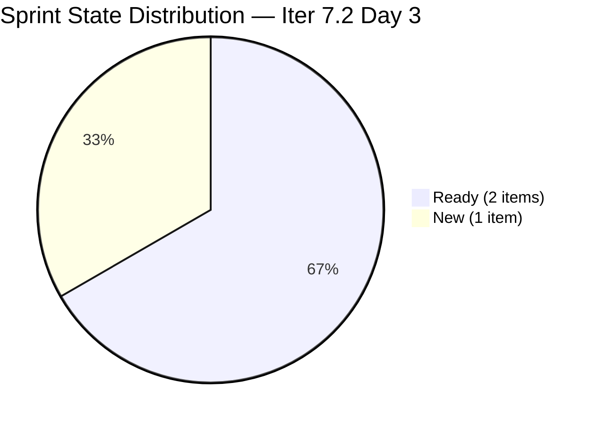
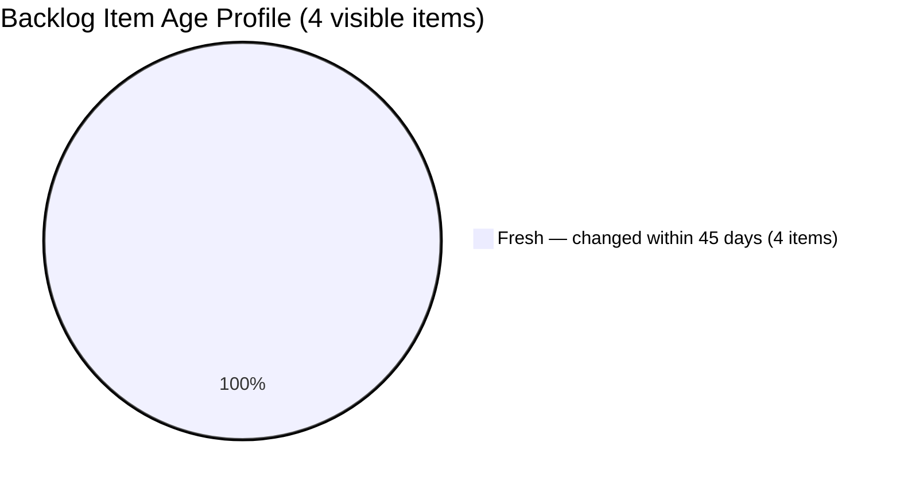
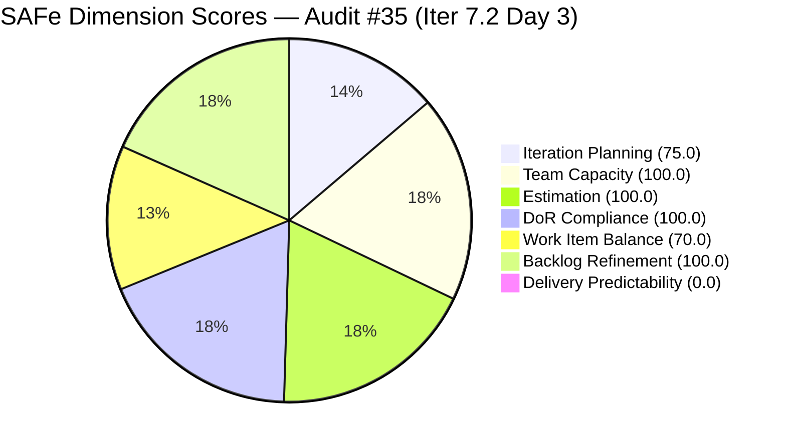
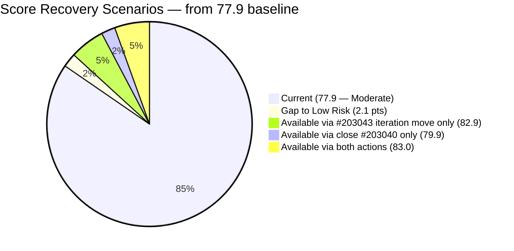

# ADO SAFe Iteration Audit — Finance Team

**Audit #35 | Iteration 7.2 (Apr 20 – May 3, 2026) | Day 3 of 14 (early-sprint)**

---

## 1. Audit Metadata

| Field | Value |
|---|---|
| **Audit Date** | April 22, 2026, 09:00 PHT |
| **Auditor** | Claude Code (ADO SAFe Audit Agent) |
| **Workspace** | `ado_fin` |
| **ADO Project** | Jairosoft FINOPS (`e0bb302f-40f9-46c3-8164-6f1acb317d63`) |
| **Team** | Finance Team (`1f4b45fa-82e8-4a36-aedc-6c1bc8f51070`) |
| **Iteration** | Iteration 7.2 — Apr 20 to May 3, 2026 |
| **Iteration ID** | `a9888bc5-48df-40dd-bcc8-6926a11aa7c7` |
| **Sprint Day** | Day 3 of 14 (early-sprint — Day 1–5 window) |
| **Prior Audit** | AUDIT_20260421_0800.md (Audit #34, 77.9 — Moderate Risk, Iter 7.2 Day 2) |
| **Scoring Model** | ADO SAFe v1 (7-dimension rubric) |
| **Overall Score** | **77.9 / 100** |
| **Risk Band** | **Moderate Risk** (60 – 79.9; 2.1 below Low-Risk threshold) |

---

## 2. Executive Summary

The Finance Team enters Day 3 of Iteration 7.2 with no change in overall posture from yesterday's audit. The **77.9 Moderate Risk** score is identical to Audit #34 (Apr 21) — all seven dimension scores are unchanged. The team's three committed sprint items (#203034, #203038, #203040) remain in pre-work states (2 Ready, 1 New) with zero story points closed, consistent with Day 3 of a 14-day sprint in the early-sprint window.

Two unresolved items from prior audits persist and are now elevated in priority given that Day 3 is Grace's **first working day of the sprint** (Apr 21–22 were configured as days off):

1. **#203043 ("FTC HR for signed APEF", 2 SP)** remains in PI7 root without an iteration assignment for the third consecutive day. This is the sole driver of the Iteration Planning penalty (75.0 vs. 100.0). A 60-second ADO update resolves it.
2. **#201448 eAFS Portal Submission disposition** remains unconfirmed — not visible in the backlog, BIR deadline Apr 15 elapsed, and no closure evidence has been surfaced in three audits. This is a **High-severity compliance risk** that Grace should address today as her first priority.

Grace returns from scheduled days off today. Her effective remaining capacity is 12 working days × 4 h/day = 48 hours against a 7-SP commitment (~28 hours at the team's empirical ~4 h/SP conversion), leaving ~20 hours of headroom. The sprint is fully groomed (100.0 DoR, 100.0 Estimation) and the backlog is pristine (100.0 Backlog Refinement). Recovery to Low Risk (≥80.0) requires only resolving #203043's iteration path or closing the first story point in any sprint item — either action taken today would push the overall to or above 80.

---

## 3. Previous Audit Delta

| Dimension | Audit #34 — Apr 21 (Day 2) | Audit #35 — Apr 22 (Day 3) | Delta |
|---|---|---|---|
| Iteration Planning | 75.0 | 75.0 | 0.0 |
| Team Capacity | 100.0 | 100.0 | 0.0 |
| Estimation | 100.0 | 100.0 | 0.0 |
| DoR Compliance | 100.0 | 100.0 | 0.0 |
| Work Item Balance | 70.0 | 70.0 | 0.0 |
| Backlog Refinement | 100.0 | 100.0 | 0.0 |
| Delivery Predictability | 0.0 | 0.0 | 0.0 |
| **Overall** | **77.9** | **77.9** | **0.0** |

**Key observations since Audit #34 (Apr 21):**

- **No changes detected.** All backlog work items were last changed on Apr 20. No items moved state, gained story points, or had iteration paths updated in the 24-hour period.
- **Grace returns from days off today.** Apr 21–22 were configured as days off in capacity; Apr 22 is her first working day of the sprint. Work progression expected to begin today.
- **#203043 still unscoped.** Remains in PI7 root for the third consecutive day. Escalation priority rises — Grace is now available to action it.
- **#201448 eAFS still unresolved.** Now carries into a third consecutive audit without disposition confirmation. BIR exposure window grows.
- **Sprint Day 3 is the optimal action window.** Closing even the 1-SP Issue (#203040) today would raise Delivery Predictability from 0.0 to 14.3 and the overall from 77.9 to 80.0 (Low Risk threshold).

---

## 4. Current Iteration Snapshot

| Metric | Value |
|---|---|
| **Visible root backlog items (backlog API)** | 4 (3 in Iter 7.2; 1 in PI7 root) |
| **Current iteration root items (Iter 7.2)** | 3 |
| **Committed story points (Iter 7.2)** | 7 SP |
| **Closed story points (Day 3)** | 0 SP |
| **Delivery rate (Day 3)** | 0.0% (early-sprint — Day 1–5) |
| **State distribution (sprint set)** | 2 Ready, 1 New |
| **Sole contributor** | Grace (grace@jairosoft.com) |
| **Team capacity (configured)** | 4 h/day (Documentation 3 h + Requirements 1 h), 2 days off (Apr 21–22) |
| **Effective remaining working days** | 12 of 14 (~48 working hours; Grace returns today) |
| **Sprint Day** | Day 3 of 14 — early-sprint window (Day 1–5) |

### Sprint Item List — Iteration 7.2 Commitment

| ID | Title | Type | State | SP | DoR | Last Changed | Notes |
|---|---|---|---|---|---|---|---|
| 203034 | Encoding payroll for automation – phase2 | User Story | Ready | 3 | PASS | Apr 20 | Dominant type |
| 203038 | Explore market rates in references for Career Mapping | User Story | Ready | 3 | PASS | Apr 20 | Dominant type |
| 203040 | AA Escalation of Payment Settlement | Issue | New | 1 | PASS | Apr 20 | Lowest-effort close candidate |

### Out-of-Sprint Visible Item

| ID | Title | Type | State | SP | IterationPath | Last Changed |
|---|---|---|---|---|---|---|
| 203043 | FTC HR for signed APEF | User Story | New | 2 | Jairosoft FINOPS\\2026-PI7 (root — unscoped) | Apr 20 |

---

## 5. Work Item Analysis

### Sprint Story Point Distribution



### Sprint Work-Item-Type Distribution



### Sprint State Distribution — Day 3



### Backlog Age Profile



### Observations

- **Zero state movement in 24 hours.** All 3 sprint items remain in their Apr 20 states (2 Ready, 1 New). Grace was on scheduled days off Apr 21–22, so this is expected. Day 3 (today) is the first opportunity for active work.
- **Lean sprint well within capacity.** 7 SP at ~4 h/SP ≈ 28 hours of work against 48 available effective hours. Grace has ~20 hours of headroom for reactive work, BIR compliance tasks, or scope expansion.
- **Easiest close target: #203040 (1 SP, Issue, New).** The AA Escalation item has clear, verifiable AC (QuickBooks-level alerts, Karl notification at 15 days, dashboard status update). Closing it today pushes overall score to 80.0 (Low Risk).
- **Theme consistency maintained.** Three items cover FINOPS automation (payroll encoding), career management data (market rates), and payables workflow (escalation). Coherent PI7 theme.
- **#203043 orphan persisting.** Created Apr 20 and assigned to Grace but with no iteration assignment. The PI7 root path means it is visible in the backlog count but not committed to any sprint. This creates planning ambiguity and suppresses Iteration Planning from 100.0 to 75.0.
- **#201448 eAFS not visible.** The PI7.1 close item has been absent from the Finance Team's Stories and Deliverables backlog for three consecutive audits. BIR deadline Apr 15 has elapsed. Disposition must be confirmed with evidence today.

---

## 6. SAFe Compliance Scorecard

| Dimension | Score | Evidence | Notes |
|---|---|---|---|
| Iteration Planning | 75.0 | 3 of 4 visible root items scoped to Iter 7.2 | #203043 in PI7 root without iteration → −25.0; same as Audit #34 |
| Team Capacity | 100.0 | Grace: 4 h/day (Documentation 3 h + Requirements 1 h); 2 days off (Apr 21–22) | 1/1 contributors with capacity configured for sprint |
| Estimation | 100.0 | 3/3 sprint items have SP > 0 (3 + 3 + 1 = 7 SP total) | Full estimation coverage; no unestimated sprint items |
| DoR Compliance | 100.0 | 3/3 items pass Description ≥30 nws chars AND Acceptance Criteria ≥20 nws chars | All three items have structured user-story format + measurable AC |
| Work Item Balance | 70.0 | 2 User Stories + 1 Issue; dominant share = 2/3 = 66.7% > 60% → −30 | No Spike (−0); User Story present (−0); structural penalty on 3-item sprint |
| Backlog Refinement | 100.0 | 4/4 items fresh (all changed Apr 20 ≥ 2026-03-08); 0 stale_90; 0 stale_180; 0 untouched_current | Lean backlog — easiest to maintain in portfolio |
| Delivery Predictability | 0.0 | 0 SP closed / 7 SP committed; Day 3 of 14 | **Early-sprint annotation: Day 3 of 14 — low delivery expected** |
| **Overall** | **77.9** | Average of 7 dimensions | **Moderate Risk** — 2.1 below Low-Risk threshold |

### Score Computation

```
Iteration Planning    = round(3 / 4 × 100, 1)     = 75.0
Team Capacity         = round(1 / 1 × 100, 1)     = 100.0
Estimation            = round(3 / 3 × 100, 1)     = 100.0
DoR Compliance        = round(3 / 3 × 100, 1)     = 100.0

Work Item Balance:
  has_user_story      = True  (items #203034, #203038)     → no −40
  dominant_share      = 2 User Stories / 3 items = 66.7%   → > 60% → −30
  spike_share         = 0 Spikes / 3 items = 0.0%          → no −20
  result              = 100 − 30                            = 70.0

Backlog Refinement:
  fresh (≥ 2026-03-08) = 4/4 = 100%                        → base = 100
  stale_90  (< 2026-01-22) = 0/4 = 0%                      → no −10/−20
  stale_180 (< 2025-10-25) = 0                              → no −20
  untouched_current   = 0/3 = 0%                            → no −10/−20
  result                                                    = 100.0

Delivery Predictability:
  closed_SP / committed_SP = 0 / 7 × 100                   = 0.0
  annotation: Day 3 of 14 — early-sprint (Day 1–5) — low delivery expected

Overall = round((75.0 + 100.0 + 100.0 + 100.0 + 70.0 + 100.0 + 0.0) / 7, 1)
        = round(545.0 / 7, 1)
        = 77.9  → Moderate Risk (2.1 below Low-Risk threshold of 80.0)
```

### Score Breakdown Visualization



> Note: Delivery Predictability rendered as 1 for pie chart visibility; actual score is 0.0 (early-sprint).

---

## 7. Dimension Findings

### 7.1 Iteration Planning — 75.0 (Moderate)

3 of 4 visible root backlog items are assigned to Iteration 7.2. Item #203043 ("FTC HR for signed APEF", 2 SP, User Story, New) remains in the PI7 root path without an iteration assignment for the **third consecutive day**. Grace was on days off Apr 21–22; today (Apr 22) is her first opportunity to action this.

**Path to 100.0:** Move #203043 to an explicit iteration — either 7.2 (raises commitment to 9 SP, still within 48 h capacity) or 7.3/7.4 (deferred). A single ADO field update resolves this deduction immediately.

**Historical context:** The Finance Team held Iteration Planning ≥ 100.0 for every audit in PI7.1. The current 75.0 is a single-item artifact, not a planning regression.

### 7.2 Team Capacity — 100.0 (Low Risk)

Grace is the sole team member with configuration at 4 h/day across two activities:
- Documentation: 3 h/day
- Requirements: 1 h/day

Days off: Apr 21–22 (2 days, both now elapsed — Grace returns today). Effective remaining capacity: 12 working days × 4 h/day = **48 hours**.

Committed work: 7 SP × ~4 h/SP ≈ 28 hours. Headroom: ~20 hours. The team enters the active work phase of the sprint with adequate capacity.

1 contributor with current sprint work / 1 contributor with configured capacity = 100.0.

### 7.3 Estimation — 100.0 (Low Risk)

All three sprint items carry Story Points > 0:
- #203034: 3 SP
- #203038: 3 SP
- #203040: 1 SP

Total committed: 7 SP. Estimation coverage: 3/3 = 100.0%. The 7-SP commit is conservative relative to the PI7.1 demonstrated delivery (12 SP at 85.7%), appropriate given the 2 front-loaded days off.

Issue-type items (#203040) expose Story Points in FINOPS and are counted as point_eligible — the team has consistently estimated Issues throughout PI7.

### 7.4 DoR Compliance — 100.0 (Low Risk)

All three sprint items pass the DoR threshold (Description ≥30 non-whitespace chars AND Acceptance Criteria ≥20 non-whitespace chars):

**#203034 Encoding payroll for automation – phase2:**
- Description: "As a Payroll Administrator, I want the system to automatically flag discrepancies between the encoded rates, deductions, hours and the employee's contract terms…" — structured user-story format, well over 30 nws chars. ✓
- AC: System blocks "Submit" if mandatory fields missing; validation occurs real-time or via Pre-check report. ✓

**#203038 Explore market rates in references for Career Mapping:**
- Description: "As a professional planning my career path, I want to view market reference rates for different roles and seniority levels…" ✓
- AC: 5 detailed bullets (Filterable Data, Visual Benchmarks, Currency Conversion, Source Transparency, Integration). ✓ — strongest AC in sprint.

**#203040 AA Escalation of Payment Settlement:**
- Description: "As a Finance Manager, I want to automatically notify and escalate unpaid invoices to PMs if they remain unpaid for more than 15 days…" ✓
- AC: 3 concrete bullets (Overdue Level 1 at 5 days, Karl notification at 15 days, dashboard status update to "Escalated"). ✓

**#203043 (out-of-sprint):** Has no Description or AC populated (rev 1, created Apr 20). Fails DoR — reinforces the urgency of scoping and grooming before it enters a sprint.

### 7.5 Work Item Balance — 70.0 (Moderate, structural)

Sprint composition: 2 User Stories + 1 Issue. No Spikes.

- User Story present → no −40 penalty
- Dominant type (User Story): 2/3 = 66.7% > 60% → **−30**
- Spike share: 0/3 = 0% → no −20

Result: 100 − 30 = **70.0**

This is a **structural penalty** inherent to any 3-item sprint with a User Story majority. In absolute terms, the sprint is well-balanced between FINOPS automation (payroll), data/analytics (career mapping), and payables workflow (escalation). The rubric's 60% dominant-type threshold triggers at 2/3 regardless of thematic diversity.

**Structural fix:** Adding a single 1-SP Spike (e.g., "Investigate Q2 2026 BIR e-filing calendar and eAFS FRN workflow automation") brings the dominant share to 2/4 = 50% (below 60% threshold) and removes the penalty entirely, raising this dimension to 100.0 and the overall score to 82.9 (Low Risk).

### 7.6 Backlog Refinement — 100.0 (Low Risk)

All 4 visible root backlog items were last changed on April 20, 2026:
- fresh threshold (≥ 2026-03-08): 4/4 = 100% → base score = 100
- stale_90 (changed < 2026-01-22): 0 items → no −10/−20 penalty
- stale_180 (changed < 2025-10-25): 0 items → no −20 penalty
- untouched_current (changed < Apr 20 iteration start): 0 of 3 sprint items → no penalty

The Finance Team's lean 4-item backlog is the most maintainable configuration in the portfolio — easy to keep fully fresh. The team has held 100.0 on Backlog Refinement consistently across PI7.

**Watch:** #203043 (PI7 root) has no Description or AC. If it remains in the backlog past Day 5 without grooming, it risks becoming a refinement liability.

### 7.7 Delivery Predictability — 0.0 (Early-sprint — low delivery expected)

Day 3 of 14. Zero SP closed. The sprint is in the early-sprint window (Day 1–5).

**Early-sprint annotation applied:** No formula adjustment. A 0.0 score at Day 3 of a 14-day sprint is expected behavior — Grace was on scheduled days off for Days 1–2; active work starts today.

**Day 3 opportunity:** If Grace closes #203040 (1 SP, Issue) today:
- Delivery Predictability = round(1/7 × 100, 1) = 14.3
- Overall = round((75.0 + 100.0 + 100.0 + 100.0 + 70.0 + 100.0 + 14.3) / 7, 1) = round(559.3 / 7, 1) = **79.9** (still Moderate Risk, 0.1 below Low threshold)

**Combined action:** If Grace closes #203040 (1 SP) AND moves #203043 to Iter 7.2 (raises commitment to 9 SP, DP = round(1/9 × 100, 1) = 11.1):
- Overall = round((100.0 + 100.0 + 100.0 + 100.0 + 70.0 + 100.0 + 11.1) / 7, 1) = round(581.1 / 7, 1) = **83.0** (Low Risk)

**Historical reference:** The sprint closed at 85.7 DP in PI7.1 (12/14 SP). Today begins the delivery phase.

---

## 8. Risks and Bottlenecks

| # | Risk | Severity | Status | Trend |
|---|---|---|---|---|
| R1 | #201448 eAFS Portal Submission — not in backlog; BIR deadline Apr 15 elapsed; no closure evidence in 3 consecutive audits | **High** | Open | Worsening (day 3 without resolution) |
| R2 | #203043 (FTC HR for APEF, 2 SP) in PI7 root — no iteration assigned; suppressing Iteration Planning by 25 points for 3 days | **Medium** | Open | Persistent — actionable today |
| R3 | Single contributor (Grace) — any unplanned absence halts all sprint progress | **Medium** | Structural | Persistent across PI7 |
| R4 | Work Item Balance structural −30 penalty (no Spike in sprint) — 70.0 is the ceiling without a Spike | **Low** | Structural | Persistent; architectural fix available |
| R5 | Delivery Predictability at 0.0 on Day 3 (early-sprint); Grace returns from 2 days off today — first active work day | **Low** | Expected | Expected to improve from today |
| R6 | #203043 has no Description or AC (rev 1) — fails DoR; not yet sprint-committed but at risk if pulled in ungressed | **Low** | Open | New this audit |
| R7 | #202533 (PI7.1 Annual ITR) FRN documentation not verified | **Low** | Carried | Persistent from PI7.1 |

---

## 9. Prioritized Recommendations

### P0 — Compliance (Day 3, today)

**1. Confirm and document #201448 eAFS Portal Submission disposition — immediate.**
This item was Active with a BIR deadline of Apr 15 at the PI7.1 close. It has been absent from the Finance Team backlog for three consecutive audits. Three possible scenarios require different responses:
- **Scenario A — Filed and closed:** Confirm the ADO item shows State = Closed, ClosedDate set, and a comment or attachment capturing the BIR Transaction Number. If not, add them now for compliance archival.
- **Scenario B — Filing incomplete:** Re-scope to Iteration 7.2 immediately as a compliance-critical item. Escalate to Ramon with a corrective-action plan. Engage BIR to document late-filing status.
- **Scenario C — Moved to a different backlog/team:** Document the transfer in the original item's comments and confirm the receiving team has ownership.

Grace must confirm which scenario applies today. If the answer is not available by end of Day 3, Ramon should be looped in.

### P1 — Sprint Planning (Day 3, today)

**2. Move #203043 (FTC HR for signed APEF, 2 SP) to an explicit iteration.**
Takes ~60 seconds in ADO. Options:
- **Iteration 7.2** (9 SP total — within 48 h remaining capacity): Choose if the APEF signing task should be done this sprint.
- **Iteration 7.3 or 7.4** (deferred): Choose if it is planned work for a future sprint.
- **Groom first** before moving to any sprint: #203043 has no Description or AC (rev 1). If targeting 7.2, add at minimum: a user-story format description and 2+ measurable AC bullets before the next audit.

Resolves the Iteration Planning penalty, raising that dimension from 75.0 to 100.0 (or improving Estimation/DoR if moved in-sprint).

**3. Close #203040 (AA Escalation of Payment Settlement, 1 SP) as an early win.**
This is the lowest-effort sprint item (1 SP, clear AC, Issue type). Verify the QuickBooks configuration and dashboard status logic meet the three AC bullets, then move to Closed. Delivers the first SP of the sprint and begins the Delivery Predictability recovery.

### P2 — Sprint Maturity

**4. Add a 1-SP Spike to Iteration 7.2 to resolve the Work Item Balance penalty.**
Suggested title: "Research Q2 2026 BIR e-filing calendar and eAFS FRN automation opportunities." This converts the dominant User Story share from 66.7% to 50%, removing the −30 Work Item Balance penalty and raising that dimension to 100.0. The Spike also provides structured time for the BIR/eAFS compliance research that is already overdue.

**5. Groom #203043 before sprint entry.**
Before assigning to any iteration, add: (a) a user-story format Description (≥30 nws chars) explaining the APEF signing workflow and who benefits; (b) at least two measurable Acceptance Criteria (≥20 nws chars) covering what "done" looks like. Currently at rev 1 with no description or AC — it would fail DoR if pulled into the sprint as-is.

### P3 — Governance

**6. Establish a regulatory-deadline tagging convention.**
For any work item with a hard regulatory deadline (BIR, SEC, DOLE, SSS), tag `regulatory-deadline:YYYY-MM-DD` and require a closure comment capturing proof-of-submission (Transaction Number, FRN, Reference ID). This would have prevented the #201448 disposition ambiguity across three audits.

**7. Plan next sprint (7.3) with 10–12 SP commit.**
PI7.1 delivered 12 SP at 85.7%. The current 7-SP commit is conservative (appropriate for front-loaded days off). With days-off planning now established, target 10–12 SP for 7.3 at 90% expected delivery.

---

## 10. Evidence Gaps and Limitations

| Gap | Description | Impact |
|---|---|---|
| **#201448 eAFS Portal Submission disposition** | Absent from Finance Team backlog for 3 consecutive audits. ADO work item fetch by ID not performed (backlog API is primary evidence). BIR deadline Apr 15 elapsed with no closure evidence surfaced. Direct confirmation from Grace required. | High — regulatory compliance risk |
| **Early-sprint Delivery Predictability** | Day 3 of 14 inherently yields 0.0 SP closed. The rubric applies an early-sprint annotation (Day 1–5 window) with no formula adjustment. Score accurately reflects actual state, not a measurement failure. | Low — expected behavior |
| **#203043 intent and timeline** | Cannot determine from ADO data whether Grace intends #203043 for PI7.2 (immediate) or a future iteration. Rubric scores it as out-of-sprint (Iteration Planning penalty applies). | Medium — planning ambiguity |
| **#203043 DoR state** | #203043 at rev 1 has no Description or AC. It is not in the current sprint, so it does not affect DoR Compliance scoring today — but it would fail DoR if pulled in without grooming. | Low — future sprint risk |
| **WIB structural penalty on lean sprints** | The fixed −30 dominant-type penalty fires mechanically on any 3-item sprint with a User Story majority, regardless of team maturity or thematic balance. Noted for rubric calibration feedback. Does not distort current relative scoring. | Low — rubric limitation |
| **#202533 PI7.1 Annual ITR FRN verification** | The PI7.1 Annual ITR closure required an FRN per its Acceptance Criteria. Current and prior audits have not re-verified the AC completion on the now-closed item. | Low — compliance archiving gap |
| **Days-off effective capacity verification** | Grace's 4 h/day × 12 remaining working days = 48 h effective capacity. Rubric does not include a capacity-utilization check. The 7-SP commit is appropriate, but no independent verification of actual days-off alignment. | Low — informational |

---

## Appendix: Score Recovery Path



| Action | Dimension Impact | New Overall |
|---|---|---|
| Baseline (no change) | — | 77.9 (Moderate) |
| Move #203043 to Iter 7.2 | IP: 75→100 (+25) | 82.9 (Low Risk) |
| Close #203040 (1 SP) | DP: 0→14.3 (+14.3) | 79.9 (Moderate, −0.1 from Low) |
| Both: move #203043 + close #203040 | IP: 75→100; DP: 0→11.1 | 83.0 (Low Risk) |
| All above + add 1-SP Spike | WIB: 70→100 (+30) | ~96.6 (Low Risk) |

---

*Report generated by Claude Code ADO SAFe Audit Agent | April 22, 2026 09:00 PHT*
*Audit #35 — Finance Team — Iteration 7.2 Day 3 of 14 — Overall: 77.9 / 100 — Moderate Risk*
*Prior audit: AUDIT_20260421_0800.md (Audit #34, 77.9 — Moderate Risk, Day 2)*
