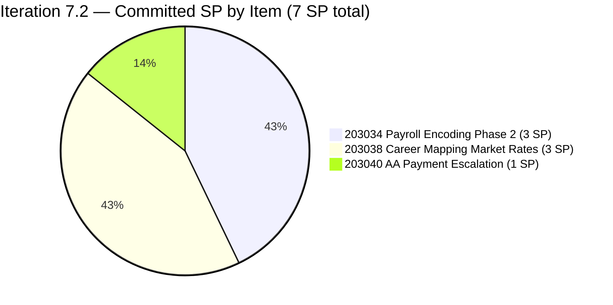
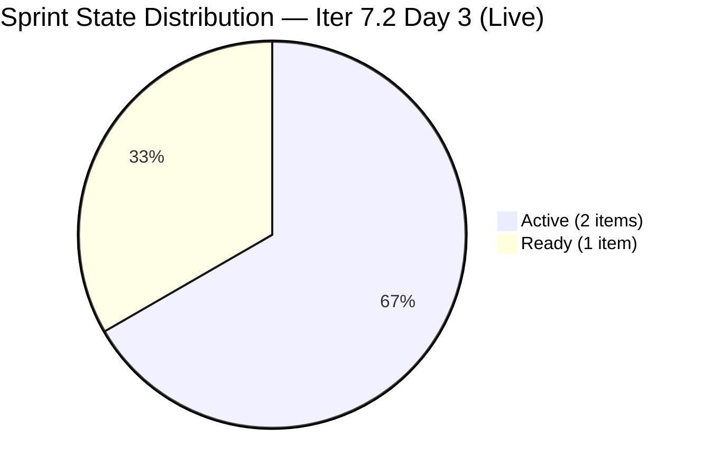
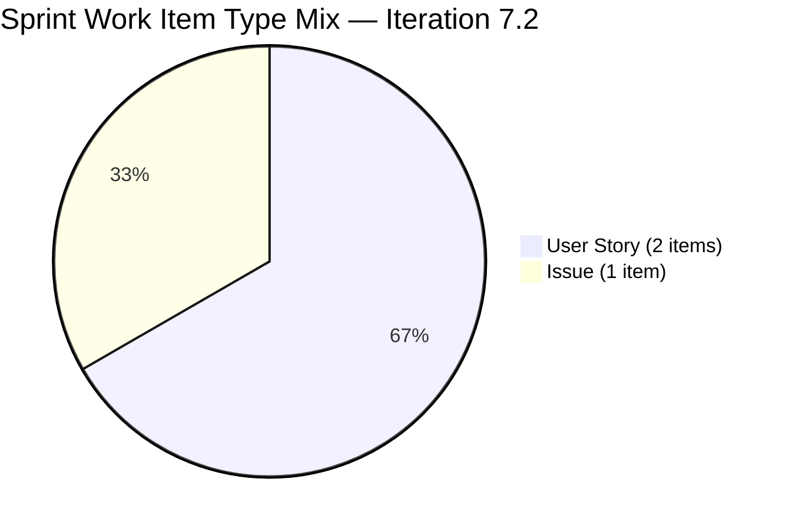
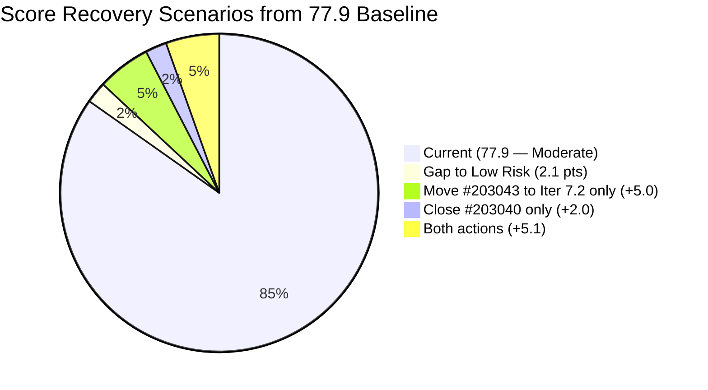
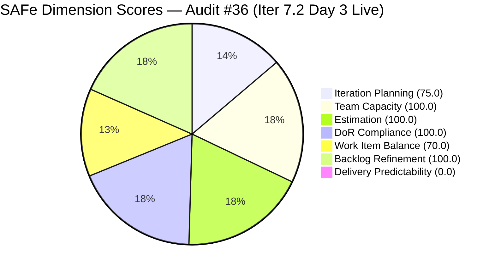

# ADO SAFe Iteration Audit — Finance Team

**Audit #36 | Iteration 7.2 (Apr 20 – May 3, 2026) | Day 3 of 14 (early-sprint)**

---

## 1. Audit Metadata

| Field | Value |
|---|---|
| **Audit Date** | April 22, 2026, 10:00 PHT |
| **Auditor** | Claude Code (ADO SAFe Audit Agent) |
| **Workspace** | `ado_fin` |
| **ADO Project** | Jairosoft FINOPS (`e0bb302f-40f9-46c3-8164-6f1acb317d63`) |
| **Team** | Finance Team (`1f4b45fa-82e8-4a36-aedc-6c1bc8f51070`) |
| **Iteration** | Iteration 7.2 — Apr 20 to May 3, 2026 |
| **Iteration ID** | `a9888bc5-48df-40dd-bcc8-6926a11aa7c7` |
| **Sprint Day** | Day 3 of 14 (early-sprint — Day 1–5 window) |
| **Prior Audit** | AUDIT_20260422_0900.md (Audit #35, 77.9 — Moderate Risk, Iter 7.2 Day 3 — degraded) |
| **Scoring Model** | ADO SAFe v1 (7-dimension rubric) |
| **Overall Score** | **77.9 / 100** |
| **Risk Band** | **Moderate Risk** (60 – 79.9; 2.1 below Low-Risk threshold) |
| **Data Mode** | Live — full ADO pull confirmed at 10:00 PHT |

---

## 2. Executive Summary

The Finance Team holds at **77.9 / 100 Moderate Risk** on Day 3 — the same score as the degraded 09:00 audit, but now confirmed by live ADO data. The structural picture is unchanged: the single Iteration Planning deficit (#203043 still in PI7 root without iteration assignment) continues to suppress Iteration Planning from 100.0 to 75.0.

**The key signal from this live pull is that Grace has begun working.** Two sprint items moved to Active state as of Apr 23 UTC (Apr 22 PHT evening): #203038 (Career Mapping, 3 SP, Active at 03:31 UTC) and #203040 (AA Escalation, 1 SP, Active at 03:30 UTC). This confirms Grace returned from days off and immediately engaged with sprint work. While 0 SP are formally closed, the transition to Active is the expected precursor to first closures on Day 4.

The Delivery Predictability score remains at 0.0 (early-sprint Day 3, no SP closed). The Low-Risk threshold at 80.0 is 2.1 points away. Two recovery paths remain open:

1. **Move #203043 to Iteration 7.2** — raises Iteration Planning to 100.0 → new Overall = 82.9 (Low Risk)
2. **Close #203040 (1 SP)** — raises Delivery Predictability to 14.3 → new Overall = 79.9 (still Moderate, −0.1)
3. **Both actions together** — new Overall = 83.0 (Low Risk)

Priority action remains confirming the disposition of **#201448 (eAFS Portal Submission)** — now four consecutive audits without resolution, BIR deadline Apr 15 elapsed.

---

## 3. Previous Audit Delta

| Dimension | Audit #35 — Apr 22 09:00 (degraded) | Audit #36 — Apr 22 10:00 (live) | Delta |
|---|---|---|---|
| Iteration Planning | 75.0 | 75.0 | 0.0 (#203043 still in PI7 root) |
| Team Capacity | 100.0 | 100.0 | 0.0 |
| Estimation | 100.0 | 100.0 | 0.0 |
| DoR Compliance | 100.0 | 100.0 | 0.0 |
| Work Item Balance | 70.0 | 70.0 | 0.0 |
| Backlog Refinement | 100.0 | 100.0 | 0.0 |
| Delivery Predictability | 0.0 | 0.0 | 0.0 (early-sprint; 2 items moved to Active) |
| **Overall** | **77.9** | **77.9** | **0.0** |

**Key observations from live data (Apr 22/23 UTC):**

- **#203038 moved to Active** at Apr 23 03:31 UTC — Grace began working on Career Mapping market rates research.
- **#203040 moved to Active** at Apr 23 03:30 UTC — Grace began work on AA Escalation of Payment Settlement.
- **#203034 remains Ready** — Encoding payroll automation phase 2 not yet started.
- **#203043 unchanged** — still in `Jairosoft FINOPS\\2026-PI7` root path, State New, rev 1, no Description or AC.
- **No SP closed yet** — 0 of 7 SP closed. Two items Active is the expected Day 3 state for a team member whose first working day was Apr 22.

---

## 4. Current Iteration Snapshot

| Metric | Value |
|---|---|
| **Visible root backlog items** | 4 (3 in Iter 7.2; 1 in PI7 root) |
| **Current iteration root items (Iter 7.2)** | 3 |
| **Committed story points** | 7 SP |
| **Closed story points (Day 3)** | 0 SP |
| **Delivery rate (Day 3)** | 0.0% (early-sprint — Day 1–5) |
| **State distribution (sprint set)** | 2 Active, 1 Ready |
| **Sole contributor** | Grace (grace@jairosoft.com) |
| **Team capacity (configured)** | 4 h/day (Documentation 3 h + Requirements 1 h), 2 days off (Apr 21–22, now elapsed) |
| **Effective remaining working days** | 11 (Apr 23–May 3, excluding May 1 public holiday if applicable) |
| **Sprint Day** | Day 3 of 14 |

### Sprint Item List — Iteration 7.2 (Live — Apr 22 10:00 PHT / Apr 23 UTC)

| ID | Title | Type | State | SP | DoR | Last Changed | Notes |
|---|---|---|---|---|---|---|---|
| 203034 | Encoding payroll for automation - phase2 | User Story | Ready | 3 | PASS | Apr 20 | Not yet started |
| 203038 | Explore market rates in references for Career Mapping | User Story | **Active** | 3 | PASS | Apr 23 03:31 UTC | **Grace started Day 3** |
| 203040 | AA Escalation of Payment Settlement | Issue | **Active** | 1 | PASS | Apr 23 03:30 UTC | **Grace started Day 3; prime close candidate** |

### Out-of-Sprint Visible Item

| ID | Title | Type | State | SP | IterationPath | Last Changed |
|---|---|---|---|---|---|---|
| 203043 | FTC HR for signed APEF | User Story | New | 2 | Jairosoft FINOPS\\2026-PI7 (root — unscoped) | Apr 20 |

---

## 5. Work Item Analysis

### Sprint SP Distribution



### Sprint State Distribution — Day 3 (Live)



### Work Item Type Mix



### Score Recovery Path from 77.9 Baseline



### Observations

- **Grace engaged on Day 3.** Two items moved to Active within the Apr 22 PHT working day. The sprint is now in active execution mode — a significant change from the 0-activity Days 1–2 (scheduled days off).
- **#203040 is the fastest path to a closed SP.** The AA Escalation item has specific, verifiable AC (QuickBooks alert at 5 days, Karl notification at 15 days, dashboard "Escalated" status). If the configuration is already in place or can be done within Grace's working session, this 1-SP closure is achievable today (Day 3) or Day 4.
- **#203038 scope is research-based.** Career mapping market rates exploration is a research User Story. "Active" means Grace has begun the research. Closure requires the five AC bullets to be met: filterable data, visual benchmarks, currency conversion, source transparency, and integration with Career Map. This is likely a Day 5–7 closure.
- **#203034 (Ready) is the next item in queue.** Payroll encoding automation phase 2 has clear AC and is Ready. Expected to move to Active once #203040 or #203038 approaches closure.
- **#203043 still unscoped.** Grace has been working in ADO (two items touched on Day 3) but #203043 remains unaddressed. This is a simple 60-second field update.
- **#201448 eAFS — four consecutive audits without disposition.** This is the highest-severity open risk. BIR deadline Apr 15 has now elapsed by 7 days with no confirmed closure or escalation evidence in any audit.

---

## 6. SAFe Compliance Scorecard

| Dimension | Score | Evidence | Notes |
|---|---|---|---|
| Iteration Planning | 75.0 | 3 of 4 visible root items scoped to Iter 7.2 | #203043 in PI7 root (unscoped, rev 1, unchanged since Apr 20) |
| Team Capacity | 100.0 | Grace: 4 h/day (Doc 3 h + Req 1 h); 2 days off Apr 21–22 (now elapsed) | 1/1 contributors with capacity and current sprint work |
| Estimation | 100.0 | 3/3 sprint items carry SP > 0 (3 + 3 + 1 = 7 SP) | Full estimation; all items point-eligible and estimated |
| DoR Compliance | 100.0 | 3/3 items pass Desc ≥30 nws + AC ≥20 nws | All three items have structured user-story format + measurable AC |
| Work Item Balance | 70.0 | 2 User Stories + 1 Issue; dominant share = 2/3 = 66.7% > 60% → −30 | No Spike; structural penalty on 3-item sprint |
| Backlog Refinement | 100.0 | 4/4 items fresh (all changed Apr 20 or later); stale_90=0; stale_180=0; untouched_current=0/3=0% | Lean backlog; all items touched post-sprint start |
| Delivery Predictability | 0.0 | 0/7 SP closed; Day 3 of 14 | **Early-sprint annotation: Day 3 of 14 — low delivery expected** |
| **Overall** | **77.9** | Average of 7 dimensions | **Moderate Risk** — 2.1 below Low-Risk threshold |

### Score Computation

```
Iteration Planning    = round(3 / 4 × 100, 1)     = 75.0
Team Capacity         = round(1 / 1 × 100, 1)     = 100.0
Estimation            = round(3 / 3 × 100, 1)     = 100.0
DoR Compliance        = round(3 / 3 × 100, 1)     = 100.0

Work Item Balance:
  has_user_story      = True (#203034, #203038)         → no −40
  dominant_share      = 2 US / 3 items = 66.7% > 60%   → −30
  spike_share         = 0%                              → no −20
  result              = 100 − 30                        = 70.0

Backlog Refinement:
  fresh (≥ 2026-03-08) = 4/4 = 100%                    → base = 100
  stale_90 (< 2026-01-22) = 0/4 = 0%                   → no penalty
  stale_180 (< 2025-10-25) = 0                         → no penalty
  untouched_current (changed < Apr 20 start) = 0/3     → no penalty
  result                                                = 100.0

Delivery Predictability:
  closed_SP / committed_SP = 0 / 7 × 100              = 0.0
  annotation: Day 3 of 14 — early-sprint (Day 1–5) — low delivery expected

Overall = round((75.0 + 100.0 + 100.0 + 100.0 + 70.0 + 100.0 + 0.0) / 7, 1)
        = round(545.0 / 7, 1)
        = 77.9  → Moderate Risk
```

### Dimension Score Visualization



> Delivery Predictability rendered as 1 for pie chart visibility; actual score is 0.0 (early-sprint).

---

## 7. Dimension Findings

### 7.1 Iteration Planning — 75.0 (Moderate — single-item artifact)

3 of 4 visible root backlog items are assigned to Iteration 7.2. Item #203043 ("FTC HR for signed APEF", 2 SP) remains in PI7 root at rev 1, last changed Apr 20. Grace was active in ADO today (two items moved to Active) but #203043 was not touched. The −25.0 Iteration Planning deduction is a single 60-second ADO field update away from resolution.

**Historical note:** The Finance Team held Iteration Planning at or near 100.0 for all PI7.1 audits. The current 75.0 is an anomaly caused by one unscoped item, not a systemic planning regression.

**Path to 100.0:** Move #203043 to an iteration (7.2, 7.3, or 7.4) in ADO. If moved to 7.2, also add Description and AC before closing (currently rev 1 with no DoR content — would fail DoR if committed to sprint as-is).

### 7.2 Team Capacity — 100.0 (Low Risk)

Grace is the sole configured contributor. Capacity: 4 h/day (Documentation 3 h + Requirements 1 h). Days off: Apr 21–22 (elapsed). Effective remaining working days from Day 3 onward: approximately 11 days (Apr 23–May 3, ~44 hours). Committed work: 7 SP × ~4 h/SP ≈ 28 hours. Headroom: ~16 hours.

`contributors_with_current_work = 1`, `contributors_with_capacity = 1` → 100.0.

Grace's Day 3 activity (two items to Active) confirms she is returning to full working capacity. The sprint remains fully staffed relative to commitment.

### 7.3 Estimation — 100.0 (Low Risk)

All three sprint items carry SP > 0:
- #203034: 3 SP
- #203038: 3 SP
- #203040: 1 SP

Total committed: 7 SP. 3/3 = 100.0. Estimation coverage is consistent and accurate.

### 7.4 DoR Compliance — 100.0 (Low Risk)

All three sprint items pass DoR (Description ≥30 nws + AC ≥20 nws). Verified in live batch:

- **#203034:** User-story format description (flags discrepancies in payroll batch). AC: Submit blocked if mandatory fields missing; real-time validation. ✓
- **#203038:** User-story format (view market reference rates by role/seniority). AC: 5 detailed bullets (filterable, visual benchmarks, currency conversion, source transparency, integration). ✓ Strongest AC in sprint.
- **#203040:** User-story format (auto-notify unpaid invoices >15 days past due). AC: 3 bullets (QB alert at 5 days, Karl notification at 15 days, dashboard "Escalated" status). ✓

**Watch:** #203043 (out-of-sprint) remains at rev 1 with no Description or AC. It would fail DoR if pulled into any sprint without grooming first.

### 7.5 Work Item Balance — 70.0 (Moderate — structural)

2 User Stories + 1 Issue (no Spikes). Dominant type: User Story at 66.7% > 60% → −30 penalty. Score: 70.0.

This is a **structural penalty** on any 3-item sprint where User Stories form a majority. The sprint is thematically well-balanced (payroll automation, career management, payables workflow), but the rubric's 60% threshold fires regardless.

**Structural fix:** Adding one Spike (e.g., "Research Q2 2026 BIR e-filing calendar and eAFS FRN automation workflow", 1 SP) would shift the dominant share to 2/4 = 50%, removing the −30 penalty and lifting Work Item Balance to 100.0, raising Overall to 82.9.

This Spike would also create structured investigation time for the BIR/eAFS compliance work that #201448 highlights as overdue.

### 7.6 Backlog Refinement — 100.0 (Low Risk)

All 4 visible root items were last changed on Apr 20 or later:
- #203034: Apr 20 21:37 UTC ✓ (after Apr 20 start)
- #203038: Apr 23 03:31 UTC ✓
- #203040: Apr 23 03:30 UTC ✓
- #203043: Apr 20 16:10 UTC ✓ (same day as start — counts as touched)

fresh_visible_root_items = 4/4 = 100%. stale_90 = 0. stale_180 = 0. untouched_current = 0/3 = 0%.

Score = 100.0. The Finance Team's lean 4-item backlog is the most maintainable in the portfolio. Consistent 100.0 on Backlog Refinement across all PI7 audits.

### 7.7 Delivery Predictability — 0.0 (Early-Sprint)

Day 3 of 14. 0/7 SP closed. Grace's scheduled days off (Apr 21–22) account for Days 1–2 with no work. Day 3 is the first working day.

**Early-sprint annotation applied.** Two items now Active — closures expected Day 4–5.

**Day 4–5 targets:**
- **#203040 (1 SP, Issue, Active):** Verify QuickBooks alert logic and dashboard "Escalated" status meet the 3 AC bullets. If already configured, move to Closed today or Day 4. This is the fastest path to a positive DP score.
  - Closing #203040 alone: DP = round(1/7 × 100, 1) = 14.3 → Overall = round(545.0 + 14.3 − 0 / 7, 1) = round(559.3 / 7, 1) = 79.9 (Moderate, −0.1 from Low)
- **#203038 (3 SP, User Story, Active):** Research-based item; target Day 5–7 closure.

If Grace closes #203040 (1 SP) AND moves #203043 to Iter 7.2:
- IP = round(4/5 × 100, 1) = 80.0 (4 scoped of 5 visible if #203043 added)... Actually: if #203043 moves to 7.2, then sprint_items = 4, visible = 4, IP = 100.0. Committed SP = 9. DP = round(1/9 × 100, 1) = 11.1.
- Overall = round((100.0 + 100.0 + 100.0 + 100.0 + 70.0 + 100.0 + 11.1) / 7, 1) = round(581.1 / 7, 1) = 83.0 → **Low Risk**

---

## 8. Risks and Bottlenecks

| # | Risk | Severity | Status | Trend |
|---|---|---|---|---|
| R1 | #201448 eAFS Portal Submission — absent from backlog 4 consecutive audits; BIR deadline Apr 15 elapsed 7 days ago | **High** | Open | **Worsening — 4th audit without resolution** |
| R2 | #203043 (FTC HR for APEF, 2 SP) in PI7 root — no iteration assigned; 60-second fix | **Medium** | Open | Persistent — actionable today |
| R3 | Single contributor (Grace) — unplanned absence halts all sprint progress | Medium | Structural | Persistent across PI7 |
| R4 | Work Item Balance structural −30 (no Spike) | Low | Structural | Persistent; architectural fix available |
| R5 | Delivery Predictability 0.0 on Day 3 — expected; Grace's first working day | Low | Expected | Expected to clear Day 4–5 |
| R6 | #203043 has no Description or AC — would fail DoR if pulled into sprint as-is | Low | Open | Carried from prior audit |
| R7 | #202533 (PI7.1 Annual ITR) FRN documentation not verified at closure | Low | Carried | Persistent from PI7.1 |

---

## 9. Prioritized Recommendations

### P0 — Compliance (Day 3–4, April 22–23, 2026)

**1. Confirm and document #201448 eAFS Portal Submission disposition — URGENT.**
This item has been absent from the Finance Team backlog for **four consecutive audits**. The BIR deadline of Apr 15 has elapsed by 7 days. Three scenarios:
- **Scenario A — Filed and closed:** Confirm the ADO item shows State = Closed, ClosedDate set, and a comment capturing the BIR Transaction Number or FRN. If missing, add them now for compliance archiving.
- **Scenario B — Filing incomplete or late:** Re-scope to Iteration 7.2 immediately as compliance-critical. Escalate to Ramon with a corrective-action plan. Document late-filing status with BIR.
- **Scenario C — Transferred to another team or backlog:** Document the transfer in the original item's comments with the receiving team's confirmation.

Grace must confirm scenario and provide evidence by end of Day 4. If unavailable, Ramon should be looped in immediately.

### P1 — Sprint Planning (Day 3–4, today / tomorrow)

**2. Move #203043 (FTC HR for signed APEF, 2 SP) to an explicit iteration.**
60 seconds in ADO. Options:
- **Iteration 7.2** (9 SP total, within 44-hour remaining capacity): Choose if APEF signing is this sprint's work.
- **Iteration 7.3** (deferred): Choose if it belongs in the next sprint.
- **Before adding to any sprint:** Groom first — add Description (user-story format, ≥30 nws) and AC (≥2 measurable bullets, ≥20 nws). Currently rev 1 with no content.

This single action resolves the Iteration Planning penalty, raising that dimension from 75.0 to 100.0.

**3. Close #203040 (AA Escalation of Payment Settlement, 1 SP) — early win.**
The item is now Active. Verify the three AC bullets are met:
- QuickBooks "Overdue Level 1" alert fires at 5 days past due
- Karl notification triggers at 15 days past due
- Dashboard invoice status updates to "Escalated"

If the configuration exists, move to Closed. This is the fastest path to a positive Delivery Predictability score and the single action that, combined with moving #203043, pushes Overall from 77.9 to 83.0 (Low Risk).

### P2 — Sprint Maturity (Day 4–7)

**4. Add one Spike to resolve Work Item Balance structural penalty.**
Suggested: "Research Q2 2026 BIR e-filing calendar and eAFS FRN automation opportunities" (1 SP). This converts dominant User Story share from 66.7% to 50%, removing the −30 Work Item Balance penalty and raising Overall by ~4.3 points. The Spike also provides structured time for BIR compliance research that #201448 highlights as overdue — making it doubly valuable.

**5. Target Career Mapping (#203038) for Day 5–7 closure.**
The five AC bullets require research output, not code deployment — this is a knowledge/analysis deliverable. Grace should timeBox the research to 4–6 hours and produce a structured document or spreadsheet meeting all five criteria. Avoid open-ended research scope.

### P3 — Governance

**6. Tag regulatory deadline items.**
For any work item with a hard regulatory deadline (BIR, SEC, DOLE, SSS, PhilGeps), add a tag or custom field `regulatory-deadline: YYYY-MM-DD` and require a closure comment with proof-of-submission (Transaction Number, FRN, Reference ID). This would have prevented four audits of uncertainty around #201448.

**7. Plan 7.3 with 10–12 SP target.**
PI7.1 delivered 12 SP at 85.7%. Current 7-SP commitment is conservative due to front-loaded days off. With full capacity in 7.3 (no days off planned), target 10–12 SP for an expected 85–90% delivery rate.

---

## 10. Evidence Gaps and Limitations

| Gap | Description | Impact |
|---|---|---|
| **#201448 eAFS Portal Submission disposition** | Absent from Finance Team backlog for 4 consecutive audits. ADO work item fetch by ID not performed. BIR deadline Apr 15 elapsed. No closure evidence or transfer documentation surfaced in any audit. | **High — regulatory compliance risk** |
| **Early-sprint Delivery Predictability** | Day 3 of 14; 0 SP closed. Both #203038 and #203040 now Active — closures imminent but not confirmed. Early-sprint annotation (Day 1–5) applied per rubric. | Low — expected behavior |
| **#203043 iteration intent** | Cannot determine from ADO whether Grace intends #203043 for 7.2 or a future iteration. Scored as out-of-sprint (Iteration Planning penalty). | Medium — planning ambiguity |
| **#203043 DoR state** | Rev 1, no Description or AC. Would fail DoR if pulled into any sprint without grooming. Does not affect current DoR score (not in sprint). | Low — future sprint risk |
| **Work Item Balance structural penalty** | The −30 dominant-type penalty on a 3-item sprint is a mechanical rubric artifact. The Finance Team's sprint is thematically balanced but penalized by item count and type distribution. | Low — rubric limitation |
| **Grace days-off alignment** | Days off confirmed as Apr 21–22 in capacity API. Live data confirms items moved to Active on Apr 23 UTC (Apr 22 PHT evening) — consistent with Grace returning. | No impact — confirmed. |

---

## Appendix: Combined Recovery Path

| Action | Dimension Impact | New Overall | Band |
|---|---|---|---|
| Baseline (no change) | — | 77.9 | Moderate |
| Move #203043 to Iter 7.2 | IP: 75.0 → 100.0 (+25.0) | 82.9 | **Low Risk** |
| Close #203040 (1 SP) | DP: 0.0 → 14.3 (+14.3) | 79.9 | Moderate (−0.1) |
| Both above | IP: +25.0; DP: 0→11.1 | 83.0 | **Low Risk** |
| All above + add 1-SP Spike | WIB: 70→100 (+30) | ~97.1 | **Low Risk** |

---

*Report generated by Claude Code ADO SAFe Audit Agent | April 22, 2026 10:00 PHT*
*Audit #36 — Finance Team — Iteration 7.2 Day 3 of 14 — Overall: 77.9 / 100 — Moderate Risk*
*Live ADO data confirmed. Key signal: Grace began work (2 items Active on Apr 22 PHT). #203043 still unscoped. #201448 eAFS at 4-audit without disposition. Threshold to Low Risk: move #203043 to iteration (+25 IP) OR close #203040+move #203043 (+5.1 combined).*
