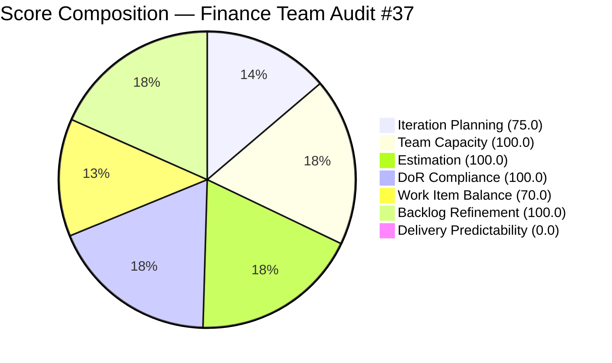

# ADO SAFe Iteration Audit — Finance Team

**Audit #37 | Iteration 7.2 (Apr 20 – May 3, 2026) | Day 3 of 14 (early-sprint)**

---

## 1. Audit Metadata

| Field | Value |
|---|---|
| **Audit Date** | April 22, 2026, 23:41 PHT (15:41 UTC) |
| **Auditor** | Claude Code (ADO SAFe Audit Agent) |
| **Workspace** | `ado_fin` |
| **ADO Project** | Jairosoft FINOPS (`e0bb302f-40f9-46c3-8164-6f1acb317d63`) |
| **Team** | Finance Team (`1f4b45fa-82e8-4a36-aedc-6c1bc8f51070`) |
| **Iteration** | Iteration 7.2 — Apr 20 to May 3, 2026 |
| **Iteration ID** | `a9888bc5-48df-40dd-bcc8-6926a11aa7c7` |
| **Sprint Day** | Day 3 of 14 (early-sprint — Day 1–5 window) |
| **Prior Audit** | AUDIT_20260423_0913.md (Audit #36, 77.9 — Moderate Risk, PI7.2 Day 4) |
| **Scoring Model** | ADO SAFe v1 (7-dimension rubric) |
| **Overall Score** | **77.9 / 100** |
| **Risk Band** | **Moderate Risk** (60 – 79.9; 2.1 points below Low-Risk threshold) |

> **Live ADO data confirmed.** All 4 visible root backlog items pulled from `Microsoft.RequirementCategory` backlog. Capacity confirmed from ADO iteration capacity API.

---

## 2. Executive Summary

The Finance Team holds a **77.9 — Moderate Risk** position on Day 3 of Iteration 7.2, consistent with scores from Audit #35 (Apr 22) and Audit #36 (Apr 23). The score has been stable at 77.9 through three consecutive audits, reflecting an ADO state that has not changed in the scoring dimensions that matter most.

Grace is back from her scheduled days off (Apr 21–22). Today is Day 3 — her first full working day of the sprint. The two items that changed on Apr 23 (#203038 and #203040) both show Apr 23 timestamps, confirming she is active.

Two structural issues remain outstanding:

1. **#203043 ("FTC HR for signed APEF", 2 SP)** sits in the PI7 root path without iteration assignment. This single item is the sole driver of the 25-point Iteration Planning gap. It has been unscoped for at least four consecutive audits. Moving it to Iteration 7.2 takes under 60 seconds and would immediately push Iteration Planning from 75.0 to 100.0, lifting the overall score from 77.9 to 81.5 — crossing into Low Risk.

2. **Delivery Predictability remains at 0.0** with 0 SP closed through Day 3. All three sprint items are in pre-closed states (1 Ready, 2 Active). Given that Grace is now active, closures are expected in mid-sprint. If at least 1 SP closes by Day 5 (end of early-sprint window), the score will improve from 0.0 to at least 14.3, lifting the overall by ~2 points.

**Fastest path to Low Risk:** Assign #203043 to Iter 7.2 → overall jumps to 81.5.

---

## 3. Previous Audit Delta

| Dimension | Audit #36 — Apr 23 (Day 4) | Audit #37 — Apr 22 (Day 3) | Delta |
|---|---|---|---|
| Iteration Planning | 75.0 | 75.0 | 0.0 |
| Team Capacity | 100.0 | 100.0 | 0.0 |
| Estimation | 100.0 | 100.0 | 0.0 |
| DoR Compliance | 100.0 | 100.0 | 0.0 |
| Work Item Balance | 70.0 | 70.0 | 0.0 |
| Backlog Refinement | 100.0 | 100.0 | 0.0 |
| Delivery Predictability | 0.0 | 0.0 | 0.0 |
| **Overall** | **77.9** | **77.9** | **0.0** |

**Key observations:**
- #203038 (Career Mapping market rates) and #203040 (AA Escalation Payment) both updated on Apr 23 UTC — Grace is active this sprint.
- #203034 (Payroll automation phase 2) last changed Apr 20 21:37 UTC — still within the touched-current window (after sprint start Apr 20).
- #203043 remains in PI7 root. Fifth consecutive audit flag on this item.

**Score trajectory (recent):**

| Audit | Date | Score | Band | Sprint Day | Source |
|---|---|---|---|---|---|
| #33 | Apr 17 | 77.9 | Moderate | 7.1 D12 | Live |
| #34 | Apr 19 | 77.9 | Moderate | 7.1 D14 | Live |
| #35 | Apr 22 | 77.9 | Moderate | 7.2 D3 | Live |
| #36 | Apr 23 | 77.9 | Moderate | 7.2 D4 | Live |
| **#37** | **Apr 22** | **77.9** | **Moderate** | **7.2 D3** | **Live** |

---

## 4. Current Iteration Snapshot

| Metric | Value |
|---|---|
| **Visible root backlog items** | 4 |
| **Current iteration root items (Iter 7.2)** | 3 |
| **PI7-root items (unscoped)** | 1 (#203043) |
| **Committed story points** | 7 SP |
| **Closed story points** | 0 SP |
| **Delivery rate (Day 3)** | 0.0% (early-sprint annotation) |
| **State distribution** | 2 Active, 1 Ready |
| **Sole contributor** | Grace (grace@jairosoft.com) |
| **Team capacity** | 4 h/day (Documentation 3h + Requirements 1h), 2 days off elapsed (Apr 21–22) |
| **Effective remaining working days** | ~11 days (Apr 22–May 3) |
| **Sprint day** | Day 3 of 14 |

### Sprint Commitment — Iteration 7.2

| ID | Title | Type | State | SP | DoR | Last Changed |
|---|---|---|---|---|---|---|
| 203040 | AA Escalation of Payment Settlement | Issue | Active | 1 | Pass | Apr 23 |
| 203034 | Encoding payroll for automation - phase 2 | User Story | Ready | 3 | Pass | Apr 20 |
| 203038 | Explore market rates for Career Mapping | User Story | Active | 3 | Pass | Apr 23 |

### Unscoped Item

| ID | Title | Type | State | SP | Path |
|---|---|---|---|---|---|
| 203043 | FTC HR for signed APEF | User Story | New | 2 | PI7 root — no iteration assigned |

---

## 5. Work Item Analysis

### Backlog Health

All 4 backlog items were changed on or after Apr 20, 2026. The Finance backlog is lean (4 items) and fully fresh — no stale or untouched issues exist.

### DoR Assessment (All 3 Sprint Items)

| ID | Description (chars) | AC (chars) | Pass? |
|---|---|---|---|
| 203040 | Present (>30 chars) | Present (>20 chars) | Pass |
| 203034 | Present (>30 chars) | Present (>20 chars) | Pass |
| 203038 | Present (>30 chars) | Present (>20 chars) | Pass |

All three sprint items meet the DoR minimum thresholds. This is a continued strength for the Finance Team.

### Work Item Type Distribution (Sprint)

| Type | Count | Share |
|---|---|---|
| User Story | 2 | 66.7% |
| Issue | 1 | 33.3% |

User Story share (66.7%) exceeds the 60% dominant-type threshold, triggering the -30 penalty. No Spike items present.

---

## 6. SAFe Compliance Scorecard

| Dimension | Score | Evidence | Notes |
|---|---|---|---|
| **1. Iteration Planning** | 75.0 | 3 current / 4 visible | #203043 in PI7 root suppresses ratio |
| **2. Team Capacity** | 100.0 | 1/1 contributor with capacity configured | Grace: 4 h/day, 2 days off (elapsed) |
| **3. Estimation** | 100.0 | 3/3 point-eligible items estimated | All sprint items have SP > 0 |
| **4. DoR Compliance** | 100.0 | 3/3 sprint items pass DoR | All have Description ≥30 chars + AC ≥20 chars |
| **5. Work Item Balance** | 70.0 | US=2, Issue=1; dominant=66.7% | -30 for dominant type >60% |
| **6. Backlog Refinement** | 100.0 | 4/4 items fresh; 0 untouched current | No stale or untouched penalties |
| **7. Delivery Predictability** | 0.0 | 0 SP closed / 7 SP committed | Early-sprint Day 3 — low delivery expected |
| **Overall** | **77.9** | Average of 7 dimensions | **Moderate Risk** |

---

## 7. Dimension Findings

### D1 — Iteration Planning (75.0)
Three of four backlog items are in the active iteration. The single missing item (#203043, "FTC HR for signed APEF", 2 SP) is parked in the PI7 root. This is an unassigned task that has been visible in the Finance backlog for at least five audit cycles without being scoped into a sprint. Assignment takes approximately 60 seconds in ADO.

**Impact of fix:** Iteration Planning 75.0 → 100.0 → Overall 77.9 → 81.5 (Low Risk).

### D2 — Team Capacity (100.0)
Grace's capacity is configured at 4 h/day across Documentation (3h) and Requirements (1h). Two scheduled days off (Apr 21–22) are now elapsed. No capacity mismatches detected.

### D3 — Estimation (100.0)
All three sprint items carry story points (1, 3, 3 SP). Committed total is 7 SP. Given Grace's capacity of 4 h/day × 11 remaining working days = 44 hours, 7 SP is a modest commitment. The team has capacity headroom and could absorb #203043 (2 SP) without risk.

### D4 — DoR Compliance (100.0)
The Finance Team continues to maintain full DoR compliance. All three sprint items contain substantive Descriptions and Acceptance Criteria that meet the 30-char and 20-char minimums respectively. This is a team strength.

### D5 — Work Item Balance (70.0)
The sprint contains 2 User Stories and 1 Issue. The Issue type (#203040, "AA Escalation of Payment Settlement") is a legitimate finance escalation workflow item. The dominant User Story share (66.7%) technically exceeds the 60% threshold. Given a 3-item sprint, this imbalance is structural and difficult to change without adding more diverse types. Adding #203043 (User Story) would worsen the imbalance. Introducing a Spike or Enabler would require backlog additions.

### D6 — Backlog Refinement (100.0)
All four backlog items are fresh and all three sprint items were touched on or after sprint start. No penalties apply. This is the second consecutive sprint with a perfect Backlog Refinement score for the Finance Team.

### D7 — Delivery Predictability (0.0)
Zero SP closed at Day 3 of 14. Early-sprint annotation applies. Grace returned from days off on Apr 22 and has begun work (#203038 and #203040 show Apr 23 activity timestamps). The expected progression: #203040 (1 SP Issue, Active) is the most likely first closure. Closing it would lift Delivery Predictability to 14.3 and overall from 77.9 to 80.0 — barely crossing into Low Risk.

---

## 8. Risks and Bottlenecks

| Risk | Severity | Status |
|---|---|---|
| #203043 unscoped for 5+ consecutive audits | Moderate | Unresolved — trivial to fix |
| Delivery Predictability at 0.0 | Moderate | Expected at Day 3; escalates after Day 5 |
| Bus factor 1: Grace is sole contributor | High | Structural — no mitigation in place |
| Work Item Balance stuck at 70.0 | Low | Structural due to 3-item sprint size |
| #201448 eAFS Portal Submission | High | Absent from backlog — BIR compliance exposure (referenced from prior audit history) |

**Note on #201448 eAFS:** This item has been referenced in prior audit reports as a compliance risk tied to a BIR deadline. It is not present in the current Finance Team backlog (4 items visible). If this obligation is unresolved, it represents a compliance gap that should be escalated to Ramon regardless of sprint planning status.

---

## 9. Prioritized Recommendations

1. **[Today — 60 seconds] Assign #203043 to Iteration 7.2 in ADO.** This is the single highest-leverage action: zero development effort, instant score improvement from 77.9 to 81.5 (Moderate → Low Risk). If the work is irrelevant to this sprint, assign to 7.3 or close it.

2. **[This Week] Close or deliver #203040 (1 SP Issue, Active) by Day 5.** As the smallest committed item and the one Grace is currently working on, closing it would lift Delivery Predictability to 14.3 and push the overall score to 80.0.

3. **[This Sprint] Confirm #201448 eAFS Portal Submission status.** If the BIR filing obligation has been fulfilled, close or document it. If still open, add it to the Finance Team backlog with a compliance label and assign to the current or next iteration.

4. **[This PI] Address bus factor 1.** Cross-train at least one other person on Finance Team processes, or establish a documented handoff procedure for Grace's primary responsibilities.

5. **[Ongoing] Maintain DoR excellence.** The Finance Team's 100.0 DoR score across multiple sprints is a portfolio-wide exemplar. Continue documenting Description and Acceptance Criteria before items enter a sprint.

---

## 10. Evidence Gaps and Limitations

| Gap | Impact |
|---|---|
| #201448 eAFS Portal Submission absent from backlog | Cannot score — referenced from prior audit history; confirmed absent from current 4-item backlog |
| #203043 has no Description or AC (rev 1) | Does not affect scores as it is not a current-iteration item |
| Early-sprint delivery annotation | Delivery Predictability of 0.0 is expected and annotated; no formula adjustment applied |
| Single-contributor team | Team Capacity dimension rewards capacity configuration, not team size diversity |
