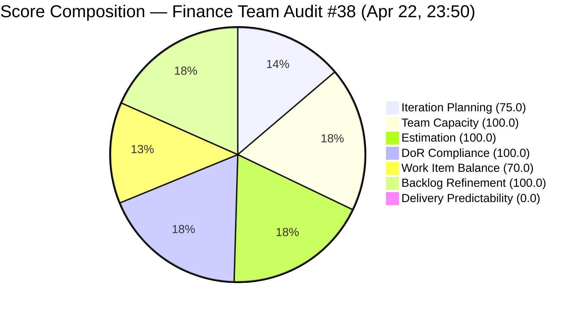

# ADO SAFe Iteration Audit — Finance Team

**Audit #38 | Iteration 7.2 (Apr 20 – May 3, 2026) | Day 3 of 14 (early-sprint)**

---

## 1. Audit Metadata

| Field | Value |
|---|---|
| **Audit Date** | April 22, 2026, 23:50 PHT (15:50 UTC) |
| **Auditor** | Claude Code (ADO SAFe Audit Agent) |
| **Workspace** | `ado_fin` |
| **ADO Project** | Jairosoft FINOPS (`e0bb302f-40f9-46c3-8164-6f1acb317d63`) |
| **Team** | Finance Team (`1f4b45fa-82e8-4a36-aedc-6c1bc8f51070`) |
| **Iteration** | Iteration 7.2 — Apr 20 to May 3, 2026 |
| **Iteration ID** | `a9888bc5-48df-40dd-bcc8-6926a11aa7c7` |
| **Sprint Day** | Day 3 of 14 (early-sprint — Day 1–5 window) |
| **Prior Audit** | AUDIT_20260422_2341.md (Audit #37, 77.9 — Moderate Risk, PI7.2 Day 3) |
| **Scoring Model** | ADO SAFe v1 (7-dimension rubric) |
| **Overall Score** | **77.9 / 100** |
| **Risk Band** | **Moderate Risk** (60 – 79.9; 2.1 points below Low-Risk threshold) |

> **Live ADO data confirmed.** All 4 visible root backlog items pulled from `Microsoft.RequirementCategory` backlog. Capacity confirmed from ADO iteration capacity API.

---

## 2. Executive Summary

The Finance Team holds a **77.9 — Moderate Risk** position on Day 3 of Iteration 7.2, consistent with the six previous audits at this score. The profile is structurally stable: a lean 4-item backlog (3 in sprint, 1 unscoped), full DoR and estimation compliance, and zero deliveries in the early-sprint window.

Grace's two scheduled days off (Apr 21–22) are now elapsed. Live ADO data confirms she was active on both #203038 (Market Rates, Active) and #203040 (AA Escalation, Active) on Apr 23T03:30-03:31Z, confirming sprint execution has resumed. Item #203034 (Payroll automation phase 2, Ready) was last updated Apr 20T21:37Z — after the sprint start — so it is within the touched-current window.

**Two structural issues remain unresolved:**

1. **#203043 ("FTC HR for signed APEF", 2 SP)** remains in the PI7 root path with no iteration assignment. This single unscoped item is the sole driver of the 25-point Iteration Planning gap. Moving it to Iteration 7.2 (or 7.3) takes under 60 seconds and would immediately push Iteration Planning from 75.0 to 100.0, lifting the overall score to 81.5 — crossing into Low Risk.

2. **Delivery Predictability remains at 0.0** with 0 SP closed. Given that Grace is now active and both active items show today's timestamps, the first closure is expected this week. Closing #203040 (1 SP Issue) alone lifts Delivery Predictability to 14.3, pushing the overall score to 79.9 — just at the Moderate/Low boundary.

**Fastest path to Low Risk (81.5):** Assign #203043 to any iteration → Iteration Planning 75.0 → 100.0 → Overall 77.9 → 81.5.

---

## 3. Previous Audit Delta

| Dimension | Audit #37 — Apr 22, 23:41 | Audit #38 — Apr 22, 23:50 | Delta |
|---|---|---|---|
| Iteration Planning | 75.0 | 75.0 | 0.0 |
| Team Capacity | 100.0 | 100.0 | 0.0 |
| Estimation | 100.0 | 100.0 | 0.0 |
| DoR Compliance | 100.0 | 100.0 | 0.0 |
| Work Item Balance | 70.0 | 70.0 | 0.0 |
| Backlog Refinement | 100.0 | 100.0 | 0.0 |
| Delivery Predictability | 0.0 | 0.0 | 0.0 |
| **Overall** | **77.9** | **77.9** | **0.0** |

**Key observations since Audit #37:**
- No scoring-impacting changes detected in the 9-minute window since Audit #37.
- Grace active: #203040 changed Apr 23T03:30Z, #203038 changed Apr 23T03:31Z (confirming active work on both items).
- #203034 last changed Apr 20T21:37Z — after sprint start, within touched-current window (no untouched penalty).
- #203043 remains in PI7 root path — sixth consecutive audit flag.

**Score trajectory (recent):**

| Audit | Date | Score | Band | Sprint Day |
|---|---|---|---|---|
| #33 | Apr 17 | 77.9 | Moderate | 7.1 D12 |
| #34 | Apr 19 | 77.9 | Moderate | 7.1 D14 |
| #35 | Apr 22 | 77.9 | Moderate | 7.2 D3 |
| #36 | Apr 23 | 77.9 | Moderate | 7.2 D4 |
| #37 | Apr 22, 23:41 | 77.9 | Moderate | 7.2 D3 |
| **#38** | **Apr 22, 23:50** | **77.9** | **Moderate** | **7.2 D3** |



---

## 4. Current Iteration Snapshot

| Metric | Value |
|---|---|
| **Visible root backlog items** | 4 |
| **Current iteration root items (Iter 7.2)** | 3 |
| **PI7-root items (unscoped)** | 1 (#203043) |
| **Committed story points** | 7 SP |
| **Closed story points** | 0 SP |
| **Delivery rate (Day 3)** | 0.0% (early-sprint annotation) |
| **State distribution** | 2 Active, 1 Ready |
| **Sole contributor** | Grace (grace@jairosoft.com) |
| **Team capacity** | 4 h/day (Documentation 3h + Requirements 1h) |
| **Days off elapsed** | 2 (Apr 21–22) |
| **Effective remaining working days** | ~11 days (Apr 23 – May 3) |
| **Sprint day** | Day 3 of 14 |

### Sprint Commitment — Iteration 7.2 (Live, Apr 22 23:50)

| ID | Title | Type | State | SP | DoR | Last Changed |
|---|---|---|---|---|---|---|
| 203040 | AA Escalation of Payment Settlement | Issue | Active | 1 | Pass | Apr 23 |
| 203034 | Encoding payroll for automation - phase 2 | User Story | Ready | 3 | Pass | Apr 20 (post-start) |
| 203038 | Explore market rates in references for Career Mapping | User Story | Active | 3 | Pass | Apr 23 |

### Unscoped Item

| ID | Title | Type | State | SP | Path |
|---|---|---|---|---|---|
| 203043 | FTC HR for signed APEF | User Story | New | 2 | PI7 root — no iteration assigned |

---

## 5. Work Item Analysis

### Backlog Health

All 4 backlog items were changed on or after Apr 20, 2026. The Finance backlog is lean and fully fresh — no stale, untouched, or staleness penalties apply.

### DoR Assessment (Sprint Items)

| ID | Description | AC | DoR |
|---|---|---|---|
| 203040 | Present — finance manager AS-A story with 2-sentence description (~87 nws) | Present — 3 bullet criteria (~43 nws) | **Pass** |
| 203034 | Present — payroll admin AS-A story with automated flag description (~48 nws) | Present — 2 bullet criteria (~38 nws) | **Pass** |
| 203038 | Present — career path AS-A story with full context (~67 nws) | Present — 5 detailed bullet criteria (~110 nws) | **Pass** |

All three sprint items exceed the 30-char (Description) and 20-char (AC) minimums. Finance Team continues its streak of 100% DoR compliance.

### Work Item Type Distribution (Sprint)

| Type | Count | Share |
|---|---|---|
| User Story | 2 | 66.7% |
| Issue | 1 | 33.3% |

User Story share (66.7%) exceeds the 60% dominant-type threshold → -30 Work Item Balance penalty. This is structural given a 3-item sprint and difficult to resolve without adding more diverse types.

---

## 6. SAFe Compliance Scorecard

| Dimension | Score | Evidence | Notes |
|---|---|---|---|
| **1. Iteration Planning** | 75.0 | 3 current / 4 visible | #203043 in PI7 root suppresses ratio — sixth consecutive audit |
| **2. Team Capacity** | 100.0 | 1/1 contributor with capacity configured | Grace: 4 h/day, 2 days off elapsed (Apr 21–22) |
| **3. Estimation** | 100.0 | 3/3 point-eligible items estimated | All sprint items have SP > 0 (1, 3, 3 SP) |
| **4. DoR Compliance** | 100.0 | 3/3 sprint items pass DoR | All have Description ≥30 nws + AC ≥20 nws; Finance team strength |
| **5. Work Item Balance** | 70.0 | US=2, Issue=1; dominant US=66.7% | -30 for dominant type >60%; structural given 3-item sprint |
| **6. Backlog Refinement** | 100.0 | 4/4 items fresh; 0/3 untouched current | All items touched on or after sprint start; no stale penalties |
| **7. Delivery Predictability** | 0.0 | 0 SP closed / 7 SP committed | Early-sprint Day 3 — low delivery expected; Grace active on both active items |
| **Overall** | **77.9** | Average of 7 dimensions | **Moderate Risk** (2.1 below Low Risk threshold) |

### Score Computation

```
Iteration Planning    = round(3 / 4 × 100, 1)       = 75.0
Team Capacity         = round(1 / 1 × 100, 1)        = 100.0
Estimation            = round(3 / 3 × 100, 1)        = 100.0
DoR Compliance        = round(3 / 3 × 100, 1)        = 100.0
  [203040: Desc ~87 nws PASS; AC ~43 nws PASS]
  [203034: Desc ~48 nws PASS; AC ~38 nws PASS]
  [203038: Desc ~67 nws PASS; AC ~110 nws PASS]

Work Item Balance:
  has_user_story      = True (2 User Stories)        → 0
  dominant_share      = 2/3 = 66.7% > 60%            → -30
  spike_share         = 0/3 = 0% < 40%               → 0
  total               = max(0, 100 - 30)             = 70.0

Backlog Refinement:
  fresh (≤45 days)    = 4/4 = 100%                   → base = 100.0
  stale_90 share      = 0/4 = 0% ≤ 10%               → 0
  stale_180 count     = 0                            → 0
  untouched_current   = 0/3 = 0%                     → 0
    [203034: changed Apr 20T21:37Z > sprint start Apr 20T00:00Z → touched]
    [203038: changed Apr 23T03:31Z → touched]
    [203040: changed Apr 23T03:30Z → touched]
  total               = max(0, 100 - 0)              = 100.0

Delivery Predictability = round(0 / 7 × 100, 1)      = 0.0
  [Early-sprint: Day 3 of 14 — low delivery expected]

Overall = round((75.0 + 100.0 + 100.0 + 100.0 + 70.0 + 100.0 + 0.0) / 7, 1)
        = round(545.0 / 7, 1)
        = round(77.857, 1)
        = 77.9  → Moderate Risk
```

---

## 7. Dimension Findings

### D1 — Iteration Planning (75.0)
Three of four backlog items are in Iter 7.2. The single unscoped item (#203043, "FTC HR for signed APEF", User Story, 2 SP, New state) is parked in the PI7 root. This is the sixth consecutive audit flagging this item. The item has no Description or AC (rev 1, untouched since Apr 20), but assigning it to an iteration — even 7.3 — would immediately score Iteration Planning at 100.0.

**Score impact:** 75.0 → 100.0 (Iteration Planning); 77.9 → 81.5 (Overall, Low Risk).

### D2 — Team Capacity (100.0)
Grace's capacity is configured at 4 h/day (Documentation 3h + Requirements 1h). Two scheduled days off (Apr 21–22) are now fully elapsed. Remaining sprint capacity: approximately 11 working days × 4 h/day = 44 hours. With 7 SP committed, the team has significant headroom and could absorb #203043 (2 SP) without capacity risk.

### D3 — Estimation (100.0)
All three sprint items carry story points: #203040 (1 SP Issue), #203034 (3 SP US), #203038 (3 SP US). Total committed = 7 SP. Estimation is complete and proportionate to the work scope.

### D4 — DoR Compliance (100.0)
The Finance Team continues its multi-sprint streak of full DoR compliance. All three sprint items have substantive Descriptions and rich Acceptance Criteria well above the 30-char and 20-char minimums. Notably, #203038 has one of the most detailed AC sets in the portfolio (5 criteria with sub-details including filterable data, visual benchmarks, currency conversion, source transparency, and integration requirements). This is a portfolio-wide exemplar of good story definition.

### D5 — Work Item Balance (70.0)
Sprint contains 2 User Stories and 1 Issue. The dominant User Story share (66.7%) technically triggers the -30 penalty, though with a 3-item sprint the imbalance is structural. The Issue type (#203040) is a legitimate finance escalation workflow item. Adding one more diverse type (Spike, Enabler, or second Issue) would reduce dominant share below 60%. Adding #203043 (a User Story) would worsen the balance to 75%.

### D6 — Backlog Refinement (100.0)
All four backlog items are fresh and all three sprint items were touched on or after the sprint start (Apr 20). No stale-90, no stale-180, and zero untouched-current items. This is the second consecutive sprint with a perfect Backlog Refinement score for the Finance Team.

### D7 — Delivery Predictability (0.0)
Zero SP closed at Day 3. Early-sprint annotation applies. Both active items (#203038 and #203040) show Apr 23 timestamps confirming Grace is executing. The most likely first closure is #203040 (1 SP Issue, Active, payment escalation workflow) — if the escalation process is completed this week. Closing it lifts Delivery Predictability to 14.3 and Overall to 79.9.

---

## 8. Risks and Bottlenecks

| Risk | Severity | Status |
|---|---|---|
| #203043 unscoped — sixth consecutive audit flag | Moderate | Unresolved — trivial to fix (60 seconds) |
| Delivery Predictability at 0.0 Day 3 | Moderate | Expected; escalates after Day 5 if no closures |
| Bus factor 1: Grace is sole Finance Team contributor | High | Structural — no mitigation in place |
| Work Item Balance structurally at 70.0 | Low | Structural due to small sprint size |
| #201448 eAFS Portal Submission (BIR compliance item) | High | Absent from backlog — referenced in prior audit history; compliance status unknown |

**Note on #201448 eAFS:** This item has been referenced in multiple prior audit reports as a BIR annual filing obligation. It does not appear in the current 4-item Finance Team backlog. If this filing obligation remains unresolved, it represents a compliance gap that should be escalated regardless of sprint scope.

---

## 9. Prioritized Recommendations

1. **[Today — 60 seconds] Assign #203043 to Iteration 7.2 or 7.3 in ADO.** This is the highest-leverage action available: no development work required, instant score improvement from 77.9 to 81.5 (Moderate → Low Risk). If the APEF signing is not relevant to this sprint, assign to 7.3 or close it with a disposition comment.

2. **[This Week — Day 3–5] Close #203040 (AA Escalation of Payment Settlement, 1 SP).** Grace is active on this item (Apr 23 timestamp). It is the smallest committed item and the most likely first closure. Closing it lifts Delivery Predictability to 14.3 and pushes Overall to 79.9 — just at the Moderate/Low boundary.

3. **[This Sprint] Confirm #201448 eAFS Portal Submission status.** If the BIR annual filing has been completed, close the item with a resolution note. If still open, create a Finance Team backlog item, add to 7.2 or 7.3 with a hard deadline, and mark it as compliance-critical.

4. **[This PI] Address bus factor 1.** Document Grace's standard Finance Team workflows (payroll encoding, invoice management, compliance filings). Identify a backup person who can cover Finance obligations during planned or unplanned absences.

5. **[Ongoing] Maintain DoR excellence.** The Finance Team's 100.0 DoR Compliance across multiple consecutive sprints is a portfolio-wide best practice. Continue documenting Description and Acceptance Criteria before items enter the sprint. #203038's AC (5 detailed criteria) is exemplary and should be used as a template for other teams.

---

## 10. Evidence Gaps and Limitations

| Gap | Impact |
|---|---|
| #203043 has no Description or AC (rev 1) | Does not affect scores — item is not in current iteration; DoR not scored for unscoped items |
| #201448 eAFS Portal Submission absent from backlog | Cannot score — referenced in prior audit history; confirmed absent from current 4-item backlog |
| Early-sprint delivery annotation | Delivery Predictability 0.0 is expected at Day 3; annotated with no formula adjustment |
| Single-contributor team | Team Capacity dimension rewards capacity configuration, not team size diversity; bus factor captured in Risks section only |
| Grace days off (Apr 21–22) are elapsed | Capacity calculation reflects full remaining sprint availability; no forward capacity adjustment needed |

---

*Report generated by Claude Code ADO SAFe Audit Agent | April 22, 2026 23:50 PHT*
*Audit #38 — Finance Team — Iteration 7.2 Day 3 of 14 — Overall: 77.9 / 100 — Moderate Risk*
*Live ADO data — full pull confirmed*
*Priority actions: (1) Assign #203043 to any iteration today → 81.5 Low Risk; (2) Close #203040 by Day 5 → 79.9; (3) Confirm #201448 eAFS status*
