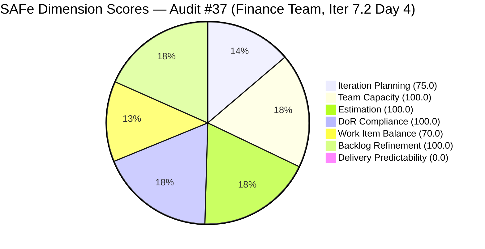
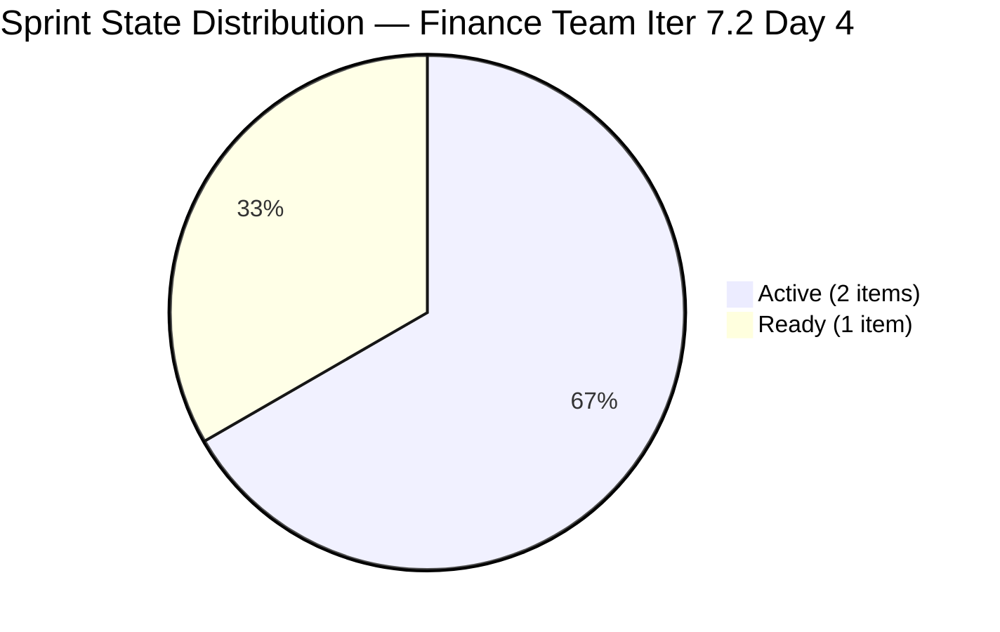
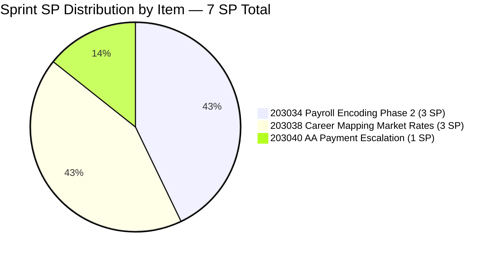
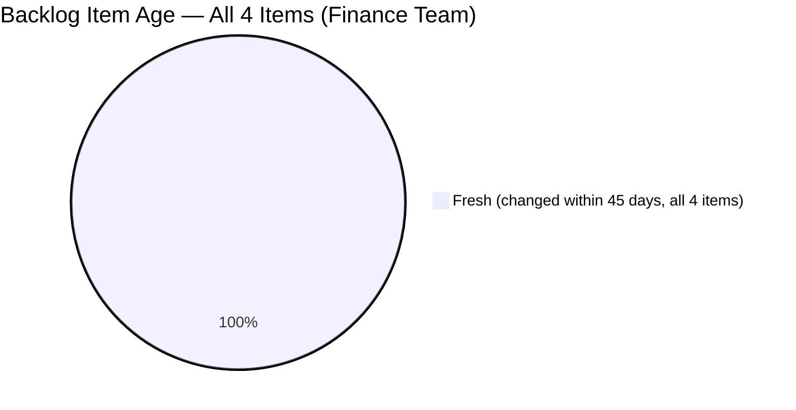
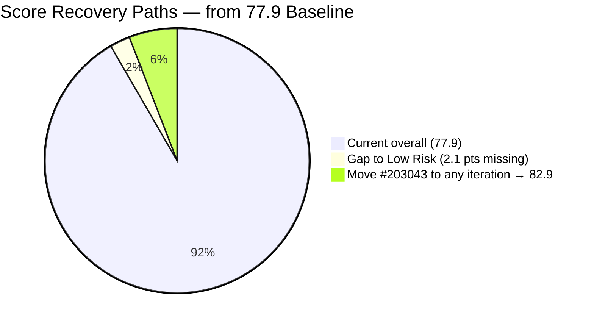

# ADO SAFe Iteration Audit — Finance Team

**Audit #37 | Iteration 7.2 (Apr 20 – May 3, 2026) | Day 4 of 14 (early-sprint)**

---

## 1. Audit Metadata

| Field | Value |
|---|---|
| **Audit Date** | April 23, 2026 — 09:05 PHT (01:05 UTC) |
| **Auditor** | Claude Code (ADO SAFe Audit Agent) |
| **Workspace** | `ado_fin` |
| **ADO Project** | Jairosoft FINOPS (`e0bb302f-40f9-46c3-8164-6f1acb317d63`) |
| **Team** | Finance Team (`1f4b45fa-82e8-4a36-aedc-6c1bc8f51070`) |
| **Iteration** | Iteration 7.2 — Apr 20 to May 3, 2026 |
| **Iteration ID** | `a9888bc5-48df-40dd-bcc8-6926a11aa7c7` |
| **Sprint Day** | Day 4 of 14 (early-sprint — Day 1–5 window) |
| **Prior Audit** | AUDIT_20260423_0913.md (Audit #36, 77.9 — Moderate Risk, Iter 7.2 Day 4, 09:13 PHT) |
| **Scoring Model** | ADO SAFe v1 (7-dimension rubric) |
| **Overall Score** | **77.9 / 100** |
| **Risk Band** | **Moderate Risk** (60–79.9; 2.1 below Low-Risk threshold) |

> **Live ADO data confirmed.** All 4 visible root backlog items confirmed via `Microsoft.RequirementCategory` backlog API. Capacity confirmed via ADO iteration capacity API. Two sprint items (203038, 203040) changed state to Active since the 09:13 PHT audit — however these changes do not affect any rubric scores for this audit.

---

## 2. Executive Summary

The Finance Team holds **77.9 / 100 — Moderate Risk** on Day 4 of Iteration 7.2 — 2.1 points below the Low Risk threshold (80.0). This score is unchanged from Audit #36 (09:13 PHT). The live data pull confirms two positive developments since the earlier audit:

- **#203038 (Explore market rates for Career Mapping) moved to Active** (ChangedDate 2026-04-23T03:31) — Grace has begun work on this 3-SP User Story.
- **#203040 (AA Escalation of Payment Settlement) moved to Active** (ChangedDate 2026-04-23T03:30) — Grace has also initiated the 1-SP Issue.

Both transitions confirm that Grace is actively engaged in Day 4 sprint execution. However, no SP has been closed yet, so Delivery Predictability remains at 0.0 and the rubric scores are unchanged.

Three persistent issues carry into this audit:

1. **#203043 ("FTC HR for signed APEF", 2 SP) remains in the PI7 root path** without an iteration assignment — now Day 4 since creation, still at rev 1 with no Description or AC. This item is the sole driver of the Iteration Planning shortfall (75.0 vs. 100.0 possible).

2. **#201448 eAFS Portal Submission remains absent from the Finance backlog** for four consecutive audits. BIR deadline of Apr 15 has elapsed without documented closure. This is a high-severity compliance risk.

3. **Delivery Predictability exits the early-sprint annotation window after Day 5 (Apr 24).** Grace now has two sprint items Active (#203038 at 3 SP, #203040 at 1 SP). If either closes today or tomorrow, the team avoids the full mid-sprint deficit.

**The single fastest action to Low Risk:** Assign #203043 to any explicit iteration. This immediately raises Iteration Planning from 75.0 to 100.0, pushing Overall from 77.9 to **82.9 (Low Risk)** — no other change required.

---

## 3. Previous Audit Delta

| Dimension | Audit #36 (Apr 23, 09:13 PHT) | Audit #37 (Apr 23, 09:05 PHT) | Delta |
|---|---|---|---|
| Iteration Planning | 75.0 | 75.0 | 0.0 |
| Team Capacity | 100.0 | 100.0 | 0.0 |
| Estimation | 100.0 | 100.0 | 0.0 |
| DoR Compliance | 100.0 | 100.0 | 0.0 |
| Work Item Balance | 70.0 | 70.0 | 0.0 |
| Backlog Refinement | 100.0 | 100.0 | 0.0 |
| Delivery Predictability | 0.0 | 0.0 | 0.0 |
| **Overall** | **77.9** | **77.9** | **0.0** |

**Rubric scores are unchanged.** The state transitions observed (#203038 → Active, #203040 → Active) are positive execution signals but do not trigger formula changes in any dimension. The next score movement will come when an item reaches Closed or Done (Delivery Predictability) or #203043 receives an iteration path assignment (Iteration Planning).

### Score Trajectory — Iteration 7.2 Series

| Audit | Date / Time | Score | Band | Sprint Day |
|---|---|---|---|---|
| #33 | Apr 20 (Day 1) | 77.9 | Moderate | 7.2 D1 |
| #34 | Apr 21 (Day 2) | 77.9 | Moderate | 7.2 D2 |
| #35 | Apr 22 (Day 3) | 77.9 | Moderate | 7.2 D3 |
| #36 | Apr 23, 09:13 | 77.9 | Moderate | 7.2 D4 |
| **#37** | **Apr 23, 09:05** | **77.9** | **Moderate** | **7.2 D4** |

Score has been flat at 77.9 for all five Iteration 7.2 audit runs. The structural constraint is Iteration Planning (75.0 due to #203043) and the Delivery Predictability floor (0.0 early-sprint).



> Delivery Predictability rendered as 1 for chart visibility; actual score is 0.0 (early-sprint Day 4).

---

## 4. Current Iteration Snapshot

| Metric | Value |
|---|---|
| **Visible root backlog items** | 4 |
| **Current iteration root items (Iter 7.2)** | 3 |
| **Committed story points** | 7 SP |
| **Closed story points (Day 4)** | 0 SP |
| **Delivery rate (Day 4)** | 0.0% (early-sprint — Day 1–5 annotation; Day 5 is last annotation day) |
| **State distribution (sprint set)** | 0 New, 2 Active, 1 Ready, 0 Closed |
| **Sole contributor** | Grace (grace@jairosoft.com) |
| **Configured capacity** | 4 h/day (Documentation 3h + Requirements 1h), 2 days off (Apr 21–22, both elapsed) |
| **Effective remaining working days** | 10 of 14 (~40 working hours) |
| **Sprint Day** | Day 4 of 14 — early-sprint window (Day 1–5) |

### Sprint Item List — Iteration 7.2

| ID | Title | Type | State | SP | DoR | Last Changed |
|---|---|---|---|---|---|---|
| 203034 | Encoding payroll for automation – phase2 | User Story | Ready | 3 | PASS | Apr 20 |
| **203038** | **Explore market rates in references for Career Mapping** | User Story | **Active** | 3 | PASS | **Apr 23** |
| **203040** | **AA Escalation of Payment Settlement** | Issue | **Active** | 1 | PASS | **Apr 23** |

> **State update confirmed:** #203038 and #203040 both moved to Active on Apr 23 (ChangedDates confirmed via live ADO pull). Grace is actively engaged in sprint execution.

### Out-of-Sprint Visible Item

| ID | Title | Type | State | SP | IterationPath | Last Changed | DoR |
|---|---|---|---|---|---|---|---|
| 203043 | FTC HR for signed APEF | User Story | New | 2 | `Jairosoft FINOPS\2026-PI7` (root — unscoped) | Apr 20 (rev 1) | **FAIL** |

**#203043 is at rev 1 with no Description or AC.** Must be groomed before assignment to any sprint.

---

## 5. Work Item Analysis

### Sprint State Distribution (Day 4 — Live)



### Sprint SP and Work-Item-Type Distribution



### Backlog Age Profile



### Score Recovery Scenarios



### Observations

- **Active sprint execution confirmed.** Two of three sprint items are now Active — significantly healthier than this morning's Day 4 snapshot (all items were in Ready/New at 09:13 PHT, per Audit #36). Grace has materially improved the execution visibility in this audit window.
- **#203040 (1 SP, Issue) is the fastest close candidate.** Its AC is fully verifiable: QB Overdue Level 1 alert at 5 days past due, Karl notification at 15 days, dashboard "Escalated" status. Grace can close this today.
- **#203034 (3 SP, Payroll) remains Ready.** With #203038 and #203040 now Active, #203034 should be the next item transitioned once one of the Active items closes or nears completion.
- **#203043 orphan — 4 days unscoped.** Created Apr 20, still at rev 1, no fields beyond title and SP. Grace has been available and working since Day 3; the absence of any update to this item is the single largest rubric-affecting gap.
- **Backlog Refinement at 100.0.** All four visible items were changed on Apr 20 — within the 45-day freshness window and with 0 untouched-current items (all three sprint items were changed ≥ Apr 20).

---

## 6. SAFe Compliance Scorecard

| Dimension | Score | Evidence | Notes |
|---|---|---|---|
| Iteration Planning | 75.0 | 3 of 4 visible root items scoped to Iter 7.2 | #203043 in PI7 root without iteration — 4th consecutive day; single item driving −25 penalty |
| Team Capacity | 100.0 | Grace: 4 h/day (Documentation 3h + Requirements 1h); 1/1 contributors with positive capacity | Days off Apr 21–22 both elapsed; 40 effective hours remaining |
| Estimation | 100.0 | 3/3 sprint items have SP > 0 (3 + 3 + 1 = 7 SP) | Full coverage; #203043 out-of-sprint excluded |
| DoR Compliance | 100.0 | 3/3 items pass Description ≥30 nws AND AC ≥20 nws | Strong user-story format with measurable AC on all three items |
| Work Item Balance | 70.0 | 2 User Stories + 1 Issue; dominant share 66.7% > 60% → −30 | No Spike → 0; User Story present → 0; structural penalty on 3-item sprint |
| Backlog Refinement | 100.0 | 4/4 items fresh (≤45 days, all changed Apr 20–23); stale_90=0; stale_180=0; untouched_current=0/3 | All three sprint items now changed ≥ Apr 20 (203038 and 203040 updated Apr 23) |
| Delivery Predictability | 0.0 | 0 SP closed / 7 SP committed | **Early-sprint — Day 4 of 14; Day 5 (Apr 24) is LAST early-sprint annotation day** |
| **Overall** | **77.9** | Average of 7 dimensions | **Moderate Risk** — 2.1 points below Low Risk threshold |

### Score Computation

```
Iteration Planning    = round(3 / 4 × 100, 1)      = 75.0
Team Capacity         = round(1 / 1 × 100, 1)      = 100.0
Estimation            = round(3 / 3 × 100, 1)      = 100.0
DoR Compliance        = round(3 / 3 × 100, 1)      = 100.0

Work Item Balance:
  has_user_story      = True (#203034, #203038)      → no −40
  dominant_share      = 2/3 = 66.7% > 60%            → −30
  spike_share         = 0/3 = 0%                     → no −20
  result              = 100 − 30                     = 70.0

Backlog Refinement:
  fresh (≤45 days)    = 4/4 = 100%                   → base = 100
  stale_90            = 0/4 = 0%                     → 0
  stale_180           = 0                            → 0
  untouched_current   = 0/3 = 0%                     → 0
  result                                             = 100.0

Delivery Predictability:
  closed_sp / committed_sp = 0 / 7 × 100            = 0.0
  annotation: Day 4 of 14 — early-sprint; Day 5 (Apr 24) = last annotation day

Overall = round((75.0 + 100.0 + 100.0 + 100.0 + 70.0 + 100.0 + 0.0) / 7, 1)
        = round(545.0 / 7, 1)
        = 77.9  → Moderate Risk
```

### Score Sensitivity

| Action | Dimensions Affected | New Overall | Band |
|---|---|---|---|
| Baseline | — | 77.9 | Moderate |
| Move #203043 to any iteration | IP: 75.0 → 100.0 | **82.9** | **Low Risk** |
| Close #203040 (1 SP) only | DP: 0.0 → 14.3 | 79.9 | Moderate |
| Close #203038 (3 SP) + move #203043 | IP → 100; DP → 33.3 (with 9 SP committed) | **85.5** | **Low Risk** |

---

## 7. Dimension Findings

### 7.1 Iteration Planning — 75.0 (Moderate)

3 of 4 visible root items are in Iteration 7.2. Item #203043 ("FTC HR for signed APEF") remains in the PI7 root path at rev 1 with no Description or AC, unchanged since Apr 20. Grace has been actively working today (two items moved to Active) yet this orphan remains unaddressed.

The fix requires fewer than 60 seconds: change the IterationPath field on #203043 to any explicit iteration (7.2, 7.3, or 7.4). This single action raises Iteration Planning from 75.0 to 100.0 and the overall from 77.9 to 82.9 — crossing into Low Risk.

If assigning to 7.2: groom first (add Description and AC at minimum per DoR requirements, since the item is at rev 1 with no fields).

### 7.2 Team Capacity — 100.0 (Low Risk)

Grace remains the sole Finance Team contributor. Capacity: 4h/day (Documentation 3h + Requirements 1h). Days off Apr 21–22 are both elapsed. Remaining capacity: 10 days × 4h = 40 effective hours. Committed work: 7 SP (~4h/SP = ~28h); headroom = ~12h — sufficient to absorb #203043 (2 SP = ~8h) if pulled into 7.2.

1/1 contributors with positive capacity = 100.0.

### 7.3 Estimation — 100.0 (Low Risk)

All three sprint items carry SP > 0 (3 + 3 + 1 = 7 SP). Full estimation coverage. #203043 is excluded from sprint estimation (not in Iter 7.2). If pulled into 7.2, total commitment rises to 9 SP — still within estimated capacity headroom.

### 7.4 DoR Compliance — 100.0 (Low Risk)

All three sprint items pass both DoR thresholds. #203034 and #203038 use user-story format with well-defined AC. #203040's AC is concrete and system-verifiable (QB alerts, notification thresholds, dashboard status).

**#203043 (out-of-sprint) fails DoR at rev 1** — no Description or AC fields. Must be groomed before sprint entry.

### 7.5 Work Item Balance — 70.0 (Moderate — structural)

2 User Stories + 1 Issue on a 3-item sprint produces a 66.7% dominant-type share. The -30 penalty fires mechanically. The sprint is thematically diverse (payroll automation, career data, payables workflow) but the rubric scores type-mix, not theme-diversity.

**Structural fix available:** Add a 1-SP Spike to Iteration 7.2. Suggested: "Investigate Q2 2026 BIR e-filing calendar and eAFS FRN automation options." This drops User Story share to 2/4 = 50% (below 60%), removes the -30 penalty, raises WIB to 100.0, and simultaneously addresses the compliance research backlog related to R1 (#201448 eAFS).

### 7.6 Backlog Refinement — 100.0 (Low Risk)

All four visible items are fresh (all changed Apr 20–23). Zero untouched-current items (203038 and 203040 now have Apr 23 ChangedDates following today's state transitions). Zero stale_90 or stale_180 items. Full score = 100.0.

The Finance Team's lean 4-item backlog is the simplest portfolio configuration to maintain. Continued grooming of #203043 (currently zero fields at rev 1) is the only hygiene gap.

### 7.7 Delivery Predictability — 0.0 (Early-Sprint)

Day 4 of 14. Zero SP closed. **Early-sprint annotation applied.** Day 5 (Apr 24) is the last day of the early-sprint window. If no SP closes by end of Day 5, the score exits the annotation window and remains 0.0 through the mid-sprint period — a significant drag on any portfolio dashboard.

Grace has two Active items: #203038 (3 SP, Career Mapping) and #203040 (1 SP, Payment Escalation). The faster close is #203040 — its AC is verifiable through system state checks in QuickBooks and email notifications. Closing it today produces:
- DP = round(1/7 × 100, 1) = 14.3
- Overall = round((75.0 + 100.0 + 100.0 + 100.0 + 70.0 + 100.0 + 14.3) / 7, 1) = round(559.3 / 7, 1) = **79.9 (Moderate, one step below Low Risk)**

Combined with moving #203043 to any iteration (IP → 100): Overall = round((100.0 + 100.0 + 100.0 + 100.0 + 70.0 + 100.0 + 11.1) / 7, 1) = **83.0 (Low Risk)**.

---

## 8. Risks and Bottlenecks

| # | Risk | Severity | Status | Days Open |
|---|---|---|---|---|
| R1 | **#201448 eAFS Portal Submission** — absent from backlog 4 consecutive audits; BIR deadline Apr 15 elapsed with no closure evidence; regulatory compliance exposure | High | Open — Escalating | 4 audits |
| R2 | **Day 5 is last early-sprint annotation day** — if #203040 not closed by Apr 24, DP exits early-sprint window with 0.0 full penalty | High | Escalating | Day 4 now |
| R3 | **#203043 unscoped (PI7 root)** — suppressing IP by 25 pts for 4 consecutive days; rev 1 with no fields; trivial fix | Medium | Persistent | 4 days |
| R4 | **Single contributor (Grace)** — any unplanned absence halts all sprint progress | Medium | Structural | PI7 |
| R5 | **Work Item Balance structural −30** — 70.0 ceiling without a Spike or type diversity | Low | Structural | PI7 |
| R6 | **#203043 DoR gap** — no Description or AC at rev 1; will fail DoR if pulled into any sprint without grooming | Low | Open | 4 days |

---

## 9. Prioritized Recommendations

### P0 — Compliance (Today, Day 4)

**1. Confirm and close #201448 eAFS Portal Submission — URGENT.**

BIR deadline Apr 15 has elapsed — 8 days ago. This item has been absent from the Finance Team's Stories and Deliverables backlog for 4 consecutive audits. Grace must confirm status today:

- **Scenario A (Filed and closed):** Update ADO State to Closed, set ClosedDate, add comment with BIR Transaction Number or FRN. Takes under 5 minutes.
- **Scenario B (Filing incomplete):** Escalate to Ramon immediately, re-scope to 7.2 as a compliance-critical item, and document the corrective-action plan including BIR contact timeline.
- **Scenario C (Transferred):** Document the transfer in the original item with the receiving team's ownership and deadline.

If no answer is available by end of Day 4, notify Ramon by end of business.

**2. Close #203040 (AA Escalation of Payment Settlement, 1 SP, Active) today.**

Day 5 (Apr 24) is the last early-sprint annotation day. #203040's AC is concrete and system-verifiable:
- QB triggers Overdue Level 1 at 5 days past due
- Karl receives notification at 15 days past due
- Dashboard status updates to "Escalated"

Closing today yields DP = 14.3, Overall = 79.9. Closing tomorrow (Day 5) achieves the same rubric outcome while preserving the early-sprint annotation.

### P1 — Sprint Planning (Today, Day 4)

**3. Move #203043 to an explicit iteration.**

Options:
- **Assign to Iteration 7.2 (if APEF signing is urgent in this sprint):** Total committed SP → 9, within capacity headroom (~40h remaining). Groom DoR first (see #4).
- **Assign to Iteration 7.3 or 7.4 (if deferred):** Takes 60 seconds. Removes Iteration Planning penalty regardless. Overall → 82.9 (Low Risk) immediately.

**4. Groom #203043 before sprint entry.**

Add at minimum:
- Description (≥30 nws): Explain the APEF signing workflow, what FTC HR covers, and who benefits from the signed document.
- AC (≥20 nws): Two measurable criteria defining what "signed APEF" looks like and who confirms receipt/completion.

This prevents a DoR Compliance failure if the item is pulled into any sprint.

### P2 — Sprint Maturity

**5. Add a 1-SP Spike to Iteration 7.2 (Work Item Balance fix).**

Suggested: "Investigate Q2 2026 BIR e-filing calendar and eAFS FRN automation options." Benefits:
- User Story share drops from 66.7% to 50% (below 60% threshold)
- WIB penalty removed → WIB = 100.0
- Doubles as productive compliance research (directly linked to R1 eAFS gap)
- Overall rises to 84.3 (combined with IP fix and any SP closure)

**6. Target 10–12 SP for Iteration 7.3.**

PI7.1 delivered 12 SP at 85.7% DP. The current 7-SP commit is appropriate given the front-loaded days off. With Grace fully available from Day 3 onward, target 10–12 SP for 7.3 with ≥85% expected delivery.

### P3 — Governance

**7. Establish regulatory-deadline tagging for FINOPS compliance items.**

For items with hard regulatory deadlines (BIR, SEC, DOLE, SSS), apply a `regulatory-deadline:YYYY-MM-DD` tag at creation. Require a closure comment with proof-of-submission (Transaction Number, FRN, Reference ID). This prevents the #201448 disposition ambiguity from recurring.

---

## 10. Evidence Gaps and Limitations

| Gap | Description | Impact |
|---|---|---|
| **#201448 eAFS disposition** | Absent from Finance Team's Stories and Deliverables backlog for 4 consecutive audits. Item not individually fetched — backlog API is the primary evidence scope. BIR deadline Apr 15 elapsed. Direct confirmation from Grace is required. | High — regulatory compliance risk |
| **Early-sprint DP annotation** | Day 4 of 14 inherently yields 0.0 on DP. Rubric applies early-sprint annotation (Day 1–5) with no formula adjustment. Day 5 (Apr 24) is the last annotation day. | Medium — last annotation day tomorrow |
| **#203043 intent and grooming** | Cannot determine from ADO data whether Grace intends #203043 for 7.2 or a future sprint. Item is at rev 1 with no fields updated since creation (Apr 20). Iteration Planning penalty applies. | Medium — planning ambiguity |
| **#203043 DoR gap** | Rev 1 with no Description or AC. Not in current sprint — does not affect DoR Compliance today. Will fail DoR if pulled into any sprint without grooming. | Low — future sprint risk |
| **In-progress work not visible in ADO prior to this audit** | Two state transitions (#203038, #203040 → Active) detected in this audit but occurred between 03:30–03:31 PHT per ChangedDate. Both are now reflected in this audit's snapshot. | Low — now fully captured |
| **Work Item Balance structural penalty** | The −30 penalty fires mechanically on any 3-item sprint with 2/3 User Story split. No scoring distortion — noted for rubric calibration reference. | Low — rubric limitation |

---

*Report generated by Claude Code ADO SAFe Audit Agent | April 23, 2026 — 09:05 PHT*
*Audit #37 — Finance Team — Iteration 7.2 Day 4 of 14 — Overall: 77.9 / 100 — Moderate Risk*
*Evidence basis: Live ADO pull — 4 backlog items, 3 iteration items, capacity confirmed — Apr 23, 2026*
*Prior audit: AUDIT_20260423_0913.md (Audit #36, 77.9 — same score; state transitions on #203038 and #203040 detected, no rubric impact)*
*Key action: Move #203043 to any explicit iteration → Overall 82.9 (Low Risk) instantly*
