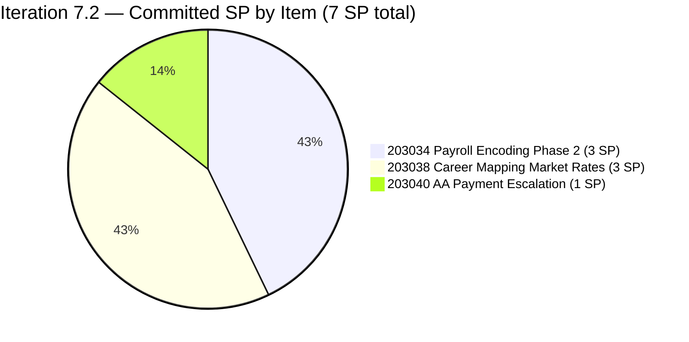
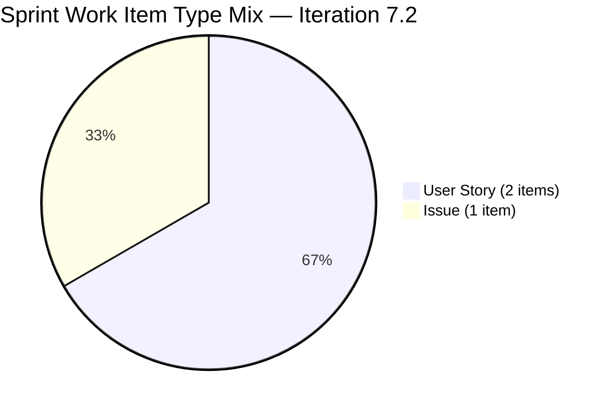
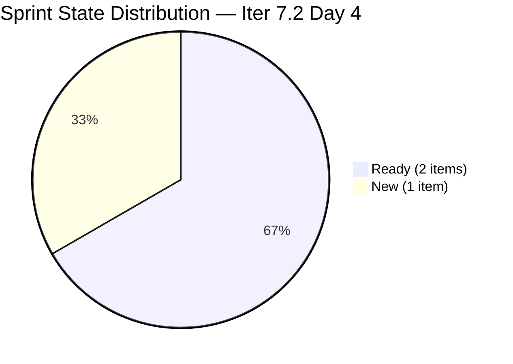
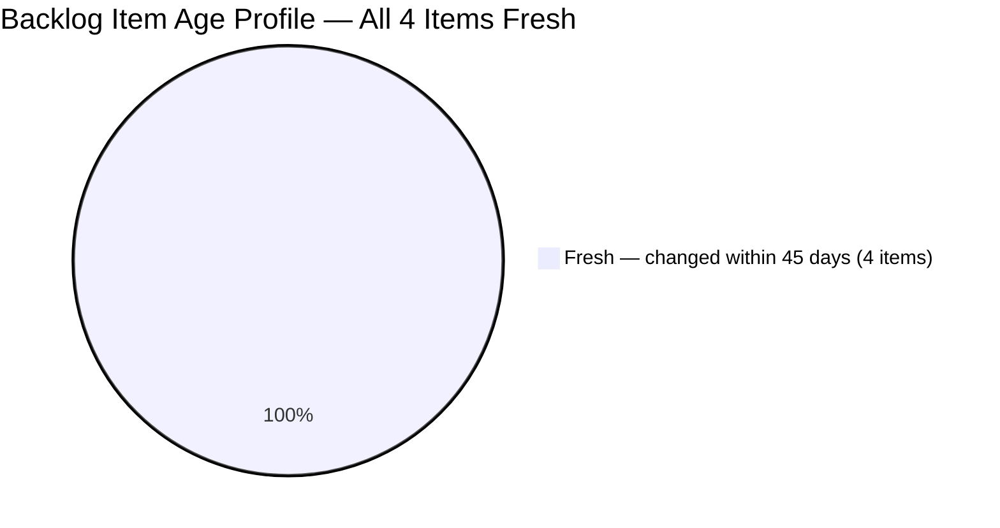
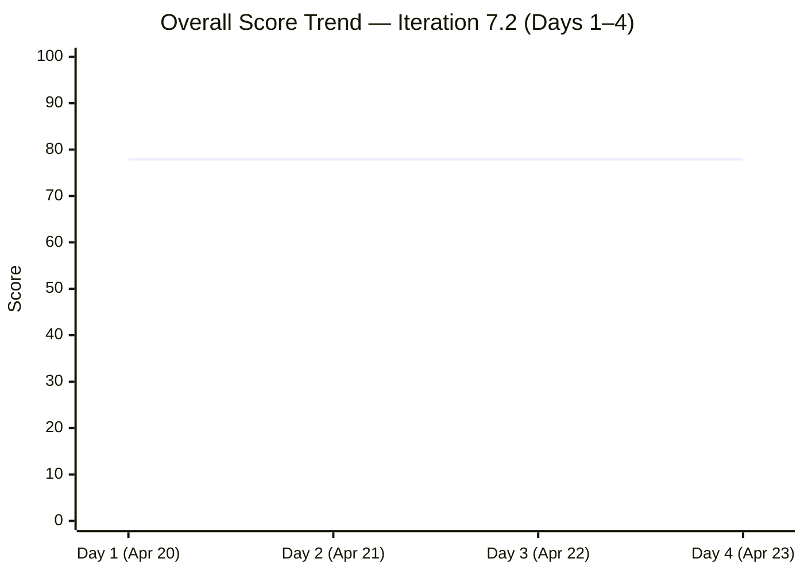
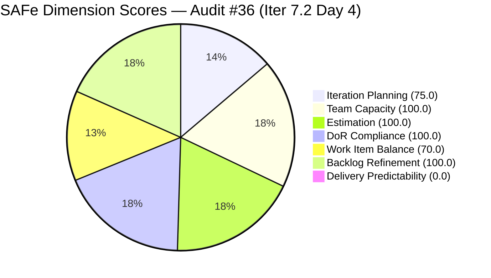
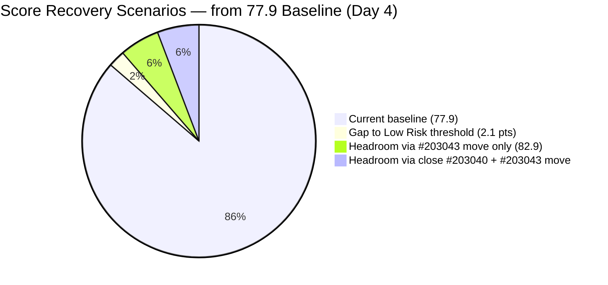

# ADO SAFe Iteration Audit — Finance Team

**Audit #36 | Iteration 7.2 (Apr 20 – May 3, 2026) | Day 4 of 14 (early-sprint)**

---

## 1. Audit Metadata

| Field | Value |
|---|---|
| **Audit Date** | April 23, 2026, 09:13 PHT |
| **Auditor** | Claude Code (ADO SAFe Audit Agent) |
| **Workspace** | `ado_fin` |
| **ADO Project** | Jairosoft FINOPS (`e0bb302f-40f9-46c3-8164-6f1acb317d63`) |
| **Team** | Finance Team (`1f4b45fa-82e8-4a36-aedc-6c1bc8f51070`) |
| **Iteration** | Iteration 7.2 — Apr 20 to May 3, 2026 |
| **Iteration ID** | `a9888bc5-48df-40dd-bcc8-6926a11aa7c7` |
| **Sprint Day** | Day 4 of 14 (early-sprint — Day 1–5 window) |
| **Prior Audit** | AUDIT_20260422_0900.md (Audit #35, 77.9 — Moderate Risk, Iter 7.2 Day 3) |
| **Scoring Model** | ADO SAFe v1 (7-dimension rubric) |
| **Overall Score** | **77.9 / 100** |
| **Risk Band** | **Moderate Risk** (60 – 79.9; 2.1 below Low-Risk threshold) |

---

## 2. Executive Summary

The Finance Team enters Day 4 of Iteration 7.2 with an overall score of **77.9 — Moderate Risk**, unchanged from Audit #35 (Apr 22). All seven dimension scores are identical to yesterday's audit, confirming that no ADO work item changes, state transitions, or field updates occurred in the 24-hour window between Apr 22 and Apr 23.

Grace returned from scheduled days off on Apr 22 (Day 3). This is now Day 4 — her second full working day of the sprint. The absence of any item movement through two consecutive active working days elevates concern. The three sprint items (#203034, #203038, #203040) remain in their original states (2 Ready, 1 New) with zero story points closed.

Three unresolved issues persist from prior audits and are now carrying compounding risk:

1. **#203043 ("FTC HR for signed APEF", 2 SP)** remains in the PI7 root path without an iteration assignment — now for **four consecutive days**. This single item is the sole driver of the 25-point Iteration Planning deduction. Resolution takes under 60 seconds.
2. **#201448 eAFS Portal Submission** — absent from the Finance Team backlog for **four consecutive audits**. BIR deadline of Apr 15 has elapsed. No closure evidence has been surfaced. This is an escalating **High-severity compliance risk**.
3. **Delivery Predictability** remains at 0.0 (0 of 7 SP closed). While Day 4 is still within the early-sprint window (Day 1–5), Grace has now had two active working days with no visible progress in ADO. If no SP closes by Day 5, the sprint enters mid-sprint territory with full penalty exposure.

Recovery to Low Risk (≥80.0) requires resolving #203043's iteration path OR closing any story point. Both actions together push the overall to ≥83.0.

---

## 3. Previous Audit Delta

| Dimension | Audit #35 — Apr 22 (Day 3) | Audit #36 — Apr 23 (Day 4) | Delta |
|---|---|---|---|
| Iteration Planning | 75.0 | 75.0 | 0.0 |
| Team Capacity | 100.0 | 100.0 | 0.0 |
| Estimation | 100.0 | 100.0 | 0.0 |
| DoR Compliance | 100.0 | 100.0 | 0.0 |
| Work Item Balance | 70.0 | 70.0 | 0.0 |
| Backlog Refinement | 100.0 | 100.0 | 0.0 |
| Delivery Predictability | 0.0 | 0.0 | 0.0 |
| **Overall** | **77.9** | **77.9** | **0.0** |

**Key observations since Audit #35 (Apr 22):**

- **No ADO changes detected for the second consecutive active working day.** All 4 backlog items retain their Apr 20 `ChangedDate`. Grace was available (Apr 22 was her return day), yet no items moved state, gained SP closure, or had their iteration paths updated.
- **Escalation milestone reached:** Day 4 is the last day of the early-sprint window before Day 5. If #203040 (1 SP, Issue) is not closed by end of Day 5, Delivery Predictability exits the early-sprint annotation period and the 0.0 score becomes a full mid-sprint deficit.
- **#203043 day count:** Now 4 consecutive days unscoped in the PI7 root. Every day without action represents a planning signal visible in the portfolio dashboard.
- **#201448 eAFS:** Four consecutive audits with no closure evidence. BIR exposure window is now 8 days past deadline (Apr 15 → Apr 23).

---

## 4. Current Iteration Snapshot

| Metric | Value |
|---|---|
| **Visible root backlog items (backlog API)** | 4 (3 in Iter 7.2; 1 in PI7 root) |
| **Current iteration root items (Iter 7.2)** | 3 |
| **Committed story points (Iter 7.2)** | 7 SP |
| **Closed story points (Day 4)** | 0 SP |
| **Delivery rate (Day 4)** | 0.0% (early-sprint — Day 1–5) |
| **State distribution (sprint set)** | 2 Ready, 1 New |
| **Sole contributor** | Grace (grace@jairosoft.com) |
| **Team capacity (configured)** | 4 h/day (Documentation 3 h + Requirements 1 h), 2 days off (Apr 21–22, both elapsed) |
| **Effective remaining working days** | 11 of 14 (~44 working hours remaining) |
| **Sprint Day** | Day 4 of 14 — early-sprint window (Day 1–5) |

### Sprint Item List — Iteration 7.2 Commitment

| ID | Title | Type | State | SP | DoR | Last Changed | Notes |
|---|---|---|---|---|---|---|---|
| 203034 | Encoding payroll for automation – phase2 | User Story | Ready | 3 | PASS | Apr 20 | Dominant type; no movement |
| 203038 | Explore market rates in references for Career Mapping | User Story | Ready | 3 | PASS | Apr 20 | Dominant type; no movement |
| 203040 | AA Escalation of Payment Settlement | Issue | New | 1 | PASS | Apr 20 | Best close candidate; no movement |

### Out-of-Sprint Visible Item

| ID | Title | Type | State | SP | IterationPath | Last Changed |
|---|---|---|---|---|---|---|
| 203043 | FTC HR for signed APEF | User Story | New | 2 | Jairosoft FINOPS\\2026-PI7 (root — unscoped) | Apr 20 |

---

## 5. Work Item Analysis

### Sprint Story Point Distribution



### Sprint Work-Item-Type Distribution



### Sprint State Distribution — Day 4



### Backlog Age Profile (4 visible items)



### Audit-to-Audit Score Trend — PI7.2 (Days 1–4)



> Note: Score trend uses standard xychart-beta format. Score has been flat at 77.9 across all four sprint days.

### Observations

- **Zero state movement in 48 hours of active working time.** Grace returned on Apr 22 (Day 3) and had a full Day 4 available. No items transitioned in ADO.
- **Lean sprint with capacity headroom.** 7 SP at ~4 h/SP ≈ 28 hours against 44 remaining effective hours (11 days × 4 h/day). ~16 hours headroom — enough to complete the full sprint plus action #203043.
- **Easiest close target: #203040 (1 SP, Issue, New).** AC is concrete and verifiable: QB Overdue Level 1 at 5 days, Karl notification at 15 days, dashboard status "Escalated". Closing today keeps Delivery Predictability within the early-sprint annotation window.
- **#203043 orphan — 4th consecutive day unscoped.** Created Apr 20, assigned to Grace, no Description or AC (rev 1). PI7 root path prevents it from contributing to sprint planning metrics.
- **#201448 eAFS absence persisting.** Now 8 days past BIR deadline without disposition confirmation.

---

## 6. SAFe Compliance Scorecard

| Dimension | Score | Evidence | Notes |
|---|---|---|---|
| Iteration Planning | 75.0 | 3 of 4 visible root items scoped to Iter 7.2 | #203043 in PI7 root without iteration → −25.0; 4th consecutive day unresolved |
| Team Capacity | 100.0 | Grace: 4 h/day (Documentation 3 h + Requirements 1 h); 2 days off (Apr 21–22, elapsed) | 1/1 contributors with positive capacity configured for sprint |
| Estimation | 100.0 | 3/3 sprint items have SP > 0 (3 + 3 + 1 = 7 SP total) | Full estimation coverage; no unestimated sprint items |
| DoR Compliance | 100.0 | 3/3 items pass Description ≥30 nws chars AND Acceptance Criteria ≥20 nws chars | All three items have structured user-story format with measurable AC |
| Work Item Balance | 70.0 | 2 User Stories + 1 Issue; dominant share = 2/3 = 66.7% > 60% → −30 | No Spike (−0); User Story present (−0); structural penalty on 3-item sprint |
| Backlog Refinement | 100.0 | 4/4 items fresh (all changed Apr 20 ≥ 2026-03-09 cutoff); 0 stale_90; 0 stale_180; 0 untouched | Lean backlog, fully maintained; all items within 45-day freshness window |
| Delivery Predictability | 0.0 | 0 SP closed / 7 SP committed | **Early-sprint annotation: Day 4 of 14 — low delivery expected; Day 5 is last annotation window day** |
| **Overall** | **77.9** | Average of 7 dimensions | **Moderate Risk** — 2.1 below Low-Risk threshold |

### Score Computation

```
Iteration Planning    = round(3 / 4 × 100, 1)     = 75.0
Team Capacity         = round(1 / 1 × 100, 1)     = 100.0
Estimation            = round(3 / 3 × 100, 1)     = 100.0
DoR Compliance        = round(3 / 3 × 100, 1)     = 100.0

Work Item Balance:
  has_user_story      = True  (items #203034, #203038)     → no −40
  dominant_share      = 2 User Stories / 3 items = 66.7%   → > 60% → −30
  spike_share         = 0 Spikes / 3 items = 0.0%          → no −20
  result              = 100 − 30                            = 70.0

Backlog Refinement:
  fresh (≥ 2026-03-09) = 4/4 = 100%                        → base = 100
  stale_90  (< 2026-01-23) = 0/4 = 0%                      → no −10/−20
  stale_180 (< 2025-10-26) = 0                              → no −20
  untouched_current   = 0/3 = 0%                            → no −10/−20
  result                                                    = 100.0

Delivery Predictability:
  closed_SP / committed_SP = 0 / 7 × 100                   = 0.0
  annotation: Day 4 of 14 — early-sprint (Day 1–5) — low delivery expected
              Day 5 (Apr 24) is the LAST day of the early-sprint window

Overall = round((75.0 + 100.0 + 100.0 + 100.0 + 70.0 + 100.0 + 0.0) / 7, 1)
        = round(545.0 / 7, 1)
        = 77.9  → Moderate Risk (2.1 below Low-Risk threshold of 80.0)
```

### Score Breakdown Visualization



> Note: Delivery Predictability rendered as 1 for pie chart visibility; actual score is 0.0 (early-sprint Day 4).

---

## 7. Dimension Findings

### 7.1 Iteration Planning — 75.0 (Moderate)

3 of 4 visible root backlog items are assigned to Iteration 7.2. Item #203043 ("FTC HR for signed APEF", 2 SP, User Story, New) remains in the PI7 root path without an iteration assignment for **four consecutive days** (created Apr 20, unchanged since creation at rev 1).

Grace has been available since Apr 22 (Day 3). This is now the second active working day with the item still unscoped. The action is trivial — an ADO IterationPath field update — and zero grooming or investigation is required to simply re-scope it. The decision is: assign to 7.2 (9 SP total, within 44h remaining capacity) or defer to 7.3/7.4.

**Path to 100.0:** Move #203043 to any explicit iteration. Raises Iteration Planning from 75.0 to 100.0 instantly. Combined with any SP closure, pushes overall to Low Risk.

**Historical context:** The Finance Team held Iteration Planning = 100.0 for all audits in PI7.1. The current 75.0 is a single-item artifact, not a planning competency regression.

### 7.2 Team Capacity — 100.0 (Low Risk)

Grace remains the sole Finance Team contributor. Capacity configuration:
- Documentation: 3 h/day
- Requirements: 1 h/day
- Days off: Apr 21–22 (both elapsed)
- Effective remaining capacity: 11 working days × 4 h/day = **44 hours**

Committed work: 7 SP × ~4 h/SP ≈ 28 hours. Headroom: ~16 hours. If #203043 (2 SP) is pulled in, committed rises to 9 SP (~36 hours), leaving ~8 hours headroom — still comfortable.

1/1 contributors with configured positive capacity = **100.0**.

### 7.3 Estimation — 100.0 (Low Risk)

All three sprint items carry Story Points > 0:
- #203034: 3 SP
- #203038: 3 SP
- #203040: 1 SP

Total committed: 7 SP. Estimation coverage: 3/3 = 100.0%. Issue-type items (#203040) expose the Story Points field in FINOPS and are counted as point_eligible — consistent with the team's practice throughout PI7.

Note: #203043 (out-of-sprint) carries 2 SP but is excluded from sprint estimation metrics as it is not in Iteration 7.2.

### 7.4 DoR Compliance — 100.0 (Low Risk)

All three sprint items pass both DoR thresholds (Description ≥30 non-whitespace chars AND Acceptance Criteria ≥20 non-whitespace chars):

**#203034 Encoding payroll for automation – phase2 (rev 6):**
- Description: User-story format — "As a Payroll Administrator, I want the system to automatically flag discrepancies between the encoded rates, deductions, hours and the employee's contract terms…" — well over 30 nws chars. ✓
- AC: Two concrete bullets — Submit blocking + Pre-check validation. Over 20 nws chars. ✓

**#203038 Explore market rates in references for Career Mapping (rev 5):**
- Description: User-story format — "As a professional planning my career path, I want to view market reference rates…" ✓
- AC: 5 detailed bullets covering Filterable Data, Visual Benchmarks, Currency Conversion, Source Transparency, Integration. Strongest AC in the sprint. ✓

**#203040 AA Escalation of Payment Settlement (rev 3):**
- Description: "As a Finance Manager, I want to automatically notify and escalate unpaid invoices to PMs if they remain unpaid for more than 15 days…" ✓
- AC: 3 measurable bullets — QB Overdue Level 1 at 5 days, Karl notification at 15 days, dashboard "Escalated" status. ✓

**#203043 (out-of-sprint, rev 1):** No Description or AC fields populated. Fails DoR. This item must be groomed before being pulled into any sprint — currently it would be DoR non-compliant if assigned to 7.2 as-is.

### 7.5 Work Item Balance — 70.0 (Moderate, structural)

Sprint composition: 2 User Stories + 1 Issue. No Spikes.

- User Story present → no −40 penalty
- Dominant type (User Story): 2/3 = 66.7% > 60% → **−30 penalty**
- Spike share: 0/3 = 0% → no −20 penalty

Result: 100 − 30 = **70.0**

This is a **structural penalty** that fires mechanically on any 3-item sprint with a 2/3 User Story split, regardless of thematic diversity or team maturity. The sprint is well-balanced thematically (payroll automation + career data + payables workflow) and the Issue type is appropriate for the AA escalation work.

**Structural fix:** Adding a single Spike to Iteration 7.2 drops the User Story share to 2/4 = 50% (below 60% threshold), removes the −30 penalty, and raises Work Item Balance to 100.0. With a Spike added, overall = round((100.0 + 100.0 + 100.0 + 100.0 + 100.0 + 100.0 + 0.0) / 7, 1) = 71.4 — or with both #203043 moved and 1 SP closed: significantly higher.

Suggested Spike: "Investigate Q2 2026 BIR e-filing calendar and eAFS FRN workflow automation options (Day 4–5)" — directly productive for the compliance backlog while resolving the rubric structural penalty.

### 7.6 Backlog Refinement — 100.0 (Low Risk)

All 4 visible root backlog items were last changed on April 20, 2026.

- **fresh threshold** (≥ 2026-03-09, i.e., within 45 days of Apr 23): 4/4 = 100% → base = 100
- **stale_90** (changed < 2026-01-23): 0/4 = 0% → no −10/−20 penalty
- **stale_180** (changed < 2025-10-26): 0 items → no −20 penalty
- **untouched_current** (changed before Apr 20 iteration start): 0/3 = 0% → no −10/−20 penalty

Result: **100.0**

The Finance Team's lean 4-item backlog is the easiest portfolio configuration to maintain at full freshness. The team has held 100.0 on Backlog Refinement consistently across PI7.

**Watch:** #203043 (PI7 root, rev 1) has no Description or AC. It has been unchanged since creation (Apr 20). If it is not groomed by the time it is pulled into any sprint, it will fail DoR and could introduce a DoR Compliance penalty. Grooming it now (while Grace has headroom) preempts future technical debt.

### 7.7 Delivery Predictability — 0.0 (Early-sprint — low delivery expected)

Day 4 of 14. Zero SP closed. The sprint is still within the early-sprint window (Day 1–5).

**Early-sprint annotation applied:** No formula adjustment is made. However, Day 4 is the penultimate early-sprint day. If no SP closes by Day 5 (Apr 24), Delivery Predictability exits the annotation window and the 0.0 score becomes a full mid-sprint deficit — visible and unmitigated through the remainder of the sprint.

**Urgency:** Grace has had 2 active working days (Day 3 and Day 4) with no ADO-visible progress. The rubric does not distinguish between "in-progress but not closed" and "not started." If work has begun informally, moving an item to "Active" state and leaving a progress comment creates audit-visible evidence and is a best practice.

**Day 4 close scenario:**
- Close #203040 (1 SP): DP = round(1/7 × 100, 1) = 14.3 → Overall = round(559.3/7, 1) = **79.9** (Moderate, 0.1 below Low Risk)
- Move #203043 to 7.2 + close #203040: committed=9 SP, closed=1 SP; DP = round(1/9 × 100, 1) = 11.1 → Overall = round(556.1/7, 1) = **79.4** (Moderate)
- Move #203043 to 7.2 + close #203034 or #203038 (3 SP): DP = round(3/9 × 100, 1) = 33.3 → Overall = round(598.3/7, 1) = **85.5** (Low Risk)

**Historical baseline:** PI7.1 closed at 85.7% DP (12/14 SP). The sprint has the capacity and groomed items to achieve similar performance — but delivery must start today.

---

## 8. Risks and Bottlenecks

| # | Risk | Severity | Status | Trend | Days Open |
|---|---|---|---|---|---|
| R1 | **#201448 eAFS Portal Submission** — absent from backlog 4 consecutive audits; BIR deadline Apr 15 elapsed with no closure evidence; escalating compliance exposure | **High** | Open | Worsening | 4 audits |
| R2 | **Delivery Predictability at 0.0 on Day 4** — Day 5 (Apr 24) is the last early-sprint annotation day; no ADO-visible progress in 2 active working days | **High** | Escalating | Worsening | 2 active days |
| R3 | **#203043 unscoped (PI7 root, 4 days)** — suppressing Iteration Planning by 25 points; no Description or AC; Grace has been available 2 days without actioning it | **Medium** | Open | Persistent | 4 days |
| R4 | **Single contributor (Grace)** — any unplanned absence halts all sprint progress | **Medium** | Structural | Persistent | PI7 |
| R5 | **Work Item Balance structural −30 penalty** — 70.0 ceiling without a Spike or additional type-diversity | **Low** | Structural | Persistent | PI7 |
| R6 | **#203043 DoR gap** — no Description or AC at rev 1; will fail DoR if pulled into sprint without grooming | **Low** | Open | New this audit | 4 days |
| R7 | **#202533 PI7.1 Annual ITR FRN documentation** — AC required FRN capture at closure; not re-verified in current or prior audits | **Low** | Carried | Persistent | PI7.1 |

---

## 9. Prioritized Recommendations

### P0 — Compliance (Day 4, today — urgent)

**1. Confirm and close #201448 eAFS Portal Submission disposition — immediate.**

This is now the highest-priority action, elevated from Medium to High after 4 consecutive audits with no resolution. BIR deadline Apr 15 has elapsed (8 days ago). Three possible scenarios:

- **Scenario A — Filed and closed:** Confirm ADO State = Closed, ClosedDate set, and a comment or attachment with the BIR Transaction Number. If already done externally but not updated in ADO, update it now for compliance archival.
- **Scenario B — Filing incomplete:** Re-scope to Iteration 7.2 as a compliance-critical item immediately. Escalate to Ramon with a corrective-action plan and engage BIR to document late-filing status.
- **Scenario C — Transferred to another team/backlog:** Document the transfer in the original item's comment and confirm the receiving team has explicit ownership and a deadline.

Grace must confirm the scenario today (Day 4). If no answer is available, Ramon should be notified by end of business.

**2. Close #203040 (AA Escalation of Payment Settlement, 1 SP) today — Day 5 is the last early-sprint annotation day.**

Day 5 (Apr 24) is the last day of the early-sprint (Day 1–5) annotation window. If #203040 is not closed by end of Day 5, Delivery Predictability exits the early-sprint window with 0.0 — a full mid-sprint deficit with no rubric annotation to soften the score. #203040's AC is fully verifiable: QB Overdue Level 1 alert at 5 days, Karl notification at 15 days, dashboard "Escalated" status. Grace can close this today.

### P1 — Sprint Planning (Day 4, today)

**3. Move #203043 (FTC HR for signed APEF, 2 SP) to an explicit iteration.**

Four days unscoped is becoming a planning signal risk. Options:
- **Assign to Iteration 7.2** (if APEF signing is urgent): Raises committed SP to 9, still within 44h remaining capacity. Groom Description and AC before assigning (see #4 below) — currently at rev 1 with no fields.
- **Assign to Iteration 7.3 or 7.4** (if deferred): Takes 60 seconds. Removes the Iteration Planning penalty regardless of which sprint receives it.

Resolves the Iteration Planning penalty, raising that dimension from 75.0 to 100.0.

**4. Groom #203043 before sprint entry.**

#203043 is at rev 1 with no Description or AC. Before assigning to any sprint, add at minimum:
- A user-story format Description (≥30 nws chars) explaining the APEF signing workflow and who benefits.
- At least two measurable Acceptance Criteria (≥20 nws chars total) covering what "done" looks like for the FTC HR signed APEF process.

This can be done in under 10 minutes and prevents a DoR Compliance failure if the item is pulled in-sprint.

### P2 — Sprint Maturity

**5. Add a 1-SP Spike to Iteration 7.2 to resolve the Work Item Balance structural penalty.**

Suggested: "Investigate Q2 2026 BIR e-filing calendar and eAFS FRN automation options." This brings User Story dominant share from 66.7% to 50% (below 60% threshold), removes the −30 Work Item Balance penalty, and raises that dimension to 100.0. The Spike doubles as productive compliance research directly linked to R1 (#201448 eAFS).

**6. Move at least one sprint item to "Active" state to signal in-progress work.**

If work on #203034, #203038, or #203040 has begun but not yet met its AC, change the state to "Active" (or the equivalent in FINOPS workflow). This creates audit-visible evidence of sprint progress, even before a SP closes. It also prevents the next audit from showing 0 active items after Day 4.

### P3 — Governance

**7. Establish a regulatory-deadline tagging convention for FINOPS compliance items.**

For any work item with a hard regulatory deadline (BIR, SEC, DOLE, SSS), apply a `regulatory-deadline:YYYY-MM-DD` tag and require a closure comment with proof-of-submission (Transaction Number, FRN, Reference ID). This prevents the #201448 disposition ambiguity from recurring in future sprints.

**8. Target 10–12 SP for Iteration 7.3.**

PI7.1 delivered 12 SP at 85.7% DP. The current 7-SP commit is conservative (appropriate for the front-loaded days off). With days-off planning now fully established, target 10–12 SP for 7.3 with ≥85% expected delivery.

---

## 10. Evidence Gaps and Limitations

| Gap | Description | Impact |
|---|---|---|
| **#201448 eAFS Portal Submission disposition** | Absent from Finance Team's Stories and Deliverables backlog for 4 consecutive audits. ADO work item fetch by ID was not performed (backlog API is primary evidence scope per skill). BIR deadline Apr 15 elapsed with no closure evidence surfaced in any audit. Direct confirmation from Grace is required. | **High** — regulatory compliance risk; escalating daily |
| **Early-sprint Delivery Predictability** | Day 4 of 14 inherently yields 0.0 SP closed. Rubric applies early-sprint annotation (Day 1–5 window) with no formula adjustment. Score accurately reflects actual ADO state. Day 5 (Apr 24) is the last annotation day — if no SP closes, the next audit will score without the annotation. | Medium — last annotation day tomorrow |
| **#203043 intent and timeline** | Cannot determine from ADO data whether Grace intends #203043 for Iteration 7.2 (immediate) or a future sprint. Item is at rev 1 with no fields updated since creation (Apr 20). Rubric scores as out-of-sprint — Iteration Planning penalty applies. | Medium — planning ambiguity |
| **#203043 DoR state** | Rev 1 with no Description or AC. Not in current sprint, so does not affect DoR Compliance scoring today. Will fail DoR if pulled into any sprint without grooming. | Low — future sprint risk |
| **In-progress work not visible in ADO** | If Grace has started work on any sprint item informally (local notes, Teams chats, spreadsheets), this is not visible to the audit. ADO state transitions and comments are the only evidence source. Rubric scores only what is in ADO. | Low — audit evidence limitation |
| **Work Item Balance structural penalty** | The fixed −30 dominant-type penalty fires mechanically on any 3-item sprint with a 2/3 User Story split. Noted for rubric calibration feedback. Does not distort relative scoring across audits. | Low — rubric limitation |
| **#202533 PI7.1 Annual ITR FRN verification** | The PI7.1 Annual ITR closure required an FRN per its Acceptance Criteria. Neither the current audit nor prior audits have re-verified AC completion on the closed item. | Low — compliance archiving gap |

---

## Appendix: Score Recovery Scenarios



| Action | Dimensions Affected | New Overall | Risk Band |
|---|---|---|---|
| Baseline — no change | — | 77.9 | Moderate |
| Move #203043 to any iteration | IP: 75 → 100 | 82.9 | **Low Risk** |
| Close #203040 (1 SP) only | DP: 0 → 14.3 | 79.9 | Moderate (−0.1) |
| Close #203040 + move #203043 to 7.2 (9 SP commit) | IP: 75 → 100; DP: 0 → 11.1 | 79.4 | Moderate |
| Close #203034 or #203038 (3 SP) + move #203043 to 7.2 | IP: 75 → 100; DP: 0 → 33.3 | 85.5 | **Low Risk** |
| Add Spike + move #203043 + close 3 SP | IP: 75 → 100; WIB: 70 → 100; DP rises | ~90+ | **Low Risk** |

> Fastest single action to Low Risk: Move #203043 to any iteration (raises IP from 75.0 to 100.0, overall from 77.9 to 82.9).

---

*Report generated by Claude Code ADO SAFe Audit Agent | April 23, 2026 09:13 PHT*
*Audit #36 — Finance Team — Iteration 7.2 Day 4 of 14 — Overall: 77.9 / 100 — Moderate Risk*
*Prior audit: AUDIT_20260422_0900.md (Audit #35, 77.9 — Moderate Risk, Day 3)*
