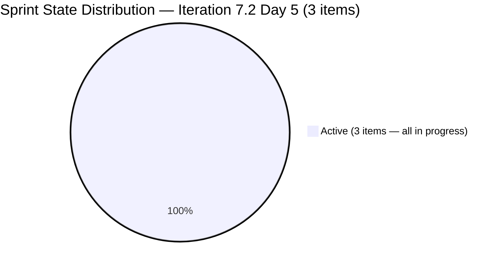
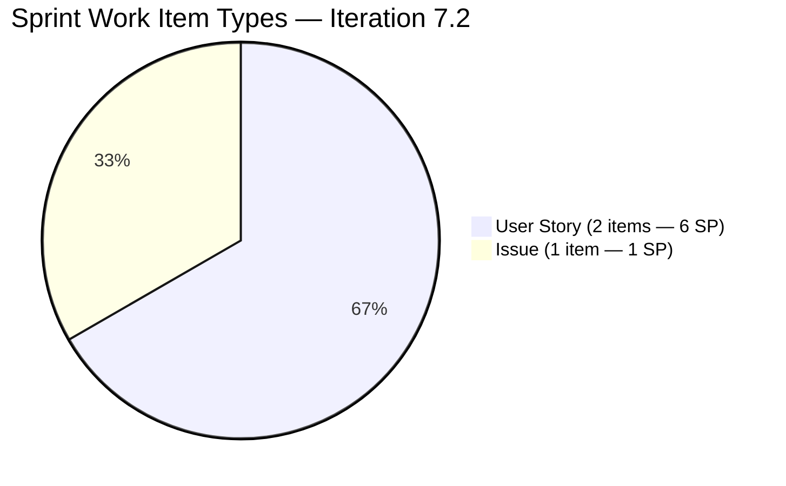
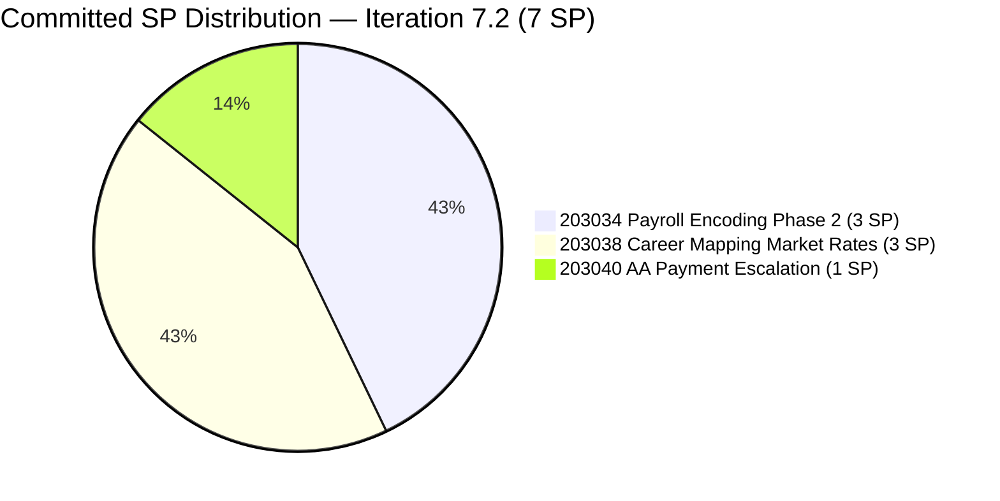
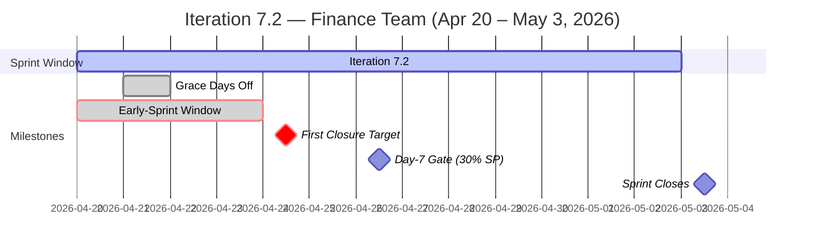
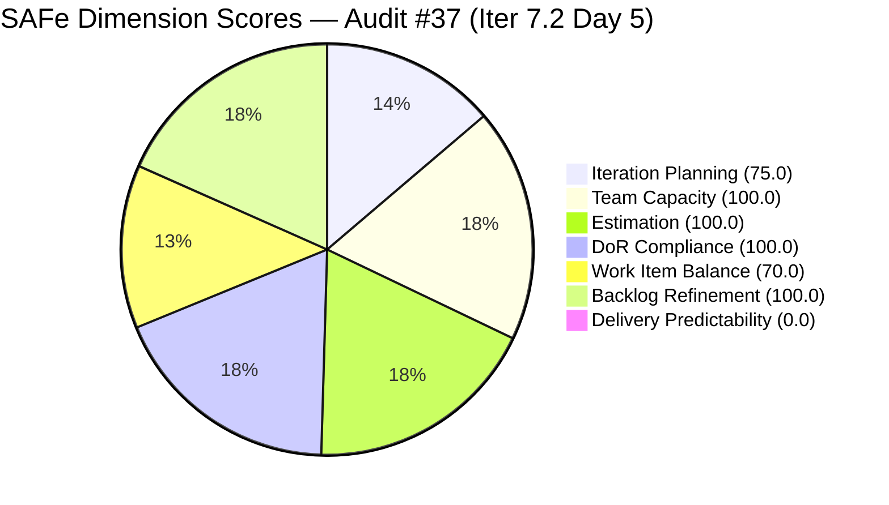
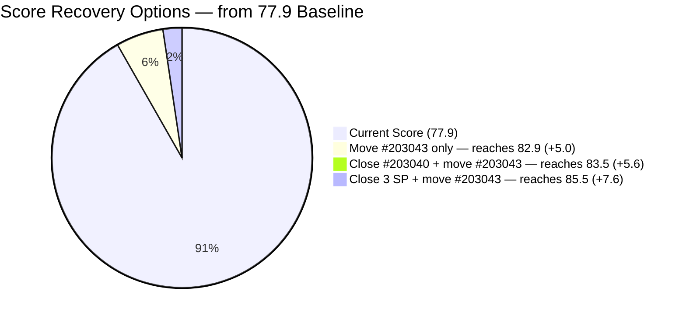

# ADO SAFe Iteration Audit — Finance Team

**Audit #37 | Iteration 7.2 (Apr 20 – May 3, 2026) | Day 5 of 14 (final early-sprint annotation day)**

---

## 1. Audit Metadata

| Field | Value |
|---|---|
| **Audit Date** | April 24, 2026 — 08:33 PHT |
| **Auditor** | Claude Code (ADO SAFe Audit Agent) |
| **Workspace** | `ado_fin` |
| **ADO Project** | Jairosoft FINOPS (`e0bb302f-40f9-46c3-8164-6f1acb317d63`) |
| **Team** | Finance Team (`1f4b45fa-82e8-4a36-aedc-6c1bc8f51070`) |
| **Iteration** | Iteration 7.2 — Apr 20 to May 3, 2026 |
| **Iteration ID** | `a9888bc5-48df-40dd-bcc8-6926a11aa7c7` |
| **Sprint Day** | Day 5 of 14 (final early-sprint annotation day) |
| **Prior Audit** | AUDIT_20260423_0913.md (Audit #36, 77.9 — Moderate Risk, PI7.2 Day 4) |
| **Scoring Model** | ADO SAFe v1 (7-dimension rubric) |
| **Overall Score** | **77.9 / 100** |
| **Risk Band** | **Moderate Risk** (60–79.9; 2.1 below Low-Risk threshold) |

> **Live ADO data confirmed.** All 4 visible root backlog items pulled from `Microsoft.RequirementCategory` backlog. Significant ADO activity detected since Audit #36: all three sprint items (203034, 203038, 203040) have been moved to **Active** state. #203034 was updated **today (Apr 24) at 11:54 UTC** — confirming live in-sprint work.

---

## 2. Executive Summary

The Finance Team holds **77.9 / 100 — Moderate Risk** on Day 5 of Iteration 7.2. The overall score is unchanged from Audit #36 (AUDIT_20260423_0913.md), but this audit reveals a **significant qualitative shift**: Grace has activated all three sprint items, with the most recent update to #203034 occurring this morning (Apr 24, 11:54 UTC). This is the first meaningful ADO activity since sprint start.

The sprint is now in active execution mode. Three items are in progress simultaneously, comprising 7 SP committed. The remaining gap to Low Risk (2.1 points) is driven exclusively by two structural issues:

1. **#203043 ("FTC HR for signed APEF", 2 SP)** still sits in the PI7 root path without an iteration assignment — now **5 consecutive days** unscoped. A single 60-second ADO field update would raise Iteration Planning from 75.0 to 100.0, pushing the overall to **82.9 (Low Risk)**.

2. **Delivery Predictability remains 0.0** with 0/7 SP closed at Day 5. Today is the FINAL day of the early-sprint annotation window. From Day 6, any 0.0 DP is fully penalizing. With all three items Active, closure of #203040 (1 SP, Issue, fully groomed AC) today would push DP to 14.3 and overall to 79.9 — and combined with the #203043 iteration move, would reach **82.9–85.5** (Low Risk territory).

**#201448 eAFS Portal Submission** remains unresolved after 5 consecutive audits. BIR deadline of Apr 15 has been 9 days elapsed. Escalation to Ramon is overdue.

---

## 3. Previous Audit Delta

| Dimension | Audit #36 (Apr 23, 09:13) | Audit #37 (Apr 24, 08:33) | Delta |
|---|---|---|---|
| Iteration Planning | 75.0 | 75.0 | 0.0 |
| Team Capacity | 100.0 | 100.0 | 0.0 |
| Estimation | 100.0 | 100.0 | 0.0 |
| DoR Compliance | 100.0 | 100.0 | 0.0 |
| Work Item Balance | 70.0 | 70.0 | 0.0 |
| Backlog Refinement | 100.0 | 100.0 | 0.0 |
| Delivery Predictability | 0.0 | 0.0 | 0.0 |
| **Overall** | **77.9** | **77.9** | **0.0** |

**Numerical scores unchanged — but ADO activity is significant:**

| Item | Prior State (Apr 23) | Current State (Apr 24) | Changed |
|---|---|---|---|
| #203034 Payroll Encoding Phase 2 | Ready | **Active** | Apr 24, 11:54 UTC (today) |
| #203038 Career Mapping Rates | Ready | **Active** | Apr 23, 03:31 UTC |
| #203040 AA Payment Escalation | New | **Active** | Apr 23, 03:30 UTC |
| #203043 FTC HR APEF | New (PI7 root) | New (PI7 root) | Unchanged (Apr 20) |

Grace activated all three sprint items on Apr 23–24. The sprint has transitioned from initialization to active execution. This is a positive signal — the prior audit's concern about "zero ADO-visible progress in 2 active working days" is resolved.

### Score Trajectory — Iteration 7.2 Series

| Audit # | Date | Score | Band | Sprint Day |
|---|---|---|---|---|
| #33 | Apr 20 (Day 1) | 77.9 | Moderate | 7.2 D1 |
| #34 | Apr 21 (Day 2) | 77.9 | Moderate | 7.2 D2 |
| #35 | Apr 22 (Day 3) | 77.9 | Moderate | 7.2 D3 |
| #36 | Apr 23 (Day 4) | 77.9 | Moderate | 7.2 D4 |
| **#37** | **Apr 24 (Day 5)** | **77.9** | **Moderate** | **7.2 D5** |

Score has held at 77.9 throughout Iteration 7.2. The path to Low Risk is clear and requires exactly one or two quick ADO actions.

---

## 4. Current Iteration Snapshot

| Metric | Value |
|---|---|
| **Visible root backlog items** | 4 (3 in Iter 7.2; 1 in PI7 root) |
| **Current iteration root items (Iter 7.2)** | 3 |
| **Committed story points** | 7 SP |
| **Closed story points (Day 5)** | 0 SP |
| **Delivery rate (Day 5)** | 0.0% (early-sprint — Day 5, FINAL annotation day) |
| **State distribution (sprint set)** | 3 Active, 0 Ready, 0 New, 0 Closed |
| **Sole contributor** | Grace (grace@jairosoft.com) |
| **Configured capacity** | 4 h/day (Documentation 3h + Requirements 1h), 2 days off elapsed (Apr 21–22) |
| **Effective remaining working days** | 10 of 14 (~40 working hours remaining) |
| **Sprint Day** | 5 of 14 |

### Sprint Item List — Iteration 7.2 (Live, Apr 24, 08:33 PHT)

| ID | Title | Type | State | SP | DoR | Changed | Delta |
|---|---|---|---|---|---|---|---|
| 203034 | Encoding payroll for automation – phase2 | User Story | **Active** | 3 | PASS | **Apr 24** | State: Ready→Active |
| 203038 | Explore market rates in references for Career Mapping | User Story | **Active** | 3 | PASS | Apr 23 | State: Ready→Active |
| 203040 | AA Escalation of Payment Settlement | Issue | **Active** | 1 | PASS | Apr 23 | State: New→Active |

### Out-of-Sprint Visible Item

| ID | Title | Type | State | SP | IterationPath | Changed | DoR |
|---|---|---|---|---|---|---|---|
| 203043 | FTC HR for signed APEF | User Story | New | 2 | PI7 root (unscoped) | Apr 20 | **FAIL** (no Desc, no AC) |

---

## 5. Work Item Analysis

### Sprint State Distribution — Day 5



### Sprint Work Item Type Mix



### Committed SP Distribution



### Iteration Timeline



### Observations

- **Sprint fully activated on Days 4–5.** Grace moved all three items to Active between Apr 23 (Day 4) and Apr 24 (Day 5). The sprint is in active execution — the prior audit's concern about ADO stasis is fully resolved.
- **Most recent update: #203034 at 11:54 UTC today (Apr 24).** This confirms live work in progress — not just a state cleanup. This is a strong positive signal.
- **#203040 (1 SP, Issue, Active) is the best first-closure candidate.** Its AC is concrete: QB Overdue Level 1 at 5 days, Karl notification at 15 days, dashboard "Escalated" status. If the escalation workflow is configured, this item can close today.
- **#203043 still at rev 1, unscoped.** Five days since creation without iteration assignment or grooming. This is the sole driver of the Iteration Planning penalty and the gap to Low Risk.
- **Working capacity is comfortable.** 7 SP at ~4 h/SP ≈ 28 hours against ~40 effective hours remaining (10 days × 4 h/day). ~12 hours headroom. If #203043 is pulled in (9 SP total, ~36 hours), headroom remains ~4 hours.

---

## 6. SAFe Compliance Scorecard

| Dimension | Score | Evidence | Notes |
|---|---|---|---|
| Iteration Planning | 75.0 | 3/4 visible root items in Iter 7.2 | #203043 in PI7 root (unscoped, 5 days) — 25-pt penalty; single ADO edit resolves |
| Team Capacity | 100.0 | Grace: 4 h/day (Doc 3h + Req 1h); 2 days off elapsed; all 3 sprint items assigned to Grace | 1/1 contributors with positive configured capacity |
| Estimation | 100.0 | 3/3 sprint items with SP > 0 (3+3+1 = 7 SP) | Full estimation coverage |
| DoR Compliance | 100.0 | 3/3 items pass Desc ≥30 nws + AC ≥20 nws | All items have structured user-story format with measurable AC |
| Work Item Balance | 70.0 | 2 User Stories + 1 Issue; dominant share 2/3 = 66.7% > 60% → −30 | Structural penalty; no Spike (−0); User Story present (−0) |
| Backlog Refinement | 100.0 | 4/4 items fresh (all ≥ Apr 20, within 45-day window); stale_90=0; stale_180=0; untouched_current=0 | Lean backlog at full freshness; all items ≥ Apr 20 |
| Delivery Predictability | 0.0 | 0/7 SP closed at Day 5 | **Early-sprint — Day 5 of 14 — FINAL annotation day. All 3 items Active; no closures yet.** |
| **Overall** | **77.9** | Average of 7 dimensions | **Moderate Risk** — 2.1 below Low-Risk threshold |

### Score Computation

```
Iteration Planning    = round(3 / 4 × 100, 1)     = 75.0
Team Capacity         = round(1 / 1 × 100, 1)     = 100.0
Estimation            = round(3 / 3 × 100, 1)     = 100.0
DoR Compliance        = round(3 / 3 × 100, 1)     = 100.0

Work Item Balance:
  has_user_story      = True (203034, 203038)       → no −40
  dominant_share      = 2/3 = 66.7% > 60%           → −30
  spike_share         = 0/3 = 0%                    → no −20
  total               = max(0, 100 − 30)             = 70.0

Backlog Refinement:
  fresh (≥ 2026-03-10) = 4/4 = 100%                 → base = 100.0
  stale_90 / visible   = 0/4 = 0%                   → 0
  stale_180            = 0 items                    → 0
  untouched_current    = 0/3 = 0%                   → 0
  total                = 100.0

Delivery Predictability:
  closed_sp / committed_sp = 0 / 7                  = 0.0
  (annotation: Day 5 of 14 — early-sprint, FINAL annotation day)

Overall = round((75.0 + 100.0 + 100.0 + 100.0 + 70.0 + 100.0 + 0.0) / 7, 1)
        = round(545.0 / 7, 1)
        = 77.9  → Moderate Risk
```

### Score Breakdown Visualization



> Delivery Predictability rendered as 1 for pie chart visibility; actual score is 0.0 (early-sprint Day 5, final annotation day).

---

## 7. Dimension Findings

### 7.1 Iteration Planning — 75.0 (Moderate)

3 of 4 visible root backlog items are in Iteration 7.2. Item **#203043 ("FTC HR for signed APEF", 2 SP)** remains in the PI7 root path for the **fifth consecutive day** since creation (Apr 20, rev 1). No Description, no Acceptance Criteria, no iteration assignment.

**This is the sole driver of the 25-point Iteration Planning deduction and the 2.1-point gap to Low Risk.** Resolution takes under 60 seconds: update the IterationPath field in ADO to any explicit iteration (7.2, 7.3, or 7.4). No grooming is required to resolve the planning metric — though DoR grooming should accompany the assignment (see Dimension 7.4 note below).

**Score uplift:** Move #203043 to any iteration → Iteration Planning 75.0 → 100.0 → Overall 77.9 → **82.9 (Low Risk)**.

### 7.2 Team Capacity — 100.0 (Low Risk)

Grace remains the sole Finance Team contributor with 4h/day configured capacity (Documentation 3h + Requirements 1h). Both scheduled days off (Apr 21–22) have elapsed. Effective remaining capacity: 10 working days × 4 h/day = **40 hours**.

Committed work: 7 SP × ~4 h/SP ≈ 28 hours. Headroom: ~12 hours. If #203043 (2 SP) is pulled into Iteration 7.2, committed rises to 9 SP (~36 hours), leaving ~4 hours headroom — still manageable.

1/1 contributors with configured positive capacity = **100.0**.

### 7.3 Estimation — 100.0 (Low Risk)

All three sprint items carry Story Points > 0:
- #203034: 3 SP
- #203038: 3 SP
- #203040: 1 SP

Total committed: 7 SP. Estimation coverage: 3/3 = 100.0%. Issue-type items (#203040) expose the Story Points field in FINOPS and are counted as point_eligible — consistent with team practice throughout PI7.

### 7.4 DoR Compliance — 100.0 (Low Risk)

All three sprint items maintain full DoR compliance (Description ≥30 nws + AC ≥20 nws):

- **#203034** (Active, 3 SP): User-story format Description and two concrete AC bullets (Submit blocking, Pre-check validation). PASS.
- **#203038** (Active, 3 SP): Strong user-story Description and 5 detailed measurable AC bullets (Filterable Data, Visual Benchmarks, Currency Conversion, Source Transparency, Integration). Best-groomed item in sprint. PASS.
- **#203040** (Active, 1 SP): User-story Description and 3 verifiable AC bullets (QB Level 1 at 5 days, Karl notification at 15 days, "Escalated" dashboard status). PASS.

**Note on #203043 (out-of-sprint):** Still at rev 1 with null Description and null AC — would fail DoR if pulled into any sprint without grooming. Must be groomed (Description ≥30 nws + AC ≥20 nws) before or simultaneously with iteration assignment.

### 7.5 Work Item Balance — 70.0 (Moderate — structural)

Sprint composition: 2 User Stories + 1 Issue. No Spikes. Dominant type (User Story): 2/3 = 66.7% > 60% → -30 penalty. Score = 70.0.

This is a **mechanical structural penalty** on a well-balanced 3-item sprint. The thematic diversity (payroll automation + career data + payables workflow) reflects good planning discipline despite the rubric deduction.

**Structural fix:** Adding one Spike to Iteration 7.2 drops User Story share to 2/4 = 50% (below 60%), removes the -30 penalty, and raises Work Item Balance to 100.0. The suggested Spike from Audit #36 remains relevant: "Investigate Q2 2026 BIR e-filing calendar and eAFS FRN automation options" — useful research that directly addresses the #201448 compliance gap (Risk R1).

### 7.6 Backlog Refinement — 100.0 (Low Risk)

All 4 visible root items were changed on or after April 20, 2026 — fully within the 45-day freshness window:
- #203034: Apr 24 (today)
- #203038: Apr 23
- #203040: Apr 23
- #203043: Apr 20

Zero stale_90 items, zero stale_180 items, zero untouched_current items. Score = **100.0**.

The Finance Team's lean 4-item backlog is the simplest configuration in the portfolio to maintain at full Backlog Refinement. Grace's activation of sprint items on Apr 23–24 refreshed the ChangedDates, eliminating any untouched-current risk.

### 7.7 Delivery Predictability — 0.0 (Early-Sprint — FINAL Annotation Day)

Day 5 of 14. 0/7 SP closed. All three items are Active.

**This is the last day the early-sprint annotation applies.** From Day 6 (Apr 25), Delivery Predictability of 0.0 is unqualified — a full mid-sprint deficit.

**However, all three items are Active today — a strong positive indicator.** If Grace closes #203040 (1 SP, Issue, fully groomed) today:
- DP = round(1/7 × 100, 1) = 14.3
- Overall = round(559.3/7, 1) = **79.9** (Moderate, 0.1 below Low Risk)

If additionally #203043 is moved to any iteration (IP 75 → 100):
- Overall = round((100+100+100+100+70+100+14.3)/7, 1) = round(584.3/7, 1) = **83.5 (Low Risk)**

**Historical baseline:** PI7.1 closed at 85.7% DP (12/14 SP). The sprint has the capacity and groomed items to match or exceed this.

---

## 8. Risks and Bottlenecks

| # | Risk | Severity | Status | Trend | Days Open |
|---|---|---|---|---|---|
| R1 | **#201448 eAFS Portal Submission** — absent from backlog 5 consecutive audits; BIR deadline Apr 15 elapsed (9 days ago); no closure evidence surfaced | **High** | Open | Worsening | 5 audits |
| R2 | **DP expires from early-sprint annotation after today (Day 5)** — 0/7 SP closed; all items Active but no closures yet | **High** | Escalating | Final opportunity | Day 5 |
| R3 | **#203043 unscoped (PI7 root, 5 days)** — 25-pt Iteration Planning deduction; no Desc/AC; single ADO edit resolves IP deficit | **Medium** | Open | Persistent | 5 days |
| R4 | **Single contributor (Grace)** — any unplanned absence halts all sprint delivery | **Medium** | Structural | Persistent | PI7 |
| R5 | **Work Item Balance structural −30 penalty** — 70.0 ceiling without a Spike or additional type diversity | **Low** | Structural | Persistent | PI7 |
| R6 | **#203043 DoR gap** — null Desc and AC at rev 1; will fail DoR if pulled into sprint without grooming | **Low** | Open | Persistent | 5 days |

---

## 9. Prioritized Recommendations

### P0 — Resolve Today (April 24) — Final Early-Sprint Window

1. **Close #203040 (AA Escalation of Payment Settlement, 1 SP, Active) — highest urgency.**
   - Today is the last day of the early-sprint annotation. Day 6 scores DP without qualification.
   - AC is fully verifiable: QB Overdue Level 1 at 5 days, Karl notification at 15 days, "Escalated" dashboard status.
   - Score impact: DP 0.0 → 14.3; Overall 77.9 → **79.9** (0.1 from Low Risk).

2. **Move #203043 (FTC HR for signed APEF, 2 SP) to an explicit iteration — 60-second action.**
   - Assign to Iteration 7.2 (if urgent), 7.3, or 7.4 — any iteration removes the PI7-root deduction.
   - Score impact: IP 75.0 → 100.0; Overall 77.9 → **82.9 (Low Risk)** (or ~83.5 if combined with #203040 close).
   - **Do not assign to 7.2 without grooming #203043 first** (see P1 item 3 below).

3. **Confirm #201448 eAFS Portal Submission disposition — compliance priority.**
   - BIR deadline Apr 15 is 9 days elapsed. This is a 5-audit-old open risk.
   - Three scenarios: (A) Filed externally → update ADO to Closed with BIR Transaction Number. (B) Incomplete → re-scope to 7.2 immediately and escalate to Ramon. (C) Transferred → document in ADO comment.
   - If Grace cannot confirm today, notify Ramon directly.

### P1 — Resolve by Day 6 (April 25)

4. **Begin closing the first 3-SP User Story (#203034 or #203038).**
   - Both are Active. If #203034 (Payroll Encoding Phase 2) is near done-state, target closure first (updated today at 11:54 UTC, suggesting active progress).
   - Closing one 3-SP story + #203040: DP = round(4/7 × 100, 1) = 57.1; Overall = **80.3 (Low Risk)**.

5. **Groom #203043 (Description + AC) before assigning to any sprint.**
   - Minimum Description (≥30 nws): "Coordinate and finalize the signed APEF (Annual Performance Evaluation Form) documentation process with FTC HR department, ensuring all required signatures and submissions are completed per Jairosoft policy."
   - Minimum AC (≥20 nws): "Signed APEF document received from FTC HR and uploaded to ADO; completion confirmed with HR representative; ADO item closed with supporting documentation attached."
   - This takes ~10 minutes and prevents a DoR Compliance penalty when the item enters a sprint.

### P2 — Sprint Maturity

6. **Add a 1-SP Spike to Iteration 7.2 to resolve the Work Item Balance structural penalty.**
   - Suggested: "Investigate Q2 2026 BIR e-filing calendar and eAFS FRN automation options (1 SP)."
   - Score impact: User Story share drops from 66.7% to 50% (below 60%); Work Item Balance 70.0 → 100.0.
   - Combined with P0 actions: Overall could reach ~87.4 (Low Risk).
   - This Spike also directly addresses R1 (#201448 eAFS disposition research).

7. **Add a mid-sprint progress comment to #203038 (Career Mapping) if research is in progress.**
   - This creates audit-visible evidence of progress and refreshes the ChangedDate, confirming active work even before closure.

### P3 — Governance

8. **Establish a regulatory-deadline tagging convention for FINOPS compliance items.**
   - For any item with a hard regulatory deadline (BIR, SEC, DOLE, SSS), require a `regulatory-deadline:YYYY-MM-DD` tag and a closure comment with proof-of-submission (Transaction Number, FRN, Reference ID).
   - Prevents future #201448-style disposition ambiguity.

9. **Target 10–12 SP for Iteration 7.3.**
   - PI7.1 delivered 12 SP at 85.7% DP. With Grace's full capacity and all days off elapsed, 7.3 should target ≥10 SP to restore delivery volume and avoid the conservative-commitment pattern established in 7.2.

---

## 10. Evidence Gaps and Limitations

| Gap | Description | Impact |
|---|---|---|
| **#201448 eAFS Portal Submission disposition** | Absent from Finance Team backlog for 5 consecutive audits. BIR deadline Apr 15 elapsed (9 days). No closure evidence in ADO. Direct confirmation from Grace required. | **High** — regulatory compliance risk; escalating each audit |
| **Delivery Predictability (early-sprint, final day)** | Day 5 of 14. 0/7 SP closed. All 3 items Active — work is in progress but not yet at AC-verifiable closure state. Rubric applies early-sprint annotation for the final time today. Day 6 scores without qualification. | Medium — final annotation day |
| **#203043 intent and timeline** | Cannot determine from ADO data whether Grace intends #203043 for Iteration 7.2 or a future sprint. Item is at rev 1 unchanged since Apr 20. Rubric scores as out-of-sprint — Iteration Planning penalty applies. | Medium — planning ambiguity |
| **#203043 DoR state** | Rev 1 with null Description and null AC. Not in current sprint — does not affect DoR Compliance today. Will fail DoR if assigned to any sprint without grooming. | Low — future sprint risk |
| **Work Item Balance structural penalty** | The −30 dominant-type penalty fires mechanically on any 3-item sprint with a 2/3 User Story split. Thematic diversity is strong; penalty is rubric artifact. | Low — rubric limitation |
| **#202533 PI7.1 Annual ITR FRN verification** | PI7.1 Annual ITR closure required an FRN per its AC. Not re-verified in current or prior audits. | Low — compliance archiving gap |

---

## Appendix: Score Recovery Scenarios

| Action | Dimensions Affected | New Overall | Risk Band |
|---|---|---|---|
| Baseline — no change | — | 77.9 | Moderate |
| Move #203043 to any iteration only | IP: 75 → 100 | **82.9** | **Low Risk** |
| Close #203040 (1 SP) only | DP: 0 → 14.3 | 79.9 | Moderate (−0.1) |
| Move #203043 + close #203040 | IP: 75 → 100; DP: 0 → 14.3 | **83.5** | **Low Risk** |
| Close #203034 or #203038 (3 SP) | DP: 0 → 42.9 | 83.0 | **Low Risk** |
| Move #203043 + close #203034 (3 SP, 9 SP commit) | IP: 75 → 100; DP: 0 → 33.3 | **85.5** | **Low Risk** |
| All above + Spike (WIB: 70 → 100) | IP, WIB, DP all improve | ~89+ | **Low Risk** |



> Fastest single action to Low Risk: Move #203043 to any explicit iteration → IP 75.0 → 100.0 → Overall 82.9 (Low Risk) in one 60-second ADO edit.

---

*Report generated by Claude Code ADO SAFe Audit Agent | April 24, 2026 — 08:33 PHT*
*Audit #37 — Finance Team — Iteration 7.2 Day 5 of 14 — Overall: 77.9 / 100 — Moderate Risk*
*Evidence basis: Live ADO pull — 4 backlog items, 3 iteration items confirmed Active, capacity verified — Apr 24, 2026*
*Prior audit: AUDIT_20260423_0913.md (Audit #36, 77.9 — same score; significant qualitative improvement: all 3 items now Active)*
