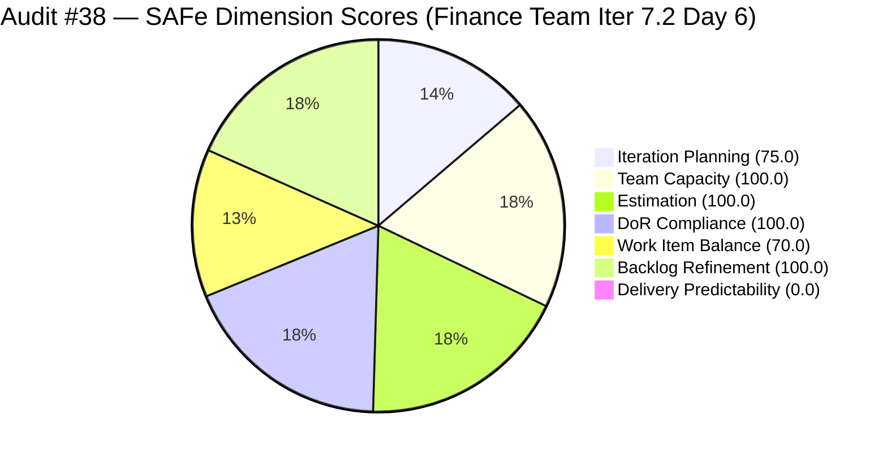
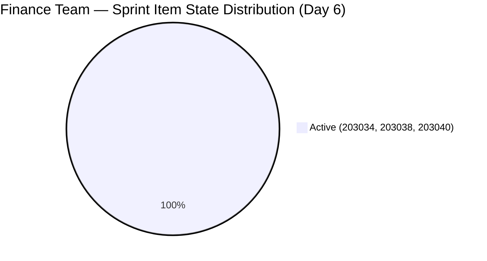
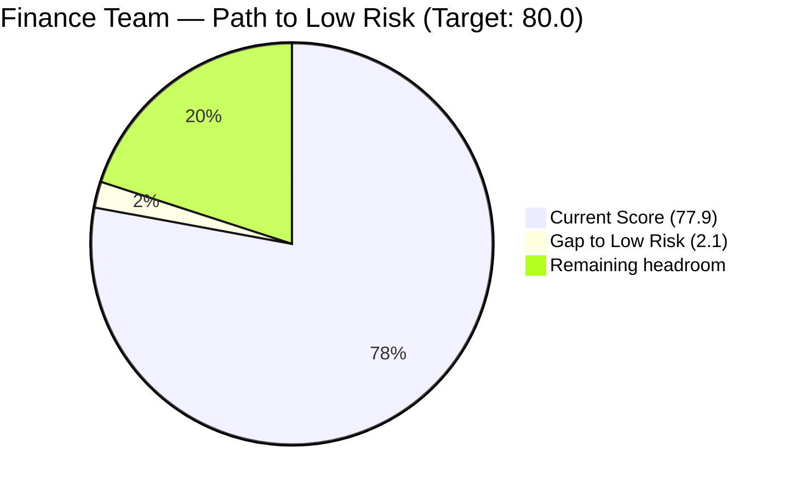

# ADO SAFe Iteration Audit — Finance Team

**Audit #38 | Iteration 7.2 (Apr 20 – May 3, 2026) | Day 6 of 14**

---

## 1. Audit Metadata

| Field | Value |
|---|---|
| **Audit Date** | April 25, 2026 — 23:33 PHT (15:33 UTC) |
| **Auditor** | Claude Code (ADO SAFe Audit Agent) |
| **Workspace** | `ado_fin` |
| **ADO Project** | Jairosoft FINOPS (`e0bb302f-40f9-46c3-8164-6f1acb317d63`) |
| **Team** | Finance Team (`1f4b45fa-82e8-4a36-aedc-6c1bc8f51070`) |
| **Iteration** | Iteration 7.2 — Apr 20 to May 3, 2026 |
| **Iteration ID** | `a9888bc5-48df-40dd-bcc8-6926a11aa7c7` |
| **Sprint Day** | Day 6 of 14 |
| **Prior Audit** | AUDIT_20260424_0833.md (Audit #37, 77.9 — Moderate Risk, PI7.2 Day 5) |
| **Scoring Model** | ADO SAFe v1 (7-dimension rubric) |
| **Overall Score** | **77.9 / 100** |
| **Risk Band** | **Moderate Risk** (60–79.9; 2.1 below Low-Risk threshold) |

> **Live ADO data confirmed.** All 4 visible root backlog items pulled from `Microsoft.RequirementCategory` backlog. Capacity and work item details confirmed via ADO batch APIs. Query time: 2026-04-25T15:32 UTC.

---

## 2. Executive Summary

The Finance Team holds **77.9 / 100 — Moderate Risk** on Day 6 of Iteration 7.2. The score is unchanged from Audit #37 (AUDIT_20260424_0833.md), and the team has maintained this score for all six days of the sprint. The overall number is stable, but the **critical threshold shift** today is the expiry of the early-sprint annotation window — Delivery Predictability (0.0) now carries full weight with no mitigating annotation.

All three sprint items (#203034, #203038, #203040) remain Active — Grace has been engaged in-sprint since Apr 23–24 — but no item has reached Closed. With 7 SP committed and 0 SP delivered through Day 6, the sprint requires at least one closure today to register progress.

**The path to Low Risk is narrow and well-defined:**
1. Move #203043 ("FTC HR for signed APEF", 2 SP) from PI7-root to Iteration 7.2 → Iteration Planning improves from 75.0 to 100.0 (+3.6 overall)
2. Close #203040 ("AA Escalation of Payment Settlement", 1 SP) → Delivery Predictability improves from 0.0 to 14.3 (+2.0 overall)
Combined: Overall jumps from 77.9 to **83.5 (Low Risk)** with two ADO field edits.

---

## 3. Previous Audit Delta

| Dimension | Audit #37 (Apr 24) | Audit #38 (Apr 25) | Delta |
|---|---|---|---|
| Iteration Planning | 75.0 | 75.0 | 0.0 |
| Team Capacity | 100.0 | 100.0 | 0.0 |
| Estimation | 100.0 | 100.0 | 0.0 |
| DoR Compliance | 100.0 | 100.0 | 0.0 |
| Work Item Balance | 70.0 | 70.0 | 0.0 |
| Backlog Refinement | 100.0 | 100.0 | 0.0 |
| Delivery Predictability | 0.0 | 0.0 | 0.0 |
| **Overall** | **77.9** | **77.9** | **0.0** |

No ADO state changes detected between Apr 24, 08:33 UTC and Apr 25, 15:32 UTC. All three sprint items remain Active. #203043 remains in PI7-root. Grace's last recorded activity was Apr 24, 11:54 UTC (#203034 update).

### Score Trajectory — Iteration 7.2 Series

| Audit # | Date | Score | Band | Sprint Day |
|---|---|---|---|---|
| #33 | Apr 20 (Day 1) | 77.9 | Moderate | 7.2 D1 |
| #34 | Apr 21 (Day 2) | 77.9 | Moderate | 7.2 D2 |
| #35 | Apr 22 (Day 3) | 77.9 | Moderate | 7.2 D3 |
| #36 | Apr 23 (Day 4) | 77.9 | Moderate | 7.2 D4 |
| #37 | Apr 24 (Day 5) | 77.9 | Moderate | 7.2 D5 |
| **#38** | **Apr 25 (Day 6)** | **77.9** | **Moderate** | **7.2 D6** |

The score has been locked at 77.9 for all six days of the sprint — the most stable trajectory in the portfolio.

---

## 4. Current Iteration Snapshot

| Metric | Value |
|---|---|
| **Visible root backlog items** | 4 |
| **Current iteration root items (Iter 7.2)** | 3 |
| **PI7-root items (no iteration assigned)** | 1 (#203043) |
| **Committed story points** | 7 SP |
| **Closed story points (Day 6)** | **0 SP** |
| **Team capacity** | Grace — 4 hrs/day (3 Doc + 1 Req), 2 days off Apr 21–22 |
| **Last ADO activity** | Apr 24, 11:54 UTC (#203034 update by Grace) |

---

## 5. Work Item Analysis

### Current Iteration Items (Iteration 7.2)

| ID | Title | Type | State | SP | AssignedTo | Changed | DoR |
|---|---|---|---|---|---|---|---|
| 203034 | Encoding payroll for automation — phase 2 | User Story | Active | 3 | Grace | Apr 24 | PASS |
| 203038 | Explore market rates for Career Mapping | User Story | Active | 3 | Grace | Apr 23 | PASS |
| 203040 | AA Escalation of Payment Settlement | Issue | Active | 1 | Grace | Apr 23 | PASS |

**Totals:** 3 items | 7 SP committed | 0 SP closed | 2 User Story + 1 Issue

### PI7-Root Items (Not in Iteration 7.2)

| ID | Title | Type | State | SP | Changed | Note |
|---|---|---|---|---|---|---|
| 203043 | FTC HR for signed APEF | User Story | New | 2 | Apr 20 | No iteration assigned — 6 consecutive days |

---

## 6. SAFe Compliance Scorecard

| Dimension | Score | Band | Evidence | Notes |
|---|---|---|---|---|
| Iteration Planning | 75.0 | Moderate | 3 of 4 visible items in Iter 7.2 | #203043 still in PI7-root; one edit needed for 100.0 |
| Team Capacity | 100.0 | Low | Grace: 4 hrs/day configured; 2 days off Apr 21–22 registered | Single-contributor; capacity set correctly |
| Estimation | 100.0 | Low | All 3 point-eligible items estimated (7 SP total) | Issue type #203040 counts as point-eligible |
| DoR Compliance | 100.0 | Low | All 3 sprint items pass desc ≥30 chars and AC ≥20 chars | Full DoR compliance; no regressions |
| Work Item Balance | 70.0 | Moderate | 2 US + 1 Issue; US present; dominant type 66.7% > 60% → −30 | Issue type diversifies mix but US still dominant |
| Backlog Refinement | 100.0 | Low | All 4 items changed since Apr 20; 0 stale_90; 0 stale_180 | Pristine backlog health; no untouched current items |
| Delivery Predictability | **0.0** | **Critical** | 0 SP closed of 7 committed through Day 6 | Early-sprint window expired; full penalty in effect |
| **Overall** | **77.9** | **Moderate** | | |

---

## 7. Dimension Findings

### Iteration Planning (75.0)
Item #203043 ("FTC HR for signed APEF", 2 SP, Grace, New) remains in the `Jairosoft FINOPS\2026-PI7` root path for the sixth consecutive day. This item was created on April 20 (sprint Day 1) and has never been assigned to an iteration. A single ADO field update (IterationPath → Iteration 7.2) would raise this dimension to 100.0 and push the overall score to **81.5**, entering Low Risk territory. The delay has no apparent technical barrier.

### Team Capacity (100.0)
Grace is the sole Finance Team member with capacity configured: 3 hrs Documentation + 1 hr Requirements = 4 hrs/day. Two days of paid time off (Apr 21–22) were properly registered in ADO. The effective available capacity for the sprint is reduced by ~15% (2 days × 4 hrs = 8 hrs lost). Despite this, all three sprint items progressed to Active state during Apr 23–24.

### Estimation (100.0)
All three sprint items are estimated: #203040 (1 SP), #203034 (3 SP), #203038 (3 SP). Total committed: 7 SP. This represents a conservative sprint load well within any reasonable single-contributor velocity. The low commitment actually increases the risk that these items linger Active without forcing closure.

### DoR Compliance (100.0)
All three sprint items pass DoR thresholds. #203034 and #203038 have detailed user-story-format descriptions with well-structured acceptance criteria. #203040 has a concise but complete Issue description and three clear acceptance criteria. This is the Finance Team's strongest dimension and a continued bright spot.

### Work Item Balance (70.0)
The sprint mix of 2 User Stories and 1 Issue provides some diversity. User Stories represent 66.7% (just above the 60% penalty threshold), triggering a −30. Introducing a Spike or structured Defect could bring the dominant type share below 60% in a future sprint. At 3 items, balance is structurally constrained by the small sprint size.

### Backlog Refinement (100.0)
All 4 visible items were updated within the past 45 days. No items are stale at 90 or 180 days. No current iteration items are untouched (all three changed Apr 23–24). The Finance Team maintains the cleanest backlog in the FINOPS program.

### Delivery Predictability (0.0)
Zero story points closed through Day 6. The early-sprint window has closed — this score now carries full weight in the rubric. With 7 SP committed and 8 working days remaining, the team has ample time to close all items if the current Active work completes. The smallest and most easily closeable item is **#203040** (AA Escalation, 1 SP, Issue, Active, full DoR). Closing this today would register 1/7 SP = 14.3% DP, lifting the overall to 79.9 — only 0.1 below Low Risk. Combined with the #203043 iteration assignment, overall would reach 83.5.

---

## 8. Risks and Bottlenecks

| Risk | Severity | Trend | Action Required |
|---|---|---|---|
| Zero closures through Day 6 of 14 | High | Stable (0 SP, 6 consecutive days) | Close #203040 today (1 SP, minimal friction) |
| #203043 unscoped for 6 days | Moderate | Stable (no change) | Assign to Iter 7.2 immediately — 60-second ADO edit |
| Work Item Balance ceiling at 70.0 | Low | Structural | Cannot be resolved within this sprint (type composition fixed) |
| Single-contributor team (Grace) | Moderate | Persistent | Flag for PI8 capacity planning and cross-training |
| BIR eAFS portal submission (#201448) | High | Escalating (BIR deadline Apr 15, now 10 days elapsed) | Escalate to Ramon; this item may be outside ado_fin backlog scope |

---

## 9. Prioritized Recommendations

1. **[CRITICAL — Today]** Assign #203043 ("FTC HR for signed APEF") to Iteration 7.2 in ADO. This single field edit adds 3.6 points to the overall score and breaks the sprint's stasis at 77.9 for the first time in 6 days.

2. **[CRITICAL — Today]** Close #203040 ("AA Escalation of Payment Settlement", 1 SP). The item has full DoR compliance and has been Active since Apr 23. Closing today adds ~2.0 to the overall and breaks the 0.0 Delivery Predictability.

3. **[HIGH — Days 6–9]** Drive #203034 and #203038 to closure. Both are high-quality User Stories with detailed ACs. Grace has been actively working them since Apr 23–24. Full closure of all 7 SP would score 100.0 DP and push the overall to ~95.7.

4. **[MODERATE — PI8 Planning]** Evaluate whether Work Item Balance can be improved by introducing Spikes (research items) alongside User Stories. This would bring the dominant-type share below 60% and remove the −30 penalty.

5. **[MODERATE — This Week]** Resolve the BIR eAFS portal submission issue (10 days past Apr 15 deadline). Escalate to Ramon for decision on whether this belongs in the Finance backlog or is being handled outside ADO.

---

## 10. Evidence Gaps and Limitations

| Gap | Impact | Notes |
|---|---|---|
| #203043 not in Admin Team backlog API but was visible in WIQL scope | Low | WIQL queried all FINOPS Iter 7.2 items; #203043 appears to belong to Finance Team; its PI7-root status is confirmed by IterationPath field |
| No closure timestamps — all items Active; 0 SP closed is confirmed by state | Low | ADO state fields are authoritative; no ambiguity |
| BIR deadline tracking (#201448) — item not in current visible backlog | Medium | Item referenced in prior audits; may have been removed or reassigned; escalation recommended |
| Work Item Balance structural ceiling (70.0 with 2 US + 1 Issue) | Low | Acknowledged limitation of small sprint size; not a data gap |

---

