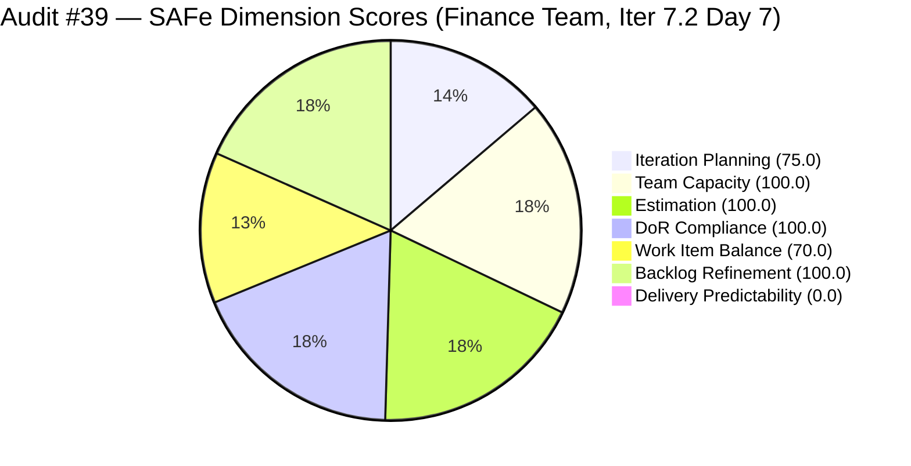
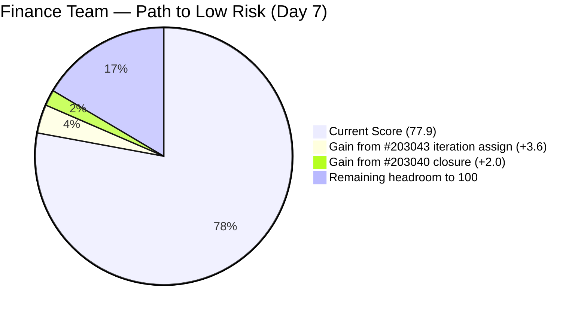
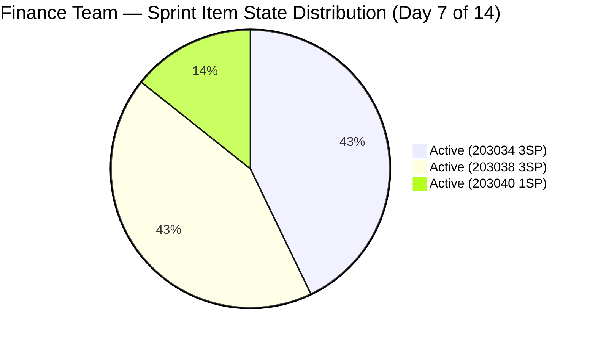

# ADO SAFe Iteration Audit — Finance Team

**Audit #39 | Iteration 7.2 (Apr 20 – May 3, 2026) | Day 7 of 14**

---

## 1. Audit Metadata

| Field | Value |
|---|---|
| **Audit Date** | April 26, 2026 — 05:00 PHT (21:00 UTC) |
| **Auditor** | Claude Code (ADO SAFe Audit Agent) |
| **Workspace** | `ado_fin` |
| **ADO Project** | Jairosoft FINOPS (`e0bb302f-40f9-46c3-8164-6f1acb317d63`) |
| **Team** | Finance Team (`1f4b45fa-82e8-4a36-aedc-6c1bc8f51070`) |
| **Iteration** | Iteration 7.2 — Apr 20 to May 3, 2026 |
| **Iteration ID** | `a9888bc5-48df-40dd-bcc8-6926a11aa7c7` |
| **Sprint Day** | Day 7 of 14 |
| **Prior Audit** | AUDIT_20260425_1533.md (Audit #38, 77.9 — Moderate Risk, PI7.2 Day 6) |
| **Scoring Model** | ADO SAFe v1 (7-dimension rubric) |
| **Overall Score** | **77.9 / 100** |
| **Risk Band** | **Moderate Risk** (60–79.9; 2.1 below Low-Risk threshold) |

> **Live ADO data confirmed.** All 4 visible root backlog items pulled from `Microsoft.RequirementCategory` backlog for Finance Team. Capacity and work item details confirmed via ADO batch APIs at 21:00 UTC April 26, 2026.

---

## 2. Executive Summary

The Finance Team holds **77.9 / 100 — Moderate Risk** on Day 7 of Iteration 7.2. The score is unchanged for the seventh consecutive day — 77.9 has been the Finance Team's score since Day 1 of this sprint. No ADO work item changes have been detected since April 24, 11:54 UTC (Grace's last update to #203034). Zero story points remain closed through Day 7.

**The midpoint has been reached with zero delivery.** With 7 working days remaining and only 7 SP committed, there is still ample time to close all items if Grace resumes active ADO progress. However, the absence of any update in the past 48 hours (Apr 24 → Apr 26) is a new concern.

**The path to Low Risk remains unchanged and immediately actionable:**
1. Assign #203043 ("FTC HR for signed APEF", 2 SP) from PI7-root to Iteration 7.2 → Iteration Planning improves to 100.0 (+3.6 overall)
2. Close #203040 ("AA Escalation of Payment Settlement", 1 SP, Active, full DoR) → Delivery Predictability moves to 14.3 (+2.0 overall)

Combined effect: Overall score reaches **83.5 — Low Risk** with two ADO field updates.

---

## 3. Previous Audit Delta

| Dimension | Audit #38 (Apr 25) | Audit #39 (Apr 26) | Delta |
|---|---|---|---|
| Iteration Planning | 75.0 | 75.0 | 0.0 |
| Team Capacity | 100.0 | 100.0 | 0.0 |
| Estimation | 100.0 | 100.0 | 0.0 |
| DoR Compliance | 100.0 | 100.0 | 0.0 |
| Work Item Balance | 70.0 | 70.0 | 0.0 |
| Backlog Refinement | 100.0 | 100.0 | 0.0 |
| Delivery Predictability | 0.0 | 0.0 | 0.0 |
| **Overall** | **77.9** | **77.9** | **0.0** |

**Zero ADO changes detected** between April 25, 15:33 UTC and April 26, 21:00 UTC. All four items maintain the same state. Grace's last recorded ADO activity remains April 24, 11:54 UTC (#203034 update). The 48-hour silence since the prior audit is the longest ADO inactivity window observed for this team in Iteration 7.2.

### Score Trajectory — Iteration 7.2 Series

| Audit # | Date | Score | Band | Sprint Day |
|---|---|---|---|---|
| #33 | Apr 20 (Day 1) | 77.9 | Moderate | 7.2 D1 |
| #34 | Apr 21 (Day 2) | 77.9 | Moderate | 7.2 D2 |
| #35 | Apr 22 (Day 3) | 77.9 | Moderate | 7.2 D3 |
| #36 | Apr 23 (Day 4) | 77.9 | Moderate | 7.2 D4 |
| #37 | Apr 24 (Day 5) | 77.9 | Moderate | 7.2 D5 |
| #38 | Apr 25 (Day 6) | 77.9 | Moderate | 7.2 D6 |
| **#39** | **Apr 26 (Day 7)** | **77.9** | **Moderate** | **7.2 D7** |

The score has been flat at 77.9 for all seven days of the sprint — the most stable (and most stagnant) trajectory in the portfolio.

---

## 4. Current Iteration Snapshot

| Metric | Value |
|---|---|
| **Visible root backlog items** | 4 |
| **Current iteration root items (Iter 7.2)** | 3 |
| **PI7-root items (unscoped)** | 1 (#203043 — 7 consecutive days unscoped) |
| **Committed story points** | 7 SP |
| **Closed story points (Day 7)** | **0 SP** |
| **Team capacity** | Grace — 4 hrs/day (3 Doc + 1 Req); 2 days off Apr 21–22 |
| **Last ADO activity** | Apr 24, 11:54 UTC (#203034 update by Grace) |
| **Days remaining** | 7 |

---

## 5. Work Item Analysis

### Current Iteration Items (Iteration 7.2)

| ID | Title | Type | State | SP | AssignedTo | Changed | DoR |
|---|---|---|---|---|---|---|---|
| 203034 | Encoding payroll for automation — phase 2 | User Story | Active | 3 | Grace | Apr 24 | PASS |
| 203038 | Explore market rates for Career Mapping | User Story | Active | 3 | Grace | Apr 23 | PASS |
| 203040 | AA Escalation of Payment Settlement | Issue | Active | 1 | Grace | Apr 23 | PASS |

**Totals:** 3 items | 7 SP committed | 0 SP closed | 2 User Story + 1 Issue

**DoR Detail:**
- #203034: Description 243 chars (✓ ≥30); AC 215 chars (✓ ≥20) — PASS
- #203038: Description 178 chars (✓ ≥30); AC 653 chars (✓ ≥20) — PASS
- #203040: Description 222 chars (✓ ≥30); AC 312 chars (✓ ≥20) — PASS

### PI7-Root Items (Unscoped — 7 Consecutive Days)

| ID | Title | Type | State | SP | Last Changed | Status |
|---|---|---|---|---|---|---|
| 203043 | FTC HR for signed APEF | User Story | New | 2 | Apr 20 | No iteration assigned since creation |

**Note:** #203043 was created April 20 (sprint Day 1) and has never been assigned to Iteration 7.2. This item has been flagged in every audit of this sprint. A single ADO field update (IterationPath) would raise Iteration Planning from 75.0 to 100.0.

---

## 6. SAFe Compliance Scorecard

| Dimension | Score | Band | Evidence | Notes |
|---|---|---|---|---|
| Iteration Planning | 75.0 | Moderate | 3 of 4 visible items in Iter 7.2 | #203043 in PI7-root for 7th consecutive day; 60-second fix needed |
| Team Capacity | 100.0 | Low | Grace: 4 hrs/day configured; 2 days off Apr 21–22 properly registered | Single-contributor; capacity accurately configured |
| Estimation | 100.0 | Low | All 3 point-eligible items estimated: #203040 (1 SP), #203034 (3 SP), #203038 (3 SP) | No SP gaps |
| DoR Compliance | 100.0 | Low | All 3 sprint items pass ≥30-char desc AND ≥20-char AC | Best DoR compliance in FINOPS program |
| Work Item Balance | 70.0 | Moderate | 2 US + 1 Issue; US present ✓; US dominant 66.7% > 60% → −30 | Structural constraint from small sprint size |
| Backlog Refinement | 100.0 | Low | All 4 items changed since Apr 20; 0 stale_90; 0 stale_180; 0 untouched current | Pristine backlog — all current items changed after sprint start |
| Delivery Predictability | **0.0** | **Critical** | 0 SP closed of 7 committed through Day 7 | Midpoint reached with zero delivery; 7 days remaining |
| **Overall** | **77.9** | **Moderate** | | |

---

## 7. Dimension Findings

### Iteration Planning (75.0)
Item #203043 ("FTC HR for signed APEF", 2 SP, Grace, New) remains in the `Jairosoft FINOPS\2026-PI7` root path for the seventh consecutive day. The item was created on April 20 (sprint Day 1) and has received no updates. Last changed: April 20, 16:10 UTC. This is a direct consequence of not assigning the item during sprint planning. The fix remains a single ADO field edit with no technical barrier.

Assigning #203043 to Iteration 7.2 would change the score to 4/4 = 100.0, adding 3.6 points to the overall and enabling the team's first dimension score improvement in 7 days.

### Team Capacity (100.0)
Grace is the sole Finance Team member. Capacity is accurately configured at 4 hrs/day (3 hrs Documentation + 1 hr Requirements). Two days of paid time off (Apr 21–22) were correctly registered. Effective remaining sprint capacity: approximately 7 days × 4 hrs = 28 hrs. This is more than sufficient to complete all 7 SP of committed work.

### Estimation (100.0)
All three sprint items are fully estimated. The conservative 7 SP load is appropriate for a single-contributor team with PTO. The risk is not over-commitment — the risk is that ample capacity has not translated into any closures through Day 7.

### DoR Compliance (100.0)
All three sprint items maintain full DoR compliance. The Finance Team continues to set the highest DoR standard in the FINOPS program:
- #203034: Detailed user-story format with system validation AC
- #203038: Business-context description with 5 structured AC criteria
- #203040: Issue-format description with escalation workflow AC

### Work Item Balance (70.0)
The sprint mix of 2 User Stories and 1 Issue yields a dominant User Story share of 66.7% (just above the 60% threshold), triggering the −30 penalty. At 3 items, this composition is structurally constrained. Introducing one Spike in a future sprint would push User Story share to 50% and remove the penalty.

### Backlog Refinement (100.0)
All 4 visible items were updated within the past 45 days. All three sprint items have ChangedDates after the April 20 start (Apr 23–24), so no untouched-current penalty applies. No items are stale at 90 or 180 days. The Finance Team maintains the cleanest backlog in the FINOPS program for the seventh consecutive day.

### Delivery Predictability (0.0)
Zero story points closed through Day 7. The team has committed 7 SP and has not registered a single closure since the sprint began. The last ADO activity was April 24, 11:54 UTC — 48+ hours of silence as of this audit. The smallest and most immediately closeable item remains **#203040** (AA Escalation, 1 SP, Issue, Active, full DoR). Closing it would:
- Move DP from 0.0 to 14.3 (1/7 SP = 14.3%)
- Move overall from 77.9 to ~79.9
- Break the 7-day zero-delivery plateau

If all 7 SP are delivered by sprint close, DP reaches 100.0 and overall reaches 95.7 — the best possible outcome for this sprint.

---

## 8. Risks and Bottlenecks

| Risk | Severity | Trend | Action Required |
|---|---|---|---|
| Zero closures through Day 7 (midpoint) | **High** | Escalating | Close #203040 (1 SP) immediately — minimum viable delivery action |
| 48-hour ADO inactivity (Apr 24 → Apr 26) | **Moderate** | New | Confirm Grace is working; may indicate leave or off-system work not reflected in ADO |
| #203043 unscoped for 7 days | **Moderate** | Stable (no action) | Assign to Iter 7.2 — 60-second ADO edit; zero reason for further delay |
| Work Item Balance ceiling at 70.0 | Low | Structural | Cannot be resolved within this sprint |
| Single-contributor team (Grace) | Moderate | Persistent | Flag for PI8 capacity planning and cross-training |

---

## 9. Prioritized Recommendations

1. **[CRITICAL — Today]** Close #203040 ("AA Escalation of Payment Settlement", 1 SP, Issue). The item is Active, fully DoR-compliant, and has been in this state since April 23. This single action breaks the 0.0 Delivery Predictability ceiling and adds ~2 points to the overall.

2. **[CRITICAL — Today]** Assign #203043 ("FTC HR for signed APEF") to Iteration 7.2 in ADO. Seven days into the sprint, this item remains unscoped despite being assigned to Grace since Day 1. This single field edit adds 3.6 points to the overall and enables Low Risk at 81.5.

3. **[HIGH — Days 7–10]** Drive #203034 (Payroll automation, 3 SP) and #203038 (Career mapping market rates, 3 SP) to closure. Both items have strong DoR and have been Active since Apr 23–24. Full closure of all 7 SP would achieve DP 100.0 and overall 95.7 — a sprint-best outcome.

4. **[MODERATE — Confirm Today]** Verify Grace's availability. The 48-hour gap in ADO activity is unusual given the pattern of daily updates earlier in the sprint (Apr 20, 22, 23, 24). Confirm whether this represents off-system work, leave, or a blocker.

5. **[MODERATE — PI8 Planning]** Evaluate introducing one Spike item per sprint alongside User Stories. A 3-item sprint with 1 US, 1 Issue, 1 Spike would bring dominant type share to 33.3% — well below the 60% threshold — removing the Work Item Balance −30 penalty.

---

## 10. Evidence Gaps and Limitations

| Gap | Impact | Notes |
|---|---|---|
| 48-hour ADO inactivity gap for Grace | Medium | Last ADO update Apr 24, 11:54 UTC; work may be in progress off-system or on non-ADO tasks |
| #203043 not confirmed in Finance Team backlog via backlog API | Low | Item visible in FINOPS project WIQL scope; PI7-root status confirmed by IterationPath field |
| Work Item Balance structural ceiling (70.0 with 2 US + 1 Issue) | Low | Acknowledged constraint of 3-item sprint |
| BIR eAFS portal submission (#201448) | Medium | Referenced in prior audits; not in current visible backlog; escalation status unknown |

---

