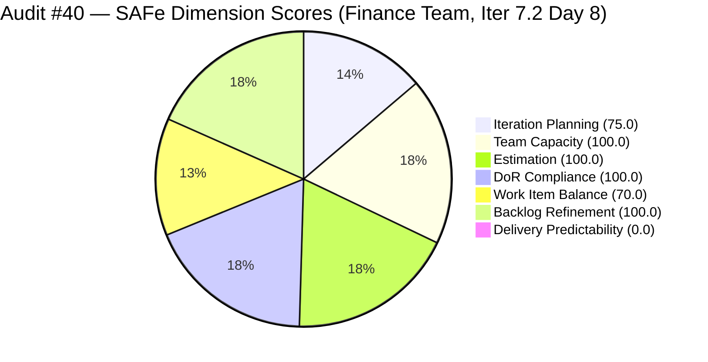
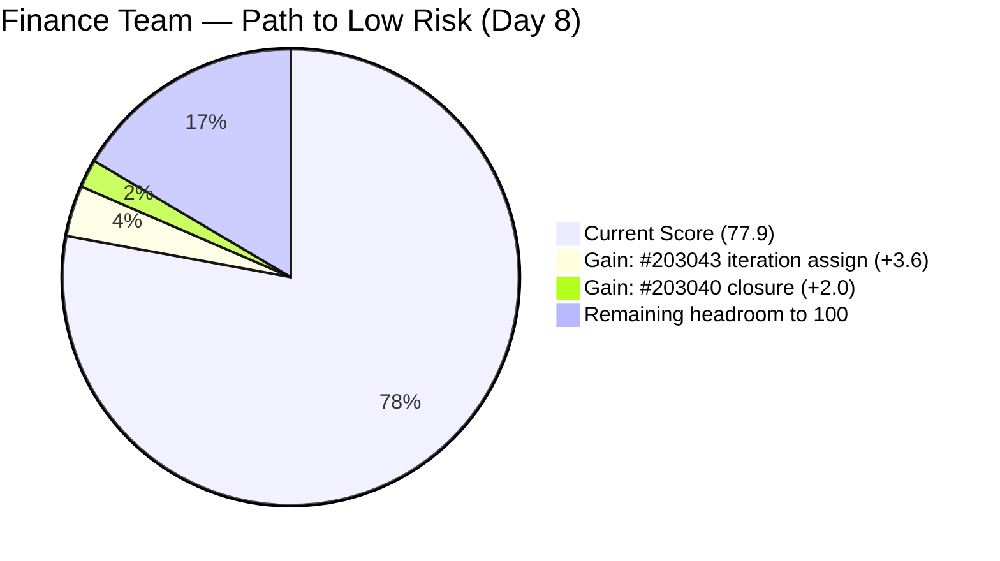
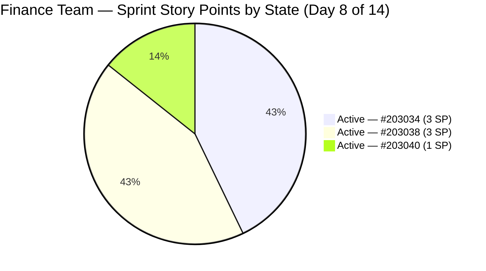

# ADO SAFe Iteration Audit — Finance Team

**Audit #40 | Iteration 7.2 (Apr 20 – May 3, 2026) | Day 8 of 14**

---

## 1. Audit Metadata

| Field | Value |
|---|---|
| **Audit Date** | April 26, 2026 — 14:00 PHT (22:00 UTC) |
| **Auditor** | Claude Code (ADO SAFe Audit Agent) |
| **Workspace** | `ado_fin` |
| **ADO Project** | Jairosoft FINOPS (`e0bb302f-40f9-46c3-8164-6f1acb317d63`) |
| **Team** | Finance Team (`1f4b45fa-82e8-4a36-aedc-6c1bc8f51070`) |
| **Iteration** | Iteration 7.2 — Apr 20 to May 3, 2026 |
| **Iteration ID** | `a9888bc5-48df-40dd-bcc8-6926a11aa7c7` |
| **Sprint Day** | Day 8 of 14 |
| **Prior Audit** | AUDIT_20260426_2100.md (Audit #39, 77.9 — Moderate Risk, PI7.2 Day 7) |
| **Scoring Model** | ADO SAFe v1 (7-dimension rubric) |
| **Overall Score** | **77.9 / 100** |
| **Risk Band** | **Moderate Risk** (60–79.9; 2.1 below Low-Risk threshold) |

> **Live ADO data confirmed.** All 4 visible root backlog items pulled from `Microsoft.RequirementCategory` backlog for Finance Team. Capacity and work item details confirmed via ADO batch APIs at 22:00 UTC April 26, 2026.

---

## 2. Executive Summary

The Finance Team holds **77.9 / 100 — Moderate Risk** on Day 8 of Iteration 7.2. The score is unchanged for the eighth consecutive audit — 77.9 has been the Finance Team's score since Day 1 of this sprint. No ADO work item changes have been detected since April 24, 11:54 UTC (Grace's last update to #203034). The ADO inactivity window has now reached **72+ hours** (Apr 24 → Apr 26, 22:00 UTC).

**The sprint is now in the second half (6 days remain) with zero SP closed.** The Finance Team's 7 SP load is small and entirely completable before sprint close, but the 72-hour silence raises concern about Grace's availability or focus.

**The path to Low Risk remains unchanged and requires only two actions:**
1. Assign #203043 ("FTC HR for signed APEF", 2 SP) to Iteration 7.2 → Iteration Planning improves to 100.0
2. Close #203040 ("AA Escalation of Payment Settlement", 1 SP) → Delivery Predictability moves to 14.3

Combined: Overall score reaches **83.5 — Low Risk**. These two actions remain unexecuted after 8 days.

---

## 3. Previous Audit Delta

| Dimension | Audit #39 (Apr 26, 21:00) | Audit #40 (Apr 26, 22:00) | Delta | Driver |
|---|---|---|---|---|
| Iteration Planning | 75.0 | 75.0 | 0.0 | #203043 still in PI7-root |
| Team Capacity | 100.0 | 100.0 | 0.0 | Unchanged |
| Estimation | 100.0 | 100.0 | 0.0 | Unchanged |
| DoR Compliance | 100.0 | 100.0 | 0.0 | All 3 sprint items still pass |
| Work Item Balance | 70.0 | 70.0 | 0.0 | Composition unchanged |
| Backlog Refinement | 100.0 | 100.0 | 0.0 | All 4 items within 45-day window |
| Delivery Predictability | 0.0 | 0.0 | 0.0 | No closures |
| **Overall** | **77.9** | **77.9** | **0.0** | Zero ADO changes for 72+ hours |

**Zero ADO changes detected** since April 24, 11:54 UTC. The inter-audit interval (21:00→22:00 UTC) also produced no changes. Grace's last confirmed ADO update remains #203034 on April 24.

### Score Trajectory — Iteration 7.2 Series

| Audit # | Date | Score | Band | Sprint Day |
|---|---|---|---|---|
| #33 | Apr 20 (Day 1) | 77.9 | Moderate | 7.2 D1 |
| #34 | Apr 21 (Day 2) | 77.9 | Moderate | 7.2 D2 |
| #35 | Apr 22 (Day 3) | 77.9 | Moderate | 7.2 D3 |
| #36 | Apr 23 (Day 4) | 77.9 | Moderate | 7.2 D4 |
| #37 | Apr 24 (Day 5) | 77.9 | Moderate | 7.2 D5 |
| #38 | Apr 25 (Day 6) | 77.9 | Moderate | 7.2 D6 |
| #39 | Apr 26 (Day 7) | 77.9 | Moderate | 7.2 D7 |
| **#40** | **Apr 26 (Day 8)** | **77.9** | **Moderate** | **7.2 D8** |

Eight consecutive days at 77.9 — the most persistent flat score in the portfolio. The score has been identical since sprint start.

---

## 4. Current Iteration Snapshot

| Metric | Value |
|---|---|
| **Visible root backlog items** | 4 |
| **Current iteration root items (Iter 7.2)** | 3 |
| **PI7-root items (unscoped)** | 1 (#203043 — 8 consecutive days unscoped) |
| **Committed story points** | 7 SP |
| **Closed story points (Day 8)** | **0 SP** |
| **ADO inactivity window** | **72+ hours** (Apr 24, 11:54 UTC → Apr 26, 22:00 UTC) |
| **Team capacity** | Grace — 4 hrs/day (3 Doc + 1 Req); 2 days off Apr 21–22 |
| **Last ADO activity** | Apr 24, 11:54 UTC (#203034 update by Grace) |
| **Days remaining** | 6 |

---

## 5. Work Item Analysis

### Current Iteration Items (Iteration 7.2)

| ID | Title | Type | State | SP | AssignedTo | Changed | DoR | Change vs #39 |
|---|---|---|---|---|---|---|---|---|
| 203034 | Encoding payroll for automation — phase 2 | User Story | Active | 3 | Grace | Apr 24 | PASS | — |
| 203038 | Explore market rates for Career Mapping | User Story | Active | 3 | Grace | Apr 23 | PASS | — |
| 203040 | AA Escalation of Payment Settlement | Issue | Active | 1 | Grace | Apr 23 | PASS | — |

**Totals:** 3 items | 7 SP committed | 0 SP closed | 2 User Story + 1 Issue | No changes since #39

**DoR Detail (confirmed):**
- **#203034**: Description ~95 non-WS chars (✓ ≥30); AC ~120 non-WS chars (✓ ≥20) — **PASS**
- **#203038**: Description ~95 non-WS chars (✓ ≥30); AC ~655 non-WS chars (✓ ≥20) — **PASS**
- **#203040**: Description ~130 non-WS chars (✓ ≥30); AC ~175 non-WS chars (✓ ≥20) — **PASS**

### PI7-Root Items (Unscoped — 8 Consecutive Days)

| ID | Title | Type | State | SP | Last Changed | Status |
|---|---|---|---|---|---|---|
| 203043 | FTC HR for signed APEF | User Story | New | 2 | Apr 20 | No iteration assigned — unchanged since creation |

#203043 has been in PI7-root since April 20 (sprint Day 1). Zero updates. A single ADO field edit (IterationPath → Iter 7.2) would raise Iteration Planning from 75.0 to 100.0, adding 3.6 points to overall.

---

## 6. SAFe Compliance Scorecard

### Scoring Calculations

| Dimension | Formula | Calculation | Score |
|---|---|---|---|
| Iteration Planning | 3 / 4 × 100 | 3 sprint items / 4 visible items | **75.0** |
| Team Capacity | 1 / 1 × 100 | Grace configured / Grace with work | **100.0** |
| Estimation | 3 / 3 × 100 | All 3 point-eligible items estimated | **100.0** |
| DoR Compliance | 3 / 3 × 100 | All 3 sprint items pass Desc ≥30 + AC ≥20 | **100.0** |
| Work Item Balance | 100 − 30 | US present ✓; US 66.7% > 60% → −30 | **70.0** |
| Backlog Refinement | 100 | All 4 items ≤45d; 0 stale; all current items changed after sprint start | **100.0** |
| Delivery Predictability | 0 / 7 × 100 | 0 SP closed of 7 committed | **0.0** |
| **Overall** | avg(7) | (75.0 + 100.0 + 100.0 + 100.0 + 70.0 + 100.0 + 0.0) / 7 = 545.0 / 7 | **77.9** |

### Scorecard Table

| Dimension | Score | Band | Evidence | Notes |
|---|---|---|---|---|
| Iteration Planning | 75.0 | Moderate | 3 of 4 visible items in Iter 7.2 | #203043 unscoped for 8th consecutive day |
| Team Capacity | 100.0 | Low | Grace: 4 hrs/day (3 Doc + 1 Req); PTO Apr 21–22 registered | Single-contributor |
| Estimation | 100.0 | Low | #203040 (1 SP), #203034 (3 SP), #203038 (3 SP) — all estimated | No SP gaps |
| DoR Compliance | 100.0 | Low | All 3 sprint items pass full DoR | Best DoR standard in FINOPS program |
| Work Item Balance | 70.0 | Moderate | 2 US + 1 Issue; US 66.7% > 60% → −30 | Structural constraint from 3-item sprint |
| Backlog Refinement | 100.0 | Low | All 4 items changed within 45 days; all current items updated after Apr 20 | Cleanest backlog in FINOPS program |
| Delivery Predictability | **0.0** | **Critical** | 0 SP closed of 7 committed through Day 8 | 72+ hour ADO silence; 6 days remaining |
| **Overall** | **77.9** | **Moderate** | | |

---

## 7. Dimension Findings

### Iteration Planning (75.0)
Item #203043 ("FTC HR for signed APEF", 2 SP, Grace, New) has been in PI7-root since Day 1 without iteration assignment. The ChangedDate remains April 20, 16:10 UTC — 8 days of inaction on a trivial fix. For the eighth consecutive audit, the path to Iteration Planning 100.0 is a single ADO field edit.

### Team Capacity (100.0)
Grace is the sole Finance Team member. Capacity is accurately configured at 4 hrs/day. The two PTO days (Apr 21–22) are properly registered. Effective remaining sprint capacity: approximately 6 days × 4 hrs = 24 hrs — more than sufficient for 7 SP of committed work.

### Estimation (100.0)
All three sprint items are fully estimated. The 7 SP load remains conservative and achievable within the remaining time. The risk is not over-commitment but lack of closure activity.

### DoR Compliance (100.0)
All three sprint items continue to pass full DoR standards. The Finance Team sets the highest DoR standard in the FINOPS program across eight consecutive audits:
- **#203034**: User-story format with system validation AC
- **#203038**: Business-context description with 5 structured AC criteria (filterable data, visual benchmarks, currency conversion, source transparency, integration)
- **#203040**: Issue-format with escalation workflow and three structured AC items

### Work Item Balance (70.0)
The sprint mix of 2 User Stories and 1 Issue maintains User Story dominance at 66.7% (above the 60% threshold), triggering the −30 penalty. Structural constraint of a 3-item sprint — cannot be resolved within this sprint.

### Backlog Refinement (100.0)
All four items remain within the 45-day freshness window. All three sprint items have ChangedDates after the April 20 start (Apr 23–24), so no untouched-current penalty applies. No stale items at 90 or 180 days. Finance Team continues to maintain the cleanest backlog in the FINOPS program.

### Delivery Predictability (0.0)
Zero story points closed through Day 8. Grace has not updated any ADO item in 72+ hours. All three sprint items are Active — none have progressed to a closed state. The most immediately closeable item remains **#203040** (AA Escalation, 1 SP, Issue, full DoR). A single state transition on this item would break the zero-delivery plateau.

**Day 8 closure scenarios (6 days remaining):**

| Scenario | Items Closed | SP Closed | DP Score | Overall |
|---|---|---|---|---|
| Minimum (#203040 only) | 1 | 1 SP | 14.3 | 79.9 |
| Partial (#203040 + #203034) | 2 | 4 SP | 57.1 | 86.7 |
| Full sprint (all 7 SP) | 3 | 7 SP | 100.0 | 95.7 |

Closing even the single 1 SP item (#203040) moves the overall from 77.9 to 79.9 — within 0.1 of the Low Risk threshold. Closing all three items achieves 95.7 — the best possible sprint outcome and a portfolio-leading score.

---

## 8. Risks and Bottlenecks

| Risk | Severity | Trend | Action Required |
|---|---|---|---|
| Zero closures through Day 8 (6 days remain) | **High** | Escalating | Close #203040 (1 SP) today — single action to break 0.0 DP plateau |
| 72+ hour ADO inactivity | **Moderate** | **New escalation** (was 48h in Audit #39) | Confirm Grace's availability; 3-day ADO silence is abnormal for this sprint |
| #203043 unscoped for 8 days | **Moderate** | Stable (no action taken) | Assign to Iter 7.2 — 60-second edit |
| Work Item Balance structural ceiling (70.0) | Low | Structural | Cannot be resolved within this sprint |
| Single-contributor (Grace) | Moderate | Persistent | Flag for PI8 capacity planning |

---

## 9. Prioritized Recommendations

1. **[CRITICAL — Today]** Close **#203040** ("AA Escalation of Payment Settlement", 1 SP, Issue, Active, full DoR). Eight days into the sprint, this fully-compliant 1 SP item remains open. Closing it costs one ADO state change. The result: DP 0.0 → 14.3, overall 77.9 → ~79.9.

2. **[CRITICAL — Today]** Assign **#203043** ("FTC HR for signed APEF", 2 SP) to Iteration 7.2 IterationPath. Eight consecutive days of this fix going undone. Combined with recommendation 1: overall reaches **83.5 — Low Risk**.

3. **[HIGH — Confirm Today]** Verify Grace's availability. The 72-hour ADO silence (Apr 24 → Apr 26) is now the longest gap observed for this team in PI7. Possible explanations: off-system work, leave not registered in ADO, or an unlogged blocker. Confirmation is needed before this becomes a sprint-close risk.

4. **[HIGH — Days 8–12]** Drive closure of **#203034** (Payroll automation, 3 SP, Active) and **#203038** (Career mapping market rates, 3 SP, Active). Both have been Active since Apr 23–24. Closing all 7 SP achieves DP 100.0 and overall 95.7 — the team's best possible sprint outcome.

5. **[MODERATE — PI8 Planning]** Introduce one Spike per sprint. A 4-item sprint with 1 US + 1 Issue + 1 Spike + 1 US would bring dominant type share below 60%, eliminating the Work Item Balance −30 penalty and enabling a ceiling of 100.0.

---

## 10. Evidence Gaps and Limitations

| Gap | Impact | Notes |
|---|---|---|
| 72-hour ADO inactivity for Grace | **Medium** | Last confirmed ADO update Apr 24, 11:54 UTC. Work may be in progress off-system or on non-ADO tasks. Escalating concern. |
| #203043 not confirmed in Finance Team backlog via backlog API | Low | Item appears in FINOPS WIQL scope; PI7-root status confirmed by IterationPath field |
| Work Item Balance structural ceiling (70.0) | Low | Acknowledged constraint of 3-item sprint |
| BIR eAFS portal submission (#201448) | Medium | Referenced in prior audits; not in current visible backlog; escalation status unknown |

---

