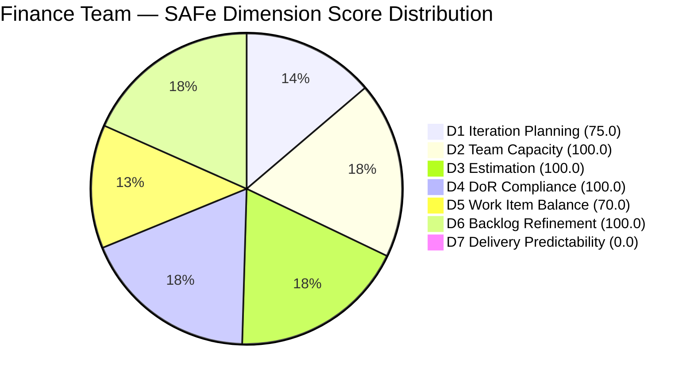
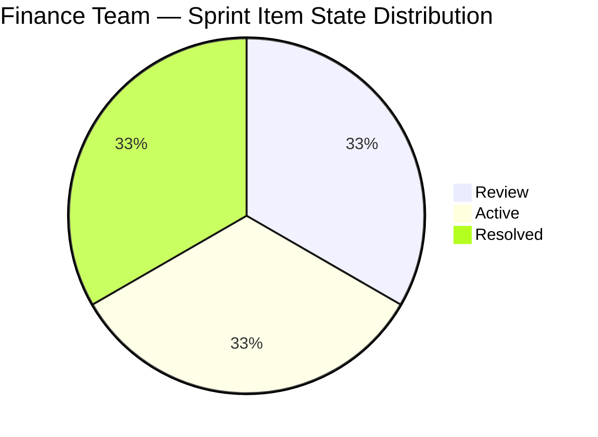
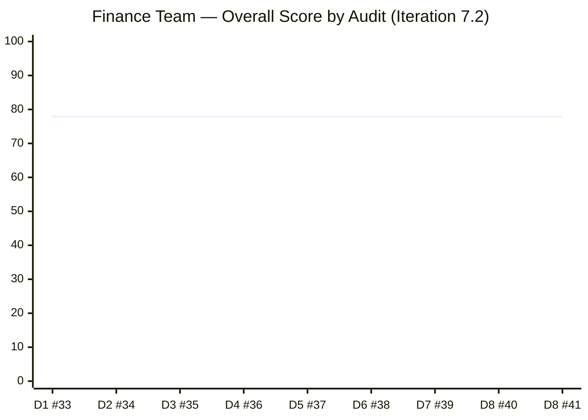

# ADO SAFe Iteration Audit — Finance Team

**Audit #41 | Iteration 7.2 (Apr 20 – May 3, 2026) | Day 8 of 14**

---

## 1. Audit Metadata

| Field | Value |
|---|---|
| **Audit Date** | April 27, 2026 — 11:10 CST |
| **Auditor** | Claude Code (ADO SAFe Audit Agent) |
| **Workspace** | `ado_fin` |
| **ADO Project** | Jairosoft FINOPS (`e0bb302f-40f9-46c3-8164-6f1acb317d63`) |
| **Team** | Finance Team (`1f4b45fa-82e8-4a36-aedc-6c1bc8f51070`) |
| **Iteration** | Iteration 7.2 — Apr 20 to May 3, 2026 |
| **Iteration ID** | `a9888bc5-48df-40dd-bcc8-6926a11aa7c7` |
| **Sprint Day** | Day 8 of 14 |
| **Prior Audit** | AUDIT_20260426_2200.md (Audit #40, 77.9 — Moderate Risk, PI7.2 Day 8) |
| **Scoring Model** | ADO SAFe v1 (7-dimension rubric) |
| **Overall Score** | **77.9 / 100** |
| **Risk Band** | **Moderate Risk** (60–79.9; 2.1 points below Low-Risk threshold) |

> **Live ADO data confirmed.** 4 visible root backlog items pulled from `Microsoft.RequirementCategory` backlog for Finance Team. Capacity and work item details confirmed via ADO batch APIs at 11:10 CST April 27, 2026.

---

## 2. Executive Summary

The Finance Team holds **77.9 / 100 — Moderate Risk** for the ninth consecutive audit. Today's audit detected **one new ADO change**: item **#203038** ("Explore market rates for Career Mapping", 3 SP) advanced to **Review** state at 06:52 UTC today — the first state change since #203040 was Resolved on April 27. However, Review is not Closed or Done, so Delivery Predictability remains at 0.0.

The sprint is now past its midpoint (Day 8 of 14, 6 days remaining) with **zero SP closed** out of 7 committed. Grace's ADO activity confirms she is working (#203038 is progressing), but the sprint cannot end without at least one closure.

**The path to Low Risk remains simple and immediately executable:**
1. Move #203043 ("FTC HR for signed APEF") into Iteration 7.2 → Iteration Planning → 100.0
2. Close #203040 (already Resolved, 1 SP) → Delivery Predictability → 14.3
3. Close #203038 (currently in Review, 3 SP) → Delivery Predictability → 57.1

If all three actions are taken, the overall score reaches **87.0 — Low Risk**.

---

## 3. Previous Audit Delta

| Dimension | Audit #40 (Apr 26, 22:00) | Audit #41 (Apr 27, 11:10) | Delta | Driver |
|---|---|---|---|---|
| Iteration Planning | 75.0 | 75.0 | 0.0 | #203043 still PI7-root unscoped |
| Team Capacity | 100.0 | 100.0 | 0.0 | Unchanged |
| Estimation | 100.0 | 100.0 | 0.0 | Unchanged |
| DoR Compliance | 100.0 | 100.0 | 0.0 | All 3 sprint items still pass |
| Work Item Balance | 70.0 | 70.0 | 0.0 | Composition unchanged (2 US + 1 Issue) |
| Backlog Refinement | 100.0 | 100.0 | 0.0 | All 4 items within 45-day window |
| Delivery Predictability | 0.0 | 0.0 | 0.0 | #203038 in Review, not yet Closed |
| **Overall** | **77.9** | **77.9** | **0.0** | Score unchanged — 9 consecutive days at 77.9 |

**ADO changes detected since Audit #40 (22:00 UTC Apr 26):**
- **#203038** ("Explore market rates for Career Mapping", 3 SP): `Active` → `Review` at 06:52 UTC Apr 27

This is the first ADO state transition in approximately 84 hours (since Apr 24, 11:54 UTC when Grace last updated #203034). Grace is active and #203038 is near completion.

### Score Trajectory — Iteration 7.2 Series

| Audit # | Date | Score | Band | Sprint Day |
|---|---|---|---|---|
| #33 | Apr 20 (Day 1) | 77.9 | Moderate | 7.2 D1 |
| #34 | Apr 21 (Day 2) | 77.9 | Moderate | 7.2 D2 |
| #35 | Apr 22 (Day 3) | 77.9 | Moderate | 7.2 D3 |
| #36 | Apr 23 (Day 4) | 77.9 | Moderate | 7.2 D4 |
| #37 | Apr 24 (Day 5) | 77.9 | Moderate | 7.2 D5 |
| #38 | Apr 25 (Day 6) | 77.9 | Moderate | 7.2 D6 |
| #39 | Apr 26 (Day 7) | 77.9 | Moderate | 7.2 D7 |
| #40 | Apr 26 (Day 8) | 77.9 | Moderate | 7.2 D8 |
| **#41** | **Apr 27 (Day 8)** | **77.9** | **Moderate** | **7.2 D8** |

Nine consecutive audits at 77.9 — the longest plateau in the current PI. The score will only move when a closure occurs or #203043 is assigned to the sprint.

---

## 4. Current Iteration Snapshot

| Metric | Value |
|---|---|
| **Visible root backlog items** | 4 |
| **Current iteration root items (Iter 7.2)** | 3 |
| **PI7-root unscoped items** | 1 (#203043 — 9 consecutive days unscoped) |
| **Committed story points** | 7 SP |
| **Closed story points** | 0 SP |
| **Remaining open SP** | 7 SP |
| **Sprint progress** | Day 8 of 14 (57% elapsed) |
| **SP delivery rate** | 0 SP / 8 days |
| **Team capacity per day** | 4 hrs/day (grace: Documentation 3 + Requirements 1) |
| **Days off this sprint** | 2 (Apr 21–22, already elapsed) |
| **Assignees on sprint items** | Grace (sole contributor) |
| **Bus factor** | 1 — critical single-person dependency |

### State Distribution — Current Iteration Items

| State | Count | SP | Items |
|---|---|---|---|
| Review | 1 | 3 | #203038 |
| Active | 1 | 3 | #203034 |
| Resolved | 1 | 1 | #203040 |
| **Total** | **3** | **7** | |

---

## 5. Work Item Analysis

### Current Iteration Root Items (3 items)

| ID | Title | Type | State | SP | DoR | AssignedTo | Changed |
|---|---|---|---|---|---|---|---|
| 203038 | Explore market rates for Career Mapping | User Story | **Review** | 3 | PASS | Grace | Apr 27 |
| 203034 | Encoding payroll for automation - phase2 | User Story | Active | 3 | PASS | Grace | Apr 24 |
| 203040 | AA Escalation of Payment Settlement | Issue | Resolved | 1 | PASS | Grace | Apr 27 |

### Unscoped PI7-Root Items (1 item)

| ID | Title | Type | State | SP | DoR | AssignedTo | Changed |
|---|---|---|---|---|---|---|---|
| 203043 | FTC HR for signed APEF | User Story | New | 2 | FAIL (no Desc/AC) | Grace | Apr 20 |

### DoR Detail

- **#203038**: As-a/I-want/So-that format; multi-criteria AC with filterable data, visual benchmarks, currency conversion, source transparency, integration. **PASS**
- **#203034**: As-a/I-want narrative; AC specifies "System blocks Submit if mandatory fields missing." **PASS**
- **#203040**: User-story format for escalation; AC specifies alert levels and status updates. **PASS**
- **#203043**: No Description, no Acceptance Criteria (rev 1 — never refined). **FAIL — unscoped and unready**

---

## 6. SAFe Compliance Scorecard

| Dimension | Score | Evidence | Notes |
|---|---|---|---|
| D1 Iteration Planning | 75.0 | 3 / 4 items in sprint | #203043 (2 SP) unscoped for 9 days; score would be 100.0 if assigned |
| D2 Team Capacity | 100.0 | 1 / 1 contributor with capacity | Grace (4 hrs/day: Documentation 3 + Requirements 1); 2 days off (Apr 21-22, elapsed) |
| D3 Estimation | 100.0 | 3 / 3 sprint items estimated | All items have SP > 0 |
| D4 DoR Compliance | 100.0 | 3 / 3 sprint items pass DoR | #203043 (unscoped) excluded from denominator |
| D5 Work Item Balance | 70.0 | Penalty: dominant type >60% | 2 US + 1 Issue; User Story = 66.7% → -30 |
| D6 Backlog Refinement | 100.0 | 4 / 4 fresh; 0 untouched current | All items changed within 45-day window; 0 sprint items untouched |
| D7 Delivery Predictability | 0.0 | 0 / 7 SP closed | #203038 in Review (not Closed); #203040 Resolved (not Closed/Done) |
| **Overall** | **77.9** | **(D1+D2+D3+D4+D5+D6+D7) / 7** | **Moderate Risk — 2.1 below Low Risk** |

---

## 7. Dimension Findings

### D1 — Iteration Planning (75.0)
Item #203043 ("FTC HR for signed APEF", 2 SP) has been in the PI7-root bucket for 9 consecutive days without sprint assignment. It was created on April 20 (sprint start day) and remains at rev 1 with no description or acceptance criteria. Assigning it to Iteration 7.2 would instantly raise D1 to 100.0, though it also fails DoR.

### D2 — Team Capacity (100.0)
Grace is fully configured with 4 hours per day across two activity types (Documentation 3, Requirements 1). Two days off (Apr 21–22) are already past. No remaining days off scheduled. Capacity configuration is adequate.

### D3 — Estimation (100.0)
All three sprint items carry story point estimates (3+3+1 = 7 SP total). The sprint load is light — the lowest of any team in the portfolio. This makes the lack of closures more significant: 7 SP over 14 days is well within Grace's capacity.

### D4 — DoR Compliance (100.0)
All three sprint items pass DoR. #203040 (Issue type) has a well-formed user story and quantified acceptance criteria. This is a strong result that has been maintained throughout the sprint.

### D5 — Work Item Balance (70.0)
The sprint contains 2 User Stories and 1 Issue. The presence of User Stories prevents the -40 penalty. However, User Story dominance at 66.7% exceeds the 60% threshold, incurring a -30 penalty. The balance is inherently constrained by the small 3-item sprint load — adding a Defect or Spike alongside current work would reduce the dominant-type share.

### D6 — Backlog Refinement (100.0)
All four visible backlog items were updated within the past 7 days. No stale items, no untouched sprint items. The backlog is small, well-maintained, and fully fresh. This is the Finance Team's structural strength.

### D7 — Delivery Predictability (0.0)
**#203038** advanced to Review today — this is a positive leading indicator. Review means the work is complete from Grace's perspective and awaiting final review/approval. If this item closes before the next audit, D7 moves to 42.9 (3/7 SP). If #203040 also transitions to Closed (it is currently Resolved), D7 reaches 57.1. The review queue for #203038 should be prioritized.

**Note on #203040:** The item is in "Resolved" state — one step short of Closed. This may indicate it is awaiting a stakeholder review or a formal acceptance step. Confirm and close if acceptance is complete.

---

## 8. Risks and Bottlenecks

| # | Risk | Severity | Status |
|---|---|---|---|
| R1 | 0 SP closed with 6 days remaining — all 7 SP at risk of slipping | High | Active |
| R2 | #203038 in Review — closure blocked on reviewer availability | Moderate | New today |
| R3 | #203040 stuck in Resolved — pending confirmation to close | Moderate | Persistent |
| R4 | #203043 unscoped for 9 days — missing from sprint commitment | Moderate | Persistent |
| R5 | Single contributor (Grace) — bus factor 1 | High | Persistent |
| R6 | Sprint is now past midpoint with 0 velocity evidence | High | Critical threshold |

---

## 9. Prioritized Recommendations

1. **[URGENT] Close #203040 today:** The item is already Resolved (1 SP). Confirm acceptance and move to Closed state. This requires zero additional work and immediately lifts D7 from 0.0 to 14.3.

2. **[URGENT] Complete review of #203038:** The 3 SP Career Mapping item is in Review — whoever needs to approve it should do so today. Closing this item alone moves D7 to 42.9. Closing both #203040 and #203038 brings D7 to 57.1 and overall score to **87.0 — Low Risk**.

3. **[HIGH] Assign #203043 to Iteration 7.2:** Move "FTC HR for signed APEF" from PI7-root into the sprint. Add at minimum a 30-char description and a 20-char acceptance criterion before assigning. This raises D1 from 75.0 to 100.0.

4. **[MEDIUM] Begin #203034 acceleration:** Payroll automation phase 2 (3 SP) is still Active. With the sprint more than half elapsed, Grace should target this item next after #203038 resolves.

5. **[LOW] Consider sprint scope for PI8 planning:** The Finance Team consistently runs light sprints (4 items or fewer). If the team's operational capacity supports it, adding one additional backlog item per sprint would improve throughput and Iteration Planning score sustainability.

---

## 10. Evidence Gaps and Limitations

| Gap | Impact | Action |
|---|---|---|
| #203043 has no Description or AC | Cannot assess readiness if assigned to sprint | Requires refinement before sprint assignment |
| #203040 in Resolved (not Closed) — distinction may be workflow artifact | D7 treats only Closed/Done as delivered | Confirm with Grace whether Resolved = accepted; close if yes |
| Only 4 visible root items — backlog aging computed on minimal sample | D6 = 100 is reliable given small, recent backlog | No action needed |
| Single member team — delivery depends entirely on Grace's availability | All risk concentrated in one person | No formula adjustment; escalation risk noted |

---

## Appendix: Mermaid Charts

### Score Breakdown — Finance Team Iteration 7.2 (Audit #41)

### Sprint State Distribution

### Score Trajectory — Iteration 7.2 Full Series

> Score has been flat at 77.9 for the entire sprint. Closure activity today (#203038 → Review) is the first sign the plateau may break in the next audit.
