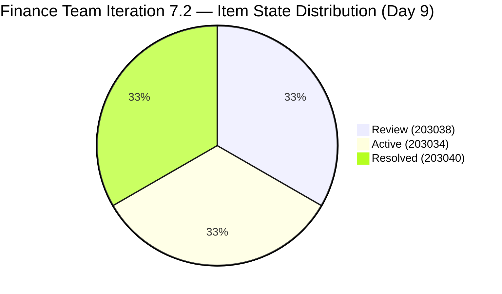
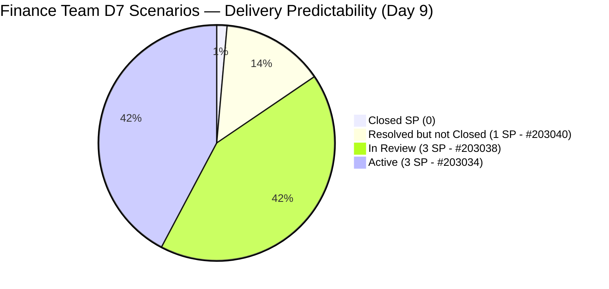

# ADO SAFe Iteration Audit — Finance Team

**Audit #42 | Iteration 7.2 (Apr 20 – May 3, 2026) | Day 9 of 14**

---

## 1. Audit Metadata

| Field | Value |
|---|---|
| **Audit Date** | April 28, 2026 — 09:02 UTC |
| **Auditor** | Claude Code (ADO SAFe Audit Agent) |
| **Workspace** | `ado_fin` |
| **ADO Project** | Jairosoft FINOPS (`e0bb302f-40f9-46c3-8164-6f1acb317d63`) |
| **Team** | Finance Team (`1f4b45fa-82e8-4a36-aedc-6c1bc8f51070`) |
| **Iteration** | Iteration 7.2 — Apr 20 to May 3, 2026 |
| **Iteration ID** | `a9888bc5-48df-40dd-bcc8-6926a11aa7c7` |
| **Sprint Day** | Day 9 of 14 |
| **Prior Audit** | AUDIT_20260427_1110.md (Audit #41, 77.9 — Moderate Risk, PI7.2 Day 8) |
| **Scoring Model** | ADO SAFe v1 (7-dimension rubric) |
| **Overall Score** | **77.9 / 100** |
| **Risk Band** | **Moderate Risk** (60–79.9; 2.1 points below Low-Risk threshold) |

> **Live ADO data confirmed.** 4 visible root backlog items in scope (Finance Team, `Microsoft.RequirementCategory`). 3 current iteration root items confirmed. Capacity and work item details confirmed via ADO batch APIs at 09:02 UTC April 28, 2026.

---

## 2. Executive Summary

The Finance Team remains at **77.9 / 100 — Moderate Risk** for the tenth consecutive audit. No ADO state changes were detected since Audit #41 (11:10 UTC Apr 27). Item **#203038** ("Explore market rates for Career Mapping", 3 SP) continues in **Review** state and has not advanced to Closed. Item **#203040** ("AA Escalation of Payment Settlement", 1 SP) remains in **Resolved** state — one step from Closed.

The sprint is now at Day 9 of 14 (64% elapsed) with **zero SP formally closed** and 5 working days remaining. Grace's last ADO activity was at 06:52 UTC Apr 27 (advancing #203038 to Review). The team is critically close to Low Risk: a single closure of #203040 (1 SP) would move D7 to 14.3.

**The path to Low Risk (80) remains immediately executable:**
1. Move #203043 ("FTC HR for signed APEF") into Iteration 7.2 → Iteration Planning → 100.0
2. Close #203040 (Resolved → Closed, 1 SP) → Delivery Predictability → 14.3
3. Close #203038 (Review → Closed, 3 SP) → Delivery Predictability → 57.1

Executing steps 1–3 raises the overall score to **87.0 — Low Risk**.

---

## 3. Previous Audit Delta

| Dimension | Audit #41 (Apr 27, 11:10) | Audit #42 (Apr 28, 09:02) | Delta | Driver |
|---|---|---|---|---|
| Iteration Planning | 75.0 | 75.0 | 0.0 | #203043 still PI7-root unscoped |
| Team Capacity | 100.0 | 100.0 | 0.0 | Unchanged |
| Estimation | 100.0 | 100.0 | 0.0 | Unchanged |
| DoR Compliance | 100.0 | 100.0 | 0.0 | All 3 sprint items pass |
| Work Item Balance | 70.0 | 70.0 | 0.0 | Composition unchanged (2 US + 1 Issue) |
| Backlog Refinement | 100.0 | 100.0 | 0.0 | All 4 backlog items fresh |
| Delivery Predictability | 0.0 | 0.0 | 0.0 | #203038 in Review, #203040 in Resolved — neither Closed |
| **Overall** | **77.9** | **77.9** | **0.0** | Tenth consecutive audit at 77.9 |

**ADO changes detected since Audit #41 (11:10 UTC Apr 27):** None detected. No state transitions or field updates on sprint items observed.

### Score Trajectory — Iteration 7.2 Series

| Audit # | Date | Score | Band | Sprint Day |
|---|---|---|---|---|
| #33 | Apr 20 (Day 1) | 77.9 | Moderate | 7.2 D1 |
| #34 | Apr 21 (Day 2) | 77.9 | Moderate | 7.2 D2 |
| #35 | Apr 22 (Day 3) | 77.9 | Moderate | 7.2 D3 |
| #36 | Apr 23 (Day 4) | 77.9 | Moderate | 7.2 D4 |
| #37 | Apr 24 (Day 5) | 77.9 | Moderate | 7.2 D5 |
| #38 | Apr 25 (Day 6) | 77.9 | Moderate | 7.2 D6 |
| #39 | Apr 26 (Day 7) | 77.9 | Moderate | 7.2 D7 |
| #40 | Apr 26 (Day 8) | 77.9 | Moderate | 7.2 D8 |
| #41 | Apr 27 (Day 8) | 77.9 | Moderate | 7.2 D8 |
| **#42** | **Apr 28 (Day 9)** | **77.9** | **Moderate** | **7.2 D9** |

Ten consecutive audits at 77.9 — the longest plateau in the portfolio. The score will only move when a closure occurs or #203043 is assigned to the sprint.

---

## 4. Current Iteration Snapshot

| Metric | Value |
|---|---|
| **Visible root backlog items** | 4 |
| **Current iteration root items (Iter 7.2)** | 3 |
| **PI7-root unscoped items** | 1 (#203043 — 10 consecutive days unscoped) |
| **Committed story points** | 7 SP |
| **Closed story points** | 0 SP |
| **Remaining open SP** | 7 SP |
| **Sprint progress** | Day 9 of 14 (64% elapsed) |
| **SP delivery rate** | 0 SP / 9 days |
| **SP required to reach Low Risk** | Close 4+ SP (D7 → 57.1) + scope #203043 (D1 → 100) |
| **Team capacity per day** | 4 hrs/day (Grace: Documentation 3 + Requirements 1) |
| **Days off this sprint** | 2 (Apr 21–22, elapsed) |
| **Assignees on sprint items** | Grace (sole contributor) |
| **Bus factor** | 1 — critical single-person dependency |

### State Distribution — Current Iteration Items

| State | Count | SP | Items |
|---|---|---|---|
| Review | 1 | 3 | #203038 |
| Active | 1 | 3 | #203034 |
| Resolved | 1 | 1 | #203040 |
| **Total** | **3** | **7** | |

---

## 5. Work Item Analysis

### Current Iteration Root Items (3 items)

| ID | Title | Type | State | SP | DoR | AssignedTo | Changed |
|---|---|---|---|---|---|---|---|
| 203038 | Explore market rates for Career Mapping | User Story | **Review** | 3 | PASS | Grace | Apr 27 |
| 203034 | Encoding payroll for automation – phase 2 | User Story | Active | 3 | PASS | Grace | Apr 24 |
| 203040 | AA Escalation of Payment Settlement | Issue | **Resolved** | 1 | PASS | Grace | Apr 27 |

### Unscoped PI7-Root Items (1 item)

| ID | Title | Type | State | SP | DoR | Changed |
|---|---|---|---|---|---|---|
| 203043 | FTC HR for signed APEF | User Story | New | 2 | FAIL (no Desc/AC) | Apr 20 |

### DoR Detail

- **#203038**: As-a/I-want/So-that format; multi-criterion AC covering filterable data, visual benchmarks, currency conversion, source transparency, and integration. **PASS**
- **#203034**: As-a/I-want narrative; AC specifies system blocks Submit if mandatory fields missing; validation mode specified. **PASS**
- **#203040**: Finance Manager user-story format; AC specifies alert levels (Level 1 at 5 days, escalation at 15 days, status update). **PASS**
- **#203043**: No Description, no Acceptance Criteria (rev 1 — never refined). **FAIL — unscoped and unready**

---

## 6. SAFe Compliance Scorecard

| Dimension | Score | Evidence | Notes |
|---|---|---|---|
| D1 Iteration Planning | 75.0 | 3 / 4 backlog items in sprint | #203043 unscoped for 10 days; score would be 100.0 if assigned |
| D2 Team Capacity | 100.0 | 1 / 1 contributor with capacity | Grace (4 hrs/day); 2 days off elapsed |
| D3 Estimation | 100.0 | 3 / 3 sprint items estimated | All items have SP > 0 |
| D4 DoR Compliance | 100.0 | 3 / 3 sprint items pass DoR | #203043 (unscoped) excluded from denominator |
| D5 Work Item Balance | 70.0 | Dominant type >60% penalty | 2 User Stories + 1 Issue; User Story = 66.7% → -30 |
| D6 Backlog Refinement | 100.0 | 4/4 backlog items within 45-day window | All items changed Apr 20 or later |
| D7 Delivery Predictability | 0.0 | 0 / 7 SP closed | #203038 in Review; #203040 in Resolved — neither is Closed/Done |
| **Overall** | **77.9** | **(75+100+100+100+70+100+0)/7** | **Moderate Risk** |

---

## 7. Dimension Findings

### D1 — Iteration Planning (75.0)
Three of four visible backlog items are scoped to Iteration 7.2. Item #203043 ("FTC HR for signed APEF") has been unscoped for 10 consecutive days with no Description or Acceptance Criteria. Either scope it to this sprint (if deliverable by May 3) or assign it to Iteration 7.3 to remove it from the unscoped count. This single action raises D1 from 75.0 to 100.0 and the overall score by ~3.6 points.

### D2 — Team Capacity (100.0)
Grace has 4 hrs/day configured (Documentation 3 + Requirements 1). Two days off (Apr 21–22) are elapsed. Capacity configuration is complete and accurate. Single contributor dependency (bus factor 1) is structural.

### D3 — Estimation (100.0)
All three sprint items carry Story Points. Estimation hygiene fully maintained.

### D4 — DoR Compliance (100.0)
All three sprint items pass DoR. Both User Stories have well-formed narratives and multi-criterion Acceptance Criteria. The Issue (#203040) has clear escalation rules. This is a consistent strength for the Finance Team.

### D5 — Work Item Balance (70.0)
Two User Stories (66.7%) and one Issue. The >60% dominant type penalty (-30) applies. The Issue type helps diversify the mix slightly (preventing the >60% penalty from being worse), but no Enablers, Spikes, or Defects are present. Work type for Finance naturally leans toward User Stories; consider introducing at least one Enabler or Spike to improve balance in future sprints.

### D6 — Backlog Refinement (100.0)
All four backlog items (including #203043) were changed within the last 45 days. No stale items. No untouched-current items (all sprint items were changed after Apr 20). Score is 100.0 with no penalties.

### D7 — Delivery Predictability (0.0)
Zero Story Points have been formally closed out of 7 committed. Two items are near closure:
- **#203040** (1 SP, Resolved): requires only a state transition to Closed. This should be done immediately.
- **#203038** (3 SP, Review): currently under review. If review passes today, Delivery Predictability jumps to 57.1 when closed.

If both items close this sprint, D7 = 57.1 and overall score = 87.0 (Low Risk). If only #203040 closes, D7 = 14.3 and overall = 79.9 (still Moderate, borderline). The sprint ends May 3 — 5 days remain.

---

## 8. Risks and Bottlenecks

| Risk | Severity | Status |
|---|---|---|
| Zero SP closed after 9 days — delivery not yet demonstrated | High | Critical blocker for Low Risk |
| #203040 in Resolved but not transitioned to Closed | Moderate | Immediate fix available; requires one click |
| #203038 in Review — dependent on reviewer approval | Moderate | Active; review pending since Apr 27 |
| Single contributor (Grace) — bus factor 1 | Moderate | Structural; unchanged all sprint |
| #203043 unscoped 10 days — Iteration Planning ceiling | Low | Score impact already factored in at 75.0 |

---

## 9. Prioritized Recommendations

1. **[Immediate] Close #203040** — Item is already Resolved. Transition to Closed to register 1 SP toward D7 (Delivery Predictability: 0.0 → 14.3). This requires a single state transition.
2. **[Today] Complete review of #203038** — If the review passes, close the item immediately (3 SP). This alone raises D7 from 14.3 to 57.1 and overall score to 87.0 — Low Risk.
3. **[Today] Assign #203043 to Iteration 7.2 or 7.3** — If deliverable by May 3, scope it to this sprint (D1: 75.0 → 100.0). If not, assign to Iteration 7.3 to clear the unscoped backlog debt.
4. **[Before sprint close] Add Description and AC to #203043** — The item has been at rev 1 since Apr 20. Even if deferred to Iteration 7.3, it should pass DoR before commitment.
5. **[PI planning] Address bus factor** — Grace is sole contributor on all sprint items. Consider cross-training or co-ownership with a second Finance Team member for PI 8.

---

## 10. Evidence Gaps and Limitations

| Gap | Impact | Mitigation |
|---|---|---|
| #203043 DoR status (no Desc/AC) — only confirmed via rev count and field absence | Minor | Field checks via batch API confirm absence; FAIL correctly applied |
| Resolved ≠ Closed in ADO — #203040 does not register as closed in delivery predictability | Per scoring formula (Closed or Done only) — correctly scored at 0 | Recommendation: transition to Closed to register SP delivery |
| No new ADO changes detected in this audit window | Limits delta analysis | Comprehensive baseline established from Apr 27 audit |
