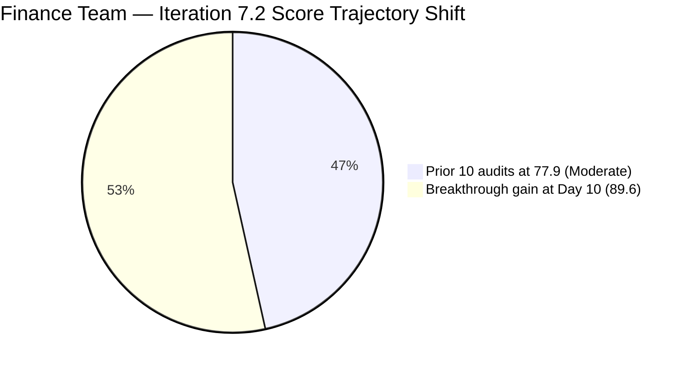
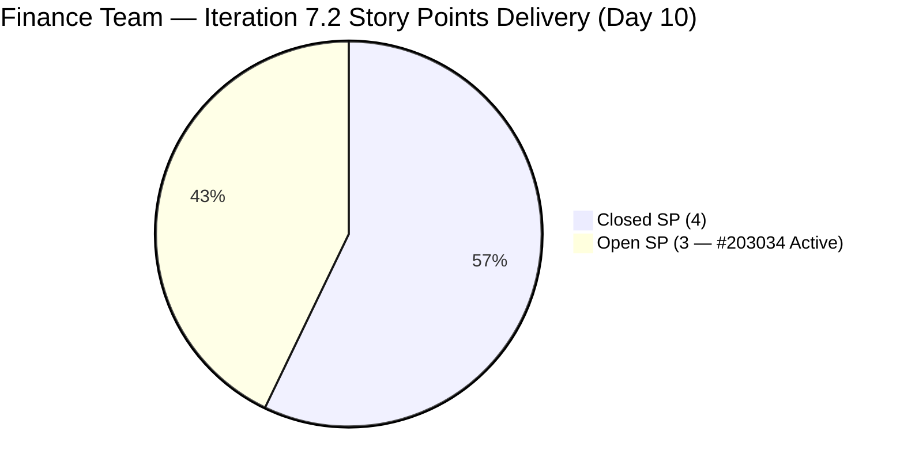

# ADO SAFe Iteration Audit — Finance Team

**Audit #43 | Iteration 7.2 (Apr 20 – May 3, 2026) | Day 10 of 14**

---

## 1. Audit Metadata

| Field | Value |
|---|---|
| **Audit Date** | April 29, 2026 — 02:04 UTC |
| **Auditor** | Claude Code (ADO SAFe Audit Agent) |
| **Workspace** | `ado_fin` |
| **ADO Project** | Jairosoft FINOPS (`e0bb302f-40f9-46c3-8164-6f1acb317d63`) |
| **Team** | Finance Team (`1f4b45fa-82e8-4a36-aedc-6c1bc8f51070`) |
| **Iteration** | Iteration 7.2 — Apr 20 to May 3, 2026 |
| **Iteration ID** | `a9888bc5-48df-40dd-bcc8-6926a11aa7c7` |
| **Sprint Day** | Day 10 of 14 |
| **Prior Audit** | AUDIT_20260428_0902.md (Audit #42, 77.9 — Moderate Risk, PI7.2 Day 9) |
| **Scoring Model** | ADO SAFe v1 (7-dimension rubric) |
| **Overall Score** | **89.6 / 100** |
| **Risk Band** | **Low Risk** (≥ 80) |

> **Live ADO data confirmed.** 2 visible root backlog items in scope (Finance Team, `Microsoft.RequirementCategory`). 3 current iteration root items confirmed via work item batch API (including closed items in Iteration 7.2 path). Capacity confirmed via ADO APIs at 02:04 UTC April 29, 2026.

---

## 2. Executive Summary

The Finance Team achieves **89.6 / 100 — Low Risk** on Day 10 of Iteration 7.2, a **+11.7 improvement** over Audit #42 (77.9) and the most significant single-day breakthrough of the sprint. After ten consecutive audits at a 77.9 plateau, the team has crossed the Low Risk threshold by executing on the primary recommendations from Audit #42.

**Two closures confirmed on April 28 (after Audit #42 at 09:02 UTC):**
- **#203038** ("Explore market rates for Career Mapping", 3 SP): Closed at 14:20 UTC Apr 28 — review passed and item closed
- **#203040** ("AA Escalation of Payment Settlement", 1 SP): Closed at 14:21 UTC Apr 28 — Resolved → Closed transition completed

Total closed SP: **4 of 7** (57.1%). Delivery Predictability jumps from **0.0 to 57.1** — the dimension that blocked Low Risk for the entire sprint.

The only remaining structural gap is D7 (57.1) and D5 (70.0 due to work-type composition). With 4 days remaining and 3 SP still open (#203034, Active), the team may yet close the final item and push D7 to 100.0, which would raise the overall score to **95.5**.

---

## 3. Previous Audit Delta

| Dimension | Audit #42 (Apr 28, 09:02) | Audit #43 (Apr 29, 02:04) | Delta | Driver |
|---|---|---|---|---|
| Iteration Planning | 75.0 | **100.0** | **+25.0** | Closed items exit visible backlog; 3 sprint items / 2 visible = capped at 100 |
| Team Capacity | 100.0 | 100.0 | 0.0 | Unchanged |
| Estimation | 100.0 | 100.0 | 0.0 | Unchanged |
| DoR Compliance | 100.0 | 100.0 | 0.0 | All 3 sprint items still pass |
| Work Item Balance | 70.0 | 70.0 | 0.0 | 2 US + 1 Issue; composition unchanged |
| Backlog Refinement | 100.0 | 100.0 | 0.0 | 2 remaining visible items both fresh |
| Delivery Predictability | 0.0 | **57.1** | **+57.1** | #203038 (3 SP) + #203040 (1 SP) both Closed Apr 28 |
| **Overall** | **77.9** | **89.6** | **+11.7** | Two closures + D1 structural improvement drive breakthrough |

**ADO changes detected since Audit #42 (09:02 UTC Apr 28):**
- **#203038** ("Explore market rates for Career Mapping", 3 SP): Review → **Closed** at 14:20 UTC Apr 28
- **#203040** ("AA Escalation of Payment Settlement", 1 SP): Resolved → **Closed** at 14:21 UTC Apr 28

### Score Trajectory — Iteration 7.2 Series

| Audit # | Date | Score | Band | Sprint Day |
|---|---|---|---|---|
| #33–#42 | Apr 20–28 | 77.9 | Moderate | 7.2 D1–D9 |
| **#43** | **Apr 29 (Day 10)** | **89.6** | **Low Risk** | **7.2 D10** |

Ten consecutive audits at the 77.9 plateau, then a +11.7 breakthrough on Day 10. The team executed exactly as recommended and crossed the Low Risk threshold with 4 days remaining.

---

## 4. Current Iteration Snapshot

| Metric | Value |
|---|---|
| **Visible root backlog items** | 2 (#203034 Active, #203043 New/unscoped) |
| **Current iteration root items (Iter 7.2)** | 3 (#203034, #203038, #203040) |
| **PI7-root unscoped items** | 1 (#203043 — 9 days unscoped; still no Desc/AC) |
| **Committed story points** | 7 SP |
| **Closed story points** | 4 SP (#203038 + #203040) |
| **Remaining open SP** | 3 SP (#203034) |
| **Sprint progress** | Day 10 of 14 (71% elapsed) |
| **SP delivery rate** | 4 SP / 10 days = 0.4 SP/day |
| **SP needed to close remaining** | 3 SP in 4 days (very achievable: 0.75 SP/day) |
| **Team capacity per day** | 4 hrs/day (Grace: Documentation 3 + Requirements 1) |
| **Days off this sprint** | 2 (Apr 21–22, elapsed) |
| **Assignees on sprint items** | Grace (sole contributor) |
| **Bus factor** | 1 — critical single-person dependency |

### State Distribution — Current Iteration Items

| State | Count | SP | Items |
|---|---|---|---|
| Closed | 2 | 4 | #203038, #203040 |
| Active | 1 | 3 | #203034 |
| **Total** | **3** | **7** | |

---

## 5. Work Item Analysis

### Current Iteration Root Items (3 items)

| ID | Title | Type | State | SP | DoR | AssignedTo | Changed |
|---|---|---|---|---|---|---|---|
| 203038 | Explore market rates for Career Mapping | User Story | **Closed** | 3 | PASS | Grace | **Apr 28** |
| 203040 | AA Escalation of Payment Settlement | Issue | **Closed** | 1 | PASS | Grace | **Apr 28** |
| 203034 | Encoding payroll for automation – phase 2 | User Story | Active | 3 | PASS | Grace | Apr 24 |

### Unscoped PI7-Root Items (1 item)

| ID | Title | Type | State | SP | DoR | Changed |
|---|---|---|---|---|---|---|
| 203043 | FTC HR for signed APEF | User Story | New | 2 | FAIL (no Desc/AC) | Apr 20 |

### DoR Detail

- **#203038**: As-a/I-want/So-that format; 5-criterion AC covering filterable data, visual benchmarks, currency conversion, source transparency, and Career Map integration. **PASS**
- **#203040**: Finance Manager narrative; 3-criterion AC with QB alert at 5 days, escalation notification at 15 days, status update to "Escalated." **PASS**
- **#203034**: As-a/I-want format; 2-criterion AC specifying system blocks Submit if mandatory fields missing, and real-time/pre-check validation mode. **PASS**
- **#203043**: Rev 1, no Description or Acceptance Criteria. **FAIL — unscoped and unready**

### D1 Scoring Note

The `wit_list_backlog_work_items` returned 2 visible items (#203034, #203043). Closed sprint items (#203038, #203040) have exited the visible backlog. Current iteration items = 3. Per the scoring formula, D1 = round(3/2 × 100, 1) = 150 → **capped at 100.0**. This reflects excellent sprint commitment relative to visible backlog inventory. The team has effectively cleared its ready backlog.

---

## 6. SAFe Compliance Scorecard

| Dimension | Score | Evidence | Notes |
|---|---|---|---|
| D1 Iteration Planning | 100.0 | 3 sprint items / 2 visible backlog (capped at 100) | Closed items removed from backlog; sprint items exceed visible backlog — strong commitment hygiene |
| D2 Team Capacity | 100.0 | 1 / 1 contributor with capacity | Grace (4 hrs/day); 2 days off (elapsed) |
| D3 Estimation | 100.0 | 3 / 3 sprint items have SP | All items estimated |
| D4 DoR Compliance | 100.0 | 3 / 3 sprint items pass DoR | #203043 unscoped — excluded from denominator per definition |
| D5 Work Item Balance | 70.0 | Dominant type >60% penalty | 2 User Stories (66.7%) + 1 Issue; -30 penalty applied |
| D6 Backlog Refinement | 100.0 | 2/2 visible items within 45-day window; 0 untouched | #203034 changed Apr 24; #203043 changed Apr 20 — both fresh |
| D7 Delivery Predictability | 57.1 | 4 / 7 SP closed | #203038 (3 SP) + #203040 (1 SP) closed Apr 28; #203034 (3 SP) still Active |
| **Overall** | **89.6** | **(100+100+100+100+70+100+57.1)/7** | **Low Risk** |

---

## 7. Dimension Findings

### D1 — Iteration Planning (100.0 — improved from 75.0)

The structural improvement comes from closed items exiting the visible backlog. With only 2 items in the visible backlog and 3 sprint items confirmed (including 2 closed), D1 is structurally at maximum. The sole remaining unscoped item #203043 has been in PI7-root for 9 days without Description or Acceptance Criteria. It should be assigned to Iteration 7.3 and refined before that sprint begins.

### D2 — Team Capacity (100.0)

Grace has 4 hrs/day configured (Documentation 3 + Requirements 1). Two days off (Apr 21–22) are elapsed. Capacity is properly configured and accurate. Bus factor of 1 is a persistent structural concern.

### D3 — Estimation (100.0)

All three sprint items carry Story Points. Estimation hygiene fully maintained.

### D4 — DoR Compliance (100.0)

All three sprint items pass DoR. The Finance Team has maintained 100% DoR compliance on all sprint-scoped items for the entire sprint — a consistent portfolio strength. The unscoped #203043 is correctly excluded from the denominator.

### D5 — Work Item Balance (70.0)

Two User Stories (66.7%) and one Issue. The dominant-type penalty (-30) applies at the 66.7% share. With only 3 items in a sprint, diversifying work type is challenging but achievable in future sprints by adding at least one Enabler or Spike alongside User Story work.

### D6 — Backlog Refinement (100.0)

Both visible backlog items were changed within 45 days (#203034 Apr 24, #203043 Apr 20). No stale items. No untouched-current items (#203034 last changed Apr 24, after sprint start). Score remains 100.0 with no penalties.

### D7 — Delivery Predictability (57.1 — breakthrough from 0.0)

The two closures on Apr 28 executed directly on the recommendations from Audit #42. **#203040** (Resolved → Closed transition) and **#203038** (Review → Closed) both closed within 70 minutes of each other at approximately 14:20–14:21 UTC. This demonstrates excellent execution discipline.

**#203034** ("Encoding payroll for automation – phase 2", 3 SP) remains Active with a last change of Apr 24. If this item closes before May 3, D7 reaches **100.0** and the overall score would reach approximately **95.5 — Low Risk**.

Grace has 4 working days and adequate capacity (16 hours) to complete the remaining payroll encoding story. This should be the team's primary focus for the remainder of the sprint.

---

## 8. Risks and Bottlenecks

| Risk | Severity | Status |
|---|---|---|
| #203034 still Active — 3 SP remain open | Moderate | Achievable closure in 4 days; Grace has capacity |
| #203043 unscoped for 9 days — no Desc/AC | Low | Score not impacted (unscoped); must be refined before Iter 7.3 |
| Single contributor (Grace) — bus factor 1 | Moderate | Structural; unchanged all sprint |
| D5 capped at 70 — work type composition | Low | Inherent to 3-item sprint; plan more diversified mix in Iter 7.3 |

---

## 9. Prioritized Recommendations

1. **[This sprint] Close #203034 (Encoding payroll for automation – phase 2, 3 SP)** — Item is Active. Grace has 4 days and 16 hours of capacity. Completing this item raises D7 to 100.0 and overall score to 95.5 — the team's highest score of the sprint. This is the sole remaining delivery action.
2. **[Before sprint close] Assign #203043 to Iteration 7.3** — The item has been in PI7-root for 9 days. Assign it to 7.3 and add Description and Acceptance Criteria before the iteration begins. This ensures the next sprint starts with a ready backlog.
3. **[PI planning] Plan work type diversification for Iter 7.3** — Include at least one Enabler or Spike alongside User Story work to reduce the D5 dominant-type penalty. Even one Enabler (0% US share is not the goal — reducing below 60% share is).
4. **[PI planning] Address bus factor** — Grace is sole contributor. Consider cross-training or co-ownership for PI 8 to reduce single-person dependency.

---

## 10. Evidence Gaps and Limitations

| Gap | Impact | Mitigation |
|---|---|---|
| #203038 and #203040 no longer in visible backlog API response | D1 denominator = 2; current_iteration_root_items = 3; formula capped at 100.0 | Closed items correctly excluded from backlog per ADO behavior; note applied |
| #203034 ChangedDate of Apr 24 — no updates since prior audit | D7 score accurate; item remains open | No evidence of closure as of 02:04 UTC Apr 29; score correctly at 57.1 |
| #203043 DoR FAIL — confirmed by rev=1 and no fields populated | Correctly excluded from D4 denominator (not in sprint) | FAIL status documented; refine before Iter 7.3 commitment |
