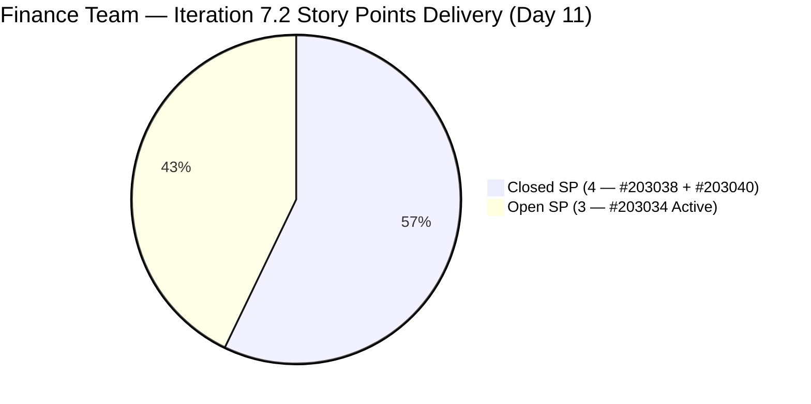
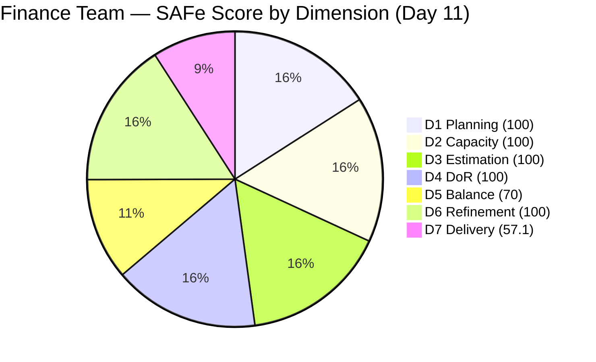

# ADO SAFe Iteration Audit — Finance Team

**Audit #44 | Iteration 7.2 (Apr 20 – May 3, 2026) | Day 11 of 14**

---

## 1. Audit Metadata

| Field | Value |
|---|---|
| **Audit Date** | April 30, 2026 — 09:03 UTC |
| **Auditor** | Claude Code (ADO SAFe Audit Agent) |
| **Workspace** | `ado_fin` |
| **ADO Project** | Jairosoft FINOPS (`e0bb302f-40f9-46c3-8164-6f1acb317d63`) |
| **Team** | Finance Team (`1f4b45fa-82e8-4a36-aedc-6c1bc8f51070`) |
| **Iteration** | Iteration 7.2 — Apr 20 to May 3, 2026 |
| **Iteration ID** | `a9888bc5-48df-40dd-bcc8-6926a11aa7c7` |
| **Sprint Day** | Day 11 of 14 |
| **Prior Audit** | AUDIT_20260429_0204.md (Audit #43, 89.6 — Low Risk, PI7.2 Day 10) |
| **Scoring Model** | ADO SAFe v1 (7-dimension rubric) |
| **Overall Score** | **89.6 / 100** |
| **Risk Band** | **Low Risk** (≥ 80) |

> **Live ADO data confirmed.** 2 visible root backlog items in scope (Finance Team, `Microsoft.RequirementCategory`). 3 current iteration root items confirmed via ADO batch API (IterationPath = Iteration 7.2). Capacity confirmed via ADO APIs at 09:03 UTC April 30, 2026.

---

## 2. Executive Summary

The Finance Team holds at **89.6 / 100 — Low Risk** on Day 11 of Iteration 7.2, unchanged from Audit #43 (89.6). No new closures have occurred since the Apr 28 burst that produced the D7 breakthrough. The team is steady in Low Risk territory with a single remaining open item.

**Current sprint position:**
- 2 of 3 sprint items closed (4 of 7 SP = 57.1% delivery)
- #203034 ("Encoding payroll for automation – phase 2", 3 SP) remains **Active**, last changed Apr 24
- Grace has 3 remaining working days and 12 hours of capacity to complete this item

The sole path to score improvement before sprint close is completing #203034. If closed, D7 reaches 100.0 and overall rises to **95.5 — Low Risk** (the team's sprint ceiling).

No structural changes to the backlog or sprint scope have occurred since Audit #43.

---

## 3. Previous Audit Delta

| Dimension | Audit #43 (Apr 29, 02:04) | Audit #44 (Apr 30, 09:03) | Delta | Driver |
|---|---|---|---|---|
| Iteration Planning | 100.0 | 100.0 | 0.0 | Unchanged; 3 sprint items vs. 2 visible backlog |
| Team Capacity | 100.0 | 100.0 | 0.0 | Grace: 4 hrs/day; 2 days off (elapsed) |
| Estimation | 100.0 | 100.0 | 0.0 | All 3 items have SP |
| DoR Compliance | 100.0 | 100.0 | 0.0 | All 3 sprint items pass |
| Work Item Balance | 70.0 | 70.0 | 0.0 | 2 US + 1 Issue; composition unchanged |
| Backlog Refinement | 100.0 | 100.0 | 0.0 | 2 fresh visible items; 0 untouched |
| Delivery Predictability | 57.1 | 57.1 | 0.0 | No new closures; #203034 still Active |
| **Overall** | **89.6** | **89.6** | **0.0** | Steady — no change since Apr 28 burst |

**ADO changes detected since Audit #43 (02:04 UTC Apr 29):**
- **None.** #203034 last changed Apr 24. No state transitions, new items, or field updates detected.

### Score Trajectory — Iteration 7.2 Series

| Audit # | Date | Score | Band | Sprint Day |
|---|---|---|---|---|
| #33–#42 | Apr 20–28 | 77.9 | Moderate | 7.2 D1–D9 |
| #43 | Apr 29 (Day 10) | 89.6 | Low Risk | 7.2 D10 |
| **#44** | **Apr 30 (Day 11)** | **89.6** | **Low Risk** | **7.2 D11** |

The team is stable in Low Risk. The plateau at 89.6 is expected — the only remaining improvement path is closing #203034.

---

## 4. Current Iteration Snapshot

| Metric | Value |
|---|---|
| **Visible root backlog items** | 2 (#203034 Active, #203043 unscoped) |
| **Current iteration root items (Iter 7.2)** | 3 (#203034, #203038, #203040) |
| **Committed story points** | 7 SP |
| **Closed story points** | 4 SP (#203038 + #203040) |
| **Remaining open SP** | 3 SP (#203034) |
| **Sprint progress** | Day 11 of 14 (79% elapsed) |
| **SP delivery rate** | 4 SP / 11 days = 0.36 SP/day |
| **Days remaining** | 3 |
| **Capacity remaining** | ~12 hours (Grace, 4 hrs/day × 3 days) |
| **Closing #203034 feasibility** | High — 3 SP in 12 available hours is well within capacity |
| **Team capacity per day** | 4 hrs/day (Grace: Documentation 3 + Requirements 1) |
| **Days off this sprint** | 2 (Apr 21–22, elapsed) |
| **Assignees on sprint items** | Grace (sole contributor) |
| **Bus factor** | 1 — critical single-person dependency |

### State Distribution — Current Iteration Items

| State | Count | SP | Items |
|---|---|---|---|
| Closed | 2 | 4 | #203038, #203040 |
| Active | 1 | 3 | #203034 |
| **Total** | **3** | **7** | |

---

## 5. Work Item Analysis

### Current Iteration Root Items (3 items)

| ID | Title | Type | State | SP | DoR | AssignedTo | Changed |
|---|---|---|---|---|---|---|---|
| 203038 | Explore market rates in references for Career Mapping | User Story | **Closed** | 3 | PASS | Grace | Apr 28 |
| 203040 | AA Escalation of Payment Settlement | Issue | **Closed** | 1 | PASS | Grace | Apr 28 |
| 203034 | Encoding payroll for automation – phase 2 | User Story | Active | 3 | PASS | Grace | Apr 24 |

### DoR Detail — Current Sprint Items

| ID | Description | Acceptance Criteria | DoR |
|---|---|---|---|
| 203038 | As-a/I-want/So-that format; career path planning narrative. PASS (≥30 chars) | 5 criteria: filterable data, visual benchmarks, currency conversion, source transparency, Career Map integration. PASS (≥20 chars) | **PASS** |
| 203040 | Finance Manager narrative; auto-notify on unpaid invoices >15 days. PASS (≥30 chars) | 3 criteria: QB alert at 5 days, notification at 15 days, status update to "Escalated". PASS (≥20 chars) | **PASS** |
| 203034 | As-a Payroll Administrator narrative; auto-flag discrepancies between encoded rates and contract terms. PASS (≥30 chars) | 2 criteria: system blocks Submit if mandatory fields missing; real-time/pre-check validation. PASS (≥20 chars) | **PASS** |

### Unscoped PI7-Root Item

| ID | Title | Type | State | SP | DoR | Changed |
|---|---|---|---|---|---|---|
| 203043 | FTC HR for signed APEF | User Story | New | 2 | FAIL (no Desc/AC — rev=1) | Apr 20 |

#203043 has been unscoped for 10 days with no description or acceptance criteria. It must be refined before commitment to Iteration 7.3.

### D1 Scoring Note

The backlog API returns 2 visible items (#203034, #203043). Closed sprint items (#203038, #203040) have exited the visible backlog. With 3 current iteration items and 2 visible backlog items, D1 = round(3/2 × 100, 1) = 150 → **capped at 100.0**. This reflects complete sprint commitment against the available ready backlog.

---

## 6. SAFe Compliance Scorecard

| Dimension | Score | Evidence | Notes |
|---|---|---|---|
| D1 Iteration Planning | 100.0 | 3 sprint items / 2 visible backlog (capped at 100) | Closed items exit backlog; strong commitment hygiene maintained |
| D2 Team Capacity | 100.0 | 1 / 1 contributor with positive capacity | Grace, 4 hrs/day; 2 days off elapsed |
| D3 Estimation | 100.0 | 3 / 3 sprint items have SP > 0 | Full estimation hygiene |
| D4 DoR Compliance | 100.0 | 3 / 3 sprint items pass Desc + AC check | #203043 unscoped — correctly excluded from denominator |
| D5 Work Item Balance | 70.0 | 2 US (66.7%) + 1 Issue; dominant type > 60% | Has User Story ✓; dominant type -30 penalty; 3-item sprint limits diversification |
| D6 Backlog Refinement | 100.0 | 2/2 visible items fresh; 0 untouched | #203034 changed Apr 24 (>Apr 20 sprint start); #203043 changed Apr 20 |
| D7 Delivery Predictability | 57.1 | 4 / 7 SP closed | #203034 (3 SP) still Active; unchanged since Apr 24 |
| **Overall** | **89.6** | **(100+100+100+100+70+100+57.1)/7** | **Low Risk** |

---

## 7. Dimension Findings

### D1 — Iteration Planning (100.0)

The team has fully committed against its visible ready backlog. Two of three sprint items are closed, and the remaining two backlog items (#203034 Active, #203043 unscoped) are known quantities. D1 is structurally at maximum and will remain there for the sprint duration.

For Iteration 7.3, #203043 must be refined (Description + AC added) before it can be committed. Additionally, if any new items are created for 7.3, they should enter the sprint with full DoR documentation.

### D2 — Team Capacity (100.0)

Grace's capacity is fully configured: 4 hours/day (Documentation 3 + Requirements 1). The two days off (Apr 21–22) are elapsed. With 3 working days remaining (Apr 30, May 1, May 2), Grace has approximately 12 hours of available capacity.

### D3 — Estimation (100.0)

All three sprint items carry Story Points (3 + 1 + 3 = 7 SP total). Estimation hygiene has been perfect throughout the sprint.

### D4 — DoR Compliance (100.0)

All three sprint items pass the DoR check. The Finance Team has maintained 100% DoR compliance on all sprint-scoped items for the entire sprint — a consistent portfolio strength. The unscoped #203043 is correctly excluded from the denominator (it is not in the current iteration).

### D5 — Work Item Balance (70.0)

Two User Stories (66.7%) and one Issue. The 66.7% User Story share exceeds the 60% threshold, triggering the -30 dominant-type penalty. With only 3 items in a sprint, diversifying work types is structurally difficult. To eliminate the penalty, the team would need to bring User Story share below 60% — achievable in a 5+ item sprint with at least 2 non-User Story items (Enabler, Spike, or Issue).

For Iteration 7.3 planning: consider pairing #203043 (User Story) with an Enabler or Spike to reduce the dominant-type share.

### D6 — Backlog Refinement (100.0)

Both visible backlog items were changed within the 45-day fresh window (#203034 Apr 24, #203043 Apr 20). Neither item has a ChangedDate earlier than the sprint start date (Apr 20), so the untouched-current penalty does not apply. No stale_90 or stale_180 items exist.

### D7 — Delivery Predictability (57.1 — unchanged)

The D7 plateau at 57.1 reflects the static state of #203034. The item has not been updated since Apr 24 (6 days). Grace's last activity was the Apr 28 closure burst (#203038 and #203040). There is no evidence of active work on #203034 in the past 6 days.

**Risk assessment:** With 3 days remaining and 3 SP open, the item is completable, but the 6-day silence since last update is a mild concern. If Grace is waiting for a downstream dependency (e.g., data from payroll system or confirmation from stakeholders), the item may not close before May 3.

**Projection scenarios:**
- If #203034 closes before May 3: D7 = 100.0; overall = **95.5 — Low Risk**
- If #203034 remains open: D7 = 57.1; overall = **89.6 — Low Risk** (current state)

Both scenarios are Low Risk. The sprint is secured. Closing #203034 is a stretch goal.

---

## 8. Risks and Bottlenecks

| Risk | Severity | Status |
|---|---|---|
| #203034 not updated since Apr 24 — 6-day silence | Moderate | Grace has capacity; unknown if blocked by dependency |
| #203043 unscoped for 10 days — no Desc/AC | Low | Not in current sprint; must be refined before Iter 7.3 commitment |
| D5 capped at 70 — 3-item sprint limits type diversification | Low | Inherent to small sprint; plan more diverse mix in Iter 7.3 |
| Single contributor (Grace) — bus factor 1 | Moderate | Structural; unchanged all sprint |

---

## 9. Prioritized Recommendations

1. **[Today — High Priority] Re-engage on #203034 (Encoding payroll for automation – phase 2, 3 SP)** — Last changed Apr 24. If the payroll encoding work is in progress, update the item with a progress note or status comment. If blocked, document the blocker so it can be escalated. Grace has 12 hours of capacity remaining.
2. **[Before sprint close] Close #203034 if work is complete** — This is the sole remaining delivery action. Completion raises D7 to 100.0 and overall to 95.5 — the team's sprint ceiling.
3. **[Before sprint close / Iter 7.3 prep] Refine #203043 (FTC HR for signed APEF)** — Add Description (≥30 non-whitespace chars) and Acceptance Criteria (≥20 non-whitespace chars) before committing to Iteration 7.3. The item has been in PI7-root for 10 days without documentation.
4. **[Iter 7.3 planning] Diversify work item types** — Include at least one Enabler or Spike alongside User Story work to reduce the D5 dominant-type penalty. A 5-item sprint with 2 Enablers/Issues and 3 User Stories would bring User Story share to 60%, eliminating the penalty.
5. **[PI 8 planning] Address bus factor** — Grace is the sole Finance Team contributor. Consider cross-training or co-ownership arrangements for PI 8.

---

## 10. Evidence Gaps and Limitations

| Gap | Impact | Mitigation |
|---|---|---|
| #203034 last changed Apr 24 — no progress evidence available | D7 correctly reflects 4/7 SP closed; cannot confirm work is in progress | Grace should update the item with a progress note regardless of closure status |
| #203043 DoR: FAIL confirmed by rev=1 and no Description/AC fields populated | Correctly excluded from D4 denominator (not in sprint) | Item must be refined before Iter 7.3 commitment |
| D1 cap applied: 3 sprint items / 2 visible backlog = 150 → capped at 100 | Formula capping is correct per rubric; score reflects strong commitment hygiene | Noted and documented; no scoring error |
| 2 days off (Apr 21–22) reduce available sprint hours from ~56 to ~48 | D7 denominator is SP-based, not hours-based; no direct scoring impact | Capacity correctly reflected in team capacity API |
