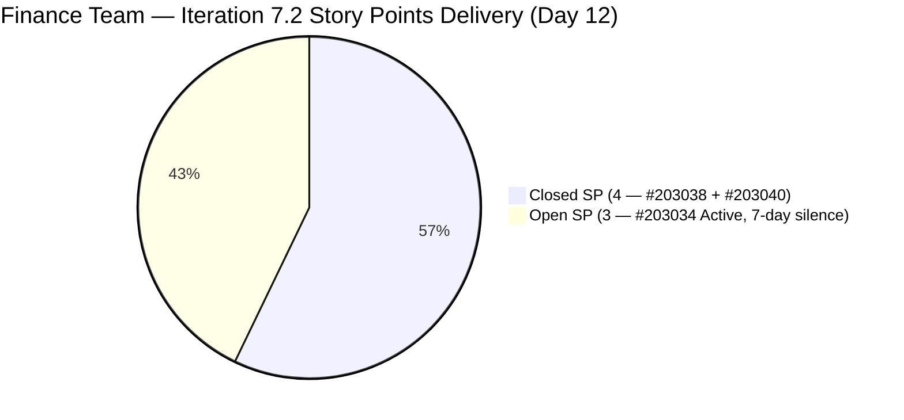
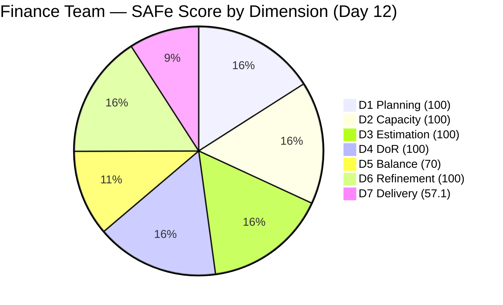

# ADO SAFe Iteration Audit — Finance Team

**Audit #45 | Iteration 7.2 (Apr 20 – May 3, 2026) | Day 12 of 14**

---

## 1. Audit Metadata

| Field | Value |
|---|---|
| **Audit Date** | May 1, 2026 — 09:03 UTC |
| **Auditor** | Claude Code (ADO SAFe Audit Agent) |
| **Workspace** | `ado_fin` |
| **ADO Project** | Jairosoft FINOPS (`e0bb302f-40f9-46c3-8164-6f1acb317d63`) |
| **Team** | Finance Team (`1f4b45fa-82e8-4a36-aedc-6c1bc8f51070`) |
| **Iteration** | Iteration 7.2 — Apr 20 to May 3, 2026 |
| **Iteration ID** | `a9888bc5-48df-40dd-bcc8-6926a11aa7c7` |
| **Sprint Day** | Day 12 of 14 |
| **Prior Audit** | AUDIT_20260430_0903.md (Audit #44, 89.6 — Low Risk, PI7.2 Day 11) |
| **Scoring Model** | ADO SAFe v1 (7-dimension rubric) |
| **Overall Score** | **89.6 / 100** |
| **Risk Band** | **Low Risk** (≥ 80) |

> **Live ADO data confirmed.** 2 visible root backlog items in scope (Finance Team, `Microsoft.RequirementCategory`). 3 current iteration root items confirmed via `wit_get_work_items_for_iteration` (IterationPath = Iteration 7.2). Capacity and work item details confirmed via ADO batch APIs at 09:03 UTC May 1, 2026.

---

## 2. Executive Summary

The Finance Team holds at **89.6 / 100 — Low Risk** on Day 12 of Iteration 7.2, **unchanged from Audit #44** (89.6). The sprint remains secured in Low Risk with the single remaining delivery action being closure of **#203034** ("Encoding payroll for automation – phase 2", 3 SP).

**Critical alert:** #203034 has now been silent for **7 days** (last changed Apr 24, 11:54 UTC). This is the longest silence on any open item across all three audited teams. With only 2 working days remaining (May 1–2; May 3 = Sunday), the window to complete and close this item is narrowing.

**Sprint position:**
- 2 of 3 items Closed (4 of 7 SP = 57.1% delivery)
- If #203034 closes: D7 = 100.0; overall = **95.5** (sprint ceiling — Low Risk)
- If #203034 remains Active: D7 = 57.1; overall = **89.6** (current state — Low Risk)

Both scenarios are Low Risk. The sprint is secured. Closing #203034 is a high-value stretch goal.

---

## 3. Previous Audit Delta

| Dimension | Audit #44 (Apr 30, 09:03) | Audit #45 (May 1, 09:03) | Delta | Driver |
|---|---|---|---|---|
| Iteration Planning | 100.0 | 100.0 | 0.0 | Unchanged; 3 sprint items vs. 2 visible backlog |
| Team Capacity | 100.0 | 100.0 | 0.0 | Grace: 4 hrs/day; 2 days off (elapsed) |
| Estimation | 100.0 | 100.0 | 0.0 | All 3 items have SP |
| DoR Compliance | 100.0 | 100.0 | 0.0 | All 3 sprint items pass |
| Work Item Balance | 70.0 | 70.0 | 0.0 | 2 US + 1 Issue; composition unchanged |
| Backlog Refinement | 100.0 | 100.0 | 0.0 | 2 fresh visible items; 0 untouched |
| Delivery Predictability | 57.1 | 57.1 | 0.0 | #203034 still Active; 7-day silence continues |
| **Overall** | **89.6** | **89.6** | **0.0** | Stable — no ADO changes detected |

**ADO changes detected since Audit #44 (09:03 UTC Apr 30):**
- **None.** #203034 last changed Apr 24, 11:54 UTC. 7 consecutive days with no update. No state transitions, no new items, no field changes detected.

### Score Trajectory — Iteration 7.2 Series

| Audit # | Date | Score | Band | Sprint Day |
|---|---|---|---|---|
| #33–#42 | Apr 20–28 | 77.9 | Moderate | 7.2 D1–D9 |
| #43 | Apr 29 (Day 10) | 89.6 | Low Risk | 7.2 D10 |
| #44 | Apr 30 (Day 11) | 89.6 | Low Risk | 7.2 D11 |
| **#45** | **May 1 (Day 12)** | **89.6** | **Low Risk** | **7.2 D12** |

The team is stable in Low Risk. The plateau at 89.6 is expected — the only remaining path to improvement is closing #203034.

---

## 4. Current Iteration Snapshot

| Metric | Value |
|---|---|
| **Visible root backlog items** | 2 (#203034 Active, #203043 unscoped) |
| **Current iteration root items (Iter 7.2)** | 3 (#203034, #203038, #203040) |
| **Committed story points** | 7 SP |
| **Closed story points** | 4 SP (#203038 + #203040) |
| **Remaining open SP** | 3 SP (#203034) |
| **Sprint progress** | Day 12 of 14 (86% elapsed) |
| **Days remaining** | 2 working days (May 1–2; May 3 = Sunday) |
| **Capacity remaining** | ~8 hours (Grace, 4 hrs/day × 2 days) |
| **Closing #203034 feasibility** | High — 3 SP in 8 hours is well within capacity; *if not blocked* |
| **Item silence** | **7 days** since last update (Apr 24) — critical flag |
| **Team capacity per day** | 4 hrs/day (Grace: Documentation 3 + Requirements 1) |
| **Days off this sprint** | 2 (Apr 21–22, elapsed) |
| **Assignees on sprint items** | Grace (sole contributor) |
| **Bus factor** | 1 — critical single-person dependency |

### State Distribution — Current Iteration Items

| State | Count | SP | Items |
|---|---|---|---|
| Closed | 2 | 4 | #203038, #203040 |
| Active | 1 | 3 | #203034 |
| **Total** | **3** | **7** | |

---

## 5. Work Item Analysis

### Current Iteration Root Items (3 items)

| ID | Title | Type | State | SP | DoR | AssignedTo | Changed | Silence |
|---|---|---|---|---|---|---|---|---|
| 203038 | Explore market rates in references for Career Mapping | User Story | **Closed** | 3 | PASS | Grace | Apr 28 | — |
| 203040 | AA Escalation of Payment Settlement | Issue | **Closed** | 1 | PASS | Grace | Apr 28 | — |
| 203034 | Encoding payroll for automation – phase 2 | User Story | **Active** | 3 | PASS | Grace | Apr 24 | **7 days** |

### DoR Detail — Current Sprint Items

| ID | Description | Acceptance Criteria | DoR |
|---|---|---|---|
| 203034 | As-a Payroll Administrator narrative; auto-flag discrepancies between encoded rates and contract terms. PASS (≥30 chars) | 2 criteria: system blocks Submit if mandatory fields missing; real-time/pre-check validation. PASS (≥20 chars) | **PASS** |
| 203038 | As-a/I-want/So-that format; career path planning narrative. PASS (≥30 chars) | 5 criteria: filterable data, visual benchmarks, currency conversion, source transparency, Career Map integration. PASS (≥20 chars) | **PASS** |
| 203040 | Finance Manager narrative; auto-notify on unpaid invoices >15 days. PASS (≥30 chars) | 3 criteria: QB alert at 5 days, notification at 15 days, status update to "Escalated". PASS (≥20 chars) | **PASS** |

### #203034 — Silence Analysis

| Field | Value |
|---|---|
| Last Changed | Apr 24, 11:54 UTC |
| Days Silent | **7 days** (as of May 1) |
| Prior audit comment | No evidence of active work in prior audit either |
| Risk | Unknown status — item may be blocked, waiting for dependency, or work may be complete |
| Capacity available | Grace has 8 hours remaining (May 1–2) |
| Feasibility | 3 SP is achievable in 8 hours; the silence is the primary concern |

The 7-day silence is the single most actionable finding in this audit. Grace should update the item today regardless of closure status. If blocked by a system dependency (e.g., payroll system access, stakeholder sign-off), the blocker must be documented and escalated.

### Unscoped PI7-Root Item

| ID | Title | Type | State | SP | DoR | Changed |
|---|---|---|---|---|---|---|
| 203043 | FTC HR for signed APEF | User Story | New | 2 | FAIL (no Desc/AC — rev=1) | Apr 20 |

#203043 has been unscoped for 11 days with no description or acceptance criteria. Must be refined before Iteration 7.3 commitment.

### D1 Scoring Note

The backlog API returns 2 visible items (#203034, #203043). Closed sprint items (#203038, #203040) have exited the visible backlog. With 3 current iteration items and 2 visible backlog items, D1 = round(3/2 × 100, 1) = 150 → **capped at 100.0**. This reflects complete sprint commitment against the available ready backlog.

---

## 6. SAFe Compliance Scorecard

| Dimension | Score | Evidence | Notes |
|---|---|---|---|
| D1 Iteration Planning | 100.0 | 3 sprint items / 2 visible backlog (capped at 100) | Full commitment against available backlog; consistent with prior audits |
| D2 Team Capacity | 100.0 | 1 / 1 contributor with positive capacity | Grace, 4 hrs/day; 2 days off elapsed; ~8 hours remaining |
| D3 Estimation | 100.0 | 3 / 3 sprint items have SP > 0 | Full estimation hygiene maintained |
| D4 DoR Compliance | 100.0 | 3 / 3 sprint items pass Desc + AC check | #203043 unscoped — correctly excluded from denominator |
| D5 Work Item Balance | 70.0 | 2 US (66.7%) + 1 Issue; dominant type > 60% | Has User Story ✓; dominant type -30 penalty; 3-item sprint limits diversification |
| D6 Backlog Refinement | 100.0 | 2/2 visible items changed within sprint window | #203034 changed Apr 24 (>Apr 20 start); #203043 changed Apr 20 |
| D7 Delivery Predictability | 57.1 | 4 / 7 SP closed | #203034 (3 SP) still Active; 7-day silence; unchanged since Apr 24 |
| **Overall** | **89.6** | **(100+100+100+100+70+100+57.1)/7** | **Low Risk** |

---

## 7. Dimension Findings

### D1 — Iteration Planning (100.0 — unchanged)

Full commitment against the available ready backlog. Two of three sprint items are closed, and the sprint scope is stable. D1 is structurally at maximum and will remain there for the sprint duration.

For Iteration 7.3, #203043 must be refined (Description + Acceptance Criteria added) before it can be committed. Additionally, any new items for 7.3 should enter the sprint with full DoR documentation.

### D2 — Team Capacity (100.0 — unchanged)

Grace's capacity is fully configured: 4 hours/day (Documentation 3 + Requirements 1). The two days off (Apr 21–22) are elapsed. With 2 working days remaining (May 1–2), Grace has approximately 8 hours of available capacity.

### D3 — Estimation (100.0 — unchanged)

All three sprint items carry Story Points (3 + 1 + 3 = 7 SP total). Estimation hygiene has been perfect throughout the sprint.

### D4 — DoR Compliance (100.0 — unchanged)

All three sprint items pass DoR. The Finance Team has maintained 100% DoR compliance on sprint-scoped items for the entire sprint. The unscoped #203043 is correctly excluded from the denominator.

### D5 — Work Item Balance (70.0 — unchanged)

Two User Stories (66.7%) and one Issue. The 66.7% User Story share exceeds the 60% threshold, triggering the -30 dominant-type penalty. With only 3 items in a sprint, diversifying work types is structurally difficult. For Iteration 7.3: consider pairing #203043 (User Story) with an Enabler or Spike to reduce the dominant-type share.

### D6 — Backlog Refinement (100.0 — unchanged)

Both visible backlog items were changed within the 45-day fresh window (#203034 Apr 24, #203043 Apr 20). The untouched-current penalty does not apply — both items were changed after the sprint start date (Apr 20). No stale_90 or stale_180 items exist.

**D6 forward risk:** If #203034 is not updated by May 5 (when the sprint closes and Iter 7.3 begins), the item's ChangedDate (Apr 24) will be approaching the untouched-current threshold for the next iteration. Grace should update the item today.

### D7 — Delivery Predictability (57.1 — unchanged, 7-day silence)

D7 has been static since Audit #43 (Apr 29). The 7-day silence on #203034 is the longest gap between updates on any open item in this sprint series. Possible interpretations:

1. **Work is complete but not yet closed in ADO** — Grace may have finished the payroll automation encoding work but has not updated the ticket. This is the most optimistic scenario.
2. **Blocked by downstream dependency** — The payroll system or a stakeholder sign-off may be required before the automation feature can be validated. No blocker is documented in ADO.
3. **Deprioritized** — Grace may have shifted focus to other activities not tracked in ADO.

With 8 hours of capacity remaining, scenario 1 is recoverable today. Scenarios 2 and 3 result in the item remaining Active at sprint close (D7 = 57.1; overall = 89.6 — still Low Risk).

**Projection scenarios:**
- If #203034 closes today (May 1) or tomorrow (May 2): D7 = 100.0; overall = **95.5 — Low Risk**
- If #203034 remains Active: D7 = 57.1; overall = **89.6 — Low Risk** (current state)

---

## 8. Risks and Bottlenecks

| Risk | Severity | Status |
|---|---|---|
| #203034 not updated for 7 days — Apr 24 to May 1 | **High** | Silence exceeds typical sprint cadence; status unknown; may be blocked or complete |
| 2 working days remain; window to close #203034 is closing | Moderate | Grace has 8 hrs capacity; item is 3 SP (feasible if unblocked) |
| #203043 unscoped for 11 days — no Desc/AC | Low | Not in current sprint; must be refined before Iter 7.3 commitment |
| D5 capped at 70 — 3-item sprint limits type diversification | Low | Inherent to small sprint; plan more diverse mix in Iter 7.3 |
| Single contributor (Grace) — bus factor 1 | Moderate | Structural; unchanged all sprint |

---

## 9. Prioritized Recommendations

1. **[Today — Critical] Re-engage immediately on #203034 (Encoding payroll for automation – phase 2, 3 SP)** — The 7-day silence is the most urgent issue for this team. Grace must update the item with current status today: either document that work is complete and close it, or document the specific blocker so it can be escalated. 8 hours of capacity remain.
2. **[Today if work is complete] Close #203034** — If the payroll encoding automation work is done (system blocks Submit on missing fields; pre-check validation is functional), document the completed AC and close the item. D7 rises to 100.0 and overall to 95.5.
3. **[Before sprint close / Iter 7.3 prep] Refine #203043 (FTC HR for signed APEF)** — Add Description (≥30 non-whitespace chars) and Acceptance Criteria (≥20 non-whitespace chars) before committing to Iteration 7.3. The item has been in PI7-root for 11 days without documentation.
4. **[Iter 7.3 planning] Diversify work item types** — Include at least one Enabler or Spike alongside User Story work to reduce the D5 dominant-type penalty. A 5-item sprint with 2 Enablers/Issues and 3 User Stories brings User Story share to 60%, eliminating the penalty.
5. **[PI 8 planning] Address bus factor** — Grace is the sole Finance Team contributor. Consider cross-training or co-ownership arrangements for PI 8.

---

## 10. Evidence Gaps and Limitations

| Gap | Impact | Mitigation |
|---|---|---|
| #203034 last changed Apr 24, 11:54 UTC — 7-day silence; no progress evidence in ADO | D7 correctly reflects 4/7 SP closed; status of payroll encoding work is unknown | Grace must update the item today; if blocked, document the blocker |
| #203043 DoR: FAIL confirmed (rev=1; no Description/AC fields) | Correctly excluded from D4 denominator (not in sprint); no scoring impact | Must be refined before Iter 7.3 commitment |
| D1 cap applied: 3 sprint items / 2 visible backlog = 150 → capped at 100 | Formula capping is correct per rubric; reflects strong commitment hygiene | Noted and documented; no scoring error |
| 2 days off (Apr 21–22) reduce available sprint hours from ~56 to ~48 | D7 denominator is SP-based, not hours-based; no direct scoring impact | Capacity correctly reflected in team capacity API |
| Sprint end date (May 3) falls on a Sunday | Effective work window may end May 2 (Saturday) | Grace should target closure by end of May 2 |
